# API Reference

<cite>
**Referenced Files in This Document**   
- [main.rs](file://src-tauri/src/main.rs)
- [lib.rs](file://src-tauri/src/lib.rs)
- [config.rs](file://src-tauri/src/commands/config.rs)
- [clients.rs](file://src-tauri/src/commands/clients.rs)
- [sync.rs](file://src-tauri/src/commands/sync.rs)
- [marketplace.rs](file://src-tauri/src/commands/marketplace.rs)
- [installation.rs](file://src-tauri/src/commands/installation.rs)
- [health.rs](file://src-tauri/src/commands/health.rs)
- [keychain.rs](file://src-tauri/src/commands/keychain.rs)
- [tauri.ts](file://src/lib/tauri.ts)
- [useServers.ts](file://src/hooks/useServers.ts)
- [useHealth.ts](file://src/hooks/useHealth.ts)
- [useCredentials.ts](file://src/hooks/useCredentials.ts)
- [useMarketplace.ts](file://src/hooks/useMarketplace.ts)
- [useUpdates.ts](file://src/hooks/useUpdates.ts)
- [useClients.ts](file://src/hooks/useClients.ts)
- [useDoctor.ts](file://src/hooks/useDoctor.ts)
- [index.ts](file://src/types/index.ts)
</cite>

## Table of Contents

1. [Introduction](#introduction)
2. [Tauri Commands](#tauri-commands)
   - [Server Management](#server-management)
   - [Client Synchronization](#client-synchronization)
   - [Marketplace Operations](#marketplace-operations)
   - [Installation and Updates](#installation-and-updates)
   - [Credential Operations](#credential-operations)
   - [Health Checks](#health-checks)
3. [Data Models](#data-models)
4. [React Hooks](#react-hooks)
5. [Type Safety and Serialization](#type-safety-and-serialization)
6. [Error Handling Patterns](#error-handling-patterns)

## Introduction

This document provides comprehensive API documentation for the internal interfaces and integration points within MCP Nexus. The application uses Tauri to bridge a React frontend with a Rust backend, exposing various commands for server management, client synchronization, health checks, updates, and credential operations. The API surface is designed with type safety in mind, using shared TypeScript definitions and Serde serialization between frontend and backend.

**Section sources**

- [main.rs](file://src-tauri/src/main.rs#L1-L7)
- [lib.rs](file://src-tauri/src/lib.rs#L1-L89)

## Tauri Commands

### Server Management

The server management commands provide CRUD operations for MCP servers and configuration management.

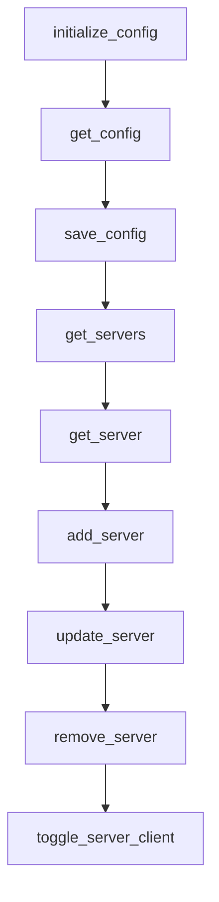

**Diagram sources**

- [config.rs](file://src-tauri/src/commands/config.rs#L38-L151)
- [tauri.ts](file://src/lib/tauri.ts#L38-L84)

**Section sources**

- [config.rs](file://src-tauri/src/commands/config.rs#L38-L151)
- [tauri.ts](file://src/lib/tauri.ts#L38-L84)

### Client Synchronization

The client synchronization commands handle detection, status checking, and configuration syncing for AI clients.

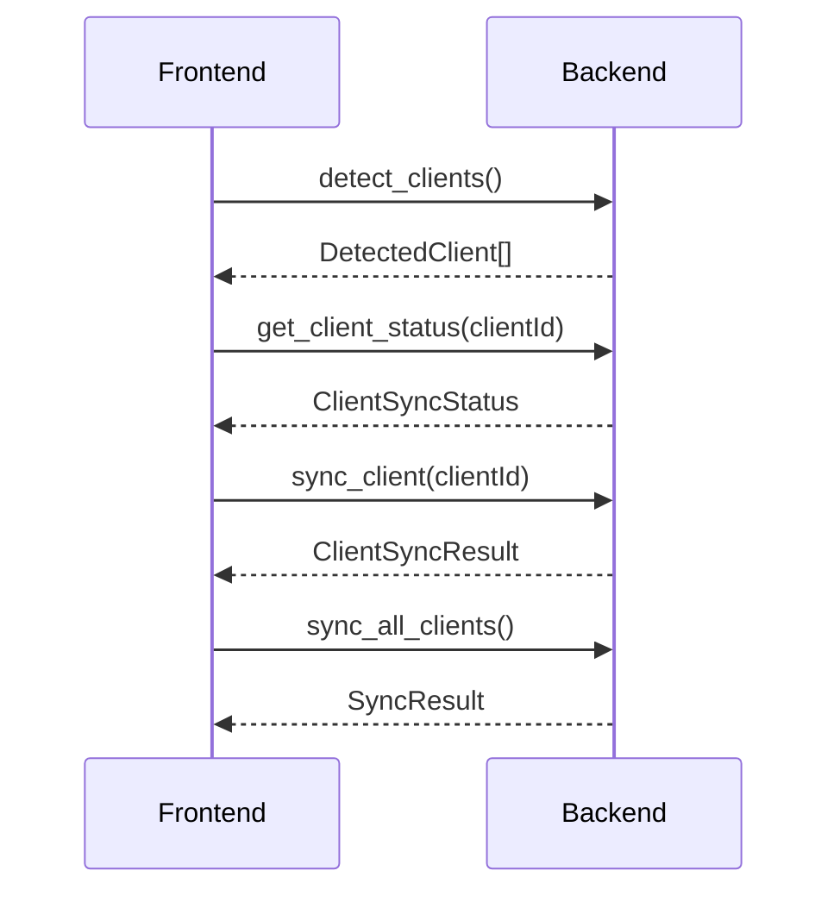

**Diagram sources**

- [clients.rs](file://src-tauri/src/commands/clients.rs#L12-L170)
- [sync.rs](file://src-tauri/src/commands/sync.rs#L72-L252)
- [tauri.ts](file://src/lib/tauri.ts#L88-L143)

**Section sources**

- [clients.rs](file://src-tauri/src/commands/clients.rs#L12-L170)
- [sync.rs](file://src-tauri/src/commands/sync.rs#L72-L252)
- [tauri.ts](file://src/lib/tauri.ts#L88-L143)

### Marketplace Operations

The marketplace commands enable searching for and retrieving information about MCP servers from the PulseMCP directory.

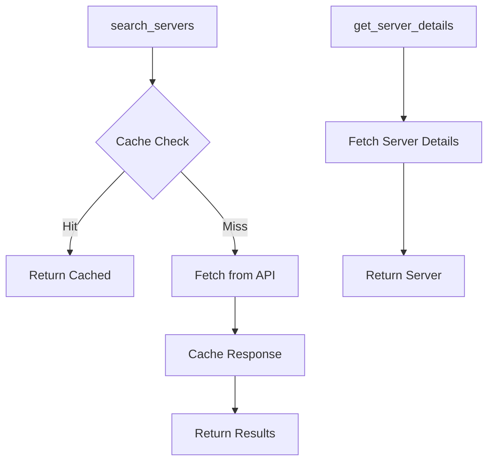

**Diagram sources**

- [marketplace.rs](file://src-tauri/src/commands/marketplace.rs#L128-L236)
- [tauri.ts](file://src/lib/tauri.ts#L198-L223)

**Section sources**

- [marketplace.rs](file://src-tauri/src/commands/marketplace.rs#L128-L236)
- [tauri.ts](file://src/lib/tauri.ts#L198-L223)

### Installation and Updates

The installation commands handle server installation, uninstallation, and update checking operations.

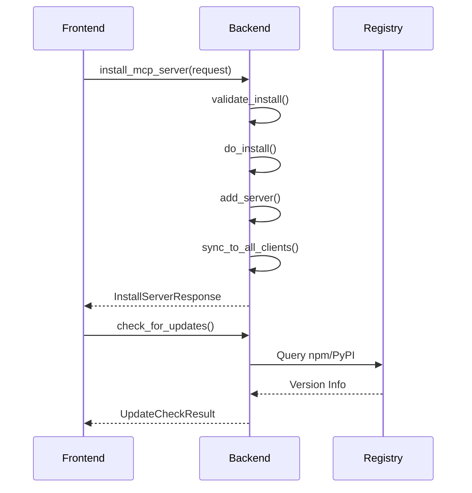

**Diagram sources**

- [installation.rs](file://src-tauri/src/commands/installation.rs#L98-L288)
- [updates.rs](file://src-tauri/src/commands/updates.rs)
- [tauri.ts](file://src/lib/tauri.ts#L236-L334)

**Section sources**

- [installation.rs](file://src-tauri/src/commands/installation.rs#L98-L288)
- [updates.rs](file://src-tauri/src/commands/updates.rs)
- [tauri.ts](file://src/lib/tauri.ts#L236-L334)

### Credential Operations

The credential commands manage secure storage and retrieval of sensitive information using the system keychain.

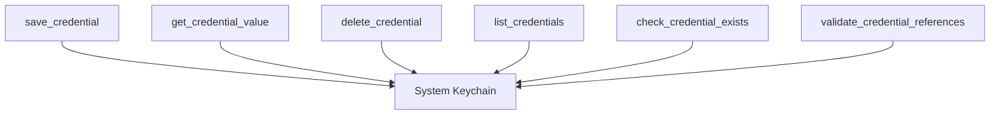

**Diagram sources**

- [keychain.rs](file://src-tauri/src/commands/keychain.rs)
- [tauri.ts](file://src/lib/tauri.ts#L161-L194)

**Section sources**

- [keychain.rs](file://src-tauri/src/commands/keychain.rs)
- [tauri.ts](file://src/lib/tauri.ts#L161-L194)

### Health Checks

The health check commands monitor server availability and status.

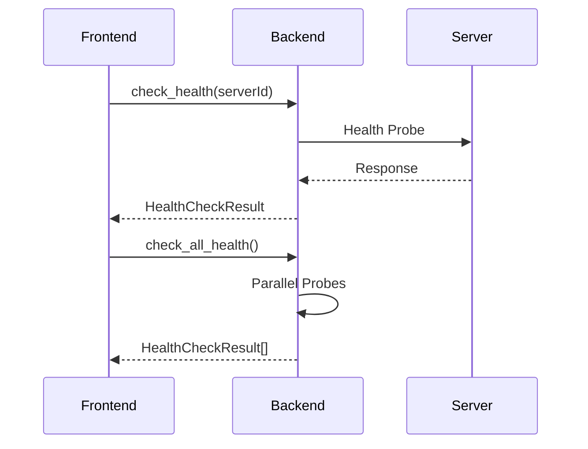

**Diagram sources**

- [health.rs](file://src-tauri/src/commands/health.rs)
- [tauri.ts](file://src/lib/tauri.ts#L340-L364)

**Section sources**

- [health.rs](file://src-tauri/src/commands/health.rs)
- [tauri.ts](file://src/lib/tauri.ts#L340-L364)

## Data Models

This section documents the core data models used throughout the application, with field types, validation rules, and serialization formats.

### McpServer

Represents an MCP server configuration.

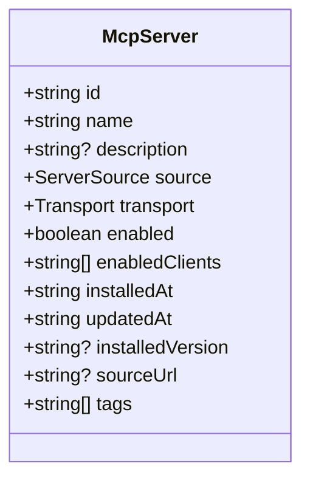

**Diagram sources**

- [index.ts](file://src/types/index.ts#L38-L51)

**Section sources**

- [index.ts](file://src/types/index.ts#L38-L51)

### MarketplaceServer

Represents a server from the PulseMCP marketplace.

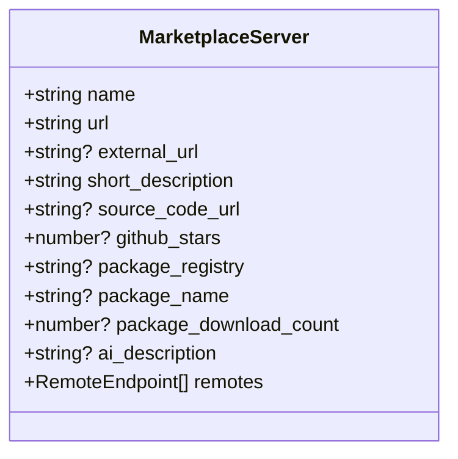

**Diagram sources**

- [index.ts](file://src/types/index.ts#L179-L202)

**Section sources**

- [index.ts](file://src/types/index.ts#L179-L202)

### ServerSource

Represents an MCP server's source/installation type.

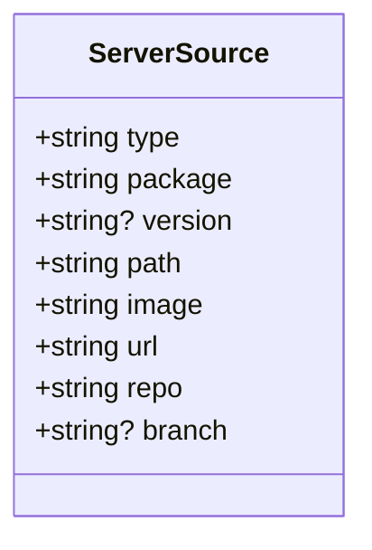

**Diagram sources**

- [index.ts](file://src/types/index.ts#L15-L21)

**Section sources**

- [index.ts](file://src/types/index.ts#L15-L21)

### Transport

Transport mechanism for communicating with the MCP server.

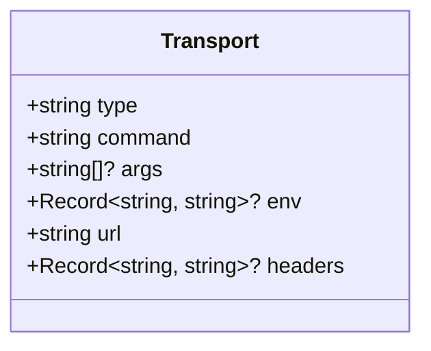

**Diagram sources**

- [index.ts](file://src/types/index.ts#L24-L35)

**Section sources**

- [index.ts](file://src/types/index.ts#L24-L35)

## React Hooks

This section documents the React hooks that provide a convenient interface to the Tauri commands.

### useServers

Hook for server management operations.

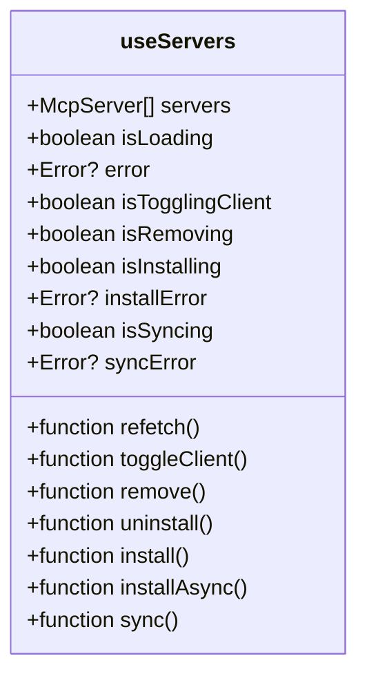

**Diagram sources**

- [useServers.ts](file://src/hooks/useServers.ts#L146-L182)

**Section sources**

- [useServers.ts](file://src/hooks/useServers.ts#L146-L182)

### useHealth

Hook for health check operations.

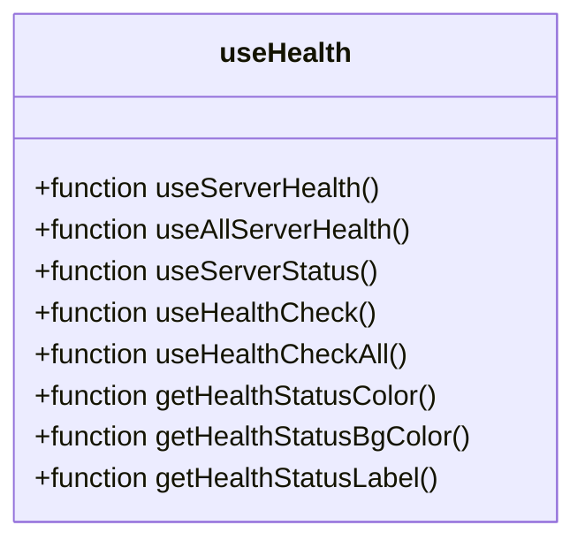

**Diagram sources**

- [useHealth.ts](file://src/hooks/useHealth.ts#L7-L120)

**Section sources**

- [useHealth.ts](file://src/hooks/useHealth.ts#L7-L120)

### useCredentials

Hook for credential management operations.

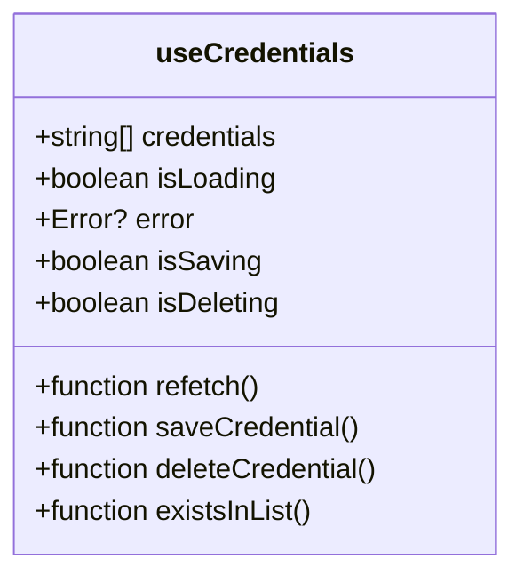

**Diagram sources**

- [useCredentials.ts](file://src/hooks/useCredentials.ts#L9-L51)

**Section sources**

- [useCredentials.ts](file://src/hooks/useCredentials.ts#L9-L51)

### useMarketplace

Hook for marketplace operations.

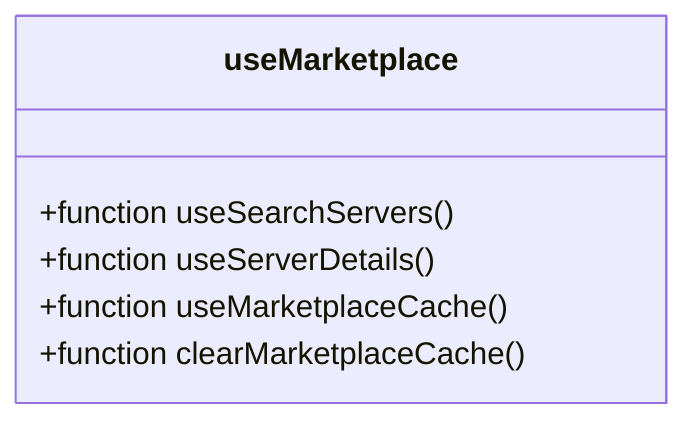

**Section sources**

- [useMarketplace.ts](file://src/hooks/useMarketplace.ts)

### useUpdates

Hook for update checking operations.

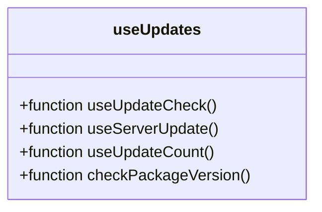

**Section sources**

- [useUpdates.ts](file://src/hooks/useUpdates.ts)

### useClients

Hook for client detection and status operations.

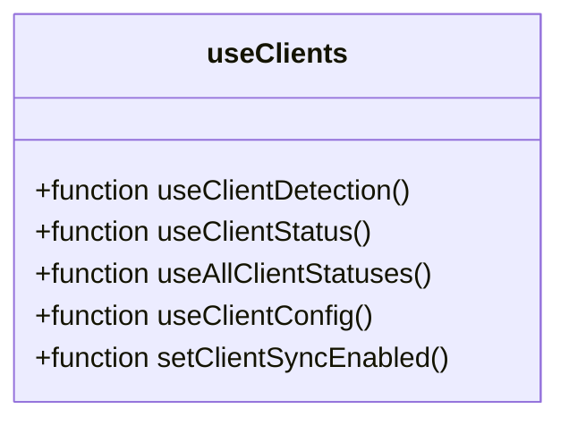

**Section sources**

- [useClients.ts](file://src/hooks/useClients.ts)

### useDoctor

Hook for environment diagnostics.

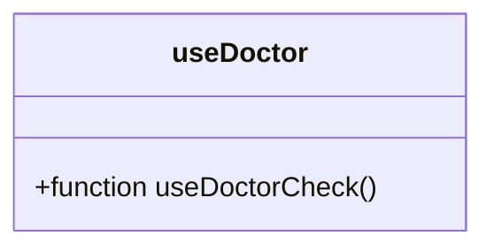

**Section sources**

- [useDoctor.ts](file://src/hooks/useDoctor.ts)

## Type Safety and Serialization

The MCP Nexus application ensures type safety between frontend and backend through shared TypeScript definitions and Serde serialization.

### Shared Type Definitions

The application uses a shared type system where TypeScript interfaces in `src/types/index.ts` correspond to Rust structs in `src-tauri/src/models/`. This ensures consistency across the codebase.

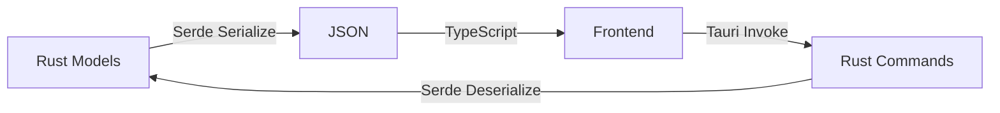

**Diagram sources**

- [index.ts](file://src/types/index.ts)
- [models/mod.rs](file://src-tauri/src/models/mod.rs)

**Section sources**

- [index.ts](file://src/types/index.ts)
- [models/mod.rs](file://src-tauri/src/models/mod.rs)

### Serialization Format

All data exchanged between frontend and backend uses JSON serialization with camelCase naming convention, as specified by the `#[serde(rename_all = "camelCase")]` attribute in Rust and corresponding TypeScript interfaces.

**Section sources**

- [config.rs](file://src-tauri/src/commands/config.rs#L27)
- [marketplace.rs](file://src-tauri/src/commands/marketplace.rs#L15)
- [index.ts](file://src/types/index.ts)

## Error Handling Patterns

This section documents the error handling patterns used throughout the application.

### Command Error Structure

All Tauri commands return structured error responses that are consistent across the API surface.

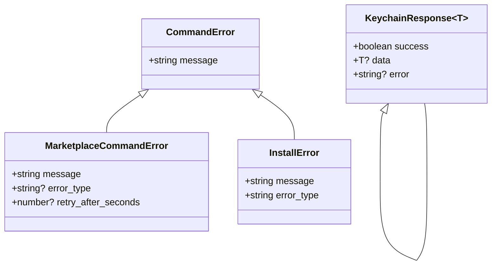

**Diagram sources**

- [config.rs](file://src-tauri/src/commands/config.rs#L12-L15)
- [marketplace.rs](file://src-tauri/src/commands/marketplace.rs#L14-L22)
- [installation.rs](file://src-tauri/src/commands/installation.rs#L12-L16)
- [tauri.ts](file://src/lib/tauri.ts#L153-L159)

**Section sources**

- [config.rs](file://src-tauri/src/commands/config.rs#L12-L15)
- [marketplace.rs](file://src-tauri/src/commands/marketplace.rs#L14-L22)
- [installation.rs](file://src-tauri/src/commands/installation.rs#L12-L16)
- [tauri.ts](file://src/lib/tauri.ts#L153-L159)

### Loading States in UI Components

UI components consuming these APIs implement consistent loading states using React Query's mutation and query states.

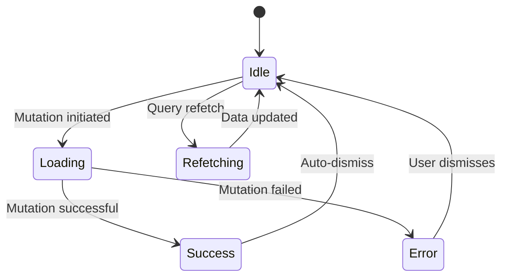

**Section sources**

- [useServers.ts](file://src/hooks/useServers.ts)
- [useHealth.ts](file://src/hooks/useHealth.ts)
- [useCredentials.ts](file://src/hooks/useCredentials.ts)
