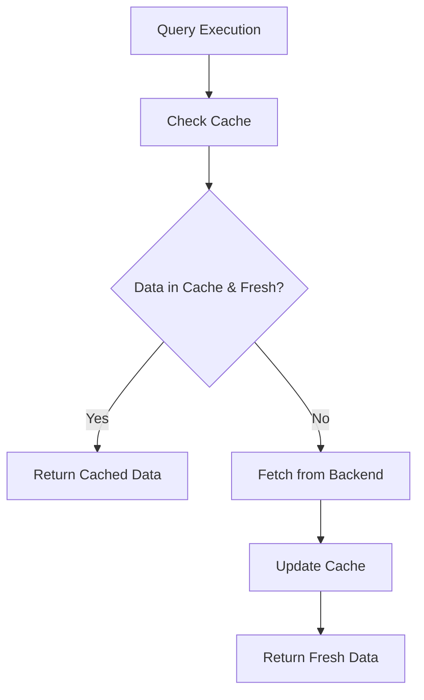
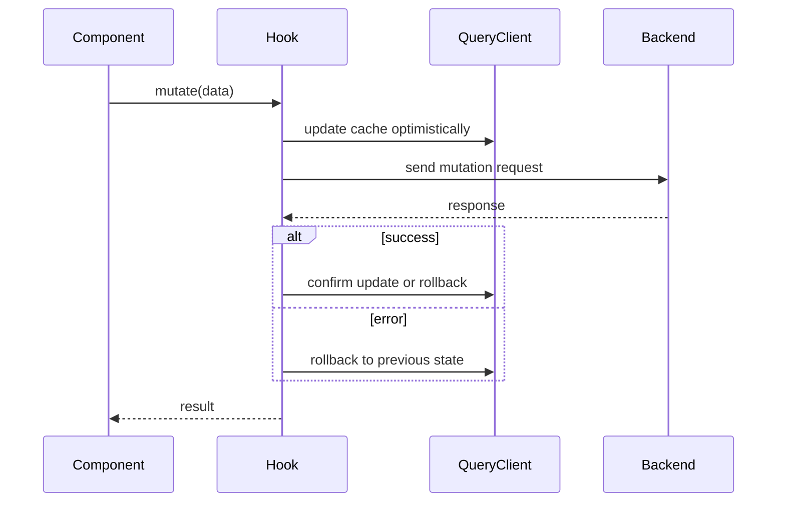
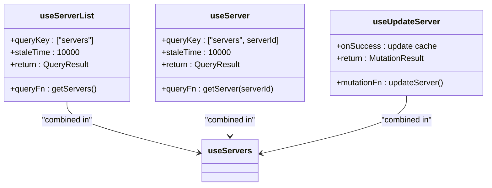
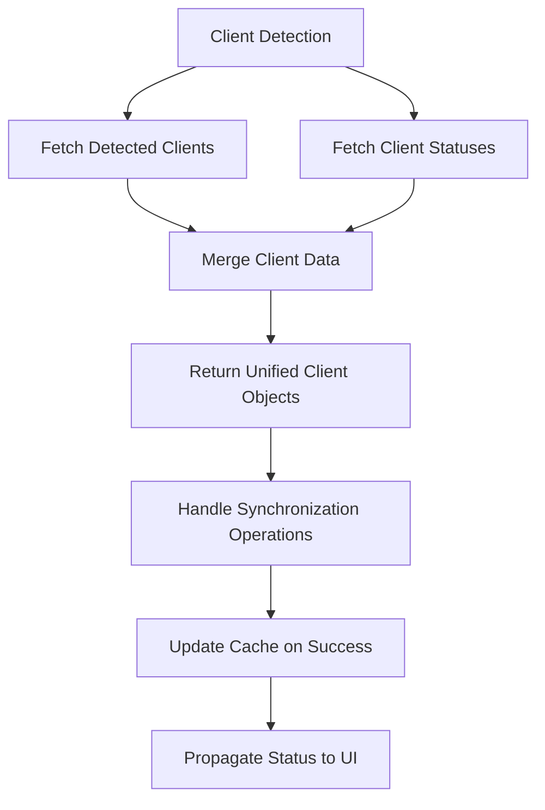
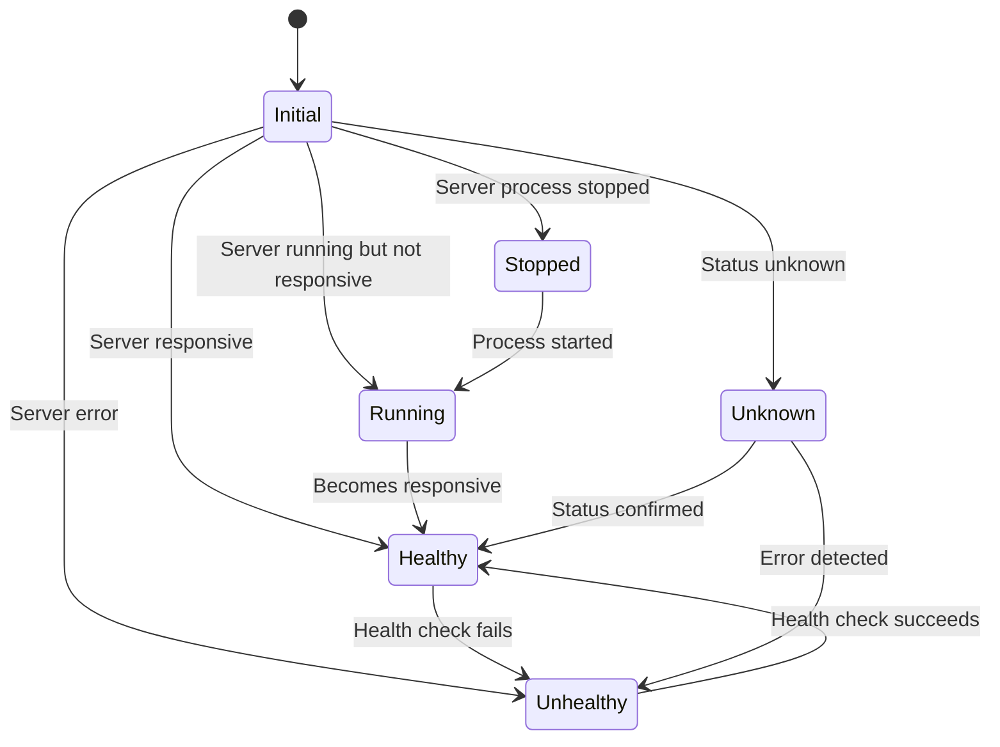
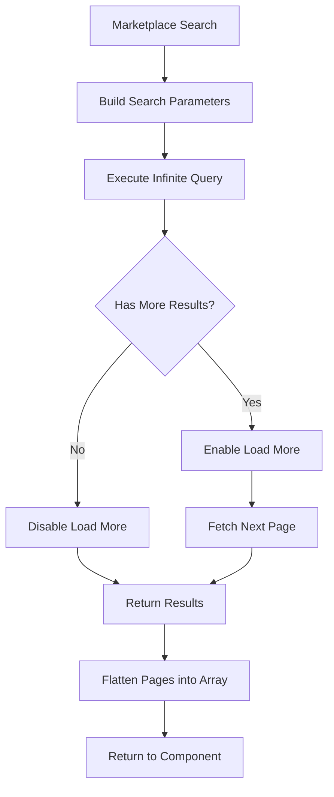
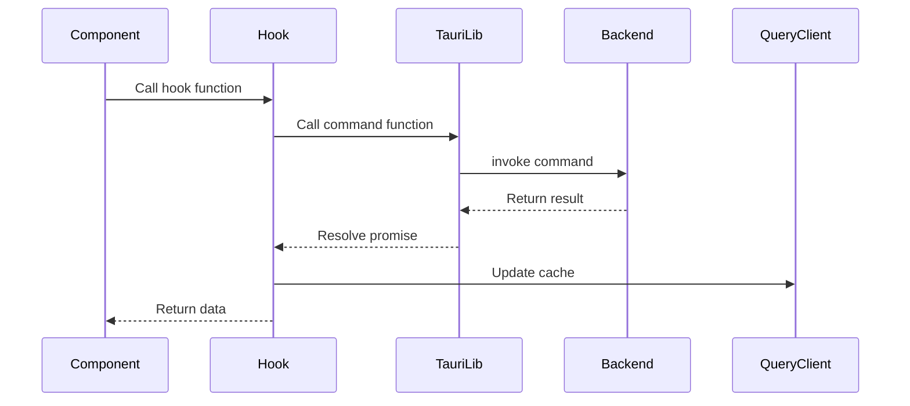
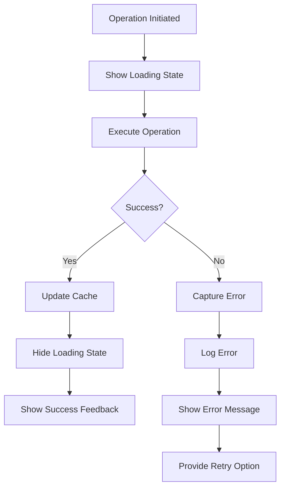
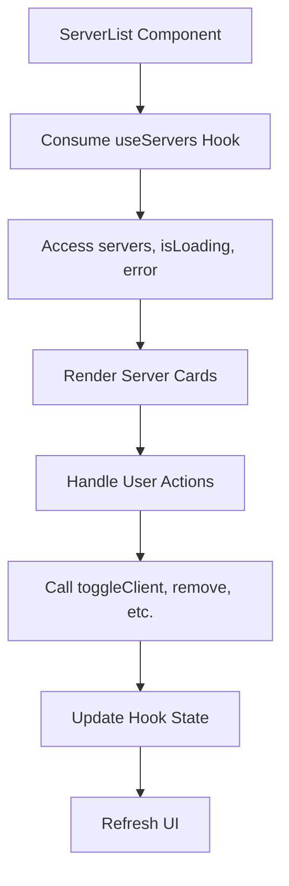
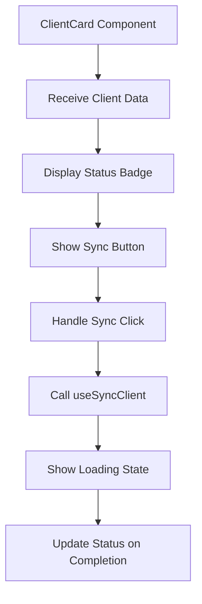

# React Hooks

<cite>
**Referenced Files in This Document**   
- [useServers.ts](file://src/hooks/useServers.ts)
- [useClients.ts](file://src/hooks/useClients.ts)
- [useHealth.ts](file://src/hooks/useHealth.ts)
- [useMarketplace.ts](file://src/hooks/useMarketplace.ts)
- [useAutoSync.ts](file://src/hooks/useAutoSync.ts)
- [useConfig.ts](file://src/hooks/useConfig.ts)
- [useCredentials.ts](file://src/hooks/useCredentials.ts)
- [useUpdates.ts](file://src/hooks/useUpdates.ts)
- [tauri.ts](file://src/lib/tauri.ts)
- [ServerList.tsx](file://src/components/servers/ServerList.tsx)
- [ClientCard.tsx](file://src/components/clients/ClientCard.tsx)
- [MarketplaceCard.tsx](file://src/components/marketplace/MarketplaceCard.tsx)
- [Servers.tsx](file://src/pages/Servers.tsx)
- [Clients.tsx](file://src/pages/Clients.tsx)
</cite>

## Table of Contents

1. [Introduction](#introduction)
2. [Core React Hooks Overview](#core-react-hooks-overview)
3. [State Management with React Query](#state-management-with-react-query)
4. [useServers Hook Analysis](#useservers-hook-analysis)
5. [useClients Hook Analysis](#useclients-hook-analysis)
6. [useHealth Hook Analysis](#usehealth-hook-analysis)
7. [useMarketplace Hook Analysis](#usemarketplace-hook-analysis)
8. [Integration with Tauri Backend](#integration-with-tauri-backend)
9. [Error Handling Patterns](#error-handling-patterns)
10. [Practical Usage Examples](#practical-usage-examples)
11. [Conclusion](#conclusion)

## Introduction

The MCP Nexus application utilizes a comprehensive set of React hooks to manage state and data fetching operations, with a particular focus on server state synchronization between the frontend React components and the Tauri backend. These hooks leverage React Query for efficient data fetching, caching, and state management, providing a seamless user experience while maintaining data consistency across the application.

The hooks are designed to abstract complex interactions with the Tauri backend, which handles communication with various AI clients and server configurations. Each hook serves a specific purpose in the application's architecture, from managing server configurations to handling client synchronization and health checks. This documentation provides a detailed analysis of these hooks, their implementation patterns, and their integration with the broader application ecosystem.

**Section sources**

- [useServers.ts](file://src/hooks/useServers.ts#L1-L182)
- [useClients.ts](file://src/hooks/useClients.ts#L1-L138)
- [useHealth.ts](file://src/hooks/useHealth.ts#L1-L120)

## Core React Hooks Overview

The MCP Nexus application implements a collection of specialized React hooks that handle different aspects of the application's functionality. These hooks are organized in the `src/hooks` directory and are designed to provide a clean separation of concerns while maintaining efficient state management.

The primary hooks include:

- `useServers`: Manages server configurations and operations
- `useClients`: Handles client detection and synchronization
- `useHealth`: Performs health checks on servers
- `useMarketplace`: Facilitates marketplace server discovery
- `useAutoSync`: Coordinates automatic synchronization
- `useConfig`: Manages application configuration
- `useCredentials`: Handles credential management
- `useUpdates`: Checks for server updates

These hooks follow a consistent pattern of using React Query for data fetching and mutation operations, with appropriate caching strategies and error handling mechanisms. They are designed to be composable, allowing higher-level hooks to combine functionality from multiple lower-level hooks to provide comprehensive interfaces for components.

**Section sources**

- [index.ts](file://src/hooks/index.ts#L1-L9)
- [useServers.ts](file://src/hooks/useServers.ts#L1-L182)
- [useClients.ts](file://src/hooks/useClients.ts#L1-L138)

## State Management with React Query

React Query serves as the foundation for state management in the MCP Nexus application, providing a robust solution for server state synchronization. The library is used extensively across all hooks to handle data fetching, caching, and mutation operations, ensuring that the UI remains in sync with the backend state.

The application implements several key React Query features:

### Query Configuration

Each query is configured with appropriate `staleTime` and `cacheTime` values to balance data freshness with performance. For frequently changing data like server lists, a shorter stale time (10 seconds) is used, while less frequently updated data like marketplace searches use longer stale times (5 minutes).

**Diagram sources**

- [useServers.ts](file://src/hooks/useServers.ts#L23-L29)
- [useClients.ts](file://src/hooks/useClients.ts#L22-L28)

### Mutation Patterns

Mutations are used for operations that modify data, such as creating, updating, or deleting servers. The hooks implement optimistic updates where appropriate, immediately updating the cache with the expected result before the backend operation completes.

**Diagram sources**

- [useServers.ts](file://src/hooks/useServers.ts#L42-L57)
- [useClients.ts](file://src/hooks/useClients.ts#L43-L49)

### Cache Invalidation

The hooks implement strategic cache invalidation to ensure data consistency. After mutations that affect related data, the appropriate queries are invalidated to trigger refetching on the next access.

**Section sources**

- [useServers.ts](file://src/hooks/useServers.ts#L1-L182)
- [useClients.ts](file://src/hooks/useClients.ts#L1-L138)
- [useHealth.ts](file://src/hooks/useHealth.ts#L1-L120)

## useServers Hook Analysis

The `useServers` hook provides comprehensive functionality for managing server configurations in the MCP Nexus application. It combines multiple query and mutation hooks to offer a unified interface for server operations.

### Key Functions and Return Values

The hook exposes several key functions through its return value:

- `servers`: Array of all configured servers
- `isLoading`: Boolean indicating loading state
- `error`: Error object if data fetching failed
- `refetch`: Function to manually refresh server data
- `toggleClient`: Function to enable/disable a server for a specific client
- `remove`: Function to remove a server configuration
- `uninstall`: Function to uninstall a server
- `install`: Function to install a new server
- `sync`: Function to synchronize servers with clients

### Query Keys and Caching Strategy

The hook uses a hierarchical query key structure to organize server-related data:

- `["servers"]`: For the list of all servers
- `["servers", serverId]`: For individual server details
- `["clients", "statuses"]`: For client synchronization statuses

The caching strategy employs a 10-second stale time for server data, reflecting the expectation that server configurations may change frequently due to user interactions or synchronization events.

**Diagram sources**

- [useServers.ts](file://src/hooks/useServers.ts#L23-L39)
- [useServers.ts](file://src/hooks/useServers.ts#L42-L57)

### Integration with AutoSync

The `useServers` hook integrates with the `useAutoSync` hook to trigger automatic synchronization when server configurations change. This ensures that client configurations are updated promptly after any server modifications.

**Section sources**

- [useServers.ts](file://src/hooks/useServers.ts#L1-L182)
- [useAutoSync.ts](file://src/hooks/useAutoSync.ts#L1-L53)

## useClients Hook Analysis

The `useClients` hook manages the detection and synchronization of AI clients in the MCP Nexus application. It provides functionality for discovering installed clients, managing their synchronization status, and handling client-specific operations.

### Client Detection and Status Management

The hook combines data from multiple sources to provide a comprehensive view of client status:

- `useDetectedClients`: Fetches information about detected AI clients
- `useClientStatuses`: Retrieves synchronization status for each client
- `useManualConfig`: Handles manual configuration for clients like Warp

The hook merges these data sources to create a unified client object that includes both detection information and synchronization status.

### Synchronization Operations

The hook provides several mutation functions for client synchronization:

- `useSyncClient`: Synchronizes configuration with a single client
- `useSyncAllClients`: Synchronizes with all enabled clients
- `useSetClientSyncEnabled`: Enables or disables synchronization for a client
- `useImportClientServers`: Imports servers from a client's existing configuration

These operations are designed to maintain data consistency across the application while providing feedback to the user about the synchronization status.

**Diagram sources**

- [useClients.ts](file://src/hooks/useClients.ts#L22-L37)
- [useClients.ts](file://src/hooks/useClients.ts#L109-L137)

### Error Handling and User Feedback

The hook implements comprehensive error handling for synchronization operations, capturing both technical errors and user-facing issues. Errors are propagated to the UI components to provide appropriate feedback to the user.

**Section sources**

- [useClients.ts](file://src/hooks/useClients.ts#L1-L138)
- [ClientCard.tsx](file://src/components/clients/ClientCard.tsx#L1-L332)

## useHealth Hook Analysis

The `useHealth` hook provides functionality for monitoring the health status of MCP servers in the Nexus application. It implements both individual and bulk health checking operations with appropriate caching strategies.

### Health Check Operations

The hook exposes several functions for health monitoring:

- `useServerHealth`: Checks the health of a single server with a 30-second stale time and 60-second refetch interval
- `useAllServerHealth`: Checks the health of all servers with similar caching parameters
- `useServerStatus`: Provides a quick status check with a 10-second stale time
- `useHealthCheck` and `useHealthCheckAll`: Mutation functions for manually triggering health checks

### Status Representation

The hook includes utility functions for translating health status values into UI representations:

- `getHealthStatusColor`: Returns appropriate text color classes for different health states
- `getHealthStatusBgColor`: Returns background color classes for health status indicators
- `getHealthStatusLabel`: Provides human-readable labels for health states

These functions support consistent visual representation of server health across the application.

**Diagram sources**

- [useHealth.ts](file://src/hooks/useHealth.ts#L7-L25)
- [useHealth.ts](file://src/hooks/useHealth.ts#L69-L118)

### Caching Strategy

The health check queries use a 30-second stale time with a 60-second refetch interval, striking a balance between real-time monitoring and performance. This configuration ensures that health information remains reasonably current without overwhelming the backend with frequent requests.

**Section sources**

- [useHealth.ts](file://src/hooks/useHealth.ts#L1-L120)
- [tauri.ts](file://src/lib/tauri.ts#L340-L364)

## useMarketplace Hook Analysis

The `useMarketplace` hook facilitates discovery and installation of servers from the PulseMCP marketplace. It implements infinite scrolling for large result sets and provides functionality for server detail retrieval.

### Search and Pagination

The hook uses `useInfiniteQuery` to support infinite scrolling through marketplace results:

- Query key includes search parameters to create unique caches for different searches
- `getNextPageParam` determines if additional pages are available
- Results are flattened into a single array for easy consumption by components

The caching strategy uses a 5-minute stale time, matching the backend cache TTL to ensure consistency between frontend and backend caching.

### Server Detail Retrieval

The hook includes a `useServerDetails` function that is currently stubbed but designed to fetch enriched server metadata from the marketplace API. This function is intended to provide detailed information for the server detail modal with graceful fallback behavior when the API is unavailable.

**Diagram sources**

- [useMarketplace.ts](file://src/hooks/useMarketplace.ts#L15-L71)
- [MarketplaceCard.tsx](file://src/components/marketplace/MarketplaceCard.tsx#L1-L136)

### Special Case: useServerDetails

The `useServerDetails` function in `useMarketplace.ts` represents a special case in the application's architecture. Currently stubbed, it is designed to:

1. Fetch detailed server information from the marketplace API
2. Implement graceful fallback behavior when the API is unavailable
3. Cache results to reduce API calls
4. Integrate with the server detail modal component

This function will need to be implemented to provide enriched server metadata for the marketplace experience.

**Section sources**

- [useMarketplace.ts](file://src/hooks/useMarketplace.ts#L1-L81)
- [tauri.ts](file://src/lib/tauri.ts#L198-L215)

## Integration with Tauri Backend

The React hooks in MCP Nexus integrate with the Tauri backend through a well-defined API layer in `src/lib/tauri.ts`. This integration enables seamless communication between the frontend and the native backend processes.

### Command Invocation Pattern

The hooks use Tauri's `invoke` function to call backend commands, following a consistent pattern:

1. Import the appropriate command function from `tauri.ts`
2. Use React Query to manage the asynchronous operation
3. Handle success and error cases appropriately
4. Update the cache to reflect changes

**Diagram sources**

- [tauri.ts](file://src/lib/tauri.ts#L1-L364)
- [useServers.ts](file://src/hooks/useServers.ts#L1-L182)

### Error Handling and Resilience

The integration includes robust error handling to ensure application resilience:

- Network errors are caught and propagated to the UI
- Backend command failures are translated into user-friendly messages
- Retry mechanisms are implemented where appropriate
- Loading states are managed to provide feedback during operations

### Data Flow Architecture

The data flow follows a unidirectional pattern from the backend to the frontend:

1. Backend commands return data in well-defined TypeScript interfaces
2. React Query caches this data using query keys
3. Hooks expose the data through their return values
4. Components consume the data and render the UI
5. User actions trigger mutations that flow back to the backend

This architecture ensures data consistency and provides a clear separation of concerns.

**Section sources**

- [tauri.ts](file://src/lib/tauri.ts#L1-L364)
- [useServers.ts](file://src/hooks/useServers.ts#L1-L182)
- [useClients.ts](file://src/hooks/useClients.ts#L1-L138)

## Error Handling Patterns

The MCP Nexus application implements comprehensive error handling patterns across all hooks to ensure a robust user experience. These patterns address both technical errors and user-facing issues.

### Error Propagation

Errors are propagated through the hook return values, allowing components to handle them appropriately:

- Query hooks expose errors through the `error` property
- Mutation hooks provide error callbacks for success and failure cases
- Global error handling is implemented for uncaught exceptions

### User Feedback

The application provides clear feedback for different error types:

- Loading states are indicated with spinners and skeleton screens
- Error states display descriptive messages and retry options
- Success states provide confirmation through notifications
- Warning states highlight potential issues without blocking functionality

**Diagram sources**

- [useServers.ts](file://src/hooks/useServers.ts#L42-L57)
- [useClients.ts](file://src/hooks/useClients.ts#L43-L49)
- [Servers.tsx](file://src/pages/Servers.tsx#L44-L81)
- [Clients.tsx](file://src/pages/Clients.tsx#L157-L196)

### Graceful Degradation

The hooks implement graceful degradation to maintain functionality when errors occur:

- Cached data is used when fresh data cannot be retrieved
- Partial results are displayed when some operations fail
- Fallback mechanisms are provided for critical functionality
- Users are informed of limitations without blocking all operations

**Section sources**

- [useServers.ts](file://src/hooks/useServers.ts#L1-L182)
- [useClients.ts](file://src/hooks/useClients.ts#L1-L138)
- [useHealth.ts](file://src/hooks/useHealth.ts#L1-L120)

## Practical Usage Examples

The React hooks in MCP Nexus are used extensively throughout the application's components to provide a seamless user experience. The following examples demonstrate practical usage patterns.

### ServerList Component

The `ServerList` component uses the `useServers` hook to display and manage server configurations:

The component handles loading states with skeleton screens, error states with retry options, and empty states with guidance for adding servers.

**Section sources**

- [ServerList.tsx](file://src/components/servers/ServerList.tsx#L1-L186)
- [Servers.tsx](file://src/pages/Servers.tsx#L137-L355)

### ClientCard Component

The `ClientCard` component uses the `useClients` hook to display client status and handle synchronization:

The component provides visual feedback for different client states and handles synchronization operations with appropriate loading indicators.

**Section sources**

- [ClientCard.tsx](file://src/components/clients/ClientCard.tsx#L1-L332)
- [Clients.tsx](file://src/pages/Clients.tsx#L19-L324)

### Marketplace Integration

The marketplace components use the `useMarketplace` hook to discover and install servers:

- Search functionality with debounced input
- Infinite scrolling for large result sets
- Server selection and installation workflow
- Loading and error states for API operations

These examples demonstrate how the hooks abstract complex backend interactions while providing a clean, consistent interface for components.

**Section sources**

- [MarketplaceCard.tsx](file://src/components/marketplace/MarketplaceCard.tsx#L1-L136)
- [useMarketplace.ts](file://src/hooks/useMarketplace.ts#L1-L81)

## Conclusion

The React hooks in MCP Nexus provide a robust foundation for state management and data fetching, leveraging React Query to create a seamless user experience. The hooks abstract complex interactions with the Tauri backend while maintaining data consistency and providing appropriate feedback to users.

Key strengths of the implementation include:

- Consistent use of React Query for data fetching and caching
- Comprehensive error handling and user feedback
- Efficient cache invalidation and data synchronization
- Clear separation of concerns between hooks
- Robust integration with the Tauri backend

The `useServerDetails` function in `useMarketplace.ts` represents an opportunity for enhancement, as it is currently stubbed but designed to provide enriched server metadata with graceful fallback behavior. Implementing this function will improve the marketplace experience by providing more detailed information about available servers.

Overall, the hook architecture in MCP Nexus demonstrates effective patterns for managing complex state in a React application with a native backend, providing a solid foundation for future development and enhancement.

**Section sources**

- [useServers.ts](file://src/hooks/useServers.ts#L1-L182)
- [useClients.ts](file://src/hooks/useClients.ts#L1-L138)
- [useHealth.ts](file://src/hooks/useHealth.ts#L1-L120)
- [useMarketplace.ts](file://src/hooks/useMarketplace.ts#L1-L81)
