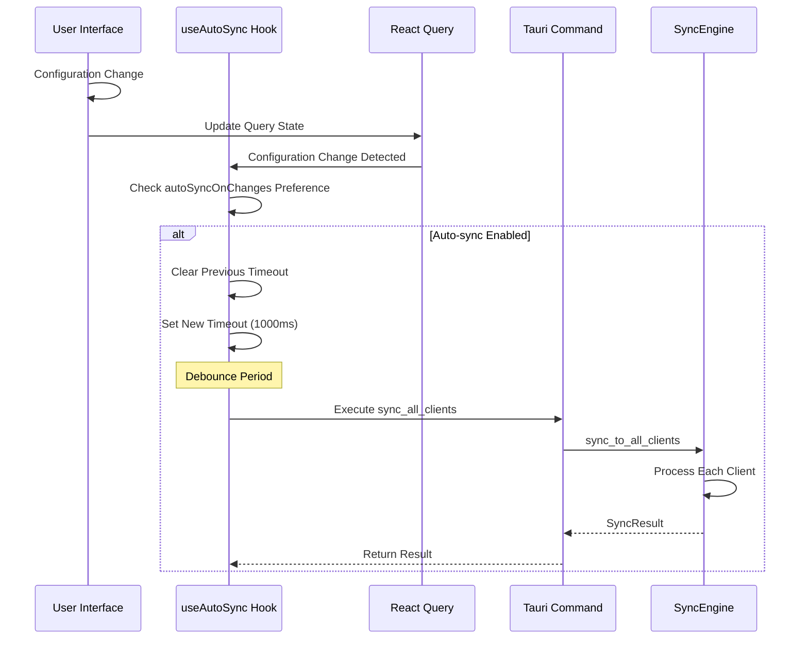
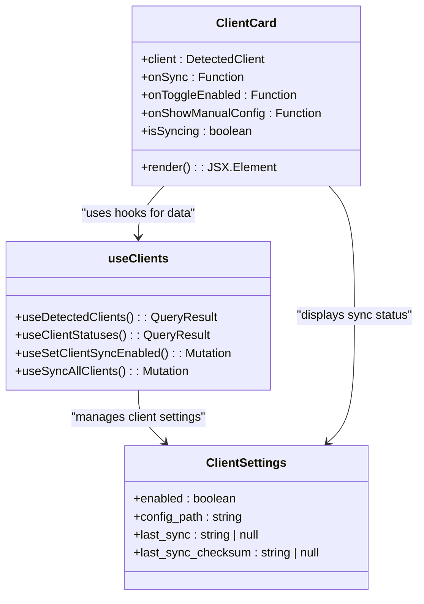
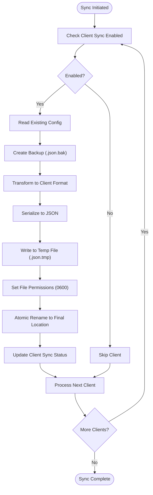
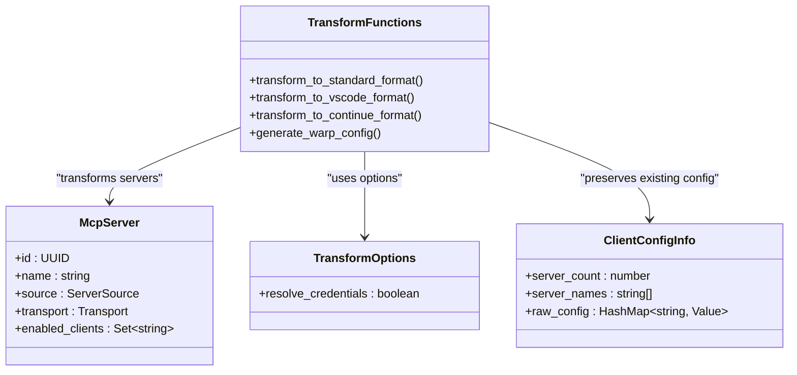
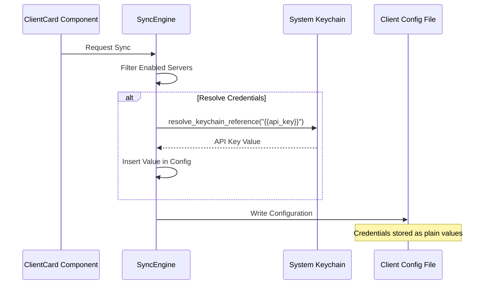
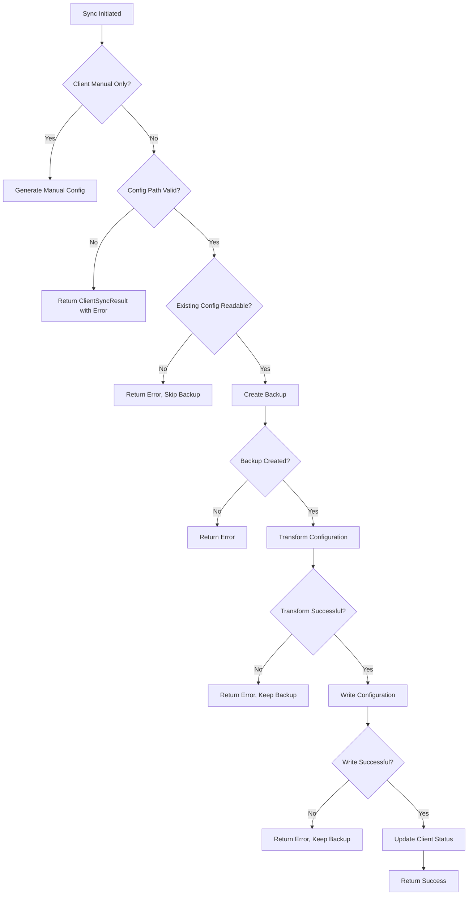
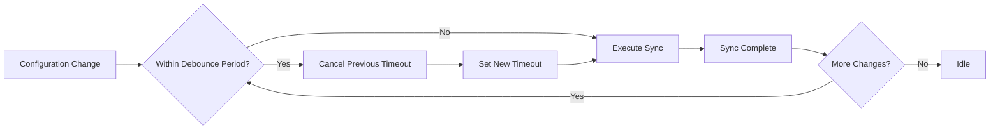

# Auto-Sync Configuration

<cite>
**Referenced Files in This Document**   
- [useAutoSync.ts](file://src/hooks/useAutoSync.ts)
- [ClientCard.tsx](file://src/components/clients/ClientCard.tsx)
- [sync_engine.rs](file://src-tauri/src/services/sync_engine.rs)
- [sync.rs](file://src-tauri/src/commands/sync.rs)
- [client.rs](file://src-tauri/src/models/client.rs)
- [config_manager.rs](file://src-tauri/src/services/config_manager.rs)
- [config.rs](file://src-tauri/src/models/config.rs)
- [tauri.ts](file://src/lib/tauri.ts)
- [client_detector.rs](file://src-tauri/src/services/client_detector.rs)
- [appStore.ts](file://src/stores/appStore.ts)
- [useConfig.ts](file://src/hooks/useConfig.ts)
</cite>

## Table of Contents

1. [Introduction](#introduction)
2. [Auto-Sync Trigger Mechanism](#auto-sync-trigger-mechanism)
3. [ClientCard Auto-Sync Toggle Implementation](#clientcard-auto-sync-toggle-implementation)
4. [Background Synchronization Process](#background-synchronization-process)
5. [Configuration File Generation and Path Resolution](#configuration-file-generation-and-path-resolution)
6. [Secure Credential Handling](#secure-credential-handling)
7. [Error Handling and Debugging](#error-handling-and-debugging)
8. [Performance Optimization](#performance-optimization)

## Introduction

The auto-sync configuration functionality in the MCP Nexus application enables automatic propagation of MCP server configurations to detected AI clients. This system monitors changes to the central configuration and automatically updates client configurations when servers are added, modified, or removed. The implementation combines frontend React components with backend Rust services through Tauri commands, creating a seamless experience for users to manage their AI tool integrations.

The auto-sync system is designed with several key principles in mind: reliability through atomic operations, security through proper file permissions and credential management, and user experience through debounce strategies and error handling. This documentation details the implementation of this functionality, focusing on the integration between the frontend toggle in the ClientCard component and the backend SyncEngine that performs the actual configuration synchronization.

**Section sources**

- [useAutoSync.ts](file://src/hooks/useAutoSync.ts#L1-L53)
- [ClientCard.tsx](file://src/components/clients/ClientCard.tsx#L1-L332)
- [sync_engine.rs](file://src-tauri/src/services/sync_engine.rs#L1-L927)

## Auto-Sync Trigger Mechanism

The auto-sync functionality is triggered by changes to the central MCP Hub configuration, which are detected through React Query's state management system. The `useAutoSync` hook monitors configuration changes and initiates the synchronization process with a debounce strategy to prevent excessive sync operations.

The trigger mechanism is implemented in the `useAutoSync` hook, which uses React's `useCallback` to create a memoized function that checks the auto-sync preference before proceeding. When a configuration change is detected, the hook sets up a timeout using `window.setTimeout` with a debounce period of 1,000 milliseconds. This prevents multiple rapid configuration changes from triggering multiple sync operations, which could lead to race conditions or performance issues.

**Diagram sources **

- [useAutoSync.ts](file://src/hooks/useAutoSync.ts#L8-L48)
- [sync.rs](file://src-tauri/src/commands/sync.rs#L107-L142)
- [sync_engine.rs](file://src-tauri/src/services/sync_engine.rs#L448-L485)

The synchronization process is guarded by a reference (`isSyncingRef`) to prevent concurrent sync operations, which could lead to race conditions when writing configuration files. This ensures that only one sync operation can run at a time, maintaining data integrity across client configurations.

**Section sources**

- [useAutoSync.ts](file://src/hooks/useAutoSync.ts#L8-L48)
- [sync_engine.rs](file://src-tauri/src/services/sync_engine.rs#L448-L485)

## ClientCard Auto-Sync Toggle Implementation

The ClientCard component implements the user interface for enabling and disabling auto-sync for individual AI clients. This toggle is a key part of the user experience, allowing granular control over which clients receive automatic configuration updates.

The auto-sync toggle is implemented as a styled checkbox input with a custom visual representation. When the user interacts with the toggle, the `onToggleEnabled` callback is invoked with the client ID and the new enabled state. This callback is provided by the parent component and ultimately connects to the `setClientSyncEnabled` Tauri command through React Query's mutation system.

**Diagram sources **

- [ClientCard.tsx](file://src/components/clients/ClientCard.tsx#L4-L15)
- [useClients.ts](file://src/hooks/useClients.ts#L76-L85)
- [config.rs](file://src-tauri/src/models/config.rs#L6-L21)

The state management for the auto-sync toggle is handled through Zustand via the `appStore.ts` file, which provides a centralized store for application state. When the toggle is changed, the `setClientSyncEnabled` Tauri command updates the `clients` map in the `McpHubConfig`, specifically modifying the `enabled` field in the `ClientSettings` for the corresponding client.

The visual state of the toggle is determined by the `syncEnabled` property passed to the ClientCard component, which is derived from the `ClientSettings` in the central configuration. This creates a controlled component pattern where the UI reflects the current state in the configuration store.

**Section sources**

- [ClientCard.tsx](file://src/components/clients/ClientCard.tsx#L6-L253)
- [appStore.ts](file://src/stores/appStore.ts#L10-L42)
- [config.rs](file://src-tauri/src/models/config.rs#L6-L21)

## Background Synchronization Process

The background synchronization process is managed by the SyncEngine, implemented in Rust for performance and reliability. This engine handles the core logic of transforming server configurations into client-specific formats and writing them to the appropriate locations.

The synchronization process follows a structured workflow with several key components: debounce strategies, conflict detection, and atomic write operations. When triggered, the SyncEngine first checks which clients have auto-sync enabled by examining the `clients` map in the `McpHubConfig`. For each enabled client, it retrieves the client-specific configuration format and generates the appropriate configuration content.

**Diagram sources **

- [sync_engine.rs](file://src-tauri/src/services/sync_engine.rs#L317-L446)
- [config_manager.rs](file://src-tauri/src/services/config_manager.rs#L129-L153)
- [sync.rs](file://src-tauri/src/commands/sync.rs#L87-L105)

Conflict detection is implemented through checksum verification. After a successful sync, the SyncEngine computes a checksum of the written configuration file using a `DefaultHasher`. This checksum is stored in the `last_sync_checksum` field of the `ClientSettings` and compared on subsequent syncs to detect external modifications. If the checksums don't match, the system can alert the user to potential conflicts.

Atomic write operations are used to prevent configuration corruption. The process writes to a temporary file first, sets appropriate permissions (0600 on Unix systems), and then performs an atomic rename operation to replace the original file. This ensures that client applications always read a complete, valid configuration file, even if the write process is interrupted.

The synchronization process also includes backup creation. Before overwriting an existing configuration file, the system creates a backup with a `.json.bak` extension. This provides a recovery mechanism if the sync process encounters errors or if the user needs to revert to a previous configuration.

**Section sources**

- [sync_engine.rs](file://src-tauri/src/services/sync_engine.rs#L268-L303)
- [sync_engine.rs](file://src-tauri/src/services/sync_engine.rs#L643-L648)
- [config_manager.rs](file://src-tauri/src/services/config_manager.rs#L130-L153)

## Configuration File Generation and Path Resolution

The auto-sync system generates configuration files in formats specific to each AI client, with path resolution logic that adapts to different operating systems and client requirements.

Configuration file generation is handled by transformation functions in the SyncEngine that convert the standard MCP server format into client-specific formats. The system supports three main configuration formats:

- **Standard format**: `{"mcpServers": {"name": {...}, ...}}`
- **VS Code format**: `{"mcp": {"servers": {...}}}`
- **Continue.dev format**: Preserves existing settings while updating the mcpServers section

**Diagram sources **

- [sync_engine.rs](file://src-tauri/src/services/sync_engine.rs#L86-L233)
- [client.rs](file://src-tauri/src/models/client.rs#L103-L112)
- [client_detector.rs](file://src-tauri/src/services/client_detector.rs#L55-L121)

Path resolution logic is implemented in the `get_client_config_path` function, which determines the appropriate location for each client's configuration file based on the operating system and client type. For example:

- **Claude Code**: `~/.claude.json`
- **Claude Desktop**: `~/Library/Application Support/Claude/claude_desktop_config.json`
- **VS Code**: `~/.vscode/mcp.json`
- **Warp**: `~/.warp/mcp_config.json` (documentation only, as Warp uses internal storage)

The system also handles template engines for configuration generation, particularly for clients like Warp that require manual configuration. The `generate_warp_config` function creates a human-readable JSON output that shows keychain references (e.g., `{{credential_name}}`) rather than resolving them, allowing users to copy the configuration directly into Warp's interface.

When generating configurations, the system preserves existing client settings that are not related to MCP servers. For VS Code and Continue.dev configurations, the transformation functions merge the MCP server configuration with the existing settings object, ensuring that user preferences and other configurations are not overwritten.

**Section sources**

- [sync_engine.rs](file://src-tauri/src/services/sync_engine.rs#L157-L233)
- [client_detector.rs](file://src-tauri/src/services/client_detector.rs#L23-L52)
- [client.rs](file://src-tauri/src/models/client.rs#L124-L125)

## Secure Credential Handling

The auto-sync system implements secure handling of credential references through a keychain integration that separates sensitive data from configuration files.

Credential references are stored in the system keychain (macOS Keychain, Windows Credential Manager, or Linux secret service) rather than in configuration files. In the MCP server configuration, credentials are referenced using a special syntax (e.g., `{{api_key}}`) that indicates a keychain lookup should be performed when the configuration is used.

**Diagram sources **

- [sync_engine.rs](file://src-tauri/src/services/sync_engine.rs#L107-L114)
- [sync_engine.rs](file://src-tauri/src/services/sync_engine.rs#L139-L147)
- [keychain.rs](file://src-tauri/src/services/keychain.rs)

During the synchronization process, when `resolve_credentials` is set to `true` in the `TransformOptions`, the SyncEngine resolves keychain references to their actual values before writing the configuration file. This ensures that client applications receive configurations with valid credentials that can be used immediately.

For clients that require manual configuration (like Warp), the system generates configuration JSON with the keychain references preserved (e.g., `{{api_key}}`). This is controlled by setting `resolve_credentials: false` in the `TransformOptions` when generating manual configurations. Users can then copy this configuration and the client will perform the keychain lookup at runtime.

The environment variable injection pattern is implemented through the server's `env` field in the `Transport::Stdio` configuration. When a server is configured with environment variables that reference credentials, the SyncEngine resolves these references during the sync process, injecting the actual credential values into the configuration that is written to disk.

File permissions are also part of the security model. Configuration files are written with restrictive permissions (0600 on Unix systems), ensuring that only the owner can read or write the file. Directory permissions are similarly restricted to 0700, preventing other users from accessing the configuration directory.

**Section sources**

- [sync_engine.rs](file://src-tauri/src/services/sync_engine.rs#L80-L84)
- [sync_engine.rs](file://src-tauri/src/services/sync_engine.rs#L107-L114)
- [config_manager.rs](file://src-tauri/src/services/config_manager.rs#L70-L76)

## Error Handling and Debugging

The auto-sync system includes comprehensive error handling and debugging capabilities to assist users when synchronization issues occur.

Error handling is implemented at multiple levels, with specific error types defined for different failure modes:

- `SyncError::ReadError` - Failed to read a configuration file
- `SyncError::WriteError` - Failed to write a configuration file
- `SyncError::ParseError` - Failed to parse JSON configuration
- `SyncError::BackupError` - Failed to create a backup file
- `SyncError::CredentialError` - Failed to resolve a credential reference

**Diagram sources **

- [sync_engine.rs](file://src-tauri/src/services/sync_engine.rs#L15-L42)
- [sync_engine.rs](file://src-tauri/src/services/sync_engine.rs#L317-L446)
- [sync.rs](file://src-tauri/src/commands/sync.rs)

When sync failures occur, detailed error messages are logged to a dedicated log file (`~/.mcp-nexus/logs/auto-sync.log`). This log includes timestamps, client IDs, and specific error messages, providing a comprehensive record of sync operations for debugging purposes.

Common issues and their debugging tips include:

**Sync Failures**

- **Permission errors**: Check that the configuration directory and files have appropriate permissions (0700 for directories, 0600 for files)
- **File locking issues**: Ensure no other process is holding a lock on the configuration file
- **Invalid JSON**: Verify that the generated configuration is valid JSON with proper escaping

**Race Conditions**

- The system prevents race conditions through the use of atomic operations and the `isSyncingRef` guard in the `useAutoSync` hook
- Multiple simultaneous sync requests are serialized, with subsequent requests waiting for the current operation to complete

**Permission-Related Errors**

- On Unix systems, ensure the user has read/write permissions to the configuration directory
- If running in a restricted environment, verify that the application has the necessary file system permissions
- For system-wide installations, ensure the configuration files are owned by the correct user

The system also provides user-facing notifications through the notification store, which displays toast messages for sync successes and failures. These notifications are dismissible and provide enough information for users to understand what occurred without overwhelming them with technical details.

**Section sources**

- [sync_engine.rs](file://src-tauri/src/services/sync_engine.rs#L15-L42)
- [sync.rs](file://src-tauri/src/commands/sync.rs#L17-L68)
- [notificationStore.ts](file://src/stores/notificationStore.ts)

## Performance Optimization

The auto-sync system implements several performance optimization techniques to ensure efficient operation, particularly when dealing with multiple clients and frequent configuration changes.

The primary optimization is the debounce strategy implemented in the `useAutoSync` hook, which delays sync operations by 1,000 milliseconds. This prevents multiple rapid configuration changes (such as adding several servers in quick succession) from triggering multiple sync operations. Instead, only a single sync is performed after the user has finished making changes.

**Diagram sources **

- [useAutoSync.ts](file://src/hooks/useAutoSync.ts#L8-L48)
- [sync_engine.rs](file://src-tauri/src/services/sync_engine.rs#L448-L485)

Batch processing is used when syncing to multiple clients. The `sync_to_all_clients` function processes all enabled clients in a single operation, reusing the loaded configuration rather than reloading it for each client. This reduces file I/O operations and memory usage.

Selective syncing is implemented based on client activity and configuration. The system only syncs to clients that have auto-sync enabled (as determined by the `ClientSettings.enabled` flag) and skips clients that are not currently detected on the system. This prevents unnecessary operations and reduces the overall sync time.

The configuration manager implements caching to reduce file I/O. The `ConfigManager` maintains an in-memory cache of the loaded configuration, which is used when possible instead of reading from disk. This cache is invalidated when the configuration is saved, ensuring consistency while improving performance for read operations.

Additional optimizations include:

- **Atomic operations**: Using atomic file operations to minimize the time the configuration file is in an intermediate state
- **Efficient JSON serialization**: Using `serde_json::to_string_pretty` for human-readable output while maintaining performance
- **Lazy loading**: Loading client configurations only when needed rather than pre-loading all configurations

These optimizations work together to create a responsive user experience where configuration changes are propagated efficiently without noticeable delays or performance impacts.

**Section sources**

- [useAutoSync.ts](file://src/hooks/useAutoSync.ts#L8-L48)
- [config_manager.rs](file://src-tauri/src/services/config_manager.rs#L91-L114)
- [sync_engine.rs](file://src-tauri/src/services/sync_engine.rs#L448-L485)
