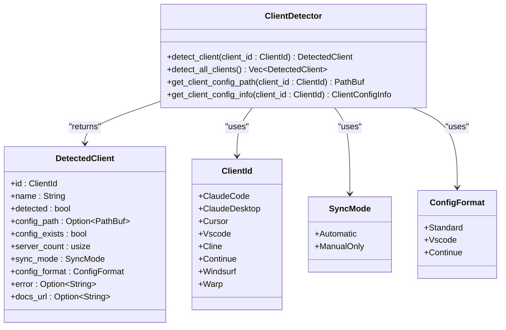
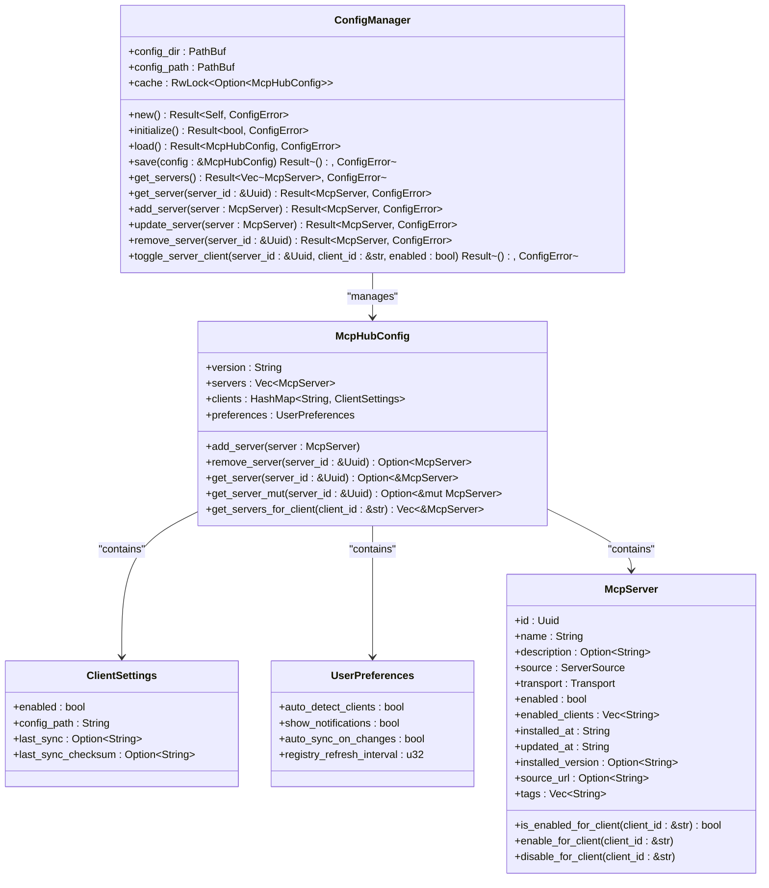
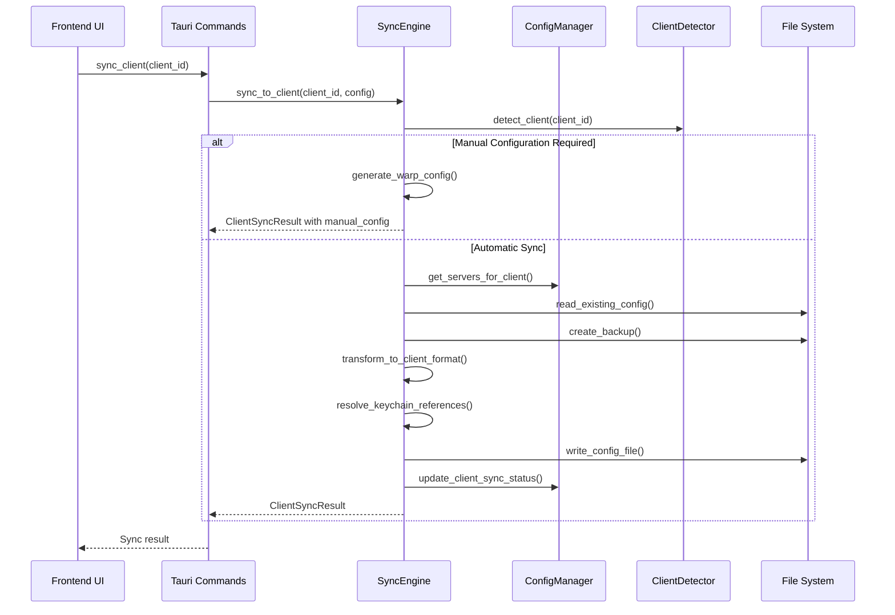
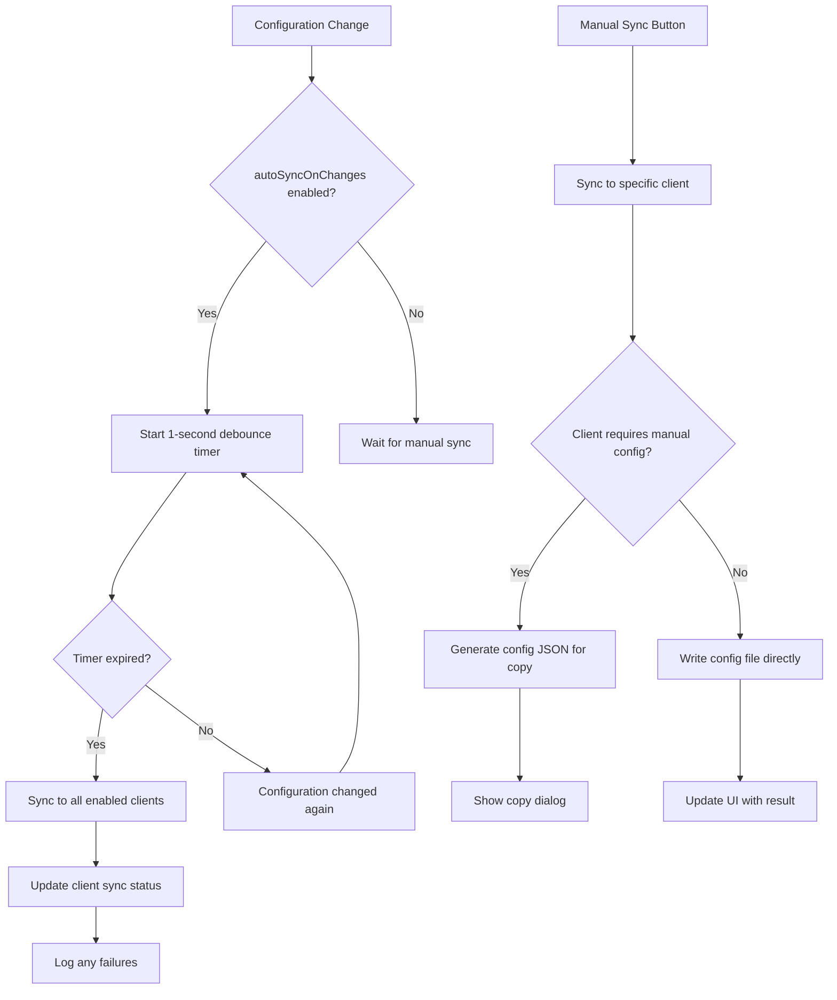
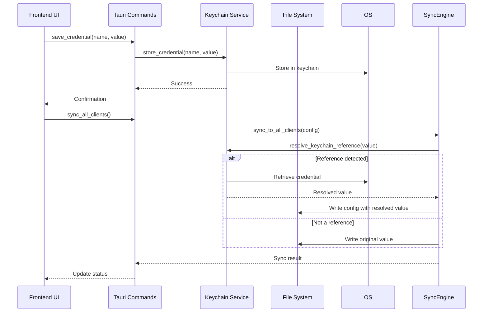

# Client Synchronization

<cite>
**Referenced Files in This Document**   
- [sync_engine.rs](file://src-tauri/src/services/sync_engine.rs)
- [client_detector.rs](file://src-tauri/src/services/client_detector.rs)
- [config_manager.rs](file://src-tauri/src/services/config_manager.rs)
- [sync.rs](file://src-tauri/src/commands/sync.rs)
- [config.rs](file://src-tauri/src/commands/config.rs)
- [ClientCard.tsx](file://src/components/clients/ClientCard.tsx)
- [useAutoSync.ts](file://src/hooks/useAutoSync.ts)
- [useClients.ts](file://src/hooks/useClients.ts)
- [tauri.ts](file://src/lib/tauri.ts)
- [index.ts](file://src/types/index.ts)
- [mod.rs](file://src-tauri/src/models/mod.rs)
- [client.rs](file://src-tauri/src/models/client.rs)
- [config.rs](file://src-tauri/src/models/config.rs)
- [server.rs](file://src-tauri/src/models/server.rs)
- [Clients.tsx](file://src/pages/Clients.tsx)
- [keychain.rs](file://src-tauri/src/services/keychain.rs)
</cite>

## Table of Contents

1. [Introduction](#introduction)
2. [Client Detection System](#client-detection-system)
3. [Configuration Management](#configuration-management)
4. [Sync Engine Architecture](#sync-engine-architecture)
5. [Auto-Sync and Manual Sync](#auto-sync-and-manual-sync)
6. [Conflict Resolution and Error Handling](#conflict-resolution-and-error-handling)
7. [ClientCard Component](#clientcard-component)
8. [Secure File Operations](#secure-file-operations)
9. [Credential Management](#credential-management)
10. [Configuration Templates and Path Resolution](#configuration-templates-and-path-resolution)
11. [Security Considerations](#security-considerations)
12. [Troubleshooting Guide](#troubleshooting-guide)

## Introduction

The client synchronization system connects MCP servers to AI development environments by detecting supported clients, managing configuration file generation, and maintaining sync state across different IDEs and editors. This system enables developers to manage their MCP server configurations centrally while automatically propagating changes to their preferred development environments such as VS Code, JetBrains, Claude Desktop, and others. The architecture consists of a backend sync engine that handles file operations and a frontend interface that provides status visualization and user controls.

**Section sources**

- [sync_engine.rs](file://src-tauri/src/services/sync_engine.rs#L1-L927)
- [client_detector.rs](file://src-tauri/src/services/client_detector.rs#L1-L364)
- [ClientCard.tsx](file://src/components/clients/ClientCard.tsx#L1-L332)

## Client Detection System

The client detection system identifies installed AI development environments through the ClientDetector service, which scans the user's system for specific applications and configuration files. The system supports multiple client types including Claude Code, Claude Desktop, Cursor, VS Code, Cline, Continue.dev, Windsurf, and Warp, each identified by the ClientId enum. Detection occurs through a combination of configuration file presence checks and application installation verification.

For each client, the system determines the configuration file path based on the operating system's conventions. For example, VS Code configurations are stored in `~/.vscode/mcp.json`, while Claude Desktop uses `~/Library/Application Support/Claude/claude_desktop_config.json`. The detection process also identifies whether a client requires automatic file-based synchronization or manual configuration (such as Warp, which requires copy-pasting configuration into its UI).

The ClientDetector performs several validation steps: checking for the existence of configuration files, parsing existing server configurations to count servers, and verifying application installation when configuration files are absent. This multi-layered approach ensures accurate detection even when configuration files haven't been created yet. The system also handles special cases like Warp, which uses internal storage and thus requires manual configuration only.



**Diagram sources **

- [client_detector.rs](file://src-tauri/src/services/client_detector.rs#L1-L364)
- [client.rs](file://src-tauri/src/models/client.rs#L1-L248)

**Section sources**

- [client_detector.rs](file://src-tauri/src/services/client_detector.rs#L1-L364)
- [client.rs](file://src-tauri/src/models/client.rs#L1-L248)

## Configuration Management

The configuration management system centers around the ConfigManager service, which handles the central MCP Hub configuration file stored at `~/.mcp-nexus/config.json`. This service provides a thread-safe interface for reading, writing, and caching configuration data, ensuring data consistency across concurrent operations. The configuration follows the McpHubConfig structure, which includes server definitions, client-specific settings, and user preferences.

The ConfigManager implements atomic write operations to prevent data corruption during updates. When saving configuration changes, it writes to a temporary file first and then performs an atomic rename operation. This approach ensures that the configuration file is always in a consistent state, even if the application crashes during a write operation. The service also manages directory and file permissions, setting the configuration directory to 0700 (user-only access) and the configuration file to 0600 (user read/write only) on Unix-like systems.

The configuration structure supports per-client settings through the clients field, which maps client identifiers to ClientSettings objects containing sync status, enabled state, and last sync information. User preferences are stored in the preferences field, including settings like autoSyncOnChanges which controls whether configuration changes automatically trigger synchronization to clients. The system also implements a caching mechanism using RwLock to minimize disk I/O while ensuring thread safety.



**Diagram sources **

- [config_manager.rs](file://src-tauri/src/services/config_manager.rs#L1-L427)
- [config.rs](file://src-tauri/src/models/config.rs#L1-L249)
- [server.rs](file://src-tauri/src/models/server.rs#L1-L233)

**Section sources**

- [config_manager.rs](file://src-tauri/src/services/config_manager.rs#L1-L427)
- [config.rs](file://src-tauri/src/models/config.rs#L1-L249)

## Sync Engine Architecture

The SyncEngine is the core component responsible for synchronizing MCP server configurations between the central hub and client applications. It operates through a series of well-defined services and commands that handle the transformation, validation, and writing of configuration files in client-specific formats. The engine follows a modular architecture with distinct responsibilities for detection, transformation, and file operations.

The synchronization process begins with the sync_to_client function, which orchestrates the entire sync workflow. First, it checks whether the client requires manual configuration (like Warp) or supports automatic file-based sync. For automatically synced clients, it retrieves the target configuration path, reads any existing configuration to preserve non-MCP settings, creates a backup of the current file, transforms the server configuration to the client's required format, and writes the updated configuration atomically.

Configuration transformation is a key aspect of the sync process, with different clients requiring different JSON structures. The engine supports three primary formats: standard format (`{"mcpServers": {...}}`), VS Code format (`{"mcp": {"servers": {...}}}`), and Continue.dev format (which preserves existing configuration while updating the mcpServers section). The transformation process also handles credential resolution, replacing keychain references with actual values when writing to client configuration files.



**Diagram sources **

- [sync_engine.rs](file://src-tauri/src/services/sync_engine.rs#L1-L927)
- [sync.rs](file://src-tauri/src/commands/sync.rs#L1-L252)

**Section sources**

- [sync_engine.rs](file://src-tauri/src/services/sync_engine.rs#L1-L927)
- [sync.rs](file://src-tauri/src/commands/sync.rs#L1-L252)

## Auto-Sync and Manual Sync

The synchronization system provides both automatic and manual sync capabilities to accommodate different user workflows and client requirements. The auto-sync functionality is controlled by the autoSyncOnChanges preference in the user's configuration, which when enabled, automatically triggers synchronization to all enabled clients whenever the central configuration changes. This feature uses a debounce mechanism with a 1-second delay to prevent excessive sync operations during rapid configuration changes.

Manual sync operations can be triggered at both the individual client level and for all enabled clients simultaneously. The UI provides explicit sync buttons for each detected client, allowing users to manually initiate synchronization when needed. For clients that require manual configuration like Warp, the system generates a configuration JSON that users can copy and paste into their client application. This manual configuration mode is indicated in the UI with a special badge and copy button.

The auto-sync system includes error handling and logging to ensure reliability. Failed sync operations are logged to `~/.mcp-nexus/logs/auto-sync.log` with timestamps and error details, providing visibility into synchronization issues without interrupting the user experience. The system also tracks the success status of each client sync, updating the UI to reflect the current state and any errors that occurred during the process.



**Diagram sources **

- [useAutoSync.ts](file://src/hooks/useAutoSync.ts#L1-L53)
- [sync_engine.rs](file://src-tauri/src/services/sync_engine.rs#L1-L927)
- [sync.rs](file://src-tauri/src/commands/sync.rs#L1-L252)

**Section sources**

- [useAutoSync.ts](file://src/hooks/useAutoSync.ts#L1-L53)
- [sync_engine.rs](file://src-tauri/src/services/sync_engine.rs#L1-L927)

## Conflict Resolution and Error Handling

The synchronization system implements comprehensive conflict resolution and error handling strategies to maintain data integrity and provide clear feedback to users. The primary conflict detection mechanism uses checksum-based comparison of configuration files. When a client's configuration is modified externally (outside the MCP Nexus application), the system detects this by comparing the current file's checksum with the last known checksum stored in the configuration. This triggers a "Modified externally" status in the UI, alerting users to potential conflicts.

Error handling is implemented at multiple levels of the sync process. The SyncEngine uses a dedicated SyncError enum to categorize different types of failures, including file system errors, JSON parsing issues, credential resolution problems, and client-specific configuration errors. Each error type provides descriptive messages that help diagnose issues. When sync operations fail, the system preserves the previous configuration through backup files (with .json.bak extension) and provides detailed error messages in the UI.

The system also handles partial failures gracefully. When syncing to multiple clients, it continues processing remaining clients even if some fail, ensuring that successful syncs are not blocked by individual client issues. The final sync result includes detailed information about which clients succeeded, which failed, and which required manual configuration, providing a comprehensive overview of the sync operation's outcome.

**Section sources**

- [sync_engine.rs](file://src-tauri/src/services/sync_engine.rs#L1-L927)
- [ClientCard.tsx](file://src/components/clients/ClientCard.tsx#L1-L332)

## ClientCard Component

The ClientCard component is a React UI element that displays the status of a detected AI client and provides controls for synchronization and configuration. Each card represents a single client and shows key information including the client name, icon, configuration status, server count, and last sync time. The component uses a consistent visual design with color-coded status badges to quickly communicate the client's state: green for configured, blue for ready, amber for manual configuration or external modifications, and red for errors.

The card provides interactive controls based on the client type. For automatically synced clients, it includes an auto-sync toggle that enables or disables synchronization for that client, and a sync button that triggers manual synchronization. For clients requiring manual configuration like Warp, the card displays a "Copy Config" button that opens a modal with the generated configuration JSON. The component also shows error messages when detection or synchronization fails, helping users diagnose and resolve issues.

The ClientCard integrates with several hooks to manage state and interactions. It uses useSyncClient for triggering individual client sync operations, useSetClientSyncEnabled for toggling auto-sync, and useManualConfig for retrieving manual configuration JSON. The component also handles loading states, displaying a spinner during sync operations to provide visual feedback to users.

```mermaid
classDiagram
class ClientCard {
+client : DetectedClient & { syncEnabled : boolean, lastSync? : string, externallyModified : boolean, syncError? : string }
+onSync : (clientId : ClientId) => void
+onToggleEnabled : (clientId : ClientId, enabled : boolean) => void
+onShowManualConfig : (clientId : ClientId) => void
+isSyncing : boolean
+render()
}
class DetectedClient {
+id : ClientId
+name : string
+detected : boolean
+configPath? : string
+configExists : boolean
+serverCount : number
+syncMode : SyncMode
+configFormat : ConfigFormat
+error? : string
+docsUrl? : string
}
class ClientId {
+claude-code
+claude-desktop
+cursor
+vscode
+cline
+continue
+windsurf
+warp
}
class SyncMode {
+automatic
+manualOnly
}
ClientCard --> DetectedClient : "receives"
ClientCard --> ClientId : "uses"
ClientCard --> SyncMode : "uses"
```

**Diagram sources **

- [ClientCard.tsx](file://src/components/clients/ClientCard.tsx#L1-L332)
- [index.ts](file://src/types/index.ts#L1-L426)

**Section sources**

- [ClientCard.tsx](file://src/components/clients/ClientCard.tsx#L1-L332)
- [index.ts](file://src/types/index.ts#L1-L426)

## Secure File Operations

The backend synchronization commands implement secure file operations to protect user data and prevent configuration corruption. The system follows the principle of least privilege, setting strict file permissions on configuration files and directories. On Unix-like systems, the configuration directory (`~/.mcp-nexus`) is created with 0700 permissions (user-only access), and configuration files are written with 0600 permissions (user read/write only), preventing other users from accessing sensitive configuration data.

File operations use an atomic write pattern to ensure data integrity. When writing configuration files, the system first writes to a temporary file (with .tmp extension) and then renames it to the target filename. This approach guarantees that the configuration file is always in a consistent state, even if the application crashes during the write operation. If the write fails, the original file remains unchanged, preventing data loss.

The system also creates automatic backups of existing configuration files before overwriting them, using a .json.bak extension. This provides a recovery mechanism if the new configuration is invalid or causes issues with the client application. Directory creation is handled safely, with the system ensuring parent directories exist before writing files, and creating them with appropriate permissions when necessary.

**Section sources**

- [sync_engine.rs](file://src-tauri/src/services/sync_engine.rs#L1-L927)
- [config_manager.rs](file://src-tauri/src/services/config_manager.rs#L1-L427)

## Credential Management

The system implements secure credential management through integration with the operating system's keychain or credential storage. Sensitive values such as API keys and authentication tokens are never stored directly in configuration files but are instead referenced using a special syntax (`keychain:credential-name` or `${keychain:credential-name}`). During the synchronization process, these references are resolved to actual values by retrieving them from the secure credential store.

The keychain service provides a comprehensive API for managing credentials, including storing, retrieving, listing, and deleting credentials. Credential names are validated to contain only alphanumeric characters, hyphens, underscores, and periods, with a maximum length of 256 characters. The system also provides validation functions to check whether all keychain references in a server's environment variables can be resolved before attempting synchronization.

When writing configuration files for clients, the sync engine resolves keychain references to their actual values, ensuring that client applications receive the necessary credentials to connect to MCP servers. However, when generating manual configuration for display (such as for Warp), the system preserves the keychain references to guide users on what credentials they need to configure manually in their client application.



**Diagram sources **

- [keychain.rs](file://src-tauri/src/services/keychain.rs#L137-L437)
- [tauri.ts](file://src/lib/tauri.ts#L145-L187)
- [sync_engine.rs](file://src-tauri/src/services/sync_engine.rs#L1-L927)

**Section sources**

- [keychain.rs](file://src-tauri/src/services/keychain.rs#L137-L437)
- [tauri.ts](file://src/lib/tauri.ts#L145-L187)

## Configuration Templates and Path Resolution

The system uses client-specific configuration templates to generate properly formatted configuration files for different AI development environments. These templates define the JSON structure expected by each client, with the sync engine transforming the central server configuration into the appropriate format. For example, VS Code requires the configuration to be nested under a "mcp" object with a "servers" property, while the standard format uses a top-level "mcpServers" property.

Path resolution follows platform-specific conventions, with configuration files stored in standard locations for each operating system. The system resolves paths relative to the user's home directory, using the `dirs` crate to determine the appropriate location. For example, on macOS, VS Code configurations are stored in `~/.vscode/mcp.json`, while on Windows they would be in `%USERPROFILE%\.vscode\mcp.json`. The client detector service maintains a mapping of client types to their respective configuration paths.

The configuration transformation process preserves existing client settings outside the MCP configuration section. When updating a client's configuration file, the system reads the existing content, merges the MCP server configuration into the appropriate location, and writes back the entire file. This ensures that user preferences and other settings in the configuration file are not lost during synchronization.

**Section sources**

- [sync_engine.rs](file://src-tauri/src/services/sync_engine.rs#L1-L927)
- [client_detector.rs](file://src-tauri/src/services/client_detector.rs#L1-L364)

## Security Considerations

The synchronization system implements multiple security measures to protect user data and system integrity. Configuration files and directories are created with restrictive permissions (0700 for directories, 0600 for files) on Unix-like systems, preventing unauthorized access to sensitive configuration data. The system never stores credentials directly in configuration files, instead using references to the operating system's secure credential storage.

File operations follow secure practices, including atomic writes to prevent corruption and automatic backups before overwriting existing files. The system validates all file paths and ensures they are within expected locations to prevent path traversal attacks. When resolving keychain references, the system validates credential names to contain only safe characters and enforces length limits to prevent abuse.

The architecture follows the principle of least privilege, with the frontend UI communicating with the backend through a well-defined command interface. Sensitive operations like credential management and file system access are restricted to the backend services, which run with the user's privileges but are isolated from direct user input through the command layer. The system also logs failed sync operations for observability while ensuring that sensitive information is not included in log messages.

**Section sources**

- [sync_engine.rs](file://src-tauri/src/services/sync_engine.rs#L1-L927)
- [config_manager.rs](file://src-tauri/src/services/config_manager.rs#L1-L427)
- [keychain.rs](file://src-tauri/src/services/keychain.rs#L137-L437)

## Troubleshooting Guide

When encountering sync failures, users should first check the client status in the UI, which displays detailed error messages for failed synchronization attempts. Common issues include missing client applications, insufficient file permissions, invalid JSON in existing configuration files, and unresolved keychain references. The system logs detailed error information to `~/.mcp-nexus/logs/auto-sync.log` for diagnosing persistent issues.

For version compatibility issues between servers and clients, users should verify that their MCP server implementations are compatible with their client applications. Some clients may require specific server versions or transport methods (stdio vs SSE). The system's detection mechanism can identify installed client versions, but users may need to update their clients or server configurations to resolve compatibility issues.

If configuration files become corrupted, users can restore from the automatic backups created by the system (files with .json.bak extension). For credential-related issues, users should verify that required credentials are properly stored in the system keychain and that the reference names in server configurations match exactly. The system provides validation functions to check credential references before attempting synchronization.

**Section sources**

- [sync_engine.rs](file://src-tauri/src/services/sync_engine.rs#L1-L927)
- [sync.rs](file://src-tauri/src/commands/sync.rs#L1-L252)
- [Clients.tsx](file://src/pages/Clients.tsx#L1-L324)
