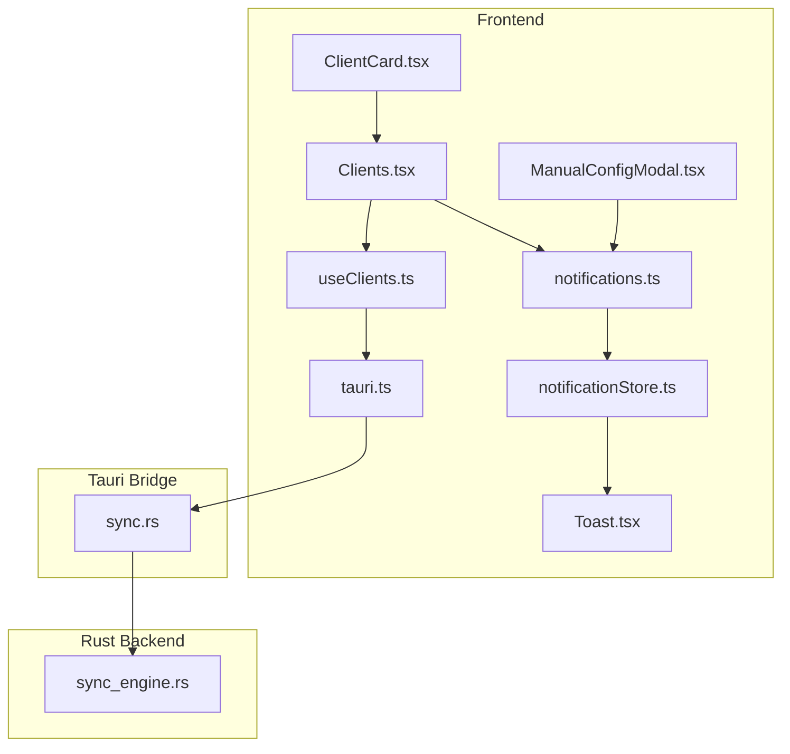
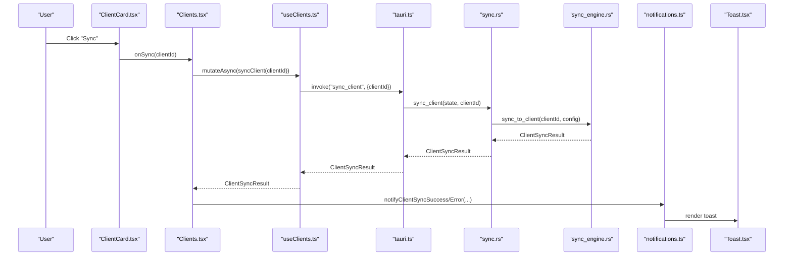
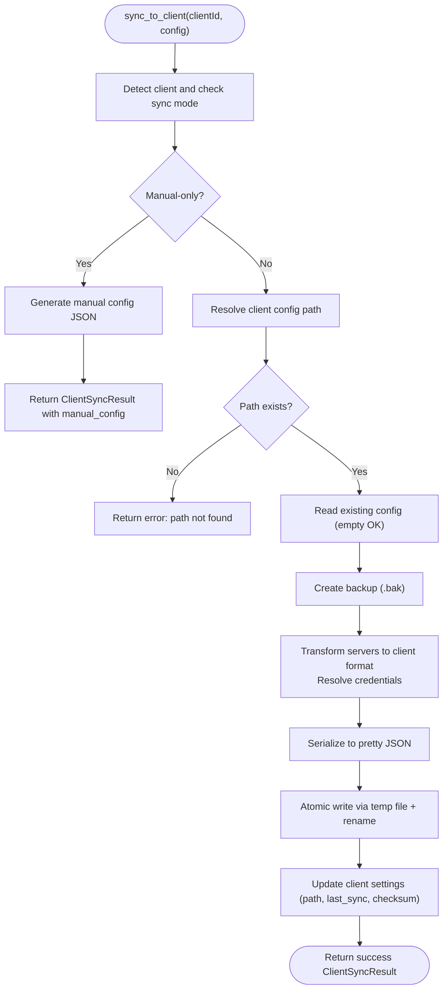
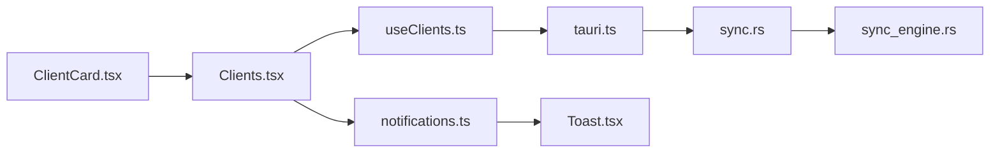

# Manual Sync Process

<cite>
**Referenced Files in This Document**
- [ClientCard.tsx](file://src/components/clients/ClientCard.tsx)
- [Clients.tsx](file://src/pages/Clients.tsx)
- [useClients.ts](file://src/hooks/useClients.ts)
- [tauri.ts](file://src/lib/tauri.ts)
- [sync.rs](file://src-tauri/src/commands/sync.rs)
- [sync_engine.rs](file://src-tauri/src/services/sync_engine.rs)
- [notifications.ts](file://src/lib/notifications.ts)
- [Toast.tsx](file://src/components/common/Toast.tsx)
- [notificationStore.ts](file://src/stores/notificationStore.ts)
- [ManualConfigModal.tsx](file://src/components/clients/ManualConfigModal.tsx)
- [useAutoSync.ts](file://src/hooks/useAutoSync.ts)
</cite>

## Table of Contents

1. [Introduction](#introduction)
2. [Project Structure](#project-structure)
3. [Core Components](#core-components)
4. [Architecture Overview](#architecture-overview)
5. [Detailed Component Analysis](#detailed-component-analysis)
6. [Dependency Analysis](#dependency-analysis)
7. [Performance Considerations](#performance-considerations)
8. [Troubleshooting Guide](#troubleshooting-guide)
9. [Security Considerations](#security-considerations)
10. [Use Cases and Examples](#use-cases-and-examples)
11. [Conclusion](#conclusion)

## Introduction

This document explains the manual sync process that allows users to explicitly trigger configuration synchronization between MCP servers and AI clients. It covers how the manual sync button in the ClientCard component initiates a Tauri command that invokes the SyncEngine to perform immediate configuration updates. It also documents the request-response flow from UI interaction through React Query hooks to Rust backend services, including error handling and user feedback via Toast notifications. Finally, it describes the step-by-step execution of the sync operation: configuration validation, credential resolution, file generation, and atomic write operations, along with troubleshooting guidance and security considerations.

## Project Structure

The manual sync spans React frontend components and hooks, Tauri command bindings, and Rust backend services. The key areas are:

- Frontend UI and orchestration: ClientCard, Clients page, and React Query hooks
- Tauri command bindings: typed wrappers for invoking Rust commands
- Backend services: SyncEngine implementation and command handlers

**Diagram sources**

- [ClientCard.tsx](file://src/components/clients/ClientCard.tsx#L255-L325)
- [Clients.tsx](file://src/pages/Clients.tsx#L41-L116)
- [useClients.ts](file://src/hooks/useClients.ts#L39-L73)
- [tauri.ts](file://src/lib/tauri.ts#L114-L143)
- [sync.rs](file://src-tauri/src/commands/sync.rs#L71-L142)
- [sync_engine.rs](file://src-tauri/src/services/sync_engine.rs#L318-L446)
- [notifications.ts](file://src/lib/notifications.ts#L66-L108)
- [Toast.tsx](file://src/components/common/Toast.tsx#L55-L68)
- [notificationStore.ts](file://src/stores/notificationStore.ts#L1-L97)
- [ManualConfigModal.tsx](file://src/components/clients/ManualConfigModal.tsx#L1-L240)

**Section sources**

- [ClientCard.tsx](file://src/components/clients/ClientCard.tsx#L255-L325)
- [Clients.tsx](file://src/pages/Clients.tsx#L41-L116)
- [useClients.ts](file://src/hooks/useClients.ts#L39-L73)
- [tauri.ts](file://src/lib/tauri.ts#L114-L143)
- [sync.rs](file://src-tauri/src/commands/sync.rs#L71-L142)
- [sync_engine.rs](file://src-tauri/src/services/sync_engine.rs#L318-L446)
- [notifications.ts](file://src/lib/notifications.ts#L66-L108)
- [Toast.tsx](file://src/components/common/Toast.tsx#L55-L68)
- [notificationStore.ts](file://src/stores/notificationStore.ts#L1-L97)
- [ManualConfigModal.tsx](file://src/components/clients/ManualConfigModal.tsx#L1-L240)

## Core Components

- ClientCard: Renders the manual sync button and triggers the onSync callback when clicked.
- Clients page: Handles the onSync callback, invokes the React Query mutation, and displays results and notifications.
- useClients: Provides React Query mutations for syncClient and syncAllClients.
- tauri.ts: Exposes typed wrappers for Tauri commands (sync_client, sync_all_clients).
- sync.rs: Implements Tauri commands that delegate to SyncEngine and update persisted config.
- sync_engine.rs: Implements the SyncEngine with validation, credential resolution, file generation, and atomic writes.
- notifications.ts and Toast/Store: Provide user feedback and toast notifications.

**Section sources**

- [ClientCard.tsx](file://src/components/clients/ClientCard.tsx#L255-L325)
- [Clients.tsx](file://src/pages/Clients.tsx#L41-L116)
- [useClients.ts](file://src/hooks/useClients.ts#L39-L73)
- [tauri.ts](file://src/lib/tauri.ts#L114-L143)
- [sync.rs](file://src-tauri/src/commands/sync.rs#L71-L142)
- [sync_engine.rs](file://src-tauri/src/services/sync_engine.rs#L318-L446)
- [notifications.ts](file://src/lib/notifications.ts#L66-L108)
- [Toast.tsx](file://src/components/common/Toast.tsx#L55-L68)
- [notificationStore.ts](file://src/stores/notificationStore.ts#L1-L97)

## Architecture Overview

The manual sync flow is a request-response pipeline:

- UI: User clicks the Sync button in ClientCard.
- Page: Clients page calls the useSyncClient mutation.
- Hooks: useClients wraps the mutation and invalidates client statuses.
- Tauri: tauri.ts invokes the sync_client command.
- Command: sync.rs loads the configuration, delegates to SyncEngine, and updates persisted settings.
- Engine: sync_engine.rs validates, resolves credentials, transforms, serializes, and writes atomically.
- Feedback: Clients page shows success/error notifications; Toast renders them.

**Diagram sources**

- [ClientCard.tsx](file://src/components/clients/ClientCard.tsx#L276-L325)
- [Clients.tsx](file://src/pages/Clients.tsx#L41-L116)
- [useClients.ts](file://src/hooks/useClients.ts#L39-L49)
- [tauri.ts](file://src/lib/tauri.ts#L114-L117)
- [sync.rs](file://src-tauri/src/commands/sync.rs#L71-L105)
- [sync_engine.rs](file://src-tauri/src/services/sync_engine.rs#L318-L446)
- [notifications.ts](file://src/lib/notifications.ts#L66-L108)
- [Toast.tsx](file://src/components/common/Toast.tsx#L55-L68)

## Detailed Component Analysis

### Manual Sync Button in ClientCard

- The ClientCard component renders a Sync button for clients whose sync mode is not manualOnly.
- The button is disabled when isSyncing is true or when sync is disabled for the client.
- Clicking the button invokes the onSync prop with the client ID.

**Section sources**

- [ClientCard.tsx](file://src/components/clients/ClientCard.tsx#L255-L325)

### Clients Page Orchestration

- The Clients page receives onSync from ClientCard and executes a React Query mutation for syncClient.
- On success, it converts the single result to a SyncResult-like structure for display and shows a success notification.
- On error, it shows a client-specific error notification.
- The page also tracks syncingClientId to reflect loading state in the card.

**Section sources**

- [Clients.tsx](file://src/pages/Clients.tsx#L41-L116)

### React Query Hooks

- useSyncClient returns a mutation that calls the syncClient command and invalidates client statuses.
- useSyncAllClients returns a mutation that calls syncAllClients and invalidates statuses.
- useManualConfig fetches manual config JSON for clients requiring manual configuration.

**Section sources**

- [useClients.ts](file://src/hooks/useClients.ts#L39-L73)

### Tauri Command Bindings

- tauri.ts exposes typed wrappers for sync_client and sync_all_clients.
- These wrappers call @tauri-apps/api core invoke with the command name and arguments.

**Section sources**

- [tauri.ts](file://src/lib/tauri.ts#L114-L143)

### Rust Command Handler

- sync.rs implements sync_client and sync_all_clients.
- Both load the configuration, delegate to SyncEngine, and update persisted settings.
- sync_client updates client settings only when the sync was successful and not manual-only.
- sync_all_clients updates settings for all successful clients and logs failures.

**Section sources**

- [sync.rs](file://src-tauri/src/commands/sync.rs#L71-L142)

### SyncEngine Implementation

The SyncEngine performs:

- Client detection and mode check
- Path resolution and validation
- Reading existing config (empty or missing handled)
- Backup creation
- Transforming servers to client-specific formats
- Credential resolution (keychain references)
- Serialization and atomic write
- Updating client settings with checksum and timestamps

**Diagram sources**

- [sync_engine.rs](file://src-tauri/src/services/sync_engine.rs#L318-L446)
- [sync_engine.rs](file://src-tauri/src/services/sync_engine.rs#L236-L305)
- [sync_engine.rs](file://src-tauri/src/services/sync_engine.rs#L157-L221)

**Section sources**

- [sync_engine.rs](file://src-tauri/src/services/sync_engine.rs#L318-L446)
- [sync_engine.rs](file://src-tauri/src/services/sync_engine.rs#L236-L305)
- [sync_engine.rs](file://src-tauri/src/services/sync_engine.rs#L157-L221)

### Manual Config Modal and Copy Flow

- For clients with manualOnly mode, clicking “Copy Config” opens ManualConfigModal.
- The modal fetches the generated manual config JSON via useManualConfig and copies it to the clipboard.
- Notifications inform the user that the manual config was copied.

**Section sources**

- [ClientCard.tsx](file://src/components/clients/ClientCard.tsx#L255-L276)
- [ManualConfigModal.tsx](file://src/components/clients/ManualConfigModal.tsx#L1-L240)
- [useClients.ts](file://src/hooks/useClients.ts#L66-L73)
- [notifications.ts](file://src/lib/notifications.ts#L102-L108)

## Dependency Analysis

- ClientCard depends on the Clients page’s onSync handler.
- Clients page depends on useSyncClient mutation.
- useSyncClient depends on tauri.ts wrappers and invalidates client statuses.
- tauri.ts wrappers depend on @tauri-apps/api invoke.
- sync.rs depends on AppState and SyncEngine.
- SyncEngine depends on client_detector, keychain, and filesystem operations.

**Diagram sources**

- [ClientCard.tsx](file://src/components/clients/ClientCard.tsx#L255-L325)
- [Clients.tsx](file://src/pages/Clients.tsx#L41-L116)
- [useClients.ts](file://src/hooks/useClients.ts#L39-L73)
- [tauri.ts](file://src/lib/tauri.ts#L114-L143)
- [sync.rs](file://src-tauri/src/commands/sync.rs#L71-L142)
- [sync_engine.rs](file://src-tauri/src/services/sync_engine.rs#L318-L446)
- [notifications.ts](file://src/lib/notifications.ts#L66-L108)
- [Toast.tsx](file://src/components/common/Toast.tsx#L55-L68)

**Section sources**

- [ClientCard.tsx](file://src/components/clients/ClientCard.tsx#L255-L325)
- [Clients.tsx](file://src/pages/Clients.tsx#L41-L116)
- [useClients.ts](file://src/hooks/useClients.ts#L39-L73)
- [tauri.ts](file://src/lib/tauri.ts#L114-L143)
- [sync.rs](file://src-tauri/src/commands/sync.rs#L71-L142)
- [sync_engine.rs](file://src-tauri/src/services/sync_engine.rs#L318-L446)
- [notifications.ts](file://src/lib/notifications.ts#L66-L108)
- [Toast.tsx](file://src/components/common/Toast.tsx#L55-L68)

## Performance Considerations

- Debounced auto-sync: useAutoSync debounces configuration change events to avoid frequent syncs.
- Query caching: React Query caches client statuses and detected clients to reduce redundant network calls.
- Atomic writes: The engine writes to a temporary file and renames it to minimize partial writes and improve reliability.
- Credential resolution: Resolving keychain references occurs only when writing to client configs, avoiding unnecessary overhead in display-only modes.

**Section sources**

- [useAutoSync.ts](file://src/hooks/useAutoSync.ts#L1-L53)
- [useClients.ts](file://src/hooks/useClients.ts#L21-L37)
- [sync_engine.rs](file://src-tauri/src/services/sync_engine.rs#L268-L305)

## Troubleshooting Guide

Common issues and resolutions:

- File locking or permission errors
  - Symptom: Write fails with permission or locking error.
  - Cause: Target config file is locked by another process or lacks write permissions.
  - Resolution: Close the client app, ensure the file is not open elsewhere, and retry. The engine sets restrictive permissions on Unix systems; verify ownership and group membership if needed.

- Invalid or missing client config path
  - Symptom: Sync reports path not found or cannot resolve client path.
  - Cause: Client not detected or path not configured.
  - Resolution: Re-run client detection, confirm the client is installed, and ensure the path is correct.

- Malformed existing configuration
  - Symptom: Read fails with parse error.
  - Cause: Existing file is empty or contains invalid JSON.
  - Resolution: Fix or remove the malformed file; the engine treats empty files as missing and proceeds with generation.

- Credential resolution failures
  - Symptom: Sync fails due to unresolved keychain references.
  - Cause: Missing or inaccessible keychain entries.
  - Resolution: Store required credentials in the keychain and retry.

- Auto-sync logging
  - The backend logs failed syncs to ~/.mcp-nexus/logs/auto-sync.log for diagnostics.

**Section sources**

- [sync_engine.rs](file://src-tauri/src/services/sync_engine.rs#L236-L305)
- [sync.rs](file://src-tauri/src/commands/sync.rs#L1-L69)

## Security Considerations

- Temporary file creation and atomic writes
  - The engine writes to a temporary file and renames it atomically to prevent partial writes.
  - On Unix systems, directory permissions are set to 0700 and file permissions to 0600 to restrict access.
- Credential handling
  - Keychain references are resolved only when writing to client configs; display-only manual config generation preserves references for user review.
- Logging
  - Auto-sync logs include timestamps and client IDs but avoid sensitive data.

**Section sources**

- [sync_engine.rs](file://src-tauri/src/services/sync_engine.rs#L268-L305)
- [sync_engine.rs](file://src-tauri/src/services/sync_engine.rs#L223-L234)
- [sync.rs](file://src-tauri/src/commands/sync.rs#L1-L69)

## Use Cases and Examples

- Recover from failed auto-sync
  - Trigger manual sync to reapply configuration immediately after fixing environment issues (paths, credentials, or client locks).
- Apply bulk changes
  - After adding or updating many servers, use Sync All to propagate changes to all enabled clients.
- Test configuration updates
  - For clients requiring manual configuration, copy the generated JSON to the client’s settings to validate behavior before committing.

**Section sources**

- [Clients.tsx](file://src/pages/Clients.tsx#L77-L97)
- [ManualConfigModal.tsx](file://src/components/clients/ManualConfigModal.tsx#L1-L240)

## Conclusion

The manual sync process integrates UI, React Query, Tauri commands, and a robust Rust SyncEngine. Users can trigger immediate synchronization from the ClientCard, receive clear feedback via notifications and toasts, and rely on secure, atomic file operations. The system supports both automatic and manual workflows, with comprehensive error handling and logging to aid troubleshooting.
