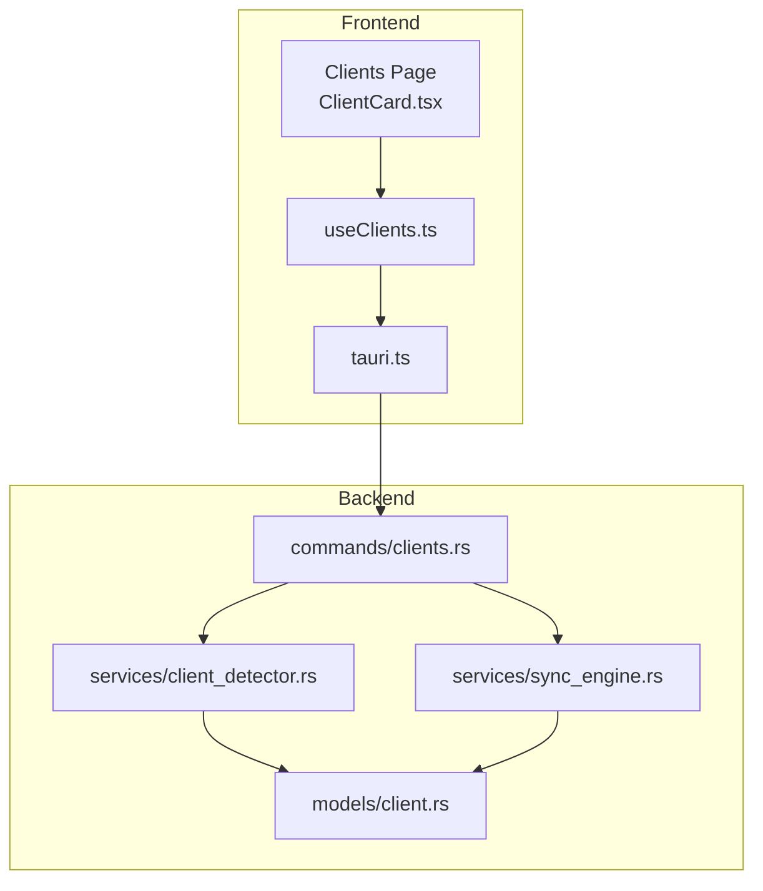
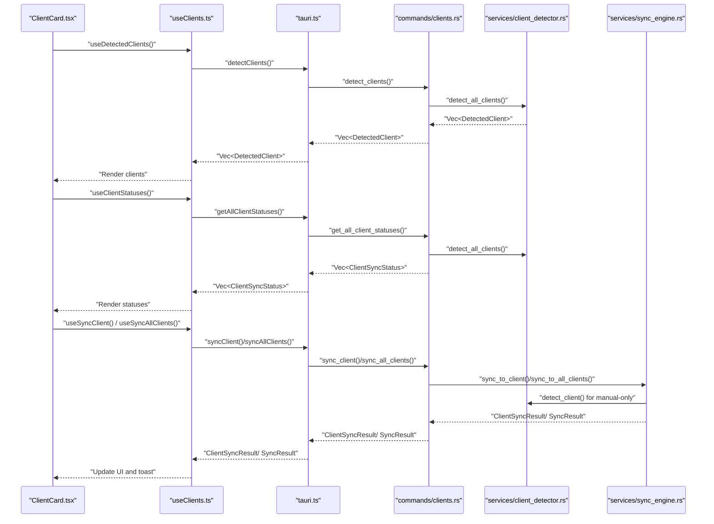
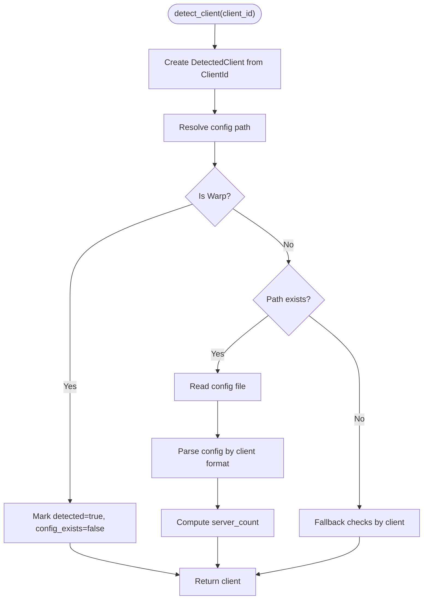
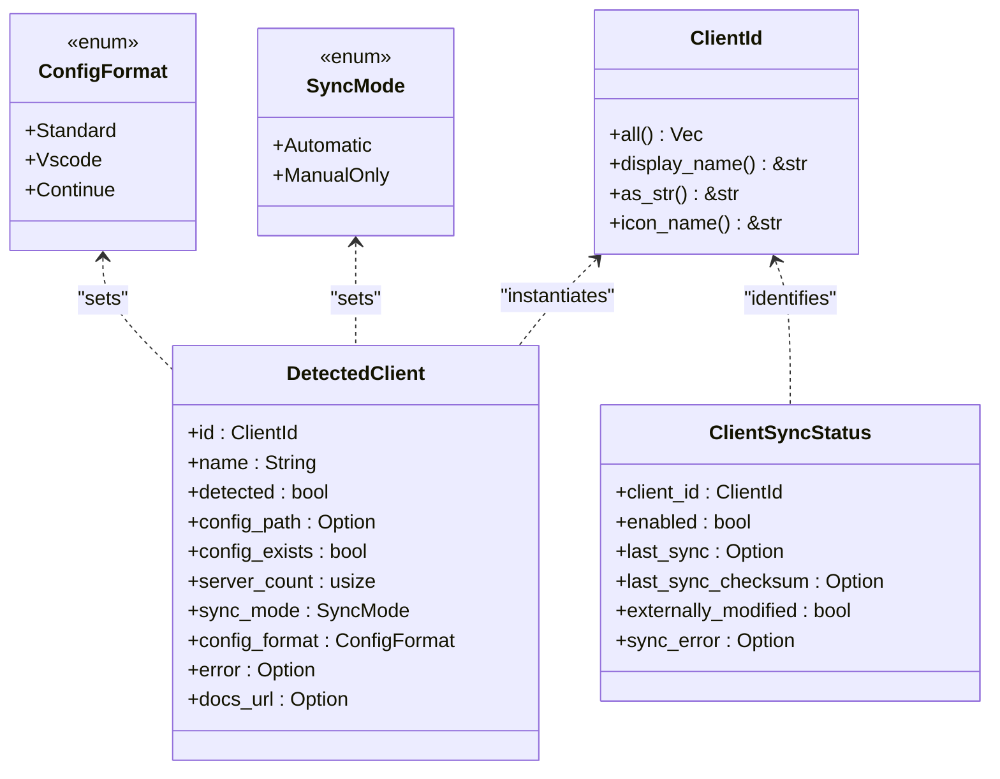
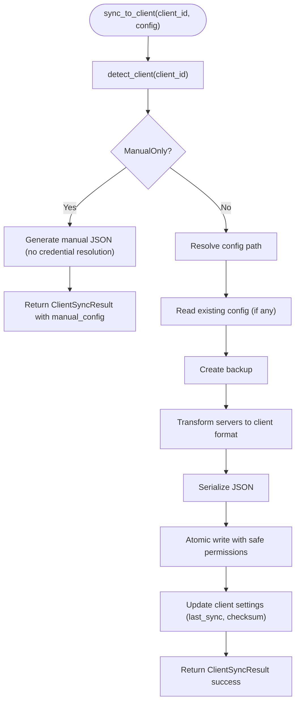
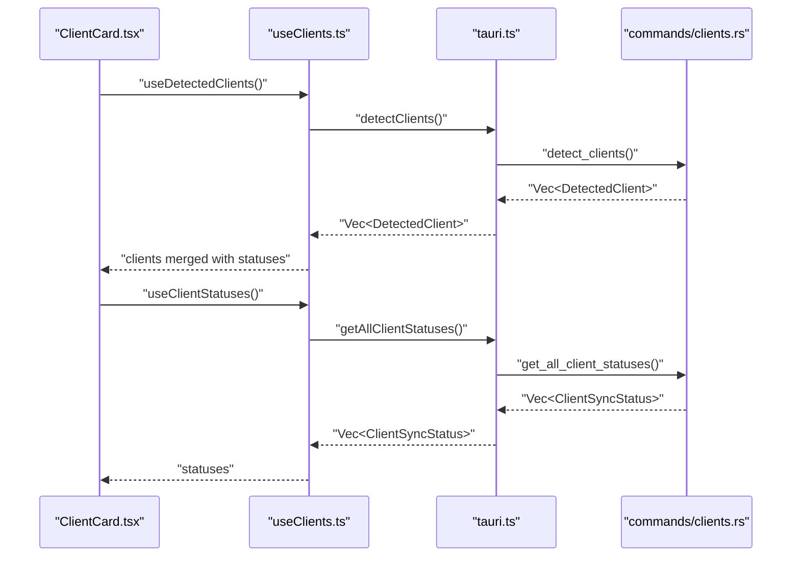
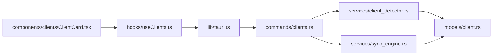

# Supported Clients

<cite>
**Referenced Files in This Document**
- [client_detector.rs](file://src-tauri/src/services/client_detector.rs)
- [client.rs](file://src-tauri/src/models/client.rs)
- [clients.rs](file://src-tauri/src/commands/clients.rs)
- [sync_engine.rs](file://src-tauri/src/services/sync_engine.rs)
- [tauri.ts](file://src/lib/tauri.ts)
- [useClients.ts](file://src/hooks/useClients.ts)
- [ClientCard.tsx](file://src/components/clients/ClientCard.tsx)
- [index.ts](file://src/types/index.ts)
</cite>

## Table of Contents

1. [Introduction](#introduction)
2. [Project Structure](#project-structure)
3. [Core Components](#core-components)
4. [Architecture Overview](#architecture-overview)
5. [Detailed Component Analysis](#detailed-component-analysis)
6. [Dependency Analysis](#dependency-analysis)
7. [Performance Considerations](#performance-considerations)
8. [Troubleshooting Guide](#troubleshooting-guide)
9. [Conclusion](#conclusion)

## Introduction

This document explains how the client synchronization system detects supported AI development environments and manages their configuration. It covers the ClientDetector service logic, the Client model structure, detection patterns for each supported client, and how to add new clients. It also includes troubleshooting guidance for common detection failures and performance considerations for minimizing detection latency.

## Project Structure

The supported clients feature spans Rust backend services, Tauri commands, and React frontend hooks and components:

- Backend (Rust):
  - Client detection and model definitions
  - Sync engine for writing client configs
  - Tauri commands to expose detection and status APIs
- Frontend (TypeScript/React):
  - Tauri bindings for invoking backend commands
  - Hooks for querying detected clients and sync statuses
  - UI cards to display client status and actions

**Diagram sources**

- [clients.rs](file://src-tauri/src/commands/clients.rs#L1-L170)
- [client_detector.rs](file://src-tauri/src/services/client_detector.rs#L1-L216)
- [client.rs](file://src-tauri/src/models/client.rs#L1-L248)
- [sync_engine.rs](file://src-tauri/src/services/sync_engine.rs#L1-L485)
- [tauri.ts](file://src/lib/tauri.ts#L86-L144)
- [useClients.ts](file://src/hooks/useClients.ts#L1-L138)
- [ClientCard.tsx](file://src/components/clients/ClientCard.tsx#L1-L332)

**Section sources**

- [client_detector.rs](file://src-tauri/src/services/client_detector.rs#L1-L216)
- [client.rs](file://src-tauri/src/models/client.rs#L1-L248)
- [clients.rs](file://src-tauri/src/commands/clients.rs#L1-L170)
- [sync_engine.rs](file://src-tauri/src/services/sync_engine.rs#L1-L485)
- [tauri.ts](file://src/lib/tauri.ts#L86-L144)
- [useClients.ts](file://src/hooks/useClients.ts#L1-L138)
- [ClientCard.tsx](file://src/components/clients/ClientCard.tsx#L1-L332)

## Core Components

- ClientId: Enumerates supported clients and provides display names, string identifiers, and icons.
- DetectedClient: Captures detection results including whether a client is detected, its config path, existence, server count, sync mode, config format, and error messages.
- Client detection service: Resolves per-client config paths, checks file existence, parses configs, and performs special handling for manual-only clients.
- Sync engine: Transforms hub servers into client-specific formats and writes them to disk, preserving existing settings where applicable.
- Tauri commands: Expose detection and status queries to the frontend.
- Frontend hooks and components: Fetch and render detected clients, manage sync actions, and surface status and errors.

**Section sources**

- [client.rs](file://src-tauri/src/models/client.rs#L1-L248)
- [client_detector.rs](file://src-tauri/src/services/client_detector.rs#L1-L216)
- [sync_engine.rs](file://src-tauri/src/services/sync_engine.rs#L1-L485)
- [clients.rs](file://src-tauri/src/commands/clients.rs#L1-L170)
- [tauri.ts](file://src/lib/tauri.ts#L86-L144)
- [useClients.ts](file://src/hooks/useClients.ts#L1-L138)
- [ClientCard.tsx](file://src/components/clients/ClientCard.tsx#L1-L332)

## Architecture Overview

The detection and sync pipeline:

**Diagram sources**

- [clients.rs](file://src-tauri/src/commands/clients.rs#L1-L170)
- [client_detector.rs](file://src-tauri/src/services/client_detector.rs#L1-L216)
- [sync_engine.rs](file://src-tauri/src/services/sync_engine.rs#L318-L485)
- [tauri.ts](file://src/lib/tauri.ts#L86-L144)
- [useClients.ts](file://src/hooks/useClients.ts#L1-L138)
- [ClientCard.tsx](file://src/components/clients/ClientCard.tsx#L1-L332)

## Detailed Component Analysis

### Client Detection Service

The detection service resolves a client’s configuration path, checks for file existence, and parses the configuration to count servers. It also includes special handling for manual-only clients.

Key behaviors:

- Resolves per-client config paths using the user’s home directory.
- For manual-only clients, marks detection as true but sets config existence to false.
- If the config file exists, attempts to parse it and extract server counts and names.
- If the config file does not exist, performs lightweight checks to infer installation presence (e.g., application bundle or directory presence).
- Aggregates detection results for all clients.

**Diagram sources**

- [client_detector.rs](file://src-tauri/src/services/client_detector.rs#L123-L216)

**Section sources**

- [client_detector.rs](file://src-tauri/src/services/client_detector.rs#L1-L216)

### Client Model Structure

The Client model defines supported clients, sync modes, config formats, and detection results.

- ClientId: Enumerates supported clients and provides display names, string identifiers, and icons.
- SyncMode: Indicates whether a client syncs automatically or requires manual configuration.
- ConfigFormat: Indicates the schema used by the client for MCP server configuration.
- DetectedClient: Holds detection metadata and status used by the UI and sync engine.
- ClientSyncStatus: Tracks sync settings and externally modified state.

**Diagram sources**

- [client.rs](file://src-tauri/src/models/client.rs#L1-L248)

**Section sources**

- [client.rs](file://src-tauri/src/models/client.rs#L1-L248)

### Sync Engine and Client-Specific Formats

The sync engine transforms hub servers into client-specific formats and writes them atomically, preserving existing settings for clients that support layered configs.

- Standard format: {"mcpServers": {"name": {...}, ...}}
- VS Code format: {"mcp": {"servers": {"name": {...}, ...}}} with preservation of existing settings
- Continue.dev format: Merges {"mcpServers": {...}} into existing config
- Manual-only clients (e.g., Warp): Generate a human-readable JSON for copy/paste without writing to disk

**Diagram sources**

- [sync_engine.rs](file://src-tauri/src/services/sync_engine.rs#L318-L485)
- [client_detector.rs](file://src-tauri/src/services/client_detector.rs#L123-L216)

**Section sources**

- [sync_engine.rs](file://src-tauri/src/services/sync_engine.rs#L1-L485)

### Frontend Integration

- Tauri bindings expose commands for detection, status, and sync operations.
- React hooks fetch detected clients and statuses, merge them, and provide UI actions.
- ClientCard renders detection status, server counts, last sync, and actions (sync or copy manual config).

**Diagram sources**

- [tauri.ts](file://src/lib/tauri.ts#L86-L144)
- [useClients.ts](file://src/hooks/useClients.ts#L1-L138)
- [clients.rs](file://src-tauri/src/commands/clients.rs#L1-L170)
- [ClientCard.tsx](file://src/components/clients/ClientCard.tsx#L1-L332)

**Section sources**

- [tauri.ts](file://src/lib/tauri.ts#L86-L144)
- [useClients.ts](file://src/hooks/useClients.ts#L1-L138)
- [clients.rs](file://src-tauri/src/commands/clients.rs#L1-L170)
- [ClientCard.tsx](file://src/components/clients/ClientCard.tsx#L1-L332)

## Dependency Analysis

- commands/clients.rs depends on services/client_detector.rs and services/sync_engine.rs to provide detection and status APIs.
- services/client_detector.rs depends on models/client.rs for enums and structures.
- services/sync_engine.rs depends on models/client.rs and uses client_detector.rs to determine sync mode and formats.
- Frontend tauri.ts exposes typed commands consumed by React hooks and components.

**Diagram sources**

- [clients.rs](file://src-tauri/src/commands/clients.rs#L1-L170)
- [client_detector.rs](file://src-tauri/src/services/client_detector.rs#L1-L216)
- [sync_engine.rs](file://src-tauri/src/services/sync_engine.rs#L1-L485)
- [client.rs](file://src-tauri/src/models/client.rs#L1-L248)
- [tauri.ts](file://src/lib/tauri.ts#L86-L144)
- [useClients.ts](file://src/hooks/useClients.ts#L1-L138)
- [ClientCard.tsx](file://src/components/clients/ClientCard.tsx#L1-L332)

**Section sources**

- [clients.rs](file://src-tauri/src/commands/clients.rs#L1-L170)
- [client_detector.rs](file://src-tauri/src/services/client_detector.rs#L1-L216)
- [sync_engine.rs](file://src-tauri/src/services/sync_engine.rs#L1-L485)
- [client.rs](file://src-tauri/src/models/client.rs#L1-L248)
- [tauri.ts](file://src/lib/tauri.ts#L86-L144)
- [useClients.ts](file://src/hooks/useClients.ts#L1-L138)
- [ClientCard.tsx](file://src/components/clients/ClientCard.tsx#L1-L332)

## Performance Considerations

- Minimize filesystem operations:
  - Use targeted path checks and avoid recursive scans.
  - Cache detection results for short intervals (frontend uses staleTime).
- Reduce JSON parsing overhead:
  - Only parse when config files exist.
  - Avoid repeated checksum computations unless needed.
- Parallelize where appropriate:
  - The backend detects all clients in a single pass.
  - Frontend queries are debounced and cached via React Query.
- Respect OS-specific constraints:
  - On Unix-like systems, ensure safe permissions on created directories and files.
- Avoid blocking UI:
  - Keep detection and sync operations asynchronous and off the main thread.

[No sources needed since this section provides general guidance]

## Troubleshooting Guide

Common detection failures and resolutions:

- Permission issues:
  - Symptom: Config file exists but cannot be read or parsed.
  - Resolution: Ensure the application has read access to the user’s home directory and the specific config file path. On Unix-like systems, verify file permissions are set appropriately.
  - Evidence: Detection service returns read or parse errors captured in the client’s error field.

- Non-standard installations:
  - Symptom: Client appears undetected despite being installed.
  - Resolution: Confirm the client’s config path aligns with the expected standard path. For manual-only clients, detection may rely on placeholders or application presence checks.
  - Evidence: Detection falls back to application bundle or directory checks for certain clients.

- Version incompatibilities:
  - Symptom: Parsing fails due to unexpected config schema.
  - Resolution: Validate the client’s config format matches the expected schema. The sync engine preserves existing settings for clients that support layered configs.

- External modifications:
  - Symptom: UI indicates “Modified externally”.
  - Resolution: The system computes checksums and compares them to previously recorded values. Re-sync to reconcile differences.

- Manual-only clients:
  - Symptom: Sync button disabled; UI suggests copying manual config.
  - Resolution: Use the “Copy Config” action to generate a manual configuration string for clients that require manual paste.

**Section sources**

- [client_detector.rs](file://src-tauri/src/services/client_detector.rs#L1-L216)
- [clients.rs](file://src-tauri/src/commands/clients.rs#L1-L170)
- [sync_engine.rs](file://src-tauri/src/services/sync_engine.rs#L1-L485)
- [ClientCard.tsx](file://src/components/clients/ClientCard.tsx#L1-L332)

## Conclusion

The supported clients feature integrates a robust detection service, a flexible sync engine, and a responsive frontend to streamline client configuration management. By understanding the detection logic, client model structure, and sync formats, developers can confidently add new clients and troubleshoot common issues while maintaining performance and reliability.

[No sources needed since this section summarizes without analyzing specific files]
