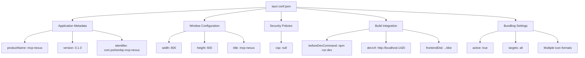
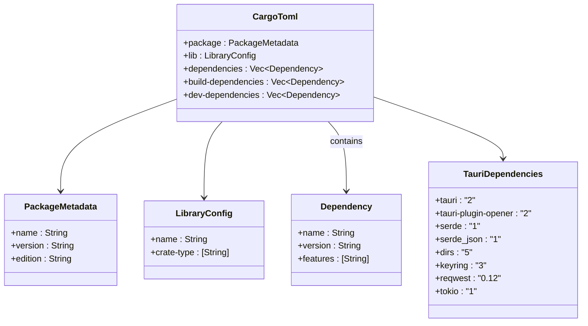
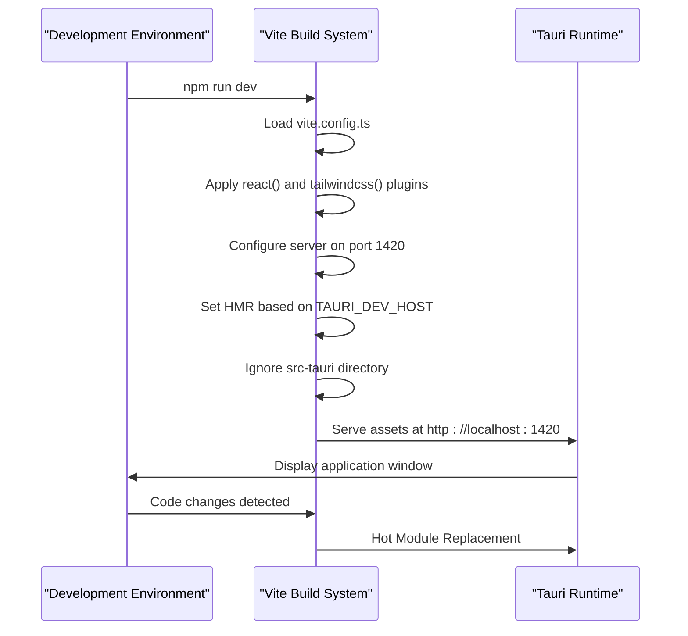

# Application Settings

<cite>
**Referenced Files in This Document**   
- [tauri.conf.json](file://src-tauri/tauri.conf.json)
- [Cargo.toml](file://src-tauri/Cargo.toml)
- [vite.config.ts](file://vite.config.ts)
- [tsconfig.json](file://tsconfig.json)
- [tsconfig.node.json](file://tsconfig.node.json)
- [package.json](file://package.json)
</cite>

## Table of Contents

1. [Introduction](#introduction)
2. [Tauri Configuration with tauri.conf.json](#tauri-configuration-with-tauriconfjson)
3. [Rust Backend Configuration via Cargo.toml](#rust-backend-configuration-via-cargotoml)
4. [Frontend Build Customization in vite.config.ts](#frontend-build-customization-in-viteconfigts)
5. [TypeScript Compilation Settings in tsconfig.json](#typescript-compilation-settings-in-tsconfigjson)
6. [Integration with Build Pipeline](#integration-with-build-pipeline)
7. [Common Configuration Issues and Best Practices](#common-configuration-issues-and-best-practices)
8. [Conclusion](#conclusion)

## Introduction

This document provides a comprehensive overview of the application-level configuration system in MCP Nexus, a desktop application built using the Tauri framework. The architecture leverages multiple configuration files to manage frontend, backend, build, and compilation settings across development and production environments. This guide details the role and structure of key configuration files including `tauri.conf.json`, `Cargo.toml`, `vite.config.ts`, and `tsconfig.json`, explaining how they collectively define application behavior, security policies, dependency management, and cross-platform build targets.

## Tauri Configuration with tauri.conf.json

The `tauri.conf.json` file serves as the central configuration for the Tauri desktop application, defining core application metadata, window behavior, security policies, and bundling options. This JSON-based configuration is essential for controlling how the application behaves at runtime and during packaging.

Key configuration sections include:

- **Application Metadata**: The `productName`, `version`, and `identifier` fields define the application's identity. The identifier follows reverse domain notation (e.g., `com.joshsmbp.mcp-nexus`) and is used by operating systems for app recognition and data storage.
- **Window Settings**: The `app.windows` array configures the initial dimensions and title of the main application window. In MCP Nexus, the default window size is set to 800×600 pixels with the title "mcp-nexus".
- **Security Policies**: The `app.security.csp` field controls Content Security Policy directives. Currently set to `null`, this allows maximum flexibility during development but should be tightened in production to prevent code injection attacks.
- **Build Integration**: The `build` section specifies commands to run before development and production builds (`beforeDevCommand`, `beforeBuildCommand`), the development server URL (`devUrl`), and the location of compiled frontend assets (`frontendDist`).
- **Bundling Configuration**: The `bundle` section enables application packaging for distribution, with `targets` set to "all" to support multiple platforms. Application icons in various formats and resolutions are specified in the `icon` array to ensure proper display across different operating systems.



**Diagram sources**

- [tauri.conf.json](file://src-tauri/tauri.conf.json#L1-L35)

**Section sources**

- [tauri.conf.json](file://src-tauri/tauri.conf.json#L1-L35)

## Rust Backend Configuration via Cargo.toml

The `Cargo.toml` file in the `src-tauri` directory manages the Rust backend dependencies, build configuration, and project metadata. As the manifest for Cargo (Rust's package manager), it plays a critical role in defining the application's native functionality and system integrations.

The configuration includes:

- **Package Metadata**: Basic information such as name, version, authors, and Rust edition (2021).
- **Library Configuration**: The `[lib]` section defines the crate type as `staticlib`, `cdylib`, and `rlib`, enabling the Rust code to be linked with the frontend application across different platforms.
- **Build Dependencies**: `tauri-build` is included as a build dependency, providing macros and build-time functionality required by Tauri.
- **Runtime Dependencies**: Key dependencies include:
  - `tauri` with `devtools` feature enabled for debugging
  - `tauri-plugin-opener` for handling external URL opening
  - `serde` and `serde_json` for data serialization
  - `dirs` for platform-specific directory paths
  - `keyring` for secure credential storage across operating systems
  - `reqwest` for HTTP requests to external APIs
  - `tokio` as the async runtime for non-blocking operations
- **Development Dependencies**: `tempfile` is used for testing scenarios requiring temporary file system operations.

The dependency management approach ensures cross-platform compatibility while providing access to system-level features through Tauri plugins and Rust crates.



**Diagram sources**

- [Cargo.toml](file://src-tauri/Cargo.toml#L1-L37)

**Section sources**

- [Cargo.toml](file://src-tauri/Cargo.toml#L1-L37)

## Frontend Build Customization in vite.config.ts

The `vite.config.ts` file configures the Vite build system for the React frontend, enabling fast development server startup and optimized production builds. This TypeScript configuration integrates closely with Tauri's development workflow.

Key configuration aspects include:

- **Plugins**: The configuration registers essential plugins:
  - `@vitejs/plugin-react` for React JSX transformation
  - `@tailwindcss/vite` for Tailwind CSS integration
- **Development Server Settings**:
  - Fixed port 1420 to align with Tauri's expectations
  - `strictPort: true` ensures the build fails if the port is unavailable
  - Conditional WebSocket configuration for Hot Module Replacement (HMR) when running in Tauri dev mode
- **Build Optimization**:
  - `clearScreen: false` prevents Vite from obscuring Rust compilation errors
  - File system watcher ignores the `src-tauri` directory to prevent unnecessary rebuilds
- **Environment Integration**: The configuration dynamically adapts based on the `TAURI_DEV_HOST` environment variable, enabling proper integration between the frontend development server and the Tauri backend.

This configuration ensures seamless interaction between the React frontend and Tauri backend during development while maintaining optimal build performance.



**Diagram sources**

- [vite.config.ts](file://vite.config.ts#L1-L34)

**Section sources**

- [vite.config.ts](file://vite.config.ts#L1-L34)

## TypeScript Compilation Settings in tsconfig.json

The TypeScript configuration in MCP Nexus is managed through two complementary files: `tsconfig.json` for the main application and `tsconfig.node.json` for build-time scripts.

The primary `tsconfig.json` includes:

- **Compilation Target**: ES2020 for broad browser compatibility
- **Module Configuration**: ESNext modules with bundler-style resolution
- **Strict Type Checking**: Enabled through `strict: true` and related flags (`noUnusedLocals`, `noFallthroughCasesInSwitch`)
- **React Support**: JSX compilation using the `react-jsx` transform
- **Project References**: Includes `tsconfig.node.json` to share configuration between application and build scripts
- **Source Inclusion**: Targets the `src` directory for type checking

The `tsconfig.node.json` file specifically configures the environment for `vite.config.ts`, setting:

- `composite: true` to enable project references
- Module resolution compatible with Vite's expectations
- Inclusion of build configuration files

This dual-configuration approach ensures consistent type checking across both application code and build scripts while accommodating their different runtime environments.

```mermaid
graph TD
A["tsconfig.json"] --> B["Compiler Options"]
A --> C["Project Structure"]
B --> B1["target: ES2020"]
B --> B2["module: ESNext"]
B --> B3["moduleResolution: bundler"]
B --> B4["strict: true"]
B --> B5["jsx: react-jsx"]
C --> C1["include: src"]
C --> C2["references: tsconfig.node.json"]
D["tsconfig.node.json"] --> D1["composite: true"]
D --> D2["module: ESNext"]
D --> D3["moduleResolution: bundler"]
D --> D4["include: vite.config.ts"]
A --> D : references
```

**Diagram sources**

- [tsconfig.json](file://tsconfig.json#L1-L25)
- [tsconfig.node.json](file://tsconfig.node.json#L1-L10)

**Section sources**

- [tsconfig.json](file://tsconfig.json#L1-L25)
- [tsconfig.node.json](file://tsconfig.node.json#L1-L10)

## Integration with Build Pipeline

The configuration files work together to create a cohesive build pipeline that integrates frontend and backend compilation. The process flows as follows:

1. **Development Workflow**: Running `npm run dev` triggers Vite to start the development server on port 1420, while Tauri launches a desktop window pointing to this URL.
2. **Production Build**: The `npm run build` command first runs `tsc` to type-check the code, then invokes Vite to compile and bundle the frontend assets into the `dist` directory.
3. **Tauri Integration**: Tauri's build process references the compiled assets via the `frontendDist` setting and bundles them with the Rust binary.
4. **Cross-Platform Packaging**: The final application is packaged for all platforms with appropriate icons and metadata from the configuration files.

The `package.json` scripts coordinate this workflow, ensuring that TypeScript compilation, frontend bundling, and native binary compilation occur in the correct sequence.

**Section sources**

- [package.json](file://package.json#L6-L9)
- [tauri.conf.json](file://src-tauri/tauri.conf.json#L7-L10)

## Common Configuration Issues and Best Practices

### Version Compatibility

- Ensure Tauri CLI version in `package.json` matches the Tauri crate version in `Cargo.toml`
- Keep TypeScript version compatible with Vite and React type definitions
- Verify plugin versions (e.g., `@tauri-apps/plugin-opener`) match the Tauri major version

### Security Considerations

- Never leave `csp: null` in production builds; implement strict Content Security Policies
- Review Tauri allowlist configuration to minimize exposed system APIs
- Use the `keyring` dependency properly for secure credential storage rather than plaintext

### Cross-Platform Consistency

- Test window dimensions and behavior across Windows, macOS, and Linux
- Verify icon formats work on all target platforms (ICNS for macOS, ICO for Windows)
- Ensure file paths in configuration use forward slashes for cross-platform compatibility

### Performance Optimization

- Adjust Vite's `server.hmr` settings for optimal development experience
- Consider code splitting in production builds for faster startup
- Use Tauri's capability system to minimize bundle size by only including needed features

### Maintenance Best Practices

- Use consistent versioning between frontend and backend components
- Document custom configuration changes for team onboarding
- Implement configuration validation where possible
- Keep sensitive data out of configuration files using environment variables

**Section sources**

- [tauri.conf.json](file://src-tauri/tauri.conf.json)
- [Cargo.toml](file://src-tauri/Cargo.toml)
- [vite.config.ts](file://vite.config.ts)
- [tsconfig.json](file://tsconfig.json)
- [package.json](file://package.json)

## Conclusion

The application configuration system in MCP Nexus demonstrates a well-architected approach to managing a modern desktop application. By leveraging specialized configuration files for different concerns—Tauri for desktop integration, Cargo for Rust dependencies, Vite for frontend builds, and TypeScript for compilation—the project maintains clear separation of concerns while enabling deep integration between components. Understanding these configuration files is essential for extending functionality, optimizing performance, and ensuring cross-platform consistency. Proper maintenance of these files will be critical as the application evolves and new features are added.
