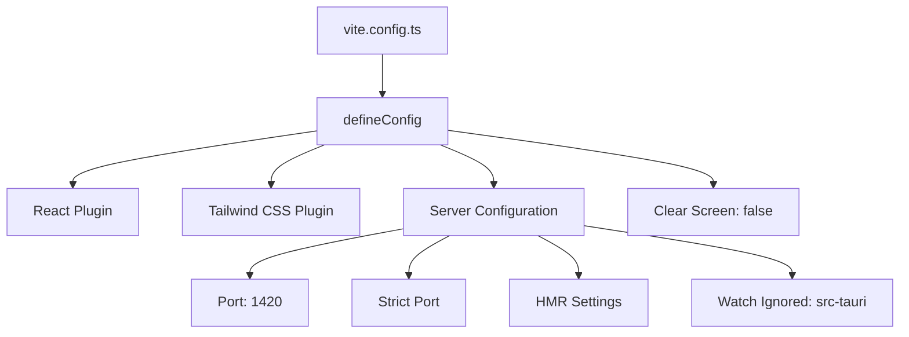
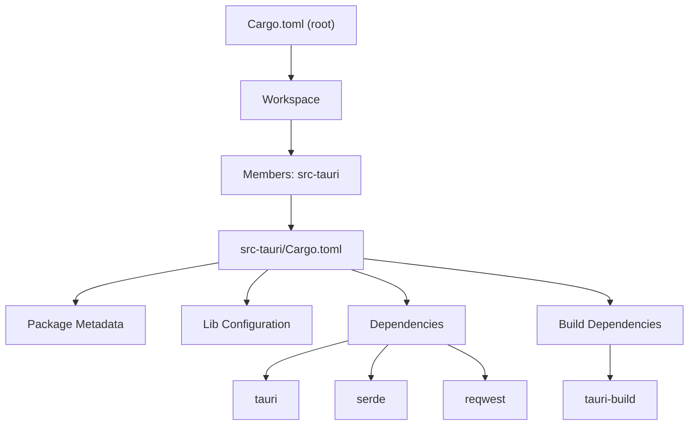
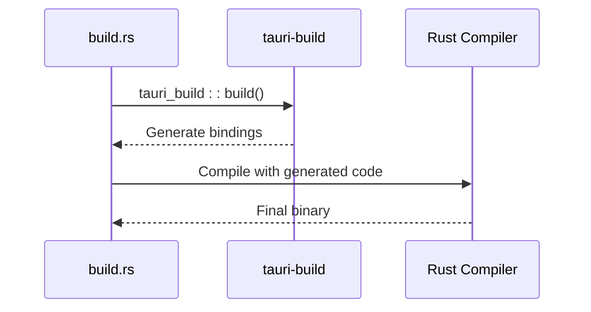
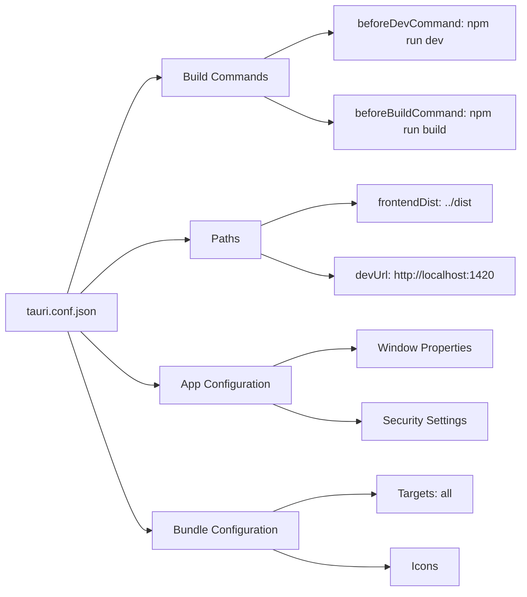
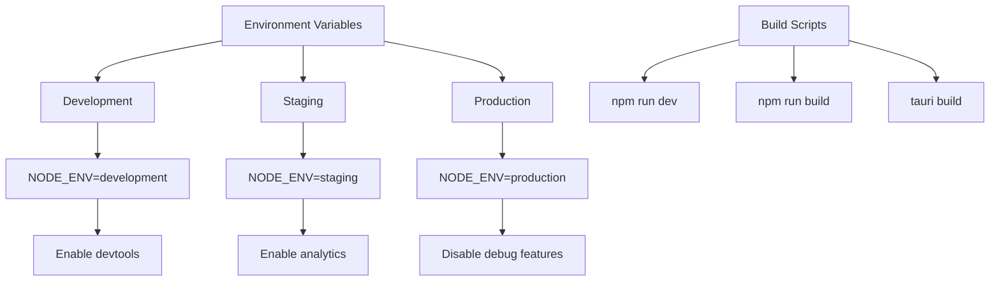
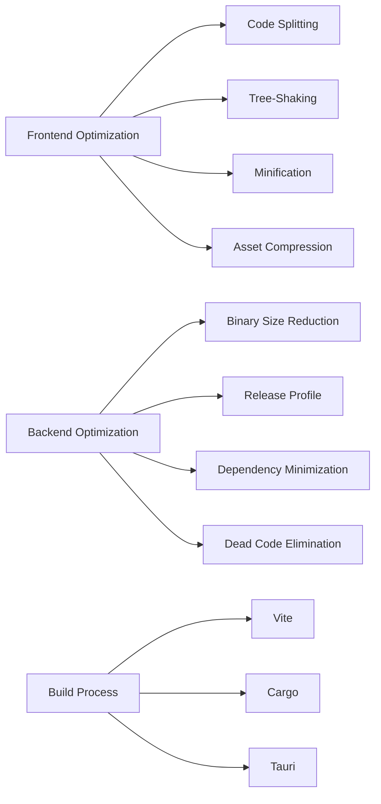
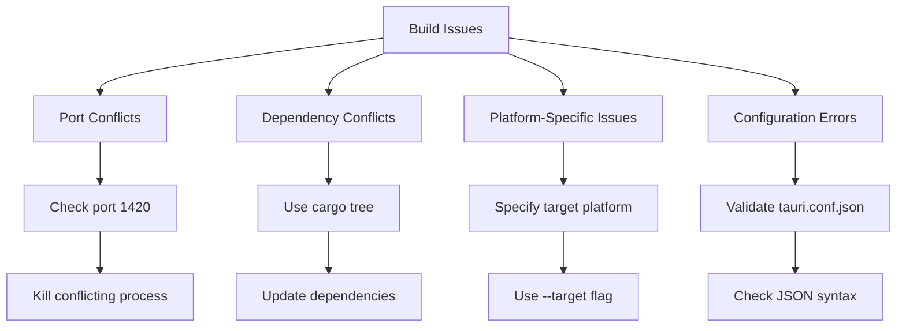

# Build Configuration

<cite>
**Referenced Files in This Document**   
- [vite.config.ts](file://vite.config.ts)
- [tsconfig.json](file://tsconfig.json)
- [tsconfig.node.json](file://tsconfig.node.json)
- [Cargo.toml](file://Cargo.toml)
- [src-tauri/Cargo.toml](file://src-tauri/Cargo.toml)
- [src-tauri/build.rs](file://src-tauri/build.rs)
- [package.json](file://package.json)
- [src-tauri/tauri.conf.json](file://src-tauri/tauri.conf.json)
</cite>

## Table of Contents

1. [Introduction](#introduction)
2. [Frontend Build Configuration](#frontend-build-configuration)
3. [Backend Build Configuration](#backend-build-configuration)
4. [Integration Between Frontend and Backend Builds](#integration-between-frontend-and-backend-builds)
5. [Environment-Specific Build Customization](#environment-specific-build-customization)
6. [Performance Optimization Techniques](#performance-optimization-techniques)
7. [Troubleshooting Common Build Issues](#troubleshooting-common-build-issues)
8. [Conclusion](#conclusion)

## Introduction

This document provides a comprehensive overview of the build-time configuration system in MCP Nexus, a Tauri-based desktop application. The build configuration orchestrates the compilation, optimization, and bundling of both frontend and backend components into a single executable application. The system leverages Vite for frontend asset processing, TypeScript for type safety, and Cargo with Rust for backend compilation, all integrated through Tauri's build system. This configuration enables efficient development workflows, environment-specific builds, and performance optimizations critical for a modern desktop application.

**Section sources**

- [vite.config.ts](file://vite.config.ts#L1-L34)
- [tsconfig.json](file://tsconfig.json#L1-L26)
- [src-tauri/Cargo.toml](file://src-tauri/Cargo.toml#L1-L37)
- [src-tauri/build.rs](file://src-tauri/build.rs#L1-L4)

## Frontend Build Configuration

The frontend build process in MCP Nexus is orchestrated by `vite.config.ts`, which configures the Vite build tool for development and production. This configuration integrates seamlessly with Tauri, ensuring that the frontend assets are correctly compiled and served during development and properly bundled for production. The configuration includes essential plugins for React and Tailwind CSS, which are critical for the application's UI framework and styling system.



**Diagram sources**

- [vite.config.ts](file://vite.config.ts#L1-L34)

The `vite.config.ts` file defines a configuration object that tailors Vite's behavior specifically for Tauri development. Key settings include a fixed server port (1420) to ensure compatibility with Tauri's dev server, strict port enforcement to fail if the port is unavailable, and HMR (Hot Module Replacement) configuration that uses WebSocket protocol when a Tauri dev host is specified. The configuration also prevents Vite from clearing the terminal screen, which helps preserve Rust compilation errors, and explicitly ignores the `src-tauri` directory from file watching to prevent unnecessary rebuilds.

**Section sources**

- [vite.config.ts](file://vite.config.ts#L1-L34)
- [package.json](file://package.json#L7-L19)

Type safety and compilation output for the TypeScript codebase are managed by `tsconfig.json`. This file specifies compiler options that ensure code quality and compatibility. The configuration targets ES2020 for broad browser support, uses ESNext modules for modern JavaScript features, and enables strict type checking to catch errors early in development. The `moduleResolution` is set to "bundler" to work with modern build tools, and `isolatedModules` is enabled to support tools like Babel and TypeScript's `transpileModule` API.

```mermaid
classDiagram
class TsConfig {
+target : "ES2020"
+lib : ["ES2020", "DOM", "DOM.Iterable"]
+module : "ESNext"
+moduleResolution : "bundler"
+strict : true
+noFallthroughCasesInSwitch : true
+include : ["src"]
+references : [{path : "./tsconfig.node.json"}]
}
class TsConfigNode {
+composite : true
+module : "ESNext"
+moduleResolution : "bundler"
+include : ["vite.config.ts"]
}
TsConfig --> TsConfigNode : references
```

**Diagram sources**

- [tsconfig.json](file://tsconfig.json#L1-L26)
- [tsconfig.node.json](file://tsconfig.node.json#L1-L11)

The `tsconfig.node.json` file complements the main configuration by providing settings specifically for Node.js environments, such as the Vite configuration file. It enables the `composite` flag for project references and includes `vite.config.ts` in its scope, ensuring that the build configuration itself is type-checked.

**Section sources**

- [tsconfig.json](file://tsconfig.json#L1-L26)
- [tsconfig.node.json](file://tsconfig.node.json#L1-L11)

## Backend Build Configuration

The backend build process in MCP Nexus is managed by Cargo, Rust's package manager and build system, with configuration defined in `Cargo.toml` files. The root `Cargo.toml` establishes a workspace with the `src-tauri` member, allowing for a monorepo structure where the frontend and backend can be developed and built together. This workspace configuration enables shared dependencies and streamlined build commands across the entire project.



**Diagram sources**

- [Cargo.toml](file://Cargo.toml#L1-L4)
- [src-tauri/Cargo.toml](file://src-tauri/Cargo.toml#L1-L37)

The `src-tauri/Cargo.toml` file contains the detailed configuration for the Tauri application. It defines the package metadata, including the application name, version, and authors. The `lib` section configures the Rust library to be compiled as a static library, C dynamic library, and Rust library, which is necessary for Tauri's integration with the frontend. The dependencies list includes essential crates like `tauri` for the core framework, `serde` for serialization, `reqwest` for HTTP requests, and `keyring` for secure credential storage.

The `build.rs` file in the `src-tauri` directory is a build script that runs before the main compilation. It contains a minimal configuration that calls `tauri_build::build()`, which generates the necessary bindings and configurations for Tauri. This script is crucial for enabling communication between the Rust backend and the JavaScript frontend, as it processes the Tauri configuration and generates the required code for inter-process communication.



**Diagram sources**

- [src-tauri/build.rs](file://src-tauri/build.rs#L1-L4)
- [src-tauri/Cargo.toml](file://src-tauri/Cargo.toml#L1-L37)

**Section sources**

- [Cargo.toml](file://Cargo.toml#L1-L4)
- [src-tauri/Cargo.toml](file://src-tauri/Cargo.toml#L1-L37)
- [src-tauri/build.rs](file://src-tauri/build.rs#L1-L4)

## Integration Between Frontend and Backend Builds

The integration between the frontend and backend builds is orchestrated through Tauri's configuration in `tauri.conf.json`. This file defines how the two components are connected during the build process. The `build` section specifies commands to run before development and build, ensuring that the frontend is compiled before the Tauri application starts. The `beforeDevCommand` runs `npm run dev` to start the Vite development server, while `beforeBuildCommand` runs `npm run build` to create optimized production assets.



**Diagram sources**

- [src-tauri/tauri.conf.json](file://src-tauri/tauri.conf.json#L1-L36)

The `frontendDist` field points to the `../dist` directory, which is where Vite outputs the compiled frontend assets. During the build process, Tauri copies these assets into the final application bundle. The `devUrl` setting specifies the address of the development server, allowing the Tauri application to load the frontend from the Vite server during development, enabling hot reloading and fast feedback loops.

Environment variables are injected into the build process through the `package.json` scripts and Tauri's configuration. The `dev`, `build`, and `preview` scripts in `package.json` define the commands for different build scenarios, ensuring that the correct environment is used. This integration allows for conditional compilation and feature toggling based on the build environment, such as enabling devtools in development but disabling them in production.

**Section sources**

- [src-tauri/tauri.conf.json](file://src-tauri/tauri.conf.json#L1-L36)
- [package.json](file://package.json#L7-L19)

## Environment-Specific Build Customization

MCP Nexus supports customization of builds for different environments through a combination of configuration files and build scripts. The `package.json` file defines distinct scripts for development, staging, and production, allowing developers to run the appropriate command for their current environment. For example, the `dev` script starts the Vite development server, while the `build` script compiles the frontend for production.

Conditional compilation in the Rust backend is managed through Cargo features and environment variables. The `devtools` feature is enabled in the `tauri` dependency, which can be toggled based on the build profile. This allows developers to include debugging tools in development builds while excluding them from production to reduce binary size and improve security.

Version metadata is embedded in the application through the `Cargo.toml` file, which contains the application's version number. This metadata is automatically included in the final build and can be accessed by the application at runtime. The version can be updated in a single location, ensuring consistency across the application.



**Diagram sources**

- [package.json](file://package.json#L7-L19)
- [src-tauri/Cargo.toml](file://src-tauri/Cargo.toml#L1-L37)

Custom build scripts can be created by modifying the `build.rs` file or adding new scripts to `package.json`. These scripts can perform tasks such as code generation, asset optimization, or environment-specific configuration. For example, a custom script could generate API clients from OpenAPI specifications or optimize images for different platforms.

**Section sources**

- [package.json](file://package.json#L7-L19)
- [src-tauri/Cargo.toml](file://src-tauri/Cargo.toml#L1-L37)
- [src-tauri/build.rs](file://src-tauri/build.rs#L1-L4)

## Performance Optimization Techniques

MCP Nexus employs several performance optimization techniques to ensure a fast and responsive application. On the frontend, Vite's native ES modules and lazy loading enable code splitting, which reduces the initial load time by only loading the necessary code for the current view. Tree-shaking is automatically performed by Vite and Rollup to eliminate unused code from the final bundle, further reducing the asset size.

Binary size reduction in the Rust backend is achieved through Cargo's release profile and dependency management. The `Cargo.toml` file can be configured to strip debug symbols and optimize for size in release builds. Dependencies are carefully selected to minimize bloat, with crates like `serde` and `reqwest` providing essential functionality without excessive overhead.

Asset optimization is handled by Vite and Tailwind CSS. Vite automatically minifies JavaScript and CSS in production builds, while Tailwind's JIT (Just-In-Time) compiler generates only the CSS classes that are actually used in the application. This results in highly optimized stylesheets that are much smaller than traditional utility-first CSS frameworks.



**Diagram sources**

- [vite.config.ts](file://vite.config.ts#L1-L34)
- [src-tauri/Cargo.toml](file://src-tauri/Cargo.toml#L1-L37)

The integration between Vite and Tauri ensures that these optimizations are applied consistently across both the frontend and backend. During the build process, Vite generates optimized assets, which are then bundled by Tauri into the final application. This seamless integration allows developers to focus on writing code while the build system handles performance optimization.

**Section sources**

- [vite.config.ts](file://vite.config.ts#L1-L34)
- [src-tauri/Cargo.toml](file://src-tauri/Cargo.toml#L1-L37)

## Troubleshooting Common Build Issues

Common build failures in MCP Nexus can often be traced to configuration errors, dependency conflicts, or platform-specific issues. One frequent issue is port conflicts during development, which can be resolved by ensuring that port 1420 is not in use by another application. The `vite.config.ts` file's `strictPort` setting will fail the build if the port is unavailable, providing a clear error message.

Dependency conflicts can arise when multiple versions of the same crate are included in the dependency tree. This can be diagnosed using `cargo tree` to visualize the dependency graph and resolved by updating dependencies to compatible versions or using Cargo's feature flags to disable conflicting features.

Platform-specific compilation issues are common when building for different operating systems. The `Cargo.toml` file's dependency list includes platform-specific crates like `keyring`, which provides secure credential storage on macOS, Windows, and Linux. Developers should ensure that the correct target platform is specified when building, using Cargo's `--target` flag if necessary.



**Diagram sources**

- [vite.config.ts](file://vite.config.ts#L1-L34)
- [src-tauri/tauri.conf.json](file://src-tauri/tauri.conf.json#L1-L36)
- [src-tauri/Cargo.toml](file://src-tauri/Cargo.toml#L1-L37)

Configuration errors in `tauri.conf.json` can prevent the application from building or running correctly. These can be validated using Tauri's CLI tools, which provide feedback on invalid settings. Developers should also ensure that file paths in the configuration are correct and that required assets, such as icons, are present in the specified directories.

**Section sources**

- [vite.config.ts](file://vite.config.ts#L1-L34)
- [src-tauri/tauri.conf.json](file://src-tauri/tauri.conf.json#L1-L36)
- [src-tauri/Cargo.toml](file://src-tauri/Cargo.toml#L1-L37)

## Conclusion

The build configuration in MCP Nexus is a sophisticated system that integrates modern frontend and backend technologies through Tauri's framework. By leveraging Vite, TypeScript, and Cargo, the configuration provides a robust foundation for developing a high-performance desktop application. The separation of concerns between frontend and backend builds, combined with seamless integration through Tauri, enables efficient development workflows and optimized production builds. With proper understanding and customization of this configuration, developers can create applications that are both powerful and maintainable.
