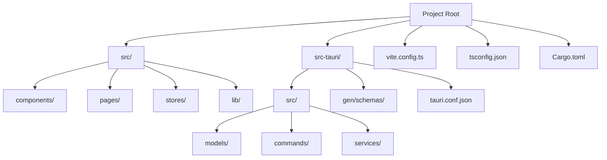
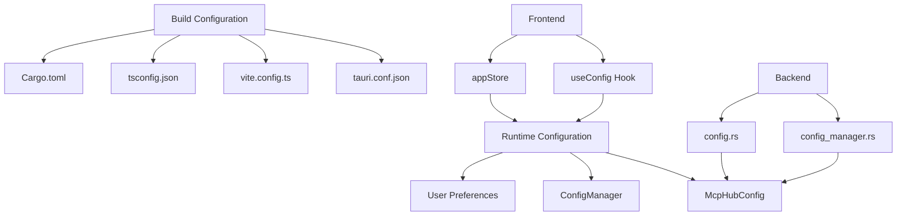
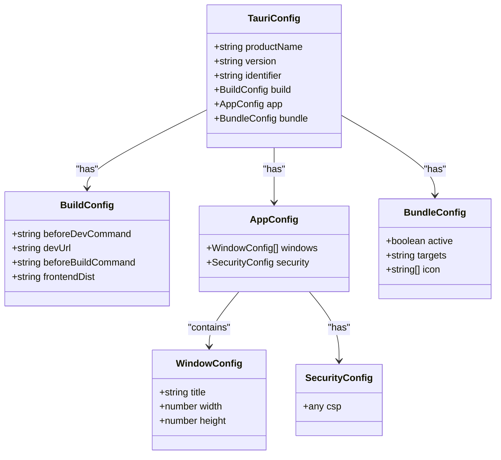
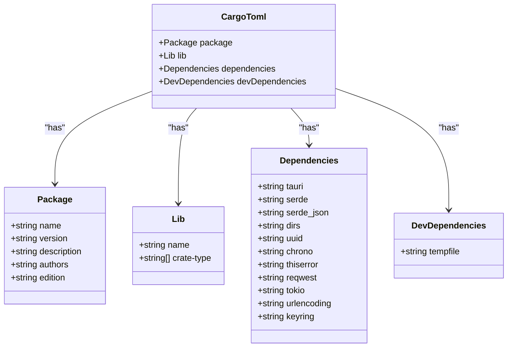
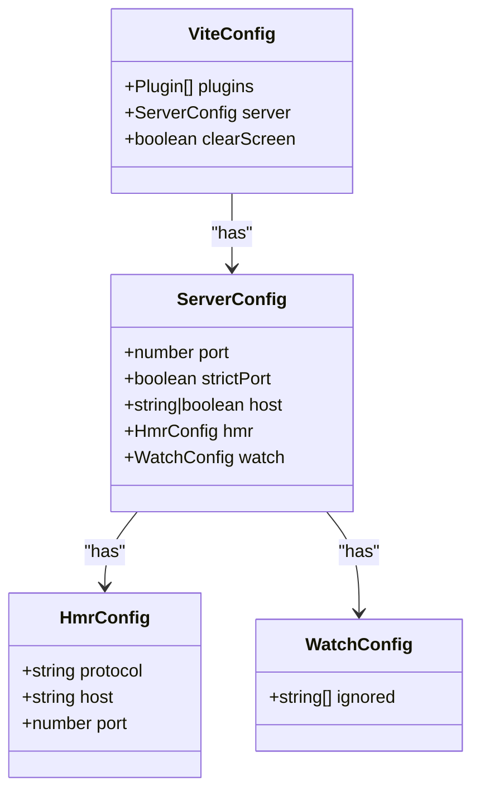
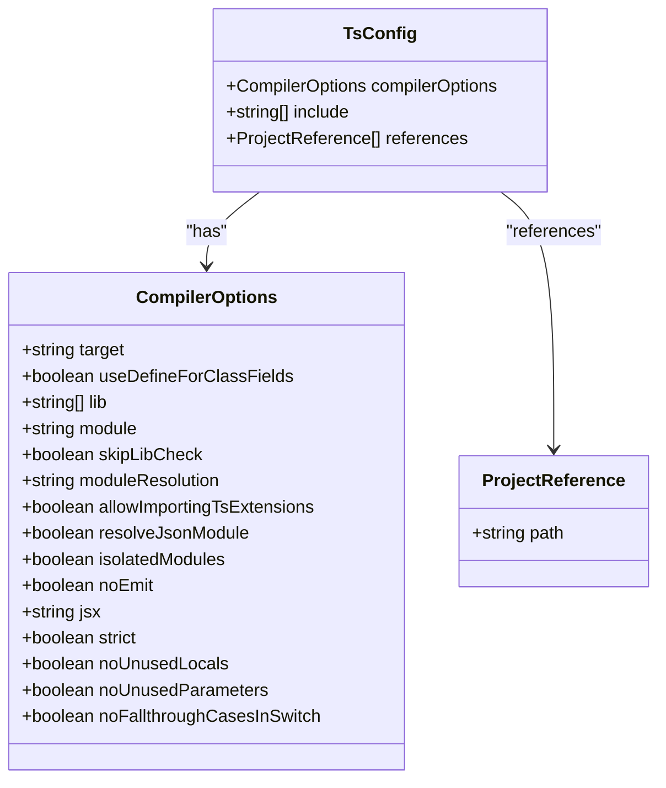
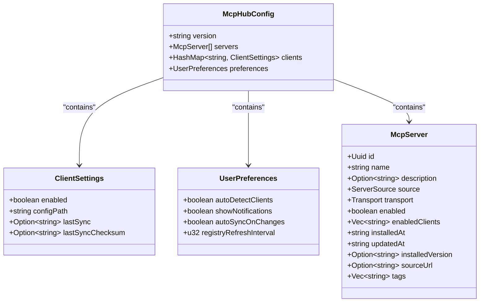
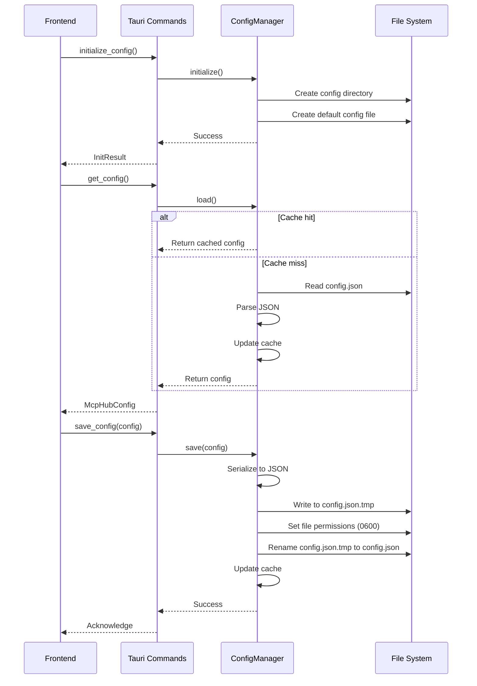
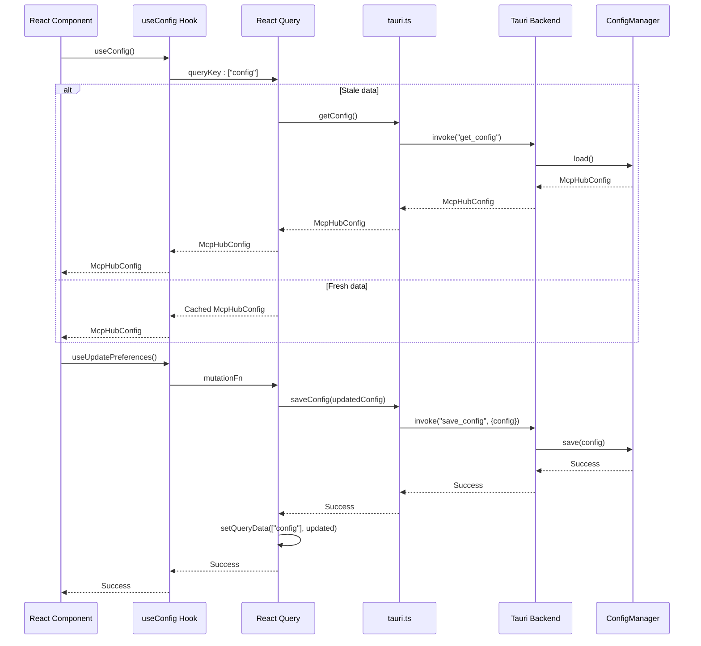
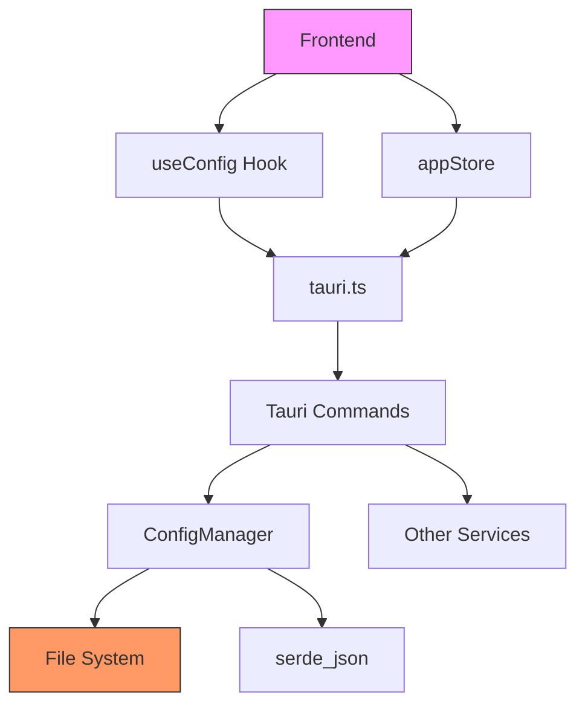

# Configuration

<cite>
**Referenced Files in This Document**   
- [tauri.conf.json](file://src-tauri/tauri.conf.json)
- [Cargo.toml](file://src-tauri/Cargo.toml)
- [vite.config.ts](file://vite.config.ts)
- [tsconfig.json](file://tsconfig.json)
- [config.rs](file://src-tauri/src/models/config.rs)
- [config_manager.rs](file://src-tauri/src/services/config_manager.rs)
- [tauri.ts](file://src/lib/tauri.ts)
- [useConfig.ts](file://src/hooks/useConfig.ts)
- [appStore.ts](file://src/stores/appStore.ts)
</cite>

## Table of Contents

1. [Introduction](#introduction)
2. [Project Structure](#project-structure)
3. [Core Components](#core-components)
4. [Architecture Overview](#architecture-overview)
5. [Detailed Component Analysis](#detailed-component-analysis)
6. [Dependency Analysis](#dependency-analysis)
7. [Performance Considerations](#performance-considerations)
8. [Troubleshooting Guide](#troubleshooting-guide)
9. [Conclusion](#conclusion)

## Introduction

MCP Nexus is a desktop application built with Tauri that manages MCP (Model Context Protocol) servers for AI clients. The application's configuration system consists of multiple layers: build-time configuration for the desktop application, frontend build settings, TypeScript compilation options, and runtime configuration that persists across sessions. This document explains how these configuration layers work together to provide a flexible and secure environment for managing AI server configurations.

## Project Structure

The MCP Nexus project follows a standard Tauri application structure with separate directories for frontend code (`src/`) and backend Rust code (`src-tauri/`). The configuration system spans both layers, with build configuration files at the root level and runtime configuration managed through the Tauri backend.

**Diagram sources**

- [src](file://src)
- [src-tauri](file://src-tauri)

**Section sources**

- [src](file://src)
- [src-tauri](file://src-tauri)

## Core Components

The configuration system in MCP Nexus consists of several key components that work together to manage application settings, user preferences, and runtime state. The core components include the McpHubConfig model that defines the central configuration structure, the ConfigManager service that handles persistence, and the frontend hooks that provide reactive access to configuration data.

**Section sources**

- [config.rs](file://src-tauri/src/models/config.rs)
- [config_manager.rs](file://src-tauri/src/services/config_manager.rs)
- [useConfig.ts](file://src/hooks/useConfig.ts)

## Architecture Overview

The configuration architecture in MCP Nexus follows a layered approach with clear separation between build-time configuration and runtime configuration. Build-time configuration files control how the application is compiled and packaged, while runtime configuration is managed through a central JSON file that persists user settings and server configurations.

**Diagram sources**

- [tauri.conf.json](file://src-tauri/tauri.conf.json)
- [vite.config.ts](file://vite.config.ts)
- [tsconfig.json](file://tsconfig.json)
- [Cargo.toml](file://src-tauri/Cargo.toml)
- [config.rs](file://src-tauri/src/models/config.rs)
- [config_manager.rs](file://src-tauri/src/services/config_manager.rs)
- [useConfig.ts](file://src/hooks/useConfig.ts)
- [appStore.ts](file://src/stores/appStore.ts)

## Detailed Component Analysis

### Build Configuration Files

MCP Nexus uses several configuration files to control the build process and development environment. These files are essential for setting up the application correctly and ensuring consistent behavior across different environments.

#### Tauri Desktop Configuration

The `tauri.conf.json` file contains configuration specific to the Tauri desktop application. It defines the application metadata, window properties, and build settings.

**Diagram sources**

- [tauri.conf.json](file://src-tauri/tauri.conf.json)

**Section sources**

- [tauri.conf.json](file://src-tauri/tauri.conf.json)

#### Rust Dependencies Configuration

The `Cargo.toml` file in the `src-tauri` directory manages Rust dependencies and project metadata. It specifies the required crates for the backend functionality, including Tauri itself, serialization libraries, and platform-specific utilities.

**Diagram sources**

- [Cargo.toml](file://src-tauri/Cargo.toml)

**Section sources**

- [Cargo.toml](file://src-tauri/Cargo.toml)

#### Frontend Build Configuration

The `vite.config.ts` file configures the Vite build tool for the frontend application. It sets up plugins, development server options, and integration with Tauri.

**Diagram sources**

- [vite.config.ts](file://vite.config.ts)

**Section sources**

- [vite.config.ts](file://vite.config.ts)

#### TypeScript Compilation Configuration

The `tsconfig.json` file configures the TypeScript compiler for the frontend application. It specifies compilation options, module resolution, and type checking rules.

**Diagram sources**

- [tsconfig.json](file://tsconfig.json)

**Section sources**

- [tsconfig.json](file://tsconfig.json)

### Runtime Configuration Management

The runtime configuration system in MCP Nexus is designed to persist user settings and server configurations across application sessions. It uses a central JSON file stored in the user's home directory and provides a robust API for accessing and modifying configuration data.

#### Configuration Model

The `McpHubConfig` struct defines the structure of the central configuration file. It contains version information, a list of configured servers, per-client settings, and user preferences.

**Diagram sources**

- [config.rs](file://src-tauri/src/models/config.rs)

**Section sources**

- [config.rs](file://src-tauri/src/models/config.rs)

#### Configuration Persistence

The `ConfigManager` service handles loading and saving the configuration file to disk. It implements atomic write operations to prevent data corruption and includes a cache to minimize file I/O.

**Diagram sources**

- [config_manager.rs](file://src-tauri/src/services/config_manager.rs)
- [config.rs](file://src-tauri/src/models/config.rs)

**Section sources**

- [config_manager.rs](file://src-tauri/src/services/config_manager.rs)

#### Frontend Configuration Access

The frontend uses React hooks and a Zustand store to provide reactive access to configuration data. The `useConfig` hook fetches configuration from the backend and caches it using React Query.

**Diagram sources**

- [useConfig.ts](file://src/hooks/useConfig.ts)
- [tauri.ts](file://src/lib/tauri.ts)
- [appStore.ts](file://src/stores/appStore.ts)

**Section sources**

- [useConfig.ts](file://src/hooks/useConfig.ts)
- [tauri.ts](file://src/lib/tauri.ts)
- [appStore.ts](file://src/stores/appStore.ts)

## Dependency Analysis

The configuration system in MCP Nexus has well-defined dependencies between components. The frontend depends on the backend for persistent configuration storage, while the backend provides a stable API for configuration operations.

**Diagram sources**

- [useConfig.ts](file://src/hooks/useConfig.ts)
- [tauri.ts](file://src/lib/tauri.ts)
- [config_manager.rs](file://src-tauri/src/services/config_manager.rs)

**Section sources**

- [useConfig.ts](file://src/hooks/useConfig.ts)
- [tauri.ts](file://src/lib/tauri.ts)
- [config_manager.rs](file://src-tauri/src/services/config_manager.rs)

## Performance Considerations

The configuration system in MCP Nexus is designed with performance in mind. The ConfigManager implements caching to minimize file I/O operations, and the frontend uses React Query to cache configuration data and avoid unnecessary backend calls. The atomic write pattern ensures data integrity without sacrificing performance, as the rename operation is typically atomic on most filesystems.

The use of JSON for the configuration format provides a good balance between human readability and parsing performance. For larger configurations, the system could be extended to use more efficient serialization formats like MessagePack, but the current implementation is sufficient for the expected configuration size.

## Troubleshooting Guide

When encountering configuration-related issues in MCP Nexus, consider the following troubleshooting steps:

1. **Check configuration file location**: The configuration file is stored in `~/.mcp-nexus/config.json`. Verify that this directory and file exist and have the correct permissions (directory: 0700, file: 0600).

2. **Verify file permissions**: On Unix-like systems, ensure the configuration directory and file have restrictive permissions to prevent unauthorized access.

3. **Check for JSON syntax errors**: If the application fails to start or load configuration, the JSON file may contain syntax errors. Use a JSON validator to check the file integrity.

4. **Clear the cache**: If the application appears to be using stale configuration data, try restarting the application to clear the in-memory cache.

5. **Check disk space**: Ensure there is sufficient disk space available, as the atomic write operation requires space for both the temporary and final files.

6. **Review application logs**: Check the Tauri logs for any error messages related to configuration loading or saving.

7. **Verify home directory access**: The application needs access to the user's home directory to create the configuration directory. Ensure the application has the necessary permissions.

**Section sources**

- [config_manager.rs](file://src-tauri/src/services/config_manager.rs)
- [tauri.conf.json](file://src-tauri/tauri.conf.json)

## Conclusion

The configuration system in MCP Nexus provides a robust foundation for managing application settings and user preferences. By separating build-time configuration from runtime configuration, the system offers flexibility for both developers and users. The use of established tools like Tauri, Vite, and Cargo ensures compatibility with modern development workflows, while the custom runtime configuration system provides the specific functionality needed for managing MCP servers. The implementation prioritizes data integrity through atomic writes and secure storage practices, making it suitable for handling sensitive configuration data.
