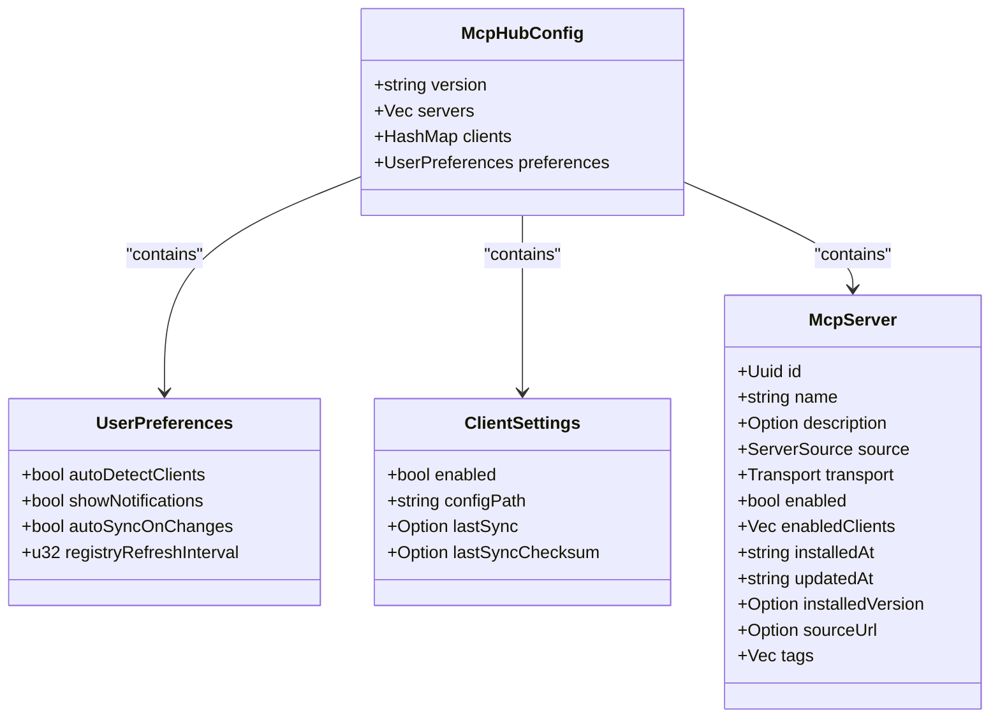
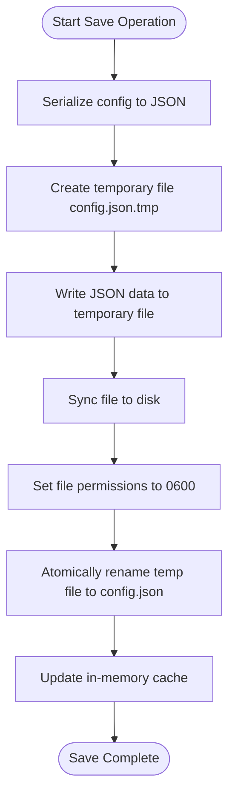
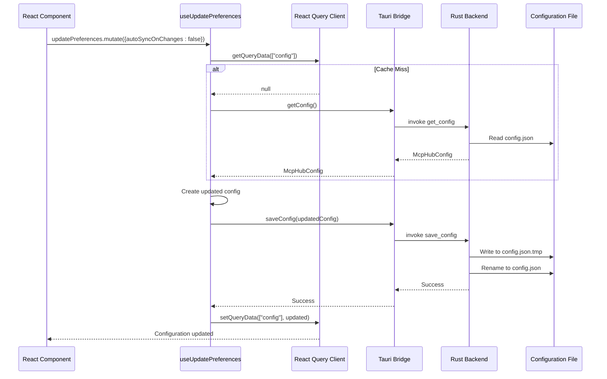
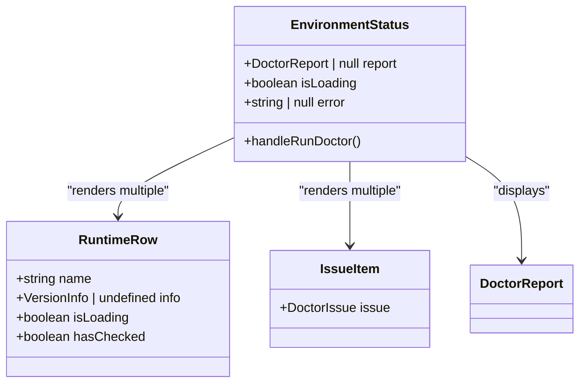

# Runtime Configuration

<cite>
**Referenced Files in This Document**   
- [config.rs](file://src-tauri/src/models/config.rs)
- [useConfig.ts](file://src/hooks/useConfig.ts)
- [config_manager.rs](file://src-tauri/src/services/config_manager.rs)
- [config.rs](file://src-tauri/src/commands/config.rs)
- [tauri.ts](file://src/lib/tauri.ts)
- [index.ts](file://src/types/index.ts)
- [EnvironmentStatus.tsx](file://src/components/settings/EnvironmentStatus.tsx)
- [Settings.tsx](file://src/pages/Settings.tsx)
</cite>

## Table of Contents

1. [Introduction](#introduction)
2. [McpHubConfig Data Model](#mcphubconfig-data-model)
3. [Configuration Persistence Mechanism](#configuration-persistence-mechanism)
4. [Runtime Configuration Access with useConfig](#runtime-configuration-access-with-useconfig)
5. [Configuration Lifecycle Management](#configuration-lifecycle-management)
6. [Accessing and Updating Configuration Values](#accessing-and-updating-configuration-values)
7. [Integration with EnvironmentStatus](#integration-with-environmentstatus)
8. [Configuration Validation and Error Recovery](#configuration-validation-and-error-recovery)
9. [Schema Migration and Backward Compatibility](#schema-migration-and-backward-compatibility)
10. [Extending the Configuration Schema](#extending-the-configuration-schema)

## Introduction

The MCP Nexus application implements a comprehensive runtime configuration management system that enables users to customize application behavior, manage MCP servers, and control integration with AI clients. This document provides a detailed analysis of the configuration architecture, focusing on the McpHubConfig data model, its persistence mechanism, and the React integration layer that enables real-time configuration updates in the user interface. The system follows a client-server architecture where the Rust backend handles configuration storage and validation, while the TypeScript frontend provides a reactive interface for configuration management.

**Section sources**

- [config.rs](file://src-tauri/src/models/config.rs#L60-L85)
- [useConfig.ts](file://src/hooks/useConfig.ts#L7-L13)

## McpHubConfig Data Model

The McpHubConfig structure serves as the central configuration model for MCP Nexus, defining the application's state and preferences. Implemented in Rust with Serde serialization, this data model represents the complete configuration state that persists across application sessions.

### Core Structure and Fields

The McpHubConfig struct contains four primary components that organize configuration data hierarchically:

- **version**: A string field that tracks the configuration schema version, enabling backward compatibility during upgrades
- **servers**: A vector of McpServer objects representing configured MCP servers with their connection details and metadata
- **clients**: A HashMap mapping client IDs to ClientSettings, storing per-client configuration such as sync status and file paths
- **preferences**: A UserPreferences object containing user-specific application settings



**Diagram sources**

- [config.rs](file://src-tauri/src/models/config.rs#L60-L85)
- [index.ts](file://src/types/index.ts#L69-L75)

### Serialization Format

The configuration system uses JSON as its serialization format, leveraging Serde's powerful serialization framework to convert between Rust structures and JSON representations. The #[serde(rename_all = "camelCase")] attribute ensures compatibility with JavaScript conventions by converting Rust's snake_case field names to camelCase in the serialized JSON. This approach maintains idiomatic naming in both languages while ensuring seamless data exchange.

Optional fields are serialized conditionally using #[serde(skip_serializing_if = "Option::is_none")], which omits null values from the output JSON, resulting in a cleaner and more compact configuration file. The configuration is formatted with pretty-printing (serde_json::to_string_pretty) for human readability, with proper indentation and line breaks.

**Section sources**

- [config.rs](file://src-tauri/src/models/config.rs#L62-L63)
- [config_manager.rs](file://src-tauri/src/services/config_manager.rs#L131-L132)

### Default Values and Initialization

The configuration system implements comprehensive default value handling through Rust's Default trait implementation. When a new configuration is created, the default() method initializes all fields with sensible defaults:

- **version**: Set to "1.0" for new configurations
- **servers**: Initialized as an empty vector
- **clients**: Created as an empty HashMap
- **preferences**: Populated with UserPreferences defaults

The UserPreferences struct itself defines application-specific defaults:

- autoDetectClients: true (automatically detect installed AI clients)
- showNotifications: true (display system notifications)
- autoSyncOnChanges: true (automatically sync configuration changes)
- registryRefreshInterval: 60 minutes (refresh interval for marketplace registry)

These defaults ensure the application functions correctly out-of-the-box while allowing users to customize behavior according to their preferences.

**Section sources**

- [config.rs](file://src-tauri/src/models/config.rs#L77-L85)
- [config.rs](file://src-tauri/src/models/config.rs#L49-L58)

## Configuration Persistence Mechanism

The configuration persistence system in MCP Nexus follows a robust, atomic write pattern to ensure data integrity and prevent corruption during write operations.

### Storage Location and Directory Management

Configuration files are stored in a dedicated directory within the user's home directory at ~/.mcp-nexus/. The ConfigManager::new() function constructs this path using the dirs crate to locate the user's home directory reliably across different operating systems. During initialization, the system creates this directory with appropriate permissions (0700 on Unix-like systems) to ensure only the owner can access the configuration files.

The primary configuration file is named config.json and resides in this directory. This standardized location makes it easy for users to locate and, if necessary, manually edit or backup their configuration.

### Atomic Write Pattern

To prevent data corruption during write operations, the system implements an atomic write pattern:

1. Serialize the configuration to JSON format
2. Write the serialized data to a temporary file (config.json.tmp)
3. Set appropriate file permissions (0600 on Unix-like systems)
4. Atomically rename the temporary file to replace the original configuration file

This approach ensures that the configuration file is never in a partially written state. If the application crashes during a write operation, the original file remains intact, and the temporary file can be safely ignored. The atomic rename operation (fs::rename) is guaranteed to be atomic on most filesystems, providing a reliable mechanism for updating the configuration without risk of corruption.



**Diagram sources**

- [config_manager.rs](file://src-tauri/src/services/config_manager.rs#L129-L150)

### In-Memory Caching

The ConfigManager implements an in-memory cache using a RwLock<Option<McpHubConfig>> to improve performance and reduce disk I/O. When a configuration is loaded, it is stored in the cache, allowing subsequent read operations to return the cached copy without accessing the disk.

The cache is updated whenever a configuration is saved, ensuring consistency between the in-memory representation and the persisted file. The cache can be invalidated when necessary (e.g., when another process might have modified the file), forcing a reload from disk on the next access. This caching strategy provides a significant performance improvement for applications that frequently read configuration data while maintaining data consistency.

**Section sources**

- [config_manager.rs](file://src-tauri/src/services/config_manager.rs#L26-L27)
- [config_manager.rs](file://src-tauri/src/services/config_manager.rs#L90-L113)

## Runtime Configuration Access with useConfig

The useConfig.ts hook provides React components with reactive access to the runtime configuration state, leveraging React Query for data fetching, caching, and state management.

### useConfig Hook Implementation

The useConfig hook is a React Query useQuery hook that fetches the full MCP hub configuration from the backend:

```typescript
export function useConfig() {
  return useQuery<McpHubConfig, Error>({
    queryKey: ["config"],
    queryFn: getConfig,
    staleTime: 60_000,
  });
}
```

This implementation uses several key React Query features:

- **queryKey**: A unique identifier ["config"] that React Query uses to cache and deduplicate requests
- **queryFn**: The getConfig function from the Tauri API that communicates with the Rust backend
- **staleTime**: Set to 60,000 milliseconds (1 minute), indicating how long the data should be considered fresh before requiring a refresh

The hook returns a query object containing the configuration data, loading state, error information, and other metadata that components can use to render appropriately based on the current state.

### useUpdatePreferences Hook Implementation

The useUpdatePreferences hook enables components to update user preferences within the central configuration:

```typescript
export function useUpdatePreferences() {
  const queryClient = useQueryClient();

  return useMutation<McpHubConfig, Error, Partial<UserPreferences>>({
    mutationFn: async (updates) => {
      const current =
        queryClient.getQueryData<McpHubConfig>(["config"]) ??
        (await getConfig());

      const updated: McpHubConfig = {
        ...current,
        preferences: {
          ...current.preferences,
          ...updates,
        },
      };

      await saveConfig(updated);
      return updated;
    },
    onSuccess: (updated) => {
      queryClient.setQueryData(["config"], updated);
    },
  });
}
```

This mutation hook follows a critical pattern for maintaining consistency between the local cache and the persisted configuration:

1. Retrieve the current configuration from the React Query cache or fetch it from the backend
2. Create an updated configuration by merging the existing preferences with the provided updates
3. Persist the updated configuration to disk via the saveConfig Tauri command
4. On success, update the React Query cache with the new configuration to ensure all components receive the updated state

The onSuccess callback is particularly important as it immediately updates the local cache, providing a seamless user experience without requiring a refetch from disk.

**Section sources**

- [useConfig.ts](file://src/hooks/useConfig.ts#L7-L40)

## Configuration Lifecycle Management

The configuration system manages the complete lifecycle of configuration data from application startup through runtime modification to persistence.

### Startup Initialization Process

During application startup, the configuration system follows a well-defined initialization sequence:

1. **Directory Creation**: The ConfigManager checks for the existence of the ~/.mcp-nexus/ directory and creates it with appropriate permissions if it doesn't exist
2. **File Creation**: If the config.json file is missing, the system creates it with a default configuration using McpHubConfig::default()
3. **First Run Detection**: The initialize_config command returns an InitResult that indicates whether this is the first run (no existing configuration), allowing the UI to present appropriate onboarding experiences

This initialization process ensures that the application always has a valid configuration file available, even on first launch. The atomic nature of directory and file creation prevents race conditions that could occur if multiple processes attempted to initialize simultaneously.

### In-Memory Modification Pattern

Configuration modifications follow a specific pattern to maintain data consistency:

1. Read the current configuration (from cache or disk)
2. Apply modifications to create a new configuration object
3. Validate the modified configuration
4. Persist the updated configuration to disk
5. Update in-memory caches and notify subscribers

This pattern ensures that configuration changes are atomic and consistent. By creating a new configuration object rather than modifying the existing one in place, the system avoids potential issues with shared mutable state.

### Configuration Saving Workflow

The saving workflow integrates multiple layers of the application architecture:



**Diagram sources**

- [useConfig.ts](file://src/hooks/useConfig.ts#L19-L35)
- [config.rs](file://src-tauri/src/commands/config.rs#L67-L73)
- [config_manager.rs](file://src-tauri/src/services/config_manager.rs#L117-L127)

## Accessing and Updating Configuration Values

Components access and update configuration values through well-defined patterns that ensure data consistency and provide a responsive user experience.

### Reading Configuration Values

Components read configuration values using the useConfig hook, which provides access to the current configuration state:

```typescript
const { data: config, isLoading, error } = useConfig();

if (isLoading) {
  return <div>Loading configuration...</div>;
}

if (error) {
  return <div>Error loading configuration: {error.message}</div>;
}

// Access configuration values
const autoSyncEnabled = config?.preferences.autoSyncOnChanges ?? true;
const serverCount = config?.servers.length ?? 0;
```

The hook returns additional metadata (isLoading, error) that components can use to handle different states appropriately. The optional chaining (?.) and nullish coalescing (??) operators ensure that components handle cases where the configuration is not yet loaded or is undefined.

### Updating Configuration Values

Components update configuration values using the useUpdatePreferences mutation hook:

```typescript
const updatePreferences = useUpdatePreferences();

// Update a single preference
updatePreferences.mutate({
  autoSyncOnChanges: false,
});

// Update multiple preferences
updatePreferences.mutate({
  autoDetectClients: false,
  registryRefreshInterval: 30,
});
```

The mutation accepts a Partial<UserPreferences> object, allowing components to update only the fields they need to change without specifying the entire preferences object. This partial update pattern reduces the risk of accidentally overwriting other preferences.

### Handling Default Values

The configuration system handles default values at multiple levels:

1. **Rust Level**: The Default trait implementation provides defaults when deserializing configuration files that lack certain fields
2. **TypeScript Level**: Components use nullish coalescing (??) to provide fallback values when configuration data is undefined
3. **Serde Level**: The #[serde(default)] and #[serde(default = "function")] attributes automatically populate missing fields with defaults during deserialization

This multi-layered approach ensures that the application behaves predictably even when configuration files are incomplete or corrupted.

### Reacting to Configuration Changes

Components automatically react to configuration changes through React Query's reactivity system. When the configuration is updated (via useUpdatePreferences or other means), React Query invalidates the ["config"] query key, causing all components using useConfig to re-render with the updated data.

Components can also implement specific reactions to configuration changes using React's useEffect hook:

```typescript
const { data: config } = useConfig();

useEffect(() => {
  if (config?.preferences.showNotifications) {
    // Enable notification system
    enableNotifications();
  } else {
    // Disable notification system
    disableNotifications();
  }
}, [config?.preferences.showNotifications]);
```

This pattern allows components to perform side effects in response to specific configuration changes without re-executing for unrelated changes.

**Section sources**

- [useConfig.ts](file://src/hooks/useConfig.ts#L19-L35)
- [Settings.tsx](file://src/pages/Settings.tsx#L24-L25)
- [Settings.tsx](file://src/pages/Settings.tsx#L196-L198)

## Integration with EnvironmentStatus

The EnvironmentStatus component demonstrates how configuration state integrates with UI components to provide runtime environment information.

### Component Structure and Functionality

The EnvironmentStatus component displays the status of required runtime dependencies (Node.js, Python, uv, Docker, git) and any detected issues:



**Diagram sources**

- [EnvironmentStatus.tsx](file://src/components/settings/EnvironmentStatus.tsx#L186-L315)

### Configuration-Driven Behavior

The component's behavior is influenced by configuration preferences, particularly the autoSyncOnChanges setting. When users modify preferences in the Settings interface, the EnvironmentStatus component automatically updates to reflect the current configuration state.

The component uses the runDoctor function from the Tauri API to check the environment, demonstrating how configuration management integrates with other system services. The results are displayed in a user-friendly format that shows version information when dependencies are found or appropriate messages when they are missing.

### State Management Pattern

The component follows a clear state management pattern:

1. **Initial State**: No report, not loading, no error
2. **Loading State**: isLoading = true when checking environment
3. **Success State**: report contains DoctorReport data, isLoading = false
4. **Error State**: error contains error message, isLoading = false

This state machine approach ensures that the UI accurately represents the current status of environment checking operations.

**Section sources**

- [EnvironmentStatus.tsx](file://src/components/settings/EnvironmentStatus.tsx#L187-L202)
- [tauri.ts](file://src/lib/tauri.ts#L146-L148)

## Configuration Validation and Error Recovery

The configuration system implements comprehensive validation and error recovery mechanisms to ensure data integrity and graceful handling of corrupted files.

### Validation Strategies

The system employs multiple validation strategies at different levels:

- **Serde Deserialization Validation**: The #[serde] attributes automatically validate field types and apply default values for missing fields
- **Rust Type System**: Strong typing ensures that configuration data conforms to expected structures
- **Explicit Validation Functions**: The ConfigError enum defines specific error types for different failure modes

The UserPreferences deserialization test demonstrates how Serde handles missing fields by populating defaults:

```rust
#[test]
fn test_user_preferences_deserialization_defaults() {
    // When fields are missing, serde should populate defaults
    let json = "{}";
    let prefs: UserPreferences = serde_json::from_str(json).unwrap();

    assert!(prefs.auto_detect_clients);
    assert!(prefs.show_notifications);
    assert!(prefs.auto_sync_on_changes);
    assert_eq!(prefs.registryRefreshInterval, 60);
}
```

### Error Recovery for Corrupted Files

The system handles corrupted configuration files through several mechanisms:

1. **Graceful Deserialization Failure**: When serde_json::from_str fails to parse the configuration file, the ConfigError::ParseError variant is returned
2. **Default Configuration Fallback**: If the configuration file cannot be read, the application uses the default configuration, allowing it to start and potentially repair the corrupted file
3. **Atomic Write Protection**: The atomic write pattern prevents partial writes that could corrupt the configuration file during system crashes

The ConfigManager::load method implements error recovery by returning a descriptive error that can be handled by the UI layer:

```rust
pub fn load(&self) -> Result<McpHubConfig, ConfigError> {
    // Check cache first
    {
        let cache = self.cache.read().unwrap();
        if let Some(ref config) = *cache {
            return Ok(config.clone());
        }
    }

    // Read from file
    let mut file = File::open(&self.config_path)?;
    let mut contents = String::new();
    file.read_to_string(&mut contents)?;

    let config: McpHubConfig = serde_json::from_str(&contents)?;

    // Update cache
    {
        let mut cache = self.cache.write().unwrap();
        *cache = Some(config.clone());
    }

    Ok(config)
}
```

If any step in this process fails, the method returns an appropriate ConfigError variant, allowing the calling code to handle the error appropriately.

**Section sources**

- [config.rs](file://src-tauri/src/models/config.rs#L238-L247)
- [config_manager.rs](file://src-tauri/src/services/config_manager.rs#L100-L113)
- [config_manager.rs](file://src-tauri/src/services/config_manager.rs#L11-L20)

## Schema Migration and Backward Compatibility

The configuration system is designed with backward compatibility in mind, allowing for future schema evolution while maintaining compatibility with existing configuration files.

### Versioning Strategy

The version field in McpHubConfig serves as the foundation for schema migration. When the configuration schema changes in a backward-incompatible way, the version number is incremented, allowing the application to detect when migration is necessary.

The current implementation sets the default version to "1.0", establishing a baseline for future migrations. Future versions of the application can check this version field and apply appropriate migration logic when loading older configuration files.

### Backward Compatibility Mechanisms

The system employs several mechanisms to ensure backward compatibility:

- **Optional Fields**: New fields can be added as optional (Option<T>) to avoid breaking deserialization of older configuration files
- **Default Values**: The #[serde(default)] attribute ensures that missing fields are populated with sensible defaults
- **CamelCase Naming**: The #[serde(rename_all = "camelCase")] attribute maintains compatibility with JavaScript conventions regardless of Rust field naming
- **Comprehensive Testing**: The test suite includes tests that verify default values are applied when fields are missing

These mechanisms allow the configuration schema to evolve over time without breaking existing installations. New versions of the application can read and work with configuration files created by older versions, providing a seamless upgrade experience.

**Section sources**

- [config.rs](file://src-tauri/src/models/config.rs#L65)
- [config.rs](file://src-tauri/src/models/config.rs#L77-L85)

## Extending the Configuration Schema

Extending the configuration schema for new features requires careful consideration of backward compatibility and data integrity.

### Adding New Fields

To add new fields to the configuration schema:

1. **Add to Rust Structures**: Add the new field to the appropriate struct (McpHubConfig, UserPreferences, etc.) with appropriate Serde attributes
2. **Provide Default Values**: Implement default values through the Default trait or #[serde(default)] attributes
3. **Update TypeScript Types**: Add the new field to the corresponding TypeScript interface in types/index.ts
4. **Update Commands**: Ensure Tauri commands can handle the new field
5. **Add Tests**: Create tests that verify the new field is properly serialized, deserialized, and defaults are applied

For example, to add a new theme preference:

```rust
#[derive(Debug, Clone, Serialize, Deserialize)]
#[serde(rename_all = "camelCase")]
pub struct UserPreferences {
    // existing fields...
    #[serde(default = "default_theme")]
    pub theme: String,
}

fn default_theme() -> String {
    "light".to_string()
}
```

And in TypeScript:

```typescript
export interface UserPreferences {
  // existing fields...
  theme: string;
}
```

### Maintaining Backward Compatibility

When extending the schema, follow these principles to maintain backward compatibility:

- **Never remove fields**: Instead, mark them as deprecated and continue to support them
- **Use optional types for new fields**: This allows older applications to ignore new fields without failing
- **Increment version only for breaking changes**: Reserve version increments for changes that require migration logic
- **Provide migration paths**: For breaking changes, implement migration logic that converts old configuration formats to the new format

The existing codebase demonstrates these principles through its use of Option<T> for non-essential fields and default values for essential fields, ensuring that configuration files remain readable across different versions of the application.

**Section sources**

- [config.rs](file://src-tauri/src/models/config.rs#L28-L58)
- [index.ts](file://src/types/index.ts#L61-L67)
