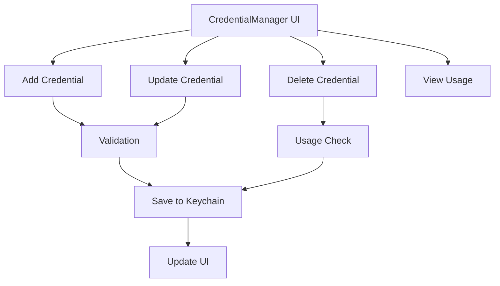
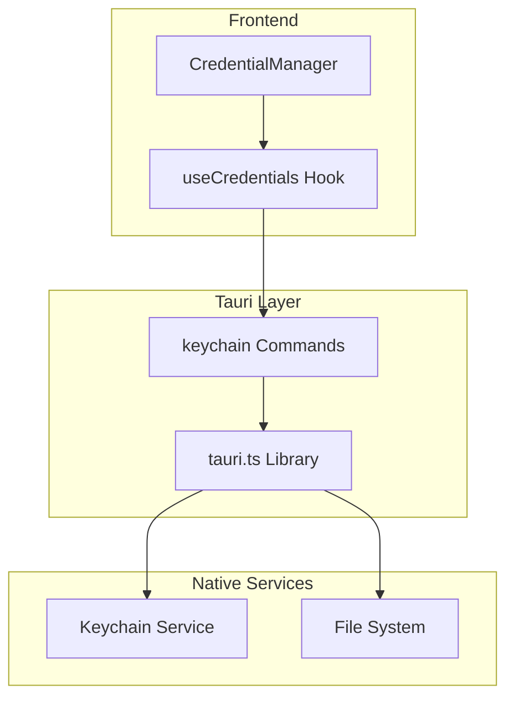
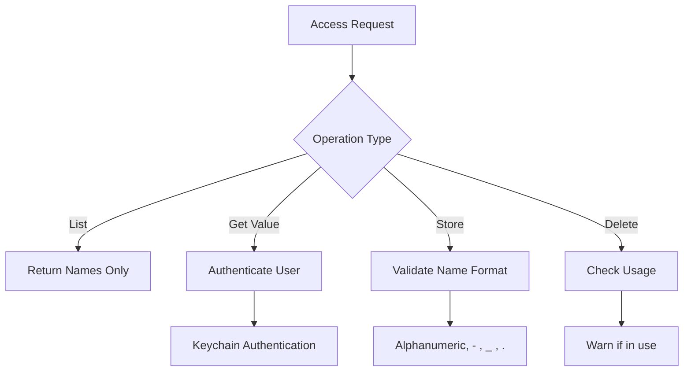
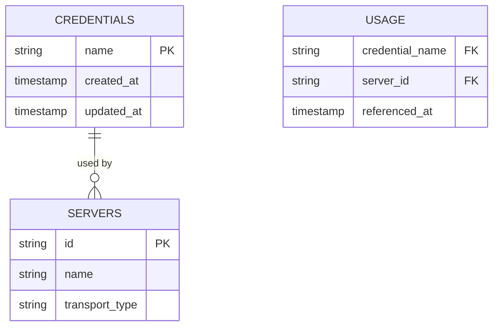
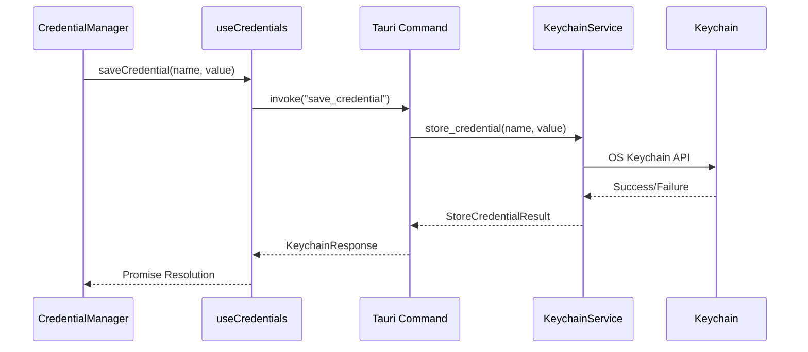
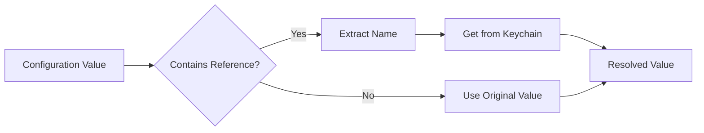

# Credential Management

<cite>
**Referenced Files in This Document**   
- [CredentialManager.tsx](file://src/components/settings/CredentialManager.tsx)
- [useCredentials.ts](file://src/hooks/useCredentials.ts)
- [keychain.rs](file://src-tauri/src/services/keychain.rs)
- [keychain.rs](file://src-tauri/src/commands/keychain.rs)
- [tauri.ts](file://src/lib/tauri.ts)
- [index.ts](file://src/types/index.ts)
- [config.rs](file://src-tauri/src/models/config.rs)
- [CredentialInput.tsx](file://src/components/common/CredentialInput.tsx)
</cite>

## Table of Contents

1. [Introduction](#introduction)
2. [Credential Management UI](#credential-management-ui)
3. [Keychain Service Architecture](#keychain-service-architecture)
4. [Encryption and Storage Mechanisms](#encryption-and-storage-mechanisms)
5. [Access Control and Security Policies](#access-control-and-security-policies)
6. [Audit Logging and Usage Tracking](#audit-logging-and-usage-tracking)
7. [Tauri Integration and Native Commands](#tauri-integration-and-native-commands)
8. [Credential Reference Syntax](#credential-reference-syntax)
9. [Security Best Practices](#security-best-practices)
10. [Backup and Recovery](#backup-and-recovery)
11. [Troubleshooting Guide](#troubleshooting-guide)

## Introduction

The secure credential management system provides a robust solution for protecting sensitive authentication data using macOS Keychain services. This documentation details how the CredentialManager UI enables users to create, reference, and manage credentials that are securely stored and retrieved via the KeychainService. The system integrates frontend components with Tauri keychain commands to interface with native macOS security frameworks, ensuring enterprise-grade protection for API keys, tokens, and other sensitive information.

**Section sources**

- [CredentialManager.tsx](file://src/components/settings/CredentialManager.tsx#L1-L347)
- [keychain.rs](file://src-tauri/src/services/keychain.rs#L1-L438)

## Credential Management UI

The CredentialManager UI provides a comprehensive interface for managing secure credentials within the application. Users can create, update, and delete credentials through an intuitive interface that displays credential usage across servers.

The UI component renders a table listing all stored credentials with their names and indicates which servers are using each credential through badge indicators. Users can add new credentials or update existing ones through a modal interface that validates input before submission. When deleting credentials, the system warns users if the credential is currently in use by any servers.



**Diagram sources**

- [CredentialManager.tsx](file://src/components/settings/CredentialManager.tsx#L41-L347)

**Section sources**

- [CredentialManager.tsx](file://src/components/settings/CredentialManager.tsx#L41-L347)
- [CredentialInput.tsx](file://src/components/common/CredentialInput.tsx#L1-L192)

## Keychain Service Architecture

The Keychain service architecture implements a secure credential storage system using the operating system's native keychain services. The system follows a layered architecture with clear separation between frontend components, Tauri commands, and native keychain services.



**Diagram sources**

- [keychain.rs](file://src-tauri/src/services/keychain.rs#L1-L438)
- [keychain.rs](file://src-tauri/src/commands/keychain.rs#L1-L144)

**Section sources**

- [keychain.rs](file://src-tauri/src/services/keychain.rs#L1-L438)
- [keychain.rs](file://src-tauri/src/commands/keychain.rs#L1-L144)
- [tauri.ts](file://src/lib/tauri.ts#L1-L364)

## Encryption and Storage Mechanisms

The credential management system employs multiple layers of encryption and secure storage mechanisms to protect sensitive data. Credentials are stored in the macOS Keychain using the system's native encryption, which provides hardware-backed security for sensitive information.

The system uses the `keyring` Rust crate to interface with the macOS Keychain service, storing credentials under the service name "com.mcp-manager.credentials". Each credential is stored with its name as the account identifier and the secret value protected by the Keychain's encryption.

Additionally, the system maintains a local JSON file (`credential_keys.json`) in the user's home directory under `.mcp-manager/` that tracks which credential names exist. This file is stored with restrictive permissions (0600 on Unix systems) and uses atomic write operations to prevent corruption.

```mermaid
flowchart LR
A[Credential] --> B{Name: "credential-name"}
A --> C{Value: "secret-value"}
B --> D[Keychain Service]
C --> D
D --> E[Hardware Encryption]
F[Credential Names] --> G[credential_keys.json]
G --> H[File Permissions 0600]
```

**Diagram sources**

- [keychain.rs](file://src-tauri/src/services/keychain.rs#L14-L18)
- [keychain.rs](file://src-tauri/src/services/keychain.rs#L59-L127)

**Section sources**

- [keychain.rs](file://src-tauri/src/services/keychain.rs#L14-L127)
- [keychain.rs](file://src-tauri/src/services/keychain.rs#L170-L192)

## Access Control and Security Policies

The system implements strict access control policies to ensure credential security. Credential names are validated to contain only alphanumeric characters, hyphens, underscores, and periods, with a maximum length of 256 characters. Empty names are rejected.

Access to credentials follows the principle of least privilege. The `list_credentials` command returns only credential names, never values, for security. The `get_credential_value` command is available but should only be called when the actual value is needed, never for display purposes.

The system validates all keychain references in server environment variables before use, ensuring that referenced credentials exist in the keychain. This validation occurs through the `validate_credential_references` command, which returns a list of any missing credential names.



**Diagram sources**

- [keychain.rs](file://src-tauri/src/services/keychain.rs#L129-L154)
- [keychain.rs](file://src-tauri/src/commands/keychain.rs#L80-L122)

**Section sources**

- [keychain.rs](file://src-tauri/src/services/keychain.rs#L129-L154)
- [keychain.rs](file://src-tauri/src/commands/keychain.rs#L80-L122)
- [keychain.rs](file://src-tauri/src/services/keychain.rs#L262-L287)

## Audit Logging and Usage Tracking

The credential management system includes comprehensive audit logging and usage tracking capabilities. The UI displays which servers are using each credential by analyzing server configurations for keychain references.

When a credential is deleted, the system checks if it is referenced by any servers and warns the user accordingly. The `getCredentialsUsedByServer` function in the frontend analyzes both environment variables and headers in server transport configurations to identify credential usage.

The system also maintains internal tracking of credential existence through the `credential_keys.json` file, which serves as an audit trail of credential creation and deletion operations.



**Diagram sources**

- [CredentialManager.tsx](file://src/components/settings/CredentialManager.tsx#L23-L39)
- [keychain.rs](file://src-tauri/src/services/keychain.rs#L237-L246)

**Section sources**

- [CredentialManager.tsx](file://src/components/settings/CredentialManager.tsx#L23-L39)
- [keychain.rs](file://src-tauri/src/services/keychain.rs#L237-L246)

## Tauri Integration and Native Commands

The system integrates frontend components with native macOS security frameworks through Tauri commands. The architecture follows a clean separation between frontend logic and native operations.

Tauri commands provide a secure bridge between the React frontend and Rust backend, with commands like `save_credential`, `get_credential_value`, `delete_credential`, and `list_credentials` exposing keychain functionality to the frontend. These commands return standardized `KeychainResponse` objects with success status, data, and error information.

The `tauri.ts` library provides a helper function `invokeKeychain` that unwraps the `KeychainResponse` and throws JavaScript errors for failed operations, simplifying error handling in the frontend.



**Diagram sources**

- [tauri.ts](file://src/lib/tauri.ts#L153-L187)
- [keychain.rs](file://src-tauri/src/commands/keychain.rs#L47-L57)

**Section sources**

- [tauri.ts](file://src/lib/tauri.ts#L153-L187)
- [keychain.rs](file://src-tauri/src/commands/keychain.rs#L47-L57)
- [useCredentials.ts](file://src/hooks/useCredentials.ts#L1-L63)

## Credential Reference Syntax

The system supports two syntax formats for referencing credentials in server configurations:

1. **Simple format**: `keychain:credential-name`
2. **Shell-compatible format**: `${keychain:credential-name}`

These references can be used in server environment variables and headers. When a server configuration contains such references, the system automatically resolves them to the actual credential values stored in the keychain during server execution.

The `resolve_keychain_reference` function in the KeychainService handles both formats, extracting the credential name and retrieving the value from the keychain. The `is_keychain_reference` function checks if a value contains a valid keychain reference.



**Diagram sources**

- [keychain.rs](file://src-tauri/src/services/keychain.rs#L262-L287)
- [CredentialInput.tsx](file://src/components/common/CredentialInput.tsx#L32-L36)

**Section sources**

- [keychain.rs](file://src-tauri/src/services/keychain.rs#L262-L287)
- [CredentialInput.tsx](file://src/components/common/CredentialInput.tsx#L32-L36)
- [CredentialManager.tsx](file://src/components/settings/CredentialManager.tsx#L167-L170)

## Security Best Practices

The credential management system implements several security best practices:

1. **Input Validation**: Credential names are strictly validated to prevent injection attacks and ensure compatibility.
2. **Secure Storage**: Credentials are stored in the OS keychain with hardware-backed encryption rather than in application files.
3. **Least Privilege**: The system only exposes credential names in listing operations, not values.
4. **Atomic Operations**: File operations use atomic writes to prevent corruption.
5. **File Permissions**: Local credential tracking files use restrictive permissions (0600).
6. **Error Handling**: Detailed error types provide specific feedback without exposing sensitive information.

Users should follow these additional best practices:

- Use descriptive but non-sensitive credential names
- Regularly audit credential usage
- Remove unused credentials promptly
- Use unique credentials for different services
- Monitor for unauthorized access attempts

**Section sources**

- [keychain.rs](file://src-tauri/src/services/keychain.rs#L129-L154)
- [keychain.rs](file://src-tauri/src/services/keychain.rs#L94-L127)

## Backup and Recovery

The credential management system handles backup and recovery through a combination of OS-level and application-level mechanisms.

Since credentials are stored in the macOS Keychain, they are automatically included in system backups when Keychain synchronization is enabled. The local `credential_keys.json` file serves as a secondary backup mechanism, tracking which credential names exist.

For recovery scenarios:

1. If the `credential_keys.json` file is lost but the Keychain entries exist, the system will rebuild the file when credentials are accessed.
2. If the Keychain entries are lost but the `credential_keys.json` file exists, users will need to recreate credentials manually.
3. Complete system restores that include Keychain data will preserve all credentials.

Users should ensure that iCloud Keychain or another backup mechanism is enabled to protect against credential loss.

**Section sources**

- [keychain.rs](file://src-tauri/src/services/keychain.rs#L59-L127)
- [keychain.rs](file://src-tauri/src/services/keychain.rs#L180-L185)

## Troubleshooting Guide

Common issues and their solutions:

**Keychain Permission Issues**

- **Symptom**: "The user name or passphrase you entered is not correct" errors
- **Solution**: Unlock the Keychain in Keychain Access app and ensure the application has permission to access it

**Missing Credentials**

- **Symptom**: Valid credential references return errors
- **Solution**: Verify the credential exists in the Keychain and the name matches exactly

**Migration Scenarios**

- When migrating to a new machine, ensure Keychain synchronization is enabled before transfer
- After migration, verify all credentials are accessible through the CredentialManager UI
- If credentials are missing, re-enter them manually

**General Troubleshooting Steps**

1. Restart the application
2. Check Keychain Access permissions
3. Verify credential names match exactly (case-sensitive)
4. Ensure no special characters are used beyond allowed ones
5. Check system logs for Keychain-related errors

**Section sources**

- [keychain.rs](file://src-tauri/src/services/keychain.rs#L21-L39)
- [keychain.rs](file://src-tauri/src/services/keychain.rs#L215-L235)
- [CredentialManager.tsx](file://src/components/settings/CredentialManager.tsx#L123-L132)
