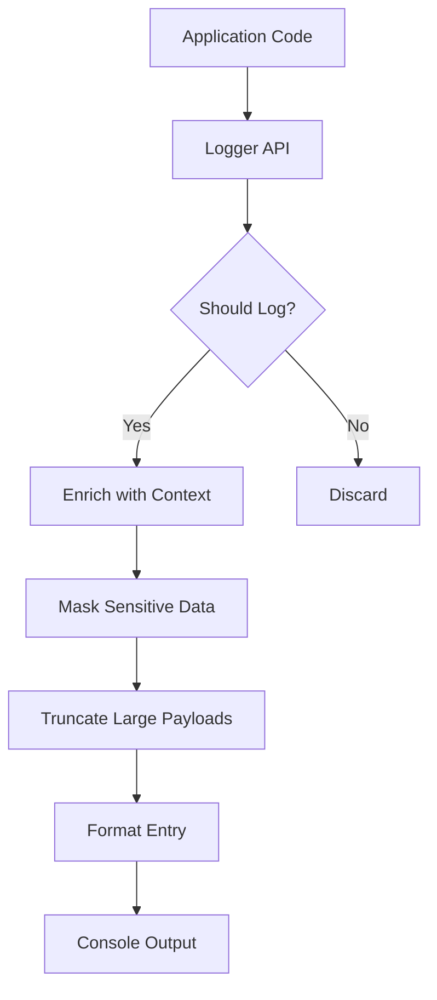
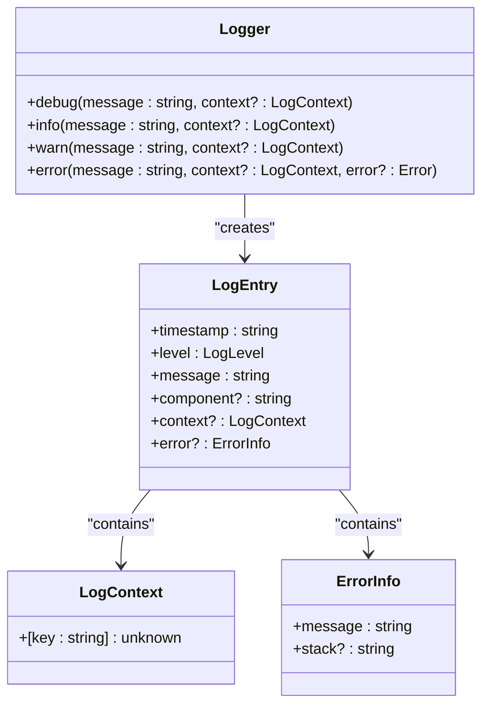
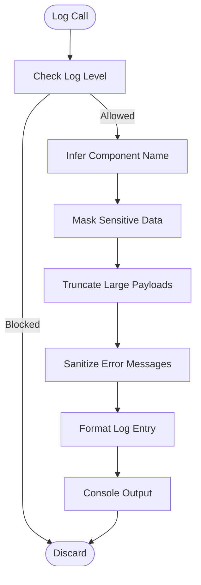
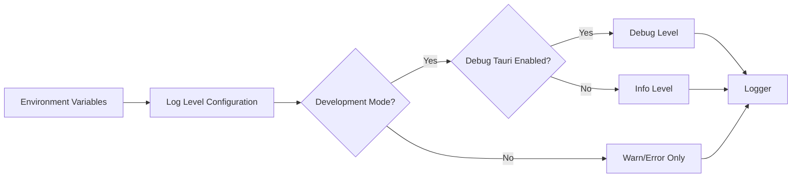

# Logging System

<cite>
**Referenced Files in This Document**   
- [logger.ts](file://src/lib/logger.ts)
- [logger.test.ts](file://src/lib/logger.test.ts)
- [env.ts](file://src/lib/env.ts)
- [notifications.ts](file://src/lib/notifications.ts)
</cite>

## Table of Contents

1. [Introduction](#introduction)
2. [Core Components](#core-components)
3. [Architecture Overview](#architecture-overview)
4. [Detailed Component Analysis](#detailed-component-analysis)
5. [Performance Considerations](#performance-considerations)
6. [Troubleshooting Guide](#troubleshooting-guide)

## Introduction

The logging system in the MCP Nexus application provides a structured and secure approach to application logging. It ensures consistent log formatting, automatic context collection, and protection of sensitive information across all components of the application. The system is designed to be environment-aware, with different log levels enabled based on development or production contexts.

## Core Components

The logging system consists of a centralized logger utility that handles all application logging needs. It automatically captures component context, sanitizes sensitive data, formats log entries consistently, and respects environment-based filtering rules. The logger integrates with the application's environment configuration system to determine appropriate log levels and behaviors.

**Section sources**

- [logger.ts](file://src/lib/logger.ts#L1-L279)
- [env.ts](file://src/lib/env.ts#L1-L134)

## Architecture Overview

The logging architecture follows a utility-based pattern where a singleton logger instance provides standardized logging methods across the application. The system intercepts log calls, enriches them with contextual information, applies security filters, and outputs formatted entries to the console. This approach ensures consistency while maintaining performance and security.

**Diagram sources **

- [logger.ts](file://src/lib/logger.ts#L215-L245)
- [env.ts](file://src/lib/env.ts#L54-L60)

## Detailed Component Analysis

### Logger Implementation

The logger implementation provides a comprehensive set of features for application logging, including automatic component detection, sensitive data masking, and payload management.

#### Core Functionality

**Diagram sources **

- [logger.ts](file://src/lib/logger.ts#L15-L31)
- [logger.ts](file://src/lib/logger.ts#L250-L278)

#### Data Processing Pipeline

**Diagram sources **

- [logger.ts](file://src/lib/logger.ts#L221-L245)
- [logger.ts](file://src/lib/logger.ts#L100-L129)

### Environment Integration

The logging system integrates with the application's environment configuration to determine appropriate logging behavior based on the current execution context.

**Diagram sources **

- [env.ts](file://src/lib/env.ts#L68-L96)
- [logger.ts](file://src/lib/logger.ts#L54-L60)

**Section sources**

- [logger.ts](file://src/lib/logger.ts#L54-L71)
- [env.ts](file://src/lib/env.ts#L68-L96)

## Performance Considerations

The logging system is designed with performance in mind, implementing several optimizations to minimize impact on application execution. These include environment-based filtering that prevents unnecessary log processing in production, efficient string operations, and minimal overhead for log calls that are filtered out. The system also truncates large payloads to prevent memory issues and ensure log readability.

## Troubleshooting Guide

When investigating issues with the logging system, check the environment configuration first, as log levels are controlled by environment variables. Ensure that VITE_DEBUG_TAURI is set appropriately for development debugging. For missing component names in logs, verify that the call stack is accessible in the execution environment. If sensitive data appears in logs, review the SENSITIVE_PATTERNS array in the logger implementation to ensure all relevant patterns are covered.

**Section sources**

- [logger.ts](file://src/lib/logger.ts#L36-L44)
- [env.ts](file://src/lib/env.ts#L70-L84)
