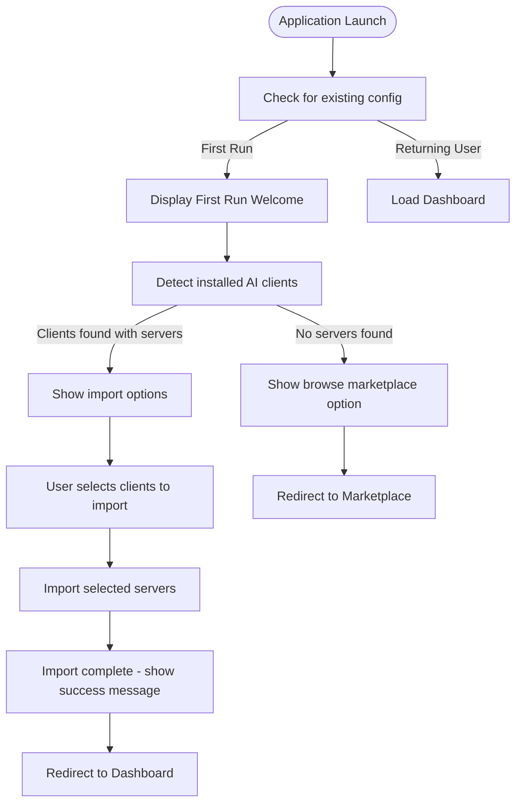
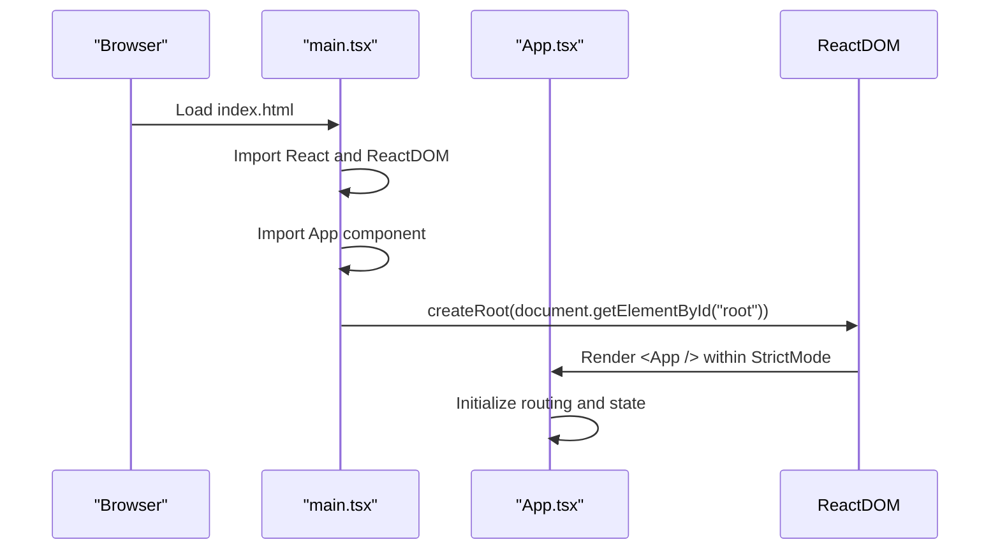
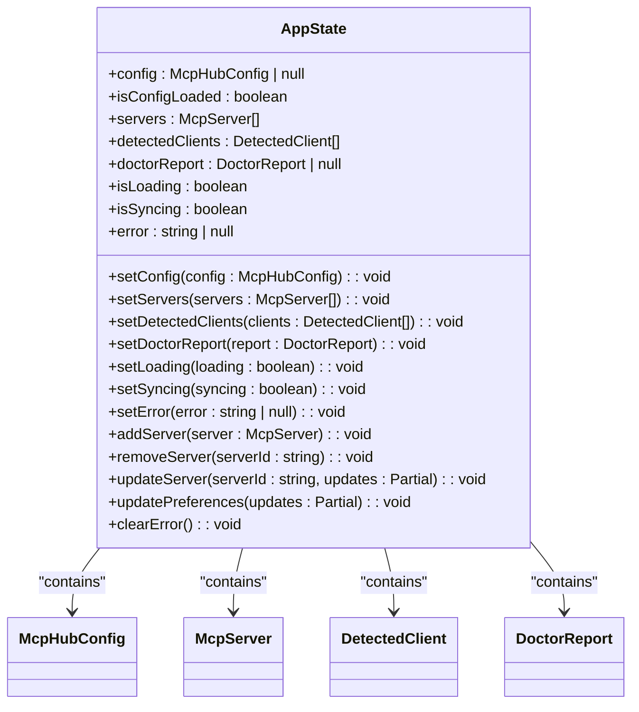
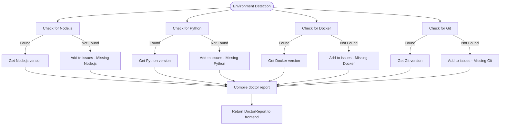

# Getting Started

<cite>
**Referenced Files in This Document**   
- [App.tsx](file://src/App.tsx)
- [main.tsx](file://src/main.tsx)
- [FirstRunWelcome.tsx](file://src/components/dashboard/FirstRunWelcome.tsx)
- [tauri.conf.json](file://src-tauri/tauri.conf.json)
- [appStore.ts](file://src/stores/appStore.ts)
- [useClients.ts](file://src/hooks/useClients.ts)
- [tauri.ts](file://src/lib/tauri.ts)
- [main.rs](file://src-tauri/src/main.rs)
- [installation.rs](file://src-tauri/src/services/installation.rs)
- [package.json](file://package.json)
- [README.md](file://README.md)
</cite>

## Table of Contents

1. [Introduction](#introduction)
2. [System Requirements and Installation](#system-requirements-and-installation)
3. [First Run Welcome Flow](#first-run-welcome-flow)
4. [Application Initialization and Bootstrapping](#application-initialization-and-bootstrapping)
5. [State Management with Zustand](#state-management-with-zustand)
6. [Configuration and Environment Detection](#configuration-and-environment-detection)
7. [Security and Permissions](#security-and-permissions)
8. [Tauri Configuration](#tauri-configuration)
9. [Common Pitfalls and Troubleshooting](#common-pitfalls-and-troubleshooting)
10. [Conclusion](#conclusion)

## Introduction

MCP Nexus is a desktop application designed to centralize the management of Model Context Protocol (MCP) servers across multiple AI clients. This document provides a comprehensive guide to the initial onboarding experience, covering installation, first-run setup, application architecture, and configuration. The application is built using React for the frontend and Rust with Tauri for the backend, providing a secure and performant desktop experience.

## System Requirements and Installation

### Prerequisites

Before installing MCP Nexus, ensure your macOS system meets the following requirements:

- **macOS**: The application is currently macOS-only, with Linux and Windows support planned for future releases
- **Node.js**: Required for installing and running NPM-based MCP servers. Install via [nvm](https://github.com/nvm-sh/nvm) or from [nodejs.org](https://nodejs.org)
- **Python**: Required for Python-based servers. Install from [python.org](https://python.org) or via package managers like Homebrew
- **Docker**: Optional, required only for Docker-based servers. Install from [docker.com](https://docker.com)
- **Git**: Optional, required for installing servers from GitHub repositories. Install from [git-scm.com](https://git-scm.com) or via Xcode Command Line Tools

### Installation Process

To install MCP Nexus on macOS:

1. Download the latest `.dmg` file from the [Releases](https://github.com/yourusername/mcp-nexus/releases) page
2. Open the downloaded `.dmg` file and drag the MCP Nexus application to your Applications folder
3. Launch MCP Nexus from your Applications folder

The application will automatically create a `~/.mcp-nexus/` directory in your home folder for storing the central configuration and cloned repositories.

**Section sources**

- [README.md](file://README.md#L18-L33)
- [package.json](file://package.json#L20-L28)

## First Run Welcome Flow

### Welcome Interface

When launching MCP Nexus for the first time, users are presented with the First Run Welcome interface, which serves as the initial onboarding experience. This interface is implemented in the `FirstRunWelcome.tsx` component and provides a guided setup process.

The welcome flow consists of two main states:

- **Initial welcome state**: Displays a welcome message and options to browse the marketplace or check settings
- **Import state**: When existing MCP servers are detected in AI clients, presents an option to import them



**Diagram sources**

- [FirstRunWelcome.tsx](file://src/components/dashboard/FirstRunWelcome.tsx#L6-L243)
- [Dashboard.tsx](file://src/pages/Dashboard.tsx#L16-L125)

### Server Import Process

The First Run Welcome interface automatically detects existing MCP servers in supported AI clients such as Claude Code, Cursor, VS Code, and others. When servers are found, users can select which clients to import servers from and initiate the import process.

Key features of the import process:

- **Client detection**: The application scans standard configuration paths for supported AI clients
- **Server identification**: Detects the number of servers configured in each client
- **Selective import**: Users can choose which clients to import servers from
- **Progress indication**: Shows a loading spinner during the import process
- **Success confirmation**: Displays a success message with options to view imported servers or browse the marketplace

The import functionality is powered by the `useImportClientServers` hook, which calls the Tauri backend to perform the import operation and update the application state accordingly.

**Section sources**

- [FirstRunWelcome.tsx](file://src/components/dashboard/FirstRunWelcome.tsx#L6-L243)
- [useClients.ts](file://src/hooks/useClients.ts#L88-L107)

## Application Initialization and Bootstrapping

### Application Entry Point

The MCP Nexus application is bootstrapped through the `main.tsx` file, which serves as the entry point for the React application. This file uses ReactDOM to render the root App component into the DOM.



**Diagram sources**

- [main.tsx](file://src/main.tsx#L1-L10)
- [App.tsx](file://src/App.tsx#L1-L58)

### Root Component Structure

The `App.tsx` file defines the root component that orchestrates the application's routing and state initialization. It uses React Router for navigation between different views and wraps the application with necessary providers.

Key aspects of the App component:

- **Routing**: Uses `BrowserRouter` and `Routes` to define navigation between dashboard, marketplace, servers, clients, and settings
- **State management**: Wraps the application with `QueryClientProvider` for React Query
- **Error handling**: Implements `ErrorBoundary` to gracefully handle component errors
- **Layout structure**: Organizes the UI with a sidebar for navigation and a main content area
- **Global features**: Initializes global keyboard shortcuts through the `useGlobalKeyboardShortcuts` hook

The component structure follows a clean separation of concerns, with the `AppContent` function handling the main layout and the `App` function providing the necessary context providers.

**Section sources**

- [App.tsx](file://src/App.tsx#L1-L58)

## State Management with Zustand

### Global State Architecture

MCP Nexus uses Zustand for global state management, providing a lightweight and efficient solution for managing application state. The state is centralized in the `appStore.ts` file, which defines the application's state structure and mutation methods.

The global state includes:

- **Configuration state**: Stores the central MCP Hub configuration
- **Server management**: Maintains a list of configured MCP servers
- **Client detection**: Tracks detected AI clients and their status
- **Environment reports**: Stores results from the environment doctor check
- **UI state**: Manages loading states, error messages, and other UI-related state



**Diagram sources**

- [appStore.ts](file://src/stores/appStore.ts#L1-L118)
- [types/index.ts](file://src/types/index.ts#L69-L75)

### State Initialization

During application startup, the state is initialized through a series of asynchronous operations. The Dashboard component calls the `initializeConfig` function from the Tauri backend to set up the configuration system and determine if this is the first run.

The initialization process:

1. Calls `initializeConfig` to create the `~/.mcp-nexus/` directory if it doesn't exist
2. Loads the existing configuration or creates a default one
3. Sets the `firstRun` flag based on whether servers already exist
4. Updates the global state with the initialization result
5. Triggers client detection to identify installed AI clients

This initialization ensures that the application state is properly configured before rendering the main interface, providing a seamless onboarding experience for new users while preserving existing configurations for returning users.

**Section sources**

- [appStore.ts](file://src/stores/appStore.ts#L1-L118)
- [Dashboard.tsx](file://src/pages/Dashboard.tsx#L16-L125)
- [tauri.ts](file://src/lib/tauri.ts#L38-L40)

## Configuration and Environment Detection

### Configuration Initialization

The configuration system is initialized through the `initializeConfig` function, which is called from the Tauri backend. This function creates the necessary directory structure and configuration files in the user's home directory.

Key aspects of configuration initialization:

- **Directory creation**: Creates the `~/.mcp-nexus/` directory if it doesn't exist
- **Config file setup**: Initializes the `config.json` file with default values
- **First run detection**: Determines if this is the first time the application is being run
- **Path resolution**: Returns the configuration directory and file paths for use by the frontend

The initialization result includes a `firstRun` flag that the frontend uses to determine whether to display the First Run Welcome interface or proceed directly to the dashboard.

### Environment Detection

MCP Nexus performs comprehensive environment detection to ensure all required dependencies are available for server installation and operation. This detection is performed by the `runDoctor` function in the Tauri backend, which checks for the presence of Node.js, Python, Docker, Git, and other required tools.

The environment detection process:

1. Scans the system for installed runtimes and tools
2. Verifies the availability of each required dependency
3. Generates a report with version information and any issues found
4. Provides suggestions for resolving missing dependencies

This information is used to validate server installations and provide helpful error messages when required runtimes are missing. For example, when attempting to install an NPM-based server, the application checks if Node.js is available and provides installation instructions if it's not found.



**Diagram sources**

- [installation.rs](file://src-tauri/src/services/installation.rs#L124-L183)
- [tauri.ts](file://src/lib/tauri.ts#L146-L148)
- [types/index.ts](file://src/types/index.ts#L134-L141)

**Section sources**

- [installation.rs](file://src-tauri/src/services/installation.rs#L124-L183)
- [tauri.ts](file://src/lib/tauri.ts#L146-L148)

## Security and Permissions

### File System Permissions

MCP Nexus requires appropriate file system permissions to read and write configuration files for various AI clients. During the setup process, the application may request permission to access specific directories where client configuration files are stored.

Key configuration paths that may require permission:

- `~/.claude.json` for Claude Code
- `~/Library/Application Support/Claude/claude_desktop_config.json` for Claude Desktop
- `~/.cursor/mcp.json` for Cursor
- `~/.vscode/mcp.json` for VS Code
- `~/.continue/config.json` for Continue.dev

The application handles permission requests gracefully, providing clear instructions to users when access is denied and suggesting manual configuration alternatives when automatic sync is not possible.

### Keychain Access

For secure credential management, MCP Nexus integrates with macOS Keychain to store sensitive information such as API keys and tokens. This integration is implemented through Tauri commands that securely store and retrieve credentials.

The Keychain integration provides:

- **Secure storage**: Credentials are encrypted and stored in the macOS Keychain
- **Reference-based syncing**: Only credential references (e.g., `keychain:anthropic-api-key`) are synced to client configurations
- **Access control**: Users must grant permission for the application to access Keychain items
- **Credential management**: Users can add, view, and delete stored credentials through the Settings interface

This approach ensures that sensitive credentials are never written to configuration files, reducing the risk of accidental exposure while maintaining the convenience of centralized credential management.

**Section sources**

- [README.md](file://README.md#L79-L88)
- [tauri.ts](file://src/lib/tauri.ts#L161-L187)

## Tauri Configuration

### Window and Build Settings

The `tauri.conf.json` file contains the configuration for the Tauri application, defining window properties, build settings, and security configurations. This file is essential for customizing the desktop application's behavior and appearance.

Key configuration settings:

- **Window properties**: Sets the initial window size to 800x600 pixels with the title "mcp-nexus"
- **Build commands**: Specifies the development and build commands for the frontend application
- **Security settings**: Disables Content Security Policy (CSP) to allow necessary functionality
- **Bundle configuration**: Defines the application icon files for different platforms

```json
{
  "productName": "mcp-nexus",
  "version": "0.1.0",
  "identifier": "com.joshsmbp.mcp-nexus",
  "build": {
    "beforeDevCommand": "npm run dev",
    "devUrl": "http://localhost:1420",
    "beforeBuildCommand": "npm run build",
    "frontendDist": "../dist"
  },
  "app": {
    "windows": [
      {
        "title": "mcp-nexus",
        "width": 800,
        "height": 600
      }
    ],
    "security": {
      "csp": null
    }
  },
  "bundle": {
    "active": true,
    "targets": "all",
    "icon": [
      "icons/32x32.png",
      "icons/128x128.png",
      "icons/128x128@2x.png",
      "icons/icon.icns",
      "icons/icon.ico"
    ]
  }
}
```

**Diagram sources**

- [tauri.conf.json](file://src-tauri/tauri.conf.json#L1-L36)

### Backend Integration

The Tauri configuration enables seamless integration between the React frontend and Rust backend, allowing the application to perform system-level operations securely. The configuration exposes specific commands from the Rust backend to the frontend through the `invoke` API.

Key integration points:

- **File system access**: Enables reading and writing configuration files
- **Process execution**: Allows running commands like `npx`, `uvx`, and `docker`
- **Environment detection**: Provides access to system information for runtime validation
- **Keychain integration**: Facilitates secure credential storage and retrieval

The configuration ensures that these powerful capabilities are exposed in a controlled manner, with appropriate security considerations to protect user data and system integrity.

**Section sources**

- [tauri.conf.json](file://src-tauri/tauri.conf.json#L1-L36)
- [tauri.ts](file://src/lib/tauri.ts#L1-L364)

## Common Pitfalls and Troubleshooting

### Installation Issues

When installing MCP Nexus or configuring servers, users may encounter several common issues:

**Missing runtime dependencies**: If Node.js, Python, or other required runtimes are not installed, server installation will fail. The application provides specific error messages with installation instructions for missing dependencies.

**File permission errors**: The application may not have permission to read or write configuration files for certain AI clients. Solutions include:

- Granting file system permissions through macOS security settings
- Manually configuring clients that don't support automatic sync (like Warp)
- Running the application with appropriate permissions

**Client detection failures**: If AI clients are not detected, verify that:

- The client is installed in the standard location
- The client has been run at least once to create its configuration file
- The configuration file path is accessible to MCP Nexus

### Setup Best Practices

To ensure a smooth setup experience:

1. **Install prerequisites first**: Install Node.js and Python before launching MCP Nexus
2. **Run AI clients once**: Launch each AI client at least once to ensure configuration files are created
3. **Grant permissions promptly**: When prompted, grant file system and Keychain access to avoid configuration issues
4. **Start with manual imports**: Use the First Run Welcome interface to import existing servers before adding new ones
5. **Verify environment**: Check the Environment section in Settings to confirm all required runtimes are detected

### Debugging Initialization Issues

When troubleshooting initialization problems:

1. **Check the initialization result**: The `initializeConfig` function returns detailed information about the configuration directory and first run status
2. **Review environment detection**: Use the Settings > Environment section to verify all required runtimes are available
3. **Examine error messages**: Pay attention to specific error messages from the Tauri backend, which often include suggestions for resolution
4. **Verify file paths**: Ensure that AI client configuration files exist in their expected locations
5. **Check application logs**: Review console output for detailed error information during startup

**Section sources**

- [README.md](file://README.md#L108-L137)
- [tauri.ts](file://src/lib/tauri.ts#L38-L40)
- [installation.rs](file://src-tauri/src/services/installation.rs#L124-L183)

## Conclusion

MCP Nexus provides a comprehensive solution for managing MCP servers across multiple AI clients, with a carefully designed onboarding experience that guides users through installation, configuration, and setup. The application leverages modern technologies like React, Rust, and Tauri to deliver a secure and performant desktop experience.

The initialization process is designed to be user-friendly, automatically detecting existing configurations and providing clear guidance for setting up new servers. State management through Zustand ensures a responsive and consistent user interface, while Tauri enables secure system-level operations for configuration management.

By following the setup instructions and understanding the application's architecture, users can quickly begin managing their MCP servers from a central location, streamlining their workflow and improving productivity across multiple AI tools.
