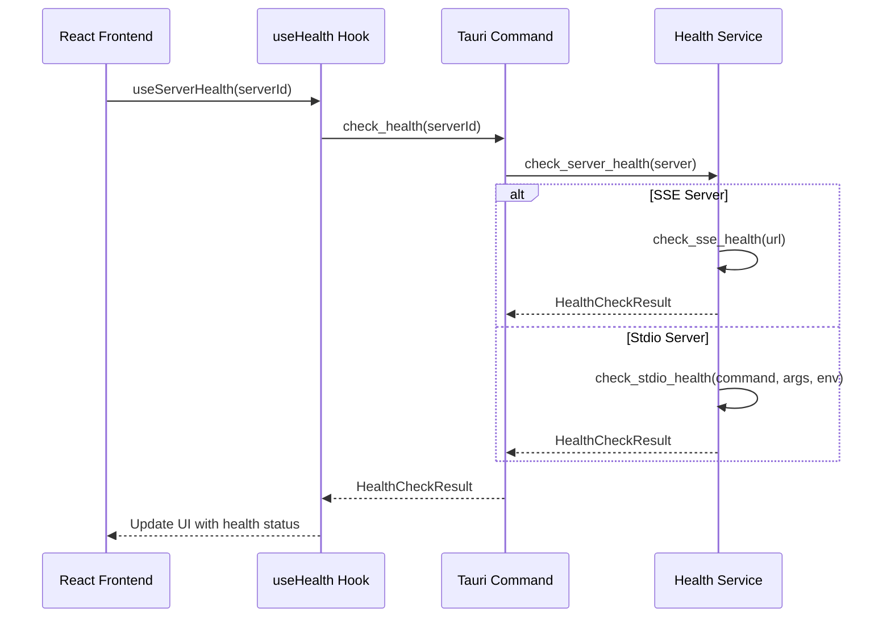
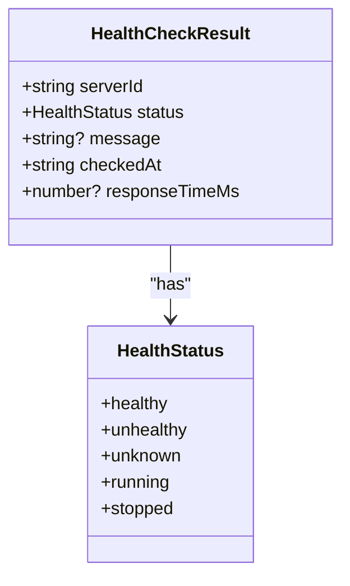
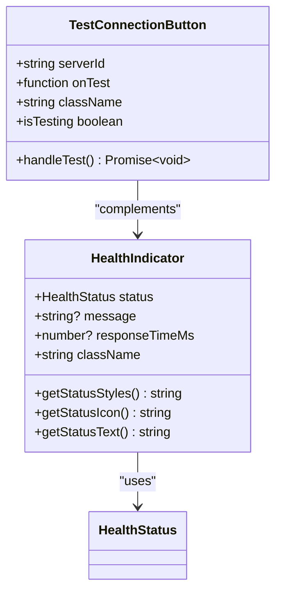
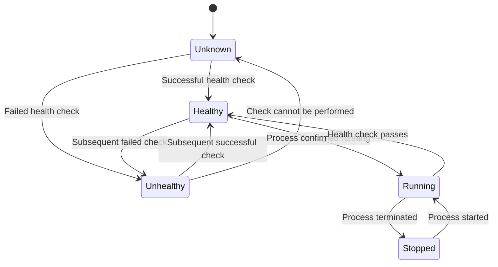

# Health Monitoring

<cite>
**Referenced Files in This Document**   
- [HealthIndicator.tsx](file://src/components/common/HealthIndicator.tsx)
- [useHealth.ts](file://src/hooks/useHealth.ts)
- [health.rs](file://src-tauri/src/services/health.rs)
- [health.rs](file://src-tauri/src/commands/health.rs)
- [tauri.ts](file://src/lib/tauri.ts)
- [HealthStatusBadge.tsx](file://src/components/servers/HealthStatusBadge.tsx)
- [index.ts](file://src/types/index.ts)
</cite>

## Table of Contents

1. [Introduction](#introduction)
2. [Health Check Implementation](#health-check-implementation)
3. [Health Check Result Data Model](#health-check-result-data-model)
4. [Health Service and Polling Mechanism](#health-service-and-polling-mechanism)
5. [Health Indicator Component](#health-indicator-component)
6. [Status Transition Logic](#status-transition-logic)
7. [Failure Detection and Retry Strategies](#failure-detection-and-retry-strategies)
8. [Visual Indicators for Health States](#visual-indicators-for-health-states)
9. [Performance Considerations](#performance-considerations)
10. [Troubleshooting Guidance](#troubleshooting-guidance)

## Introduction

The health monitoring system in MCP Nexus ensures that MCP servers are responsive and functioning correctly. This system implements comprehensive health checks for both stdio and SSE (Server-Sent Events) protocols, providing real-time status information about server health. The monitoring system measures response times and displays them through the HealthIndicator component, allowing users to quickly assess server performance. The system is designed to detect failures, handle retries, and provide visual feedback on server status, ensuring reliable operation of the MCP server ecosystem.

**Section sources**

- [HealthIndicator.tsx](file://src/components/common/HealthIndicator.tsx)
- [useHealth.ts](file://src/hooks/useHealth.ts)
- [health.rs](file://src-tauri/src/services/health.rs)

## Health Check Implementation

The health monitoring system implements health checks for both stdio and SSE protocols through a comprehensive backend service. For SSE servers, health checks are performed by making HTTP requests to the server's endpoint with a configurable timeout. The system uses the reqwest HTTP client to send GET requests and evaluates the response status to determine health. Successful responses (status codes 200 or 204) indicate a healthy server, while other status codes or connection failures indicate unhealthy states.

For stdio servers, health checks involve attempting to spawn the server process and verifying its initialization. The system uses Tokio's process management to spawn the server with specified command, arguments, and environment variables. After spawning, it checks whether the process is running successfully or has exited with an error. The health check gives the process 500 milliseconds to initialize before checking its status, allowing time for servers to start properly.

The health check implementation is protocol-agnostic, with the `check_server_health` function routing to the appropriate protocol-specific check based on the server's transport type. This design allows for consistent health monitoring across different server types while maintaining protocol-specific logic where necessary.



**Diagram sources**

- [health.rs](file://src-tauri/src/services/health.rs#L36-L191)
- [health.rs](file://src-tauri/src/commands/health.rs#L30-L100)

**Section sources**

- [health.rs](file://src-tauri/src/services/health.rs#L36-L191)
- [health.rs](file://src-tauri/src/commands/health.rs#L30-L100)

## Health Check Result Data Model

The health monitoring system uses a structured data model to represent the results of health checks. The `HealthCheckResult` interface defines the schema for health check outcomes, containing essential information about the server's status. This data model is consistent across both frontend and backend implementations, ensuring type safety and predictable data flow.

The `HealthCheckResult` includes the following properties:

- `serverId`: Unique identifier of the server being checked
- `status`: Current health status (healthy, unhealthy, unknown, running, stopped)
- `message`: Optional descriptive message about the health status
- `checkedAt`: Timestamp of when the health check was performed
- `responseTimeMs`: Optional response time in milliseconds for healthy servers

The corresponding Rust struct `HealthCheckResult` in the backend uses snake_case field naming and includes the same properties, with appropriate type conversions for serialization between Rust and TypeScript. The `HealthStatus` enum defines the possible states a server can be in, with variants for healthy, unhealthy, unknown, running, and stopped states. This comprehensive data model enables detailed health reporting and facilitates troubleshooting when issues arise.



**Diagram sources**

- [index.ts](file://src/types/index.ts#L419-L425)
- [health.rs](file://src-tauri/src/services/health.rs#L28-L34)

**Section sources**

- [index.ts](file://src/types/index.ts#L409-L425)
- [health.rs](file://src-tauri/src/services/health.rs#L9-L34)

## Health Service and Polling Mechanism

The health monitoring system employs a robust polling mechanism to maintain up-to-date server status information. The HealthService, implemented through React Query hooks, performs periodic health checks and propagates status updates throughout the application. The system uses two primary hooks: `useServerHealth` for individual servers and `useAllServerHealth` for checking all servers simultaneously.

The polling configuration is optimized for both responsiveness and performance. Individual server health checks have a stale time of 30 seconds and a refetch interval of 60 seconds, meaning the data is considered fresh for 30 seconds and automatically refreshed every minute. This balance ensures users see relatively current information without overwhelming the system with frequent requests.

For checking all servers, the system uses a similar polling strategy but optimizes for batch operations. The `check_all_health` Tauri command retrieves all servers from the configuration and checks each one concurrently, maximizing efficiency. The React Query mutation hooks `useHealthCheck` and `useHealthCheckAll` allow for manual triggering of health checks, with appropriate cache updates to ensure the UI reflects the latest results.

The service architecture follows a clean separation of concerns, with Tauri commands bridging the frontend and backend. When a health check is requested, the frontend invokes a Tauri command, which executes the appropriate health check in the Rust backend and returns the result to the frontend. This architecture ensures that resource-intensive operations occur in the efficient Rust runtime while maintaining a responsive user interface.

```mermaid
flowchart TD
A[Frontend] --> B[useServerHealth Hook]
B --> C{Server ID Available?}
C --> |Yes| D[Query Key: ["health", serverId]]
C --> |No| E[Disabled Query]
D --> F[Invoke check_health Tauri Command]
F --> G[Rust Backend]
G --> H[check_server_health Function]
H --> I{Transport Type}
I --> |SSE| J[check_sse_health]
I --> |Stdio| K[check_stdio_health]
J --> L[Return HealthCheckResult]
K --> L
L --> M[Update React Query Cache]
M --> N[Update UI Components]
O[Manual Check] --> P[TestConnectionButton]
P --> Q[useHealthCheck Mutation]
Q --> F
```

**Diagram sources**

- [useHealth.ts](file://src/hooks/useHealth.ts#L7-L67)
- [tauri.ts](file://src/lib/tauri.ts#L345-L354)
- [health.rs](file://src-tauri/src/commands/health.rs#L30-L74)

**Section sources**

- [useHealth.ts](file://src/hooks/useHealth.ts#L7-L67)
- [tauri.ts](file://src/lib/tauri.ts#L345-L354)

## Health Indicator Component

The HealthIndicator component provides a visual representation of server health status in the user interface. Implemented as a React component in `HealthIndicator.tsx`, it displays the current health status with appropriate styling, icons, and response time information. The component accepts props for status, optional message, response time, and custom CSS classes, making it flexible for various use cases.

The component uses different visual elements to represent each health state:

- Healthy: Green indicator with filled circle icon
- Unhealthy: Red indicator with filled circle icon
- Running: Blue indicator with play triangle icon
- Stopped: Gray indicator with square icon
- Unknown: Gray indicator with question mark icon

For healthy servers, the component additionally displays the response time in milliseconds, providing performance insights. Error messages are shown for unhealthy servers, truncated to 50 characters with an ellipsis if longer. The component's styling adapts to both light and dark themes, ensuring readability in different environments.

A companion component, `TestConnectionButton`, allows users to manually trigger health checks. This button shows a loading spinner during the check and disables interaction to prevent multiple simultaneous requests. The button's styling changes to indicate the testing state, providing clear feedback to users.



**Diagram sources**

- [HealthIndicator.tsx](file://src/components/common/HealthIndicator.tsx#L1-L129)

**Section sources**

- [HealthIndicator.tsx](file://src/components/common/HealthIndicator.tsx#L1-L129)

## Status Transition Logic

The health monitoring system implements a comprehensive status transition logic that accurately reflects the state of MCP servers. The system defines five distinct health states: healthy, unhealthy, unknown, running, and stopped. These states represent different phases in a server's lifecycle and provide meaningful information to users.

The transition between states follows specific rules based on health check outcomes:

- Healthy: Server responds correctly to health checks with acceptable response times
- Unhealthy: Server fails health checks due to connection issues, timeouts, or error responses
- Unknown: Server status cannot be determined, typically during initialization or when checks fail
- Running: Server process is active and operational
- Stopped: Server is not currently running

The system handles status transitions through both automated polling and manual checks. Automated polling updates the status every 60 seconds, while manual checks through the TestConnectionButton provide immediate status updates. The React Query cache is updated accordingly, ensuring that all components displaying health information reflect the current state.

The `get_server_status` command provides a quick status check without performing a full health check, returning "Unknown" for enabled servers and "Stopped" for disabled ones. This lightweight check is used for rapid status updates in the UI, while the full health check provides detailed diagnostic information.



**Diagram sources**

- [health.rs](file://src-tauri/src/services/health.rs#L9-L23)
- [health.rs](file://src-tauri/src/commands/health.rs#L76-L99)

**Section sources**

- [health.rs](file://src-tauri/src/services/health.rs#L9-L23)
- [health.rs](file://src-tauri/src/commands/health.rs#L76-L99)

## Failure Detection and Retry Strategies

The health monitoring system implements robust failure detection and handling mechanisms to ensure reliable operation. For SSE servers, failure detection occurs at multiple levels: HTTP client creation, connection establishment, and response validation. If the HTTP client cannot be created, the status is set to "Unknown" with an appropriate error message. Connection failures result in an "Unhealthy" status with details about the connection issue. HTTP responses with non-success status codes are also classified as "Unhealthy" with the specific status code and reason.

For stdio servers, failure detection focuses on process spawning and initialization. If the server process cannot be spawned, the status is "Unhealthy" with details about the spawn error. If the process exits immediately with a non-zero status, it's considered "Unhealthy." The system allows a 500ms initialization period before checking the process status, accommodating servers that take time to start.

The system does not implement automatic retries for failed health checks, relying instead on the periodic polling mechanism to recheck server status. This approach prevents cascading failures and excessive resource usage during outages. However, users can manually retry failed checks using the TestConnectionButton, providing immediate feedback on whether an issue has been resolved.

Error messages are designed to be informative and actionable, helping users diagnose and resolve issues. Network-related failures include specific error details, while process-related failures indicate command execution problems. This comprehensive error reporting enables effective troubleshooting of server health issues.

**Section sources**

- [health.rs](file://src-tauri/src/services/health.rs#L36-L177)
- [HealthIndicator.tsx](file://src/components/common/HealthIndicator.tsx#L77-L81)

## Visual Indicators for Health States

The health monitoring system provides clear visual indicators for different health states through multiple components. The primary indicator is the HealthIndicator component, which uses color-coded badges with status-specific icons to represent server health. These visual elements are designed to be immediately recognizable, allowing users to quickly assess server status at a glance.

The color scheme follows standard conventions:

- Green for healthy servers, indicating optimal performance
- Red for unhealthy servers, signaling immediate attention required
- Blue for running servers, showing active processes
- Gray for stopped or disabled servers, indicating intentional shutdown
- Yellow for unknown status, representing indeterminate states

In addition to the HealthIndicator, the system includes the HealthStatusBadge component, which provides a more compact representation suitable for lists and tables. This badge shows a colored dot with an optional label, conserving space while maintaining clear status indication. The HealthStatusDot component offers an even more minimal representation, using only a colored dot for dense layouts.

These visual indicators are used throughout the application, including in the ServerList and ServerCard components. They update automatically based on the polling mechanism, ensuring that users always see current status information. The indicators also provide tooltips with detailed error messages when available, offering additional context without cluttering the interface.

**Section sources**

- [HealthIndicator.tsx](file://src/components/common/HealthIndicator.tsx#L17-L30)
- [HealthStatusBadge.tsx](file://src/components/servers/HealthStatusBadge.tsx#L11-L53)

## Performance Considerations

The health monitoring system incorporates several performance optimizations to balance responsiveness with resource efficiency. The polling intervals are carefully tuned to provide timely updates without excessive resource consumption. Individual server checks refresh every 60 seconds with a 30-second stale time, while batch checks for all servers follow the same schedule.

For concurrent health checks, the system processes servers sequentially rather than in parallel, preventing potential resource exhaustion when checking multiple servers simultaneously. This approach is particularly important for stdio servers, which involve spawning processes that consume system resources. The sequential processing ensures that the system remains stable even with numerous servers configured.

Battery efficiency on laptops is addressed through several mechanisms. The polling continues only when the application is active, and the intervals are long enough to minimize wake-ups and network activity. The system does not implement aggressive retry strategies that could drain battery life during network outages.

The React Query integration provides efficient caching, preventing unnecessary re-renders when health data hasn't changed. The cache is updated only when new data arrives, and components subscribe to specific query keys, ensuring minimal re-renders. This optimization is particularly important for large server lists, where frequent updates could impact UI performance.

Network efficiency is optimized by using appropriate timeouts (10 seconds for health checks) and handling connection failures gracefully. The system avoids repeated rapid retries that could overwhelm networks or servers during outages. The SSE health checks use standard HTTP GET requests without additional headers or payloads, minimizing network overhead.

**Section sources**

- [useHealth.ts](file://src/hooks/useHealth.ts#L12-L13)
- [health.rs](file://src-tauri/src/commands/health.rs#L47-L48)
- [useHealth.ts](file://src/hooks/useHealth.ts#L22-L23)

## Troubleshooting Guidance

When encountering health check issues, users should follow a systematic troubleshooting approach. For false positives, where a server appears unhealthy despite being functional, users should first verify the server configuration, particularly the transport settings. For SSE servers, ensure the URL is correct and accessible. For stdio servers, verify the command, arguments, and environment variables.

Network-related health check failures can often be resolved by checking connectivity and firewall settings. Users should verify that the application can reach the server endpoint, especially for remote SSE servers. For stdio servers, ensure that required dependencies and runtimes are available in the environment.

When troubleshooting, users can utilize the manual test connection feature to get immediate feedback. The detailed error messages provided in the health check results offer specific information about the nature of the failure, whether it's a connection timeout, authentication issue, or process execution error.

For persistent issues, users should check the application logs for additional diagnostic information. The health check system logs detailed information about each check, including timestamps, response times, and error details. This information can help identify patterns or intermittent issues that might not be apparent from the UI alone.

If problems persist, users can temporarily disable and re-enable the server to reset its state, or restart the application to clear any potential caching issues. For complex configurations, simplifying the setup and gradually adding complexity can help isolate the source of the problem.

**Section sources**

- [health.rs](file://src-tauri/src/services/health.rs#L48-L54)
- [health.rs](file://src-tauri/src/services/health.rs#L82-L89)
- [HealthIndicator.tsx](file://src/components/common/HealthIndicator.tsx#L77-L81)
