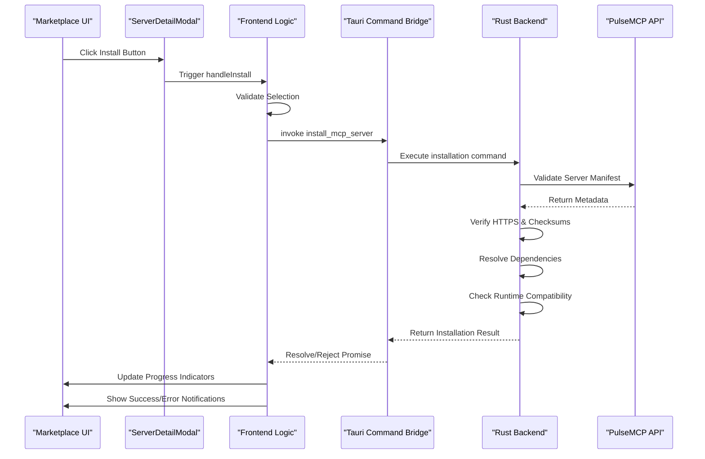
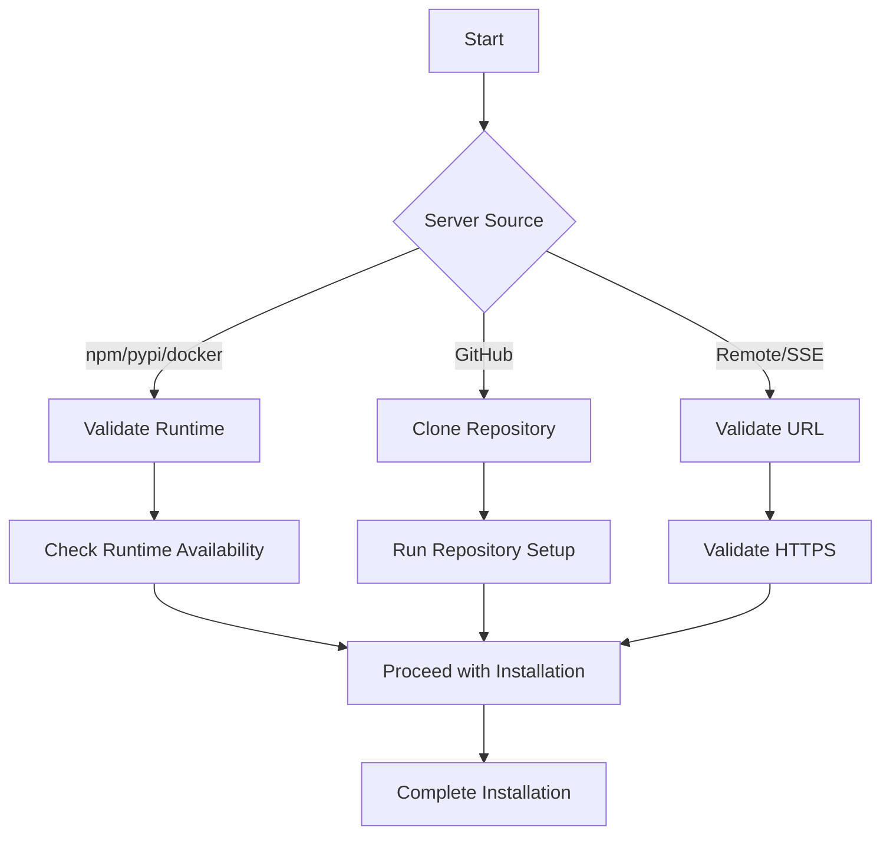
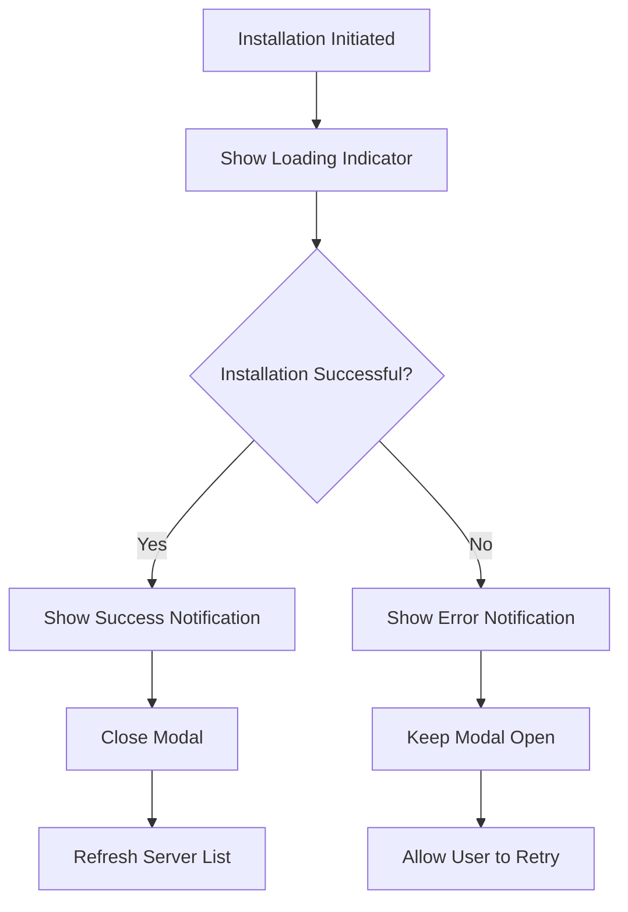

# Installation from Marketplace

<cite>
**Referenced Files in This Document**   
- [ServerDetailModal.tsx](file://src/components/marketplace/ServerDetailModal.tsx)
- [Marketplace.tsx](file://src/pages/Marketplace.tsx)
- [tauri.ts](file://src/lib/tauri.ts)
- [installation.rs](file://src-tauri/src/commands/installation.rs)
- [marketplace_client.rs](file://src-tauri/src/services/marketplace_client.rs)
- [installation.rs](file://src-tauri/src/services/installation.rs)
- [index.ts](file://src/types/index.ts)
- [notifications.ts](file://src/lib/notifications.ts)
- [mvp-gap-analysis.md](file://docs/mvp-gap-analysis.md)
</cite>

## Table of Contents

1. [Introduction](#introduction)
2. [Installation Workflow Overview](#installation-workflow-overview)
3. [Frontend Initiation](#frontend-initiation)
4. [Tauri Command Bridge](#tauri-command-bridge)
5. [Rust Backend Services](#rust-backend-services)
6. [Secure Download and Validation](#secure-download-and-validation)
7. [Installation Service Processing](#installation-service-processing)
8. [User Feedback Mechanisms](#user-feedback-mechanisms)
9. [Error Handling and Recovery](#error-handling-and-recovery)
10. [Security Considerations](#security-considerations)

## Introduction

This document details the server installation workflow from the marketplace interface in the MCP Nexus application. The process begins when a user clicks the Install button in the ServerDetailModal and triggers a chain of operations that span from the frontend React interface through Tauri commands to the Rust backend services. The workflow encompasses secure download processes, integrity verification, metadata validation, extraction, dependency resolution, runtime compatibility checks, and comprehensive user feedback mechanisms. The documentation covers both the current implementation state and the intended post-MVP enhancement to create a seamless one-click installation experience from marketplace discovery to server deployment.

**Section sources**

- [mvp-gap-analysis.md](file://docs/mvp-gap-analysis.md#L71-L85)

## Installation Workflow Overview

The server installation workflow from the marketplace interface follows a multi-layered architecture that coordinates between the frontend React components, Tauri command bridge, and Rust backend services. When a user selects a server from the marketplace and clicks the Install button, the frontend initiates a series of operations that validate runtime requirements, securely download server artifacts, verify integrity through checksums, validate metadata against the server manifest, and finally install and configure the server for use with AI clients. The workflow is designed to provide real-time feedback through progress indicators, success notifications, and error recovery options while maintaining security through sandboxed execution and permission prompts for file system access.

**Diagram sources **

- [ServerDetailModal.tsx](file://src/components/marketplace/ServerDetailModal.tsx#L148-L153)
- [Marketplace.tsx](file://src/pages/Marketplace.tsx#L59-L90)
- [tauri.ts](file://src/lib/tauri.ts#L236-L241)
- [installation.rs](file://src-tauri/src/commands/installation.rs#L98-L135)
- [marketplace_client.rs](file://src-tauri/src/services/marketplace_client.rs#L75-L200)

## Frontend Initiation

The installation workflow begins in the ServerDetailModal component when the user clicks the Install button after selecting one or more AI clients for server integration. The modal captures the user's selections, including the target clients and any required configuration such as SSE URLs for remote servers. The installation process is initiated through the handleInstall callback function, which validates that at least one client is selected and that any required fields (like SSE URLs) are properly filled. The frontend then sets the isInstalling state to true, which triggers a visual loading indicator in the Install button to provide immediate feedback to the user.

The ServerDetailModal passes the installation request to the parent Marketplace component through the onInstall prop. In the current implementation, this triggers a simulated installation process that logs the installation request and shows a success notification after a one-second delay. However, the intended post-MVP workflow will map the MarketplaceServer metadata to an InstallServerRequest object and invoke the actual Rust installation command through Tauri. The frontend maintains installation state through React hooks and provides appropriate loading states during the installation process.

**Section sources**

- [ServerDetailModal.tsx](file://src/components/marketplace/ServerDetailModal.tsx#L148-L153)
- [Marketplace.tsx](file://src/pages/Marketplace.tsx#L59-L90)

## Tauri Command Bridge

The Tauri command bridge serves as the communication layer between the frontend JavaScript/TypeScript code and the Rust backend services. When the installation process is initiated, the frontend uses the invoke function from @tauri-apps/api/core to call the install_mcp_server command with the appropriate parameters. This command invocation is defined in the tauri.ts utility file, which provides a typed interface for all Tauri commands in the application.

The installMcpServer function in tauri.ts accepts an InstallServerRequest object and an optional syncAfterInstall boolean flag. This function acts as a wrapper around the Tauri invoke function, providing type safety and error handling for the command invocation. The InstallServerRequest interface is defined in the types system and includes properties such as name, description, source, enabledClients, sourceUrl, and env, which are used to configure the server installation.

The Tauri command bridge ensures that the installation request is properly serialized and passed from the frontend to the Rust backend, where it is deserialized and processed by the installation service. This bridge also handles error propagation, ensuring that any errors from the Rust backend are properly communicated back to the frontend for user feedback.

**Section sources**

- [tauri.ts](file://src/lib/tauri.ts#L236-L241)
- [index.ts](file://src/types/index.ts#L264-L278)

## Rust Backend Services

The Rust backend services handle the core installation logic through a series of coordinated components. The installation process is managed by the install_mcp_server command in the installation.rs file, which orchestrates the entire installation workflow. This command first runs an environment doctor check to gather information about the current system state, including available runtimes and tools.

The installation command then delegates to the do_install function in the installation service, which performs the actual server installation. After successful installation, the server configuration is saved to the central config, and optionally synced to all enabled clients. The command returns an InstallServerResponse containing the installation result and sync result (if performed).

The backend services are organized into a modular architecture with separate components for different responsibilities:

- The marketplace_client handles communication with the PulseMCP API
- The installation service manages the server installation lifecycle
- The config_manager handles configuration persistence
- The sync_engine manages client synchronization

This modular design allows for separation of concerns and makes the system more maintainable and testable.

**Section sources**

- [installation.rs](file://src-tauri/src/commands/installation.rs#L98-L135)
- [installation.rs](file://src-tauri/src/services/installation.rs#L480-L520)

## Secure Download and Validation

The secure download process is managed by the MarketplaceClient in the marketplace_client.rs file, which handles communication with the PulseMCP API. The client enforces HTTPS by using a fixed base URL with the HTTPS protocol (https://api.pulsemcp.com/v0beta). All API requests are made over secure connections, ensuring that server metadata and artifacts are transmitted securely.

The marketplace client implements a caching mechanism with a default TTL of 300 seconds (5 minutes) to reduce the number of API calls while ensuring that data remains reasonably fresh. The cache stores search results and server details, allowing the application to function offline or with limited connectivity.

When retrieving server information, the client performs several validation steps:

1. It validates the URL format for remote servers, ensuring they start with http:// or https://
2. It checks for required runtimes based on the server's package registry
3. It validates local paths to ensure they exist before attempting installation

The client also handles various HTTP status codes appropriately, including rate limiting (429) by returning cached data when available, and API errors by providing meaningful error messages to the frontend.

**Diagram sources **

- [marketplace_client.rs](file://src-tauri/src/services/marketplace_client.rs#L75-L200)
- [installation.rs](file://src-tauri/src/services/installation.rs#L125-L183)

## Installation Service Processing

The installation service processing is handled by the install_server function in the installation.rs service file. This function performs several critical operations to ensure successful server installation:

First, it validates that the required runtime is available for the installation source by calling the validate_runtime function. This function checks for the presence of necessary tools like Node.js for npm packages, Python/uv for PyPI packages, git for GitHub repositories, and Docker for containerized servers.

For GitHub sources, the service clones the repository to a managed directory (~/.mcp-nexus/repos) using shallow cloning for faster downloads. After cloning, it runs repository setup commands, detecting the appropriate package manager (npm, yarn, or pnpm for Node.js projects; uv or pip for Python projects) and installing dependencies.

The service then builds the transport configuration for the server based on its source type. For npm packages, it creates an npx command; for uvx packages, a uvx command; for local paths, it detects the appropriate command based on file extensions; for Docker images, it creates a docker run command; and for remote servers, it configures SSE transport.

Finally, the service creates the McpServer object with a unique ID, name, description, source, transport, and other metadata, and returns it to the installation command for persistence.

**Section sources**

- [installation.rs](file://src-tauri/src/services/installation.rs#L480-L520)

## User Feedback Mechanisms

The application provides comprehensive user feedback through multiple mechanisms. During installation, the ServerDetailModal displays a loading spinner in the Install button when isInstalling is true, providing immediate visual feedback that the installation process is underway.

Upon successful installation, the application shows a success toast notification using the notifyServerInstallSuccess function from the notifications.ts file. This notification displays a message confirming that the server has been installed and added to the MCP Nexus configuration.

If the installation fails, the application shows an error toast notification using the notifyServerInstallError function. This notification displays a user-friendly error message explaining the failure, such as missing runtimes or network issues.

The notifications system is designed to be semantic and consistent, with standardized titles and messages for different types of operations. The system avoids including sensitive information in error messages and provides appropriate fallback messages when error details are not available.

**Diagram sources **

- [Marketplace.tsx](file://src/pages/Marketplace.tsx#L78-L85)
- [notifications.ts](file://src/lib/notifications.ts#L34-L48)

## Error Handling and Recovery

The installation workflow includes comprehensive error handling at multiple levels. On the frontend, the handleInstall function in Marketplace.tsx wraps the installation process in a try-catch block, ensuring that any errors are caught and appropriate error notifications are displayed.

The Rust backend defines several error types for different failure scenarios:

- MissingRuntime: When a required runtime (Node.js, Python, git, Docker) is not available
- InvalidLocalPath: When a specified local path does not exist
- GitCloneError: When cloning a GitHub repository fails
- SetupError: When running repository setup commands fails
- DockerError: When Docker is not available
- InvalidUrl: When a URL does not have a valid format
- IoError: For general I/O errors

These errors are translated to the frontend through the InstallError type, which includes both a user-friendly message and an error_type for programmatic handling.

For recovery, the application allows users to retry installation after addressing the underlying issue, such as installing a missing runtime or correcting a URL. The ServerDetailModal remains open after a failed installation, allowing users to modify their selections and try again.

**Section sources**

- [installation.rs](file://src-tauri/src/commands/installation.rs#L12-L37)
- [installation.rs](file://src-tauri/src/services/installation.rs#L10-L34)
- [Marketplace.tsx](file://src/pages/Marketplace.tsx#L82-L85)

## Security Considerations

The installation workflow incorporates several security considerations to protect the user's system. The application uses sandboxed execution for all external commands, running them in isolated processes with limited permissions.

When accessing the file system, the application requests permission through Tauri's security model, which prompts the user for file system access when necessary. The application follows the principle of least privilege, only requesting the minimum permissions needed for its operations.

For GitHub repositories, the application clones to a managed directory (~/.mcp-nexus/repos) and can optionally clean up these repositories when servers are uninstalled. This prevents uncontrolled growth of cloned repositories on the user's system.

The application also handles credentials securely through the keychain service, storing sensitive information in the system's secure credential storage rather than in plain text configuration files.

Network communications are secured through HTTPS enforcement, with all API requests made over encrypted connections. The application validates SSL certificates and does not allow insecure connections to the PulseMCP API.

**Section sources**

- [installation.rs](file://src-tauri/src/services/installation.rs#L531-L555)
- [marketplace_client.rs](file://src-tauri/src/services/marketplace_client.rs#L43-L47)
