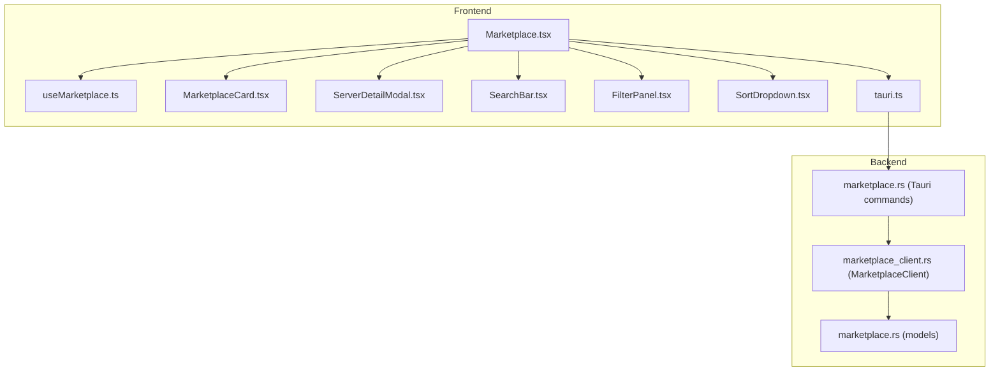
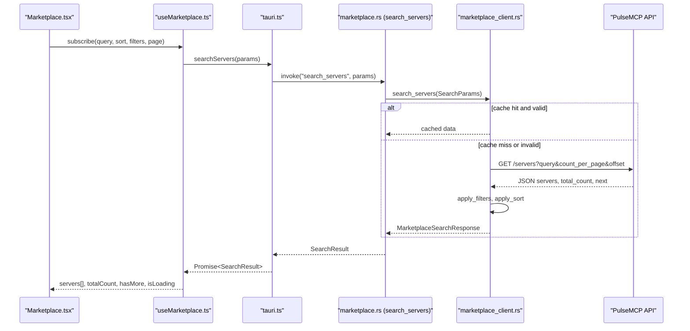
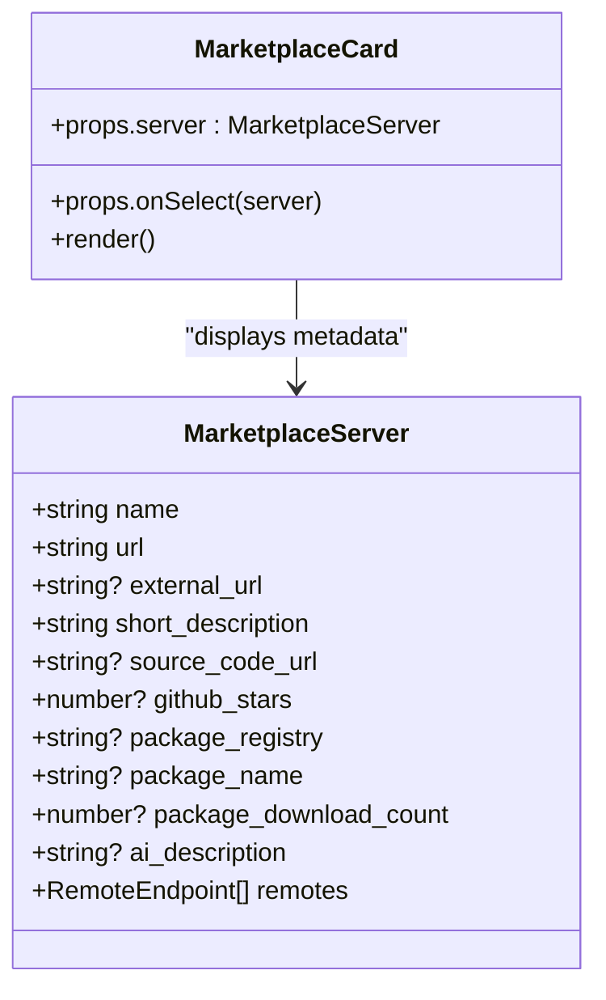
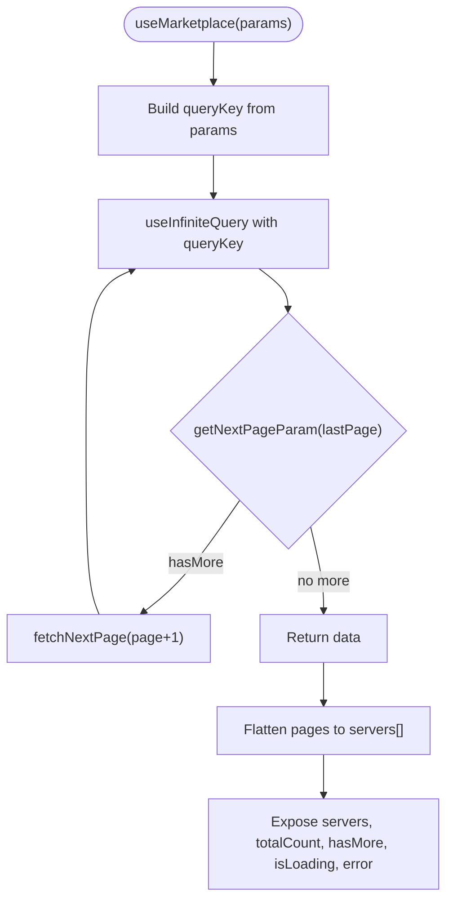
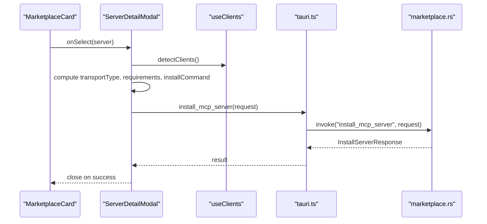
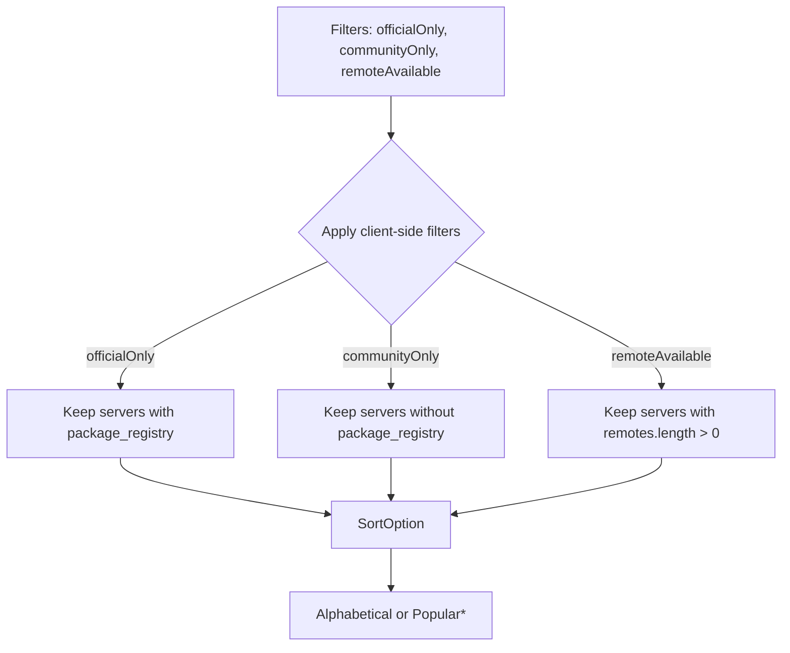
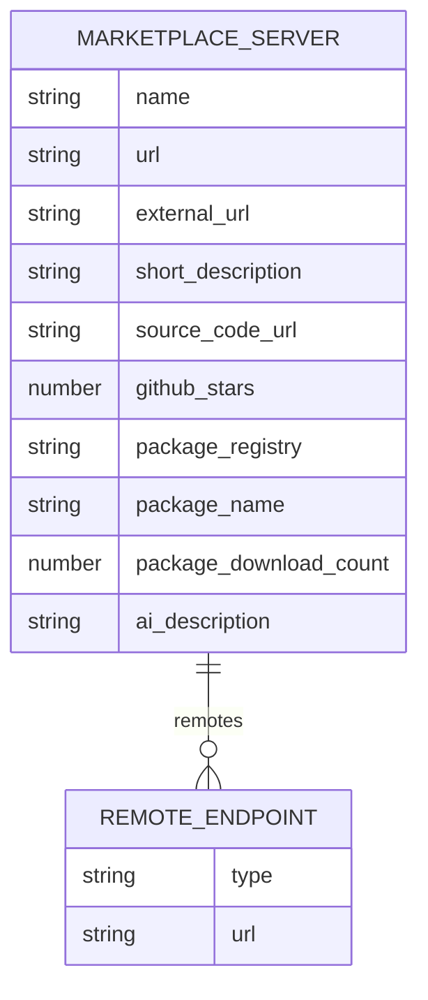
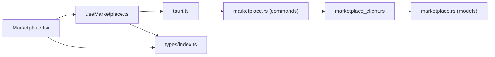

# Marketplace Browsing

<cite>
**Referenced Files in This Document**
- [Marketplace.tsx](file://src/pages/Marketplace.tsx)
- [useMarketplace.ts](file://src/hooks/useMarketplace.ts)
- [MarketplaceCard.tsx](file://src/components/marketplace/MarketplaceCard.tsx)
- [ServerDetailModal.tsx](file://src/components/marketplace/ServerDetailModal.tsx)
- [FilterPanel.tsx](file://src/components/marketplace/FilterPanel.tsx)
- [SearchBar.tsx](file://src/components/marketplace/SearchBar.tsx)
- [SortDropdown.tsx](file://src/components/marketplace/SortDropdown.tsx)
- [tauri.ts](file://src/lib/tauri.ts)
- [marketplace.rs](file://src-tauri/src/commands/marketplace.rs)
- [marketplace_client.rs](file://src-tauri/src/services/marketplace_client.rs)
- [marketplace.rs](file://src-tauri/src/models/marketplace.rs)
- [index.ts](file://src/types/index.ts)
</cite>

## Table of Contents

1. [Introduction](#introduction)
2. [Project Structure](#project-structure)
3. [Core Components](#core-components)
4. [Architecture Overview](#architecture-overview)
5. [Detailed Component Analysis](#detailed-component-analysis)
6. [Dependency Analysis](#dependency-analysis)
7. [Performance Considerations](#performance-considerations)
8. [Troubleshooting Guide](#troubleshooting-guide)
9. [Conclusion](#conclusion)

## Introduction

This document explains the marketplace browsing experience in MCP Nexus. It covers how server listings are rendered in the MarketplaceCard component, how the useMarketplace hook integrates with the Rust-based MarketplaceClient service to fetch and cache server manifests from the PulseMCP API, and how the ServerDetailModal provides in-depth information including usage examples, prerequisites, and environment requirements. It also documents server manifest structure, categorization logic, UI/UX considerations for loading and error states, and guidance for optimizing performance through pagination and lazy loading.

## Project Structure

The marketplace browsing experience spans React components, a custom React Query hook, and a Rust backend service. The frontend communicates with the backend via Tauri commands, which delegate to a Rust client that caches and paginates results from PulseMCP.

**Diagram sources**

- [Marketplace.tsx](file://src/pages/Marketplace.tsx#L1-L290)
- [useMarketplace.ts](file://src/hooks/useMarketplace.ts#L1-L81)
- [MarketplaceCard.tsx](file://src/components/marketplace/MarketplaceCard.tsx#L1-L136)
- [ServerDetailModal.tsx](file://src/components/marketplace/ServerDetailModal.tsx#L1-L591)
- [SearchBar.tsx](file://src/components/marketplace/SearchBar.tsx#L1-L81)
- [FilterPanel.tsx](file://src/components/marketplace/FilterPanel.tsx#L1-L155)
- [SortDropdown.tsx](file://src/components/marketplace/SortDropdown.tsx#L1-L101)
- [tauri.ts](file://src/lib/tauri.ts#L196-L223)
- [marketplace.rs](file://src-tauri/src/commands/marketplace.rs#L1-L236)
- [marketplace_client.rs](file://src-tauri/src/services/marketplace_client.rs#L1-L279)
- [marketplace.rs](file://src-tauri/src/models/marketplace.rs#L1-L207)

**Section sources**

- [Marketplace.tsx](file://src/pages/Marketplace.tsx#L1-L290)
- [useMarketplace.ts](file://src/hooks/useMarketplace.ts#L1-L81)
- [tauri.ts](file://src/lib/tauri.ts#L196-L223)
- [marketplace.rs](file://src-tauri/src/commands/marketplace.rs#L127-L178)
- [marketplace_client.rs](file://src-tauri/src/services/marketplace_client.rs#L74-L200)
- [marketplace.rs](file://src-tauri/src/models/marketplace.rs#L1-L123)

## Core Components

- Marketplace page orchestrates search, filters, sorting, pagination, and the detail modal.
- useMarketplace hook manages infinite scrolling and caching via React Query.
- MarketplaceCard renders server cards with metadata and badges.
- ServerDetailModal shows detailed information, prerequisites, and installation controls.
- FilterPanel, SearchBar, and SortDropdown provide user controls.
- Frontend types mirror backend models for type safety.

**Section sources**

- [Marketplace.tsx](file://src/pages/Marketplace.tsx#L1-L290)
- [useMarketplace.ts](file://src/hooks/useMarketplace.ts#L1-L81)
- [MarketplaceCard.tsx](file://src/components/marketplace/MarketplaceCard.tsx#L1-L136)
- [ServerDetailModal.tsx](file://src/components/marketplace/ServerDetailModal.tsx#L1-L591)
- [FilterPanel.tsx](file://src/components/marketplace/FilterPanel.tsx#L1-L155)
- [SearchBar.tsx](file://src/components/marketplace/SearchBar.tsx#L1-L81)
- [SortDropdown.tsx](file://src/components/marketplace/SortDropdown.tsx#L1-L101)
- [index.ts](file://src/types/index.ts#L170-L244)

## Architecture Overview

The marketplace browsing pipeline:

- Frontend UI emits search/filter/sort/page events.
- useMarketplace composes a React Query infinite query with a page param and a cache key derived from query parameters.
- searchServers invokes a Tauri command that converts frontend params to backend SearchParams and calls MarketplaceClient.search_servers.
- MarketplaceClient caches responses keyed by query, page size, and offset; applies client-side filters and sorts; and forwards results to the frontend.
- The UI renders cards and detail modal based on the flattened list of servers.

**Diagram sources**

- [useMarketplace.ts](file://src/hooks/useMarketplace.ts#L1-L72)
- [tauri.ts](file://src/lib/tauri.ts#L196-L203)
- [marketplace.rs](file://src-tauri/src/commands/marketplace.rs#L127-L178)
- [marketplace_client.rs](file://src-tauri/src/services/marketplace_client.rs#L74-L200)
- [marketplace.rs](file://src-tauri/src/models/marketplace.rs#L1-L123)

## Detailed Component Analysis

### MarketplaceCard: Rendering Server Metadata

- Renders name, short description, and stats (GitHub stars, package download count, package name).
- Shows badges for remote availability and package registry type.
- Uses a compact layout with truncation and skeleton loaders for loading states.

**Diagram sources**

- [MarketplaceCard.tsx](file://src/components/marketplace/MarketplaceCard.tsx#L1-L136)
- [index.ts](file://src/types/index.ts#L178-L202)

**Section sources**

- [MarketplaceCard.tsx](file://src/components/marketplace/MarketplaceCard.tsx#L1-L136)
- [index.ts](file://src/types/index.ts#L178-L202)

### useMarketplace: Infinite Scroll and Caching

- Uses React Query’s useInfiniteQuery to paginate results.
- Builds a cache key from query, sort, and filters; sets a 5-minute staleTime aligned with backend cache TTL.
- Flattens pages into a single servers array for rendering.
- Exposes loadMore, refresh, and error states.

**Diagram sources**

- [useMarketplace.ts](file://src/hooks/useMarketplace.ts#L1-L72)

**Section sources**

- [useMarketplace.ts](file://src/hooks/useMarketplace.ts#L1-L72)

### ServerDetailModal: In-Depth Information and Installation

- Displays description, stats, links, and runtime requirements inferred from package registry.
- Provides transport mode selection (stdio vs SSE) and SSE URL input when applicable.
- Allows selecting target clients and installs via Tauri commands.
- Shows install command preview for local registries.

**Diagram sources**

- [ServerDetailModal.tsx](file://src/components/marketplace/ServerDetailModal.tsx#L1-L591)
- [tauri.ts](file://src/lib/tauri.ts#L224-L261)
- [marketplace.rs](file://src-tauri/src/commands/marketplace.rs#L127-L178)

**Section sources**

- [ServerDetailModal.tsx](file://src/components/marketplace/ServerDetailModal.tsx#L1-L591)
- [tauri.ts](file://src/lib/tauri.ts#L224-L261)

### Filtering and Categorization Logic

- Official vs Community: mutually exclusive filters; official servers are those with a package registry present.
- Remote Available: servers with at least one remote endpoint.
- Sorting: alphabetical and popularity proxies (GitHub stars) are applied client-side by the Rust service.

**Diagram sources**

- [FilterPanel.tsx](file://src/components/marketplace/FilterPanel.tsx#L1-L155)
- [marketplace_client.rs](file://src-tauri/src/services/marketplace_client.rs#L202-L241)
- [marketplace.rs](file://src-tauri/src/models/marketplace.rs#L64-L83)

**Section sources**

- [FilterPanel.tsx](file://src/components/marketplace/FilterPanel.tsx#L1-L155)
- [marketplace_client.rs](file://src-tauri/src/services/marketplace_client.rs#L202-L241)
- [marketplace.rs](file://src-tauri/src/models/marketplace.rs#L64-L83)

### Server Manifest Structure

The server manifest returned by PulseMCP is modeled as follows:

- Fields include name, url, external_url, short_description, source_code_url, github_stars, package_registry, package_name, package_download_count, ai_description, and remotes.
- Remotes include type and url for SSE endpoints.

**Diagram sources**

- [marketplace.rs](file://src-tauri/src/models/marketplace.rs#L1-L63)
- [index.ts](file://src/types/index.ts#L170-L202)

**Section sources**

- [marketplace.rs](file://src-tauri/src/models/marketplace.rs#L1-L63)
- [index.ts](file://src/types/index.ts#L178-L202)

### UI/UX Considerations

- Loading states:
  - Initial skeleton grid while isLoading is true.
  - Additional skeleton rows while loading more.
  - Empty state with clear filters action.
- Error handling:
  - Error banner with Try again action that triggers refresh.
  - Backend error mapping to user-friendly messages.
- Visual indicators:
  - Remote badge for servers with remotes.
  - Registry badge color-coded by registry.
  - Verified publisher indicator is represented by presence of package_registry in the manifest and filter logic.

**Section sources**

- [Marketplace.tsx](file://src/pages/Marketplace.tsx#L156-L237)
- [MarketplaceCard.tsx](file://src/components/marketplace/MarketplaceCard.tsx#L1-L136)
- [FilterPanel.tsx](file://src/components/marketplace/FilterPanel.tsx#L1-L155)
- [marketplace.rs](file://src-tauri/src/commands/marketplace.rs#L14-L56)

## Dependency Analysis

- Frontend depends on:
  - useMarketplace for data fetching and caching.
  - tauri.ts for invoking Tauri commands.
  - index.ts types for type-safe props and results.
- Backend depends on:
  - marketplace.rs (commands) for Tauri command handlers.
  - marketplace_client.rs for HTTP requests, caching, and client-side filtering/sorting.
  - marketplace.rs (models) for typed request/response structures.

**Diagram sources**

- [Marketplace.tsx](file://src/pages/Marketplace.tsx#L1-L290)
- [useMarketplace.ts](file://src/hooks/useMarketplace.ts#L1-L72)
- [tauri.ts](file://src/lib/tauri.ts#L196-L223)
- [marketplace.rs](file://src-tauri/src/commands/marketplace.rs#L127-L178)
- [marketplace_client.rs](file://src-tauri/src/services/marketplace_client.rs#L74-L200)
- [marketplace.rs](file://src-tauri/src/models/marketplace.rs#L1-L123)
- [index.ts](file://src/types/index.ts#L170-L244)

**Section sources**

- [useMarketplace.ts](file://src/hooks/useMarketplace.ts#L1-L72)
- [tauri.ts](file://src/lib/tauri.ts#L196-L223)
- [marketplace.rs](file://src-tauri/src/commands/marketplace.rs#L127-L178)
- [marketplace_client.rs](file://src-tauri/src/services/marketplace_client.rs#L74-L200)
- [marketplace.rs](file://src-tauri/src/models/marketplace.rs#L1-L123)
- [index.ts](file://src/types/index.ts#L170-L244)

## Performance Considerations

- Pagination and caching:
  - Backend cache TTL aligns with React Query staleTime (5 minutes), reducing redundant network calls.
  - Page size capped at 5000 by the backend; UI defaults to 42 per page.
  - Infinite scroll uses page-based offsets; hasMore computed from total_count and page.
- Lazy loading:
  - ServerDetailModal content is reset via key when a new server is selected, enabling clean re-initialization of client detection and inputs.
- Debounced search:
  - SearchBar debounces input to minimize frequent queries.
- Skeleton loaders:
  - MarketplaceCardSkeleton provides perceived performance during initial and incremental loads.

**Section sources**

- [marketplace_client.rs](file://src-tauri/src/services/marketplace_client.rs#L14-L22)
- [useMarketplace.ts](file://src/hooks/useMarketplace.ts#L46-L47)
- [marketplace.rs](file://src-tauri/src/commands/marketplace.rs#L136-L153)
- [SearchBar.tsx](file://src/components/marketplace/SearchBar.tsx#L1-L81)
- [ServerDetailModal.tsx](file://src/components/marketplace/ServerDetailModal.tsx#L571-L591)
- [MarketplaceCard.tsx](file://src/components/marketplace/MarketplaceCard.tsx#L110-L136)

## Troubleshooting Guide

- Rate limiting:
  - Backend returns rate limit errors with retry-after hints; UI surfaces a friendly message and allows manual refresh.
- Network failures:
  - Network errors are mapped to user-facing messages; UI shows an error banner with a Try again action.
- Stale cache:
  - Manual refresh clears backend cache and invalidates React Query cache.
- Client detection:
  - ServerDetailModal disables install until clients are detected; users can select/deselect clients and transport mode accordingly.

**Section sources**

- [marketplace.rs](file://src-tauri/src/commands/marketplace.rs#L14-L56)
- [marketplace_client.rs](file://src-tauri/src/services/marketplace_client.rs#L123-L166)
- [useMarketplace.ts](file://src/hooks/useMarketplace.ts#L56-L59)
- [ServerDetailModal.tsx](file://src/components/marketplace/ServerDetailModal.tsx#L430-L505)

## Conclusion

The marketplace browsing experience in MCP Nexus combines a responsive React UI with a robust Rust-backed caching and pagination layer. useMarketplace coordinates infinite scrolling and caching, while MarketplaceCard and ServerDetailModal deliver a clear, informative, and actionable browsing experience. Filtering and sorting are handled client-side for responsiveness, and the system gracefully handles loading, error, and stale states. Future enhancements could include explicit “verified publisher” badges and server detail lazy-loading to further optimize performance.
