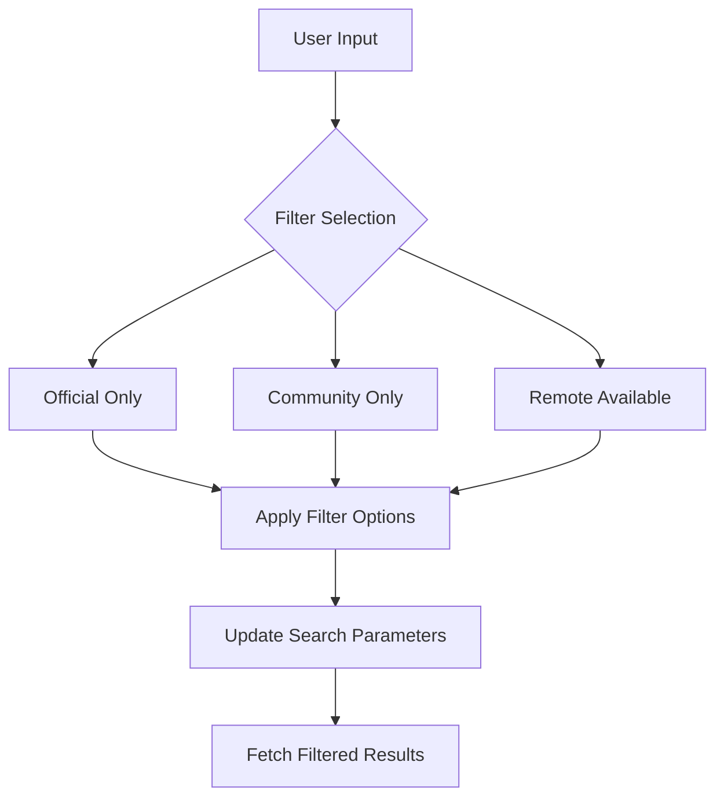
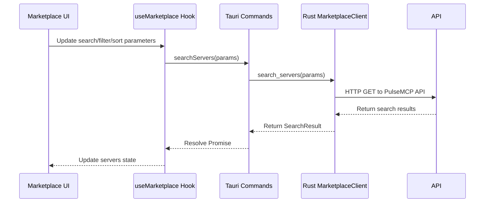
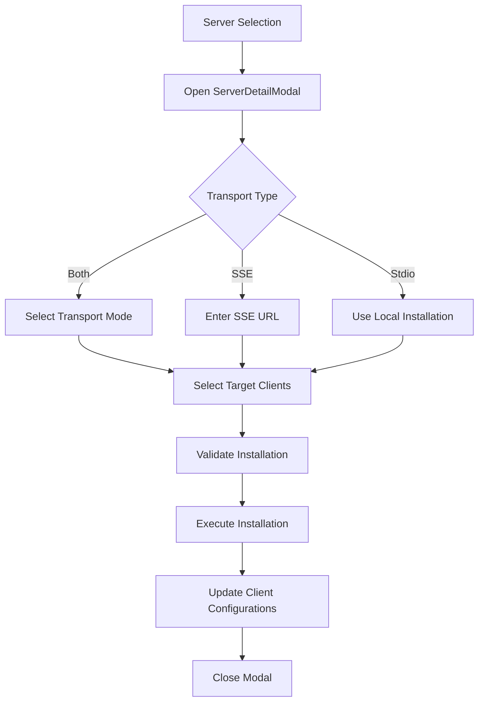
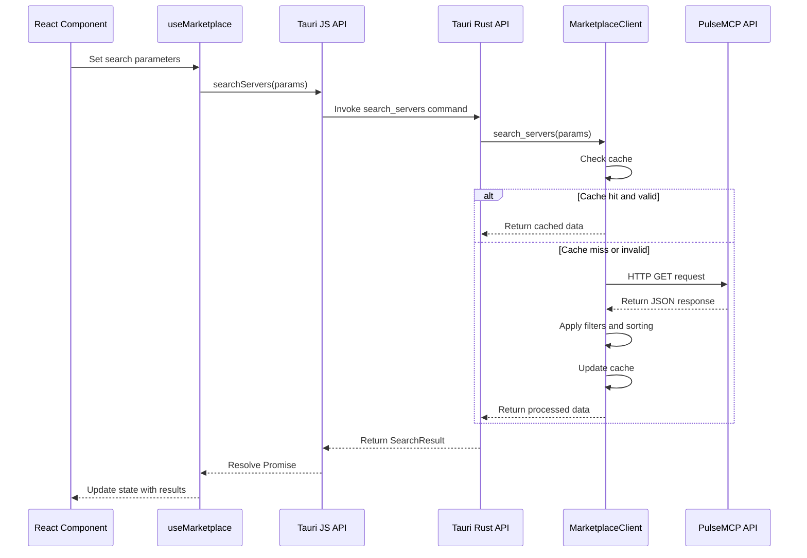
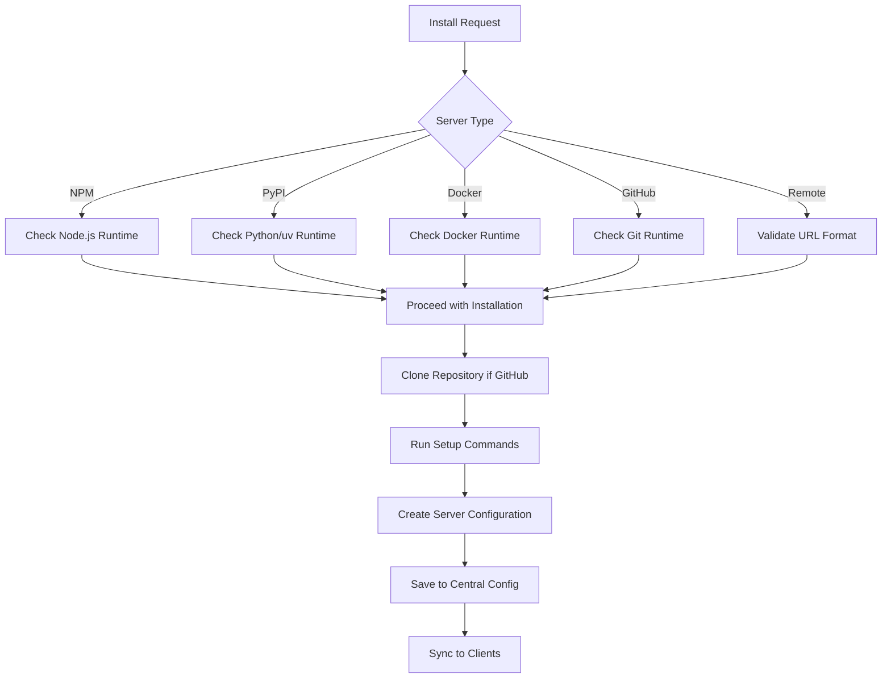
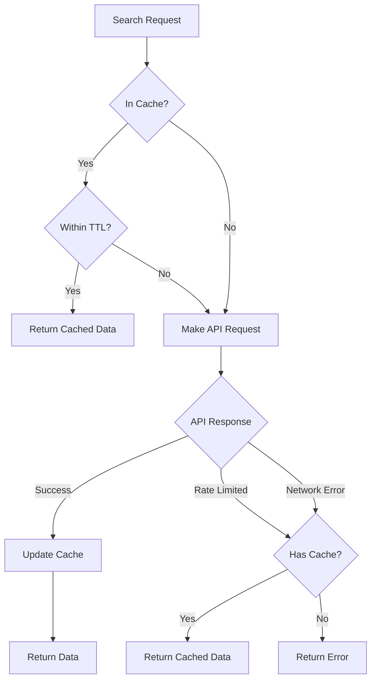

# Marketplace Integration

<cite>
**Referenced Files in This Document**   
- [useMarketplace.ts](file://src/hooks/useMarketplace.ts)
- [Marketplace.tsx](file://src/pages/Marketplace.tsx)
- [ServerDetailModal.tsx](file://src/components/marketplace/ServerDetailModal.tsx)
- [FilterPanel.tsx](file://src/components/marketplace/FilterPanel.tsx)
- [SortDropdown.tsx](file://src/components/marketplace/SortDropdown.tsx)
- [SearchBar.tsx](file://src/components/marketplace/SearchBar.tsx)
- [tauri.ts](file://src/lib/tauri.ts)
- [marketplace_client.rs](file://src-tauri/src/services/marketplace_client.rs)
- [marketplace.rs](file://src-tauri/src/models/marketplace.rs)
- [commands/marketplace.rs](file://src-tauri/src/commands/marketplace.rs)
- [installation.rs](file://src-tauri/src/services/installation.rs)
- [commands/installation.rs](file://src-tauri/src/commands/installation.rs)
- [index.ts](file://src/types/index.ts)
</cite>

## Table of Contents

1. [Introduction](#introduction)
2. [Search, Filtering, and Sorting Implementation](#search-filtering-and-sorting-implementation)
3. [ServerDetailModal Component](#serverdetailmodal-component)
4. [Data Flow from Frontend to Rust](#data-flow-from-frontend-to-rust)
5. [Secure Download and Verification Process](#secure-download-and-verification-process)
6. [Marketplace Server Manifests and Categorization](#marketplace-server-manifests-and-categorization)
7. [Rate Limiting and Caching Strategies](#rate-limiting-and-caching-strategies)
8. [Troubleshooting Network Issues](#troubleshooting-network-issues)
9. [Conclusion](#conclusion)

## Introduction

The PulseMCP marketplace integration enables users to discover, browse, and install MCP servers through a comprehensive UI system. This documentation details the implementation of search, filtering, and sorting capabilities in the Marketplace UI components, how they consume data from the MarketplaceClient service, and the secure download and verification process for servers from the marketplace API. The integration spans from the React frontend through Tauri commands to the Rust-based marketplace client, providing a seamless experience for users to explore and install MCP servers.

**Section sources**

- [Marketplace.tsx](file://src/pages/Marketplace.tsx#L1-L290)
- [useMarketplace.ts](file://src/hooks/useMarketplace.ts#L1-L81)

## Search, Filtering, and Sorting Implementation

The marketplace UI implements a comprehensive search, filtering, and sorting system that allows users to discover MCP servers efficiently. The implementation consists of several interconnected components that work together to provide a responsive and intuitive user experience.

### SearchBar Component

The SearchBar component provides a text input field that allows users to search for servers by name or description. As the user types, the search query is immediately reflected in the results, providing real-time feedback. The component is implemented as a controlled input that updates the parent component's state.

### FilterPanel and FilterChips Components

The filtering system is implemented through two components: FilterPanel and FilterChips. FilterPanel provides checkboxes for filtering servers by official/community status and remote availability, while FilterChips offers a compact, button-based interface for the same filters, optimized for mobile or narrow layouts. The filters are mutually exclusive where appropriate (e.g., official vs. community) to prevent contradictory selections.



**Diagram sources**

- [FilterPanel.tsx](file://src/components/marketplace/FilterPanel.tsx#L1-L155)

### SortDropdown Component

The SortDropdown component allows users to sort search results by various criteria including recommended, popularity (by week, month, or all time), recent updates, recent releases, and alphabetical order. The component implements a custom dropdown menu with keyboard navigation support and click-outside dismissal.

### Integration with useMarketplace Hook

The search, filtering, and sorting parameters are consolidated in the useMarketplace hook, which manages the state and data fetching for the marketplace. The hook uses React Query's useInfiniteQuery to implement infinite scrolling, fetching additional pages of results as the user scrolls through the list.



**Diagram sources**

- [useMarketplace.ts](file://src/hooks/useMarketplace.ts#L1-L81)
- [tauri.ts](file://src/lib/tauri.ts#L198-L203)
- [commands/marketplace.rs](file://src-tauri/src/commands/marketplace.rs#L127-L153)
- [marketplace_client.rs](file://src-tauri/src/services/marketplace_client.rs#L75-L200)

**Section sources**

- [SortDropdown.tsx](file://src/components/marketplace/SortDropdown.tsx#L1-L101)
- [FilterPanel.tsx](file://src/components/marketplace/FilterPanel.tsx#L1-L155)
- [SearchBar.tsx](file://src/components/marketplace/SearchBar.tsx)
- [useMarketplace.ts](file://src/hooks/useMarketplace.ts#L1-L81)

## ServerDetailModal Component

The ServerDetailModal component provides comprehensive information about a selected MCP server, including usage examples and installation prerequisites. When a user clicks on a server in the marketplace list, this modal displays detailed information to help them understand the server's capabilities and requirements.

### Key Features

- **Server Information**: Displays the server's name, description, package information, and links to source code and external websites
- **Statistics**: Shows GitHub stars and package download counts, formatted with K/M suffixes for large numbers
- **Requirements**: Lists runtime requirements based on the package registry (Node.js for npm, Python for PyPI, Docker for containerized servers)
- **Installation Options**: Provides the appropriate install command based on the package registry
- **Transport Configuration**: Allows users to select between stdio and SSE transport modes for servers that support both
- **Client Selection**: Enables users to select which AI clients to install the server to

### Transport Mode Selection

For servers that support both stdio and SSE transport modes, the modal provides a radio button selection to choose the preferred connection type. The stdio mode runs the server locally on the user's machine, while the SSE mode connects to a remote server endpoint.

### Installation Process

The installation process is initiated when the user clicks the "Install" button. The modal validates that at least one client is selected and, for SSE connections, that a valid URL is provided. During installation, the button displays a loading spinner to indicate the ongoing process.



**Diagram sources**

- [ServerDetailModal.tsx](file://src/components/marketplace/ServerDetailModal.tsx#L1-L591)

**Section sources**

- [ServerDetailModal.tsx](file://src/components/marketplace/ServerDetailModal.tsx#L1-L591)

## Data Flow from Frontend to Rust

The data flow from the frontend useMarketplace hook through Tauri commands to the Rust-based marketplace client follows a well-defined pattern that ensures type safety and efficient communication between the frontend and backend.

### Frontend Hook Implementation

The useMarketplace hook in the frontend uses React Query to manage the state of marketplace data. It takes search parameters (query, sort, filters) and returns a structured object containing servers, totalCount, loading states, and utility functions like refresh and loadMore.

### Tauri Command Bridge

The tauri.ts file serves as the bridge between the frontend and backend, exporting functions that invoke Tauri commands. The searchServers function in this file calls the search_servers command implemented in Rust.

### Rust Command Implementation

The search_servers command in commands/marketplace.rs converts the frontend SearchServersParams into the internal SearchParams structure and calls the MarketplaceClient to perform the actual search.

### Marketplace Client

The MarketplaceClient in services/marketplace_client.rs is responsible for making HTTP requests to the PulseMCP API, caching responses, and applying client-side filtering and sorting when necessary.



**Diagram sources**

- [useMarketplace.ts](file://src/hooks/useMarketplace.ts#L1-L81)
- [tauri.ts](file://src/lib/tauri.ts#L198-L203)
- [commands/marketplace.rs](file://src-tauri/src/commands/marketplace.rs#L127-L153)
- [marketplace_client.rs](file://src-tauri/src/services/marketplace_client.rs#L75-L200)

**Section sources**

- [useMarketplace.ts](file://src/hooks/useMarketplace.ts#L1-L81)
- [tauri.ts](file://src/lib/tauri.ts#L198-L203)
- [commands/marketplace.rs](file://src-tauri/src/commands/marketplace.rs#L127-L153)
- [marketplace_client.rs](file://src-tauri/src/services/marketplace_client.rs#L75-L200)

## Secure Download and Verification Process

The secure download and verification process for servers from the marketplace API includes integrity checks and metadata validation to ensure the safety and authenticity of installed servers.

### Integrity Checks

When installing a server, the system performs several integrity checks:

- **URL Validation**: For remote servers, the URL must start with http:// or https:// to prevent malicious local file access
- **Runtime Validation**: Before installation, the system checks that required runtimes are available on the user's system
- **Path Validation**: For local installations, the system verifies that the specified path exists

### Metadata Validation

The system validates server metadata from the marketplace API, including:

- **Package Registry**: Ensures the package registry is one of the supported types (npm, PyPI, Docker)
- **Server Identity**: Each server has a unique ID generated with UUID v4
- **Timestamps**: Installation and update timestamps are recorded in RFC 3339 format

### Installation Verification

The validate_install command can be used to verify that a server can be installed without actually performing the installation. This checks runtime availability and other prerequisites.



**Diagram sources**

- [installation.rs](file://src-tauri/src/services/installation.rs#L125-L183)
- [commands/installation.rs](file://src-tauri/src/commands/installation.rs#L198-L226)

**Section sources**

- [installation.rs](file://src-tauri/src/services/installation.rs#L125-L183)
- [commands/installation.rs](file://src-tauri/src/commands/installation.rs#L198-L226)

## Marketplace Server Manifests and Categorization

The marketplace uses a structured manifest format for servers and implements categorization through filtering options.

### Server Manifest Structure

The MarketplaceServer structure includes the following fields:

- **name**: Server display name
- **url**: PulseMCP directory URL for the server
- **short_description**: Brief description of the server
- **source_code_url**: Source code repository URL
- **github_stars**: GitHub star count
- **package_registry**: Package registry (npm, pypi, etc.)
- **package_name**: Package name in the registry
- **package_download_count**: Download count from the package registry
- **ai_description**: AI-generated description (experimental)
- **remotes**: Remote endpoints for SSE-based servers

### Categorization Schemes

Servers are categorized through the following filtering options:

- **Official vs. Community**: Servers are categorized as official (verified by MCP maintainers) or community-created
- **Remote Availability**: Servers are filtered by whether they support SSE/remote connection
- **Package Registry**: Servers are implicitly categorized by their package registry (npm, PyPI, Docker)

### Example Manifest

```json
{
  "name": "Filesystem",
  "url": "https://www.pulsemcp.com/servers/filesystem",
  "short_description": "Access and manage local filesystem",
  "source_code_url": "https://github.com/modelcontextprotocol/servers",
  "github_stars": 1500,
  "package_registry": "npm",
  "package_name": "@modelcontextprotocol/server-filesystem",
  "package_download_count": 50000,
  "remotes": []
}
```

**Section sources**

- [marketplace.rs](file://src-tauri/src/models/marketplace.rs#L17-L51)
- [index.ts](file://src/types/index.ts#L179-L202)

## Rate Limiting and Caching Strategies

The marketplace implementation includes robust rate limiting and caching strategies to ensure reliability and performance.

### Rate Limiting Handling

The system handles API rate limits through several mechanisms:

- **Retry-After Header**: When a 429 Too Many Requests response is received, the system checks the Retry-After header to determine when to retry
- **Cached Data Fallback**: When rate-limited, the system returns cached data if available, even if stale, to maintain functionality in offline or rate-limited scenarios
- **Client-Side Throttling**: The useMarketplace hook uses React Query's caching to prevent excessive requests

### Caching Implementation

The caching strategy includes:

- **In-Memory Cache**: The MarketplaceClient maintains an in-memory cache of search results using a HashMap
- **Cache Key Generation**: Cache keys are generated from search parameters including query, page size, and offset
- **TTL-Based Expiration**: Cached responses are valid for 5 minutes (300 seconds) before being considered stale
- **Manual Cache Clearing**: Users can manually clear the cache through the refresh button, which calls clear_marketplace_cache

### Offline Browsing

The caching system enables offline browsing capabilities:

- When offline or when the API is unreachable, the system returns cached data if available
- The cache is updated only when fresh data is successfully retrieved from the API
- Users are notified when they are viewing cached data



**Diagram sources**

- [marketplace_client.rs](file://src-tauri/src/services/marketplace_client.rs#L81-L178)
- [commands/marketplace.rs](file://src-tauri/src/commands/marketplace.rs#L179-L189)

**Section sources**

- [marketplace_client.rs](file://src-tauri/src/services/marketplace_client.rs#L81-L178)
- [commands/marketplace.rs](file://src-tauri/src/commands/marketplace.rs#L179-L189)

## Troubleshooting Network Issues

The system includes several features to help users troubleshoot network issues and handle API rate limits.

### Error Handling

The marketplace client handles various error types:

- **NetworkError**: When the API is unreachable
- **RateLimitExceeded**: When API rate limits are exceeded
- **InvalidRequest**: When request parameters are invalid
- **ApiError**: When the API returns an error status
- **ParseError**: When response parsing fails

### User-Facing Error States

The Marketplace component displays user-friendly error messages:

- When loading fails, an error banner is displayed with the error message and a "Try again" button
- The refresh button is disabled while a refresh is in progress, with a spinner animation
- Empty states are handled with appropriate messaging based on the current filters

### Rate Limit Management

When rate-limited:

- The system returns cached data if available, allowing continued browsing
- The retry-after value is exposed to the frontend, which could be used to inform users when they can try again
- Users can manually refresh after the rate limit period expires

### Connection Resilience

The system is designed to be resilient to network issues:

- HTTP requests have a 30-second timeout
- Failed requests are retried by React Query according to its retry policy
- The cache ensures that previously viewed data remains available even when offline

**Section sources**

- [marketplace_client.rs](file://src-tauri/src/services/marketplace_client.rs#L118-L166)
- [Marketplace.tsx](file://src/pages/Marketplace.tsx#L157-L186)

## Conclusion

The PulseMCP marketplace integration provides a comprehensive system for discovering and installing MCP servers. The implementation features a robust search, filtering, and sorting system that allows users to efficiently find servers that meet their needs. The ServerDetailModal provides comprehensive information about each server, including installation prerequisites and usage examples. The data flow from the frontend through Tauri commands to the Rust-based marketplace client ensures type safety and efficient communication. Security is maintained through integrity checks and metadata validation during the download and installation process. The system handles rate limiting gracefully by returning cached data when necessary, and implements a sophisticated caching strategy that enables offline browsing. Together, these features create a reliable and user-friendly marketplace experience.
