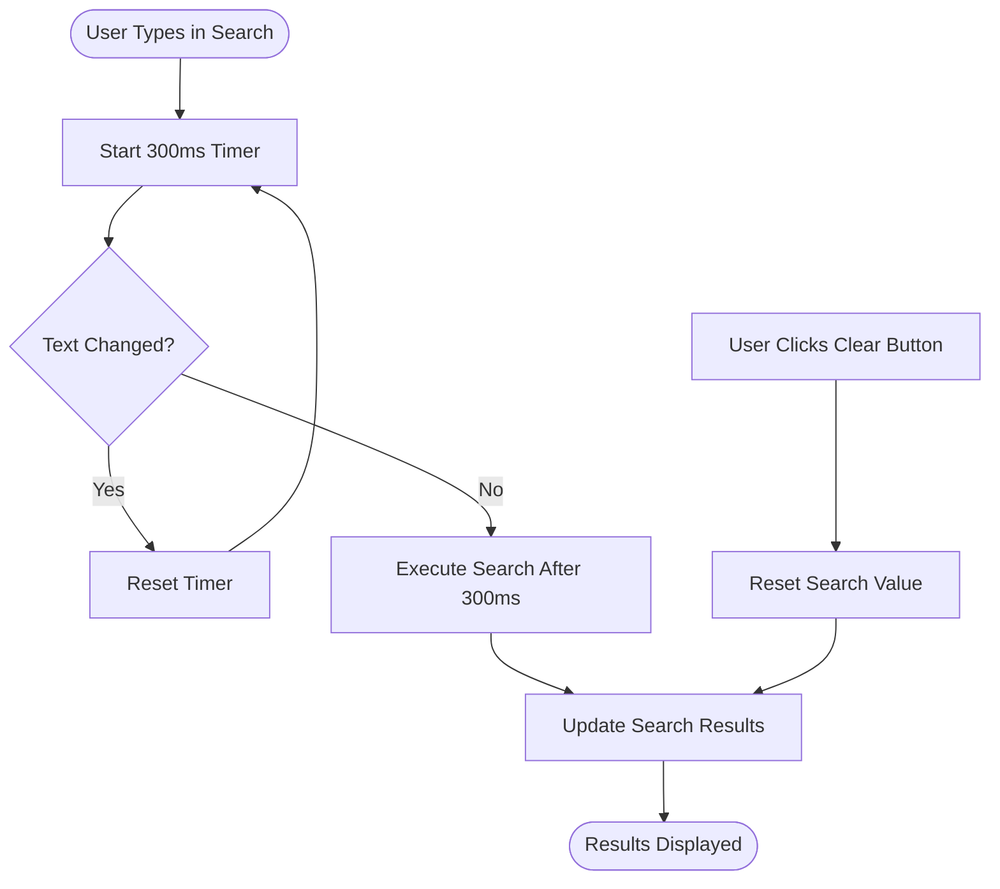
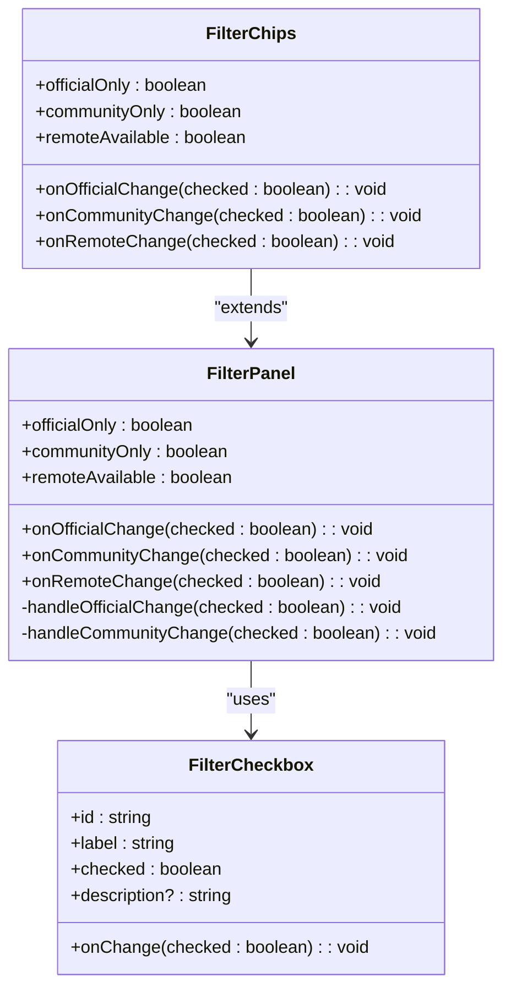
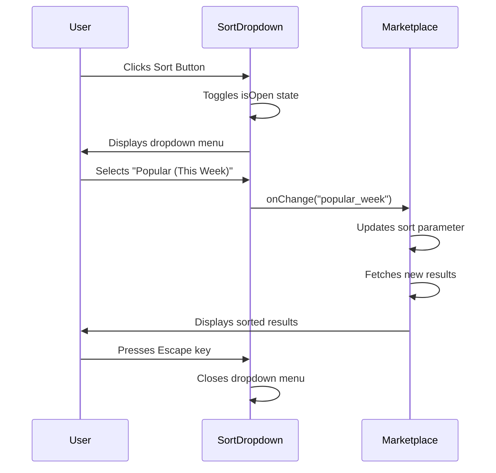
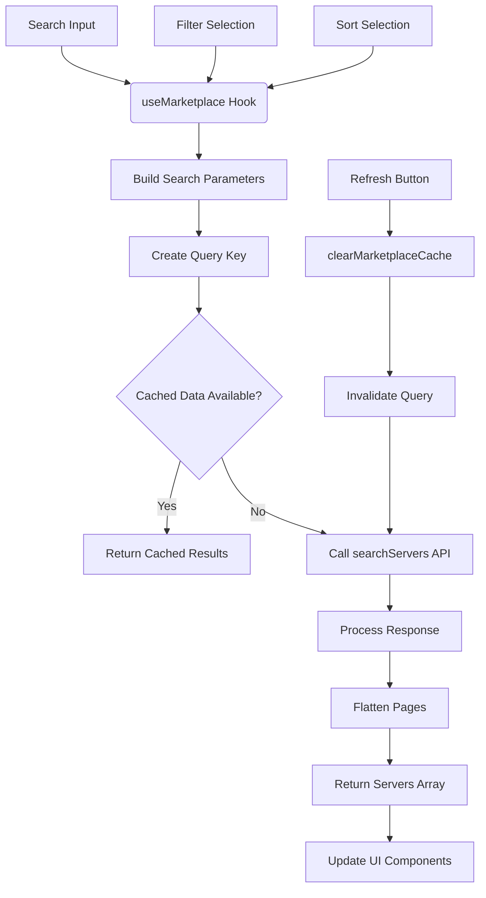
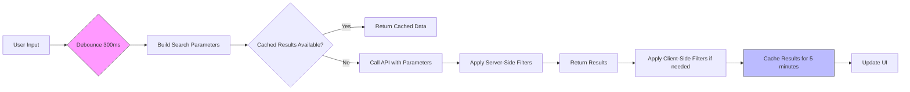

# Search, Filter, and Sort

<cite>
**Referenced Files in This Document**   
- [SearchBar.tsx](file://src/components/marketplace/SearchBar.tsx)
- [FilterPanel.tsx](file://src/components/marketplace/FilterPanel.tsx)
- [SortDropdown.tsx](file://src/components/marketplace/SortDropdown.tsx)
- [useMarketplace.ts](file://src/hooks/useMarketplace.ts)
- [Marketplace.tsx](file://src/pages/Marketplace.tsx)
- [index.ts](file://src/types/index.ts)
- [tauri.ts](file://src/lib/tauri.ts)
- [marketplace.rs](file://src-tauri/src/commands/marketplace.rs)
- [marketplace_client.rs](file://src-tauri/src/services/marketplace_client.rs)
- [marketplace.rs](file://src-tauri/src/models/marketplace.rs)
</cite>

## Table of Contents

1. [Introduction](#introduction)
2. [SearchBar Component](#searchbar-component)
3. [FilterPanel Implementation](#filterpanel-implementation)
4. [SortDropdown Functionality](#sortdropdown-functionality)
5. [useMarketplace Hook Integration](#usemarketplace-hook-integration)
6. [Client-Side Filtering and Performance](#client-side-filtering-and-performance)
7. [Accessibility Features](#accessibility-features)
8. [Troubleshooting Guide](#troubleshooting-guide)

## Introduction

The MCP Nexus marketplace provides comprehensive search, filtering, and sorting capabilities to help users discover and manage MCP servers. The system combines client-side UI components with server-side data fetching to deliver a responsive user experience. This document details the implementation of these features, focusing on the SearchBar component for full-text search, the FilterPanel for categorization-based filtering, and the SortDropdown for result ordering. The integration between these components and the useMarketplace hook enables dynamic updates to search results based on user input and preferences.

**Section sources**

- [Marketplace.tsx](file://src/pages/Marketplace.tsx#L1-L290)

## SearchBar Component

The SearchBar component implements a debounced search input field that enables full-text search against server metadata in the MCP Nexus marketplace. The component accepts several props including the current search value, an onChange callback, placeholder text, and a debounce duration (defaulting to 300ms).

The implementation uses two state variables: `value` representing the external state managed by the parent component, and `localValue` representing the internal state of the input field. This separation allows the component to maintain its own state while remaining responsive to external changes. The component includes a debounce mechanism that delays the execution of the onChange callback until the user has stopped typing for the specified duration, reducing unnecessary API calls.

The SearchBar features a clear button that appears when text is entered, allowing users to reset the search with a single click. Visual elements include a search icon on the left side of the input field and a clear icon on the right when text is present. The component is designed to be accessible, with proper ARIA labels and keyboard navigation support.

**Diagram sources**

- [SearchBar.tsx](file://src/components/marketplace/SearchBar.tsx#L1-L81)

**Section sources**

- [SearchBar.tsx](file://src/components/marketplace/SearchBar.tsx#L1-L81)

## FilterPanel Implementation

The FilterPanel component provides categorization-based filtering for the marketplace servers, allowing users to refine results by official/community status and remote availability. The component exposes three filter options: "Official" for servers verified by MCP maintainers, "Community" for community-created servers, and "Remote Available" for servers that support SSE/remote connections.

The implementation includes mutual exclusion logic between the Official and Community filters - selecting one automatically deselects the other to prevent conflicting filter states. This behavior is implemented through custom onChange handlers that check the state of the opposing filter before updating their own state.

The FilterPanel is available in two variants: a checkbox-based layout for desktop views and a chip-based layout (FilterChips) for mobile/narrow layouts. Both variants maintain the same filtering functionality but adapt to different screen sizes. The chip variant uses color-coded buttons with visual feedback to indicate active filters, providing a more compact interface for smaller screens.

**Diagram sources**

- [FilterPanel.tsx](file://src/components/marketplace/FilterPanel.tsx#L1-L155)

**Section sources**

- [FilterPanel.tsx](file://src/components/marketplace/FilterPanel.tsx#L1-L155)

## SortDropdown Functionality

The SortDropdown component enables users to order search results by various criteria including relevance, popularity, and recency. The component displays a dropdown menu with seven sorting options: Recommended, Popular (This Week), Popular (This Month), Popular (All Time), Recently Updated, Recently Released, and Alphabetical.

The implementation uses React state to manage the open/closed state of the dropdown menu. When the user clicks the dropdown button, the menu expands to show all available sorting options. The component includes accessibility features such as closing the dropdown when clicking outside or pressing the Escape key.

The selected sort option is visually highlighted in the dropdown menu, and the button displays the current selection. The component uses a simple arrow icon that rotates 180 degrees when the dropdown is open, providing visual feedback about the menu state. The sorting options are defined as a constant array of objects containing value and label properties, making it easy to add or modify sorting criteria.

**Diagram sources**

- [SortDropdown.tsx](file://src/components/marketplace/SortDropdown.tsx#L1-L101)

**Section sources**

- [SortDropdown.tsx](file://src/components/marketplace/SortDropdown.tsx#L1-L101)

## useMarketplace Hook Integration

The useMarketplace hook serves as the central integration point between the UI components and the backend data source. It uses React Query's useInfiniteQuery to manage the data fetching lifecycle, providing features like loading states, error handling, and infinite scrolling.

The hook accepts search parameters including the query string, sort option, and filter states (officialOnly, communityOnly, remoteAvailable). These parameters are combined into a queryKey that React Query uses to cache and deduplicate requests. When any of these parameters change, the hook automatically triggers a new data fetch.

The implementation converts the UI filter states into backend-compatible parameters, where boolean values are converted to undefined when false (to omit them from the API request). The hook flattens paginated results from the backend into a single array of servers, making it easier for UI components to render the data.

The hook also provides a refresh function that clears the backend cache and invalidates the query, forcing a fresh data fetch from the API. This ensures users can manually refresh the marketplace data when needed. The staleTime is set to 5 minutes to match the Rust backend cache TTL, balancing freshness with performance.

**Diagram sources**

- [useMarketplace.ts](file://src/hooks/useMarketplace.ts#L1-L81)
- [tauri.ts](file://src/lib/tauri.ts#L198-L203)

**Section sources**

- [useMarketplace.ts](file://src/hooks/useMarketplace.ts#L1-L81)
- [Marketplace.tsx](file://src/pages/Marketplace.tsx#L33-L49)

## Client-Side Filtering and Performance

The MCP Nexus marketplace implements a hybrid filtering approach that combines server-side and client-side processing to optimize performance. The primary filtering occurs on the backend through the searchServers API, which applies filters for official/community status and remote availability at the data source level.

The Rust implementation in marketplace_client.rs includes client-side filtering as a fallback mechanism. When filters are specified in the SearchParams, the apply_filters function processes the server list after retrieval from the API. This function checks each server against the filter criteria, particularly for remote availability (servers with non-empty remotes array) and official status (servers with a package registry).

The system employs several performance optimizations:

- **Debouncing**: The SearchBar component uses a 300ms debounce to prevent excessive API calls during typing
- **Caching**: The marketplace client maintains a 5-minute cache of search results to reduce network requests
- **Infinite scrolling**: Results are loaded in pages (default 20 items) to minimize initial load time
- **Query key optimization**: React Query uses a composite query key that includes all search parameters for efficient caching

The filtering logic is designed to be mutually exclusive for official and community filters, preventing contradictory filter combinations that could return empty results. The remote available filter operates independently, allowing users to combine it with either official or community filters.

**Diagram sources**

- [marketplace_client.rs](file://src-tauri/src/services/marketplace_client.rs#L202-L221)
- [marketplace.rs](file://src-tauri/src/commands/marketplace.rs#L128-L153)
- [useMarketplace.ts](file://src/hooks/useMarketplace.ts#L25-L47)

**Section sources**

- [marketplace_client.rs](file://src-tauri/src/services/marketplace_client.rs#L202-L221)
- [marketplace.rs](file://src-tauri/src/commands/marketplace.rs#L128-L153)
- [useMarketplace.ts](file://src/hooks/useMarketplace.ts#L25-L47)

## Accessibility Features

The search, filter, and sort components in MCP Nexus include several accessibility features to ensure usability for all users. The SearchBar component uses proper HTML form elements with associated labels, ensuring screen reader compatibility. The input field has a descriptive placeholder and visual indicators for the search and clear functions.

The FilterPanel uses semantic HTML with proper labeling for all interactive elements. The checkbox filters are wrapped in label elements that expand the clickable area, making them easier to interact with on touch devices. Each filter has a descriptive label and optional description text that provides additional context about the filter's purpose.

The SortDropdown component implements keyboard navigation support, allowing users to open the dropdown with Enter/Space and navigate options with arrow keys. The component also closes when the Escape key is pressed, following standard dropdown behavior. Focus management ensures that keyboard users can navigate through the sorting options sequentially.

All interactive elements have appropriate ARIA attributes and visual feedback states. The components use sufficient color contrast and provide visual indicators for active states. The chip-based FilterChips component uses color coding with text labels to ensure information is not conveyed by color alone, supporting users with color vision deficiencies.

**Section sources**

- [SearchBar.tsx](file://src/components/marketplace/SearchBar.tsx#L1-L81)
- [FilterPanel.tsx](file://src/components/marketplace/FilterPanel.tsx#L1-L155)
- [SortDropdown.tsx](file://src/components/marketplace/SortDropdown.tsx#L1-L101)

## Troubleshooting Guide

When servers do not appear in filtered results, consider the following troubleshooting steps:

1. **Check filter conflicts**: The Official and Community filters are mutually exclusive. If both are selected, the system automatically deselects one. Verify that your filter combination is valid.

2. **Verify search cache**: The marketplace caches results for 5 minutes. If you expect to see recently added servers, click the Refresh button to clear the cache and fetch fresh data.

3. **Review filter logic**: The Remote Available filter only shows servers with SSE/remote endpoints. Some servers may not support remote connections and will be excluded when this filter is active.

4. **Check network connectivity**: If no servers appear even without filters, there may be a network issue preventing access to the PulseMCP API. Check your internet connection and try refreshing.

5. **Clear all filters**: If unexpected results appear, use the "Clear all filters" link in the empty state to reset search query and all filters to their default states.

6. **Verify API availability**: The marketplace depends on the PulseMCP API. If the API is temporarily unavailable, cached results may be displayed. Check for error messages indicating API connectivity issues.

7. **Inspect console logs**: Developer tools may show API errors or warnings that provide additional context about filtering issues.

**Section sources**

- [Marketplace.tsx](file://src/pages/Marketplace.tsx#L239-L277)
- [useMarketplace.ts](file://src/hooks/useMarketplace.ts#L56-L59)
- [tauri.ts](file://src/lib/tauri.ts#L212-L215)
