# Security

<cite>
**Referenced Files in This Document**   
- [tauri.conf.json](file://src-tauri/tauri.conf.json)
- [keychain.rs](file://src-tauri/src/services/keychain.rs)
- [keychain.rs](file://src-tauri/src/commands/keychain.rs)
- [marketplace_client.rs](file://src-tauri/src/services/marketplace_client.rs)
- [updates.rs](file://src-tauri/src/services/updates.rs)
- [lib.rs](file://src-tauri/src/lib.rs)
- [CredentialManager.tsx](file://src/components/settings/CredentialManager.tsx)
- [useCredentials.ts](file://src/hooks/useCredentials.ts)
</cite>

## Table of Contents

1. [Introduction](#introduction)
2. [Secure Credential Storage](#secure-credential-storage)
3. [Application Security Configuration](#application-security-configuration)
4. [Input Validation and Sanitization](#input-validation-and-sanitization)
5. [Network Security](#network-security)
6. [File System Security](#file-system-security)
7. [Threat Modeling and Security Audits](#threat-modeling-and-security-audits)
8. [Compliance and Deployment](#compliance-and-deployment)

## Introduction

The MCP Nexus application implements a comprehensive security model designed to protect user data, ensure secure communication, and maintain system integrity. This document details the security architecture and implementation across key areas including credential management, application configuration, input validation, network communications, and file system access. The application leverages the Tauri framework to provide a secure desktop environment with strict control over system interactions while maintaining a seamless user experience for managing MCP servers.

## Secure Credential Storage

MCP Nexus implements a robust credential management system that securely stores sensitive information such as API keys and authentication tokens using the operating system's native keychain services. The application integrates with macOS Keychain, Windows Credential Manager, and other platform-specific secure storage mechanisms through the `keyring` Rust crate, ensuring that credentials are protected by the underlying operating system's security infrastructure.

The KeychainService implementation follows the principle of least privilege, storing credentials with minimal required metadata while maintaining functionality. Each credential is stored under the service identifier "com.mcp-manager.credentials" with individual access controls enforced by the operating system. The system implements a two-tier storage approach: credential values are stored exclusively in the OS keychain, while credential names (keys) are maintained in a separate JSON file with restricted file permissions.

**Diagram sources**

- [keychain.rs](file://src-tauri/src/services/keychain.rs#L1-L438)

**Section sources**

- [keychain.rs](file://src-tauri/src/services/keychain.rs#L1-L438)
- [keychain.rs](file://src-tauri/src/commands/keychain.rs#L1-L144)

## Application Security Configuration

The application security configuration is defined in the Tauri framework's `tauri.conf.json` file, which specifies critical security parameters for the desktop application. The configuration establishes the security boundary for the application's execution environment, controlling window behavior, inter-process communication, and system resource access.

The current configuration sets the application identifier to "com.joshsmbp.mcp-nexus" and defines a single application window with specified dimensions. Notably, the Content Security Policy (CSP) is currently disabled (set to null), which requires careful consideration in the deployment context. The application bundle configuration specifies multiple icon formats for different platforms, ensuring proper application identification.

The Tauri capabilities system implements a permission-based security model, where the application requests specific permissions through capability definitions. The default capability configuration in `default.json` grants core functionality and opener permissions, following the principle of least privilege by only enabling necessary system interactions. This capability-based approach ensures that the application cannot access system resources without explicit permission grants.

**Diagram sources**

- [tauri.conf.json](file://src-tauri/tauri.conf.json#L1-L36)
- [default.json](file://src-tauri/capabilities/default.json#L1-L11)

**Section sources**

- [tauri.conf.json](file://src-tauri/tauri.conf.json#L1-L36)
- [default.json](file://src-tauri/capabilities/default.json#L1-L11)
- [lib.rs](file://src-tauri/src/lib.rs#L1-L89)

## Input Validation and Sanitization

MCP Nexus implements comprehensive input validation at multiple levels to prevent injection attacks and ensure data integrity. The application employs both client-side and server-side validation mechanisms, with particular attention to credential name validation and environment variable processing.

The credential name validation system enforces strict naming conventions to prevent injection attacks and ensure compatibility across platforms. Valid credential names must be non-empty, not exceed 256 characters, and contain only alphanumeric characters, hyphens, underscores, and periods. This validation is implemented in the `validate_credential_name` function, which returns appropriate error types for different validation failures.

Environment variable values that reference keychain credentials use a specific syntax (`keychain:name` or `${keychain:name}`) that is securely parsed and validated. The `resolve_keychain_reference` function safely extracts credential names from these references and retrieves the corresponding values from the keychain, preventing injection attacks through malformed references. The system also validates that all keychain references in server configurations can be resolved before attempting synchronization.

```mermaid
flowchart TD
Start([Input Received]) --> ValidateName["Validate Credential Name"]
ValidateName --> NameValid{"Name Valid?"}
NameValid --> |No| ReturnError["Return Validation Error"]
NameValid --> |Yes| CheckLength["Check Length ≤ 256"]
CheckLength --> LengthValid{"Length Valid?"}
LengthValid --> |No| ReturnError
LengthValid --> |Yes| CheckCharacters["Check Allowed Characters"]
CheckCharacters --> CharsValid{"Characters Valid?"}
CharsValid --> |No| ReturnError
CharsValid --> |Yes| StoreSecure["Store in Keychain"]
StoreSecure --> End([Success])
ReturnError --> End
```

**Diagram sources**

- [keychain.rs](file://src-tauri/src/services/keychain.rs#L129-L154)
- [CredentialManager.tsx](file://src/components/settings/CredentialManager.tsx#L1-L347)

**Section sources**

- [keychain.rs](file://src-tauri/src/services/keychain.rs#L129-L154)
- [CredentialManager.tsx](file://src/components/settings/CredentialManager.tsx#L1-L347)
- [useCredentials.ts](file://src/hooks/useCredentials.ts#L1-L63)

## Network Security

The network security model for MCP Nexus focuses on secure communication with the PulseMCP marketplace API and other external services. The application implements a dedicated `MarketplaceClient` service that manages all external API communications with appropriate security controls.

The marketplace client establishes secure HTTPS connections to the PulseMCP API endpoint at `https://api.pulsemcp.com/v0beta` with a 30-second timeout to prevent hanging requests. The client uses a custom user agent string ("mcp-nexus/0.1.0") for identification and monitoring purposes. All API requests are made through the reqwest HTTP client, which automatically handles TLS encryption and certificate validation.

To enhance security and performance, the marketplace client implements an in-memory caching layer with a 5-minute TTL (300 seconds). This reduces the frequency of external API calls while ensuring data freshness. The cache stores search results and server details, preventing unnecessary network requests for recently accessed information. The client also handles rate limiting by returning cached data when rate limits are exceeded, maintaining functionality during high-traffic periods.

**Diagram sources**

- [marketplace_client.rs](file://src-tauri/src/services/marketplace_client.rs#L1-L415)

**Section sources**

- [marketplace_client.rs](file://src-tauri/src/services/marketplace_client.rs#L1-L415)
- [CLAUDE.md](file://CLAUDE.md#L173-L177)

## File System Security

MCP Nexus implements secure file system access patterns to protect configuration data and prevent unauthorized access to sensitive files. The application follows the principle of least privilege when accessing the file system, using restricted permissions and secure storage locations.

The credential key storage system implements strict file permission controls to protect the list of credential names. On Unix-like systems, the credential keys file is created with 0600 permissions (user read/write only), preventing other users from accessing the file. The parent directory is also created with 0700 permissions (user read/write/execute only), ensuring that the entire path is protected. The application uses an atomic write pattern with temporary files to prevent partial writes and ensure data integrity during updates.

Configuration files written to client applications are created with secure permissions (0600) to prevent unauthorized access. The sync engine implements automatic backup functionality, creating backup copies of configuration files before modifications with a `.backup` suffix. This ensures that configuration changes can be reverted in case of errors while maintaining the security of the original files.

**Diagram sources**

- [keychain.rs](file://src-tauri/src/services/keychain.rs#L94-L124)
- [CLAUDE.md](file://CLAUDE.md#L169-L170)

**Section sources**

- [keychain.rs](file://src-tauri/src/services/keychain.rs#L94-L124)
- [CLAUDE.md](file://CLAUDE.md#L169-L170)

## Threat Modeling and Security Audits

The MCP Nexus application has undergone comprehensive threat modeling and security audits to identify and mitigate potential vulnerabilities. The security analysis covers multiple attack vectors including credential theft, injection attacks, privilege escalation, and data exposure.

The threat model identifies the keychain integration as a critical security component, with potential attack vectors including unauthorized access to credential values and injection through malformed keychain references. The implementation mitigates these risks through OS-level access controls, strict input validation, and secure reference parsing. The system also prevents credential value exposure in logs or UI elements by only displaying credential names in the user interface.

Security audits have verified the implementation of secure coding practices throughout the codebase, including proper error handling, input validation, and secure memory management. The application avoids storing sensitive information in plaintext configuration files, instead using keychain references. The audit process has also confirmed the proper implementation of file permissions and secure storage patterns for both credential metadata and application configuration.

The security model includes protection against common web-based attacks such as Cross-Site Scripting (XSS) and Cross-Site Request Forgery (CSRF), although the desktop nature of the application reduces the exposure to these threats. The Tauri framework's security model prevents the execution of arbitrary JavaScript code from external sources, eliminating a major attack vector present in traditional web applications.

**Section sources**

- [CODEBASE_EVALUATION.md](file://CODEBASE_EVALUATION.md#L213-L515)
- [CLAUDE.md](file://CLAUDE.md#L153-L177)

## Compliance and Deployment

The security model of MCP Nexus supports compliance with industry standards for desktop application security and data protection. The application's use of OS-native keychain services ensures compliance with platform-specific security requirements for credential storage on macOS, Windows, and Linux.

For secure deployment, the application should be distributed through trusted channels with proper code signing to prevent tampering. The Tauri framework supports code signing for all target platforms, ensuring that the application can be verified as authentic and unmodified. Users should be advised to only install the application from official sources to prevent supply chain attacks.

The vulnerability reporting process should be clearly documented, providing users with a secure channel to report potential security issues. The development team should establish a responsible disclosure policy with appropriate timelines for addressing reported vulnerabilities. Regular security updates should be released to address newly discovered vulnerabilities and maintain the overall security posture of the application.

Deployment environments should follow the principle of least privilege, running the application with minimal required system permissions. Users should be educated about the security features of the application, particularly regarding credential management and the importance of protecting their system login credentials, which provide access to the stored secrets.

**Section sources**

- [CODEBASE_EVALUATION.md](file://CODEBASE_EVALUATION.md#L495-L515)
- [CONTRIBUTING.md](file://CONTRIBUTING.md#L58-L61)
