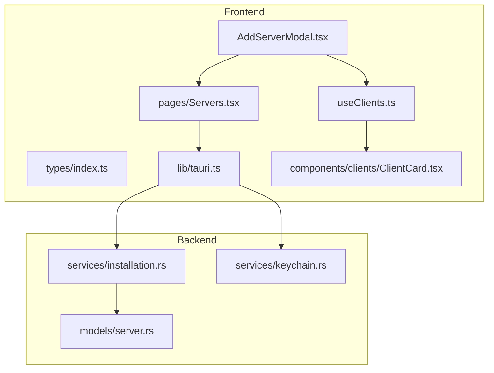
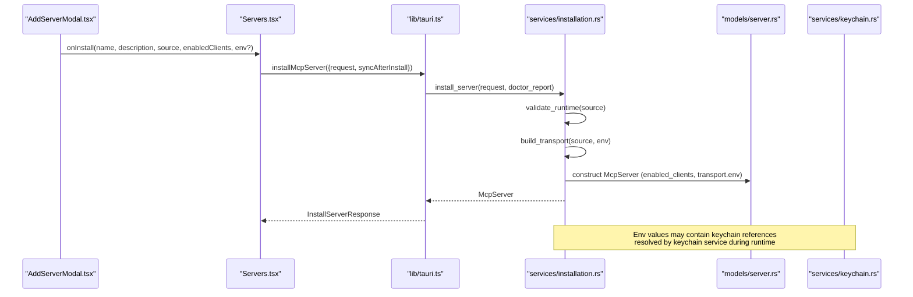
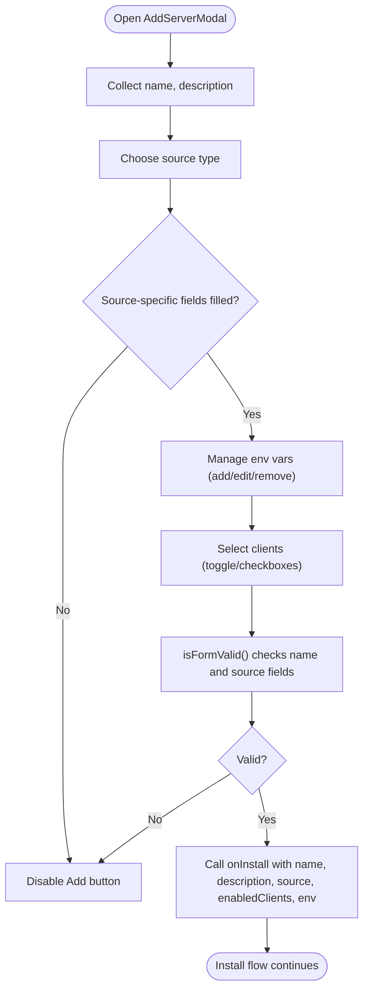
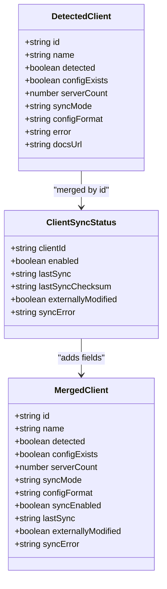
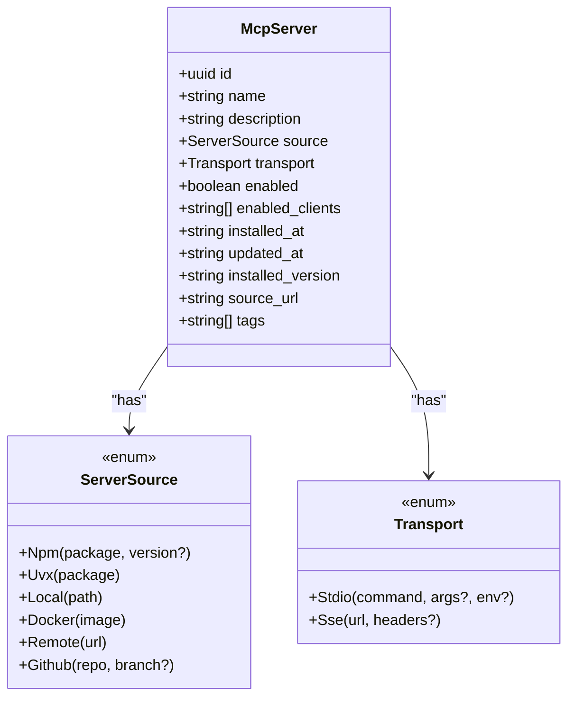
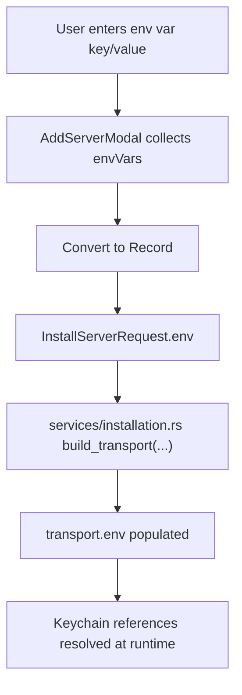
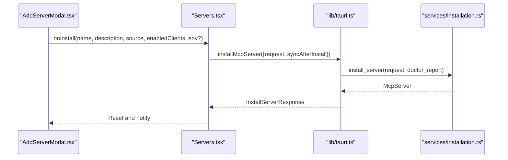
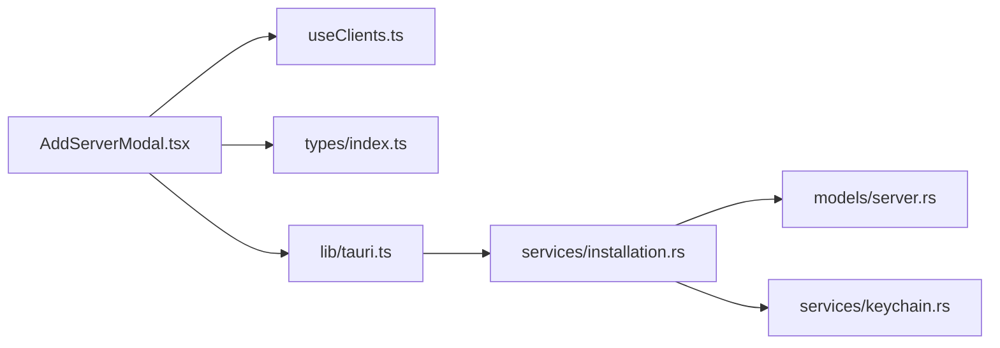

# Server Configuration

<cite>
**Referenced Files in This Document**
- [AddServerModal.tsx](file://src/components/servers/AddServerModal.tsx)
- [useClients.ts](file://src/hooks/useClients.ts)
- [index.ts](file://src/types/index.ts)
- [tauri.ts](file://src/lib/tauri.ts)
- [server.rs](file://src-tauri/src/models/server.rs)
- [installation.rs](file://src-tauri/src/services/installation.rs)
- [keychain.rs](file://src-tauri/src/services/keychain.rs)
- [Servers.tsx](file://src/pages/Servers.tsx)
- [ClientCard.tsx](file://src/components/clients/ClientCard.tsx)
</cite>

## Table of Contents

1. [Introduction](#introduction)
2. [Project Structure](#project-structure)
3. [Core Components](#core-components)
4. [Architecture Overview](#architecture-overview)
5. [Detailed Component Analysis](#detailed-component-analysis)
6. [Dependency Analysis](#dependency-analysis)
7. [Performance Considerations](#performance-considerations)
8. [Troubleshooting Guide](#troubleshooting-guide)
9. [Conclusion](#conclusion)

## Introduction

This document explains server configuration in MCP Nexus with a focus on the AddServerModal interface. It covers how environment variables are collected and passed to the backend, how client enablement works, and how server metadata (name, description, enabled clients) is represented in the McpServer data model. It also documents the validation logic in AddServerModal’s isFormValid(), how the installation workflow integrates with the UI, and common issues such as environment variable conflicts and invalid configurations.

## Project Structure

The server configuration feature spans the frontend UI and the Tauri backend:

- Frontend UI: AddServerModal collects user inputs, validates them, and invokes installation.
- Backend services: Installation service builds transports and servers, and the keychain service resolves secure environment variable values.
- Shared types: Define McpServer, InstallSource, and related structures used across UI and backend.

**Diagram sources**

- [AddServerModal.tsx](file://src/components/servers/AddServerModal.tsx#L1-L200)
- [useClients.ts](file://src/hooks/useClients.ts#L1-L138)
- [index.ts](file://src/types/index.ts#L1-L120)
- [tauri.ts](file://src/lib/tauri.ts#L226-L364)
- [server.rs](file://src-tauri/src/models/server.rs#L1-L132)
- [installation.rs](file://src-tauri/src/services/installation.rs#L480-L679)
- [keychain.rs](file://src-tauri/src/services/keychain.rs#L262-L304)
- [Servers.tsx](file://src/pages/Servers.tsx#L192-L224)
- [ClientCard.tsx](file://src/components/clients/ClientCard.tsx#L1-L160)

**Section sources**

- [AddServerModal.tsx](file://src/components/servers/AddServerModal.tsx#L1-L200)
- [index.ts](file://src/types/index.ts#L1-L120)
- [tauri.ts](file://src/lib/tauri.ts#L226-L364)
- [server.rs](file://src-tauri/src/models/server.rs#L1-L132)
- [installation.rs](file://src-tauri/src/services/installation.rs#L480-L679)
- [keychain.rs](file://src-tauri/src/services/keychain.rs#L262-L304)
- [Servers.tsx](file://src/pages/Servers.tsx#L192-L224)
- [ClientCard.tsx](file://src/components/clients/ClientCard.tsx#L1-L160)

## Core Components

- AddServerModal: Collects server metadata, source type, environment variables, and client enablement; validates inputs; submits to install.
- useClients: Provides detected clients and sync statuses to power client selection UI.
- McpServer model: Defines server fields including name, description, enabled_clients, env in transport, and metadata.
- InstallSource and InstallServerRequest: Define how the UI sends installation requests to the backend.
- tauri.ts: Exposes installMcpServer and related commands to the UI.
- Installation service: Builds transport and server from InstallSource/env; enables for selected clients.
- Keychain service: Resolves keychain references in environment variables.

**Section sources**

- [AddServerModal.tsx](file://src/components/servers/AddServerModal.tsx#L1-L200)
- [useClients.ts](file://src/hooks/useClients.ts#L110-L138)
- [index.ts](file://src/types/index.ts#L37-L120)
- [tauri.ts](file://src/lib/tauri.ts#L226-L364)
- [server.rs](file://src-tauri/src/models/server.rs#L51-L132)
- [installation.rs](file://src-tauri/src/services/installation.rs#L480-L679)
- [keychain.rs](file://src-tauri/src/services/keychain.rs#L262-L304)

## Architecture Overview

The AddServerModal orchestrates server creation by:

- Building an InstallSource from the selected source type and fields.
- Collecting environment variables as key/value pairs and passing them to the backend.
- Collecting enabled client IDs from the client selection UI.
- Submitting an InstallServerRequest to installMcpServer, which delegates to the installation service.

**Diagram sources**

- [AddServerModal.tsx](file://src/components/servers/AddServerModal.tsx#L83-L163)
- [Servers.tsx](file://src/pages/Servers.tsx#L192-L224)
- [tauri.ts](file://src/lib/tauri.ts#L236-L261)
- [installation.rs](file://src-tauri/src/services/installation.rs#L480-L520)
- [server.rs](file://src-tauri/src/models/server.rs#L51-L132)
- [keychain.rs](file://src-tauri/src/services/keychain.rs#L262-L304)

## Detailed Component Analysis

### AddServerModal: Environment Variables, Client Selection, and Validation

- Environment variables:
  - The modal maintains a list of key/value pairs for env vars.
  - Users can add, edit, and remove env var rows.
  - On submit, the modal constructs a Record<string,string> from the list and passes it to onInstall.
  - The env object is included in the InstallServerRequest sent to the backend.
- Client selection:
  - The modal reads detected clients via useClients and renders a grid of client checkboxes.
  - Users can toggle individual clients or use Select All/Deselect All.
  - The selected client IDs are passed to onInstall as enabledClients.
- Validation:
  - isFormValid enforces required fields per source type:
    - Local requires a path.
    - Remote requires a URL.
    - NPM requires a package.
    - Uvx requires a package.
    - Docker requires an image.
    - GitHub requires a repo.
  - The Add button is disabled until isFormValid returns true.

**Diagram sources**

- [AddServerModal.tsx](file://src/components/servers/AddServerModal.tsx#L197-L214)
- [AddServerModal.tsx](file://src/components/servers/AddServerModal.tsx#L183-L196)
- [AddServerModal.tsx](file://src/components/servers/AddServerModal.tsx#L165-L182)
- [AddServerModal.tsx](file://src/components/servers/AddServerModal.tsx#L83-L163)

**Section sources**

- [AddServerModal.tsx](file://src/components/servers/AddServerModal.tsx#L1-L200)
- [AddServerModal.tsx](file://src/components/servers/AddServerModal.tsx#L197-L214)
- [AddServerModal.tsx](file://src/components/servers/AddServerModal.tsx#L183-L196)
- [AddServerModal.tsx](file://src/components/servers/AddServerModal.tsx#L165-L182)
- [AddServerModal.tsx](file://src/components/servers/AddServerModal.tsx#L83-L163)

### Client Selection Mechanism and ClientCard Integration

- Client selection in AddServerModal:
  - useClients merges detected clients with their sync statuses to compute a clients array with syncEnabled, lastSync, externallyModified, and syncError.
  - The modal filters detected clients and renders a checkbox grid for enabling the new server for specific clients.
- ClientCard component:
  - Displays client status and offers actions like toggling sync and manual config copy.
  - While ClientCard is not directly used in AddServerModal, it reflects the same client data model and sync concepts used by AddServerModal.

**Diagram sources**

- [index.ts](file://src/types/index.ts#L83-L122)
- [index.ts](file://src/types/index.ts#L98-L106)
- [useClients.ts](file://src/hooks/useClients.ts#L110-L137)

**Section sources**

- [useClients.ts](file://src/hooks/useClients.ts#L110-L137)
- [index.ts](file://src/types/index.ts#L83-L122)
- [index.ts](file://src/types/index.ts#L98-L106)
- [ClientCard.tsx](file://src/components/clients/ClientCard.tsx#L1-L160)

### McpServer Data Model Fields

- McpServer fields relevant to server configuration:
  - id, name, description, source, transport, enabled, enabled_clients, installed_at, updated_at, installed_version, source_url, tags.
- enabled_clients:
  - Stores the list of client IDs for which the server is enabled.
  - The installation service sets enabled_clients from the InstallServerRequest and updates timestamps accordingly.
- Transport env:
  - For stdio transport, env is carried in transport.env.
  - For remote transport, headers are carried in transport.headers.

**Diagram sources**

- [server.rs](file://src-tauri/src/models/server.rs#L51-L132)
- [index.ts](file://src/types/index.ts#L14-L36)

**Section sources**

- [server.rs](file://src-tauri/src/models/server.rs#L51-L132)
- [index.ts](file://src/types/index.ts#L14-L36)

### Environment Variables Management and Resolution

- UI collection:
  - AddServerModal maintains envVars as an array of key/value pairs and converts it to a Record<string,string> before calling onInstall.
- Backend ingestion:
  - InstallServerRequest.env is passed to the installation service.
  - build_transport(source, env) creates transport.env for stdio sources.
- Secure resolution:
  - Keychain references in env values (e.g., keychain:name or ${keychain:name}) are resolved by the keychain service during runtime.
  - The keychain service exposes helpers to detect references, extract names, and resolve values.

**Diagram sources**

- [AddServerModal.tsx](file://src/components/servers/AddServerModal.tsx#L183-L196)
- [index.ts](file://src/types/index.ts#L265-L278)
- [installation.rs](file://src-tauri/src/services/installation.rs#L442-L453)
- [keychain.rs](file://src-tauri/src/services/keychain.rs#L262-L304)

**Section sources**

- [AddServerModal.tsx](file://src/components/servers/AddServerModal.tsx#L183-L196)
- [index.ts](file://src/types/index.ts#L265-L278)
- [installation.rs](file://src-tauri/src/services/installation.rs#L442-L453)
- [keychain.rs](file://src-tauri/src/services/keychain.rs#L262-L304)

### Installation Workflow Integration

- Servers.tsx:
  - Handles onInstall callback from AddServerModal and calls installMcpServer with request and syncAfterInstall.
  - Displays success/error notifications and resets modal on success.
- tauri.ts:
  - installMcpServer invokes the Tauri command to install the server.
- installation.rs:
  - Validates runtime requirements based on source type.
  - Builds transport and server, populates enabled_clients, and returns the new McpServer.

**Diagram sources**

- [Servers.tsx](file://src/pages/Servers.tsx#L192-L224)
- [tauri.ts](file://src/lib/tauri.ts#L236-L261)
- [installation.rs](file://src-tauri/src/services/installation.rs#L480-L520)

**Section sources**

- [Servers.tsx](file://src/pages/Servers.tsx#L192-L224)
- [tauri.ts](file://src/lib/tauri.ts#L236-L261)
- [installation.rs](file://src-tauri/src/services/installation.rs#L480-L520)

## Dependency Analysis

- AddServerModal depends on:
  - useClients for client data.
  - Types for InstallSource and InstallServerRequest.
  - tauri.ts installMcpServer for backend invocation.
- Backend depends on:
  - installation.rs to validate runtimes, build transport, and create McpServer.
  - server.rs for McpServer and ServerSource/Transport definitions.
  - keychain.rs for resolving keychain references in env values.

**Diagram sources**

- [AddServerModal.tsx](file://src/components/servers/AddServerModal.tsx#L1-L80)
- [useClients.ts](file://src/hooks/useClients.ts#L110-L137)
- [index.ts](file://src/types/index.ts#L255-L278)
- [tauri.ts](file://src/lib/tauri.ts#L236-L261)
- [installation.rs](file://src-tauri/src/services/installation.rs#L480-L520)
- [server.rs](file://src-tauri/src/models/server.rs#L51-L132)
- [keychain.rs](file://src-tauri/src/services/keychain.rs#L262-L304)

**Section sources**

- [AddServerModal.tsx](file://src/components/servers/AddServerModal.tsx#L1-L80)
- [useClients.ts](file://src/hooks/useClients.ts#L110-L137)
- [index.ts](file://src/types/index.ts#L255-L278)
- [tauri.ts](file://src/lib/tauri.ts#L236-L261)
- [installation.rs](file://src-tauri/src/services/installation.rs#L480-L520)
- [server.rs](file://src-tauri/src/models/server.rs#L51-L132)
- [keychain.rs](file://src-tauri/src/services/keychain.rs#L262-L304)

## Performance Considerations

- Large environment variable lists:
  - Rendering many env var rows can impact UI responsiveness. Consider virtualized lists or pagination for very large sets.
  - Debounce updates to env var values if frequent edits occur.
- Client selection:
  - If many clients are detected, rendering grids can be expensive. Consider lazy rendering or filtering.
- Backend serialization:
  - Transport.env is serialized into McpServer. Keep env sizes reasonable to minimize config file size and sync overhead.
- Runtime validation:
  - validate_runtime checks presence of runtimes. Avoid repeated checks by caching doctor reports or debouncing validation triggers.

[No sources needed since this section provides general guidance]

## Troubleshooting Guide

- Environment variable conflicts:
  - Duplicate keys in envVars are not prevented by AddServerModal. If duplicates exist, the backend will use the last value encountered when constructing the env map. Prefer unique keys.
  - If using keychain references, ensure the referenced credential names are valid and exist in the keychain.
- Invalid client configurations:
  - If no clients are detected, AddServerModal still allows submission; however, the server will not be enabled for any client. Use Select All/Deselect All to manage selections.
- Metadata validation errors:
  - isFormValid prevents submission if required fields are missing for the chosen source type. Ensure name and source-specific fields are filled.
- Remote URL validation:
  - Remote sources must use http/https URLs. Non-HTTP(S) URLs will fail runtime validation.
- Local path validation:
  - Local sources require an existing path. Ensure the path exists before installation.
- Docker and Git validation:
  - Docker and Git must be present for Docker and GitHub sources respectively; otherwise, runtime validation fails.

**Section sources**

- [AddServerModal.tsx](file://src/components/servers/AddServerModal.tsx#L197-L214)
- [installation.rs](file://src-tauri/src/services/installation.rs#L124-L181)
- [keychain.rs](file://src-tauri/src/services/keychain.rs#L129-L154)

## Conclusion

AddServerModal provides a comprehensive interface for configuring MCP servers, including metadata, environment variables, and client enablement. The McpServer model cleanly separates metadata (name, description, tags) from transport details (source, transport, env). The installation workflow integrates tightly with the UI and backend, validating runtime requirements and enabling servers for selected clients. By following the validation rules and best practices outlined here, users can reliably configure servers while avoiding common pitfalls.
