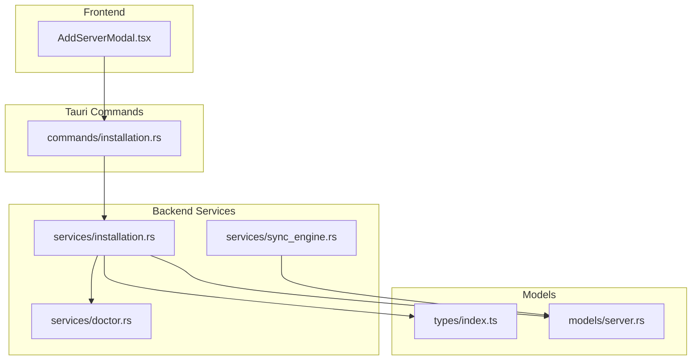
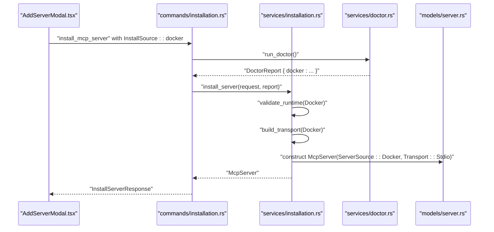
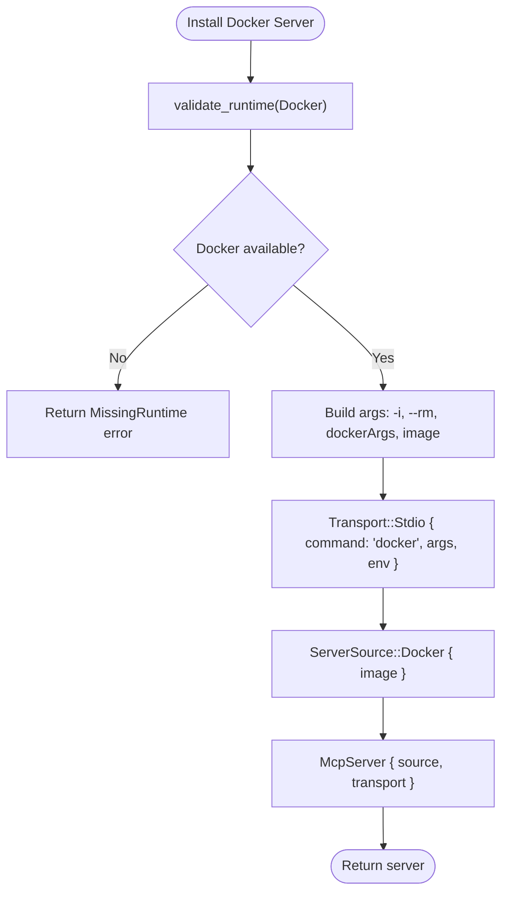
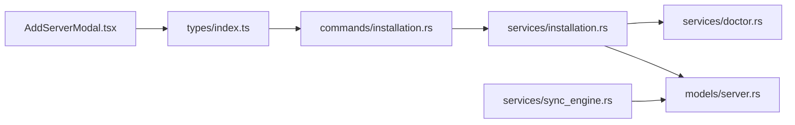

# Docker Installation

<cite>
**Referenced Files in This Document**
- [AddServerModal.tsx](file://src/components/servers/AddServerModal.tsx)
- [installation.rs](file://src-tauri/src/services/installation.rs)
- [installation.rs (commands)](file://src-tauri/src/commands/installation.rs)
- [server.rs (models)](file://src-tauri/src/models/server.rs)
- [index.ts (types)](file://src/types/index.ts)
- [doctor.rs](file://src-tauri/src/services/doctor.rs)
- [sync_engine.rs](file://src-tauri/src/services/sync_engine.rs)
</cite>

## Table of Contents

1. [Introduction](#introduction)
2. [Project Structure](#project-structure)
3. [Core Components](#core-components)
4. [Architecture Overview](#architecture-overview)
5. [Detailed Component Analysis](#detailed-component-analysis)
6. [Dependency Analysis](#dependency-analysis)
7. [Performance Considerations](#performance-considerations)
8. [Troubleshooting Guide](#troubleshooting-guide)
9. [Conclusion](#conclusion)

## Introduction

This document explains how Docker container installation works in MCP Nexus. It covers the frontend AddServerModal interface, the backend InstallationService, Docker runtime validation, transport configuration for Docker sources, and environment variable injection. It also documents how InstallSource maps to McpServer’s ServerSource and Transport models, and provides troubleshooting guidance for common issues such as missing Docker installation, image pull failures, and container permission errors.

## Project Structure

Docker installation spans the React frontend and the Tauri/Rust backend:

- Frontend: AddServerModal collects user input for Docker images and optional docker run arguments, and environment variables.
- Backend: InstallationService validates Docker availability, builds a Transport::Stdio command for docker run, and constructs McpServer with ServerSource::Docker and Transport::Stdio.

**Diagram sources**

- [AddServerModal.tsx](file://src/components/servers/AddServerModal.tsx#L1-L200)
- [installation.rs (commands)](file://src-tauri/src/commands/installation.rs#L90-L135)
- [installation.rs](file://src-tauri/src/services/installation.rs#L124-L183)
- [doctor.rs](file://src-tauri/src/services/doctor.rs#L1-L120)
- [server.rs (models)](file://src-tauri/src/models/server.rs#L1-L90)
- [index.ts (types)](file://src/types/index.ts#L1-L60)
- [sync_engine.rs](file://src-tauri/src/services/sync_engine.rs#L550-L570)

**Section sources**

- [AddServerModal.tsx](file://src/components/servers/AddServerModal.tsx#L1-L200)
- [installation.rs (commands)](file://src-tauri/src/commands/installation.rs#L90-L135)
- [installation.rs](file://src-tauri/src/services/installation.rs#L124-L183)
- [doctor.rs](file://src-tauri/src/services/doctor.rs#L1-L120)
- [server.rs (models)](file://src-tauri/src/models/server.rs#L1-L90)
- [index.ts (types)](file://src/types/index.ts#L1-L60)
- [sync_engine.rs](file://src-tauri/src/services/sync_engine.rs#L550-L570)

## Core Components

- AddServerModal.tsx: Presents Docker image and docker run arguments fields, collects environment variables, and emits InstallSource::docker to the backend.
- InstallationService (Rust): Validates Docker runtime, builds Transport::Stdio with docker run arguments, and creates McpServer with ServerSource::Docker.
- Transport and ServerSource models: Define how Docker servers are represented in configuration and how they communicate.
- Doctor service: Detects Docker availability and reports it for validation.
- Commands: Expose install/uninstall/validate APIs to the frontend.

Key mappings:

- InstallSource::docker in frontend types maps to ServerSource::Docker in backend models.
- Transport::Stdio is used for Docker sources, with command "docker" and args built from docker run arguments plus the image.

**Section sources**

- [AddServerModal.tsx](file://src/components/servers/AddServerModal.tsx#L117-L123)
- [index.ts (types)](file://src/types/index.ts#L255-L262)
- [server.rs (models)](file://src-tauri/src/models/server.rs#L1-L30)
- [installation.rs](file://src-tauri/src/services/installation.rs#L437-L447)
- [installation.rs](file://src-tauri/src/services/installation.rs#L456-L476)
- [doctor.rs](file://src-tauri/src/services/doctor.rs#L217-L237)

## Architecture Overview

End-to-end flow for Docker installation:

1. User selects Docker source in AddServerModal and enters image and optional dockerArgs.
2. Frontend emits InstallSource::docker with env variables.
3. Backend validates Docker runtime via DoctorReport.
4. Backend builds Transport::Stdio with docker command and arguments.
5. Backend constructs McpServer with ServerSource::Docker and Transport::Stdio.
6. Server is saved and optionally synced to clients.

**Diagram sources**

- [AddServerModal.tsx](file://src/components/servers/AddServerModal.tsx#L117-L123)
- [installation.rs (commands)](file://src-tauri/src/commands/installation.rs#L90-L135)
- [installation.rs](file://src-tauri/src/services/installation.rs#L124-L183)
- [installation.rs](file://src-tauri/src/services/installation.rs#L437-L447)
- [server.rs (models)](file://src-tauri/src/models/server.rs#L52-L90)
- [doctor.rs](file://src-tauri/src/services/doctor.rs#L1-L120)

## Detailed Component Analysis

### AddServerModal.tsx (Docker UI)

- Provides Docker image input and optional docker run arguments input.
- Supports environment variables injection via a dynamic list.
- Emits InstallSource::docker with image and dockerArgs to the backend.

Implementation highlights:

- Docker form fields and submission logic construct InstallSource::docker.
- Environment variables are aggregated into a record and passed to onInstall.

**Section sources**

- [AddServerModal.tsx](file://src/components/servers/AddServerModal.tsx#L432-L460)
- [AddServerModal.tsx](file://src/components/servers/AddServerModal.tsx#L117-L123)
- [AddServerModal.tsx](file://src/components/servers/AddServerModal.tsx#L133-L141)

### InstallationService (Docker Runtime Validation and Transport Building)

- Runtime validation ensures Docker is present; otherwise returns MissingRuntime error.
- Transport building for Docker:
  - Command: "docker"
  - Args: preconfigured "-i" and "--rm", then user-provided dockerArgs, then image.
  - Env: injected from InstallServerRequest.env.
- ServerSource mapping:
  - InstallSource::Docker -> ServerSource::Docker(image).

**Diagram sources**

- [installation.rs](file://src-tauri/src/services/installation.rs#L164-L171)
- [installation.rs](file://src-tauri/src/services/installation.rs#L437-L447)
- [installation.rs](file://src-tauri/src/services/installation.rs#L456-L476)

**Section sources**

- [installation.rs](file://src-tauri/src/services/installation.rs#L164-L171)
- [installation.rs](file://src-tauri/src/services/installation.rs#L437-L447)
- [installation.rs](file://src-tauri/src/services/installation.rs#L456-L476)

### Transport and ServerSource Models

- Transport::Stdio carries command, args, and env for process-based servers.
- Transport::Sse is used for remote sources.
- ServerSource::Docker holds the image name.

These models define how Docker servers are serialized and synchronized.

**Section sources**

- [server.rs (models)](file://src-tauri/src/models/server.rs#L31-L49)
- [server.rs (models)](file://src-tauri/src/models/server.rs#L1-L30)

### Frontend Types and Backend Models Alignment

- Frontend InstallSource::docker maps to backend InstallSource::Docker.
- Frontend Transport and McpServer align with backend models.

**Section sources**

- [index.ts (types)](file://src/types/index.ts#L255-L262)
- [server.rs (models)](file://src-tauri/src/models/server.rs#L1-L30)

### Docker Container Lifecycle Management

- The backend sets "-i" and "--rm" for interactive, ephemeral containers.
- Docker images are not automatically removed on uninstall; users can prune images manually.

**Section sources**

- [installation.rs](file://src-tauri/src/services/installation.rs#L437-L447)
- [installation.rs](file://src-tauri/src/services/installation.rs#L550-L555)

### Docker Arguments Parsing During Import

- The sync engine can parse docker-based servers from client configurations by detecting "docker" command and extracting the image after "run".

**Section sources**

- [sync_engine.rs](file://src-tauri/src/services/sync_engine.rs#L557-L566)

## Dependency Analysis

- AddServerModal depends on InstallSource types to emit Docker configuration.
- Commands depend on InstallationService to validate and install.
- InstallationService depends on DoctorReport for runtime checks and on models for McpServer construction.
- Sync engine consumes McpServer to import and transform configurations.

**Diagram sources**

- [AddServerModal.tsx](file://src/components/servers/AddServerModal.tsx#L1-L200)
- [index.ts (types)](file://src/types/index.ts#L255-L262)
- [installation.rs (commands)](file://src-tauri/src/commands/installation.rs#L90-L135)
- [installation.rs](file://src-tauri/src/services/installation.rs#L124-L183)
- [doctor.rs](file://src-tauri/src/services/doctor.rs#L1-L120)
- [server.rs (models)](file://src-tauri/src/models/server.rs#L52-L90)
- [sync_engine.rs](file://src-tauri/src/services/sync_engine.rs#L550-L570)

**Section sources**

- [AddServerModal.tsx](file://src/components/servers/AddServerModal.tsx#L1-L200)
- [index.ts (types)](file://src/types/index.ts#L255-L262)
- [installation.rs (commands)](file://src-tauri/src/commands/installation.rs#L90-L135)
- [installation.rs](file://src-tauri/src/services/installation.rs#L124-L183)
- [doctor.rs](file://src-tauri/src/services/doctor.rs#L1-L120)
- [server.rs (models)](file://src-tauri/src/models/server.rs#L52-L90)
- [sync_engine.rs](file://src-tauri/src/services/sync_engine.rs#L550-L570)

## Performance Considerations

- Container startup time:
  - Initial image pull adds latency; subsequent runs benefit from cached layers.
  - Use lightweight base images and minimize startup arguments to reduce cold start.
- Resource allocation:
  - Limit CPU/memory via docker run arguments to avoid host contention.
  - Prefer bind mounts for frequently accessed data to reduce I/O overhead.
- Ephemeral containers:
  - Using "--rm" keeps the host clean but may increase repeated pulls; consider caching images for frequent reuse.

[No sources needed since this section provides general guidance]

## Troubleshooting Guide

Common issues and resolutions:

- Missing Docker installation
  - Symptom: Installation fails with a runtime validation error indicating Docker is missing.
  - Resolution: Install Docker Desktop or Engine and ensure it is reachable from PATH.
  - Detection: Doctor service detects Docker presence and version; validation enforces Docker availability for Docker sources.

- Image pull failures
  - Symptom: docker run fails due to network or registry issues.
  - Resolution: Retry after verifying connectivity, credentials, and registry accessibility; pull the image manually to test.

- Container permission errors
  - Symptom: Permission denied when accessing mounted volumes or privileged operations.
  - Resolution: Adjust host path permissions, mount paths, and container user/group; review SELinux/AppArmor policies if applicable.

- Port conflicts
  - Symptom: Port already in use by another container or process.
  - Resolution: Change published ports via docker run arguments or stop conflicting services.

- Insufficient host resources
  - Symptom: Container killed by OOM killer or slow startup.
  - Resolution: Allocate more memory/CPU to Docker Desktop or adjust container resource limits.

Validation and diagnostics:

- Use validate_install to check runtime prerequisites before attempting installation.
- Review DoctorReport for Docker availability and version information.

**Section sources**

- [installation.rs (commands)](file://src-tauri/src/commands/installation.rs#L194-L226)
- [doctor.rs](file://src-tauri/src/services/doctor.rs#L217-L237)
- [installation.rs](file://src-tauri/src/services/installation.rs#L164-L171)

## Conclusion

MCP Nexus integrates Docker-based servers by validating Docker availability, constructing a docker run Transport::Stdio with user-provided arguments and environment variables, and persisting the configuration as McpServer with ServerSource::Docker. The frontend AddServerModal captures user inputs, while the backend InstallationService and Doctor service ensure correctness and reliability. Proper troubleshooting and performance tuning help achieve smooth containerized server operation.
