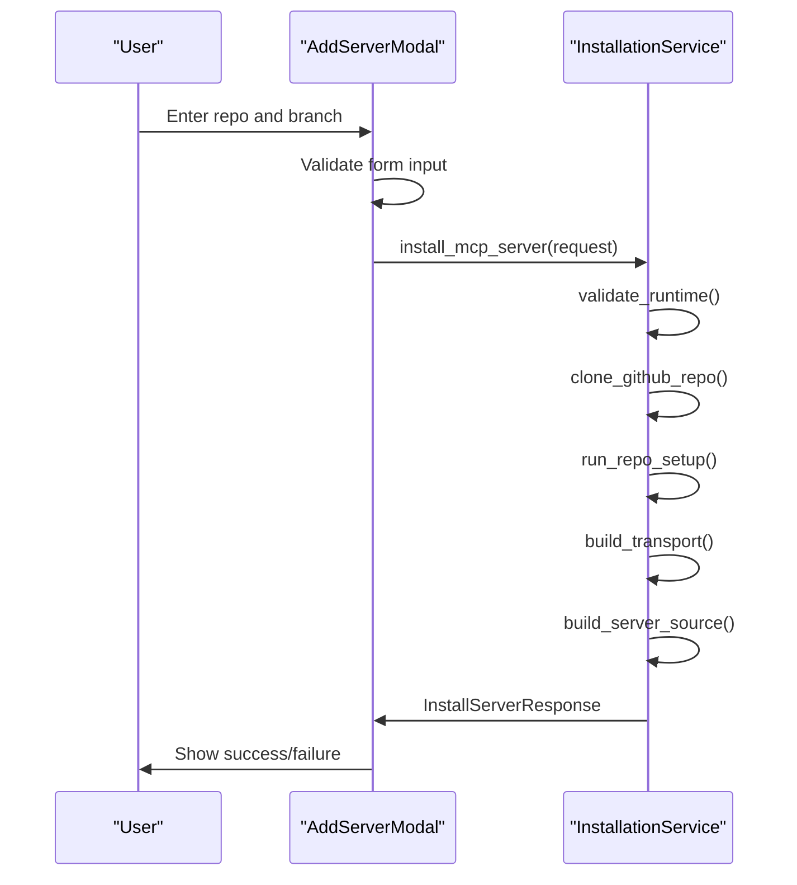
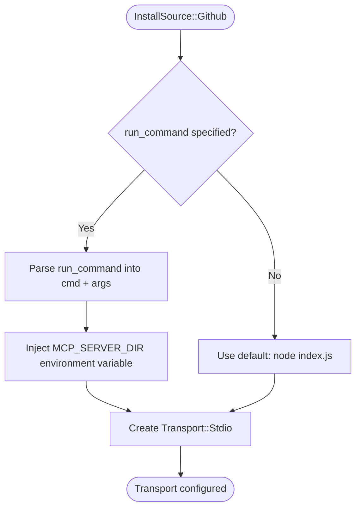

# GitHub Installation

<cite>
**Referenced Files in This Document**   
- [AddServerModal.tsx](file://src/components/servers/AddServerModal.tsx)
- [installation.rs](file://src-tauri/src/services/installation.rs)
- [installation.rs](file://src-tauri/src/commands/installation.rs)
- [index.ts](file://src/types/index.ts)
- [server.rs](file://src-tauri/src/models/server.rs)
- [doctor.rs](file://src-tauri/src/services/doctor.rs)
- [tauri.ts](file://src/lib/tauri.ts)
</cite>

## Table of Contents

1. [Introduction](#introduction)
2. [GitHub Installation Process](#github-installation-process)
3. [InstallSource to ServerSource Mapping](#installsource-to-serversource-mapping)
4. [Transport Configuration for GitHub Sources](#transport-configuration-for-github-sources)
5. [Common Issues and Troubleshooting](#common-issues-and-troubleshooting)
6. [Performance Considerations](#performance-considerations)
7. [Conclusion](#conclusion)

## Introduction

This document details the implementation of GitHub repository installation in MCP Nexus, focusing on the integration between the frontend AddServerModal interface and the backend InstallationService. The system enables users to clone and set up servers directly from GitHub repositories, handling runtime validation, repository cloning with shallow depth, branch specification, and automatic setup processes. The document explains the mapping between the InstallSource enum and McpServer's ServerSource and Transport models, details the transport configuration logic for GitHub sources, and provides troubleshooting guidance for common issues.

**Section sources**

- [AddServerModal.tsx](file://src/components/servers/AddServerModal.tsx#L1-L654)
- [installation.rs](file://src-tauri/src/services/installation.rs#L1-L822)

## GitHub Installation Process

The GitHub installation process in MCP Nexus is a multi-step workflow that begins with user input in the AddServerModal and concludes with a fully configured server instance. The process involves runtime validation, repository cloning, dependency installation, and server configuration.

The AddServerModal component provides a user interface for specifying GitHub repository details, including the repository name (in owner/repository format) and an optional branch name. When the user submits the form, the frontend constructs an InstallServerRequest object with the source type set to "github" and the repository information provided by the user.



**Diagram sources**

- [AddServerModal.tsx](file://src/components/servers/AddServerModal.tsx#L1-L654)
- [installation.rs](file://src-tauri/src/services/installation.rs#L1-L822)

The backend InstallationService handles the installation request through the install_mcp_server command. The process begins with runtime validation using the validate_runtime function, which checks for the presence of git on the system. If git is not available, the installation fails with a descriptive error message suggesting installation methods.

Once runtime validation passes, the service clones the specified GitHub repository using the clone_github_repo function. This function implements several important features:

- Shallow cloning with --depth 1 for faster downloads
- Support for both HTTPS and SSH repository URLs
- Automatic conversion of owner/repository format to HTTPS URL
- Branch specification via the --branch parameter
- Repository caching in ~/.mcp-nexus/repos with updates via git pull

After cloning, the run_repo_setup function automatically detects the project type and installs dependencies. This function checks for package.json (Node.js) or pyproject.toml/requirements.txt (Python) and uses the appropriate package manager (npm/yarn/pnpm for Node.js, pip/uv for Python).

**Section sources**

- [installation.rs](file://src-tauri/src/services/installation.rs#L185-L252)
- [installation.rs](file://src-tauri/src/services/installation.rs#L254-L332)

## InstallSource to ServerSource Mapping

The InstallSource enum in the installation service maps directly to the ServerSource model used in McpServer configuration. This mapping preserves the installation source information for future reference and operations like updates and cleanup.

The InstallSource::Github variant contains the repository URL and optional branch information provided by the user. When the server is created, this information is transformed into a ServerSource::Github variant through the build_server_source function. This function copies the repo and branch fields directly from the InstallSource to the ServerSource, ensuring that the original installation parameters are preserved.

```mermaid
classDiagram
class InstallSource {
+Github { repo : String, branch : Option<String>, run_command : Option<String> }
+Npm { package : String, version : Option<String>, args : Vec<String> }
+Uvx { package : String, args : Vec<String> }
+Local { path : String, command : Option<String>, args : Vec<String> }
+Docker { image : String, docker_args : Vec<String> }
+Remote { url : String, headers : HashMap<String, String> }
}
class ServerSource {
+Github { repo : String, branch : Option<String> }
+Npm { package : String, version : Option<String> }
+Uvx { package : String }
+Local { path : String }
+Docker { image : String }
+Remote { url : String }
}
class McpServer {
+id : Uuid
+name : String
+description : Option<String>
+source : ServerSource
+transport : Transport
+enabled : bool
+enabled_clients : Vec<String>
+installed_at : String
+updated_at : String
+installed_version : Option<String>
+source_url : Option<String>
+tags : Vec<String>
}
InstallSource --> ServerSource : "build_server_source()"
ServerSource --> McpServer : "contained in"
```

**Diagram sources**

- [installation.rs](file://src-tauri/src/services/installation.rs#L455-L477)
- [server.rs](file://src-tauri/src/models/server.rs#L5-L29)

This mapping is crucial for operations like repository cleanup during server uninstallation. When a server with a GitHub source is uninstalled, the cleanup_server function uses the repo information from ServerSource to locate and remove the corresponding directory in the repos cache, but only if it's within the managed directory structure.

The InstallSource enum also includes a run_command field that is not preserved in ServerSource. This field is used only during installation to specify a custom command to run after cloning, and is consumed during transport configuration.

**Section sources**

- [installation.rs](file://src-tauri/src/services/installation.rs#L455-L477)
- [server.rs](file://src-tauri/src/models/server.rs#L5-L29)

## Transport Configuration for GitHub Sources

The transport configuration for GitHub sources is built by the build_transport function, which creates a Transport::Stdio configuration that points to the cloned repository. This configuration determines how MCP Nexus communicates with the server process.

For GitHub sources, the transport configuration depends on whether a run_command was specified in the installation request. If a run_command is provided, it is parsed into a command and arguments. The MCP_SERVER_DIR environment variable is injected, containing the path to the cloned repository. This allows server implementations to reference repository-relative paths in their configuration.

If no run_command is specified, the system defaults to running node index.js in the repository directory. This convention supports common Node.js server implementations without requiring users to specify explicit commands.



**Diagram sources**

- [installation.rs](file://src-tauri/src/services/installation.rs#L392-L436)

The transport configuration also inherits any environment variables specified in the installation request. These are merged with the injected MCP_SERVER_DIR variable, allowing users to provide additional configuration through environment variables in the AddServerModal interface.

Package manager detection during setup influences the transport configuration indirectly. By installing the correct dependencies, the setup process ensures that the commands specified in run_command or the default node index.js will have all required modules available.

The environment variable injection feature is particularly useful for servers that need to access files within the repository. For example, a file system server might use MCP_SERVER_DIR to determine the root directory to expose, while a Git server might use it to locate the repository to monitor.

**Section sources**

- [installation.rs](file://src-tauri/src/services/installation.rs#L392-L436)
- [AddServerModal.tsx](file://src/components/servers/AddServerModal.tsx#L493-L542)

## Common Issues and Troubleshooting

Several common issues can occur during GitHub repository installation in MCP Nexus. Understanding these issues and their solutions is essential for effective troubleshooting.

### Missing Git Installation

The most common issue is a missing git installation. The system validates git availability through the doctor service, which checks for git in the system PATH and common installation locations. If git is not found, the installation fails with a descriptive error message.

**Solution**: Install git using one of these methods:

- Install Xcode Command Line Tools on macOS: `xcode-select --install`
- Install via Homebrew: `brew install git`
- Download from https://git-scm.com

### Authentication Problems

Authentication issues can occur when cloning private repositories. The current implementation relies on system-level git configuration and credential management.

**Solutions**:

- Configure git credentials: `git config --global credential.helper store`
- Use SSH keys: Ensure your SSH key is added to ssh-agent and configured with GitHub
- For token-based authentication, use HTTPS URLs with personal access tokens

### Dependency Installation Failures

Dependency installation can fail due to network issues, incompatible package versions, or missing build tools.

**Solutions**:

- For Node.js projects: Ensure node-gyp and build tools are installed
- For Python projects: Install required system dependencies before installation
- Check network connectivity and firewall settings
- Verify package manager versions are compatible with project requirements

### Repository URL Format Issues

The system accepts multiple repository URL formats, but incorrect formats can cause cloning to fail.

**Valid formats**:

- owner/repository (e.g., modelcontextprotocol/servers)
- HTTPS URL (e.g., https://github.com/modelcontextprotocol/servers.git)
- SSH URL (e.g., git@github.com:modelcontextprotocol/servers.git)

**Troubleshooting tips**:

- Verify repository URLs are correct and accessible
- Test cloning manually with git clone to isolate issues
- Check for typos in repository names or owner names
- Ensure private repositories are accessible with current credentials

**Section sources**

- [doctor.rs](file://src-tauri/src/services/doctor.rs#L43-L50)
- [installation.rs](file://src-tauri/src/services/installation.rs#L155-L162)
- [installation.rs](file://src-tauri/src/services/installation.rs#L192-L252)

## Performance Considerations

Several performance considerations affect GitHub repository installation in MCP Nexus, particularly around repository cloning and dependency installation.

The implementation uses shallow cloning with --depth 1 to minimize download size and time. This optimization is particularly effective for large repositories where only the latest version is needed. However, it limits git functionality within the cloned repository, as history is not fully available.

Repository caching in ~/.mcp-nexus/repos improves performance for subsequent installations or updates of the same repository. When a repository directory already exists, the system performs a git pull instead of a fresh clone, updating to the latest changes. This approach balances storage usage with update efficiency.

Dependency installation performance varies significantly based on project size and network conditions. The automatic setup process can be time-consuming for projects with many dependencies. To mitigate this:

- The interface shows appropriate loading states during installation
- Errors are reported clearly to avoid indefinite waiting
- Users can monitor progress through the application's notification system

Network performance is a critical factor, as both repository cloning and dependency installation require internet connectivity. Slow networks can significantly increase installation times, particularly for repositories with large dependency trees.

For optimal performance:

- Ensure stable, high-speed internet connectivity
- Use shallow clones for development servers
- Consider using package manager caches (npm cache, pip cache)
- Install git-lfs if the repository contains large files

**Section sources**

- [installation.rs](file://src-tauri/src/services/installation.rs#L238-L239)
- [installation.rs](file://src-tauri/src/services/installation.rs#L206-L219)

## Conclusion

The GitHub installation system in MCP Nexus provides a comprehensive solution for cloning and setting up servers from GitHub repositories. Through the integration of the AddServerModal interface and backend InstallationService, users can easily install servers with automatic dependency management and proper configuration. The system handles runtime validation, implements efficient cloning strategies, and provides clear error reporting for troubleshooting common issues. By understanding the InstallSource to ServerSource mapping, transport configuration logic, and performance characteristics, users and developers can effectively utilize and extend this functionality.
