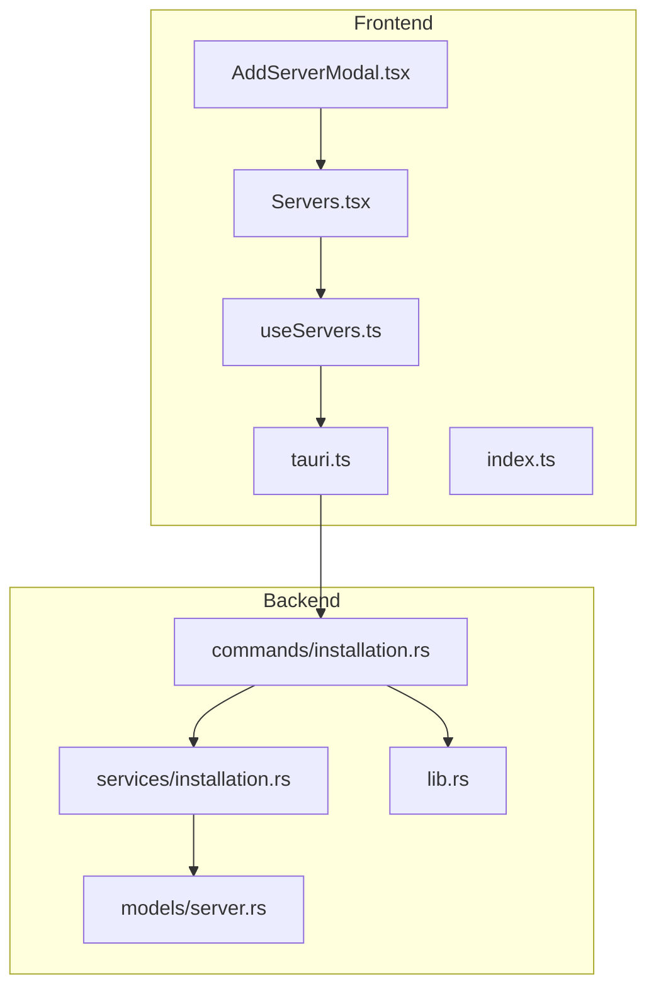
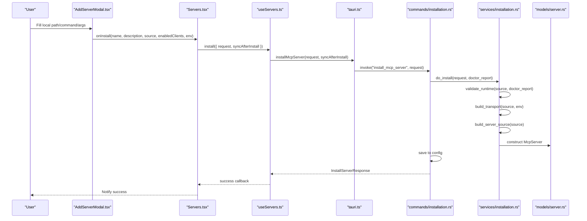
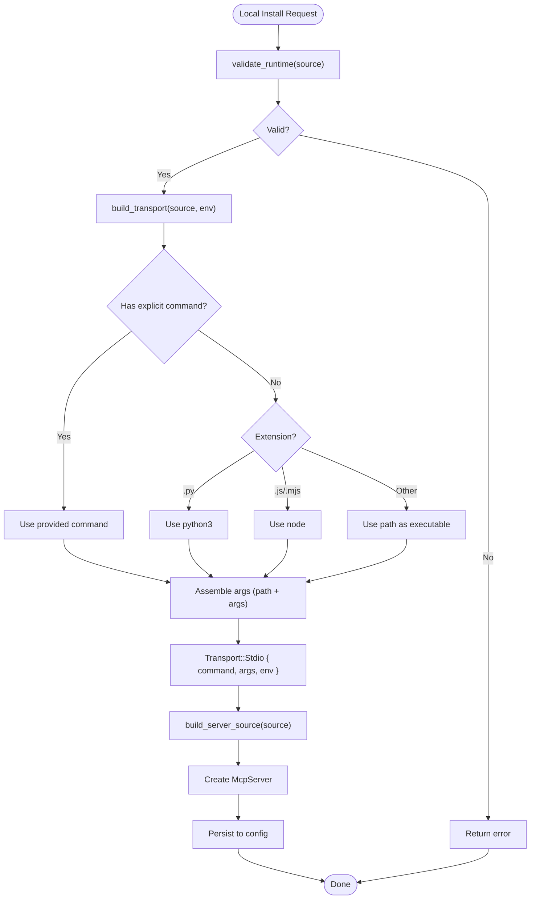
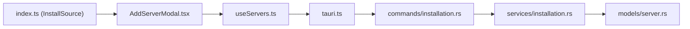

# Local Installation

<cite>
**Referenced Files in This Document**
- [AddServerModal.tsx](file://src/components/servers/AddServerModal.tsx)
- [Servers.tsx](file://src/pages/Servers.tsx)
- [useServers.ts](file://src/hooks/useServers.ts)
- [tauri.ts](file://src/lib/tauri.ts)
- [index.ts](file://src/types/index.ts)
- [installation.rs (commands)](file://src-tauri/src/commands/installation.rs)
- [installation.rs (service)](file://src-tauri/src/services/installation.rs)
- [server.rs (models)](file://src-tauri/src/models/server.rs)
- [lib.rs](file://src-tauri/src/lib.rs)
</cite>

## Table of Contents

1. [Introduction](#introduction)
2. [Project Structure](#project-structure)
3. [Core Components](#core-components)
4. [Architecture Overview](#architecture-overview)
5. [Detailed Component Analysis](#detailed-component-analysis)
6. [Dependency Analysis](#dependency-analysis)
7. [Performance Considerations](#performance-considerations)
8. [Troubleshooting Guide](#troubleshooting-guide)
9. [Conclusion](#conclusion)

## Introduction

This document explains how MCP Nexus installs servers from local paths using the AddServerModal interface and the backend InstallationService. It covers:

- How the frontend captures local path inputs and builds an InstallSource
- Backend validation of local paths and runtime requirements
- Command detection based on file extensions (.py, .js)
- Argument parsing and environment variable injection
- Mapping of InstallSource to McpServer’s ServerSource and Transport models
- Transport configuration building for local sources
- Common issues and troubleshooting steps
- Performance considerations for local server execution

## Project Structure

The local installation flow spans the React frontend and the Tauri/Rust backend:

- Frontend: AddServerModal collects user inputs and constructs an InstallSource payload
- Backend: Tauri commands invoke Rust services to validate, configure, and persist server definitions

**Diagram sources**

- [AddServerModal.tsx](file://src/components/servers/AddServerModal.tsx#L1-L200)
- [Servers.tsx](file://src/pages/Servers.tsx#L180-L230)
- [useServers.ts](file://src/hooks/useServers.ts#L95-L120)
- [tauri.ts](file://src/lib/tauri.ts#L1-L120)
- [installation.rs (commands)](file://src-tauri/src/commands/installation.rs#L90-L135)
- [installation.rs (service)](file://src-tauri/src/services/installation.rs#L334-L453)
- [server.rs (models)](file://src-tauri/src/models/server.rs#L1-L120)
- [lib.rs](file://src-tauri/src/lib.rs#L31-L73)

**Section sources**

- [AddServerModal.tsx](file://src/components/servers/AddServerModal.tsx#L1-L200)
- [Servers.tsx](file://src/pages/Servers.tsx#L180-L230)
- [useServers.ts](file://src/hooks/useServers.ts#L95-L120)
- [tauri.ts](file://src/lib/tauri.ts#L1-L120)
- [installation.rs (commands)](file://src-tauri/src/commands/installation.rs#L90-L135)
- [installation.rs (service)](file://src-tauri/src/services/installation.rs#L334-L453)
- [server.rs (models)](file://src-tauri/src/models/server.rs#L1-L120)
- [lib.rs](file://src-tauri/src/lib.rs#L31-L73)

## Core Components

- AddServerModal.tsx: Presents the “Add Server Manually” form, validates inputs, and emits an InstallSource for local paths with optional command and arguments.
- useServers.ts: Provides a mutation hook to call the install_mcp_server Tauri command.
- tauri.ts: Wraps Tauri invocations for install/uninstall and related operations.
- installation.rs (commands): Implements Tauri commands for install/uninstall and validation, invoking backend service logic.
- installation.rs (service): Contains InstallSource, ServerSource, Transport models and the core install/build logic.
- server.rs (models): Defines McpServer, ServerSource, and Transport enums used by the backend.
- lib.rs: Registers Tauri commands including install_mcp_server.

**Section sources**

- [AddServerModal.tsx](file://src/components/servers/AddServerModal.tsx#L1-L200)
- [useServers.ts](file://src/hooks/useServers.ts#L95-L120)
- [tauri.ts](file://src/lib/tauri.ts#L1-L120)
- [installation.rs (commands)](file://src-tauri/src/commands/installation.rs#L90-L135)
- [installation.rs (service)](file://src-tauri/src/services/installation.rs#L334-L453)
- [server.rs (models)](file://src-tauri/src/models/server.rs#L1-L120)
- [lib.rs](file://src-tauri/src/lib.rs#L31-L73)

## Architecture Overview

End-to-end flow for adding a local server:

**Diagram sources**

- [AddServerModal.tsx](file://src/components/servers/AddServerModal.tsx#L80-L160)
- [Servers.tsx](file://src/pages/Servers.tsx#L192-L224)
- [useServers.ts](file://src/hooks/useServers.ts#L95-L120)
- [tauri.ts](file://src/lib/tauri.ts#L1-L120)
- [installation.rs (commands)](file://src-tauri/src/commands/installation.rs#L90-L135)
- [installation.rs (service)](file://src-tauri/src/services/installation.rs#L480-L520)
- [server.rs (models)](file://src-tauri/src/models/server.rs#L51-L120)

## Detailed Component Analysis

### AddServerModal.tsx: Local Path Input and InstallSource Construction

- Source type selection includes “Local Path”
- Local fields:
  - Path to Script/Command: required for local
  - Command: optional; if omitted, backend detects based on extension
  - Arguments: optional; split by spaces into a string vector
- Environment variables: optional key/value pairs collected and passed to backend
- Validation: requires a non-empty name and a non-empty local path
- Emits onInstall with InstallSource of type “local”

Key behaviors:

- Builds InstallSource.local with path, optional command, and parsed args
- Converts envVars into a record and passes to onInstall

**Section sources**

- [AddServerModal.tsx](file://src/components/servers/AddServerModal.tsx#L18-L35)
- [AddServerModal.tsx](file://src/components/servers/AddServerModal.tsx#L44-L76)
- [AddServerModal.tsx](file://src/components/servers/AddServerModal.tsx#L83-L163)
- [AddServerModal.tsx](file://src/components/servers/AddServerModal.tsx#L197-L215)

### Servers.tsx and useServers.ts: Frontend Integration

- Servers page opens AddServerModal and wires onInstall to a mutation
- useServers.ts exposes useInstallServer which wraps installMcpServer
- On success, the page resets the modal and notifies success

**Section sources**

- [Servers.tsx](file://src/pages/Servers.tsx#L192-L224)
- [useServers.ts](file://src/hooks/useServers.ts#L95-L120)

### tauri.ts: Tauri Command Wrappers

- installMcpServer invokes the Tauri command with the InstallServerRequest
- Uninstall and related commands are similarly wrapped

**Section sources**

- [tauri.ts](file://src/lib/tauri.ts#L1-L120)

### Backend Commands: installation.rs (commands)

- install_mcp_server:
  - Runs doctor to check environment
  - Calls do_install from services
  - Persists server via config manager
  - Optionally syncs to clients
- uninstall_mcp_server:
  - Removes server from config
  - Optionally cleans up resources
- validate_install:
  - Validates runtime requirements without installing

**Section sources**

- [installation.rs (commands)](file://src-tauri/src/commands/installation.rs#L90-L135)
- [installation.rs (commands)](file://src-tauri/src/commands/installation.rs#L137-L192)
- [installation.rs (commands)](file://src-tauri/src/commands/installation.rs#L194-L227)

### Backend Service: installation.rs (service)

- InstallSource enum defines local, npm, uvx, github, docker, remote variants
- validate_runtime enforces environment prerequisites:
  - Local: checks path existence
  - Remote: validates URL scheme
  - Others: checks presence of runtime tools
- build_transport for local:
  - Detects command from extension:
    - .py -> python3
    - .js/.mjs -> node
    - Otherwise -> treat path as executable
  - Constructs Transport::Stdio with command, args, and env
- build_server_source maps InstallSource::Local to ServerSource::Local
- install_server:
  - Validates runtime
  - For GitHub sources, clones and sets up
  - Builds Transport and ServerSource
  - Creates McpServer and enables for selected clients

**Diagram sources**

- [installation.rs (service)](file://src-tauri/src/services/installation.rs#L124-L183)
- [installation.rs (service)](file://src-tauri/src/services/installation.rs#L334-L453)
- [installation.rs (service)](file://src-tauri/src/services/installation.rs#L455-L477)
- [installation.rs (service)](file://src-tauri/src/services/installation.rs#L480-L520)

**Section sources**

- [installation.rs (service)](file://src-tauri/src/services/installation.rs#L124-L183)
- [installation.rs (service)](file://src-tauri/src/services/installation.rs#L334-L453)
- [installation.rs (service)](file://src-tauri/src/services/installation.rs#L455-L477)
- [installation.rs (service)](file://src-tauri/src/services/installation.rs#L480-L520)

### Models: ServerSource and Transport

- ServerSource::Local maps InstallSource::Local to McpServer.source
- Transport::Stdio carries command, args, and env for process execution
- Transport::Sse is used for remote sources

**Section sources**

- [server.rs (models)](file://src-tauri/src/models/server.rs#L1-L120)

### Command Registration

- lib.rs registers install_mcp_server and related commands

**Section sources**

- [lib.rs](file://src-tauri/src/lib.rs#L31-L73)

## Dependency Analysis

- Frontend depends on types and Tauri wrappers
- Tauri commands depend on service logic
- Service logic depends on models and external tools detection

**Diagram sources**

- [index.ts](file://src/types/index.ts#L253-L262)
- [AddServerModal.tsx](file://src/components/servers/AddServerModal.tsx#L1-L200)
- [useServers.ts](file://src/hooks/useServers.ts#L95-L120)
- [tauri.ts](file://src/lib/tauri.ts#L1-L120)
- [installation.rs (commands)](file://src-tauri/src/commands/installation.rs#L90-L135)
- [installation.rs (service)](file://src-tauri/src/services/installation.rs#L334-L453)
- [server.rs (models)](file://src-tauri/src/models/server.rs#L1-L120)

**Section sources**

- [index.ts](file://src/types/index.ts#L253-L262)
- [AddServerModal.tsx](file://src/components/servers/AddServerModal.tsx#L1-L200)
- [useServers.ts](file://src/hooks/useServers.ts#L95-L120)
- [tauri.ts](file://src/lib/tauri.ts#L1-L120)
- [installation.rs (commands)](file://src-tauri/src/commands/installation.rs#L90-L135)
- [installation.rs (service)](file://src-tauri/src/services/installation.rs#L334-L453)
- [server.rs (models)](file://src-tauri/src/models/server.rs#L1-L120)

## Performance Considerations

- Local server startup cost:
  - Node.js and Python processes incur startup overhead; consider using uvx for Python packages to reduce cold-start latency.
- Argument parsing:
  - Splitting arguments by spaces is O(n) per submission; keep arg lists concise.
- Environment variables:
  - Large env maps increase process spawn overhead; only pass required variables.
- Transport:
  - Stdio transport is lightweight; avoid unnecessary Docker or remote transports for local scripts.
- Disk I/O:
  - Local scripts should be placed on fast disks; avoid network-mounted paths for frequent execution.

[No sources needed since this section provides general guidance]

## Troubleshooting Guide

Common issues and resolutions for local installation:

- Invalid local path
  - Symptom: Installation fails with a path-related error.
  - Cause: Path does not exist or is inaccessible.
  - Resolution: Verify the path exists and is readable/executable. Use absolute paths when possible.
  - Evidence: validate_runtime checks path existence for InstallSource::Local.

- Missing runtime dependencies
  - Symptom: Installation fails due to missing runtime.
  - Causes:
    - Node.js for JavaScript files
    - Python or uv for Python files
    - Git for GitHub sources
  - Resolution: Install the required runtime and re-run validation.
  - Evidence: validate_runtime enforces runtime presence for each source type.

- Permission errors
  - Symptom: Process fails to start or exits immediately.
  - Causes: Insufficient permissions for script or interpreter.
  - Resolution: Ensure the script and interpreter have execute permissions; run under appropriate user context.

- Incorrect command detection
  - Symptom: Wrong interpreter runs the script.
  - Cause: Extension mismatch or missing explicit command.
  - Resolution: Explicitly set the Command field in the form to override automatic detection.

- Environment variables not injected
  - Symptom: Script runs without expected environment.
  - Cause: Env vars not passed or not used by the script.
  - Resolution: Confirm env vars are included in the InstallSource.env payload and referenced by the script.

- Remote URL validation failures
  - Symptom: Remote source rejected due to invalid URL.
  - Resolution: Ensure URL starts with http:// or https://.

**Section sources**

- [installation.rs (service)](file://src-tauri/src/services/installation.rs#L124-L183)
- [installation.rs (service)](file://src-tauri/src/services/installation.rs#L740-L756)
- [installation.rs (commands)](file://src-tauri/src/commands/installation.rs#L194-L227)

## Conclusion

MCP Nexus provides a robust pipeline for installing local servers:

- The AddServerModal captures user inputs and constructs an InstallSource
- The backend validates prerequisites, detects commands by extension, injects environment variables, and builds Transport::Stdio
- InstallSource maps cleanly to ServerSource and McpServer, enabling consistent configuration persistence and client synchronization

By following the validation and troubleshooting guidance here, you can reliably add and run local MCP servers with minimal friction.
