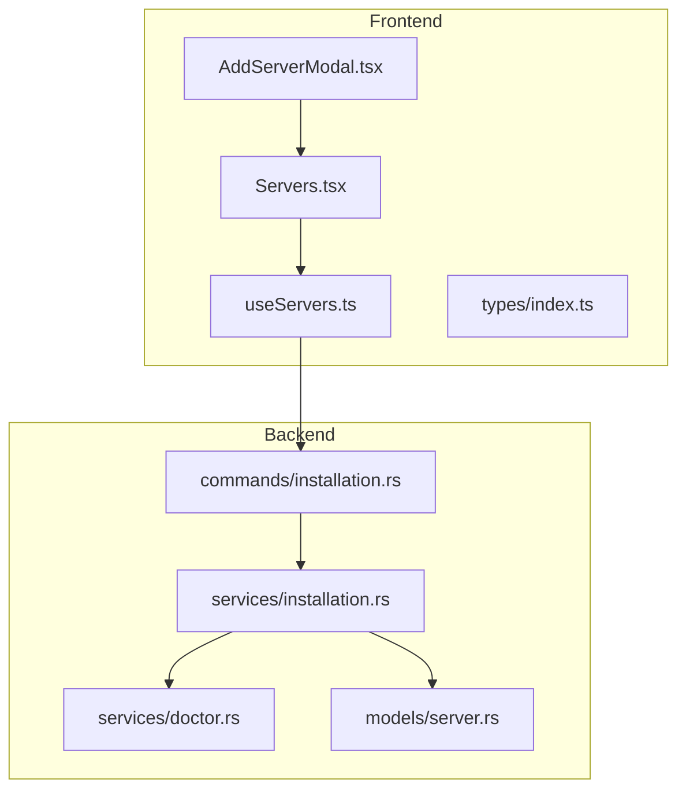
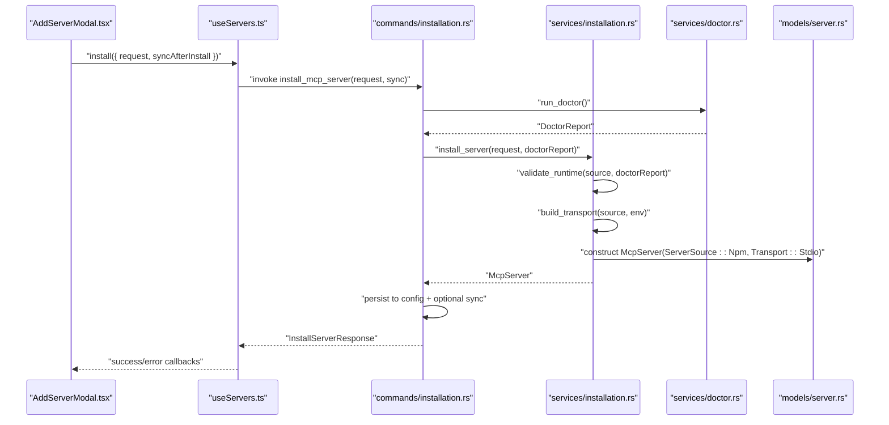
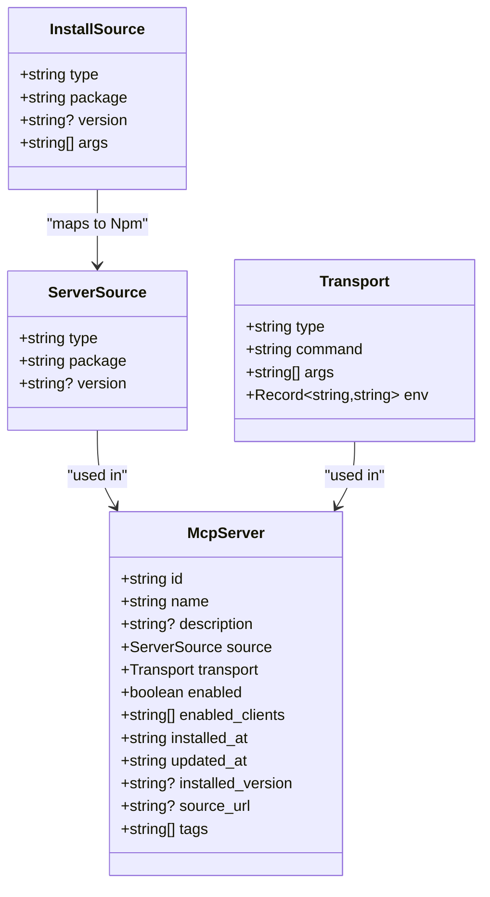
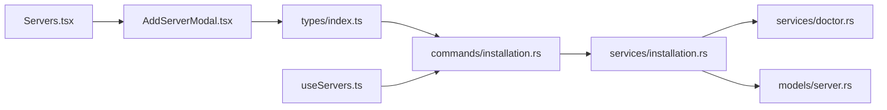

# NPM Installation

<cite>
**Referenced Files in This Document**
- [AddServerModal.tsx](file://src/components/servers/AddServerModal.tsx)
- [Servers.tsx](file://src/pages/Servers.tsx)
- [useServers.ts](file://src/hooks/useServers.ts)
- [index.ts](file://src/types/index.ts)
- [installation.rs](file://src-tauri/src/services/installation.rs)
- [installation.rs (commands)](file://src-tauri/src/commands/installation.rs)
- [server.rs](file://src-tauri/src/models/server.rs)
- [doctor.rs](file://src-tauri/src/services/doctor.rs)
</cite>

## Table of Contents

1. [Introduction](#introduction)
2. [Project Structure](#project-structure)
3. [Core Components](#core-components)
4. [Architecture Overview](#architecture-overview)
5. [Detailed Component Analysis](#detailed-component-analysis)
6. [Dependency Analysis](#dependency-analysis)
7. [Performance Considerations](#performance-considerations)
8. [Troubleshooting Guide](#troubleshooting-guide)
9. [Conclusion](#conclusion)

## Introduction

This document explains how NPM package installation works in MCP Nexus. It covers the frontend AddServerModal interface, the backend InstallationService, Node.js runtime validation, package installation via npx, version specification, and argument handling. It also details how the InstallSource enum maps to McpServer’s ServerSource and Transport models, how transport configuration is built for npm sources, and how environment variables are injected. Finally, it provides troubleshooting guidance for common issues and performance considerations.

## Project Structure

The NPM installation flow spans the frontend UI and the Tauri backend:

- Frontend: AddServerModal collects user input and invokes the install mutation.
- Backend: Commands orchestrate installation, validate runtimes, build transports, and persist configuration.
- Models: Define InstallSource, ServerSource, and Transport structures used across the stack.

**Diagram sources**

- [AddServerModal.tsx](file://src/components/servers/AddServerModal.tsx#L1-L200)
- [Servers.tsx](file://src/pages/Servers.tsx#L180-L225)
- [useServers.ts](file://src/hooks/useServers.ts#L95-L112)
- [index.ts](file://src/types/index.ts#L255-L262)
- [installation.rs (commands)](file://src-tauri/src/commands/installation.rs#L90-L135)
- [installation.rs](file://src-tauri/src/services/installation.rs#L124-L183)
- [doctor.rs](file://src-tauri/src/services/doctor.rs#L1-L53)
- [server.rs](file://src-tauri/src/models/server.rs#L1-L49)

**Section sources**

- [AddServerModal.tsx](file://src/components/servers/AddServerModal.tsx#L1-L200)
- [Servers.tsx](file://src/pages/Servers.tsx#L180-L225)
- [useServers.ts](file://src/hooks/useServers.ts#L95-L112)
- [index.ts](file://src/types/index.ts#L255-L262)
- [installation.rs (commands)](file://src-tauri/src/commands/installation.rs#L90-L135)
- [installation.rs](file://src-tauri/src/services/installation.rs#L124-L183)
- [doctor.rs](file://src-tauri/src/services/doctor.rs#L1-L53)
- [server.rs](file://src-tauri/src/models/server.rs#L1-L49)

## Core Components

- AddServerModal.tsx: Presents the “Add Server Manually” form, including an “NPM Package” source type. It builds an InstallSource object with package and optional args, collects environment variables, and triggers installation.
- useServers.ts: Provides the install mutation that calls the backend install_mcp_server command.
- installation.rs (commands): Implements the Tauri command handlers for install/uninstall/validate/check_runtime_for_registry, invoking backend services.
- installation.rs (service): Validates runtime requirements, builds transport and server source, and constructs the McpServer model.
- server.rs: Defines McpServer, ServerSource, and Transport models used by the backend.
- doctor.rs: Detects Node.js, Python, uv, Docker, and git availability and reports versions.

**Section sources**

- [AddServerModal.tsx](file://src/components/servers/AddServerModal.tsx#L83-L131)
- [useServers.ts](file://src/hooks/useServers.ts#L95-L112)
- [installation.rs (commands)](file://src-tauri/src/commands/installation.rs#L90-L135)
- [installation.rs](file://src-tauri/src/services/installation.rs#L334-L453)
- [server.rs](file://src-tauri/src/models/server.rs#L1-L49)
- [doctor.rs](file://src-tauri/src/services/doctor.rs#L1-L53)

## Architecture Overview

The NPM installation pipeline:

1. User selects “NPM Package” in AddServerModal and submits.
2. Frontend converts form inputs into InstallSource and calls install mutation.
3. Backend command validates environment via doctor and delegates to service.
4. Service validates runtime (Node.js required), builds Transport::Stdio with npx, and constructs McpServer with ServerSource::Npm.
5. Service persists server and optionally syncs to clients.

**Diagram sources**

- [AddServerModal.tsx](file://src/components/servers/AddServerModal.tsx#L83-L131)
- [useServers.ts](file://src/hooks/useServers.ts#L95-L112)
- [installation.rs (commands)](file://src-tauri/src/commands/installation.rs#L90-L135)
- [installation.rs](file://src-tauri/src/services/installation.rs#L124-L183)
- [doctor.rs](file://src-tauri/src/services/doctor.rs#L1-L53)
- [server.rs](file://src-tauri/src/models/server.rs#L1-L49)

## Detailed Component Analysis

### AddServerModal.tsx: NPM form handling and InstallSource construction

- Source type selection includes “NPM Package.”
- NPM-specific fields: package name and optional arguments.
- Environment variables are collected as key/value pairs.
- Form submission builds an InstallSource with:
  - type: "npm"
  - package: user-provided package name
  - args: optional arguments split from user input
- The modal passes env variables to the installer.

Implementation highlights:

- NPM form fields and validation: [AddServerModal.tsx](file://src/components/servers/AddServerModal.tsx#L372-L400)
- InstallSource construction for npm: [AddServerModal.tsx](file://src/components/servers/AddServerModal.tsx#L103-L108)
- Environment variable collection: [AddServerModal.tsx](file://src/components/servers/AddServerModal.tsx#L133-L139)

**Section sources**

- [AddServerModal.tsx](file://src/components/servers/AddServerModal.tsx#L372-L400)
- [AddServerModal.tsx](file://src/components/servers/AddServerModal.tsx#L103-L108)
- [AddServerModal.tsx](file://src/components/servers/AddServerModal.tsx#L133-L139)

### Servers.tsx and useServers.ts: Triggering installation

- Servers page opens AddServerModal and wires the onInstall callback to the install mutation.
- The install mutation calls install_mcp_server with the request and optional sync flag.
- Success and error notifications are handled in the page.

Key paths:

- Install mutation wiring: [useServers.ts](file://src/hooks/useServers.ts#L95-L112)
- Install invocation from UI: [Servers.tsx](file://src/pages/Servers.tsx#L192-L224)

**Section sources**

- [useServers.ts](file://src/hooks/useServers.ts#L95-L112)
- [Servers.tsx](file://src/pages/Servers.tsx#L192-L224)

### Backend InstallationService: Runtime validation, transport, and server creation

- validate_runtime(source, doctor_report):
  - For npm sources, requires Node.js presence; otherwise returns MissingRuntime error.
- build_transport(source, env):
  - For npm: Transport::Stdio with command "npx" and args ["-y", package, ...args], plus env.
- build_server_source(source):
  - For npm: ServerSource::Npm { package, version? }.
- install_server(request, doctor_report):
  - Validates runtime, builds transport and server source, creates McpServer, enables for selected clients, and returns it.

Key paths:

- Runtime validation (npm requires Node.js): [installation.rs](file://src-tauri/src/services/installation.rs#L124-L183)
- Transport building for npm: [installation.rs](file://src-tauri/src/services/installation.rs#L334-L346)
- ServerSource mapping for npm: [installation.rs](file://src-tauri/src/services/installation.rs#L455-L477)
- Server creation and enabling clients: [installation.rs](file://src-tauri/src/services/installation.rs#L479-L520)

**Section sources**

- [installation.rs](file://src-tauri/src/services/installation.rs#L124-L183)
- [installation.rs](file://src-tauri/src/services/installation.rs#L334-L346)
- [installation.rs](file://src-tauri/src/services/installation.rs#L455-L477)
- [installation.rs](file://src-tauri/src/services/installation.rs#L479-L520)

### Models: InstallSource, ServerSource, Transport

- InstallSource (frontend types):
  - npm: { type: "npm", package: string, version?: string, args?: string[] }
- ServerSource (backend model):
  - Npm { package: string, version?: string }
- Transport (backend model):
  - Stdio { command: string, args: string[], env: Record<string, string> }
  - Sse { url: string, headers: Record<string, string> }

Mapping:

- InstallSource.npm -> ServerSource.Npm
- InstallSource.npm -> Transport.Stdio (npx) with args and env

Key paths:

- Frontend InstallSource types: [index.ts](file://src/types/index.ts#L255-L262)
- Backend ServerSource enum: [server.rs](file://src-tauri/src/models/server.rs#L1-L29)
- Backend Transport enum: [server.rs](file://src-tauri/src/models/server.rs#L31-L49)

**Section sources**

- [index.ts](file://src/types/index.ts#L255-L262)
- [server.rs](file://src-tauri/src/models/server.rs#L1-L29)
- [server.rs](file://src-tauri/src/models/server.rs#L31-L49)

### Transport configuration for npm sources

- Command: "npx"
- Args: ["-y", package, ...args]
- Env: copied from request.env into Transport.env
- This ensures the server is launched via npx with user-provided arguments and environment variables.

Key path:

- Transport building for npm: [installation.rs](file://src-tauri/src/services/installation.rs#L334-L346)

**Section sources**

- [installation.rs](file://src-tauri/src/services/installation.rs#L334-L346)

### Version specification and argument handling

- Version:
  - InstallSource supports version for npm; extract_version pulls it into McpServer.installed_version.
- Arguments:
  - AddServerModal splits user-provided args by spaces and filters empty tokens.
  - These args are passed to npx via Transport.args.

Key paths:

- Version extraction: [installation.rs](file://src-tauri/src/services/installation.rs#L522-L528)
- Argument splitting in modal: [AddServerModal.tsx](file://src/components/servers/AddServerModal.tsx#L93-L95)
- Transport args composition: [installation.rs](file://src-tauri/src/services/installation.rs#L334-L346)

**Section sources**

- [installation.rs](file://src-tauri/src/services/installation.rs#L522-L528)
- [AddServerModal.tsx](file://src/components/servers/AddServerModal.tsx#L93-L95)
- [installation.rs](file://src-tauri/src/services/installation.rs#L334-L346)

### Node.js runtime validation

- doctor.rs detects Node.js presence and version, reporting via DoctorReport.
- validate_runtime(source, doctor_report) enforces Node.js requirement for npm sources.

Key paths:

- Doctor detection: [doctor.rs](file://src-tauri/src/services/doctor.rs#L1-L53)
- Runtime validation for npm: [installation.rs](file://src-tauri/src/services/installation.rs#L124-L137)

**Section sources**

- [doctor.rs](file://src-tauri/src/services/doctor.rs#L1-L53)
- [installation.rs](file://src-tauri/src/services/installation.rs#L124-L137)

### Class diagram: Models and enums

**Diagram sources**

- [index.ts](file://src/types/index.ts#L255-L262)
- [server.rs](file://src-tauri/src/models/server.rs#L1-L49)

## Dependency Analysis

- Frontend depends on types for InstallSource and InstallServerRequest.
- Backend commands depend on services for installation and doctor.
- Services depend on models for McpServer, ServerSource, and Transport.
- Runtime validation depends on doctor detection.

**Diagram sources**

- [index.ts](file://src/types/index.ts#L255-L262)
- [AddServerModal.tsx](file://src/components/servers/AddServerModal.tsx#L1-L200)
- [Servers.tsx](file://src/pages/Servers.tsx#L180-L225)
- [useServers.ts](file://src/hooks/useServers.ts#L95-L112)
- [installation.rs (commands)](file://src-tauri/src/commands/installation.rs#L90-L135)
- [installation.rs](file://src-tauri/src/services/installation.rs#L124-L183)
- [doctor.rs](file://src-tauri/src/services/doctor.rs#L1-L53)
- [server.rs](file://src-tauri/src/models/server.rs#L1-L49)

**Section sources**

- [index.ts](file://src/types/index.ts#L255-L262)
- [AddServerModal.tsx](file://src/components/servers/AddServerModal.tsx#L1-L200)
- [Servers.tsx](file://src/pages/Servers.tsx#L180-L225)
- [useServers.ts](file://src/hooks/useServers.ts#L95-L112)
- [installation.rs (commands)](file://src-tauri/src/commands/installation.rs#L90-L135)
- [installation.rs](file://src-tauri/src/services/installation.rs#L124-L183)
- [doctor.rs](file://src-tauri/src/services/doctor.rs#L1-L53)
- [server.rs](file://src-tauri/src/models/server.rs#L1-L49)

## Performance Considerations

- Network and registry latency: Installing via npx may incur network overhead; consider caching or pre-warming registries where applicable.
- Dependency resolution: npm/yarn/pnpm installs can be slow; ensure a clean lockfile and minimal dev dependencies for faster installs.
- Environment variable propagation: Passing env via Transport.env avoids extra shell layers and reduces startup overhead.
- Validation cost: doctor checks are lightweight but avoid repeated invocations by reusing DoctorReport across operations.

[No sources needed since this section provides general guidance]

## Troubleshooting Guide

Common issues and resolutions:

- Missing Node.js runtime
  - Symptom: Installation fails with a runtime requirement error for Node.js.
  - Cause: validate_runtime detects absence of Node.js.
  - Resolution: Install Node.js via nvm or from the official site; doctor will detect it automatically.
  - References:
    - Runtime validation: [installation.rs](file://src-tauri/src/services/installation.rs#L124-L137)
    - Doctor detection: [doctor.rs](file://src-tauri/src/services/doctor.rs#L1-L53)

- Network connectivity problems
  - Symptom: npx install fails due to network errors.
  - Cause: Registry unavailability or proxy restrictions.
  - Resolution: Configure npm registry and proxy settings; retry installation; consider offline mirrors.
  - References:
    - Transport uses npx: [installation.rs](file://src-tauri/src/services/installation.rs#L334-L346)

- Package compatibility issues
  - Symptom: Server crashes or fails to start after installation.
  - Cause: Mismatched Node.js version or incompatible dependencies.
  - Resolution: Align Node.js version with the package’s requirements; review package.json and logs.
  - References:
    - Transport args and env: [installation.rs](file://src-tauri/src/services/installation.rs#L334-L346)

- Invalid arguments or malformed package name
  - Symptom: Form submission blocked or runtime error.
  - Cause: Empty package name or invalid args.
  - Resolution: Ensure package name is present and args are properly formatted; the modal filters empty tokens.
  - References:
    - Argument filtering: [AddServerModal.tsx](file://src/components/servers/AddServerModal.tsx#L93-L95)
    - Form validation: [AddServerModal.tsx](file://src/components/servers/AddServerModal.tsx#L197-L214)

- Environment variables not applied
  - Symptom: Server runs without expected configuration.
  - Cause: Missing env mapping or incorrect keys.
  - Resolution: Confirm env variables are added in the modal and appear in Transport.env.
  - References:
    - Env injection: [installation.rs](file://src-tauri/src/services/installation.rs#L334-L346)

- Version mismatch
  - Symptom: Installed version differs from expectation.
  - Cause: Version not specified or extracted incorrectly.
  - Resolution: Provide version in InstallSource; verify installed_version in McpServer.
  - References:
    - Version extraction: [installation.rs](file://src-tauri/src/services/installation.rs#L522-L528)

**Section sources**

- [installation.rs](file://src-tauri/src/services/installation.rs#L124-L137)
- [doctor.rs](file://src-tauri/src/services/doctor.rs#L1-L53)
- [AddServerModal.tsx](file://src/components/servers/AddServerModal.tsx#L93-L95)
- [AddServerModal.tsx](file://src/components/servers/AddServerModal.tsx#L197-L214)
- [installation.rs](file://src-tauri/src/services/installation.rs#L334-L346)
- [installation.rs](file://src-tauri/src/services/installation.rs#L522-L528)

## Conclusion

MCP Nexus integrates NPM package installation through a clear frontend/backend flow. The AddServerModal captures package and arguments, the backend validates Node.js availability, builds a Transport::Stdio using npx, and persists a McpServer with ServerSource::Npm. Environment variables are injected into the spawned process, and version information is tracked. By following the troubleshooting steps and performance tips, users can reliably install and run NPM-based MCP servers.
