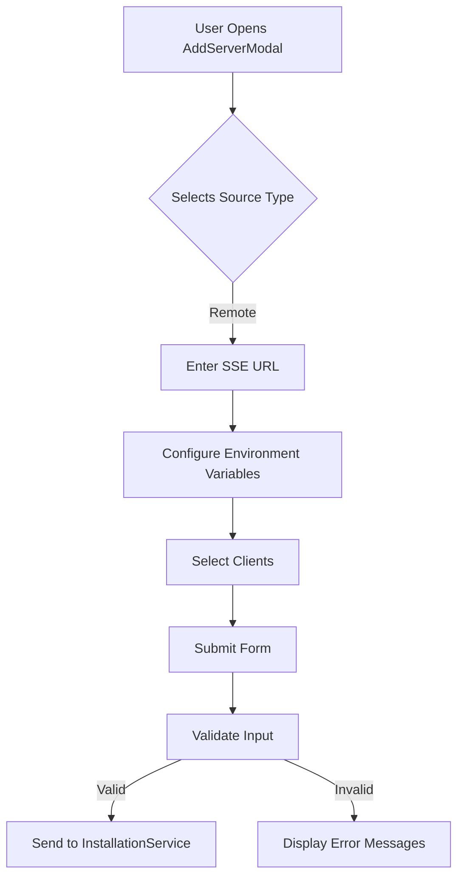
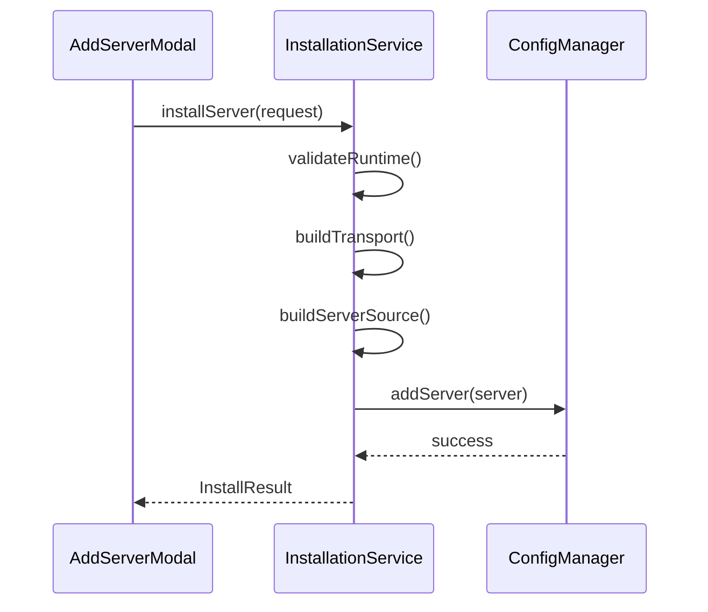
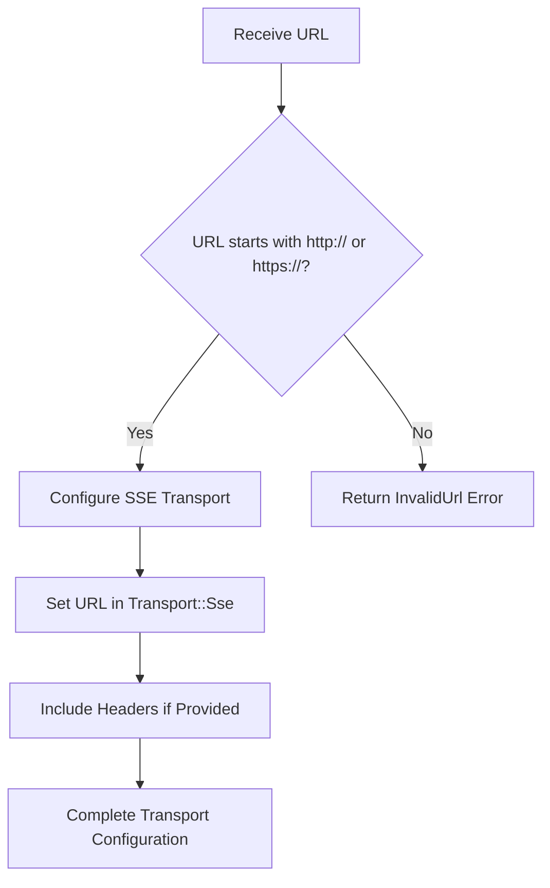
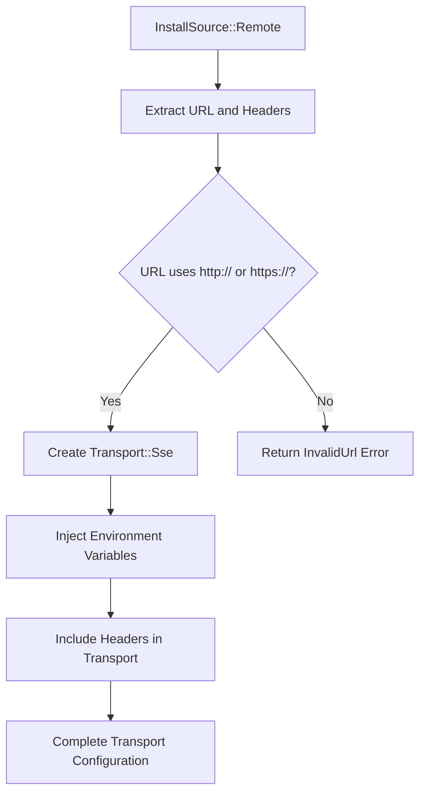

# Remote Installation

<cite>
**Referenced Files in This Document**   
- [AddServerModal.tsx](file://src/components/servers/AddServerModal.tsx)
- [installation.rs](file://src-tauri/src/services/installation.rs)
- [installation.rs](file://src-tauri/src/commands/installation.rs)
- [server.rs](file://src-tauri/src/models/server.rs)
- [index.ts](file://src/types/index.ts)
</cite>

## Table of Contents

1. [Introduction](#introduction)
2. [Remote Server Installation Process](#remote-server-installation-process)
3. [AddServerModal Interface](#addservermodal-interface)
4. [Installation Service Implementation](#installation-service-implementation)
5. [URL Validation and SSE Transport](#url-validation-and-sse-transport)
6. [InstallSource to Server Mapping](#installsource-to-server-mapping)
7. [Transport Configuration Building](#transport-configuration-building)
8. [Common Issues and Troubleshooting](#common-issues-and-troubleshooting)
9. [Performance Considerations](#performance-considerations)
10. [Conclusion](#conclusion)

## Introduction

This document provides comprehensive documentation for the remote server installation process in MCP Nexus. It details the implementation of connecting to remote SSE-based servers through the AddServerModal interface and backend InstallationService. The documentation covers URL validation, SSE transport configuration, header management, and the mapping between InstallSource enum and McpServer's ServerSource and Transport models. It also addresses common issues such as invalid URLs, network connectivity problems, and authentication errors, with specific troubleshooting guidance. Performance considerations for remote server communication and latency optimization are included to ensure optimal user experience.

## Remote Server Installation Process

The remote server installation process in MCP Nexus enables users to connect to SSE-based servers through a streamlined interface and robust backend service. This process involves the AddServerModal component for user interaction and the InstallationService for backend processing. When a user selects the "SSE/Remote URL" option, they are prompted to enter the SSE endpoint URL for the remote MCP server. The system validates the URL format, ensuring it starts with "http://" or "https://", and configures the transport mechanism accordingly. The installation process creates an McpServer object with the appropriate ServerSource and Transport configurations, enabling seamless communication with the remote server.

**Section sources**

- [AddServerModal.tsx](file://src/components/servers/AddServerModal.tsx#L1-L654)
- [installation.rs](file://src-tauri/src/services/installation.rs#L1-L822)

## AddServerModal Interface

The AddServerModal interface provides a user-friendly way to add remote servers to MCP Nexus. When the user selects the "SSE/Remote URL" source type, the modal displays a dedicated field for entering the SSE endpoint URL. This field is validated to ensure it contains a properly formatted URL. The interface also allows users to configure environment variables and select clients for which the server should be enabled. The modal's form validation ensures that all required fields are filled before submission, preventing incomplete server configurations.



**Diagram sources**

- [AddServerModal.tsx](file://src/components/servers/AddServerModal.tsx#L1-L654)

**Section sources**

- [AddServerModal.tsx](file://src/components/servers/AddServerModal.tsx#L1-L654)

## Installation Service Implementation

The InstallationService in MCP Nexus handles the backend processing of server installations, including remote SSE-based servers. The service validates the installation request, creates the appropriate McpServer object, and saves it to the central configuration. For remote servers, the service configures the transport mechanism as SSE, using the provided URL and headers. The installation process also handles environment variable injection and secure connection handling, ensuring that the server can communicate securely with the remote endpoint.



**Diagram sources**

- [installation.rs](file://src-tauri/src/services/installation.rs#L1-L822)
- [installation.rs](file://src-tauri/src/commands/installation.rs#L1-L288)

**Section sources**

- [installation.rs](file://src-tauri/src/services/installation.rs#L1-L822)
- [installation.rs](file://src-tauri/src/commands/installation.rs#L1-L288)

## URL Validation and SSE Transport

The URL validation process for remote server installation ensures that the provided SSE endpoint URL is properly formatted. The system checks that the URL starts with "http://" or "https://", rejecting invalid URLs with an appropriate error message. For SSE transport configuration, the system creates a Transport::Sse object with the provided URL and headers. This configuration enables the MCP server to establish a persistent connection with the remote endpoint, facilitating real-time communication through Server-Sent Events.



**Diagram sources**

- [installation.rs](file://src-tauri/src/services/installation.rs#L1-L822)

**Section sources**

- [installation.rs](file://src-tauri/src/services/installation.rs#L1-L822)

## InstallSource to Server Mapping

The mapping between InstallSource enum and McpServer's ServerSource and Transport models is a crucial part of the remote server installation process. When a user selects the "remote" source type, the InstallSource::Remote variant is created with the provided URL and headers. This is then mapped to the ServerSource::Remote and Transport::Sse models, creating a complete configuration for the remote server. This mapping ensures that the server is properly configured for SSE-based communication with the remote endpoint.

```mermaid
classDiagram
class InstallSource {
+Remote { url : String, headers : HashMap<String, String> }
}
class ServerSource {
+Remote { url : String }
}
class Transport {
+Sse { url : String, headers : HashMap<String, String> }
}
InstallSource --> ServerSource : build_server_source()
InstallSource --> Transport : build_transport()
```

**Diagram sources**

- [installation.rs](file://src-tauri/src/services/installation.rs#L1-L822)
- [server.rs](file://src-tauri/src/models/server.rs#L1-L232)

**Section sources**

- [installation.rs](file://src-tauri/src/services/installation.rs#L1-L822)
- [server.rs](file://src-tauri/src/models/server.rs#L1-L232)

## Transport Configuration Building

The transport configuration building logic for remote sources involves creating a Transport::Sse object with the provided URL and headers. The system injects environment variables into the transport configuration, allowing for secure connection handling and dynamic configuration. For remote sources, the URL is validated to ensure it uses a secure protocol, and any provided headers are included in the SSE requests. This configuration enables the MCP server to establish a secure and reliable connection with the remote endpoint.



**Diagram sources**

- [installation.rs](file://src-tauri/src/services/installation.rs#L1-L822)

**Section sources**

- [installation.rs](file://src-tauri/src/services/installation.rs#L1-L822)

## Common Issues and Troubleshooting

Common issues during remote server installation include invalid URLs, network connectivity problems, and authentication errors. Invalid URLs are typically caused by missing "http://" or "https://" prefixes, which can be resolved by ensuring the URL is properly formatted. Network connectivity problems may occur if the remote server is unreachable or if there are firewall restrictions, which can be addressed by checking network settings and ensuring the server is accessible. Authentication errors can arise from incorrect headers or credentials, which can be resolved by verifying the provided authentication information and ensuring it matches the remote server's requirements.

**Troubleshooting Guide:**

- **Invalid URL**: Ensure the URL starts with "http://" or "https://"
- **Network Connectivity**: Verify the remote server is reachable and check firewall settings
- **Authentication Errors**: Confirm headers and credentials are correct and properly formatted
- **SSE Connection Issues**: Check that the remote server supports SSE and the endpoint is correct

**Section sources**

- [installation.rs](file://src-tauri/src/services/installation.rs#L1-L822)
- [AddServerModal.tsx](file://src/components/servers/AddServerModal.tsx#L1-L654)

## Performance Considerations

Performance considerations for remote server communication focus on optimizing latency and ensuring reliable connections. The use of SSE (Server-Sent Events) provides a persistent connection that reduces the overhead of repeated HTTP requests, improving communication efficiency. To further optimize performance, the system should implement connection pooling, efficient error handling, and proper timeout management. Additionally, minimizing the size of transmitted data and using compression when appropriate can help reduce latency and improve overall performance.

**Performance Optimization Strategies:**

- Implement connection pooling to reduce connection establishment overhead
- Use efficient error handling to minimize downtime and reconnection attempts
- Set appropriate timeouts to prevent hanging connections
- Minimize data size through efficient serialization and compression
- Monitor connection health and implement automatic reconnection when necessary

**Section sources**

- [installation.rs](file://src-tauri/src/services/installation.rs#L1-L822)

## Conclusion

The remote server installation process in MCP Nexus provides a robust and user-friendly way to connect to SSE-based servers. Through the AddServerModal interface and InstallationService, users can easily configure and validate remote server connections. The system's comprehensive URL validation, SSE transport configuration, and header management ensure secure and reliable communication with remote endpoints. By addressing common issues and implementing performance optimizations, MCP Nexus delivers a seamless experience for managing remote MCP servers.
