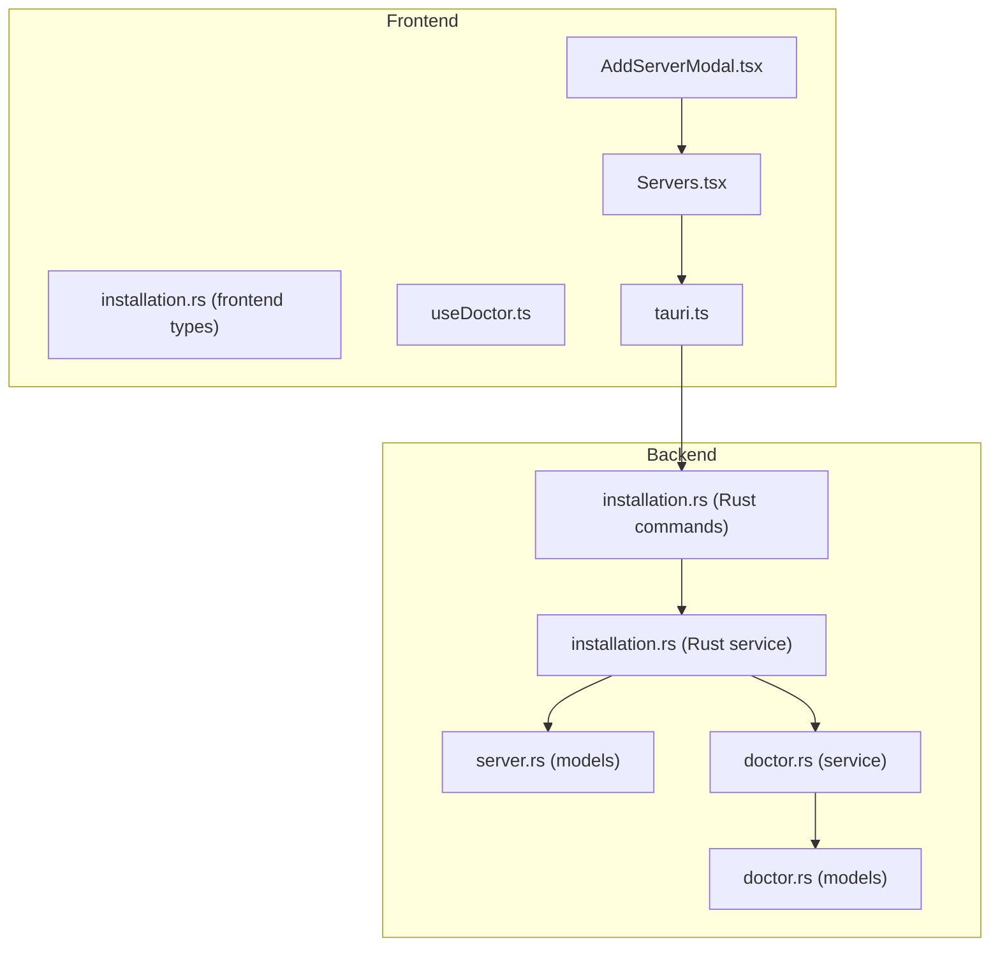
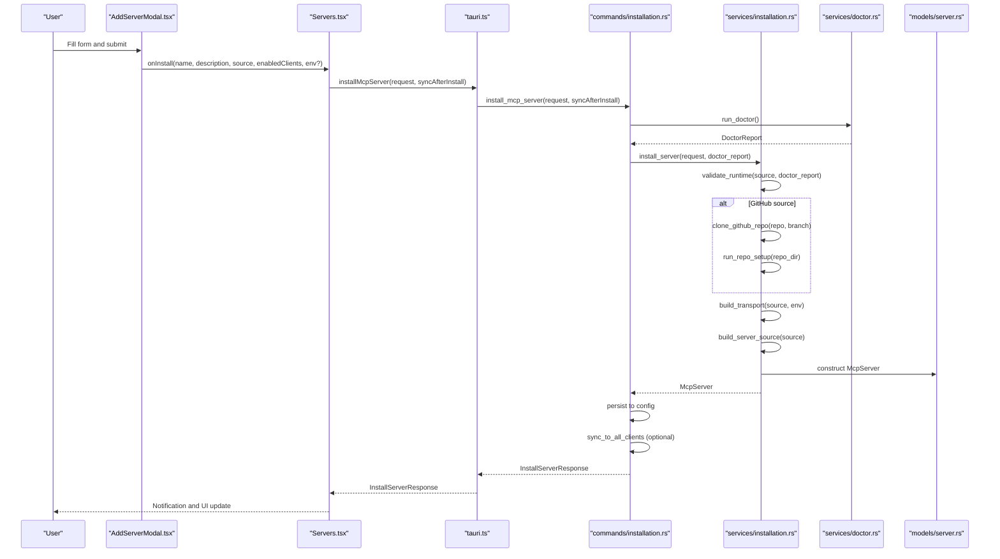
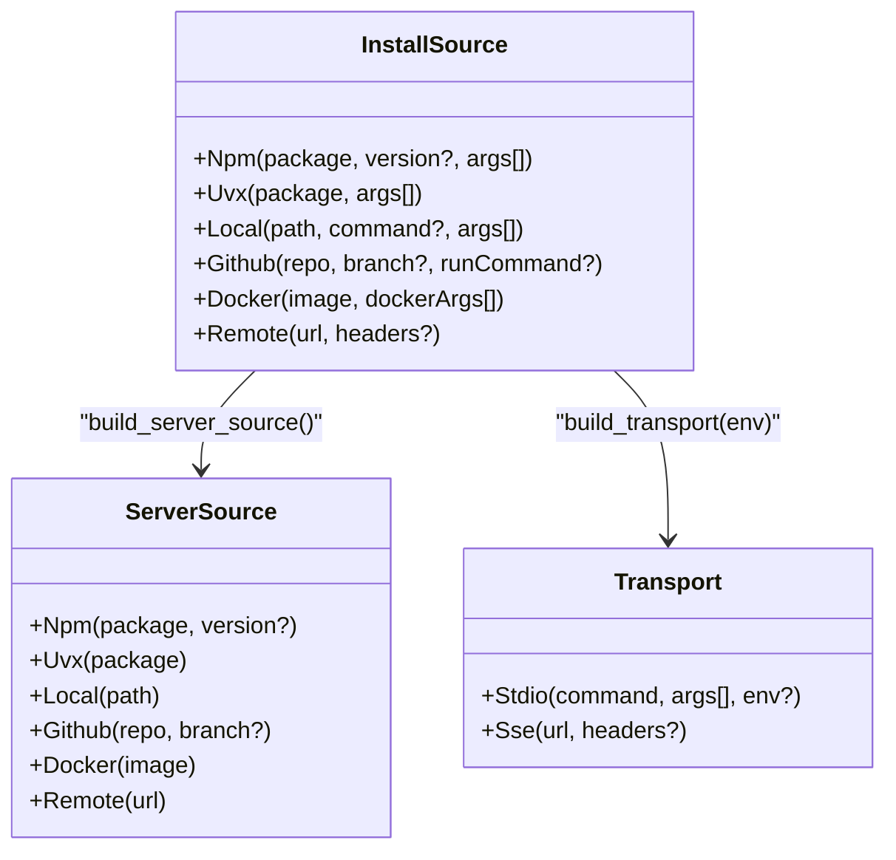
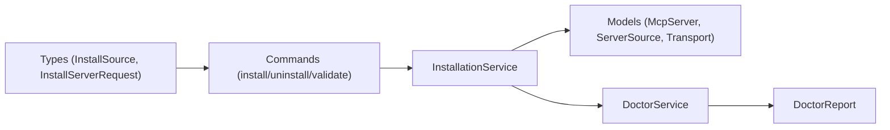

# Server Installation

<cite>
**Referenced Files in This Document**
- [AddServerModal.tsx](file://src/components/servers/AddServerModal.tsx)
- [Servers.tsx](file://src/pages/Servers.tsx)
- [installation.rs (frontend types)](file://src/types/index.ts)
- [installation.rs (Rust service)](file://src-tauri/src/services/installation.rs)
- [installation.rs (Rust commands)](file://src-tauri/src/commands/installation.rs)
- [server.rs (Rust models)](file://src-tauri/src/models/server.rs)
- [doctor.rs (Rust models)](file://src-tauri/src/models/doctor.rs)
- [doctor.rs (Rust service)](file://src-tauri/src/services/doctor.rs)
- [useDoctor.ts](file://src/hooks/useDoctor.ts)
- [tauri.ts](file://src/lib/tauri.ts)
</cite>

## Table of Contents

1. [Introduction](#introduction)
2. [Project Structure](#project-structure)
3. [Core Components](#core-components)
4. [Architecture Overview](#architecture-overview)
5. [Detailed Component Analysis](#detailed-component-analysis)
6. [Dependency Analysis](#dependency-analysis)
7. [Performance Considerations](#performance-considerations)
8. [Troubleshooting Guide](#troubleshooting-guide)
9. [Conclusion](#conclusion)

## Introduction

This document explains how MCP Nexus installs servers through the AddServerModal interface and the backend InstallationService. It covers all installation sources (local, remote, npm, uvx, Docker, GitHub), how InstallSource maps to McpServer’s ServerSource and Transport models, runtime validation via DoctorReport, GitHub repository cloning and setup, transport configuration building, environment variable injection, and common issues with troubleshooting guidance. It also addresses performance considerations for concurrent installations.

## Project Structure

The installation pipeline spans frontend UI, typed request/response contracts, and backend Rust services and commands.

**Diagram sources**

- [AddServerModal.tsx](file://src/components/servers/AddServerModal.tsx#L1-L200)
- [Servers.tsx](file://src/pages/Servers.tsx#L192-L224)
- [installation.rs (frontend types)](file://src/types/index.ts#L255-L319)
- [useDoctor.ts](file://src/hooks/useDoctor.ts#L1-L80)
- [tauri.ts](file://src/lib/tauri.ts#L224-L284)
- [installation.rs (Rust commands)](file://src-tauri/src/commands/installation.rs#L90-L135)
- [installation.rs (Rust service)](file://src-tauri/src/services/installation.rs#L124-L183)
- [server.rs (models)](file://src-tauri/src/models/server.rs#L1-L49)
- [doctor.rs (models)](file://src-tauri/src/models/doctor.rs#L84-L128)
- [doctor.rs (service)](file://src-tauri/src/services/doctor.rs#L1-L53)

**Section sources**

- [AddServerModal.tsx](file://src/components/servers/AddServerModal.tsx#L1-L200)
- [Servers.tsx](file://src/pages/Servers.tsx#L192-L224)
- [installation.rs (frontend types)](file://src/types/index.ts#L255-L319)
- [useDoctor.ts](file://src/hooks/useDoctor.ts#L1-L80)
- [tauri.ts](file://src/lib/tauri.ts#L224-L284)
- [installation.rs (Rust commands)](file://src-tauri/src/commands/installation.rs#L90-L135)
- [installation.rs (Rust service)](file://src-tauri/src/services/installation.rs#L124-L183)
- [server.rs (models)](file://src-tauri/src/models/server.rs#L1-L49)
- [doctor.rs (models)](file://src-tauri/src/models/doctor.rs#L84-L128)
- [doctor.rs (service)](file://src-tauri/src/services/doctor.rs#L1-L53)

## Core Components

- AddServerModal.tsx: Collects user input for server installation, validates form fields, and emits an InstallSource payload to the parent.
- Servers.tsx: Bridges the modal to the Tauri command layer and triggers installation.
- Frontend types (installation.rs): Defines InstallSource, InstallServerRequest, and related result/response types.
- Backend InstallationService (Rust): Validates runtimes, builds transports, constructs McpServer, and manages cleanup.
- Backend Commands (Rust): Exposes Tauri commands for install/uninstall/validate and integrates with the InstallationService.
- Models (server.rs): Defines McpServer, ServerSource, and Transport enums used throughout.
- Doctor (doctor.rs): Provides DoctorReport and runtime detection used for validation.

**Section sources**

- [AddServerModal.tsx](file://src/components/servers/AddServerModal.tsx#L1-L200)
- [Servers.tsx](file://src/pages/Servers.tsx#L192-L224)
- [installation.rs (frontend types)](file://src/types/index.ts#L255-L319)
- [installation.rs (Rust service)](file://src-tauri/src/services/installation.rs#L124-L183)
- [installation.rs (Rust commands)](file://src-tauri/src/commands/installation.rs#L90-L135)
- [server.rs (models)](file://src-tauri/src/models/server.rs#L1-L49)
- [doctor.rs (models)](file://src-tauri/src/models/doctor.rs#L84-L128)
- [doctor.rs (service)](file://src-tauri/src/services/doctor.rs#L1-L53)

## Architecture Overview

End-to-end flow from UI to backend and back:

**Diagram sources**

- [AddServerModal.tsx](file://src/components/servers/AddServerModal.tsx#L83-L163)
- [Servers.tsx](file://src/pages/Servers.tsx#L192-L224)
- [tauri.ts](file://src/lib/tauri.ts#L224-L241)
- [installation.rs (Rust commands)](file://src-tauri/src/commands/installation.rs#L98-L135)
- [installation.rs (Rust service)](file://src-tauri/src/services/installation.rs#L480-L520)
- [server.rs (models)](file://src-tauri/src/models/server.rs#L51-L131)
- [doctor.rs (service)](file://src-tauri/src/services/doctor.rs#L1-L53)

## Detailed Component Analysis

### AddServerModal.tsx: UI collection and validation

- Supports six source types: local, remote, npm, uvx, docker, github.
- Builds InstallSource variants from form inputs:
  - local: path, optional command, optional args
  - remote: url
  - npm: package, optional args
  - uvx: package, optional args
  - docker: image, optional dockerArgs
  - github: repo, optional branch
- Validates presence of required fields per source type.
- Converts args strings into arrays by splitting on spaces and filtering empty tokens.
- Builds environment variables map from key/value pairs.

Concrete examples from the codebase:

- InstallSource construction and arg parsing for each source type: [AddServerModal.tsx](file://src/components/servers/AddServerModal.tsx#L83-L163)
- Form validation rules per source type: [AddServerModal.tsx](file://src/components/servers/AddServerModal.tsx#L197-L214)

**Section sources**

- [AddServerModal.tsx](file://src/components/servers/AddServerModal.tsx#L1-L200)
- [AddServerModal.tsx](file://src/components/servers/AddServerModal.tsx#L83-L163)
- [AddServerModal.tsx](file://src/components/servers/AddServerModal.tsx#L197-L214)

### Servers.tsx: Bridge to backend

- Receives onInstall callback from AddServerModal and forwards it to the Tauri command layer.
- Calls installMcpServer with InstallServerRequest and optional syncAfterInstall flag.
- Handles success/error notifications.

Concrete examples from the codebase:

- Forwarding InstallServerRequest to Tauri: [Servers.tsx](file://src/pages/Servers.tsx#L192-L224)
- Tauri command wiring: [tauri.ts](file://src/lib/tauri.ts#L224-L241)

**Section sources**

- [Servers.tsx](file://src/pages/Servers.tsx#L192-L224)
- [tauri.ts](file://src/lib/tauri.ts#L224-L241)

### InstallSource enum and mapping to McpServer models

- Frontend InstallSource mirrors backend InstallSource and is serialized to/from JSON.
- Backend InstallSource variants map to ServerSource variants:
  - npm -> Npm
  - uvx -> Uvx
  - local -> Local
  - github -> Github
  - docker -> Docker
  - remote -> Remote
- Transport is built from InstallSource:
  - npm -> Stdio with npx and package args
  - uvx -> Stdio with uvx and package args
  - local -> Stdio with detected or provided command and path+args
  - github -> Stdio with run command or default node index.js; injects MCP_SERVER_DIR
  - docker -> Stdio with docker run and image
  - remote -> SSE transport with url and headers

Concrete examples from the codebase:

- InstallSource variants and serialization: [installation.rs (frontend types)](file://src/types/index.ts#L255-L262)
- ServerSource mapping: [installation.rs (Rust service)](file://src-tauri/src/services/installation.rs#L455-L477)
- Transport building: [installation.rs (Rust service)](file://src-tauri/src/services/installation.rs#L334-L453)
- Models: [server.rs (models)](file://src-tauri/src/models/server.rs#L1-L49)

**Diagram sources**

- [installation.rs (frontend types)](file://src/types/index.ts#L255-L262)
- [installation.rs (Rust service)](file://src-tauri/src/services/installation.rs#L455-L477)
- [installation.rs (Rust service)](file://src-tauri/src/services/installation.rs#L334-L453)
- [server.rs (models)](file://src-tauri/src/models/server.rs#L1-L49)

**Section sources**

- [installation.rs (frontend types)](file://src/types/index.ts#L255-L262)
- [installation.rs (Rust service)](file://src-tauri/src/services/installation.rs#L334-L453)
- [server.rs (models)](file://src-tauri/src/models/server.rs#L1-L49)

### Runtime validation and DoctorReport

- validate_runtime enforces environment prerequisites:
  - npm requires Node.js
  - uvx requires Python or uv
  - local requires path existence
  - github requires git
  - docker requires Docker
  - remote requires URL scheme validation
- DoctorReport is produced by run_doctor and includes detected versions and issues.

Concrete examples from the codebase:

- validate_runtime logic: [installation.rs (Rust service)](file://src-tauri/src/services/installation.rs#L124-L183)
- DoctorReport model: [doctor.rs (models)](file://src-tauri/src/models/doctor.rs#L84-L128)
- Doctor runtime detection: [doctor.rs (service)](file://src-tauri/src/services/doctor.rs#L1-L53)
- Frontend hook caching and refresh: [useDoctor.ts](file://src/hooks/useDoctor.ts#L1-L80)

**Section sources**

- [installation.rs (Rust service)](file://src-tauri/src/services/installation.rs#L124-L183)
- [doctor.rs (models)](file://src-tauri/src/models/doctor.rs#L84-L128)
- [doctor.rs (service)](file://src-tauri/src/services/doctor.rs#L1-L53)
- [useDoctor.ts](file://src/hooks/useDoctor.ts#L1-L80)

### GitHub repository cloning and setup

- Repositories are cloned under ~/.mcp-nexus/repos/<repo-name>.
- If directory exists, performs a pull; otherwise shallow clones with depth 1.
- Setup detects package manager and Python environment:
  - Node projects: npm, yarn, or pnpm based on lockfiles
  - Python projects: uv pip install -e . with fallback to pip
  - Requirements.txt fallback for Python

Concrete examples from the codebase:

- Repos directory and clone/update: [installation.rs (Rust service)](file://src-tauri/src/services/installation.rs#L185-L252)
- Setup detection and commands: [installation.rs (Rust service)](file://src-tauri/src/services/installation.rs#L254-L332)

**Section sources**

- [installation.rs (Rust service)](file://src-tauri/src/services/installation.rs#L185-L252)
- [installation.rs (Rust service)](file://src-tauri/src/services/installation.rs#L254-L332)

### Transport configuration building

- npm: Stdio with npx and package args
- uvx: Stdio with uvx and package args
- local: Stdio with inferred command (node/python3 for .js/.py) or explicit command; appends path and args
- github: Stdio with run command or default node index.js; injects MCP_SERVER_DIR env var
- docker: Stdio with docker run -i --rm plus dockerArgs and image
- remote: SSE transport with url and headers

Concrete examples from the codebase:

- Transport building: [installation.rs (Rust service)](file://src-tauri/src/services/installation.rs#L334-L453)

**Section sources**

- [installation.rs (Rust service)](file://src-tauri/src/services/installation.rs#L334-L453)

### Environment variable injection

- All transports receive env map from the form.
- GitHub transport additionally injects MCP_SERVER_DIR pointing to the repo directory.

Concrete examples from the codebase:

- Env propagation: [installation.rs (Rust service)](file://src-tauri/src/services/installation.rs#L334-L453)

**Section sources**

- [installation.rs (Rust service)](file://src-tauri/src/services/installation.rs#L334-L453)

### Uninstall and cleanup

- Removes server from central config.
- For GitHub servers, removes the cloned repository directory if it resides under the managed repos directory.

Concrete examples from the codebase:

- Cleanup logic: [installation.rs (Rust service)](file://src-tauri/src/services/installation.rs#L531-L555)

**Section sources**

- [installation.rs (Rust service)](file://src-tauri/src/services/installation.rs#L531-L555)

## Dependency Analysis

- Frontend types define InstallSource and InstallServerRequest used by AddServerModal and Tauri commands.
- Backend commands depend on InstallationService for installation logic and DoctorReport for validation.
- InstallationService depends on models for McpServer, ServerSource, and Transport.
- Doctor service produces DoctorReport consumed by InstallationService.

**Diagram sources**

- [installation.rs (frontend types)](file://src/types/index.ts#L255-L319)
- [installation.rs (Rust commands)](file://src-tauri/src/commands/installation.rs#L90-L135)
- [installation.rs (Rust service)](file://src-tauri/src/services/installation.rs#L124-L183)
- [server.rs (models)](file://src-tauri/src/models/server.rs#L1-L49)
- [doctor.rs (models)](file://src-tauri/src/models/doctor.rs#L84-L128)
- [doctor.rs (service)](file://src-tauri/src/services/doctor.rs#L1-L53)

**Section sources**

- [installation.rs (frontend types)](file://src/types/index.ts#L255-L319)
- [installation.rs (Rust commands)](file://src-tauri/src/commands/installation.rs#L90-L135)
- [installation.rs (Rust service)](file://src-tauri/src/services/installation.rs#L124-L183)
- [server.rs (models)](file://src-tauri/src/models/server.rs#L1-L49)
- [doctor.rs (models)](file://src-tauri/src/models/doctor.rs#L84-L128)
- [doctor.rs (service)](file://src-tauri/src/services/doctor.rs#L1-L53)

## Performance Considerations

- Concurrent installations: The backend does not currently enforce concurrency limits. Running multiple installations concurrently can lead to contention for CPU, disk, and network resources. Consider staggering long-running steps (e.g., npm/yarn/pnpm installs, Docker pulls, git clones).
- Disk usage: GitHub cloning uses shallow clones to reduce bandwidth and disk usage. However, multiple simultaneous clones can still consume significant disk space.
- Network: npm and Docker pulls can be heavy; consider limiting concurrent pulls or using local registries/caches.
- Memory: Large Node or Python projects may allocate substantial memory during setup; monitor system resources.
- I/O: Local filesystem writes (cloning, setup) can be slow on spinning disks; prefer SSDs for development environments.

[No sources needed since this section provides general guidance]

## Troubleshooting Guide

### Missing runtimes

- Symptoms: Installation fails with “Missing required runtime” messages.
- Causes:
  - npm: Node.js not detected
  - uvx: Python or uv not detected
  - github: git not detected
  - docker: Docker not detected
- Resolution:
  - Install Node.js, Python, uv, git, or Docker as indicated by the error message.
  - Re-run the installation after installation completes.

Concrete examples from the codebase:

- Runtime checks and errors: [installation.rs (Rust service)](file://src-tauri/src/services/installation.rs#L124-L183)
- Doctor report and suggestions: [doctor.rs (service)](file://src-tauri/src/services/doctor.rs#L1-L53)

**Section sources**

- [installation.rs (Rust service)](file://src-tauri/src/services/installation.rs#L124-L183)
- [doctor.rs (service)](file://src-tauri/src/services/doctor.rs#L1-L53)

### Invalid URLs (remote source)

- Symptoms: Installation fails with “URL must start with http:// or https://”.
- Resolution: Ensure the remote URL starts with http:// or https://.

Concrete examples from the codebase:

- URL validation: [installation.rs (Rust service)](file://src-tauri/src/services/installation.rs#L172-L181)

**Section sources**

- [installation.rs (Rust service)](file://src-tauri/src/services/installation.rs#L172-L181)

### Invalid local path (local source)

- Symptoms: Installation fails with “Path does not exist”.
- Resolution: Provide a valid path to an existing executable or script.

Concrete examples from the codebase:

- Local path validation: [installation.rs (Rust service)](file://src-tauri/src/services/installation.rs#L146-L153)

**Section sources**

- [installation.rs (Rust service)](file://src-tauri/src/services/installation.rs#L146-L153)

### GitHub clone failures

- Symptoms: “Failed to clone repository” or “Failed to update repository”.
- Causes: Network issues, invalid repo URL, permission errors, or branch mismatch.
- Resolution:
  - Verify the repo URL or owner/repo format.
  - Ensure git is installed and accessible.
  - Check network connectivity and proxy settings.
  - For private repos, ensure SSH keys or credentials are configured.

Concrete examples from the codebase:

- Clone/update logic and error handling: [installation.rs (Rust service)](file://src-tauri/src/services/installation.rs#L192-L252)

**Section sources**

- [installation.rs (Rust service)](file://src-tauri/src/services/installation.rs#L192-L252)

### Package manager setup failures (GitHub)

- Symptoms: “npm install failed”, “yarn install failed”, “pnpm install failed”, or “pip install failed”.
- Causes: Missing or incompatible lockfiles, network issues, or environment misconfiguration.
- Resolution:
  - Ensure package manager availability (npm, yarn, pnpm, uv, pip).
  - Retry with a stable network connection.
  - For Python projects, ensure uv is installed for optimal performance.

Concrete examples from the codebase:

- Setup detection and commands: [installation.rs (Rust service)](file://src-tauri/src/services/installation.rs#L254-L332)

**Section sources**

- [installation.rs (Rust service)](file://src-tauri/src/services/installation.rs#L254-L332)

### Docker-related issues

- Symptoms: “Docker not available” or Docker command failures.
- Causes: Docker not installed or not in PATH.
- Resolution: Install Docker and ensure it is running.

Concrete examples from the codebase:

- Docker validation: [installation.rs (Rust service)](file://src-tauri/src/services/installation.rs#L164-L171)
- Docker transport: [installation.rs (Rust service)](file://src-tauri/src/services/installation.rs#L437-L447)

**Section sources**

- [installation.rs (Rust service)](file://src-tauri/src/services/installation.rs#L164-L171)
- [installation.rs (Rust service)](file://src-tauri/src/services/installation.rs#L437-L447)

### Permission errors

- Symptoms: Failures during cloning, setup, or running executables.
- Causes: Insufficient permissions for ~/.mcp-nexus/repos or target directories.
- Resolution:
  - Ensure write permissions for the user account.
  - Adjust ownership or permissions on the repos directory if needed.

[No sources needed since this section provides general guidance]

## Conclusion

MCP Nexus provides a robust, multi-source installation pipeline with strong runtime validation, environment-aware transport configuration, and GitHub-centric setup automation. The AddServerModal collects user input, the frontend types define the contract, and the backend InstallationService orchestrates validation, cloning/setup, transport building, and persistence. Use DoctorReport to proactively diagnose environment issues, and follow the troubleshooting guidance to resolve common problems. For performance, stagger heavy operations and monitor system resources during concurrent installations.
