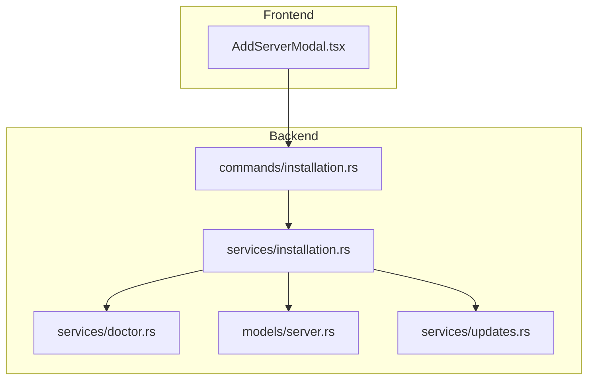
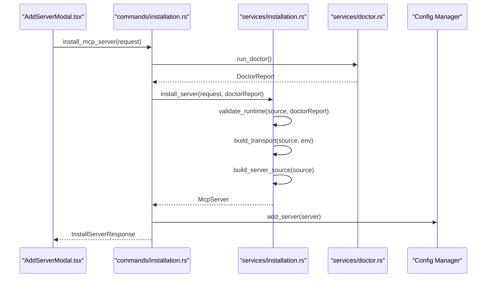
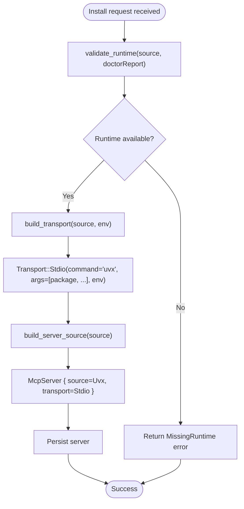
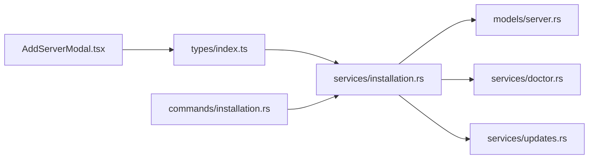

# UVX Installation

<cite>
**Referenced Files in This Document**
- [AddServerModal.tsx](file://src/components/servers/AddServerModal.tsx)
- [installation.rs](file://src-tauri/src/services/installation.rs)
- [server.rs](file://src-tauri/src/models/server.rs)
- [installation.rs](file://src-tauri/src/commands/installation.rs)
- [doctor.rs](file://src-tauri/src/services/doctor.rs)
- [updates.rs](file://src-tauri/src/services/updates.rs)
- [index.ts](file://src/types/index.ts)
</cite>

## Table of Contents

1. [Introduction](#introduction)
2. [Project Structure](#project-structure)
3. [Core Components](#core-components)
4. [Architecture Overview](#architecture-overview)
5. [Detailed Component Analysis](#detailed-component-analysis)
6. [Dependency Analysis](#dependency-analysis)
7. [Performance Considerations](#performance-considerations)
8. [Troubleshooting Guide](#troubleshooting-guide)
9. [Conclusion](#conclusion)

## Introduction

This document explains how Python-based MCP servers are installed from PyPI using uvx through the AddServerModal interface and the backend InstallationService. It covers runtime validation, package installation via uvx, argument handling, and transport configuration. It also documents how the InstallSource enum maps to McpServer’s ServerSource and Transport models, environment variable injection, and Python environment setup. Finally, it provides troubleshooting guidance for common issues and performance considerations.

## Project Structure

The UVX installation flow spans the frontend modal and the Tauri backend services:

- Frontend: AddServerModal collects user input for a uvx-based server, including package name and optional arguments, and environment variables.
- Backend: InstallationService validates runtimes, builds transport configuration, constructs McpServer, and persists it. Commands orchestrate installation and optional client synchronization.

**Diagram sources**

- [AddServerModal.tsx](file://src/components/servers/AddServerModal.tsx#L1-L160)
- [installation.rs](file://src-tauri/src/commands/installation.rs#L90-L135)
- [installation.rs](file://src-tauri/src/services/installation.rs#L124-L183)
- [doctor.rs](file://src-tauri/src/services/doctor.rs#L1-L120)
- [server.rs](file://src-tauri/src/models/server.rs#L1-L90)
- [updates.rs](file://src-tauri/src/services/updates.rs#L112-L144)

**Section sources**

- [AddServerModal.tsx](file://src/components/servers/AddServerModal.tsx#L1-L160)
- [installation.rs](file://src-tauri/src/commands/installation.rs#L90-L135)
- [installation.rs](file://src-tauri/src/services/installation.rs#L124-L183)
- [doctor.rs](file://src-tauri/src/services/doctor.rs#L1-L120)
- [server.rs](file://src-tauri/src/models/server.rs#L1-L90)
- [updates.rs](file://src-tauri/src/services/updates.rs#L112-L144)

## Core Components

- AddServerModal.tsx: Presents the “Add Server” form, captures uvx package and arguments, and environment variables. It emits an InstallSource payload to the backend.
- InstallationService (Rust): Validates runtime prerequisites, builds Transport and ServerSource, constructs McpServer, and persists it.
- Models: Define McpServer, ServerSource, and Transport structures used across the app.
- Commands: Expose Tauri commands to install/uninstall servers and validate prerequisites.
- Doctor: Detects Node.js, Python, uv, Docker, and git availability.
- Updates: Provides PyPI version checking for uvx servers.

**Section sources**

- [AddServerModal.tsx](file://src/components/servers/AddServerModal.tsx#L1-L160)
- [installation.rs](file://src-tauri/src/services/installation.rs#L124-L183)
- [server.rs](file://src-tauri/src/models/server.rs#L1-L90)
- [installation.rs](file://src-tauri/src/commands/installation.rs#L90-L135)
- [doctor.rs](file://src-tauri/src/services/doctor.rs#L1-L120)
- [updates.rs](file://src-tauri/src/services/updates.rs#L112-L144)

## Architecture Overview

The installation flow:

1. User selects “uvx” in AddServerModal and enters a PyPI package name and optional arguments.
2. The modal constructs an InstallSource::Uvx payload and passes environment variables.
3. The Tauri command invokes InstallationService.install_server.
4. InstallationService.validate_runtime ensures uv or Python is available.
5. InstallationService.build_transport creates a Transport::Stdio using uvx with the package and arguments.
6. InstallationService.build_server_source maps InstallSource::Uvx to ServerSource::Uvx.
7. InstallationService constructs McpServer and persists it.
8. Optional sync to clients occurs via the command layer.

**Diagram sources**

- [AddServerModal.tsx](file://src/components/servers/AddServerModal.tsx#L80-L160)
- [installation.rs](file://src-tauri/src/commands/installation.rs#L90-L135)
- [installation.rs](file://src-tauri/src/services/installation.rs#L124-L183)
- [doctor.rs](file://src-tauri/src/services/doctor.rs#L1-L120)

## Detailed Component Analysis

### AddServerModal.tsx: Collecting uvx Inputs and Environment Variables

- Source type selection includes “uvx”.
- Fields:
  - Python Package: required for uvx.
  - Arguments: optional, split by spaces into a vector.
  - Environment Variables: key/value pairs collected into a record.
- Validation enforces presence of the package name for uvx.
- Emits InstallSource::Uvx with package and args, plus env if present.

Key behaviors:

- Argument parsing: splits the input string by whitespace and filters empty tokens.
- Environment variables: collected into a plain object and forwarded to the backend.

**Section sources**

- [AddServerModal.tsx](file://src/components/servers/AddServerModal.tsx#L1-L160)
- [AddServerModal.tsx](file://src/components/servers/AddServerModal.tsx#L402-L430)
- [AddServerModal.tsx](file://src/components/servers/AddServerModal.tsx#L133-L142)

### InstallationService: Runtime Validation, Transport, and Server Construction

- Runtime validation:
  - For uvx, requires either uv or Python to be available.
  - Uses DoctorReport to check uv and python presence.
- Transport construction for uvx:
  - Transport::Stdio with command “uvx”, args include the package and any additional arguments.
  - Environment variables are copied into the transport env map.
- ServerSource mapping:
  - InstallSource::Uvx maps to ServerSource::Uvx with the package name.
- Server creation:
  - Builds McpServer with source and transport, sets timestamps, and enables for selected clients.

**Diagram sources**

- [installation.rs](file://src-tauri/src/services/installation.rs#L124-L183)
- [installation.rs](file://src-tauri/src/services/installation.rs#L334-L356)
- [server.rs](file://src-tauri/src/models/server.rs#L1-L90)

**Section sources**

- [installation.rs](file://src-tauri/src/services/installation.rs#L124-L183)
- [installation.rs](file://src-tauri/src/services/installation.rs#L334-L356)
- [server.rs](file://src-tauri/src/models/server.rs#L1-L90)

### Models: InstallSource, ServerSource, Transport, and McpServer

- InstallSource (frontend/backend):
  - Uvx variant carries package and args.
- ServerSource (backend model):
  - Uvx variant carries package.
- Transport (backend model):
  - Stdio with command, args, and env.
  - Sse for remote endpoints.
- McpServer:
  - Holds source, transport, metadata, and client enablement.

Mapping highlights:

- InstallSource::Uvx -> ServerSource::Uvx
- InstallSource::Uvx -> Transport::Stdio with command “uvx”

**Section sources**

- [index.ts](file://src/types/index.ts#L255-L262)
- [server.rs](file://src-tauri/src/models/server.rs#L1-L90)

### Commands: Orchestrating Installation and Validation

- install_mcp_server:
  - Runs doctor, installs server, persists to config, optionally syncs to clients.
- uninstall_mcp_server:
  - Removes server and optionally cleans up resources.
- validate_install:
  - Validates runtime requirements without installing.
- check_runtime_for_registry:
  - Helper to validate runtime for a given registry (e.g., pypi -> uvx).

**Section sources**

- [installation.rs](file://src-tauri/src/commands/installation.rs#L90-L135)
- [installation.rs](file://src-tauri/src/commands/installation.rs#L137-L192)
- [installation.rs](file://src-tauri/src/commands/installation.rs#L194-L226)
- [installation.rs](file://src-tauri/src/commands/installation.rs#L228-L288)

### Doctor: Python/uv Detection

- Detects uv and Python availability and records versions and paths.
- Used by validate_runtime to ensure uvx can run.

**Section sources**

- [doctor.rs](file://src-tauri/src/services/doctor.rs#L1-L120)

### Updates: PyPI Version Checking for uvx

- check_pypi_version queries PyPI JSON API for the latest version.
- Used by update checking to compare installed version vs latest.

**Section sources**

- [updates.rs](file://src-tauri/src/services/updates.rs#L112-L144)

## Dependency Analysis

- Frontend types align with backend models:
  - InstallSource (frontend) mirrors InstallSource (backend).
  - Transport (frontend) mirrors Transport (backend).
- Backend services depend on:
  - doctor.rs for runtime detection.
  - models/server.rs for McpServer, ServerSource, Transport.
  - updates.rs for PyPI version checking.
- Commands depend on services and configuration manager to persist and sync servers.

**Diagram sources**

- [AddServerModal.tsx](file://src/components/servers/AddServerModal.tsx#L1-L160)
- [index.ts](file://src/types/index.ts#L255-L262)
- [installation.rs](file://src-tauri/src/services/installation.rs#L124-L183)
- [server.rs](file://src-tauri/src/models/server.rs#L1-L90)
- [doctor.rs](file://src-tauri/src/services/doctor.rs#L1-L120)
- [updates.rs](file://src-tauri/src/services/updates.rs#L112-L144)
- [installation.rs](file://src-tauri/src/commands/installation.rs#L90-L135)

**Section sources**

- [index.ts](file://src/types/index.ts#L255-L262)
- [installation.rs](file://src-tauri/src/services/installation.rs#L124-L183)
- [server.rs](file://src-tauri/src/models/server.rs#L1-L90)
- [doctor.rs](file://src-tauri/src/services/doctor.rs#L1-L120)
- [updates.rs](file://src-tauri/src/services/updates.rs#L112-L144)
- [installation.rs](file://src-tauri/src/commands/installation.rs#L90-L135)

## Performance Considerations

- Runtime detection:
  - Doctor checks uv and Python; caching or reusing DoctorReport reduces repeated probing.
- Transport startup:
  - uvx spawns a subprocess per server; minimize unnecessary restarts by reusing transports where appropriate.
- Network calls:
  - PyPI version checks are lightweight HTTP requests; consider caching results per package to reduce latency.
- Argument parsing:
  - Splitting and filtering arguments is O(n) per input; keep argument lists concise.

[No sources needed since this section provides general guidance]

## Troubleshooting Guide

Common issues and resolutions:

- Missing Python runtime or uv
  - Symptom: Installation fails with a runtime requirement error.
  - Cause: validate_runtime requires uv or Python for uvx.
  - Resolution: Install Python 3.x or uv. The doctor service detects uv and Python and suggests installation paths.

- Invalid local path (for local sources)
  - Symptom: Installation fails with an invalid path error.
  - Cause: Local path does not exist.
  - Resolution: Provide a valid path to a script or binary.

- Invalid URL (for remote sources)
  - Symptom: Installation fails with an invalid URL error.
  - Resolution: Ensure the URL starts with http:// or https://.

- PyPI package not found
  - Symptom: Update checks indicate the package could not be found.
  - Cause: Package name mismatch or network issue.
  - Resolution: Verify the package name on PyPI and retry.

- Environment variables not injected
  - Symptom: Server runs without expected environment variables.
  - Cause: Env vars not passed or not used by the server process.
  - Resolution: Confirm env vars are included in the InstallSource payload and that the server reads them.

- Slow initial install
  - Symptom: First-time uvx install takes time.
  - Cause: uvx downloads and resolves dependencies.
  - Resolution: Allow time for resolution; subsequent runs reuse caches.

**Section sources**

- [installation.rs](file://src-tauri/src/services/installation.rs#L124-L183)
- [doctor.rs](file://src-tauri/src/services/doctor.rs#L1-L120)
- [updates.rs](file://src-tauri/src/services/updates.rs#L112-L144)

## Conclusion

The uvx installation pipeline integrates a user-friendly frontend modal with robust backend validation and transport configuration. InstallSource::Uvx maps cleanly to ServerSource::Uvx and Transport::Stdio, enabling uvx-based Python server installation with argument and environment variable support. Runtime validation ensures uv or Python is available, while update checks leverage PyPI to inform users of available upgrades. By following the troubleshooting steps and considering performance tips, teams can reliably deploy and manage Python-based MCP servers via uvx.
