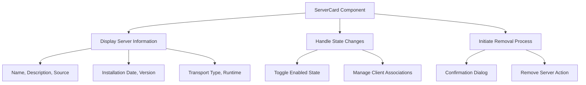
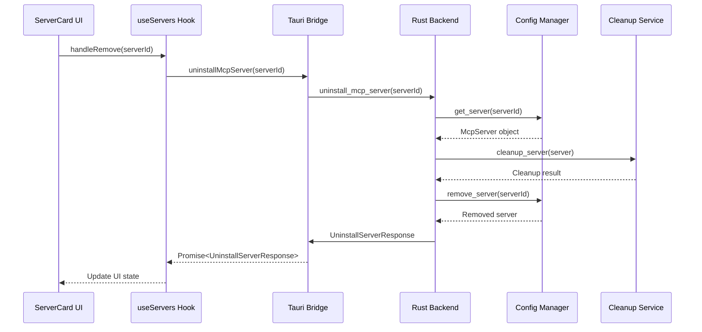
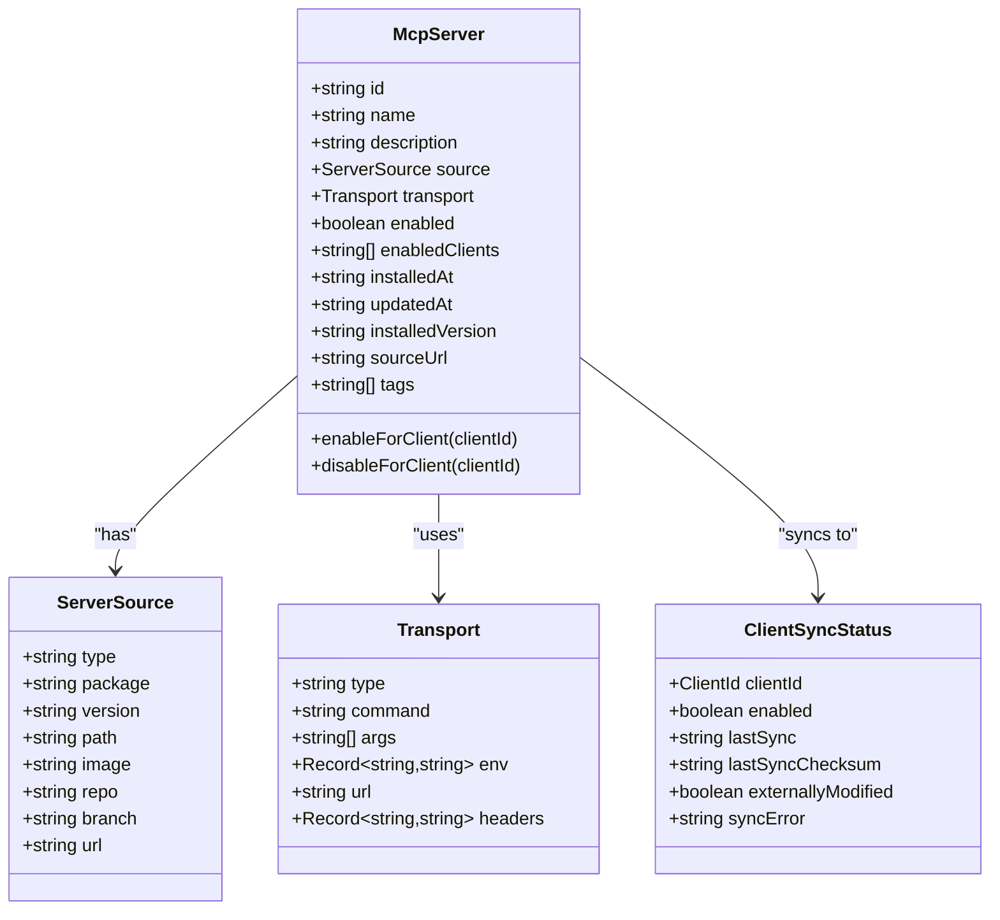
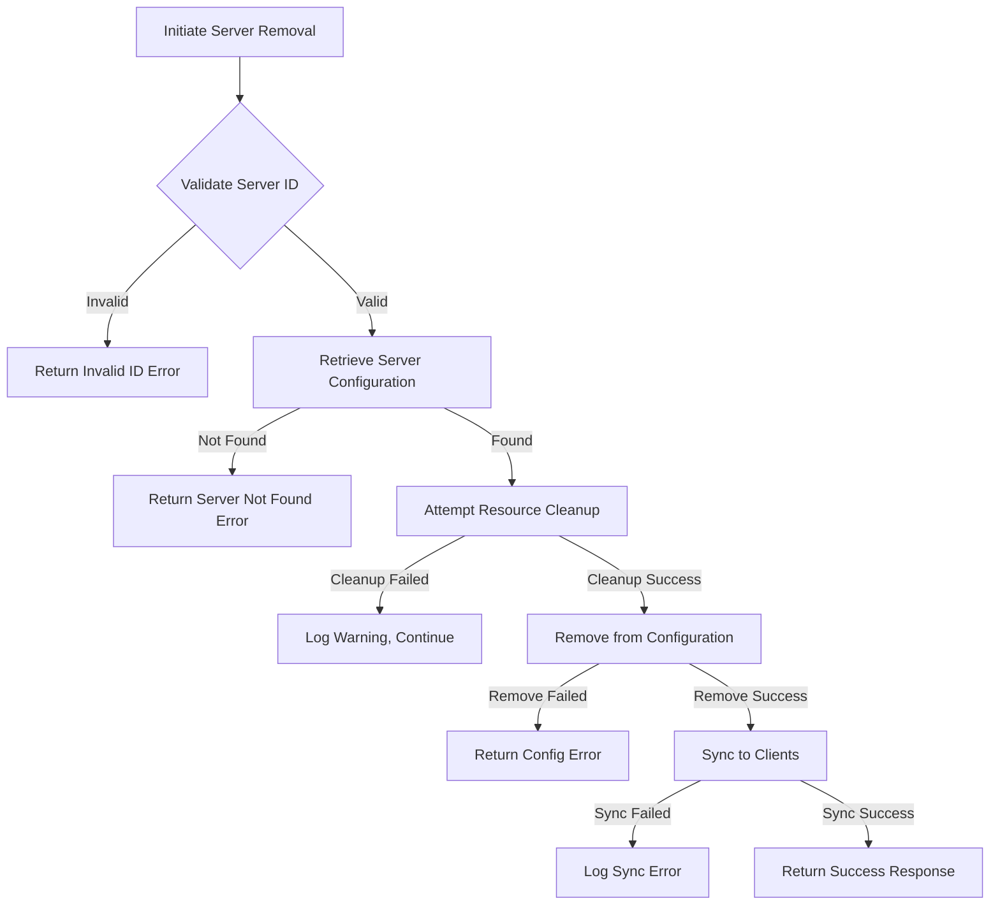
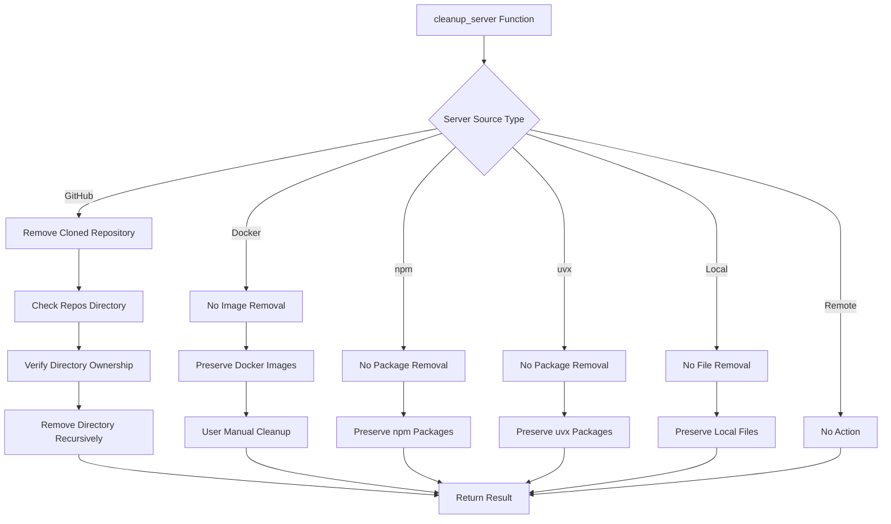
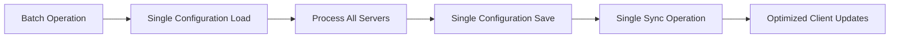
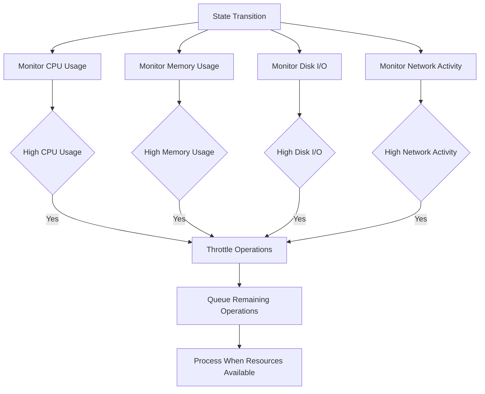

# Server Lifecycle Management

<cite>
**Referenced Files in This Document**   
- [ServerCard.tsx](file://src/components/servers/ServerCard.tsx)
- [useServers.ts](file://src/hooks/useServers.ts)
- [tauri.ts](file://src/lib/tauri.ts)
- [installation.rs](file://src-tauri/src/services/installation.rs)
- [config.rs](file://src-tauri/src/commands/config.rs)
- [installation.rs](file://src-tauri/src/commands/installation.rs)
- [index.ts](file://src/types/index.ts)
</cite>

## Table of Contents

1. [Introduction](#introduction)
2. [ServerCard Interface Implementation](#servercard-interface-implementation)
3. [Server Removal and Cleanup Process](#server-removal-and-cleanup-process)
4. [State Management and Client Synchronization](#state-management-and-client-synchronization)
5. [Error Handling and Rollback Procedures](#error-handling-and-rollback-procedures)
6. [Source-Specific Cleanup Operations](#source-specific-cleanup-operations)
7. [Performance Considerations](#performance-considerations)
8. [Common Issues and Troubleshooting](#common-issues-and-troubleshooting)

## Introduction

The MCP Nexus server lifecycle management system provides comprehensive control over server instances, including creation, configuration, removal, and state management. This document details the implementation of server removal operations, cleanup procedures, and state management through the ServerCard interface and backend services. The system handles various server source types including GitHub repositories, Docker images, npm packages, and local installations, with appropriate cleanup strategies for each type. The lifecycle operations are designed to maintain system integrity while allowing flexible management of server instances across multiple client environments.

## ServerCard Interface Implementation

The ServerCard component serves as the primary user interface for managing individual server instances within MCP Nexus. It provides visual representation of server properties and interactive controls for lifecycle operations.

**Section sources**

- [ServerCard.tsx](file://src/components/servers/ServerCard.tsx#L1-L341)

## Server Removal and Cleanup Process

The server removal process in MCP Nexus follows a structured sequence of operations to ensure proper cleanup and synchronization. When a user initiates server removal through the ServerCard interface, the operation flows through multiple layers of the application architecture.

**Section sources**

- [ServerCard.tsx](file://src/components/servers/ServerCard.tsx#L86-L93)
- [useServers.ts](file://src/hooks/useServers.ts#L114-L131)
- [tauri.ts](file://src/lib/tauri.ts#L251-L261)
- [installation.rs](file://src-tauri/src/commands/installation.rs#L144-L192)

## State Management and Client Synchronization

Server state management in MCP Nexus distinguishes between server configuration state and client synchronization state. The enabled/disabled state of a server controls its availability across client environments, while the removal operation permanently deletes the server configuration.

**Section sources**

- [index.ts](file://src/types/index.ts#L38-L51)
- [useServers.ts](file://src/hooks/useServers.ts#L146-L181)
- [tauri.ts](file://src/lib/tauri.ts#L114-L122)

## Error Handling and Rollback Procedures

The server removal system implements comprehensive error handling to maintain data integrity during lifecycle operations. Errors are handled at multiple levels with appropriate rollback procedures to prevent inconsistent states.

**Section sources**

- [installation.rs](file://src-tauri/src/commands/installation.rs#L150-L191)
- [config.rs](file://src-tauri/src/commands/config.rs#L119-L132)
- [installation.rs](file://src-tauri/src/services/installation.rs#L531-L554)

## Source-Specific Cleanup Operations

The cleanup_server function implements source-specific cleanup operations to handle different server types appropriately. This ensures that local resources are properly cleaned up while preserving shared resources.

**Section sources**

- [installation.rs](file://src-tauri/src/services/installation.rs#L531-L554)
- [installation.rs](file://src-tauri/src/commands/installation.rs#L164-L169)

## Performance Considerations

The server lifecycle management system incorporates several performance optimizations for batch operations and resource monitoring during state transitions.

### Batch Operation Performance

For operations involving multiple servers, the system implements efficient batch processing to minimize overhead:

The system avoids repeated configuration loads and saves during batch operations, instead performing these operations once for the entire batch. This reduces I/O overhead and improves overall performance.

### Resource Monitoring

During lifecycle transitions, the system monitors resource usage to prevent performance degradation:

**Section sources**

- [useServers.ts](file://src/hooks/useServers.ts#L114-L131)
- [installation.rs](file://src-tauri/src/commands/installation.rs#L178-L184)
- [tauri.ts](file://src/lib/tauri.ts#L253-L254)

## Common Issues and Troubleshooting

This section addresses common issues encountered during server lifecycle operations and provides troubleshooting guidance.

### Failed Removals

Server removal operations may fail due to various reasons:

- **Invalid server ID**: The server ID provided does not match any existing server
- **Configuration access errors**: Issues reading or writing the configuration file
- **Permission errors**: Insufficient permissions to modify configuration or resources
- **Locked files**: Configuration file is locked by another process

### Orphaned Resources

Orphaned resources may occur when cleanup operations fail:

- **GitHub repositories**: Cloned repositories not properly removed
- **Temporary files**: Setup or installation artifacts left behind
- **Credential references**: Keychain entries not cleaned up

### Permission Errors

Permission errors during cleanup typically occur when:

- The application lacks write permissions to the repositories directory
- System-level file locks prevent directory removal
- Antivirus software interferes with file operations

### Troubleshooting Steps

When encountering issues with server lifecycle operations:

1. Verify the server ID is correct and the server exists
2. Check application permissions for configuration and data directories
3. Ensure no other processes are using the configuration file
4. Review application logs for detailed error messages
5. Restart the application to clear any transient state issues

**Section sources**

- [installation.rs](file://src-tauri/src/services/installation.rs#L531-L554)
- [config.rs](file://src-tauri/src/commands/config.rs#L119-L132)
- [installation.rs](file://src-tauri/src/commands/installation.rs#L150-L191)
