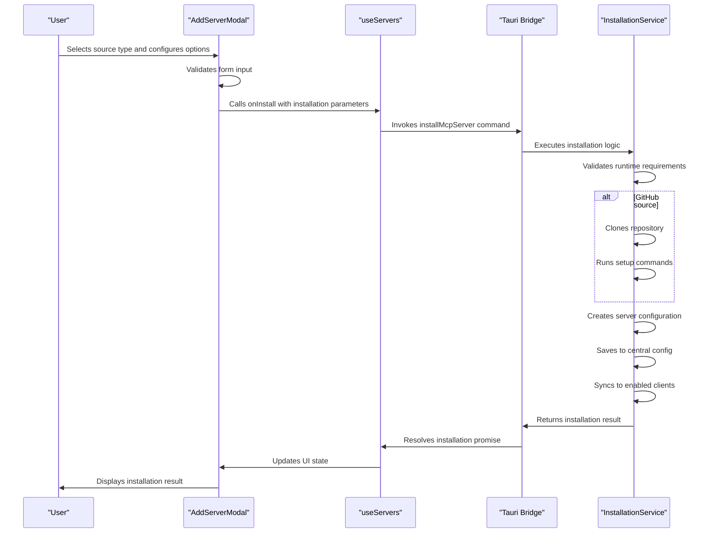
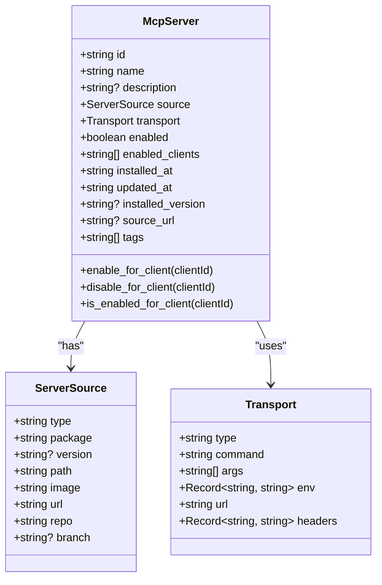
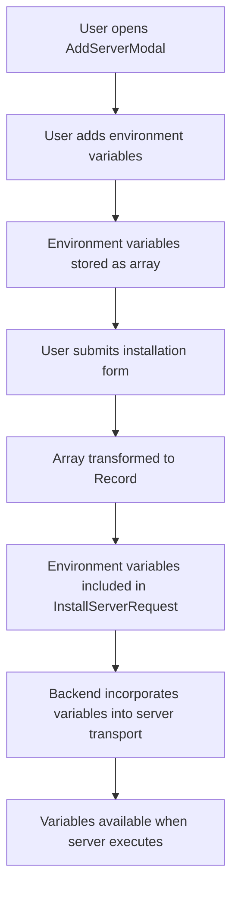
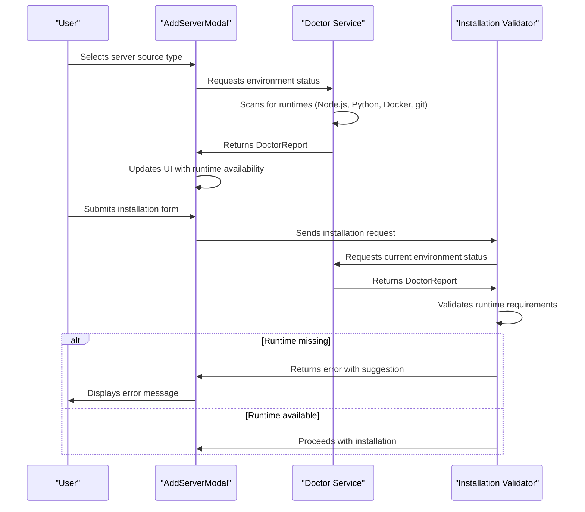
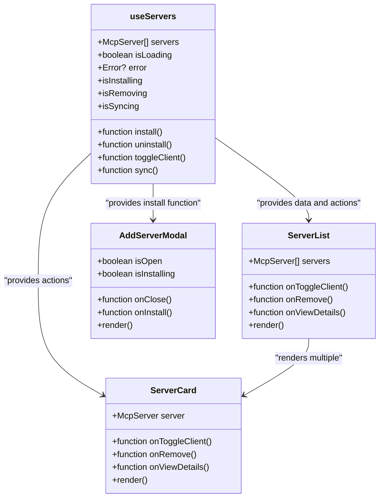
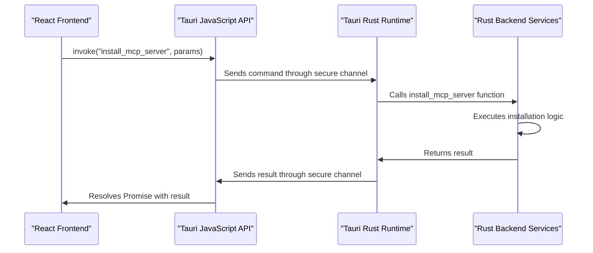
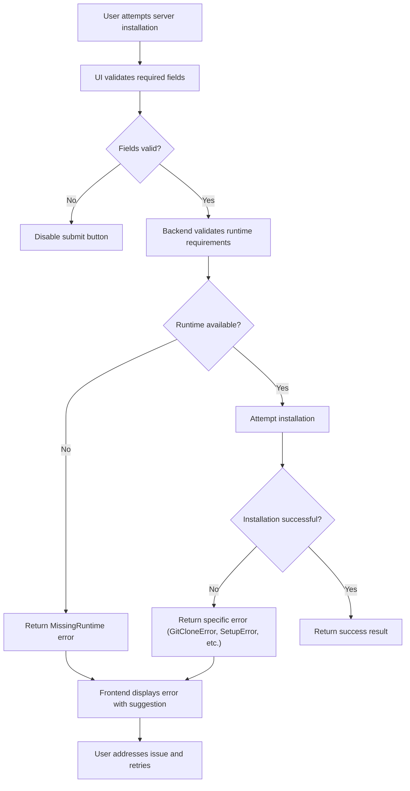
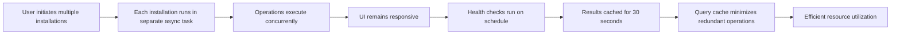

# Server Management

<cite>
**Referenced Files in This Document**   
- [AddServerModal.tsx](file://src/components/servers/AddServerModal.tsx)
- [useServers.ts](file://src/hooks/useServers.ts)
- [tauri.ts](file://src/lib/tauri.ts)
- [installation.rs](file://src-tauri/src/commands/installation.rs)
- [installation.rs](file://src-tauri/src/services/installation.rs)
- [server.rs](file://src-tauri/src/models/server.rs)
- [ServerCard.tsx](file://src/components/servers/ServerCard.tsx)
- [index.ts](file://src/types/index.ts)
- [useDoctor.ts](file://src/hooks/useDoctor.ts)
- [health.rs](file://src-tauri/src/services/health.rs)
</cite>

## Table of Contents

1. [Introduction](#introduction)
2. [Server Installation Process](#server-installation-process)
3. [McpServer Data Model](#mcpserver-data-model)
4. [Environment Variable Configuration](#environment-variable-configuration)
5. [Runtime Detection Logic](#runtime-detection-logic)
6. [UI Components and State Management](#ui-components-and-state-management)
7. [Tauri Command Pattern](#tauri-command-pattern)
8. [Error Handling and Validation](#error-handling-and-validation)
9. [Performance Considerations](#performance-considerations)
10. [Troubleshooting Guide](#troubleshooting-guide)

## Introduction

The MCP Nexus application provides comprehensive server lifecycle management through a sophisticated architecture that integrates frontend React components with a Rust backend via Tauri. This document details the implementation of server management functionality, focusing on the installation process from various sources, the McpServer data model, environment configuration, and the interaction between UI components and backend services. The system enables users to install, manage, and monitor MCP servers from multiple sources including npm, uvx, local paths, GitHub repositories, Docker containers, and remote URLs, providing a unified interface for server lifecycle management.

## Server Installation Process

The server installation process in MCP Nexus is implemented through the AddServerModal interface and the backend InstallationService, providing a seamless experience for installing servers from various sources. The AddServerModal component presents a comprehensive interface that allows users to configure server installation parameters based on the selected source type.

The installation process supports multiple source types including local paths, remote URLs, npm packages, Python/uvx packages, Docker containers, and GitHub repositories. For each source type, the modal displays relevant configuration fields:

- **Local**: Path to script/command, optional command, and arguments
- **Remote**: SSE URL for remote servers
- **NPM**: Package name and optional arguments
- **uvx**: Python package name and optional arguments
- **Docker**: Docker image name and optional Docker arguments
- **GitHub**: Repository name and optional branch

When a user submits the installation form, the AddServerModal constructs an InstallSource object based on the selected source type and form values. This object is passed to the onInstall callback, which triggers the installation process through the useServers hook. The installation process validates the form data, ensuring required fields are populated before proceeding.

The backend installation service, implemented in Rust, handles the actual installation process. It first validates that required runtimes are available for the selected source type by checking the environment using the doctor service. For GitHub sources, it clones the repository and runs setup commands. The service then creates the server configuration, saves it to the central configuration, and optionally syncs it to enabled clients.

**Diagram sources**

- [AddServerModal.tsx](file://src/components/servers/AddServerModal.tsx#L1-L654)
- [useServers.ts](file://src/hooks/useServers.ts#L96-L112)
- [tauri.ts](file://src/lib/tauri.ts#L236-L241)
- [installation.rs](file://src-tauri/src/commands/installation.rs#L98-L135)

**Section sources**

- [AddServerModal.tsx](file://src/components/servers/AddServerModal.tsx#L1-L654)
- [useServers.ts](file://src/hooks/useServers.ts#L96-L112)
- [tauri.ts](file://src/lib/tauri.ts#L236-L241)
- [installation.rs](file://src-tauri/src/commands/installation.rs#L98-L135)

## McpServer Data Model

The McpServer data model represents the core entity in the MCP Nexus server management system, encapsulating all information about an installed server. The model is defined in both TypeScript (frontend) and Rust (backend) with consistent structure to ensure type safety across the application.

The McpServer interface includes the following properties:

- **id**: Unique identifier (UUID) for the server
- **name**: Display name for the server
- **description**: Optional description of the server's functionality
- **source**: Installation source information (type-specific)
- **transport**: Communication mechanism (stdio or SSE)
- **enabled**: Global enable/disable status
- **enabled_clients**: List of client IDs the server is enabled for
- **installed_at**: ISO timestamp of installation
- **updated_at**: ISO timestamp of last update
- **installed_version**: Version information for update tracking
- **source_url**: Link to source repository or documentation
- **tags**: Array of tags for categorization

The source property is a discriminated union type that varies based on the installation source:

- **npm**: Package name and optional version
- **uvx**: Python package name
- **local**: File system path
- **docker**: Docker image name
- **remote**: URL for SSE-based servers
- **github**: Repository name and optional branch

The transport property defines how the application communicates with the server:

- **stdio**: Standard I/O communication with command, arguments, and environment variables
- **sse**: Server-Sent Events with URL and optional headers

**Diagram sources**

- [server.rs](file://src-tauri/src/models/server.rs#L51-L109)
- [index.ts](file://src/types/index.ts#L37-L51)

**Section sources**

- [server.rs](file://src-tauri/src/models/server.rs#L51-L109)
- [index.ts](file://src/types/index.ts#L37-L51)

## Environment Variable Configuration

Environment variable configuration in MCP Nexus is implemented through a flexible system that allows users to define environment variables for each server during installation. The AddServerModal component provides a dedicated section for environment variable management, enabling users to add, edit, and remove environment variables through a simple interface.

The environment variable configuration is stored as a key-value mapping within the McpServer data model. When a server is installed, the environment variables are passed to the installation service and incorporated into the server's transport configuration. For stdio-based servers, these variables are included in the process environment when the server is executed.

The implementation uses a state array of objects with key and value properties to manage environment variables in the AddServerModal component. Users can add new variables through a dedicated button, which appends an empty key-value pair to the array. Each variable can be edited individually, and variables can be removed through a delete button associated with each entry.

Security considerations are addressed by rendering the value field as a password input, obscuring sensitive values from view. This is particularly important for environment variables that may contain API keys, passwords, or other sensitive information.

When the installation form is submitted, the environment variables are transformed from the array format into a Record<string, string> object, which is then included in the InstallServerRequest. This object is serialized and passed to the backend, where it is incorporated into the server configuration.

**Diagram sources**

- [AddServerModal.tsx](file://src/components/servers/AddServerModal.tsx#L493-L542)
- [index.ts](file://src/types/index.ts#L276-L278)
- [installation.rs](file://src-tauri/src/services/installation.rs#L494-L495)

**Section sources**

- [AddServerModal.tsx](file://src/components/servers/AddServerModal.tsx#L493-L542)
- [index.ts](file://src/types/index.ts#L276-L278)
- [installation.rs](file://src-tauri/src/services/installation.rs#L494-L495)

## Runtime Detection Logic

The runtime detection logic in MCP Nexus is implemented through a comprehensive environment checking system that verifies the availability of required runtimes for different server source types. This system ensures that users can only install servers for which the necessary runtime dependencies are available on their system.

The detection process is centered around the Doctor service, which scans the system for installed runtimes including Node.js, Python, uv, Docker, and git. The DoctorReport interface captures the version information and presence of these runtimes, along with any issues detected during the scan.

When a user attempts to install a server, the installation service validates the runtime requirements based on the selected source type:

- **npm**: Requires Node.js to be available
- **uvx**: Requires either Python or uv to be available
- **local**: Validates that the specified path exists
- **github**: Requires git to be available
- **docker**: Requires Docker to be available
- **remote**: Validates URL format

The validation process occurs both at the UI level and in the backend. The AddServerModal performs basic validation of required fields, while the backend performs comprehensive runtime availability checks. This two-tiered approach provides immediate feedback to users while ensuring system integrity.

The useDoctor hook provides a cached interface to the Doctor service, reducing the frequency of system scans while maintaining up-to-date information about the environment. The cache is invalidated after a configurable interval, ensuring that changes to the system environment are eventually detected.

**Diagram sources**

- [useDoctor.ts](file://src/hooks/useDoctor.ts#L18-L58)
- [installation.rs](file://src-tauri/src/services/installation.rs#L125-L183)
- [installation.rs](file://src-tauri/src/commands/installation.rs#L203-L225)

**Section sources**

- [useDoctor.ts](file://src/hooks/useDoctor.ts#L18-L58)
- [installation.rs](file://src-tauri/src/services/installation.rs#L125-L183)
- [installation.rs](file://src-tauri/src/commands/installation.rs#L203-L225)

## UI Components and State Management

The UI components for server management in MCP Nexus are built using React with TypeScript, leveraging React Query for state management and synchronization between the frontend and backend. The primary components include ServerCard for displaying server information and controls, AddServerModal for installation, and ServerList for managing multiple servers.

The useServers hook provides a unified interface to server management operations, abstracting the complexity of React Query mutations and queries. It exposes methods for installing, removing, toggling client enablement, and syncing servers, along with state variables for tracking loading states and errors.

The ServerCard component displays comprehensive information about a server including its name, description, source type, transport mechanism, and runtime requirements. It provides controls for enabling/disabling the server globally and for specific clients, as well as actions for viewing details and removing the server. When expanded, it shows per-client toggle controls and a confirmation flow for server removal.

State synchronization is achieved through React Query's caching mechanism. When a server operation is performed (installation, removal, client toggle), the corresponding mutation updates the query cache directly, ensuring that all components displaying server data are automatically updated without requiring a full refresh.

**Diagram sources**

- [ServerCard.tsx](file://src/components/servers/ServerCard.tsx#L6-L341)
- [ServerList.tsx](file://src/components/servers/ServerList.tsx#L6-L160)
- [useServers.ts](file://src/hooks/useServers.ts#L146-L181)
- [AddServerModal.tsx](file://src/components/servers/AddServerModal.tsx#L5-L16)

**Section sources**

- [ServerCard.tsx](file://src/components/servers/ServerCard.tsx#L6-L341)
- [ServerList.tsx](file://src/components/servers/ServerList.tsx#L6-L160)
- [useServers.ts](file://src/hooks/useServers.ts#L146-L181)
- [AddServerModal.tsx](file://src/components/servers/AddServerModal.tsx#L5-L16)

## Tauri Command Pattern

The Tauri command pattern in MCP Nexus provides a secure bridge between the frontend React application and the backend Rust services, enabling the execution of system-level operations while maintaining security boundaries. This pattern uses Tauri's invoke function to call Rust commands from JavaScript/TypeScript, with automatic serialization and deserialization of parameters and return values.

The command pattern is implemented through a set of exported functions in the tauri.ts file, which serve as a type-safe interface to the backend. Each function corresponds to a Tauri command defined with the #[tauri::command] attribute in Rust. The invoke function handles the asynchronous communication, returning a Promise that resolves with the command result or rejects with an error.

For server management operations, the pattern follows a consistent structure:

1. Frontend calls a function from tauri.ts (e.g., installMcpServer)
2. The function invokes the corresponding Tauri command with parameters
3. Rust command handler executes the operation
4. Result is returned to the frontend through the Promise

Security is maintained through Tauri's permission system, which restricts access to system resources. The commands are defined in the capabilities/default.json file, specifying which operations are allowed. This ensures that only explicitly permitted operations can be executed, preventing unauthorized access to system resources.

**Diagram sources**

- [tauri.ts](file://src/lib/tauri.ts#L1-L364)
- [installation.rs](file://src-tauri/src/commands/installation.rs#L98-L135)

**Section sources**

- [tauri.ts](file://src/lib/tauri.ts#L1-L364)
- [installation.rs](file://src-tauri/src/commands/installation.rs#L98-L135)

## Error Handling and Validation

Error handling and validation in MCP Nexus is implemented through a comprehensive system that addresses potential issues at multiple levels of the server management process. The system provides clear feedback to users while maintaining application stability and data integrity.

Validation occurs at three levels:

1. **UI-level validation**: The AddServerModal performs basic validation of required fields, disabling the submit button until all required fields are filled.
2. **Runtime validation**: The installation service validates that required runtimes are available before attempting installation.
3. **Manifest validation**: For GitHub repositories, the system checks for package.json or requirements.txt files to determine the appropriate package manager and installation process.

Error handling is implemented through structured error types that provide specific information about the nature of the failure. The InstallationError enum in Rust defines various error categories including MissingRuntime, InvalidLocalPath, GitCloneError, SetupError, DockerError, and InvalidUrl. These errors are converted to InstallError objects with message and error_type properties for consistent handling in the frontend.

The frontend displays error messages through toast notifications and inline form validation. For example, when an installation fails due to a missing runtime, the user receives a specific error message with a suggestion for resolving the issue, such as installing Node.js via nvm or from the official website.

**Diagram sources**

- [installation.rs](file://src-tauri/src/services/installation.rs#L10-L34)
- [installation.rs](file://src-tauri/src/commands/installation.rs#L12-L37)
- [Servers.tsx](file://src/pages/Servers.tsx#L170-L179)

**Section sources**

- [installation.rs](file://src-tauri/src/services/installation.rs#L10-L34)
- [installation.rs](file://src-tauri/src/commands/installation.rs#L12-L37)
- [Servers.tsx](file://src/pages/Servers.tsx#L170-L179)

## Performance Considerations

The server management system in MCP Nexus incorporates several performance considerations to ensure efficient operation, particularly when handling concurrent installations and resource monitoring. The architecture is designed to minimize blocking operations and provide responsive user feedback during potentially long-running processes.

For concurrent installations, the system leverages Rust's async/await pattern and Tauri's multithreaded runtime to handle multiple operations simultaneously without blocking the UI. Each installation runs in its own task, allowing users to continue interacting with the application while installations proceed in the background.

Resource monitoring is implemented through periodic health checks that assess server status without impacting performance. The health check system uses configurable intervals and caching to balance freshness of information with system load. The useAllServerHealth hook refreshes health status every minute, but individual server health checks are cached for 30 seconds to reduce redundant operations.

The React Query integration optimizes data fetching and caching, minimizing unnecessary network requests and re-renders. Query results are cached and automatically updated when mutations occur, reducing the need for manual data synchronization. The staleTime configuration ensures that data is refreshed appropriately without excessive polling.

**Diagram sources**

- [useServers.ts](file://src/hooks/useServers.ts#L96-L112)
- [useHealth.ts](file://src/hooks/useHealth.ts#L18-L24)
- [installation.rs](file://src-tauri/src/commands/installation.rs#L98-L135)

**Section sources**

- [useServers.ts](file://src/hooks/useServers.ts#L96-L112)
- [useHealth.ts](file://src/hooks/useHealth.ts#L18-L24)
- [installation.rs](file://src-tauri/src/commands/installation.rs#L98-L135)

## Troubleshooting Guide

This troubleshooting guide addresses common issues encountered during server installation and management in MCP Nexus, providing solutions for permission issues and other frequent problems.

**Missing Runtime Errors**
When installing servers from npm, uvx, GitHub, Docker, or local sources, ensure the required runtime is installed:

- **npm**: Install Node.js via nvm or from nodejs.org
- **uvx**: Install Python from python.org or uv from github.com/astral-sh/uv
- **github**: Install git from git-scm.com or Xcode Command Line Tools
- **docker**: Install Docker from docker.com

**Permission Issues**
If encountering permission errors when installing or running servers:

1. Ensure the application has necessary file system permissions
2. For local servers, verify the script or command has execute permissions
3. On macOS, check that MCP Nexus is allowed to control your computer in Security & Privacy settings
4. For Docker, ensure the user is in the docker group or Docker Desktop is running

**GitHub Repository Issues**
When installing from GitHub:

- Verify the repository URL is correct and accessible
- Check that git is properly configured with necessary credentials
- Ensure the repository contains the required files (package.json for Node.js, pyproject.toml or requirements.txt for Python)

**Environment Variable Problems**
If environment variables are not being applied:

- Verify variables are properly defined in the AddServerModal
- Check that sensitive values are not being obscured by the password input field
- Ensure variable names do not contain spaces or special characters

**Network Connectivity Issues**
For remote servers or installations requiring internet access:

- Verify network connectivity
- Check firewall settings that might block connections
- For corporate networks, ensure necessary ports are open

**General Troubleshooting Steps**

1. Restart MCP Nexus to clear any transient state
2. Run the Doctor check to verify system requirements
3. Check the application logs for detailed error messages
4. Update MCP Nexus to the latest version
5. Clear the marketplace cache if encountering stale data

**Section sources**

- [installation.rs](file://src-tauri/src/services/installation.rs#L10-L34)
- [useDoctor.ts](file://src/hooks/useDoctor.ts#L18-L58)
- [Servers.tsx](file://src/pages/Servers.tsx#L170-L179)
