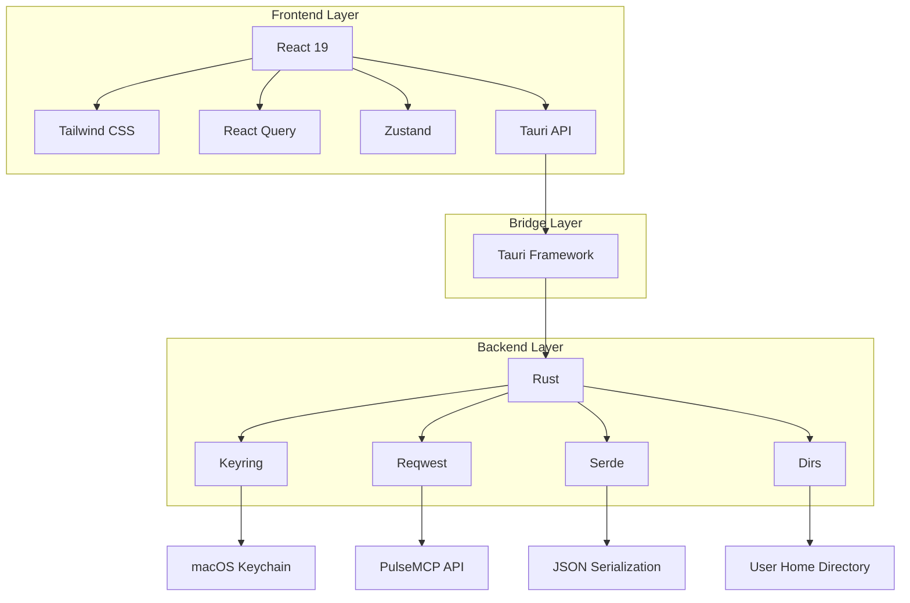
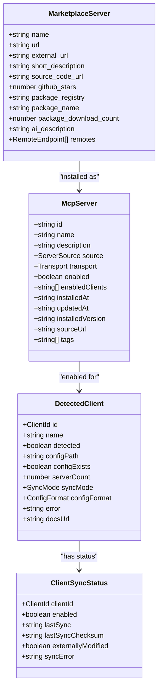
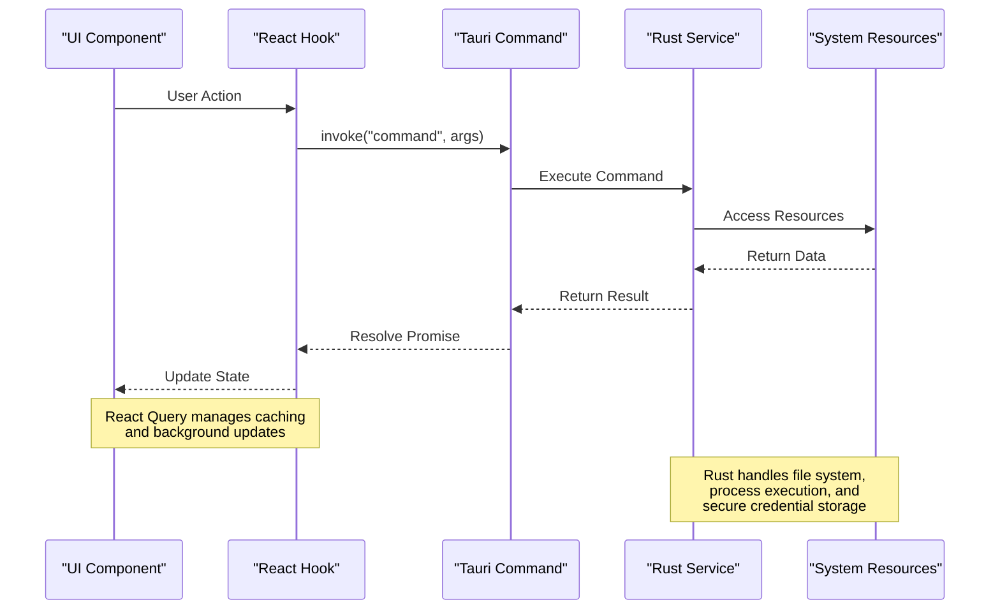
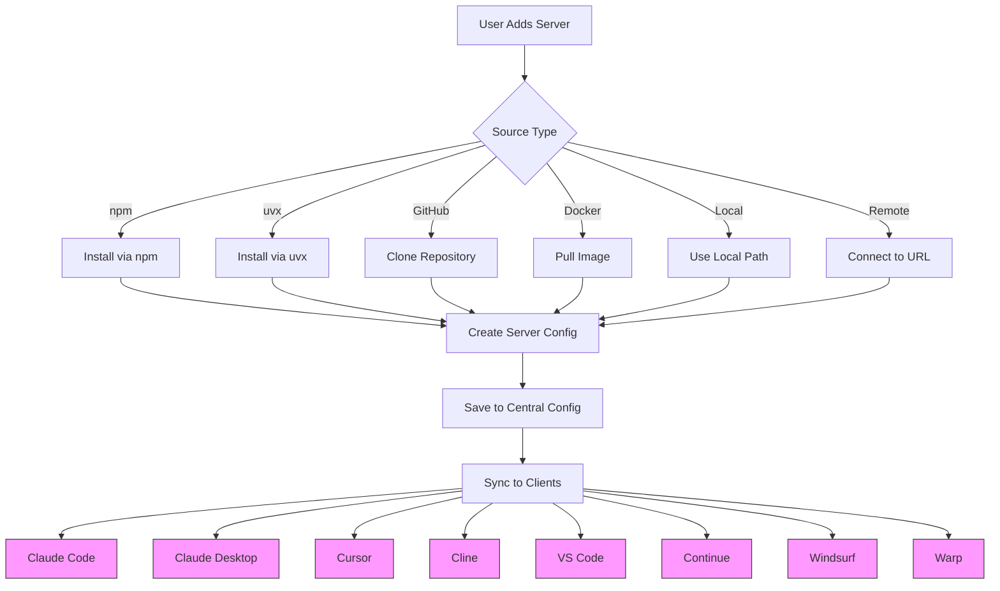

# System Overview

<cite>
**Referenced Files in This Document**   
- [App.tsx](file://src/App.tsx)
- [main.rs](file://src-tauri/src/main.rs)
- [tauri.ts](file://src/lib/tauri.ts)
- [useServers.ts](file://src/hooks/useServers.ts)
- [useClients.ts](file://src/hooks/useClients.ts)
- [useMarketplace.ts](file://src/hooks/useMarketplace.ts)
- [useAutoSync.ts](file://src/hooks/useAutoSync.ts)
- [index.ts](file://src/types/index.ts)
- [mod.rs](file://src-tauri/src/commands/mod.rs)
- [Cargo.toml](file://src-tauri/Cargo.toml)
- [package.json](file://package.json)
- [README.md](file://README.md)
</cite>

## Table of Contents

1. [Introduction](#introduction)
2. [Architecture Overview](#architecture-overview)
3. [Core Components](#core-components)
4. [Data Flow and Integration](#data-flow-and-integration)
5. [Key Capabilities](#key-capabilities)
6. [Use Cases](#use-cases)
7. [Conclusion](#conclusion)

## Introduction

MCP Nexus is a desktop application designed as a centralized management tool for Model Context Protocol (MCP) servers across multiple AI clients. The application enables AI developers to streamline server management through secure credential storage, automatic configuration synchronization, and comprehensive health monitoring. Built with a hybrid architecture combining a React 19 frontend with a Rust backend via the Tauri framework, MCP Nexus provides a robust and secure environment for managing local MCP servers.

The application supports server installation from multiple sources including npm, uvx, GitHub, Docker, and local paths, while offering seamless integration with the PulseMCP marketplace API. Security is enhanced through macOS Keychain integration for credential management, ensuring sensitive API keys and tokens are stored securely. The application simplifies complex configuration workflows by providing a unified interface for managing server configurations across eight supported AI clients, including Claude Code, Cursor, VS Code, and Warp.

**Section sources**

- [README.md](file://README.md#L1-L225)

## Architecture Overview

MCP Nexus employs a hybrid architecture that combines the strengths of React 19 for the frontend and Rust for the backend, connected through the Tauri framework. This architecture provides a secure, performant, and maintainable solution for desktop application development. The frontend is responsible for user interface rendering and state management, while the backend handles system-level operations, file system access, and secure credential storage.

**Diagram sources**

- [main.rs](file://src-tauri/src/main.rs#L1-L7)
- [Cargo.toml](file://src-tauri/Cargo.toml#L1-L37)
- [package.json](file://package.json#L1-L52)

The architecture follows a clear separation of concerns, with the React frontend handling UI components and user interactions, while the Rust backend manages system operations and data persistence. Tauri serves as the bridge between these layers, enabling secure communication through its command system. This design ensures that sensitive operations like credential storage and file system access are handled securely in the Rust backend, while the React frontend provides a responsive and modern user experience.

**Section sources**

- [Cargo.toml](file://src-tauri/Cargo.toml#L1-L37)
- [package.json](file://package.json#L1-L52)

## Core Components

The MCP Nexus application is built around several core components that work together to provide a comprehensive management solution for MCP servers. The frontend is structured using React components organized by feature, with distinct directories for servers, clients, marketplace, and settings. Custom React hooks manage state and business logic, while the backend Rust services handle system operations and data persistence.

The application's data model revolves around key entities such as McpServer, DetectedClient, and SyncEngine, which represent the core concepts of the system. The McpServer interface defines the structure of an MCP server configuration, including its source, transport mechanism, and client associations. The DetectedClient interface represents an AI client detected on the system, with information about its configuration path and sync status. The SyncEngine coordinates the synchronization of server configurations across multiple clients.

**Diagram sources**

- [index.ts](file://src/types/index.ts#L1-L426)
- [tauri.ts](file://src/lib/tauri.ts#L1-L364)

The component architecture follows a modular design, with clear separation between UI components, business logic, and data access layers. React Query is used for data fetching and state management, providing efficient caching and background updates. The use of custom hooks like useServers, useClients, and useMarketplace encapsulates complex logic and provides a clean API for components to interact with the backend services.

**Section sources**

- [App.tsx](file://src/App.tsx#L1-L58)
- [useServers.ts](file://src/hooks/useServers.ts#L1-L182)
- [useClients.ts](file://src/hooks/useClients.ts#L1-L138)
- [useMarketplace.ts](file://src/hooks/useMarketplace.ts#L1-L81)

## Data Flow and Integration

The data flow in MCP Nexus follows a structured pattern from UI components through React Query hooks to Tauri commands and Rust services. When a user interacts with the application, the React components trigger custom hooks that manage the business logic and data fetching. These hooks use Tauri's invoke function to call Rust commands, which are then handled by the corresponding services in the backend.

**Diagram sources**

- [tauri.ts](file://src/lib/tauri.ts#L1-L364)
- [mod.rs](file://src-tauri/src/commands/mod.rs#L1-L36)

The integration between the frontend and backend is facilitated by Tauri's command system, which provides a secure and type-safe way to communicate between JavaScript and Rust. The commands are defined in the Rust backend and exposed to the frontend through the invoke function. This approach ensures that sensitive operations like file system access and credential management are handled securely in the Rust backend, while the frontend remains focused on user interface and user experience.

The data flow is optimized for performance and responsiveness through the use of React Query for caching and background updates. When data is fetched from the backend, it is cached in the frontend and automatically updated when changes occur. This reduces the need for repeated API calls and provides a smooth user experience. The auto-sync functionality is implemented using debounced updates, ensuring that configuration changes are synchronized across clients without overwhelming the system with frequent updates.

**Section sources**

- [tauri.ts](file://src/lib/tauri.ts#L1-L364)
- [useAutoSync.ts](file://src/hooks/useAutoSync.ts#L1-L53)

## Key Capabilities

MCP Nexus provides several key capabilities that make it a powerful tool for managing MCP servers across multiple AI clients. The application supports server installation from multiple sources, including npm, uvx, GitHub, Docker, and local paths, allowing users to easily add servers from various distribution channels. The marketplace integration with the PulseMCP API enables users to discover and install servers with minimal configuration effort.

The automatic configuration synchronization feature ensures that server configurations are kept up-to-date across all enabled clients. When a server configuration is modified, the changes are automatically propagated to the appropriate client configuration files, eliminating the need for manual updates. This synchronization is handled by the SyncEngine, which manages the configuration files for each supported client and ensures that changes are applied consistently.

**Diagram sources**

- [README.md](file://README.md#L1-L225)
- [tauri.ts](file://src/lib/tauri.ts#L1-L364)

The health monitoring capability provides real-time feedback on server status, allowing users to quickly identify and resolve issues. The application periodically checks the health of all configured servers and displays the results in the UI, with visual indicators for healthy, unhealthy, and unknown states. This monitoring is implemented through periodic health checks that verify server connectivity and response times.

Security is a key focus of the application, with sensitive credentials stored securely in the macOS Keychain. When a user configures a server with environment variables that reference credentials, the application stores only the reference in the configuration file, while the actual credential value is stored securely in the Keychain. This approach ensures that sensitive information is never written to disk in plain text.

**Section sources**

- [README.md](file://README.md#L1-L225)
- [tauri.ts](file://src/lib/tauri.ts#L1-L364)
- [useCredentials.ts](file://src/hooks/useCredentials.ts#L1-L63)

## Use Cases

MCP Nexus is designed to address the needs of AI developers who work with multiple AI clients and need to manage MCP servers efficiently. A common use case involves a developer who uses several AI clients like Claude Code, Cursor, and VS Code, each with its own MCP server configuration. Without MCP Nexus, the developer would need to manually configure and update each client separately, which is time-consuming and error-prone. With MCP Nexus, the developer can manage all server configurations from a single interface and have changes automatically synchronized across all clients.

Another use case involves onboarding new team members or setting up a new development environment. Instead of manually configuring each MCP server for each AI client, the team can use MCP Nexus to standardize the configuration process. The central configuration file can be shared among team members, ensuring consistency across development environments. New servers can be added to the configuration and automatically propagated to all team members' clients.

For developers who frequently experiment with different MCP servers, the marketplace integration provides a convenient way to discover and install new servers. The developer can browse the PulseMCP marketplace, view server details and installation instructions, and then install the server with minimal configuration. This reduces the friction associated with trying new servers and encourages experimentation.

The health monitoring feature is particularly valuable for developers who rely on MCP servers for critical tasks. By providing real-time feedback on server status, the application helps developers quickly identify and resolve issues before they impact productivity. The ability to test server connections directly from the UI makes troubleshooting more efficient and reduces downtime.

**Section sources**

- [README.md](file://README.md#L1-L225)

## Conclusion

MCP Nexus provides a comprehensive solution for managing MCP servers across multiple AI clients, addressing the challenges of configuration management, security, and monitoring. The hybrid architecture combining React 19 and Rust through the Tauri framework delivers a secure, performant, and maintainable application that simplifies complex workflows for AI developers. By centralizing server management and automating configuration synchronization, MCP Nexus reduces the cognitive load and manual effort required to maintain multiple AI client configurations.

The application's support for multiple server installation sources, marketplace integration, and secure credential storage makes it a versatile tool for developers working with MCP servers. The health monitoring and auto-sync features enhance reliability and productivity, while the modular architecture ensures that the application can evolve to meet future requirements. As the ecosystem of MCP servers continues to grow, MCP Nexus is well-positioned to serve as the central hub for server management and integration.
