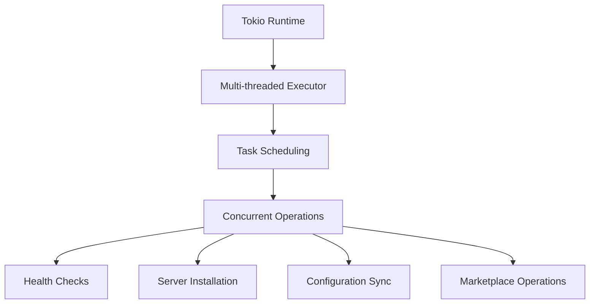
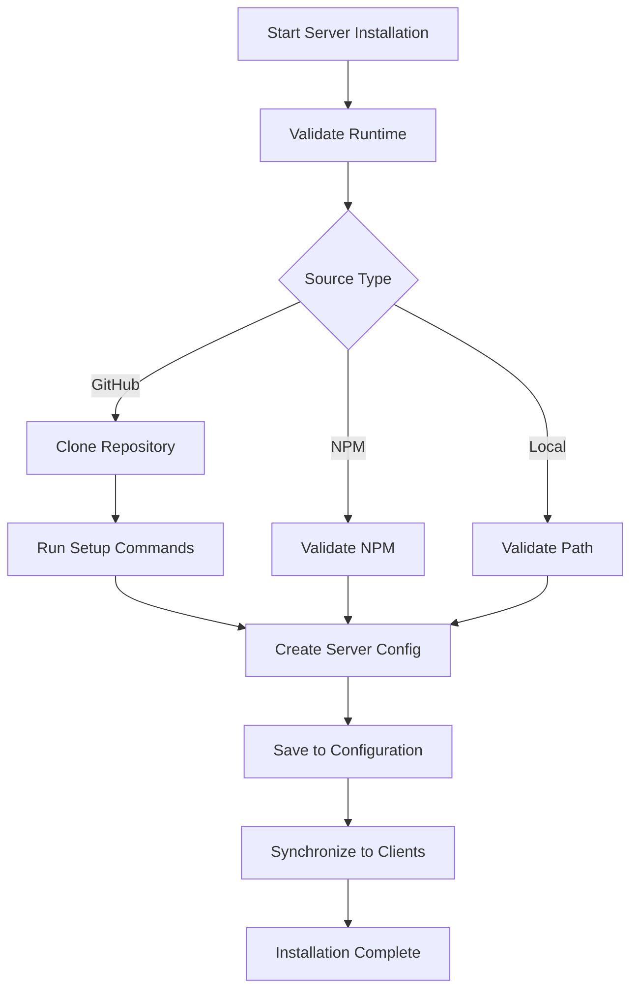
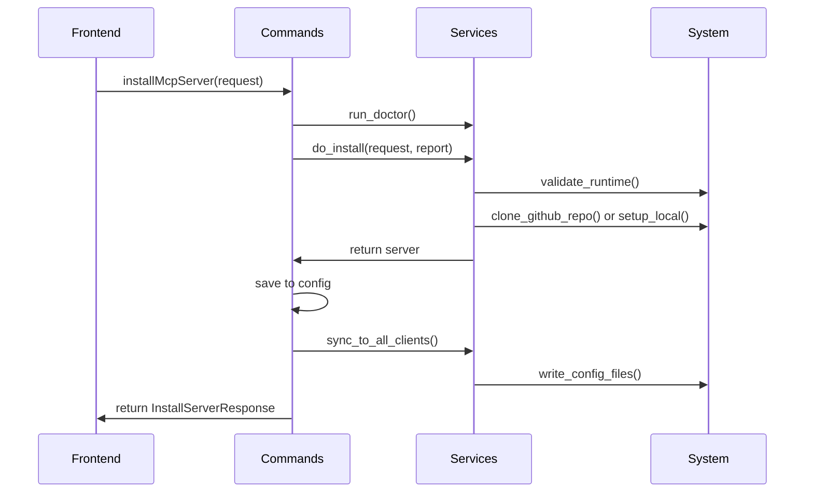

# Async Runtime Configuration

<cite>
**Referenced Files in This Document**   
- [main.rs](file://src-tauri/src/main.rs)
- [lib.rs](file://src-tauri/src/lib.rs)
- [Cargo.toml](file://src-tauri/Cargo.toml)
- [tauri.conf.json](file://src-tauri/tauri.conf.json)
- [installation.rs](file://src-tauri/src/services/installation.rs)
- [health.rs](file://src-tauri/src/services/health.rs)
- [sync_engine.rs](file://src-tauri/src/services/sync_engine.rs)
</cite>

## Table of Contents

1. [Introduction](#introduction)
2. [Tokio Runtime Setup](#tokio-runtime-setup)
3. [Async/Await Usage Patterns](#asyncawait-usage-patterns)
4. [Task Spawning Strategies](#task-spawning-strategies)
5. [Runtime Initialization and Tauri Integration](#runtime-initialization-and-tauri-integration)
6. [Performance Considerations](#performance-considerations)
7. [Shutdown Sequencing](#shutdown-sequencing)
8. [Configuration Options](#configuration-options)
9. [Async Code Patterns](#async-code-patterns)
10. [UI Responsiveness](#ui-responsiveness)

## Introduction

The MCP Nexus application implements an asynchronous runtime configuration that enables responsive user interactions while performing intensive backend operations. Built on the Tokio runtime and integrated with Tauri's event loop, this architecture supports concurrent execution of long-running operations such as server installation, health polling, and configuration synchronization. This document details the async runtime configuration, including the multi-threaded executor setup, async/await usage patterns across services and commands, task spawning strategies, and integration with the Tauri framework.

**Section sources**

- [main.rs](file://src-tauri/src/main.rs#L1-L7)
- [lib.rs](file://src-tauri/src/lib.rs#L1-L89)

## Tokio Runtime Setup

The MCP Nexus application utilizes the Tokio asynchronous runtime for handling concurrent operations. The runtime is configured through Cargo.toml dependencies, where Tokio is included with specific features that support the application's requirements. The configuration includes the "sync", "time", and "process" features, enabling synchronization primitives, time-based operations, and process management capabilities.

The multi-threaded executor is automatically configured by Tokio when the async functions are executed within the Tauri application context. This allows the application to efficiently handle multiple concurrent operations such as health checks, server installations, and configuration synchronization without blocking the main thread.

**Diagram sources**

- [Cargo.toml](file://src-tauri/Cargo.toml#L30)
- [lib.rs](file://src-tauri/src/lib.rs#L19)

## Async/Await Usage Patterns

The application employs async/await patterns consistently across services and commands to ensure non-blocking execution of operations. This approach allows the UI to remain responsive while performing intensive backend tasks. The async functions are defined throughout the services and commands modules, with proper error handling and result propagation.

Key async patterns include:

- Async service functions that perform I/O operations
- Await operations within command handlers
- Error conversion between service and command layers
- Proper handling of async results in the Tauri command system

The services layer contains the core async functionality, with functions like `check_server_health`, `install_server`, and `sync_to_client` implemented as async functions. These functions are then called from the commands layer, which serves as the bridge between the frontend and backend.

**Section sources**

- [health.rs](file://src-tauri/src/services/health.rs#L94-L117)
- [installation.rs](file://src-tauri/src/services/installation.rs#L480-L520)
- [sync_engine.rs](file://src-tauri/src/services/sync_engine.rs#L318-L446)

## Task Spawning Strategies

The application employs strategic task spawning for long-running operations to ensure optimal resource utilization and responsiveness. Operations such as server installation, health polling, and configuration synchronization are designed to run concurrently without blocking the main execution thread.

For server installation, the application spawns tasks that handle the complete installation workflow:

1. Validating runtime requirements
2. Cloning repositories (for GitHub sources)
3. Running setup commands
4. Creating server configuration
5. Saving to central configuration
6. Synchronizing to enabled clients

Health polling operations are implemented to check the status of multiple servers concurrently. The `check_all_health` function iterates through all servers and performs health checks in sequence, allowing for efficient monitoring of server status without blocking the UI.

**Diagram sources**

- [installation.rs](file://src-tauri/src/services/installation.rs#L480-L520)
- [commands/installation.rs](file://src-tauri/src/commands/installation.rs#L98-L135)

## Runtime Initialization and Tauri Integration

The async runtime is initialized through the Tauri application setup in the lib.rs file. The `run()` function serves as the entry point, where the application state is initialized and the Tauri builder is configured with the necessary components.

The initialization process includes:

1. Creating the ConfigManager instance
2. Initializing the MarketplaceClient
3. Setting up the Tauri application with state management
4. Registering command handlers
5. Starting the application event loop

The integration with Tauri's event loop allows the async operations to be properly scheduled and executed within the application's lifecycle. The Tauri command system seamlessly handles async functions, automatically managing the execution context and result propagation.

**Section sources**

- [main.rs](file://src-tauri/src/main.rs#L4-L6)
- [lib.rs](file://src-tauri/src/lib.rs#L22-L88)

## Performance Considerations

The application addresses several performance considerations to ensure efficient resource utilization and optimal user experience. These include thread pool sizing, blocking operation handling, and resource contention avoidance.

Thread pool sizing is managed by Tokio's default configuration, which creates a multi-threaded runtime with a number of worker threads based on the number of CPU cores. This allows for efficient parallel execution of tasks while avoiding excessive thread creation.

Blocking operations are handled by offloading them to dedicated threads when necessary, preventing them from blocking the async runtime. Operations such as file I/O and process spawning are designed to be non-blocking or are executed in a way that doesn't impact the responsiveness of the application.

Resource contention is minimized through the use of appropriate synchronization primitives and careful management of shared state. The application uses Mutex and RwLock for protecting shared data, ensuring that concurrent access is properly coordinated.

**Section sources**

- [Cargo.toml](file://src-tauri/Cargo.toml#L30)
- [lib.rs](file://src-tauri/src/lib.rs#L18-L19)

## Shutdown Sequencing

The application handles graceful termination of async tasks through proper shutdown sequencing. When the application is closed, the Tauri runtime ensures that ongoing operations are allowed to complete or are properly cancelled.

The shutdown process includes:

1. Cancelling any pending health checks
2. Completing or cancelling server installation operations
3. Ensuring configuration changes are properly saved
4. Cleaning up temporary resources
5. Terminating the application gracefully

This ensures that the application state remains consistent and that no data is lost during shutdown.

**Section sources**

- [lib.rs](file://src-tauri/src/lib.rs#L86-L88)

## Configuration Options

The async runtime behavior is influenced by configuration options in both Cargo.toml and tauri.conf.json files. These configuration files define the dependencies, features, and application settings that affect the runtime behavior.

In Cargo.toml, the Tokio dependency is configured with specific features:

- "sync" for synchronization primitives
- "time" for time-based operations
- "process" for process management

The tauri.conf.json file contains application-level configuration that affects the runtime environment, including build settings, window configuration, and security settings.

**Section sources**

- [Cargo.toml](file://src-tauri/Cargo.toml#L30)
- [tauri.conf.json](file://src-tauri/tauri.conf.json#L1-L36)

## Async Code Patterns

The application demonstrates several async code patterns that enable efficient concurrent execution of operations. These patterns are exemplified in various parts of the codebase, particularly in the implementation of concurrent health checks and parallel server installations.

For concurrent health checks, the application implements a pattern where multiple servers are checked sequentially within an async function. The `check_all_health` command handler iterates through all servers and performs health checks, awaiting each check before proceeding to the next. This ensures that health checks are performed efficiently without overwhelming system resources.

For parallel server installations, the application uses async/await to handle the complete installation workflow, from validation to synchronization. The installation process is designed to be non-blocking, allowing the UI to remain responsive during potentially lengthy operations.

**Diagram sources**

- [commands/health.rs](file://src-tauri/src/commands/health.rs#L54-L73)
- [commands/installation.rs](file://src-tauri/src/commands/installation.rs#L98-L135)

## UI Responsiveness

The async design of MCP Nexus enables responsive UI interactions while performing intensive backend operations. By offloading resource-intensive tasks to the async runtime, the application ensures that the user interface remains fluid and responsive.

Key aspects of UI responsiveness include:

- Immediate feedback for user actions
- Progress indicators for long-running operations
- Non-blocking execution of server installations
- Real-time updates of server status
- Smooth navigation between application views

This design allows users to continue interacting with the application while operations such as server installation, health checking, and configuration synchronization are performed in the background.

**Section sources**

- [lib.rs](file://src-tauri/src/lib.rs#L31-L85)
- [commands/health.rs](file://src-tauri/src/commands/health.rs#L32-L49)
