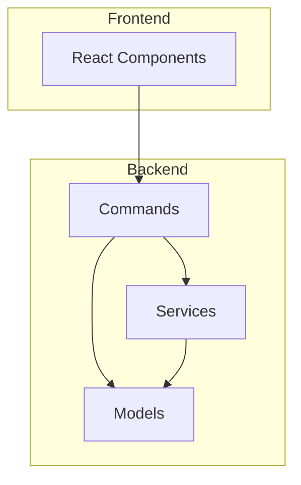
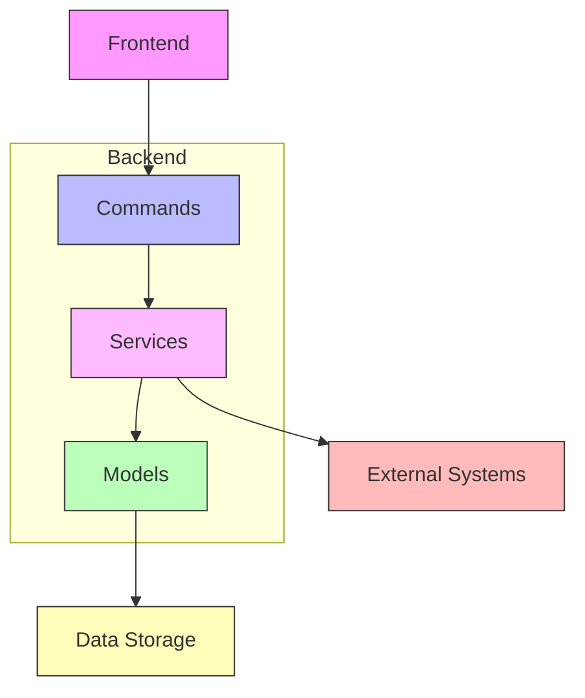
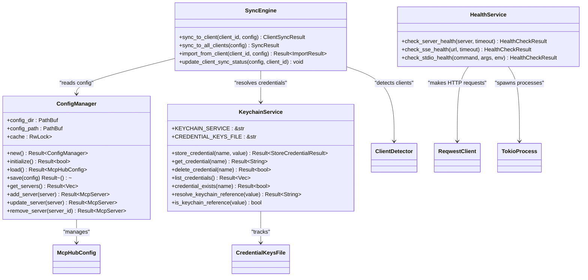
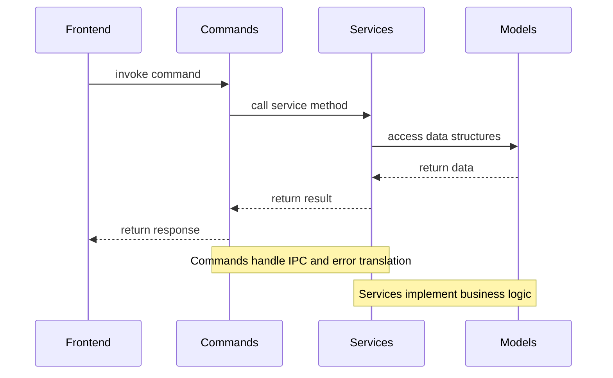
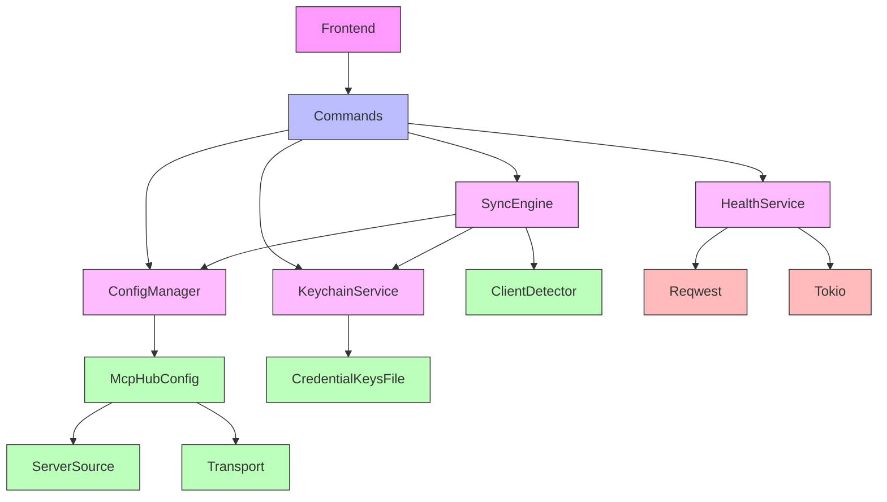

# Backend Architecture

<cite>
**Referenced Files in This Document**   
- [Cargo.toml](file://src-tauri/Cargo.toml)
- [main.rs](file://src-tauri/src/main.rs)
- [lib.rs](file://src-tauri/src/lib.rs)
- [config_manager.rs](file://src-tauri/src/services/config_manager.rs)
- [keychain.rs](file://src-tauri/src/services/keychain.rs)
- [sync_engine.rs](file://src-tauri/src/services/sync_engine.rs)
- [health.rs](file://src-tauri/src/services/health.rs)
- [config.rs](file://src-tauri/src/models/config.rs)
- [server.rs](file://src-tauri/src/models/server.rs)
- [config.rs](file://src-tauri/src/commands/config.rs)
- [keychain.rs](file://src-tauri/src/commands/keychain.rs)
- [sync.rs](file://src-tauri/src/commands/sync.rs)
</cite>

## Table of Contents

1. [Introduction](#introduction)
2. [Project Structure](#project-structure)
3. [Core Components](#core-components)
4. [Architecture Overview](#architecture-overview)
5. [Detailed Component Analysis](#detailed-component-analysis)
6. [Dependency Analysis](#dependency-analysis)
7. [Performance Considerations](#performance-considerations)
8. [Troubleshooting Guide](#troubleshooting-guide)
9. [Conclusion](#conclusion)

## Introduction

The MCP Nexus backend architecture is a Rust-based service layer that implements business logic for server management, client synchronization, health monitoring, and credential management. Built on the Tauri framework, it provides a secure and efficient backend for managing Model Context Protocol (MCP) servers across various AI clients. The architecture follows a service-oriented design with clearly defined components that handle specific domains, exposing functionality to the frontend through Tauri's IPC system.

## Project Structure

The backend code is organized within the `src-tauri` directory, following a modular structure that separates concerns into distinct layers. The architecture consists of three primary layers: commands, services, and models. The commands layer exposes backend functionality to the frontend, the services layer implements business logic, and the models layer defines shared data structures.



**Diagram sources**

- [lib.rs](file://src-tauri/src/lib.rs#L1-L89)
- [mod.rs](file://src-tauri/src/commands/mod.rs#L1-L36)
- [mod.rs](file://src-tauri/src/services/mod.rs#L1-L30)
- [mod.rs](file://src-tauri/src/models/mod.rs#L1-L12)

**Section sources**

- [lib.rs](file://src-tauri/src/lib.rs#L1-L89)

## Core Components

The MCP Nexus backend consists of several core components that work together to provide server management capabilities. The service layer implements business logic for server management, client synchronization, health monitoring, and credential management. Each service handles a specific domain, following a service-oriented architecture pattern. The models layer defines data structures shared between services and commands, while the commands layer exposes backend functionality to the frontend via Tauri's IPC system.

**Section sources**

- [lib.rs](file://src-tauri/src/lib.rs#L1-L89)
- [Cargo.toml](file://src-tauri/Cargo.toml#L1-L37)

## Architecture Overview

The MCP Nexus backend follows a layered architecture with clear separation of concerns. At the foundation is the models layer, which defines the data structures used throughout the application. Above this, the services layer implements business logic in domain-specific modules. The commands layer sits at the top, exposing functionality to the frontend through Tauri's IPC system. The architecture uses dependency injection for service composition and configuration management, with services registered in the Tauri app state.



**Diagram sources**

- [lib.rs](file://src-tauri/src/lib.rs#L22-L88)
- [main.rs](file://src-tauri/src/main.rs#L4-L6)

## Detailed Component Analysis

### Service Layer Analysis

The service layer implements business logic for specific domains, with each service handling a distinct aspect of the application's functionality. Services are designed to be independent and focused on specific responsibilities, following the service-oriented architecture pattern.

#### Service Architecture



**Diagram sources**

- [config_manager.rs](file://src-tauri/src/services/config_manager.rs#L23-L233)
- [keychain.rs](file://src-tauri/src/services/keychain.rs#L15-L304)
- [sync_engine.rs](file://src-tauri/src/services/sync_engine.rs#L15-L446)
- [health.rs](file://src-tauri/src/services/health.rs#L9-L191)

**Section sources**

- [config_manager.rs](file://src-tauri/src/services/config_manager.rs#L1-L427)
- [keychain.rs](file://src-tauri/src/services/keychain.rs#L1-L438)
- [sync_engine.rs](file://src-tauri/src/services/sync_engine.rs#L1-L927)
- [health.rs](file://src-tauri/src/services/health.rs#L1-L207)

### Models Layer Analysis

The models layer defines the data structures shared between services and commands. These models represent the core entities in the application and are designed to be serializable for storage and transmission.

#### Data Models

```mermaid
erDiagram
McpHubConfig {
string version
McpServer[] servers
ClientSettings clients
UserPreferences preferences
}
McpServer {
uuid id
string name
string description
ServerSource source
Transport transport
boolean enabled
string[] enabled_clients
timestamp installed_at
timestamp updated_at
string installed_version
string source_url
string[] tags
}
ClientSettings {
boolean enabled
string config_path
timestamp last_sync
string last_sync_checksum
}
UserPreferences {
boolean auto_detect_clients
boolean show_notifications
boolean auto_sync_on_changes
uint32 registry_refresh_interval
}
ServerSource {
enum type
string package
string version
string path
string image
string url
string repo
string branch
}
Transport {
enum type
string command
string[] args
string[] env
string url
string[] headers
}
McpHubConfig ||--o{ McpServer : "contains"
McpHubConfig }|-- ClientSettings : "has"
McpHubConfig }|-- UserPreferences : "has"
McpServer }|-- ServerSource : "has"
McpServer }|-- Transport : "has"
```

**Diagram sources**

- [config.rs](file://src-tauri/src/models/config.rs#L60-L127)
- [server.rs](file://src-tauri/src/models/server.rs#L51-L131)

**Section sources**

- [config.rs](file://src-tauri/src/models/config.rs#L1-L249)
- [server.rs](file://src-tauri/src/models/server.rs#L1-L233)

### Commands Layer Analysis

The commands layer exposes backend functionality to the frontend via Tauri's IPC system. Each command corresponds to a specific operation that can be invoked from the frontend, with proper error handling and response formatting.

#### Command Flow



**Diagram sources**

- [config.rs](file://src-tauri/src/commands/config.rs#L38-L151)
- [keychain.rs](file://src-tauri/src/commands/keychain.rs#L52-L122)
- [sync.rs](file://src-tauri/src/commands/sync.rs#L72-L142)

**Section sources**

- [config.rs](file://src-tauri/src/commands/config.rs#L1-L151)
- [keychain.rs](file://src-tauri/src/commands/keychain.rs#L1-L144)
- [sync.rs](file://src-tauri/src/commands/sync.rs#L1-L252)

## Dependency Analysis

The MCP Nexus backend has a well-defined dependency structure with clear relationships between components. The architecture uses dependency injection for service composition, with services registered in the Tauri app state and made available to commands through the state management system.



**Diagram sources**

- [lib.rs](file://src-tauri/src/lib.rs#L22-L88)
- [Cargo.toml](file://src-tauri/Cargo.toml#L20-L32)

## Performance Considerations

The MCP Nexus backend is designed with performance in mind, leveraging Rust's efficiency and Tokio's async runtime for non-blocking operations. The configuration manager implements caching to minimize disk I/O, while the health checking service uses asynchronous operations to check multiple servers concurrently. The architecture is optimized for the desktop environment, with careful consideration of resource usage and responsiveness.

## Troubleshooting Guide

The backend includes comprehensive error handling with custom error types that provide meaningful information for debugging. Each service implements specific error types that capture domain-specific failure modes, which are then translated to frontend-friendly responses in the commands layer. For credential management issues, the keychain service provides validation functions to check credential references before attempting to resolve them.

**Section sources**

- [config_manager.rs](file://src-tauri/src/services/config_manager.rs#L10-L20)
- [keychain.rs](file://src-tauri/src/services/keychain.rs#L20-L39)
- [sync_engine.rs](file://src-tauri/src/services/sync_engine.rs#L15-L42)
- [health.rs](file://src-tauri/src/services/health.rs#L9-L23)

## Conclusion

The MCP Nexus backend architecture demonstrates a well-structured, service-oriented design that effectively separates concerns and provides a robust foundation for managing MCP servers. The layered architecture with distinct commands, services, and models layers enables maintainable and extensible code. The use of Rust ensures memory safety and performance, while the integration with Tauri provides a secure bridge to the frontend. The dependency injection pattern and configuration management system allow for flexible service composition, making the architecture adaptable to future requirements.
