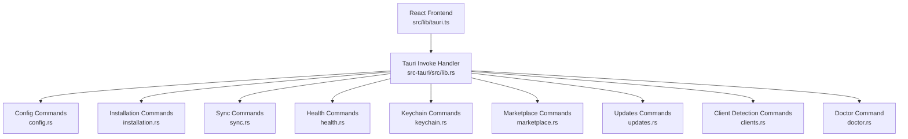
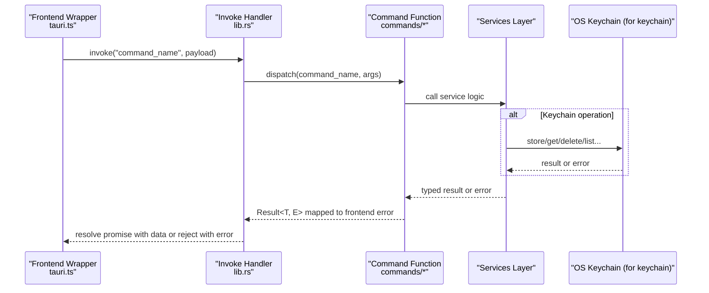
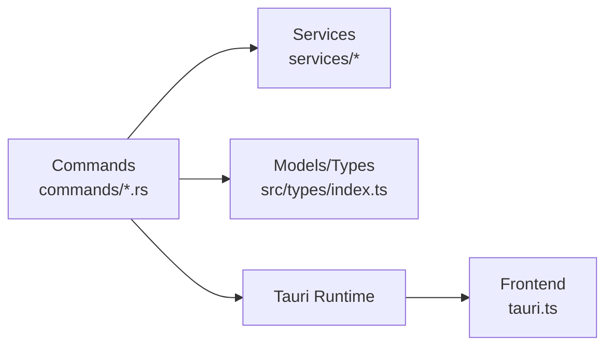

# Command Handlers

<cite>
**Referenced Files in This Document**
- [lib.rs](file://src-tauri/src/lib.rs)
- [main.rs](file://src-tauri/src/main.rs)
- [commands/mod.rs](file://src-tauri/src/commands/mod.rs)
- [tauri.ts](file://src/lib/tauri.ts)
- [config.rs](file://src-tauri/src/commands/config.rs)
- [installation.rs](file://src-tauri/src/commands/installation.rs)
- [sync.rs](file://src-tauri/src/commands/sync.rs)
- [health.rs](file://src-tauri/src/commands/health.rs)
- [keychain.rs](file://src-tauri/src/commands/keychain.rs)
- [marketplace.rs](file://src-tauri/src/commands/marketplace.rs)
- [updates.rs](file://src-tauri/src/commands/updates.rs)
- [clients.rs](file://src-tauri/src/commands/clients.rs)
- [doctor.rs](file://src-tauri/src/commands/doctor.rs)
- [index.ts](file://src/types/index.ts)
</cite>

## Table of Contents

1. [Introduction](#introduction)
2. [Project Structure](#project-structure)
3. [Core Components](#core-components)
4. [Architecture Overview](#architecture-overview)
5. [Detailed Component Analysis](#detailed-component-analysis)
6. [Dependency Analysis](#dependency-analysis)
7. [Performance Considerations](#performance-considerations)
8. [Troubleshooting Guide](#troubleshooting-guide)
9. [Conclusion](#conclusion)

## Introduction

This document describes the Tauri command handlers that form the IPC boundary between the React frontend and the Rust backend in MCP Nexus. Each command group exposes typed functions invoked from the frontend via a thin wrapper, returning strongly-typed results or error objects. The backend uses the #[tauri::command] macro to register functions, executes them on the Tokio runtime, and maps internal errors to frontend-friendly error types. Security is enforced through input validation, explicit error mapping, and OS-level keychain storage for secrets.

## Project Structure

The command handlers are organized by functional groups under src-tauri/src/commands/. The lib.rs file registers all commands with Tauri’s invoke handler, while main.rs delegates to the library entry point. The frontend wrapper in src/lib/tauri.ts provides strongly-typed wrappers around invoke("command_name", payload).

**Diagram sources**

- [lib.rs](file://src-tauri/src/lib.rs#L31-L86)
- [commands/mod.rs](file://src-tauri/src/commands/mod.rs#L1-L36)
- [tauri.ts](file://src/lib/tauri.ts#L1-L364)

**Section sources**

- [lib.rs](file://src-tauri/src/lib.rs#L31-L86)
- [main.rs](file://src-tauri/src/main.rs#L1-L7)
- [commands/mod.rs](file://src-tauri/src/commands/mod.rs#L1-L36)

## Core Components

- Command registration: All commands are registered in lib.rs using tauri::generate_handler! and attached to the Builder. This ensures the frontend can call them by name.
- Async execution: Commands annotated with #[tauri::command] run on the Tokio runtime. Some commands are declared async; others are synchronous but still executed on the background thread pool.
- Error mapping: Each command group defines a frontend-compatible error type and implements From conversions from internal errors. The frontend receives either a typed result or an error object with a message and optional type.
- Frontend wrappers: The tauri.ts wrapper invokes commands with typed arguments and unwraps keychain responses into plain values or throws on failure.

**Section sources**

- [lib.rs](file://src-tauri/src/lib.rs#L31-L86)
- [tauri.ts](file://src/lib/tauri.ts#L1-L364)

## Architecture Overview

The IPC flow is straightforward: the frontend calls a wrapper function that invokes the Tauri command by name. The backend validates inputs, performs operations (often interacting with services), and returns a structured result or error. Keychain commands return a uniform KeychainResponse envelope to standardize success/error semantics.

**Diagram sources**

- [lib.rs](file://src-tauri/src/lib.rs#L31-L86)
- [tauri.ts](file://src/lib/tauri.ts#L1-L364)
- [keychain.rs](file://src-tauri/src/commands/keychain.rs#L1-L144)

## Detailed Component Analysis

### Installation Commands

- install_mcp_server
  - Signature: install_mcp_server(state: State, request: InstallServerRequest, syncAfterInstall: Option<bool>) -> Result<InstallServerResponse, InstallError>
  - Parameters:
    - request: InstallServerRequest (name, source, enabledClients, env, optional metadata)
    - syncAfterInstall: boolean flag controlling post-install sync
  - Returns: InstallServerResponse with installResult and optional syncResult
  - Errors: InstallError with errorType derived from InstallationError variants
  - Behavior: Validates environment, installs server, persists to config, optionally syncs to clients
- uninstall_mcp_server
  - Signature: uninstall_mcp_server(state: State, serverId: String, cleanupResources: Option<bool>, syncAfterUninstall: Option<bool>) -> Result<UninstallServerResponse, InstallError>
  - Parameters: serverId, cleanupResources flag, syncAfterUninstall flag
  - Returns: UninstallServerResponse with success, serverName, optional syncResult, optional error
  - Errors: InstallError with errorType including invalid_id
  - Behavior: Removes server from config, cleans up resources if requested, optionally syncs removal
- validate_install
  - Signature: validate_install(request: ValidateInstallRequest) -> Result<ValidateInstallResponse, InstallError>
  - Parameters: request.source
  - Returns: ValidateInstallResponse with valid flag and optional suggestions
  - Errors: InstallError mapping runtime validation failures
- check_runtime_for_registry
  - Signature: check_runtime_for_registry(registry: String) -> Result<ValidateInstallResponse, InstallError>
  - Parameters: registry identifier (npm, pypi, docker, github)
  - Returns: ValidateInstallResponse indicating whether runtime prerequisites are satisfied
  - Errors: InstallError mapping runtime validation failures

Security considerations:

- Input validation: serverId parsed as UUID; invalid IDs produce InstallError with type invalid_id.
- Privilege separation: installation operations are delegated to services; failures are captured and returned without panics.
- Error mapping: InstallError maps internal errors to frontend-friendly types.

Frontend invocation examples (paths):

- [installMcpServer](file://src/lib/tauri.ts#L236-L241)
- [uninstallMcpServer](file://src/lib/tauri.ts#L251-L261)
- [validateInstall](file://src/lib/tauri.ts#L268-L272)
- [checkRuntimeForRegistry](file://src/lib/tauri.ts#L279-L283)

**Section sources**

- [installation.rs](file://src-tauri/src/commands/installation.rs#L90-L135)
- [installation.rs](file://src-tauri/src/commands/installation.rs#L137-L192)
- [installation.rs](file://src-tauri/src/commands/installation.rs#L194-L226)
- [installation.rs](file://src-tauri/src/commands/installation.rs#L228-L287)
- [tauri.ts](file://src/lib/tauri.ts#L236-L283)

### Sync Commands

- sync_client
  - Signature: sync_client(state: State, clientId: String) -> Result<ClientSyncResult, CommandError>
  - Parameters: clientId
  - Returns: ClientSyncResult with success, serversSynced, optional backupPath/manualConfig
  - Errors: CommandError wrapping config load failures or invalid client IDs
  - Behavior: Validates client ID, loads config, syncs to target client, updates last sync metadata if applicable
- sync_all_clients
  - Signature: sync_all_clients(state: State) -> Result<SyncResult, CommandError>
  - Parameters: none
  - Returns: SyncResult aggregating per-client outcomes
  - Errors: CommandError
  - Behavior: Loads config, syncs to all enabled clients, logs failures, updates client settings
- import_client_servers
  - Signature: import_client_servers(state: State, clientId: String, overwriteExisting: bool) -> Result<ImportResult, CommandError>
  - Parameters: clientId, overwriteExisting
  - Returns: ImportResult with counts and names
  - Errors: CommandError
  - Behavior: Imports servers from a client’s config into central config
- get_manual_config
  - Signature: get_manual_config(state: State, clientId: String) -> Result<String, CommandError>
  - Parameters: clientId
  - Returns: Generated manual config JSON for clients requiring manual setup
  - Errors: CommandError when client does not require manual config
- set_client_sync_enabled
  - Signature: set_client_sync_enabled(state: State, clientId: String, enabled: bool) -> Result<(), CommandError>
  - Parameters: clientId, enabled
  - Returns: void
  - Errors: CommandError
  - Behavior: Updates client settings in config

Security considerations:

- Input validation: clientId parsed to ClientId; invalid values produce CommandError.
- Persistence: All changes saved atomically via ConfigManager; partial failures are handled gracefully.

Frontend invocation examples (paths):

- [syncClient](file://src/lib/tauri.ts#L115-L117)
- [syncAllClients](file://src/lib/tauri.ts#L120-L122)
- [importClientServers](file://src/lib/tauri.ts#L125-L129)
- [getManualConfig](file://src/lib/tauri.ts#L133-L135)
- [setClientSyncEnabled](file://src/lib/tauri.ts#L138-L142)

**Section sources**

- [sync.rs](file://src-tauri/src/commands/sync.rs#L71-L105)
- [sync.rs](file://src-tauri/src/commands/sync.rs#L107-L142)
- [sync.rs](file://src-tauri/src/commands/sync.rs#L144-L176)
- [sync.rs](file://src-tauri/src/commands/sync.rs#L178-L205)
- [sync.rs](file://src-tauri/src/commands/sync.rs#L206-L245)
- [tauri.ts](file://src/lib/tauri.ts#L115-L142)

### Health Commands

- check_health
  - Signature: check_health(state: State, serverId: String) -> Result<HealthCheckResult, HealthError>
  - Parameters: serverId
  - Returns: HealthCheckResult with status, message, checkedAt, optional responseTimeMs
  - Errors: HealthError wrapping invalid server ID or not found
  - Behavior: Loads server from config, performs health check with timeout
- check_all_health
  - Signature: check_all_health(state: State) -> Result<Vec<HealthCheckResult>, HealthError>
  - Parameters: none
  - Returns: List of HealthCheckResult for all servers
  - Errors: HealthError
  - Behavior: Concurrently checks each server
- get_server_status
  - Signature: get_server_status(state: State, serverId: String) -> Result<HealthStatus, HealthError>
  - Parameters: serverId
  - Returns: HealthStatus (Unknown or Stopped based on enabled flag)
  - Errors: HealthError
  - Behavior: Quick status without full health check

Security considerations:

- Input validation: serverId parsed as UUID; invalid IDs produce HealthError.
- Timeout: Health checks bound by a fixed timeout to prevent hangs.

Frontend invocation examples (paths):

- [checkHealth](file://src/lib/tauri.ts#L340-L347)
- [checkAllHealth](file://src/lib/tauri.ts#L349-L354)
- [getServerStatus](file://src/lib/tauri.ts#L356-L363)

**Section sources**

- [health.rs](file://src-tauri/src/commands/health.rs#L31-L50)
- [health.rs](file://src-tauri/src/commands/health.rs#L53-L74)
- [health.rs](file://src-tauri/src/commands/health.rs#L76-L100)
- [tauri.ts](file://src/lib/tauri.ts#L340-L363)

### Keychain Commands

- save_credential
  - Signature: save_credential(name: String, value: String) -> KeychainResponse<StoreCredentialResult>
  - Parameters: name, value
  - Returns: KeychainResponse with success/data/error
  - Errors: Wrapped in KeychainResponse.error
- get_credential_value
  - Signature: get_credential_value(name: String) -> KeychainResponse<String>
  - Parameters: name
  - Returns: KeychainResponse with secret value
  - Errors: Wrapped in KeychainResponse.error
- delete_credential
  - Signature: delete_credential(name: String) -> KeychainResponse<bool>
  - Parameters: name
  - Returns: KeychainResponse with deletion result
  - Errors: Wrapped in KeychainResponse.error
- list_credentials
  - Signature: list_credentials() -> KeychainResponse<Vec<String>>
  - Parameters: none
  - Returns: KeychainResponse with credential names
  - Errors: Wrapped in KeychainResponse.error
- check_credential_exists
  - Signature: check_credential_exists(name: String) -> KeychainResponse<bool>
  - Parameters: name
  - Returns: KeychainResponse with existence flag
  - Errors: Wrapped in KeychainResponse.error
- validate_credential_references
  - Signature: validate_credential_references(envVars: Map<String, String>) -> KeychainResponse<Vec<String>>
  - Parameters: envVars map
  - Returns: KeychainResponse with missing credential names
  - Errors: Wrapped in KeychainResponse.error

Frontend wrapper behavior:

- The tauri.ts wrapper invokes keychain commands and throws if response.success is false, extracting data otherwise.

Security considerations:

- Secrets are stored in OS keychain; get_credential_value returns the actual secret only when needed.
- list_credentials returns names only, avoiding exposure of values.
- validate_credential_references helps prevent misconfiguration by detecting missing references.

Frontend invocation examples (paths):

- [saveCredential](file://src/lib/tauri.ts#L162-L167)
- [getCredentialValue](file://src/lib/tauri.ts#L170-L172)
- [deleteCredential](file://src/lib/tauri.ts#L175-L177)
- [listCredentials](file://src/lib/tauri.ts#L180-L182)
- [checkCredentialExists](file://src/lib/tauri.ts#L185-L187)
- [validateCredentialReferences](file://src/lib/tauri.ts#L190-L194)

**Section sources**

- [keychain.rs](file://src-tauri/src/commands/keychain.rs#L48-L122)
- [tauri.ts](file://src/lib/tauri.ts#L150-L194)

### Marketplace Commands

- search_servers
  - Signature: search_servers(state: State, params: SearchServersParams) -> Result<SearchResult, MarketplaceCommandError>
  - Parameters: SearchServersParams (query, page_size, page, sort, filters)
  - Returns: SearchResult with servers, total_count, has_more, page, page_size
  - Errors: MarketplaceCommandError with error_type and optional retry_after_seconds
- get_server_details
  - Signature: get_server_details(state: State, name: String) -> Result<Option<MarketplaceServer>, MarketplaceCommandError>
  - Parameters: name
  - Returns: Optional server details
  - Errors: MarketplaceCommandError
- clear_marketplace_cache
  - Signature: clear_marketplace_cache(state: State) -> Result<(), MarketplaceCommandError>
  - Parameters: none
  - Returns: void
  - Errors: MarketplaceCommandError
- check_marketplace_cache
  - Signature: check_marketplace_cache(state: State, params: SearchServersParams) -> Result<bool, MarketplaceCommandError>
  - Parameters: SearchServersParams
  - Returns: Boolean indicating cached presence
  - Errors: MarketplaceCommandError

Security considerations:

- Network requests are handled by the service layer; errors are normalized to MarketplaceCommandError with error_type.

Frontend invocation examples (paths):

- [searchServers](file://src/lib/tauri.ts#L200-L202)
- [getServerDetails](file://src/lib/tauri.ts#L206-L209)
- [clearMarketplaceCache](file://src/lib/tauri.ts#L213-L214)
- [checkMarketplaceCache](file://src/lib/tauri.ts#L218-L221)

**Section sources**

- [marketplace.rs](file://src-tauri/src/commands/marketplace.rs#L128-L153)
- [marketplace.rs](file://src-tauri/src/commands/marketplace.rs#L156-L167)
- [marketplace.rs](file://src-tauri/src/commands/marketplace.rs#L170-L177)
- [marketplace.rs](file://src-tauri/src/commands/marketplace.rs#L180-L189)
- [tauri.ts](file://src/lib/tauri.ts#L200-L221)

### Updates Commands

- check_for_updates
  - Signature: check_for_updates(state: State) -> Result<UpdateCheckResult, UpdateError>
  - Parameters: none
  - Returns: UpdateCheckResult summarizing updates across servers
  - Errors: UpdateError
- check_server_update
  - Signature: check_server_update(state: State, serverId: String) -> Result<Option<ServerUpdate>, UpdateError>
  - Parameters: serverId
  - Returns: Optional ServerUpdate
  - Errors: UpdateError with error_type invalid_id for malformed IDs
- check_package_version
  - Signature: check_package_version(request: CheckPackageVersionRequest) -> Result<CheckPackageVersionResponse, UpdateError>
  - Parameters: CheckPackageVersionRequest (packageName, registry, installedVersion)
  - Returns: CheckPackageVersionResponse with update availability
  - Errors: UpdateError
- get_update_count
  - Signature: get_update_count(state: State) -> Result<usize, UpdateError>
  - Parameters: none
  - Returns: Count of servers with available updates
  - Errors: UpdateError

Security considerations:

- Input validation: serverId parsed as UUID; invalid IDs produce UpdateError with invalid_id.
- Registry-specific logic: npm/pypi checks; unsupported registries return appropriate error messages.

Frontend invocation examples (paths):

- [checkForUpdates](file://src/lib/tauri.ts#L293-L295)
- [checkServerUpdate](file://src/lib/tauri.ts#L302-L306)
- [checkPackageVersion](file://src/lib/tauri.ts#L322-L325)
- [getUpdateCount](file://src/lib/tauri.ts#L332-L334)

**Section sources**

- [updates.rs](file://src-tauri/src/commands/updates.rs#L54-L67)
- [updates.rs](file://src-tauri/src/commands/updates.rs#L70-L140)
- [updates.rs](file://src-tauri/src/commands/updates.rs#L146-L226)
- [updates.rs](file://src-tauri/src/commands/updates.rs#L232-L242)
- [tauri.ts](file://src/lib/tauri.ts#L293-L334)

### Config Commands

- initialize_config
  - Signature: initialize_config(state: State) -> Result<InitResult, CommandError>
  - Parameters: none
  - Returns: InitResult with first_run, config_dir, config_path
  - Errors: CommandError
- get_config
  - Signature: get_config(state: State) -> Result<McpHubConfig, CommandError>
  - Parameters: none
  - Returns: McpHubConfig
  - Errors: CommandError
- save_config
  - Signature: save_config(state: State, config: McpHubConfig) -> Result<(), CommandError>
  - Parameters: config
  - Returns: void
  - Errors: CommandError
- get_servers
  - Signature: get_servers(state: State) -> Result<Vec<McpServer>, CommandError>
  - Parameters: none
  - Returns: List of McpServer
  - Errors: CommandError
- get_server
  - Signature: get_server(state: State, serverId: String) -> Result<McpServer, CommandError>
  - Parameters: serverId
  - Returns: McpServer
  - Errors: CommandError with invalid server ID
- add_server
  - Signature: add_server(state: State, server: McpServer) -> Result<McpServer, CommandError>
  - Parameters: server
  - Returns: McpServer
  - Errors: CommandError
- update_server
  - Signature: update_server(state: State, server: McpServer) -> Result<McpServer, CommandError>
  - Parameters: server
  - Returns: McpServer
  - Errors: CommandError
- remove_server
  - Signature: remove_server(state: State, serverId: String) -> Result<McpServer, CommandError>
  - Parameters: serverId
  - Returns: McpServer
  - Errors: CommandError with invalid server ID
- toggle_server_client
  - Signature: toggle_server_client(state: State, serverId: String, clientId: String, enabled: bool) -> Result<(), CommandError>
  - Parameters: serverId, clientId, enabled
  - Returns: void
  - Errors: CommandError with invalid IDs

Security considerations:

- Input validation: serverId and clientId parsed to UUIDs/ClientId; invalid values produce CommandError.
- Atomic persistence: All writes go through ConfigManager to ensure consistency.

Frontend invocation examples (paths):

- [initializeConfig](file://src/lib/tauri.ts#L38-L40)
- [getConfig](file://src/lib/tauri.ts#L43-L45)
- [saveConfig](file://src/lib/tauri.ts#L47-L50)
- [getServers](file://src/lib/tauri.ts#L53-L55)
- [getServer](file://src/lib/tauri.ts#L58-L60)
- [addServer](file://src/lib/tauri.ts#L63-L65)
- [updateServer](file://src/lib/tauri.ts#L68-L70)
- [removeServer](file://src/lib/tauri.ts#L73-L75)
- [toggleServerClient](file://src/lib/tauri.ts#L77-L84)

**Section sources**

- [config.rs](file://src-tauri/src/commands/config.rs#L38-L56)
- [config.rs](file://src-tauri/src/commands/config.rs#L60-L73)
- [config.rs](file://src-tauri/src/commands/config.rs#L66-L73)
- [config.rs](file://src-tauri/src/commands/config.rs#L76-L80)
- [config.rs](file://src-tauri/src/commands/config.rs#L83-L93)
- [config.rs](file://src-tauri/src/commands/config.rs#L96-L103)
- [config.rs](file://src-tauri/src/commands/config.rs#L106-L116)
- [config.rs](file://src-tauri/src/commands/config.rs#L119-L132)
- [config.rs](file://src-tauri/src/commands/config.rs#L135-L151)
- [tauri.ts](file://src/lib/tauri.ts#L38-L84)

### Client Detection Commands

- detect_clients
  - Signature: detect_clients() -> Result<Vec<DetectedClient>, CommandError>
  - Parameters: none
  - Returns: DetectedClient list
  - Errors: CommandError
- get_client_status
  - Signature: get_client_status(state: State, clientId: String) -> Result<ClientSyncStatus, CommandError>
  - Parameters: clientId
  - Returns: ClientSyncStatus with externallyModified and syncError hints
  - Errors: CommandError
- get_all_client_statuses
  - Signature: get_all_client_statuses(state: State) -> Result<Vec<ClientSyncStatus>, CommandError>
  - Parameters: none
  - Returns: ClientSyncStatus list
  - Errors: CommandError
- get_client_config
  - Signature: get_client_config(clientId: String) -> Result<Option<ClientConfigInfo>, CommandError>
  - Parameters: clientId
  - Returns: Optional ClientConfigInfo
  - Errors: CommandError

Security considerations:

- Input validation: clientId parsed to ClientId; invalid values produce CommandError.
- Change detection: Compares checksums to detect external modifications.

Frontend invocation examples (paths):

- [detectClients](file://src/lib/tauri.ts#L89-L91)
- [getClientStatus](file://src/lib/tauri.ts#L94-L98)
- [getAllClientStatuses](file://src/lib/tauri.ts#L101-L103)
- [getClientConfig](file://src/lib/tauri.ts#L106-L110)

**Section sources**

- [clients.rs](file://src-tauri/src/commands/clients.rs#L11-L15)
- [clients.rs](file://src-tauri/src/commands/clients.rs#L18-L70)
- [clients.rs](file://src-tauri/src/commands/clients.rs#L73-L126)
- [clients.rs](file://src-tauri/src/commands/clients.rs#L129-L141)
- [tauri.ts](file://src/lib/tauri.ts#L89-L110)

### Doctor Command

- run_doctor
  - Signature: run_doctor() -> DoctorReport
  - Parameters: none
  - Returns: DoctorReport describing environment health
  - Errors: None (returns report directly)

Frontend invocation example (path):

- [runDoctor](file://src/lib/tauri.ts#L146-L148)

**Section sources**

- [doctor.rs](file://src-tauri/src/commands/doctor.rs#L1-L9)
- [tauri.ts](file://src/lib/tauri.ts#L146-L148)

## Dependency Analysis

The command layer depends on:

- Services for business logic (installation, sync, health, marketplace, updates, keychain, config).
- Models/types defined in src/types/index.ts for serialization/deserialization across the IPC boundary.
- Tauri state management for shared AppState and MarketplaceState.

**Diagram sources**

- [lib.rs](file://src-tauri/src/lib.rs#L31-L86)
- [index.ts](file://src/types/index.ts#L1-L426)

**Section sources**

- [lib.rs](file://src-tauri/src/lib.rs#L31-L86)
- [index.ts](file://src/types/index.ts#L1-L426)

## Performance Considerations

- Async commands: Some commands are declared async and run on the Tokio runtime, enabling non-blocking network calls (e.g., marketplace search, health checks).
- Batch operations: sync_all_clients aggregates results and updates config once, minimizing repeated writes.
- Caching: Marketplace commands expose cache operations to reduce network overhead.
- Logging: Sync failures are logged to a persistent file for diagnostics without impacting UI responsiveness.

[No sources needed since this section provides general guidance]

## Troubleshooting Guide

Common error scenarios and how they surface to the frontend:

- Invalid identifiers:
  - install/uninstall/update commands map invalid serverId to InstallError with errorType invalid_id.
  - sync/config commands map invalid client/server IDs to CommandError with descriptive messages.
- Network/API errors:
  - Marketplace commands map rate limits and API errors to MarketplaceCommandError with error_type and retry_after_seconds.
- Runtime validation failures:
  - Installation commands map missing runtimes to InstallError with missing_runtime and suggestion.
- Keychain failures:
  - Keychain commands return KeychainResponse.error; the frontend wrapper throws on failure.

Frontend handling:

- Keychain wrappers use a helper to unwrap KeychainResponse and throw on failure.
- Other commands return typed results; callers should handle errors appropriately.

**Section sources**

- [installation.rs](file://src-tauri/src/commands/installation.rs#L18-L46)
- [installation.rs](file://src-tauri/src/commands/installation.rs#L150-L153)
- [marketplace.rs](file://src-tauri/src/commands/marketplace.rs#L24-L56)
- [keychain.rs](file://src-tauri/src/commands/keychain.rs#L1-L35)
- [tauri.ts](file://src/lib/tauri.ts#L150-L194)

## Conclusion

The Tauri command handlers provide a robust, typed IPC boundary between the React frontend and Rust backend. Each command group is self-contained, with explicit input validation, consistent error mapping, and strong typing via shared models. The frontend wrappers encapsulate invoke calls and normalize keychain responses, simplifying error handling on the UI. Security is addressed through OS keychain storage, explicit validation, and careful error propagation.
