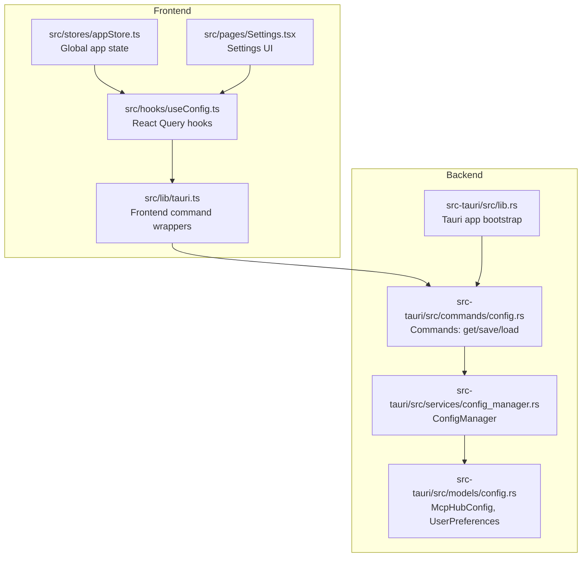
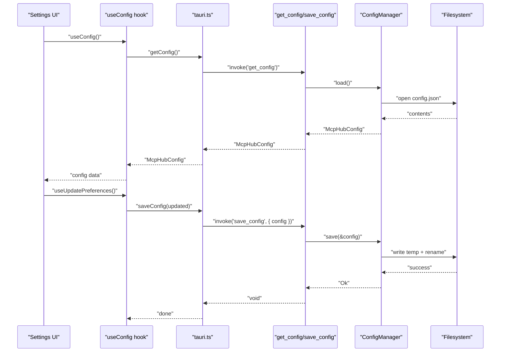
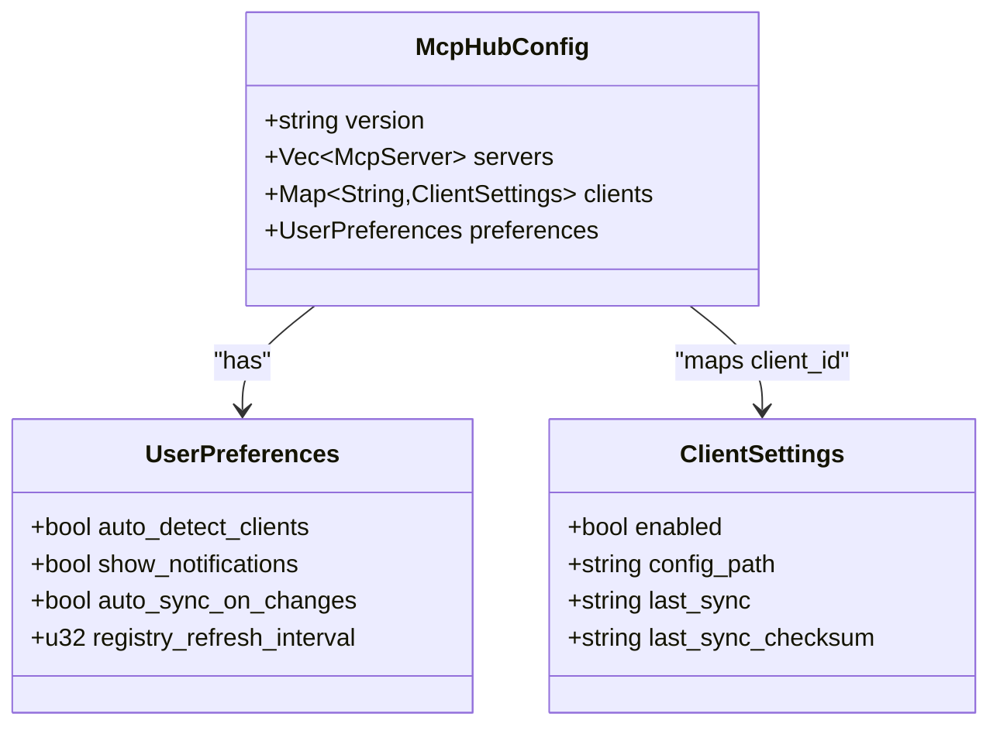
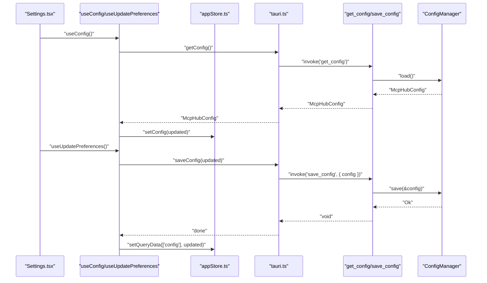
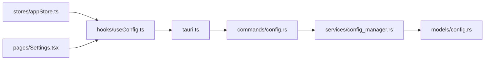

# Configuration Commands

<cite>
**Referenced Files in This Document**
- [config.rs](file://src-tauri/src/commands/config.rs)
- [config_manager.rs](file://src-tauri/src/services/config_manager.rs)
- [config.rs](file://src-tauri/src/models/config.rs)
- [lib.rs](file://src-tauri/src/lib.rs)
- [tauri.ts](file://src/lib/tauri.ts)
- [useConfig.ts](file://src/hooks/useConfig.ts)
- [appStore.ts](file://src/stores/appStore.ts)
- [Settings.tsx](file://src/pages/Settings.tsx)
- [index.ts](file://src/types/index.ts)
</cite>

## Table of Contents

1. [Introduction](#introduction)
2. [Project Structure](#project-structure)
3. [Core Components](#core-components)
4. [Architecture Overview](#architecture-overview)
5. [Detailed Component Analysis](#detailed-component-analysis)
6. [Dependency Analysis](#dependency-analysis)
7. [Performance Considerations](#performance-considerations)
8. [Troubleshooting Guide](#troubleshooting-guide)
9. [Conclusion](#conclusion)
10. [Appendices](#appendices)

## Introduction

This document describes the configuration command handlers in MCP Nexus that manage the central McpHubConfig structure. It covers the get_config, save_config, and related configuration operations, including their parameters, return types, error handling, persistence mechanisms, schema defaults, and integration with the frontend via appStore and React Query. It also outlines security considerations for configuration file permissions and protection against malicious configuration injection.

## Project Structure

The configuration system spans Rust backend commands, a service layer managing persistence and validation, and TypeScript frontend bindings and state.



**Diagram sources**

- [lib.rs](file://src-tauri/src/lib.rs#L21-L88)
- [config.rs](file://src-tauri/src/commands/config.rs#L38-L73)
- [config_manager.rs](file://src-tauri/src/services/config_manager.rs#L90-L153)
- [config.rs](file://src-tauri/src/models/config.rs#L60-L127)
- [tauri.ts](file://src/lib/tauri.ts#L37-L50)
- [useConfig.ts](file://src/hooks/useConfig.ts#L1-L42)
- [appStore.ts](file://src/stores/appStore.ts#L1-L118)
- [Settings.tsx](file://src/pages/Settings.tsx#L1-L219)

**Section sources**

- [lib.rs](file://src-tauri/src/lib.rs#L21-L88)
- [config.rs](file://src-tauri/src/commands/config.rs#L38-L73)
- [config_manager.rs](file://src-tauri/src/services/config_manager.rs#L90-L153)
- [config.rs](file://src-tauri/src/models/config.rs#L60-L127)
- [tauri.ts](file://src/lib/tauri.ts#L37-L50)
- [useConfig.ts](file://src/hooks/useConfig.ts#L1-L42)
- [appStore.ts](file://src/stores/appStore.ts#L1-L118)
- [Settings.tsx](file://src/pages/Settings.tsx#L1-L219)

## Core Components

- Backend commands expose get_config and save_config to the frontend and delegate to ConfigManager.
- ConfigManager manages the McpHubConfig model, persists to disk with atomic writes, and enforces file permissions.
- Frontend wrappers in tauri.ts provide strongly typed invocations for get_config and save_config.
- React Query hooks (useConfig) fetch and update preferences reactively.
- Global appStore mirrors configuration state for UI rendering and derived computations.

**Section sources**

- [config.rs](file://src-tauri/src/commands/config.rs#L58-L73)
- [config_manager.rs](file://src-tauri/src/services/config_manager.rs#L90-L153)
- [tauri.ts](file://src/lib/tauri.ts#L37-L50)
- [useConfig.ts](file://src/hooks/useConfig.ts#L1-L42)
- [appStore.ts](file://src/stores/appStore.ts#L1-L118)

## Architecture Overview

The configuration lifecycle flows from frontend requests to backend commands, then to the ConfigManager service, and finally to persistent storage. The system ensures atomic writes and secure file permissions.



**Diagram sources**

- [config.rs](file://src-tauri/src/commands/config.rs#L58-L73)
- [config_manager.rs](file://src-tauri/src/services/config_manager.rs#L129-L153)
- [tauri.ts](file://src/lib/tauri.ts#L37-L50)
- [useConfig.ts](file://src/hooks/useConfig.ts#L1-L42)

## Detailed Component Analysis

### Backend Commands: get_config and save_config

- get_config
  - Purpose: Retrieve the full McpHubConfig from the ConfigManager.
  - Parameters: None (uses Tauri State to access ConfigManager).
  - Returns: McpHubConfig.
  - Errors: Propagated as CommandError wrapping ConfigError variants.
- save_config
  - Purpose: Persist the provided McpHubConfig to disk atomically.
  - Parameters: config: McpHubConfig.
  - Returns: void.
  - Errors: Propagated as CommandError wrapping ConfigError variants.

These commands are registered in the Tauri builder and exposed to the frontend via tauri.ts.

**Section sources**

- [config.rs](file://src-tauri/src/commands/config.rs#L58-L73)
- [lib.rs](file://src-tauri/src/lib.rs#L31-L46)
- [tauri.ts](file://src/lib/tauri.ts#L37-L50)

### ConfigManager Service

- Responsibilities:
  - Initialize config directory and default config file on first run.
  - Load configuration with caching.
  - Save configuration atomically using a temporary file and rename.
  - Enforce file permissions (user-only read/write).
  - Provide server CRUD operations and client enablement toggles.
- Persistence:
  - Uses atomic write pattern: write to a temporary file, sync, then rename to the target path.
  - On Unix systems, sets file permissions to 0600.
- Caching:
  - Maintains an RwLock-backed cache to avoid repeated disk reads until invalidated.

```mermaid
flowchart TD
Start([Entry: save(config)]) --> Serialize["Serialize to pretty JSON"]
Serialize --> WriteTmp["Write to temp file<br/>config.json.tmp"]
WriteTmp --> Sync["fsync to disk"]
Sync --> SetPerm{"Unix platform?"}
SetPerm --> |Yes| Perm["Set 0600 permissions"]
SetPerm --> |No| Rename
Perm --> Rename["Rename temp to config.json"]
Rename --> Cache["Update in-memory cache"]
Cache --> Done([Exit: Ok])
```

**Diagram sources**

- [config_manager.rs](file://src-tauri/src/services/config_manager.rs#L129-L153)

**Section sources**

- [config_manager.rs](file://src-tauri/src/services/config_manager.rs#L64-L153)

### McpHubConfig Model and Schema Defaults

- McpHubConfig includes:
  - version: String (used for migrations).
  - servers: Vec<McpServer>.
  - clients: HashMap<String, ClientSettings>.
  - preferences: UserPreferences.
- UserPreferences defaults:
  - auto_detect_clients: true.
  - show_notifications: true.
  - auto_sync_on_changes: true.
  - registry_refresh_interval: 60 (minutes).
- Serialization:
  - Uses serde with camelCase field names.
  - Defaults are populated by serde when fields are missing.



**Diagram sources**

- [config.rs](file://src-tauri/src/models/config.rs#L60-L127)

**Section sources**

- [config.rs](file://src-tauri/src/models/config.rs#L60-L127)

### Frontend Integration: tauri.ts, useConfig, appStore

- tauri.ts exposes:
  - getConfig(): Promise<McpHubConfig>
  - saveConfig(config: McpHubConfig): Promise<void>
- useConfig hook:
  - useQuery to fetch McpHubConfig with a 60-second stale time.
  - useUpdatePreferences mutation updates preferences locally and persists via saveConfig, then updates the query cache.
- appStore:
  - Mirrors configuration state and derived servers list.
  - Provides actions to update preferences and servers in memory, keeping UI consistent.



**Diagram sources**

- [tauri.ts](file://src/lib/tauri.ts#L37-L50)
- [useConfig.ts](file://src/hooks/useConfig.ts#L1-L42)
- [appStore.ts](file://src/stores/appStore.ts#L1-L118)
- [config.rs](file://src-tauri/src/commands/config.rs#L58-L73)
- [config_manager.rs](file://src-tauri/src/services/config_manager.rs#L116-L153)

**Section sources**

- [tauri.ts](file://src/lib/tauri.ts#L37-L50)
- [useConfig.ts](file://src/hooks/useConfig.ts#L1-L42)
- [appStore.ts](file://src/stores/appStore.ts#L1-L118)
- [Settings.tsx](file://src/pages/Settings.tsx#L1-L219)

### Security Considerations

- File Permissions:
  - On Unix platforms, the configuration file is written with 0600 permissions (user-only read/write) to prevent unauthorized access.
- Atomic Writes:
  - The save operation writes to a temporary file and renames it, preventing partial writes and race conditions.
- Injection Protection:
  - Configuration is serialized/deserialized via serde_json. While there is no explicit schema validator, the McpHubConfig structure defines strict field types and defaults. Frontend mutations should validate inputs before calling saveConfig to avoid malformed data.

**Section sources**

- [config_manager.rs](file://src-tauri/src/services/config_manager.rs#L129-L153)

### Error Handling

- Backend errors:
  - ConfigError variants include directory creation failures, parse errors, and server not found.
  - CommandError wraps ConfigError messages for Tauri responses.
- Frontend handling:
  - tauri.ts commands throw on failure; consumers should catch and display user-friendly messages.
  - useConfig mutation handles optimistic updates and invalidates cache on success.

**Section sources**

- [config_manager.rs](file://src-tauri/src/services/config_manager.rs#L10-L21)
- [config.rs](file://src-tauri/src/commands/config.rs#L11-L23)
- [tauri.ts](file://src/lib/tauri.ts#L37-L50)
- [useConfig.ts](file://src/hooks/useConfig.ts#L1-L42)

### Migration System for Version Upgrades

- The McpHubConfig includes a version field intended for migrations.
- Current implementation initializes default config with version "1.0".
- Migration logic is not present in the analyzed files; future versions should implement a migration routine that:
  - Reads the stored version.
  - Applies transformations for each subsequent version.
  - Updates the stored version upon successful migration.
- Recommendation:
  - Add a migrate_config(config: &mut McpHubConfig) function invoked during load when version differs from current.

**Section sources**

- [config.rs](file://src-tauri/src/models/config.rs#L60-L86)
- [config_manager.rs](file://src-tauri/src/services/config_manager.rs#L90-L114)

### Frontend Invocation Examples

- Settings Page:
  - Displays auto-sync preference bound to config.preferences.autoSyncOnChanges.
  - Uses useUpdatePreferences to update preferences and persist via saveConfig.
- Various Configuration Modals:
  - CredentialManager and other modals should:
    - Validate inputs (e.g., non-empty names/values).
    - Construct McpHubConfig updates (e.g., preferences).
    - Call saveConfig to persist changes.
    - Update appStore to reflect reactive UI updates.

**Section sources**

- [Settings.tsx](file://src/pages/Settings.tsx#L1-L219)
- [useConfig.ts](file://src/hooks/useConfig.ts#L1-L42)
- [appStore.ts](file://src/stores/appStore.ts#L1-L118)

## Dependency Analysis

The configuration subsystem exhibits clean separation of concerns with low coupling between frontend and backend.



**Diagram sources**

- [tauri.ts](file://src/lib/tauri.ts#L37-L50)
- [config.rs](file://src-tauri/src/commands/config.rs#L38-L73)
- [config_manager.rs](file://src-tauri/src/services/config_manager.rs#L90-L153)
- [config.rs](file://src-tauri/src/models/config.rs#L60-L127)
- [useConfig.ts](file://src/hooks/useConfig.ts#L1-L42)
- [appStore.ts](file://src/stores/appStore.ts#L1-L118)
- [Settings.tsx](file://src/pages/Settings.tsx#L1-L219)

**Section sources**

- [lib.rs](file://src-tauri/src/lib.rs#L31-L46)
- [config.rs](file://src-tauri/src/commands/config.rs#L38-L73)
- [config_manager.rs](file://src-tauri/src/services/config_manager.rs#L90-L153)
- [config.rs](file://src-tauri/src/models/config.rs#L60-L127)
- [tauri.ts](file://src/lib/tauri.ts#L37-L50)
- [useConfig.ts](file://src/hooks/useConfig.ts#L1-L42)
- [appStore.ts](file://src/stores/appStore.ts#L1-L118)
- [Settings.tsx](file://src/pages/Settings.tsx#L1-L219)

## Performance Considerations

- Caching:
  - ConfigManager caches loaded configurations to reduce disk I/O.
  - Cache invalidation occurs on save; consider adding explicit invalidation APIs if needed.
- Serialization:
  - Pretty-printed JSON improves readability but increases file size slightly; consider compact serialization if storage is constrained.
- Atomic Writes:
  - Ensures durability but incurs extra fsync and rename operations; acceptable trade-off for safety.

[No sources needed since this section provides general guidance]

## Troubleshooting Guide

Common issues and resolutions:

- Permission Denied:
  - Symptom: save_config fails with permission errors.
  - Resolution: Ensure the user account has write access to the config directory (~/.mcp-nexus). On Unix, verify 0600 permissions are applied post-save.
- Corrupted Config:
  - Symptom: get_config fails to parse JSON.
  - Resolution: Restore from backup if available; otherwise, re-run initialization to regenerate defaults.
- Stale Data:
  - Symptom: UI shows outdated preferences.
  - Resolution: Invalidate React Query cache or reload the page; the cache TTL is 60 seconds.

**Section sources**

- [config_manager.rs](file://src-tauri/src/services/config_manager.rs#L129-L153)
- [useConfig.ts](file://src/hooks/useConfig.ts#L1-L42)

## Conclusion

The configuration subsystem provides a robust, secure, and reactive way to manage McpHubConfig. Backend commands expose get_config and save_config, backed by a ConfigManager that persists data atomically with appropriate file permissions. The frontend integrates seamlessly via tauri.ts, React Query, and appStore, enabling real-time updates across the application. Future enhancements should focus on implementing a formal migration system and adding explicit schema validation for stricter configuration integrity.

[No sources needed since this section summarizes without analyzing specific files]

## Appendices

### API Definitions

- get_config
  - Method: invoke("get_config")
  - Parameters: none
  - Returns: McpHubConfig
  - Errors: CommandError(message)
- save_config
  - Method: invoke("save_config", { config })
  - Parameters: config: McpHubConfig
  - Returns: void
  - Errors: CommandError(message)

**Section sources**

- [tauri.ts](file://src/lib/tauri.ts#L37-L50)
- [config.rs](file://src-tauri/src/commands/config.rs#L58-L73)

### Data Model References

- McpHubConfig fields and defaults are defined in the models layer and mirrored in TypeScript types.

**Section sources**

- [config.rs](file://src-tauri/src/models/config.rs#L60-L127)
- [index.ts](file://src/types/index.ts#L61-L75)
