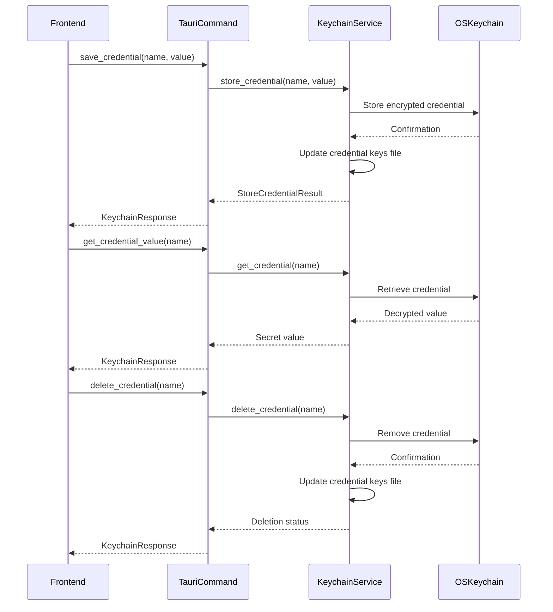
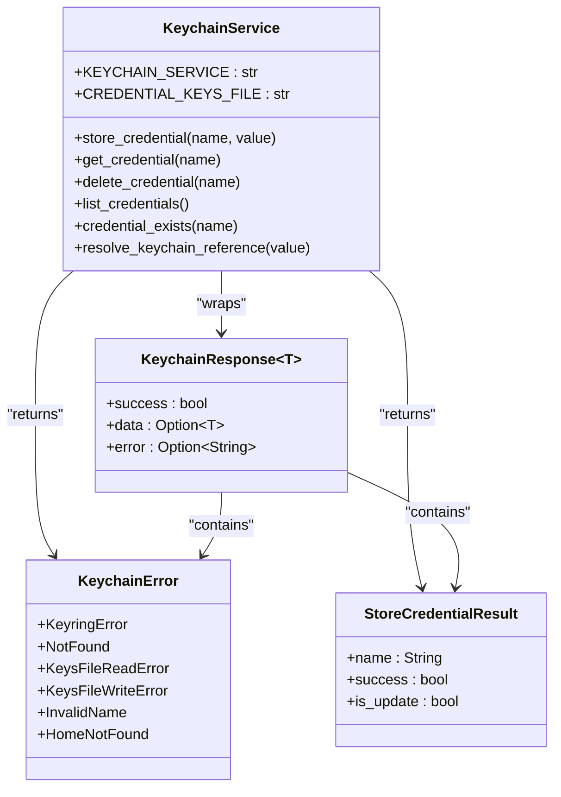
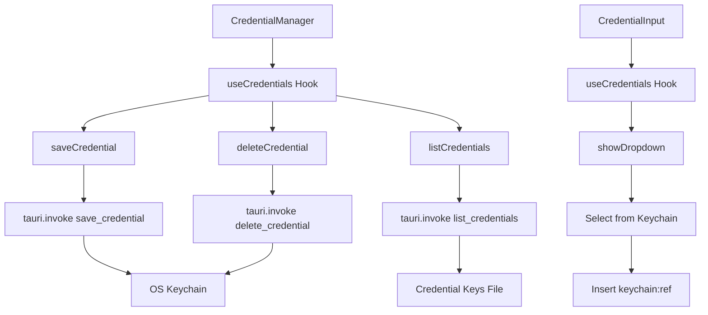
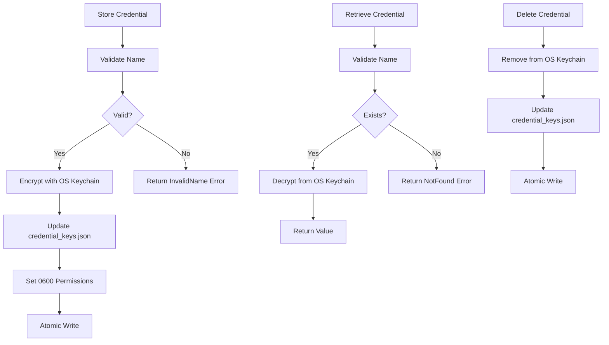
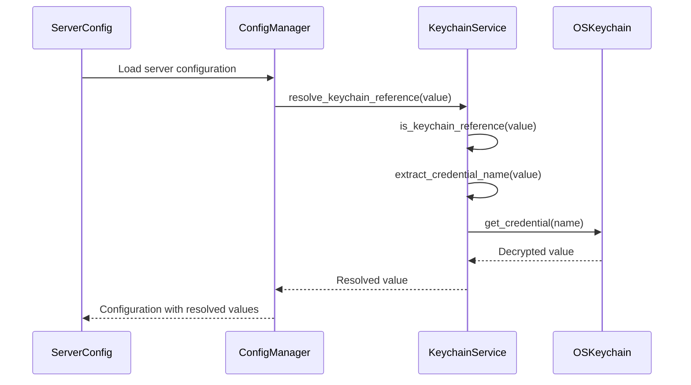
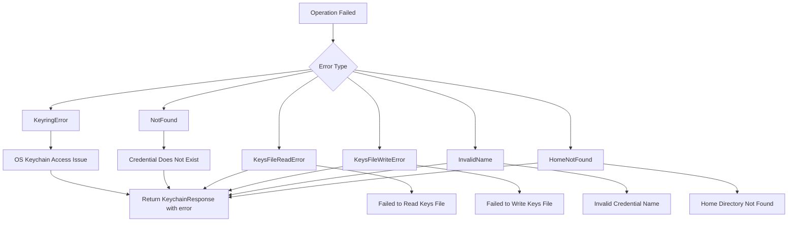

# Credential Management Commands

<cite>
**Referenced Files in This Document**   
- [keychain.rs](file://src-tauri/src/commands/keychain.rs)
- [keychain.rs](file://src-tauri/src/services/keychain.rs)
- [tauri.ts](file://src/lib/tauri.ts)
- [CredentialManager.tsx](file://src/components/settings/CredentialManager.tsx)
- [CredentialInput.tsx](file://src/components/common/CredentialInput.tsx)
- [index.ts](file://src/types/index.ts)
- [lib.rs](file://src-tauri/src/lib.rs)
</cite>

## Table of Contents

1. [Introduction](#introduction)
2. [Core Command Handlers](#core-command-handlers)
3. [Keychain Service Architecture](#keychain-service-architecture)
4. [Frontend Integration](#frontend-integration)
5. [Security Implementation](#security-implementation)
6. [Usage in Server Configuration](#usage-in-server-configuration)
7. [Error Handling](#error-handling)
8. [API Reference](#api-reference)

## Introduction

The MCP Nexus credential management system provides secure storage and retrieval of sensitive credentials through integration with the operating system's keychain services. This documentation details the command handlers for storing, retrieving, and deleting credentials, with a focus on macOS Keychain integration. The system enables secure reference of credentials in server environment variables while maintaining strict access controls and audit capabilities.

**Section sources**

- [keychain.rs](file://src-tauri/src/commands/keychain.rs#L1-L144)
- [keychain.rs](file://src-tauri/src/services/keychain.rs#L1-L438)

## Core Command Handlers

The credential management system exposes three primary command handlers through the Tauri backend: `save_credential`, `get_credential_value`, and `delete_credential`. These commands form the core API for secure credential operations, interfacing with the underlying KeychainService to provide encrypted storage.

**Diagram sources**

- [keychain.rs](file://src-tauri/src/commands/keychain.rs#L47-L78)
- [keychain.rs](file://src-tauri/src/services/keychain.rs#L162-L235)

**Section sources**

- [keychain.rs](file://src-tauri/src/commands/keychain.rs#L47-L78)
- [keychain.rs](file://src-tauri/src/services/keychain.rs#L162-L235)

## Keychain Service Architecture

The KeychainService implements a dual-layer storage approach, combining OS-level keychain encryption with application-level credential tracking. Credentials are stored in the macOS Keychain under the service identifier "com.mcp-manager.credentials", while credential names are tracked in a local JSON file with restricted permissions.

**Diagram sources**

- [keychain.rs](file://src-tauri/src/services/keychain.rs#L14-L40)
- [keychain.rs](file://src-tauri/src/services/keychain.rs#L50-L57)
- [keychain.rs](file://src-tauri/src/commands/keychain.rs#L10-L17)

**Section sources**

- [keychain.rs](file://src-tauri/src/services/keychain.rs#L14-L40)
- [keychain.rs](file://src-tauri/src/services/keychain.rs#L50-L57)

## Frontend Integration

The credential management commands are integrated into the frontend through React components and hooks. The CredentialManager component provides a user interface for managing credentials, while the CredentialInput component enables keychain reference insertion in server configuration fields.

**Diagram sources**

- [CredentialManager.tsx](file://src/components/settings/CredentialManager.tsx#L1-L347)
- [CredentialInput.tsx](file://src/components/common/CredentialInput.tsx#L1-L192)
- [useCredentials.ts](file://src/hooks/useCredentials.ts#L1-L63)

**Section sources**

- [CredentialManager.tsx](file://src/components/settings/CredentialManager.tsx#L1-L347)
- [CredentialInput.tsx](file://src/components/common/CredentialInput.tsx#L1-L192)

## Security Implementation

The credential management system implements multiple security layers to protect sensitive data. Credentials are encrypted using the operating system's keychain services, with additional application-level controls for access and auditing. The system enforces strict validation rules for credential names and implements secure file handling practices.

**Diagram sources**

- [keychain.rs](file://src-tauri/src/services/keychain.rs#L129-L154)
- [keychain.rs](file://src-tauri/src/services/keychain.rs#L170-L192)
- [keychain.rs](file://src-tauri/src/services/keychain.rs#L215-L235)

**Section sources**

- [keychain.rs](file://src-tauri/src/services/keychain.rs#L129-L154)
- [keychain.rs](file://src-tauri/src/services/keychain.rs#L170-L192)

## Usage in Server Configuration

Credentials stored in the keychain can be referenced in server environment variables using two formats: `keychain:credential-name` or `${keychain:credential-name}`. The system automatically resolves these references when server configurations are processed, retrieving the actual credential values from the keychain.

**Diagram sources**

- [keychain.rs](file://src-tauri/src/services/keychain.rs#L262-L303)
- [config_manager.rs](file://src-tauri/src/services/config_manager.rs#L1-L427)

**Section sources**

- [keychain.rs](file://src-tauri/src/services/keychain.rs#L262-L303)
- [config_manager.rs](file://src-tauri/src/services/config_manager.rs#L1-L427)

## Error Handling

The credential management system implements comprehensive error handling to address various failure scenarios. Errors are categorized and reported through the KeychainResponse structure, providing clear feedback to the frontend about the nature of any issues encountered during credential operations.

**Diagram sources**

- [keychain.rs](file://src-tauri/src/services/keychain.rs#L20-L39)
- [keychain.rs](file://src-tauri/src/commands/keychain.rs#L10-L17)

**Section sources**

- [keychain.rs](file://src-tauri/src/services/keychain.rs#L20-L39)
- [keychain.rs](file://src-tauri/src/commands/keychain.rs#L10-L17)

## API Reference

The credential management API provides three primary functions for secure credential operations. Each function follows a consistent response pattern using the KeychainResponse structure to communicate success status, data, and error information.

### store_credential

Stores a credential securely in the OS keychain.

**Parameters**

- `name`: Credential identifier (string)
- `value`: Secret value to store (string)

**Returns**

- `KeychainResponse<StoreCredentialResult>` with:
  - `success`: Boolean indicating operation success
  - `data`: StoreCredentialResult containing name, success status, and update flag
  - `error`: Error message if operation failed

**Section sources**

- [keychain.rs](file://src-tauri/src/commands/keychain.rs#L47-L57)
- [keychain.rs](file://src-tauri/src/services/keychain.rs#L162-L192)

### get_credential_value

Retrieves a credential from the OS keychain.

**Parameters**

- `name`: Credential identifier (string)

**Returns**

- `KeychainResponse<String>` with:
  - `success`: Boolean indicating operation success
  - `data`: The secret value (only on success)
  - `error`: Error message if operation failed

**Section sources**

- [keychain.rs](file://src-tauri/src/commands/keychain.rs#L59-L69)
- [keychain.rs](file://src-tauri/src/services/keychain.rs#L194-L206)

### delete_credential

Deletes a credential from the OS keychain.

**Parameters**

- `name`: Credential identifier (string)

**Returns**

- `KeychainResponse<bool>` with:
  - `success`: Boolean indicating operation success
  - `data`: Boolean indicating whether a credential was deleted
  - `error`: Error message if operation failed

**Section sources**

- [keychain.rs](file://src-tauri/src/commands/keychain.rs#L71-L78)
- [keychain.rs](file://src-tauri/src/services/keychain.rs#L208-L235)
