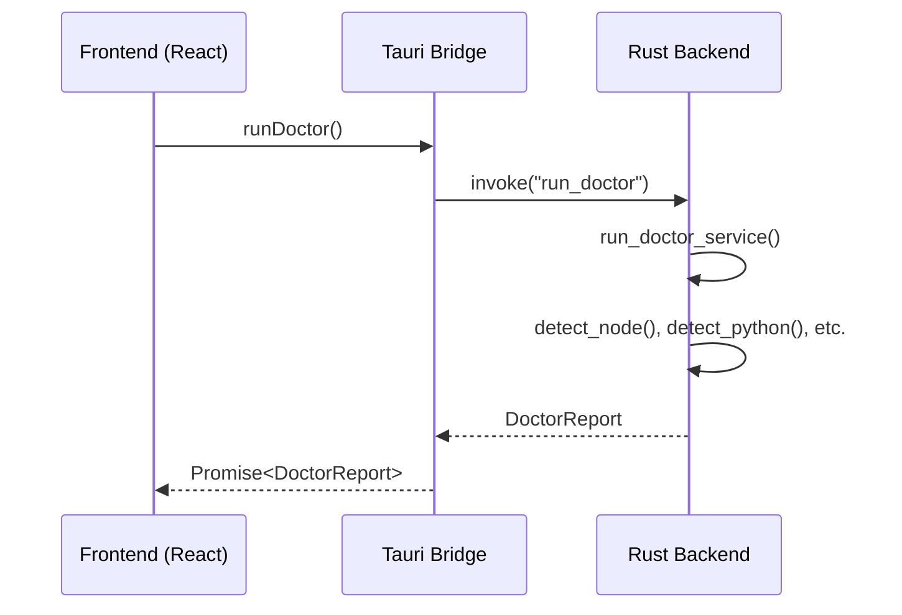
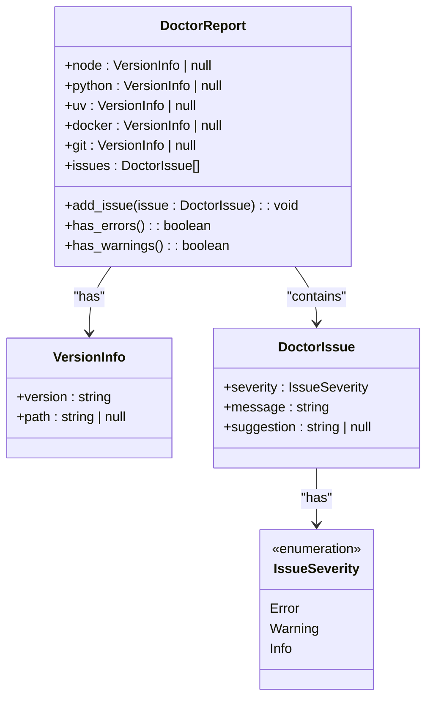
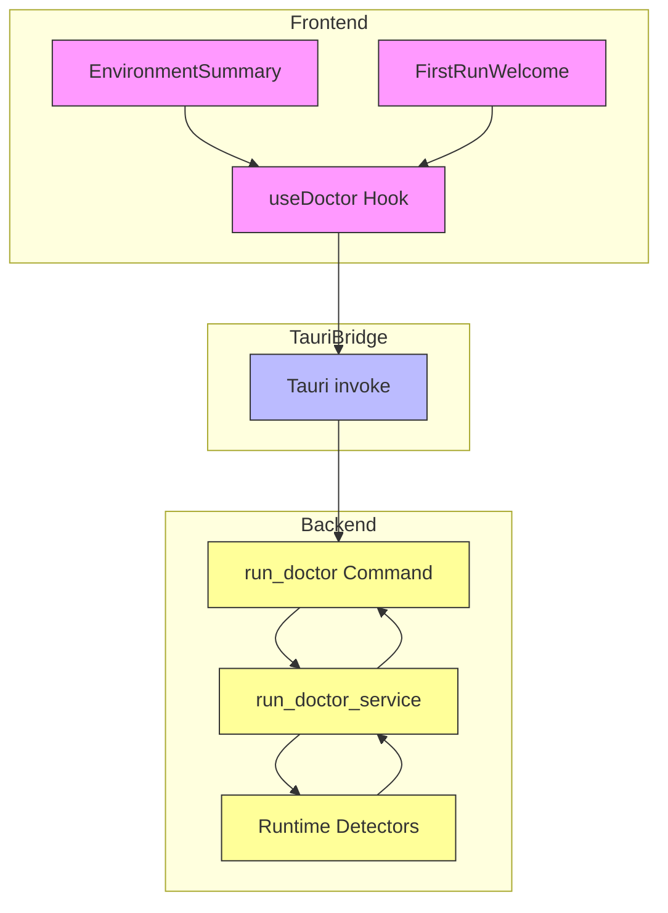
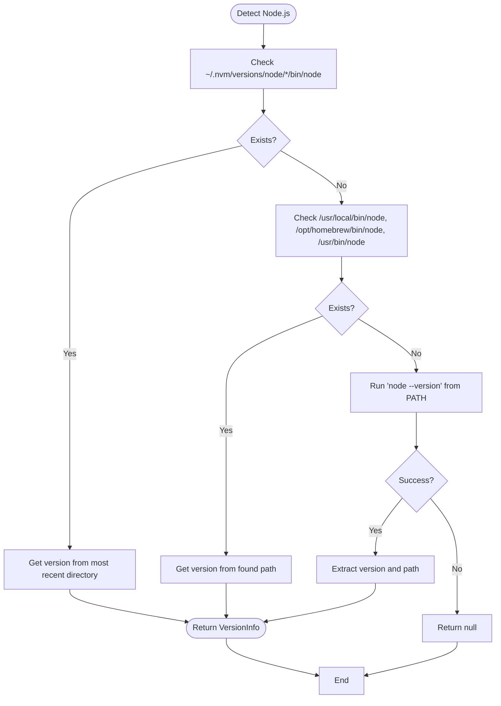
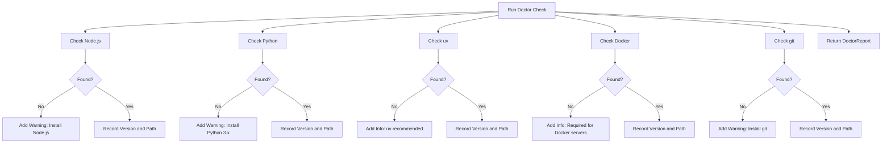
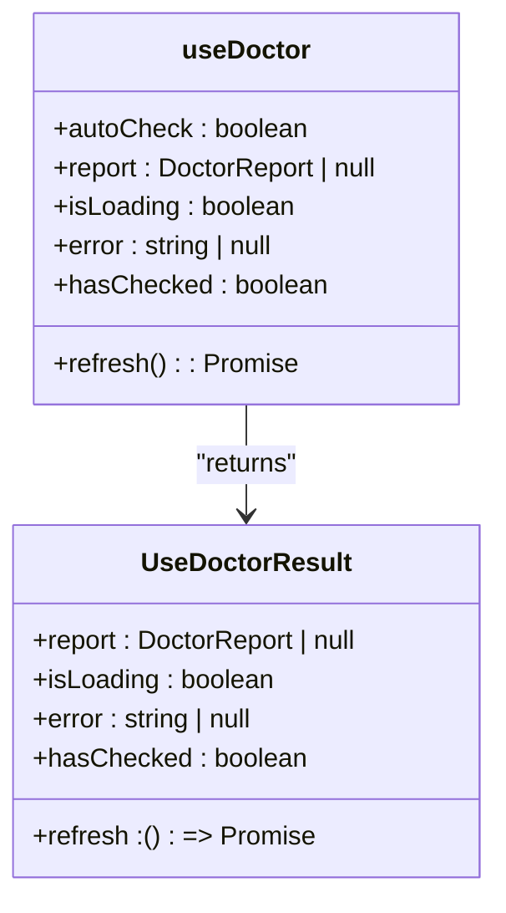
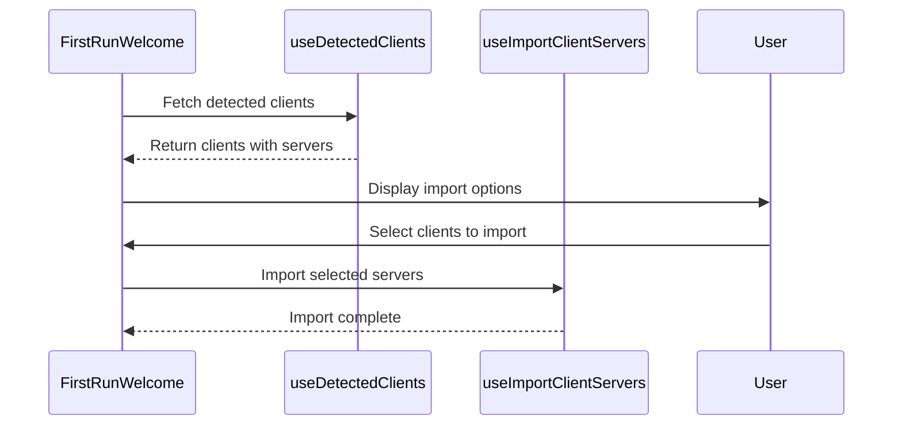
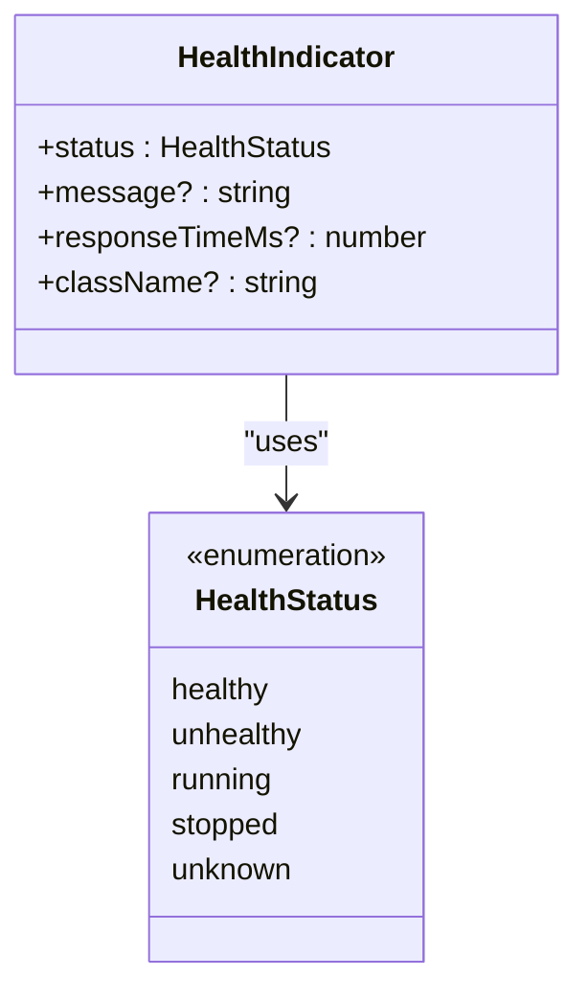
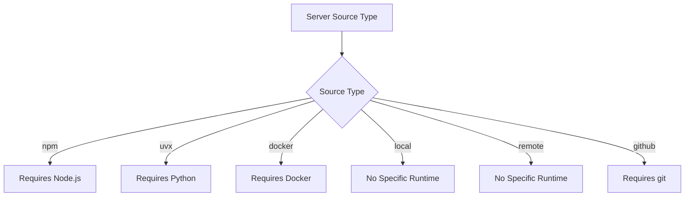
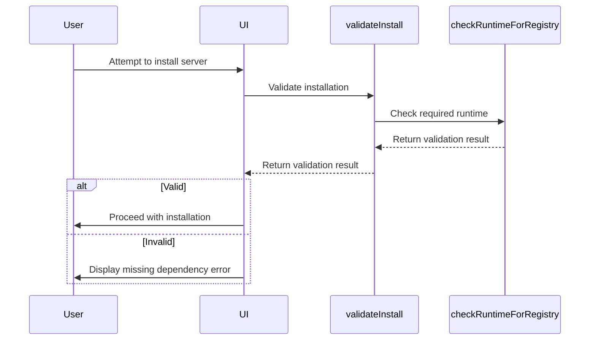

# Diagnostics Commands

<cite>
**Referenced Files in This Document**   
- [doctor.rs](file://src-tauri/src/commands/doctor.rs)
- [doctor.rs](file://src-tauri/src/models/doctor.rs)
- [useDoctor.ts](file://src/hooks/useDoctor.ts)
- [EnvironmentSummary.tsx](file://src/components/dashboard/EnvironmentSummary.tsx)
- [FirstRunWelcome.tsx](file://src/components/dashboard/FirstRunWelcome.tsx)
- [HealthIndicator.tsx](file://src/components/common/HealthIndicator.tsx)
- [tauri.ts](file://src/lib/tauri.ts)
- [index.ts](file://src/types/index.ts)
</cite>

## Table of Contents

1. [Introduction](#introduction)
2. [Core Diagnostic Functions](#core-diagnostic-functions)
3. [Doctor Service Architecture](#doctor-service-architecture)
4. [Inspection Process](#inspection-process)
5. [Frontend Integration](#frontend-integration)
6. [System Readiness Assessment](#system-readiness-assessment)
7. [Privacy Considerations](#privacy-considerations)
8. [Troubleshooting Workflows](#troubleshooting-workflows)
9. [Interpreting Diagnostic Results](#interpreting-diagnostic-results)

## Introduction

The diagnostics command handlers in MCP Nexus provide a comprehensive environment inspection system that analyzes the local development environment for required runtimes and dependencies. The system centers around the Doctor service, which performs automated checks and generates detailed reports about the system's readiness for MCP server management. This documentation details the `run_diagnostics` and `get_system_info` functions, their integration with frontend components, and their role in ensuring a functional development environment.

## Core Diagnostic Functions

The diagnostics functionality is implemented through two primary functions: `run_doctor` (the backend command) and `runDoctor` (the frontend API). These functions work together to analyze the local environment and return structured diagnostic information.



**Section sources**

- [doctor.rs](file://src-tauri/src/commands/doctor.rs#L4-L8)
- [tauri.ts](file://src/lib/tauri.ts#L146-L148)

### run_diagnostics Function

The `run_diagnostics` function (exposed as `run_doctor` in Rust and `runDoctor` in TypeScript) is the primary diagnostic command that performs comprehensive environment inspection.

**Parameters**: This function does not accept parameters, as it performs a standardized inspection of the development environment.

**Return Type**: The function returns a `DoctorReport` object containing:

- Detected runtime versions (Node.js, Python, uv, Docker, git)
- A list of `DoctorIssue` objects identifying problems and recommendations
- Comprehensive system environment details

**Error Cases**: The function itself does not throw errors but returns a complete report even when inspection fails for specific components. Individual inspection failures are represented as `DoctorIssue` entries in the report.



**Diagram sources**

- [doctor.rs](file://src-tauri/src/models/doctor.rs#L85-L105)
- [doctor.rs](file://src-tauri/src/models/doctor.rs#L3-12)
- [doctor.rs](file://src-tauri/src/models/doctor.rs#L15-L24)
- [doctor.rs](file://src-tauri/src/models/doctor.rs#L27-L37)

**Section sources**

- [doctor.rs](file://src-tauri/src/commands/doctor.rs#L4-L8)
- [doctor.rs](file://src-tauri/src/services/doctor.rs#L5-L52)
- [index.ts](file://src/types/index.ts#L134-L141)

## Doctor Service Architecture

The Doctor service follows a layered architecture that separates command handling, business logic, and data modeling. This design enables clean integration between the frontend and backend while maintaining comprehensive diagnostic capabilities.



**Diagram sources**

- [doctor.rs](file://src-tauri/src/commands/doctor.rs)
- [doctor.rs](file://src-tauri/src/services/doctor.rs)
- [useDoctor.ts](file://src/hooks/useDoctor.ts)
- [EnvironmentSummary.tsx](file://src/components/dashboard/EnvironmentSummary.tsx)

**Section sources**

- [doctor.rs](file://src-tauri/src/commands/doctor.rs#L1-L8)
- [doctor.rs](file://src-tauri/src/services/doctor.rs#L1-L52)
- [useDoctor.ts](file://src/hooks/useDoctor.ts#L1-L38)

### Runtime Detection Strategy

The Doctor service employs a sophisticated detection strategy for each runtime, prioritizing common installation methods and paths. For Node.js, it first checks nvm-managed installations before falling back to system PATH and common installation locations.



**Diagram sources**

- [doctor.rs](file://src-tauri/src/services/doctor.rs#L55-L121)

**Section sources**

- [doctor.rs](file://src-tauri/src/services/doctor.rs#L55-L121)

## Inspection Process

The inspection process systematically checks for required runtimes and dependencies, providing detailed information about their availability and version. The process is designed to be comprehensive yet efficient, with specific detection logic for each runtime.

### Runtime Inspection Details

The Doctor service inspects the following key components of the development environment:

**Node.js Inspection**: The service first checks for nvm-managed Node.js installations in the user's home directory, then falls back to common installation paths and finally attempts to execute `node --version` from the system PATH. This multi-layered approach ensures detection across different installation methods.

**Python Inspection**: The service attempts to detect Python by first trying `python3` (preferred on macOS/Linux) and then falling back to `python`. It verifies that the detected version is Python 3.x, as Python 2.x is not supported.

**uv Inspection**: The uv package manager is checked by running `uv --version`. While not required, its presence is recommended for Python package management.

**Docker Inspection**: Docker is detected by running `docker --version`. This is required for Docker-based MCP servers.

**git Inspection**: git is detected by running `git --version`. This is required for installing MCP servers from GitHub repositories.



**Diagram sources**

- [doctor.rs](file://src-tauri/src/services/doctor.rs#L6-L52)

**Section sources**

- [doctor.rs](file://src-tauri/src/services/doctor.rs#L6-L52)

## Frontend Integration

The diagnostic functions are integrated into the frontend through the `useDoctor` hook, which provides a clean API for components to access diagnostic information and trigger environment checks.

### useDoctor Hook

The `useDoctor` hook manages the state and lifecycle of diagnostic checks, providing a consistent interface for components to access diagnostic information.



**Diagram sources**

- [useDoctor.ts](file://src/hooks/useDoctor.ts#L5-L11)

**Section sources**

- [useDoctor.ts](file://src/hooks/useDoctor.ts#L1-L57)

### FirstRunWelcome Integration

The `FirstRunWelcome` component uses the diagnostic system to guide users through the initial setup process, though it does not directly call the doctor service. Instead, it relies on client detection to identify existing MCP servers.



**Diagram sources**

- [FirstRunWelcome.tsx](file://src/components/dashboard/FirstRunWelcome.tsx)

**Section sources**

- [FirstRunWelcome.tsx](file://src/components/dashboard/FirstRunWelcome.tsx)

## System Readiness Assessment

The diagnostic system integrates with the `EnvironmentSummary` and `HealthIndicator` components to provide visual feedback on system readiness, transforming raw diagnostic data into actionable insights.

### EnvironmentSummary Component

The `EnvironmentSummary` component displays a high-level overview of the system's health based on the diagnostic report, using visual indicators to communicate status.

```mermaid
flowchart TD
A[EnvironmentSummary] --> B[useDoctor(true)]
B --> C{Report Available?}
C --> |No| D[Display Loading/Not Checked]
C --> |Yes| E[Count Errors and Warnings]
E --> F{Errors > 0?}
F --> |Yes| G[Display Error Count in Red]
F --> |No| H{Warnings > 0?}
H --> |Yes| I[Display Warning Count in Amber]
H --> |No| J[Display OK in Green]
G --> K[Show Run Doctor Button]
I --> K
J --> K
K --> L[User Clicks Button]
L --> M[refresh() called]
M --> B
```

**Diagram sources**

- [EnvironmentSummary.tsx](file://src/components/dashboard/EnvironmentSummary.tsx)

**Section sources**

- [EnvironmentSummary.tsx](file://src/components/dashboard/EnvironmentSummary.tsx)

### HealthIndicator Component

The `HealthIndicator` component provides a reusable visual indicator for system health, used throughout the application to display status information.



**Diagram sources**

- [HealthIndicator.tsx](file://src/components/common/HealthIndicator.tsx#L4-L29)

**Section sources**

- [HealthIndicator.tsx](file://src/components/common/HealthIndicator.tsx#L1-L84)

## Privacy Considerations

The diagnostic system is designed with privacy in mind, collecting only essential information about the local development environment without transmitting sensitive data externally.

The collected information is limited to:

- Runtime names and version numbers
- Executable paths (when available)
- General system capability information

No personal data, project-specific information, or sensitive system details are collected or transmitted. All diagnostic processing occurs locally within the application, and the diagnostic report is not sent to any external servers unless explicitly initiated by the user for support purposes.

**Section sources**

- [doctor.rs](file://src-tauri/src/services/doctor.rs)
- [doctor.rs](file://src-tauri/src/models/doctor.rs)

## Troubleshooting Workflows

The diagnostic system supports several troubleshooting workflows that help users identify and resolve issues with their development environment.

### Runtime Requirement Mapping

The system includes a helper function that determines the runtime requirements for different server sources, enabling proactive validation before installation.



**Section sources**

- [useDoctor.ts](file://src/hooks/useDoctor.ts#L60-L78)

### Validation Before Installation

Before installing a new MCP server, the system can validate that the required runtimes are available, preventing failed installations due to missing dependencies.



**Section sources**

- [tauri.ts](file://src/lib/tauri.ts#L268-L283)

## Interpreting Diagnostic Results

Understanding the diagnostic report is crucial for maintaining a healthy development environment. The report categorizes issues by severity, providing clear guidance on necessary actions.

### Issue Severity Levels

The diagnostic system uses three severity levels to classify issues:

- **Error**: Critical issues that will prevent functionality
- **Warning**: Issues that may cause problems or limit functionality
- **Info**: Informational messages about optional but recommended components

### Common Diagnostic Scenarios

**Missing Node.js**: When Node.js is not found, the system generates a warning with a suggestion to install Node.js via nvm or from the official website. This is required for NPM-based MCP servers.

**Missing Python**: When Python is not found, the system generates a warning with a suggestion to install Python 3.x. This is required for Python-based MCP servers.

**Missing git**: When git is not found, the system generates a warning with a suggestion to install git. This is required for installing MCP servers from GitHub repositories.

**Missing Docker**: When Docker is not found, the system generates an informational message noting that Docker is required for Docker-based MCP servers.

The diagnostic system provides a comprehensive view of the development environment, enabling users to ensure their system is properly configured for MCP server management.

**Section sources**

- [doctor.rs](file://src-tauri/src/services/doctor.rs#L9-L52)
- [doctor.rs](file://src-tauri/src/models/doctor.rs#L15-L24)
