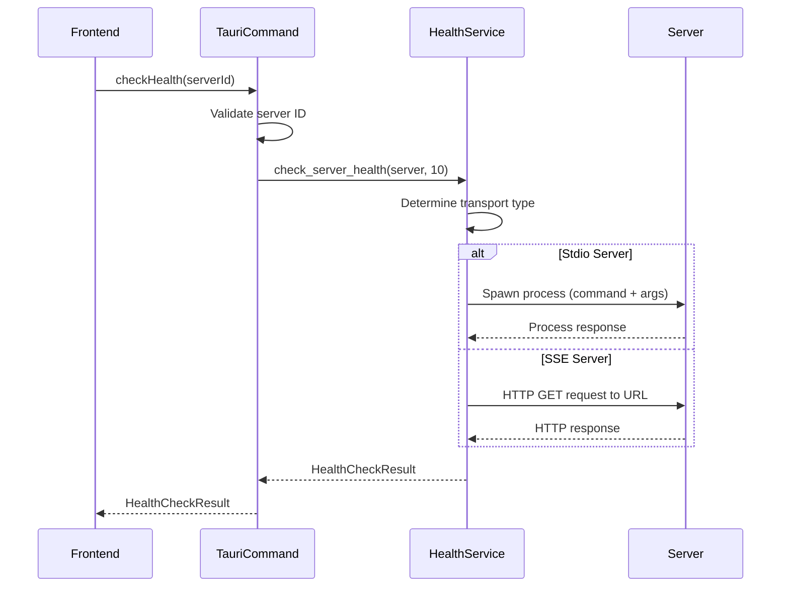
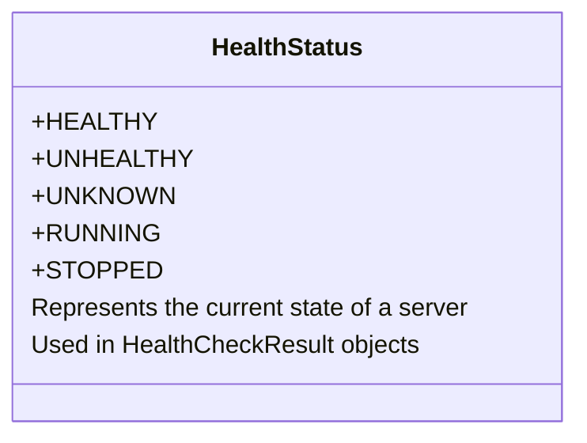
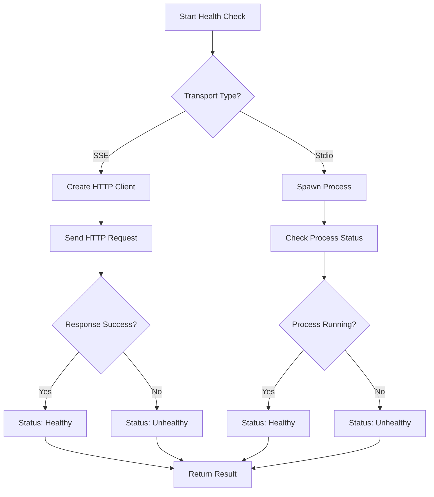
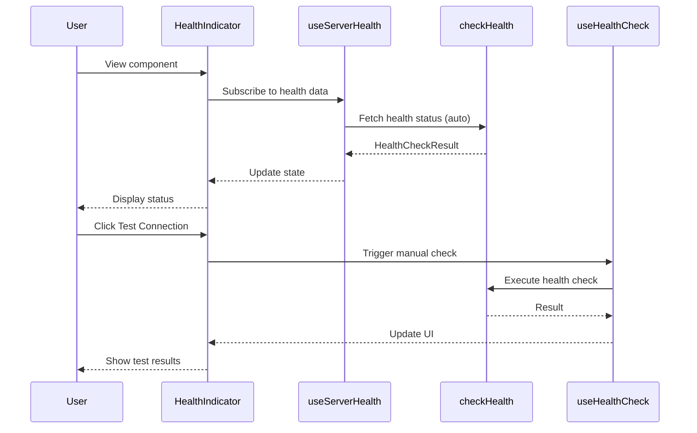
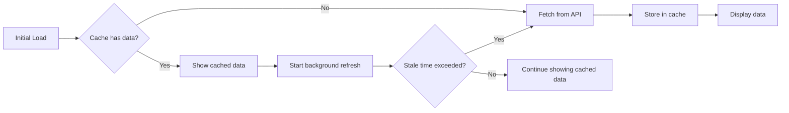
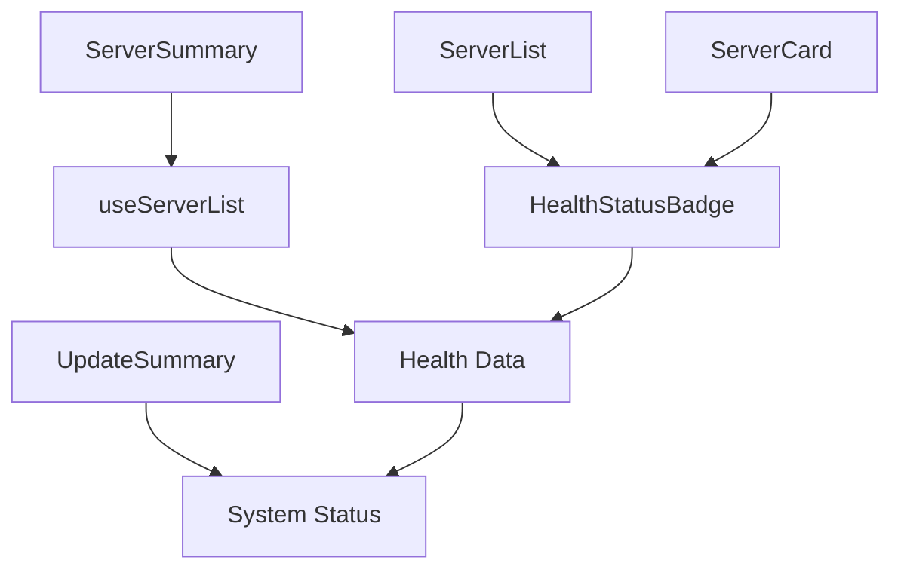

# Health Monitoring Commands

<cite>
**Referenced Files in This Document**   
- [health.rs](file://src-tauri/src/commands/health.rs)
- [health.rs](file://src-tauri/src/services/health.rs)
- [useHealth.ts](file://src/hooks/useHealth.ts)
- [HealthIndicator.tsx](file://src/components/common/HealthIndicator.tsx)
- [ServerList.tsx](file://src/components/servers/ServerList.tsx)
- [ServerCard.tsx](file://src/components/servers/ServerCard.tsx)
- [ServerSummary.tsx](file://src/components/dashboard/ServerSummary.tsx)
- [UpdateSummary.tsx](file://src/components/dashboard/UpdateSummary.tsx)
- [tauri.ts](file://src/lib/tauri.ts)
- [index.ts](file://src/types/index.ts)
- [server.rs](file://src-tauri/src/models/server.rs)
- [HealthStatusBadge.tsx](file://src/components/servers/HealthStatusBadge.tsx)
</cite>

## Table of Contents

1. [Introduction](#introduction)
2. [Core Health Check Function](#core-health-check-function)
3. [Health Status Types](#health-status-types)
4. [Health Check Implementation](#health-check-implementation)
5. [Frontend Integration](#frontend-integration)
6. [Async Polling and Caching](#async-polling-and-caching)
7. [Performance Considerations](#performance-considerations)
8. [Dashboard Integration](#dashboard-integration)
9. [Conclusion](#conclusion)

## Introduction

The MCP Nexus health monitoring system provides comprehensive server health checking capabilities through a robust command handler architecture. This documentation details the `check_server_health` function and its integration throughout the application, enabling real-time monitoring of MCP servers through both stdio and SSE protocols. The system is designed to provide immediate feedback on server status while optimizing resource usage through intelligent caching and polling mechanisms.

**Section sources**

- [health.rs](file://src-tauri/src/commands/health.rs#L30-L50)
- [useHealth.ts](file://src/hooks/useHealth.ts#L7-L14)

## Core Health Check Function

The `check_health` command handler serves as the primary interface for server health monitoring in MCP Nexus. This function accepts a server ID as a parameter and returns a comprehensive health check result containing status, response time, and diagnostic information.

### Parameters

- **server_id**: String identifier for the target server (UUID format)
- **timeout_secs**: Hardcoded 10-second timeout for health check operations

### Return Types

The function returns a `HealthCheckResult` object with the following properties:

- **serverId**: Unique identifier of the checked server
- **status**: Current health status (healthy, unhealthy, unknown, running, stopped)
- **message**: Detailed status message or error description
- **checkedAt**: ISO timestamp of the health check execution
- **responseTimeMs**: Response time in milliseconds (when available)

### Error Cases

The health check system handles several error conditions:

- **Connection timeout**: Network requests exceeding 10 seconds
- **Protocol mismatch**: Invalid server configuration for the expected protocol
- **Server crash**: Process termination during health check
- **Invalid server ID**: Malformed or non-existent server identifier
- **HTTP errors**: Non-successful HTTP status codes for SSE servers

**Diagram sources**

- [health.rs](file://src-tauri/src/commands/health.rs#L30-L50)
- [health.rs](file://src-tauri/src/services/health.rs#L180-L191)

**Section sources**

- [health.rs](file://src-tauri/src/commands/health.rs#L30-L50)
- [health.rs](file://src-tauri/src/services/health.rs#L180-L191)
- [index.ts](file://src/types/index.ts#L419-L425)

## Health Status Types

The health monitoring system defines five distinct status states to accurately represent server conditions:

### Status Enum

### Status Definitions

- **Healthy**: Server is responding correctly to health checks
- **Unhealthy**: Server failed health check (connection issues, errors)
- **Unknown**: Server health cannot be determined (initial state)
- **Running**: Server process is active and operational
- **Stopped**: Server is not currently running

The system uses these statuses consistently across both backend and frontend components, ensuring uniform interpretation of server health states.

**Section sources**

- [health.rs](file://src-tauri/src/services/health.rs#L10-L23)
- [index.ts](file://src/types/index.ts#L411-L416)

## Health Check Implementation

The health monitoring system implements distinct checking strategies for different server types, handling both stdio and SSE protocols through the `HealthService`.

### Protocol-Specific Checks

The `check_server_health` function in the `HealthService` routes requests based on the server's transport type:

#### SSE Health Check

For SSE servers, the system performs HTTP requests to the server's endpoint:

- Uses reqwest client with configurable timeout
- Validates HTTP status codes (200, 204 considered healthy)
- Measures response time for performance monitoring
- Handles network errors and connection failures

#### Stdio Health Check

For stdio servers, the system attempts to spawn the server process:

- Uses tokio::process::Command to execute the server command
- Provides arguments and environment variables
- Monitors process initialization and response
- Terminates the process after successful health verification

**Diagram sources**

- [health.rs](file://src-tauri/src/services/health.rs#L37-L91)
- [health.rs](file://src-tauri/src/services/health.rs#L95-L177)

**Section sources**

- [health.rs](file://src-tauri/src/services/health.rs#L37-L191)
- [server.rs](file://src-tauri/src/models/server.rs#L31-L49)

## Frontend Integration

The health monitoring system integrates seamlessly with frontend components through React hooks and UI elements that provide real-time status updates.

### React Hooks

The `useHealth.ts` file provides several hooks for consuming health check data:

- **useServerHealth**: Fetches health status for a single server with automatic polling
- **useAllServerHealth**: Retrieves health status for all servers
- **useServerStatus**: Provides quick status without full health check
- **useHealthCheck**: Mutation hook for manual health check triggering

These hooks leverage React Query for state management, implementing stale time and refetch intervals to balance freshness with performance.

### UI Components

Key UI components that display health information:

#### HealthIndicator

A reusable component that displays server health status with visual indicators:

- Color-coded badges for different status types
- Icons representing status (● for healthy, ▶ for running, ■ for stopped)
- Response time display for healthy servers
- Error message tooltips for unhealthy servers

#### TestConnectionButton

Allows users to manually trigger health checks:

- Shows loading state during checks
- Provides visual feedback on test results
- Integrates with health check mutation hooks

**Diagram sources**

- [useHealth.ts](file://src/hooks/useHealth.ts#L7-L67)
- [HealthIndicator.tsx](file://src/components/common/HealthIndicator.tsx#L1-L129)

**Section sources**

- [useHealth.ts](file://src/hooks/useHealth.ts#L7-L67)
- [HealthIndicator.tsx](file://src/components/common/HealthIndicator.tsx#L1-L129)
- [ServerCard.tsx](file://src/components/servers/ServerCard.tsx#L1-L341)

## Async Polling and Caching

The health monitoring system implements sophisticated async polling and caching strategies to optimize performance and resource usage.

### Polling Mechanism

The system uses React Query's built-in polling capabilities:

- **Stale time**: 30 seconds (data considered fresh for 30s)
- **Refetch interval**: 60 seconds (automatic refresh every minute)
- **Background refetching**: Enabled for seamless updates

This configuration ensures users see current information while minimizing unnecessary API calls.

### Caching Strategy

The system employs a multi-layer caching approach:

- **Client-side caching**: React Query cache stores health results
- **Cache invalidation**: Manual checks invalidate cache for immediate updates
- **Stale-while-revalidate**: Displays cached data while fetching fresh results

The `useHealthCheck` mutation hook specifically updates the cache upon successful health checks, ensuring consistency across the application.

### Performance Optimization

Key optimizations include:

- Concurrent health checks for multiple servers
- Efficient state updates that avoid unnecessary re-renders
- Error boundaries to prevent UI crashes from failed checks
- Loading states to provide feedback during operations

**Diagram sources**

- [useHealth.ts](file://src/hooks/useHealth.ts#L12-L13)
- [useHealth.ts](file://src/hooks/useHealth.ts#L44-L48)

**Section sources**

- [useHealth.ts](file://src/hooks/useHealth.ts#L7-L67)
- [tauri.ts](file://src/lib/tauri.ts#L345-L362)

## Performance Considerations

The health monitoring system addresses performance challenges through careful design and implementation choices.

### Resource Usage Optimization

The system minimizes resource consumption through:

- **Batched operations**: `check_all_health` command checks all servers efficiently
- **Connection pooling**: HTTP clients are reused across requests
- **Process management**: Stdio checks spawn processes briefly then terminate
- **Memory efficiency**: Health results contain only essential data

### Frequency Management

To prevent excessive resource usage:

- Automatic polling limited to once per minute
- Manual checks available for on-demand verification
- Stale time prevents immediate re-fetching after display
- Error backoff prevents flooding on failing servers

### Scalability Features

The system scales effectively with increasing server counts:

- Concurrent health checks using async/await
- Efficient database queries for server retrieval
- Lightweight data transfer between backend and frontend
- Optimized React rendering with memoization

These considerations ensure the health monitoring system remains responsive and efficient even with dozens of configured servers.

**Section sources**

- [health.rs](file://src-tauri/src/commands/health.rs#L54-L74)
- [useHealth.ts](file://src/hooks/useHealth.ts#L12-L13)

## Dashboard Integration

The health monitoring system integrates with dashboard components to provide system-wide health visualization.

### ServerSummary Component

Displays aggregate server information:

- Total server count
- Breakdown by transport type (stdio vs SSE)
- Quick status overview
- Navigation to server management

### UpdateSummary Component

While primarily focused on updates, this component indirectly relates to health by:

- Identifying servers that may need updates due to health issues
- Providing access to server management for troubleshooting
- Showing overall system maintenance status

### Real-time Updates

The dashboard components receive real-time updates through:

- React Query's reactivity system
- Automatic refetching of health data
- Cache synchronization across components
- Event-driven updates from health check mutations

This integration ensures that dashboard summaries reflect the current health status of all servers, providing users with an accurate system overview.

**Diagram sources**

- [ServerSummary.tsx](file://src/components/dashboard/ServerSummary.tsx#L1-L48)
- [UpdateSummary.tsx](file://src/components/dashboard/UpdateSummary.tsx#L1-L104)
- [ServerList.tsx](file://src/components/servers/ServerList.tsx#L1-L186)

**Section sources**

- [ServerSummary.tsx](file://src/components/dashboard/ServerSummary.tsx#L1-L48)
- [UpdateSummary.tsx](file://src/components/dashboard/UpdateSummary.tsx#L1-L104)
- [HealthStatusBadge.tsx](file://src/components/servers/HealthStatusBadge.tsx#L1-L77)

## Conclusion

The health monitoring command handlers in MCP Nexus provide a comprehensive, efficient, and user-friendly system for monitoring server health. By implementing protocol-specific checks for both stdio and SSE servers, the system ensures accurate health assessment across diverse server types. The integration of React Query for state management enables automatic polling and intelligent caching, balancing data freshness with performance optimization. Frontend components like HealthIndicator and ServerList provide intuitive visual feedback, while dashboard integrations offer system-wide health visualization. The thoughtful design of the health check system, with its focus on error handling, resource optimization, and real-time updates, makes it a robust foundation for managing MCP servers in the Nexus ecosystem.
