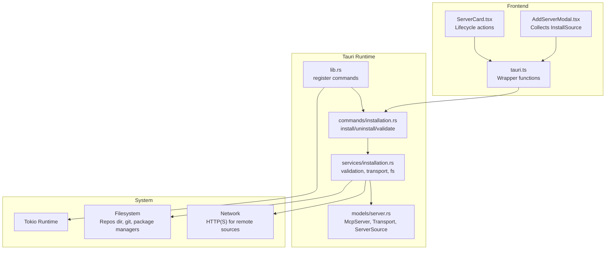
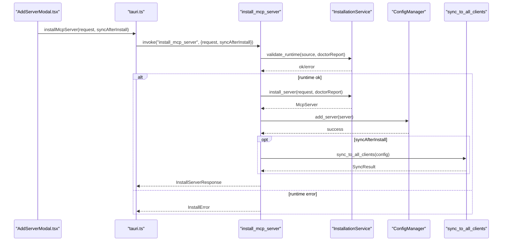
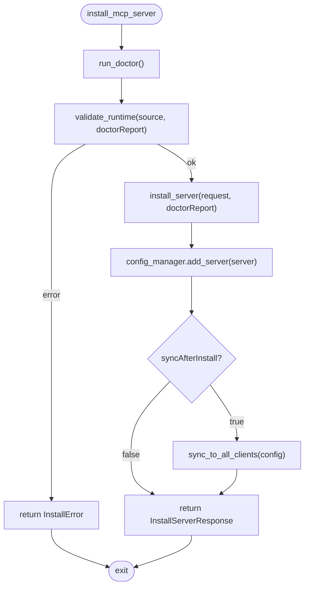
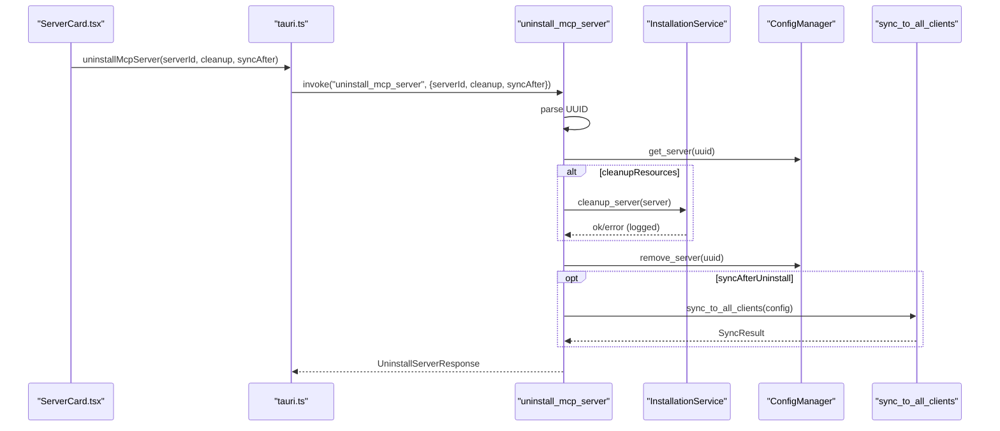
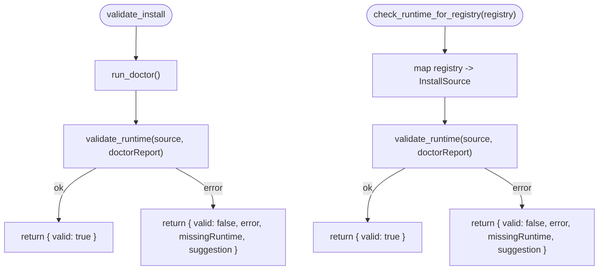
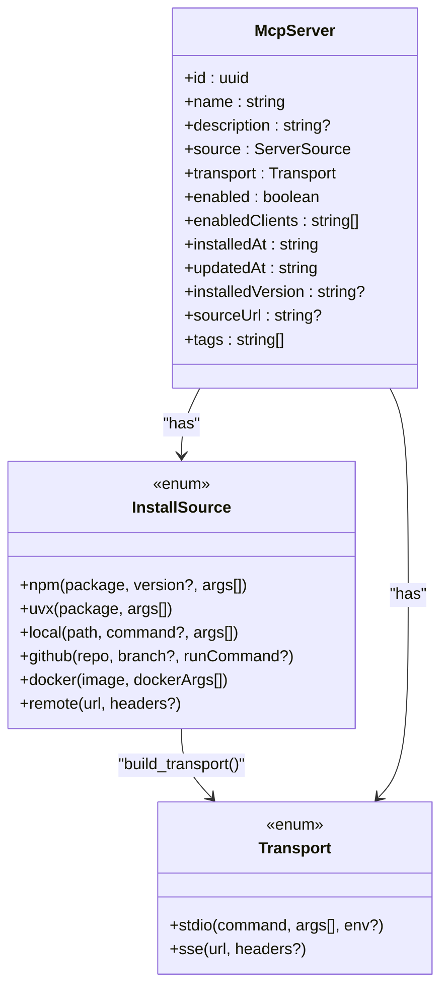
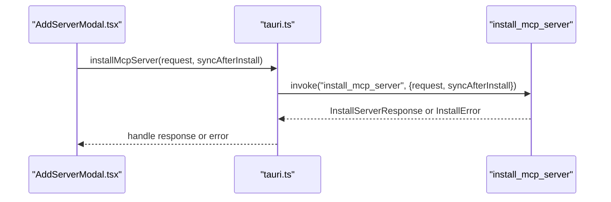
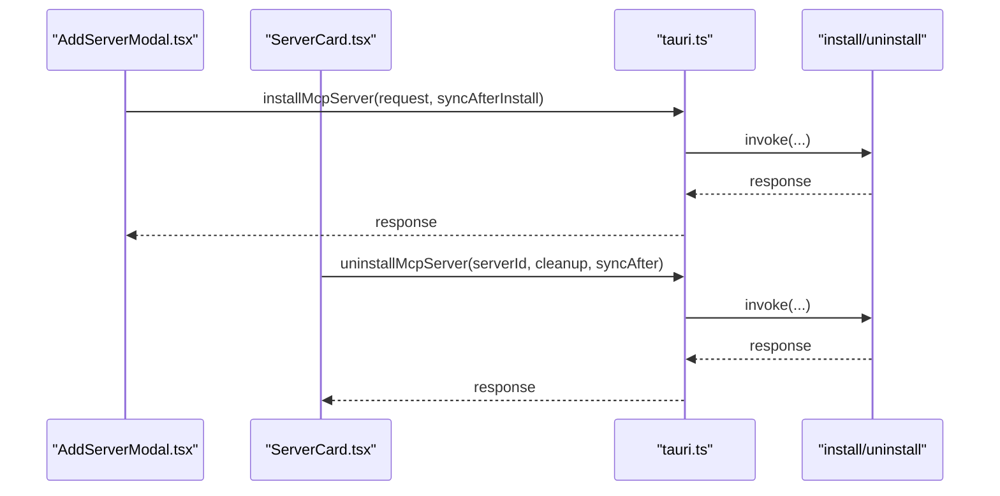
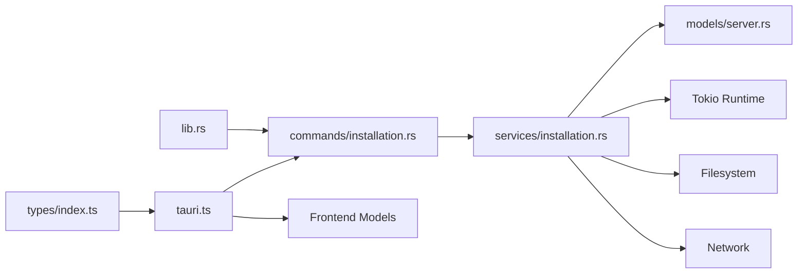

# Installation Commands

<cite>
**Referenced Files in This Document**
- [installation.rs](file://src-tauri/src/commands/installation.rs)
- [installation.rs](file://src-tauri/src/services/installation.rs)
- [server.rs](file://src-tauri/src/models/server.rs)
- [tauri.ts](file://src/lib/tauri.ts)
- [AddServerModal.tsx](file://src/components/servers/AddServerModal.tsx)
- [ServerCard.tsx](file://src/components/servers/ServerCard.tsx)
- [lib.rs](file://src-tauri/src/lib.rs)
- [Cargo.toml](file://src-tauri/Cargo.toml)
- [index.ts](file://src/types/index.ts)
</cite>

## Table of Contents

1. [Introduction](#introduction)
2. [Project Structure](#project-structure)
3. [Core Components](#core-components)
4. [Architecture Overview](#architecture-overview)
5. [Detailed Component Analysis](#detailed-component-analysis)
6. [Dependency Analysis](#dependency-analysis)
7. [Performance Considerations](#performance-considerations)
8. [Troubleshooting Guide](#troubleshooting-guide)
9. [Conclusion](#conclusion)
10. [Appendices](#appendices)

## Introduction

This document describes the installation command handlers in MCP Nexus that manage adding and removing MCP servers across multiple installation methods. It covers:

- install_mcp_server and uninstall_mcp_server command signatures, parameters, and return types
- How these commands interface with the InstallationService to handle different installation methods (npm, uvx, github, docker, local, remote)
- Frontend integration via the tauri.ts wrapper and UI components (AddServerModal, ServerCard)
- Async execution on the Tokio runtime, progress reporting mechanisms, and filesystem interactions
- Security considerations including input validation and sandboxing of installation processes
- Error handling patterns and common failure modes

## Project Structure

The installation system spans Rust backend commands and services, shared TypeScript types, and frontend wrappers and UI components.

**Diagram sources**

- [lib.rs](file://src-tauri/src/lib.rs#L31-L88)
- [installation.rs](file://src-tauri/src/commands/installation.rs#L90-L192)
- [installation.rs](file://src-tauri/src/services/installation.rs#L124-L555)
- [server.rs](file://src-tauri/src/models/server.rs#L1-L132)
- [tauri.ts](file://src/lib/tauri.ts#L224-L284)
- [AddServerModal.tsx](file://src/components/servers/AddServerModal.tsx#L1-L164)
- [ServerCard.tsx](file://src/components/servers/ServerCard.tsx#L1-L120)

**Section sources**

- [lib.rs](file://src-tauri/src/lib.rs#L31-L88)
- [installation.rs](file://src-tauri/src/commands/installation.rs#L90-L192)
- [installation.rs](file://src-tauri/src/services/installation.rs#L124-L555)
- [server.rs](file://src-tauri/src/models/server.rs#L1-L132)
- [tauri.ts](file://src/lib/tauri.ts#L224-L284)
- [AddServerModal.tsx](file://src/components/servers/AddServerModal.tsx#L1-L164)
- [ServerCard.tsx](file://src/components/servers/ServerCard.tsx#L1-L120)

## Core Components

- Backend commands:
  - install_mcp_server: Installs a server, validates runtimes, persists configuration, optionally syncs to clients
  - uninstall_mcp_server: Removes a server, optionally cleans up resources, syncs removal
  - validate_install: Validates runtime requirements without installing
  - check_runtime_for_registry: Validates runtime requirements for a given registry
- Services:
  - InstallSource variants: npm, uvx, local, github, docker, remote
  - Transport variants: stdio (npx/uvx/docker), SSE (remote)
  - Validation and filesystem helpers: runtime checks, git clone/setup, repos directory
- Frontend wrapper:
  - tauri.ts installMcpServer, uninstallMcpServer, validateInstall, checkRuntimeForRegistry
- UI integration:
  - AddServerModal.tsx builds InstallSource and collects environment variables
  - ServerCard.tsx triggers removal lifecycle

**Section sources**

- [installation.rs](file://src-tauri/src/commands/installation.rs#L90-L192)
- [installation.rs](file://src-tauri/src/services/installation.rs#L124-L555)
- [tauri.ts](file://src/lib/tauri.ts#L224-L284)
- [AddServerModal.tsx](file://src/components/servers/AddServerModal.tsx#L1-L164)
- [ServerCard.tsx](file://src/components/servers/ServerCard.tsx#L1-L120)

## Architecture Overview

The installation flow is a layered pipeline:

- Frontend collects user input and invokes tauri.ts wrapper functions
- Tauri registers commands and routes invocations to backend handlers
- Handlers call services to validate runtimes, construct transports, and manage filesystem
- On success, configuration is persisted and optional sync occurs

**Diagram sources**

- [tauri.ts](file://src/lib/tauri.ts#L236-L261)
- [installation.rs](file://src-tauri/src/commands/installation.rs#L98-L135)
- [installation.rs](file://src-tauri/src/services/installation.rs#L479-L520)
- [lib.rs](file://src-tauri/src/lib.rs#L31-L88)

## Detailed Component Analysis

### install_mcp_server

- Purpose: Install a new MCP server from a specified source, persist configuration, and optionally sync to clients.
- Parameters:
  - request: InstallServerRequest (name, description, source, enabledClients, sourceUrl, env)
  - syncAfterInstall: boolean (optional; defaults to true)
- Behavior:
  - Runs doctor to gather environment status
  - Calls InstallationService.install_server to validate runtime and build McpServer
  - Persists server via ConfigManager.add_server
  - Optionally syncs to all clients via sync_to_all_clients
- Return type: InstallServerResponse (installResult, syncResult?)
- Error types: Converted to InstallError with errorType mapped from InstallationError variants

**Diagram sources**

- [installation.rs](file://src-tauri/src/commands/installation.rs#L98-L135)
- [installation.rs](file://src-tauri/src/services/installation.rs#L479-L520)

**Section sources**

- [installation.rs](file://src-tauri/src/commands/installation.rs#L98-L135)
- [installation.rs](file://src-tauri/src/services/installation.rs#L479-L520)

### uninstall_mcp_server

- Purpose: Remove an MCP server by ID, optionally cleanup resources, and sync removal.
- Parameters:
  - serverId: string (UUID)
  - cleanupResources: boolean (optional; defaults to true)
  - syncAfterUninstall: boolean (optional; defaults to true)
- Behavior:
  - Parses UUID and loads server from ConfigManager
  - Optionally calls cleanup_server to remove cloned repos
  - Removes server from ConfigManager
  - Optionally syncs removal to clients
- Return type: UninstallServerResponse (success, serverName, syncResult?, error?)

**Diagram sources**

- [tauri.ts](file://src/lib/tauri.ts#L251-L261)
- [installation.rs](file://src-tauri/src/commands/installation.rs#L144-L192)
- [installation.rs](file://src-tauri/src/services/installation.rs#L531-L555)

**Section sources**

- [installation.rs](file://src-tauri/src/commands/installation.rs#L144-L192)
- [installation.rs](file://src-tauri/src/services/installation.rs#L531-L555)

### validate_install and check_runtime_for_registry

- validate_install: Validates runtime requirements for a given InstallSource without installing.
- check_runtime_for_registry: Validates runtime requirements for a registry (npm, pypi, docker, github) by constructing a minimal InstallSource and delegating to validate_runtime.
- Return type: ValidateInstallResponse (valid, error?, missingRuntime?, suggestion?)

**Diagram sources**

- [installation.rs](file://src-tauri/src/commands/installation.rs#L198-L287)
- [installation.rs](file://src-tauri/src/services/installation.rs#L124-L183)

**Section sources**

- [installation.rs](file://src-tauri/src/commands/installation.rs#L198-L287)
- [installation.rs](file://src-tauri/src/services/installation.rs#L124-L183)

### InstallationService: InstallSource and Transport

- InstallSource variants:
  - npm: package, version?, args[]
  - uvx: package, args[]
  - local: path, command?, args[]
  - github: repo, branch?, runCommand?
  - docker: image, dockerArgs[]
  - remote: url, headers?
- Transport construction:
  - npm/uvx/local/github/docker -> Stdio transport (npx/uvx/docker/node/python/pip/uv)
  - remote -> SSE transport (url, headers)
- Validation rules:
  - npm requires Node.js
  - uvx requires Python or uv
  - local requires existing path
  - github requires git
  - docker requires Docker
  - remote requires http/https URL
- Filesystem interactions:
  - Repos directory under user home (~/.mcp-nexus/repos)
  - Shallow git clone with branch support
  - Setup steps detect package manager and run install
  - Cleanup removes cloned repos only if they are under managed repos directory

**Diagram sources**

- [installation.rs](file://src-tauri/src/services/installation.rs#L55-L108)
- [installation.rs](file://src-tauri/src/services/installation.rs#L334-L453)
- [server.rs](file://src-tauri/src/models/server.rs#L1-L85)

**Section sources**

- [installation.rs](file://src-tauri/src/services/installation.rs#L55-L108)
- [installation.rs](file://src-tauri/src/services/installation.rs#L334-L453)
- [server.rs](file://src-tauri/src/models/server.rs#L1-L85)

### Frontend Integration: tauri.ts Wrapper

- installMcpServer(request, syncAfterInstall?): returns InstallServerResponse
- uninstallMcpServer(serverId, cleanupResources?, syncAfterUninstall?): returns UninstallServerResponse
- validateInstall(source): returns ValidateInstallResponse
- checkRuntimeForRegistry(registry): returns ValidateInstallResponse
- Error handling: wrapper throws on keychain commands; installation commands return structured errors via InstallError

**Diagram sources**

- [tauri.ts](file://src/lib/tauri.ts#L236-L261)
- [AddServerModal.tsx](file://src/components/servers/AddServerModal.tsx#L1-L164)

**Section sources**

- [tauri.ts](file://src/lib/tauri.ts#L224-L284)
- [AddServerModal.tsx](file://src/components/servers/AddServerModal.tsx#L1-L164)

### UI Integration: AddServerModal and ServerCard

- AddServerModal.tsx:
  - Builds InstallSource from form inputs
  - Collects environment variables and enabled clients
  - Invokes onInstall with collected data
- ServerCard.tsx:
  - Displays server metadata and actions
  - Triggers removal lifecycle via onRemove(serverId)

**Diagram sources**

- [AddServerModal.tsx](file://src/components/servers/AddServerModal.tsx#L1-L164)
- [ServerCard.tsx](file://src/components/servers/ServerCard.tsx#L1-L120)
- [tauri.ts](file://src/lib/tauri.ts#L236-L261)

**Section sources**

- [AddServerModal.tsx](file://src/components/servers/AddServerModal.tsx#L1-L164)
- [ServerCard.tsx](file://src/components/servers/ServerCard.tsx#L1-L120)
- [tauri.ts](file://src/lib/tauri.ts#L236-L261)

## Dependency Analysis

- Command registration:
  - lib.rs registers install/uninstall/validate/check_runtime commands
- Runtime and libraries:
  - Tokio used for async runtime and process execution
  - Serde for serialization/deserialization
  - dirs, uuid, chrono for filesystem, identifiers, timestamps
  - reqwest for marketplace API
- Frontend types:
  - index.ts mirrors backend models and request/response shapes

**Diagram sources**

- [lib.rs](file://src-tauri/src/lib.rs#L31-L88)
- [installation.rs](file://src-tauri/src/commands/installation.rs#L90-L192)
- [installation.rs](file://src-tauri/src/services/installation.rs#L124-L555)
- [server.rs](file://src-tauri/src/models/server.rs#L1-L132)
- [tauri.ts](file://src/lib/tauri.ts#L224-L284)
- [index.ts](file://src/types/index.ts#L253-L319)
- [Cargo.toml](file://src-tauri/Cargo.toml#L20-L33)

**Section sources**

- [lib.rs](file://src-tauri/src/lib.rs#L31-L88)
- [Cargo.toml](file://src-tauri/Cargo.toml#L20-L33)
- [index.ts](file://src/types/index.ts#L253-L319)

## Performance Considerations

- Async execution:
  - Commands are declared async and executed on Tauri’s runtime; Tokio is available for async tasks and process spawning
- Network and filesystem:
  - GitHub clone uses shallow depth for speed
  - Package manager detection avoids unnecessary retries
- Sync overhead:
  - Optional syncAfterInstall/syncAfterUninstall reduces unnecessary client syncs
- Recommendations:
  - Batch UI updates to minimize re-renders
  - Debounce runtime validation calls
  - Consider progress callbacks for long-running operations (e.g., git clone, package installs)

[No sources needed since this section provides general guidance]

## Troubleshooting Guide

Common error categories and handling patterns:

- Runtime validation failures:
  - Missing Node.js for npm, Python/uv for uvx, git for github, Docker for docker, invalid URL for remote
  - Returned as ValidateInstallResponse with missingRuntime and suggestion
- Installation failures:
  - Git clone/update failures, setup command failures, IO errors, invalid local path
  - Returned as InstallError with errorType mapped from InstallationError variants
- Uninstall cleanup warnings:
  - Cleanup may log warnings but does not fail the uninstall operation
- Frontend error handling:
  - validateInstall and checkRuntimeForRegistry return structured errors; wrap calls with try/catch and surface messages to users

**Section sources**

- [installation.rs](file://src-tauri/src/commands/installation.rs#L12-L37)
- [installation.rs](file://src-tauri/src/commands/installation.rs#L198-L287)
- [installation.rs](file://src-tauri/src/services/installation.rs#L124-L183)
- [installation.rs](file://src-tauri/src/services/installation.rs#L479-L520)

## Conclusion

The installation subsystem provides a robust, extensible pipeline for managing MCP servers across multiple installation methods. It integrates cleanly with the frontend via typed wrappers and UI components, validates environments rigorously, and persists configuration safely. The design balances flexibility (supporting npm, uvx, github, docker, local, remote) with strong error handling and optional synchronization to clients.

[No sources needed since this section summarizes without analyzing specific files]

## Appendices

### API Definitions

- installMcpServer
  - Parameters:
    - request: InstallServerRequest
      - name: string
      - description?: string
      - source: InstallSource
      - enabledClients: string[]
      - sourceUrl?: string
      - env?: Record<string, string>
    - syncAfterInstall?: boolean
  - Returns: InstallServerResponse
    - installResult: InstallResult
      - success: boolean
      - server?: McpServer
      - error?: string
      - warnings: string[]
    - syncResult?: SyncResult

- uninstallMcpServer
  - Parameters:
    - serverId: string (UUID)
    - cleanupResources?: boolean
    - syncAfterUninstall?: boolean
  - Returns: UninstallServerResponse
    - success: boolean
    - serverName: string
    - syncResult?: SyncResult
    - error?: string

- validateInstall
  - Parameters:
    - source: InstallSource
  - Returns: ValidateInstallResponse
    - valid: boolean
    - error?: string
    - missingRuntime?: string
    - suggestion?: string

- checkRuntimeForRegistry
  - Parameters:
    - registry: string ("npm" | "pypi" | "docker" | "github")
  - Returns: ValidateInstallResponse

**Section sources**

- [tauri.ts](file://src/lib/tauri.ts#L236-L284)
- [index.ts](file://src/types/index.ts#L253-L319)

### Error Codes and Types

- InstallError
  - message: string
  - errorType: string
    - "missing_runtime", "invalid_path", "git_error", "setup_error", "docker_error", "invalid_url", "io_error", "home_not_found", "parse_error", "config_error"

**Section sources**

- [installation.rs](file://src-tauri/src/commands/installation.rs#L12-L37)

### Security Considerations

- Input validation:
  - Remote URLs validated to start with http/https
  - Local paths validated to exist
  - Runtime availability enforced per source type
- Sandboxing:
  - Transport commands are explicit (npx, uvx, docker, node, python, pip, uv)
  - GitHub repos cleaned up only if located under managed repos directory
- Environment variables:
  - Passed through to transports; ensure least privilege and avoid sensitive exposure
- Permissions:
  - Filesystem operations occur under user home; ensure app has appropriate permissions

**Section sources**

- [installation.rs](file://src-tauri/src/services/installation.rs#L124-L183)
- [installation.rs](file://src-tauri/src/services/installation.rs#L531-L555)
