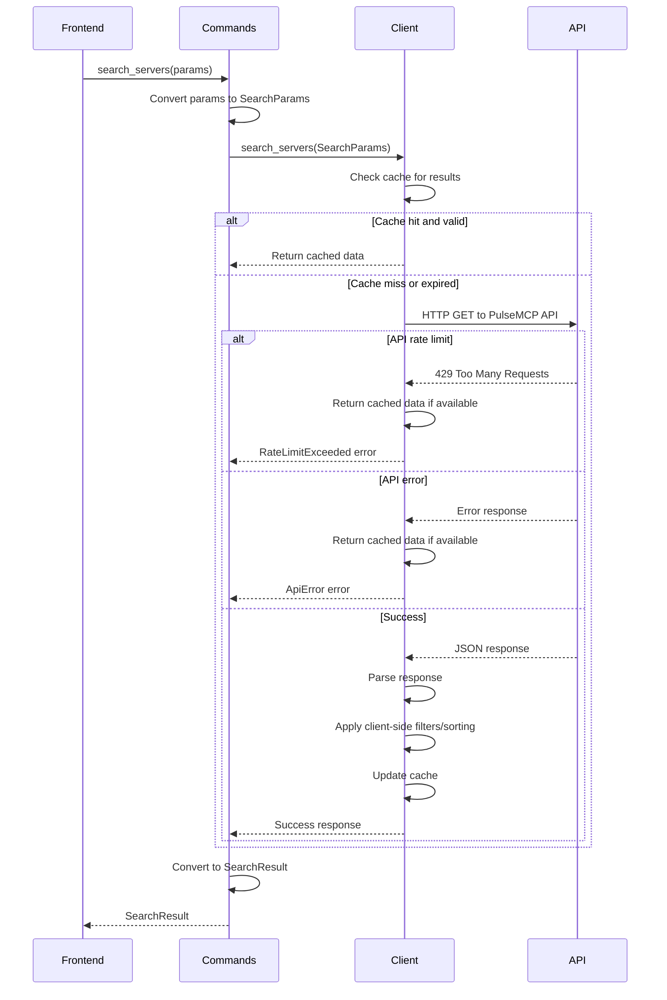
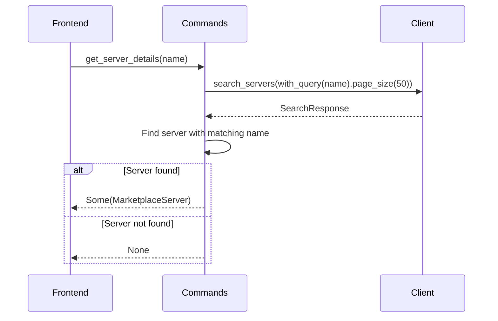
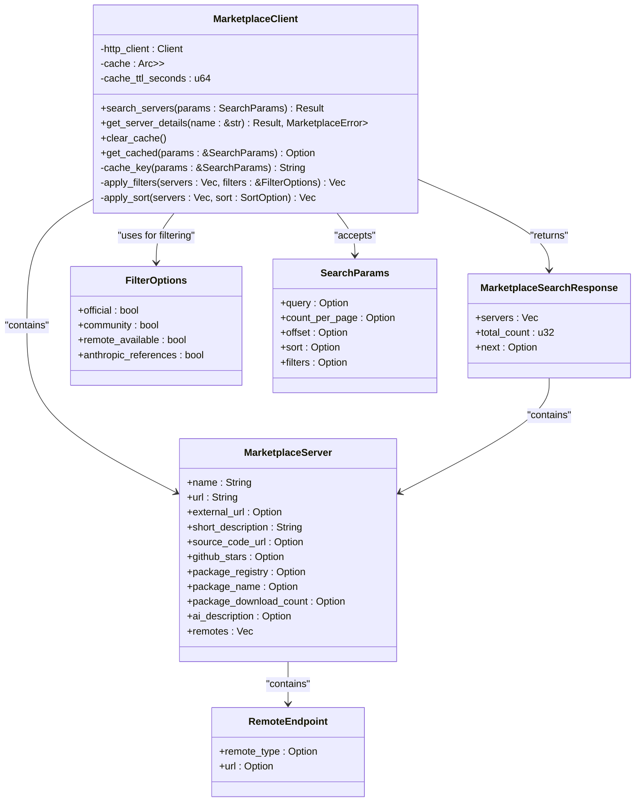
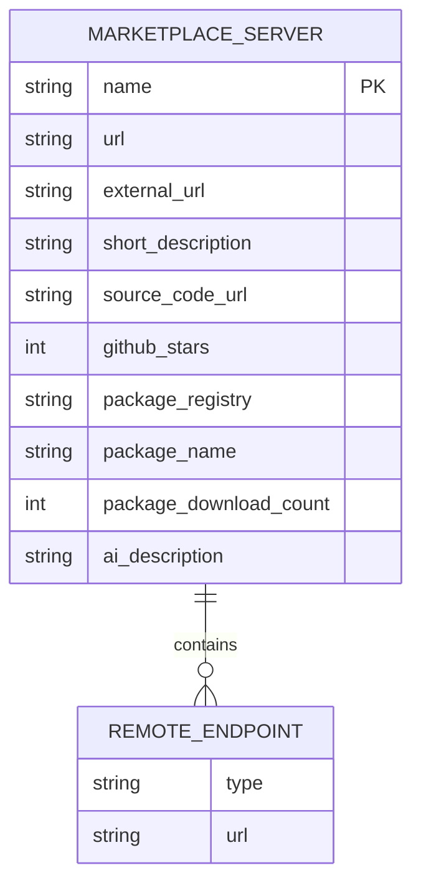
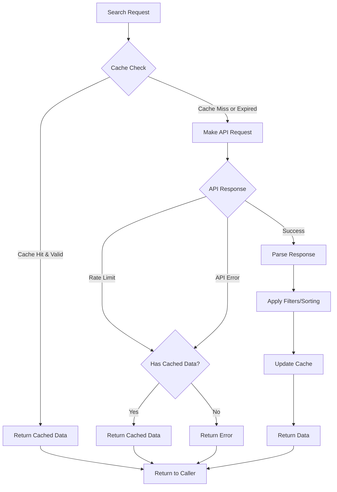
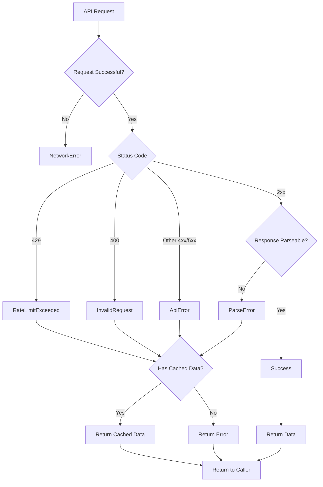
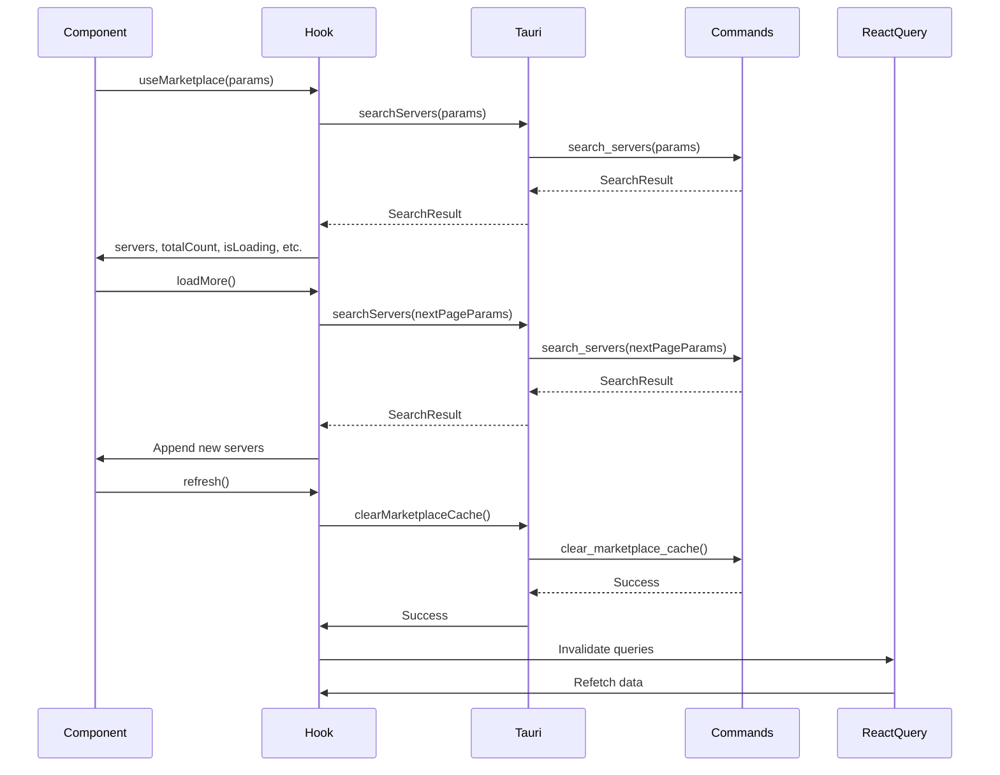
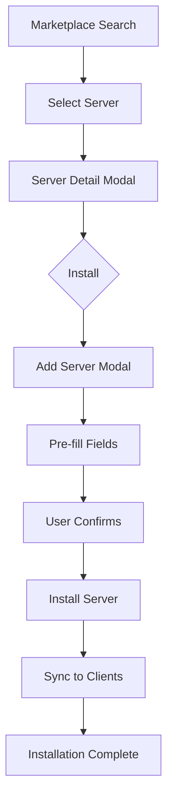

# Marketplace Integration Commands

<cite>
**Referenced Files in This Document**   
- [marketplace.rs](file://src-tauri/src/commands/marketplace.rs)
- [marketplace_client.rs](file://src-tauri/src/services/marketplace_client.rs)
- [marketplace.rs](file://src-tauri/src/models/marketplace.rs)
- [useMarketplace.ts](file://src/hooks/useMarketplace.ts)
- [MarketplaceCard.tsx](file://src/components/marketplace/MarketplaceCard.tsx)
- [ServerDetailModal.tsx](file://src/components/marketplace/ServerDetailModal.tsx)
- [tauri.ts](file://src/lib/tauri.ts)
- [index.ts](file://src/types/index.ts)
- [AddServerModal.tsx](file://src/components/servers/AddServerModal.tsx)
- [Marketplace.tsx](file://src/pages/Marketplace.tsx)
</cite>

## Table of Contents

1. [Introduction](#introduction)
2. [Core Command Handlers](#core-command-handlers)
3. [MarketplaceClient Service](#marketplaceclient-service)
4. [Request/Response Serialization](#requestresponse-serialization)
5. [Caching Strategy](#caching-strategy)
6. [Error Handling and Recovery](#error-handling-and-recovery)
7. [Frontend Integration](#frontend-integration)
8. [Security Considerations](#security-considerations)
9. [Installation Integration](#installation-integration)
10. [Conclusion](#conclusion)

## Introduction

The MCP Nexus marketplace integration provides a comprehensive system for discovering, browsing, and installing MCP servers from the PulseMCP API. This documentation details the command handlers that power the marketplace functionality, including `search_servers`, `get_server_details`, and related functions that interface with the `MarketplaceClient` service.

The marketplace system enables users to search for servers based on various criteria, view detailed information about specific servers, and seamlessly install them into their local environment. The integration is designed with robust error handling, caching for improved performance, and security considerations to protect against malicious server definitions.

This documentation covers the complete workflow from API command execution to frontend presentation, including the data flow, error cases, and integration points with other components of the MCP Nexus application.

**Section sources**

- [marketplace.rs](file://src-tauri/src/commands/marketplace.rs#L1-L236)
- [marketplace_client.rs](file://src-tauri/src/services/marketplace_client.rs#L1-L415)

## Core Command Handlers

The marketplace command handlers provide the primary interface between the frontend application and the PulseMCP API. These handlers are implemented as Tauri commands that can be invoked from the frontend JavaScript/TypeScript code.

### search_servers Command

The `search_servers` command is the primary entry point for discovering MCP servers in the marketplace. It accepts search parameters from the frontend and returns a paginated list of matching servers.

**Parameters:**

- `query`: Search query text (optional)
- `page_size`: Number of results per page (optional, defaults to 42)
- `page`: Page number (0-indexed, optional, defaults to 0)
- `sort`: Sort option (optional)
- `official_only`: Filter for official servers only (boolean)
- `community_only`: Filter for community servers only (boolean)
- `remote_available`: Filter for servers with remote/SSE support (boolean)

The command converts the frontend parameters into the internal `SearchParams` structure, which includes calculated values like offset based on page and page_size. It then delegates to the `MarketplaceClient` to perform the actual search operation.

The response is structured as a `SearchResult` containing:

- `servers`: Array of `MarketplaceServer` objects matching the query
- `total_count`: Total number of matching servers
- `has_more`: Boolean indicating if additional pages are available
- `page`: Current page number
- `page_size`: Page size used in the response



**Diagram sources**

- [marketplace.rs](file://src-tauri/src/commands/marketplace.rs#L127-L153)
- [marketplace_client.rs](file://src-tauri/src/services/marketplace_client.rs#L74-L200)

**Section sources**

- [marketplace.rs](file://src-tauri/src/commands/marketplace.rs#L127-L153)
- [marketplace_client.rs](file://src-tauri/src/services/marketplace_client.rs#L74-L200)

### get_server_details Command

The `get_server_details` command retrieves detailed information about a specific server by name. Unlike a dedicated API endpoint, this function works by performing a targeted search and finding the matching server.

**Parameters:**

- `name`: Server name to retrieve details for (required)

The command performs a search with the exact server name as the query parameter and a page size of 50 to ensure the server is found if it exists. It then searches through the results to find a server with a matching name (case-insensitive comparison).

The response is an `Option<MarketplaceServer>` that returns the server details if found, or `None` if no matching server is found.



**Diagram sources**

- [marketplace.rs](file://src-tauri/src/commands/marketplace.rs#L155-L167)
- [marketplace_client.rs](file://src-tauri/src/services/marketplace_client.rs#L242-L259)

**Section sources**

- [marketplace.rs](file://src-tauri/src/commands/marketplace.rs#L155-L167)
- [marketplace_client.rs](file://src-tauri/src/services/marketplace_client.rs#L242-L259)

### Utility Commands

In addition to the primary search commands, the marketplace system provides several utility commands for cache management:

- `clear_marketplace_cache`: Clears all cached marketplace data, forcing subsequent requests to fetch fresh data from the API
- `check_marketplace_cache`: Checks if cached data exists for a specific search query, useful for determining if offline mode is possible

These commands provide the frontend with control over the caching behavior, allowing for manual refresh operations and offline capability assessment.

**Section sources**

- [marketplace.rs](file://src-tauri/src/commands/marketplace.rs#L169-L189)

## MarketplaceClient Service

The `MarketplaceClient` service is the core component responsible for communicating with the PulseMCP API and managing the marketplace data flow. It handles HTTP requests, response parsing, error handling, and caching.

### Architecture and Implementation

The `MarketplaceClient` is implemented as a Rust struct with an asynchronous interface. It uses the `reqwest` HTTP client for making requests to the PulseMCP API at `https://api.pulsemcp.com/v0beta`.

Key components of the client implementation:

- **HTTP Client**: Configured with a 30-second timeout and a custom user agent
- **Cache**: In-memory cache using `HashMap` with `RwLock` for thread-safe access
- **Cache TTL**: Default of 300 seconds (5 minutes) to balance freshness and performance
- **Error Handling**: Comprehensive error handling for network issues, rate limiting, and API errors



**Diagram sources**

- [marketplace_client.rs](file://src-tauri/src/services/marketplace_client.rs#L23-L32)
- [marketplace.rs](file://src-tauri/src/models/marketplace.rs#L3-L147)

**Section sources**

- [marketplace_client.rs](file://src-tauri/src/services/marketplace_client.rs#L23-L32)
- [marketplace.rs](file://src-tauri/src/models/marketplace.rs#L3-L147)

### Client-Side Processing

The `MarketplaceClient` performs several client-side operations on the data received from the API:

1. **Filtering**: Applies client-side filters for official, community, and remote-available servers
2. **Sorting**: Applies client-side sorting for alphabetical and popularity-based ordering
3. **Data Enrichment**: Combines data from multiple sources when necessary

These client-side operations allow for more flexible filtering and sorting options than what the API natively provides, while still maintaining good performance through caching.

**Section sources**

- [marketplace_client.rs](file://src-tauri/src/services/marketplace_client.rs#L202-L240)

## Request/Response Serialization

The marketplace integration uses Serde for JSON serialization and deserialization, ensuring type-safe data exchange between the Rust backend and TypeScript frontend.

### Data Models

The core data models are defined in the `marketplace.rs` file in the models directory and mirrored in the TypeScript types file.

**MarketplaceServer Structure:**

- `name`: Server display name (required)
- `url`: PulseMCP directory URL (required)
- `external_url`: External website or documentation URL (optional)
- `short_description`: Brief description of the server's functionality (required)
- `source_code_url`: Repository URL for the server's source code (optional)
- `github_stars`: GitHub star count (optional)
- `package_registry`: Package registry (npm, pypi, docker, etc.) (optional)
- `package_name`: Package name in the registry (optional)
- `package_download_count`: Download count from the package registry (optional)
- `ai_description`: AI-generated description from PulseMCP (optional)
- `remotes`: Array of remote endpoints for SSE-based servers (optional)



**Diagram sources**

- [marketplace.rs](file://src-tauri/src/models/marketplace.rs#L15-L51)
- [index.ts](file://src/types/index.ts#L178-L202)

**Section sources**

- [marketplace.rs](file://src-tauri/src/models/marketplace.rs#L15-L51)
- [index.ts](file://src/types/index.ts#L178-L202)

### Parameter Conversion

The system uses a conversion pattern to transform frontend parameters into the internal search parameters:

- `SearchServersParams` (frontend) → `SearchParams` (internal)
- Field names are converted from camelCase to snake_case via Serde attributes
- Optional fields are handled with proper default values
- Calculated fields like offset are derived from page and page_size

This conversion ensures that the API contract remains stable while allowing flexibility in the frontend parameter structure.

**Section sources**

- [marketplace.rs](file://src-tauri/src/commands/marketplace.rs#L58-L108)
- [marketplace.rs](file://src-tauri/src/models/marketplace.rs#L103-L146)

## Caching Strategy

The marketplace implementation includes a sophisticated caching strategy to improve performance, reduce API load, and enable offline functionality.

### Cache Implementation

The cache is implemented as an in-memory `HashMap` with `RwLock` for thread-safe access across async tasks. Each cache entry includes:

- `data`: The cached `MarketplaceSearchResponse`
- `cached_at`: Timestamp when the entry was created

Cache keys are generated from the search parameters using a deterministic algorithm:

```
"search:{query}:{page_size}:{offset}"
```

This ensures that identical search requests receive the same cache key, maximizing cache hit rates.

### Cache Behavior

The caching system follows these rules:

1. **Cache Check**: Before making an API request, the client checks if valid cached data exists
2. **Cache Validation**: Entries are considered valid if they were created within the TTL period (5 minutes by default)
3. **Cache Update**: Successful API responses are stored in the cache with a fresh timestamp
4. **Cache Fallback**: In case of API errors (including rate limiting), the system returns cached data if available, even if stale

This fallback behavior ensures that users can continue to browse marketplace content even when the API is temporarily unavailable.



**Diagram sources**

- [marketplace_client.rs](file://src-tauri/src/services/marketplace_client.rs#L81-L197)
- [marketplace_client.rs](file://src-tauri/src/services/marketplace_client.rs#L267-L278)

**Section sources**

- [marketplace_client.rs](file://src-tauri/src/services/marketplace_client.rs#L81-L197)
- [marketplace_client.rs](file://src-tauri/src/services/marketplace_client.rs#L267-L278)

### Cache Management

The system provides explicit cache management through Tauri commands:

- `clear_marketplace_cache`: Completely clears the cache, forcing all subsequent requests to fetch fresh data
- `check_marketplace_cache`: Allows the frontend to check if cached data exists for a specific query

These commands give the frontend control over the caching behavior, enabling features like manual refresh and offline mode detection.

**Section sources**

- [marketplace.rs](file://src-tauri/src/commands/marketplace.rs#L169-L189)
- [marketplace_client.rs](file://src-tauri/src/services/marketplace_client.rs#L261-L278)

## Error Handling and Recovery

The marketplace integration includes comprehensive error handling to provide a resilient user experience even in the face of network issues and API problems.

### Error Types

The system defines several error types through the `MarketplaceError` enum:

- **NetworkError**: Indicates connectivity issues or inability to reach the API
- **RateLimitExceeded**: Triggered when the API rate limit is exceeded, includes optional retry-after information
- **InvalidRequest**: For malformed requests or invalid parameters
- **ApiError**: For HTTP errors from the API (non-2xx status codes)
- **ParseError**: When the API response cannot be parsed as expected

These errors are converted to a frontend-friendly `MarketplaceCommandError` structure that includes:

- `message`: User-readable error message
- `error_type`: Categorized error type for programmatic handling
- `retry_after_seconds`: For rate limiting, indicates when retry is appropriate



**Diagram sources**

- [marketplace.rs](file://src-tauri/src/commands/marketplace.rs#L13-L55)
- [marketplace_client.rs](file://src-tauri/src/services/marketplace_client.rs#L118-L166)

**Section sources**

- [marketplace.rs](file://src-tauri/src/commands/marketplace.rs#L13-L55)
- [marketplace_client.rs](file://src-tauri/src/services/marketplace_client.rs#L118-L166)

### Error Recovery Strategy

The system implements a graceful degradation strategy for error recovery:

1. **Cache Fallback**: When API errors occur, the system attempts to return cached data if available
2. **Partial Success**: Even when the API returns an error, if cached data exists, it is returned with a warning
3. **Retry Guidance**: For rate limiting, the system provides retry-after information to inform user interface decisions
4. **User Feedback**: Errors are communicated to the user through the frontend interface with appropriate remediation suggestions

This approach ensures that users can continue to access marketplace content even during temporary API outages or rate limiting events.

**Section sources**

- [marketplace_client.rs](file://src-tauri/src/services/marketplace_client.rs#L122-L166)

## Frontend Integration

The marketplace commands are integrated into the frontend through several components that provide a seamless user experience.

### useMarketplace Hook

The `useMarketplace` hook in `useMarketplace.ts` provides a React-friendly interface to the marketplace commands. It uses React Query for data fetching and caching, with the following features:

- **Infinite Query**: Supports infinite scrolling with automatic loading of additional pages
- **Stale Time**: Matches the Rust cache TTL (5 minutes) to ensure consistency
- **Refetching**: Includes a refresh function that clears the backend cache before refetching
- **Error Handling**: Translates backend errors to React Query error state

The hook abstracts the pagination logic, automatically determining when more data can be loaded based on the `hasMore` flag from the API response.



**Diagram sources**

- [useMarketplace.ts](file://src/hooks/useMarketplace.ts#L1-L71)
- [tauri.ts](file://src/lib/tauri.ts#L198-L203)

**Section sources**

- [useMarketplace.ts](file://src/hooks/useMarketplace.ts#L1-L71)
- [tauri.ts](file://src/lib/tauri.ts#L198-L203)

### MarketplaceCard Component

The `MarketplaceCard` component displays individual server results in a visually appealing card format. It receives a `MarketplaceServer` object and an `onSelect` callback function.

Key features:

- Displays server name, description, and key metrics (GitHub stars, download count)
- Shows badges for package registry and remote/SSE availability
- Formats large numbers with K/M suffixes for readability
- Provides visual feedback on hover

The component is used in the marketplace grid to display search results, with skeleton loading states during data fetching.

**Section sources**

- [MarketplaceCard.tsx](file://src/components/marketplace/MarketplaceCard.tsx#L1-L136)

### ServerDetailModal Component

The `ServerDetailModal` component provides a detailed view of a selected server, accessible from the `MarketplaceCard`. It displays comprehensive information and enables installation.

Key features:

- Shows detailed server information including description, stats, and links
- Displays runtime requirements based on package registry
- Provides install command preview for npm, pypi, and docker packages
- Supports both stdio and SSE transport modes
- Allows selection of target clients for installation
- Handles SSE URL input for remote servers

The modal integrates with the installation system, passing the selected server and configuration to the `onInstall` callback when the user confirms installation.

**Section sources**

- [ServerDetailModal.tsx](file://src/components/marketplace/ServerDetailModal.tsx#L1-L591)
- [Marketplace.tsx](file://src/pages/Marketplace.tsx#L59-L90)

## Security Considerations

The marketplace integration includes several security measures to protect users from malicious server definitions and API interactions.

### API Key Management

While the current implementation does not require API keys for the PulseMCP API, the architecture is designed to support secure credential management through the keychain system. If API keys become required in the future, they would be stored securely using the system keychain rather than being exposed in the application code.

The `saveCredential`, `getCredentialValue`, and related functions in the Tauri commands provide a secure way to store and retrieve sensitive credentials, ensuring they are not exposed in the frontend JavaScript context.

**Section sources**

- [tauri.ts](file://src/lib/tauri.ts#L161-L187)

### Response Validation

The system implements strict response validation through several mechanisms:

1. **Type Safety**: Serde deserialization ensures that API responses match the expected structure
2. **Field Validation**: Optional fields are properly handled, and required fields are validated
3. **URL Validation**: External URLs are validated to prevent malicious redirects
4. **Content Sanitization**: Server descriptions and other user-facing content are sanitized to prevent XSS attacks

The `MarketplaceServer` model includes appropriate validation attributes to ensure data integrity.

**Section sources**

- [marketplace.rs](file://src-tauri/src/models/marketplace.rs#L15-L51)
- [index.ts](file://src/types/index.ts#L178-L202)

### Protection Against Malicious Server Definitions

The system includes several safeguards against malicious server definitions:

1. **Source Verification**: Package registry information is used to verify the authenticity of servers
2. **Runtime Validation**: Before installation, the system validates that required runtimes are available
3. **Environment Variable Protection**: Credentials are stored in the system keychain rather than in environment variables
4. **Sandboxing**: Local servers run in the user's environment with standard security boundaries

The `validateInstall` command checks that required runtimes are available before proceeding with installation, preventing attempts to install servers that require untrusted or insecure dependencies.

**Section sources**

- [tauri.ts](file://src/lib/tauri.ts#L268-L272)
- [marketplace_client.rs](file://src-tauri/src/services/marketplace_client.rs#L279-L283)

## Installation Integration

The marketplace system integrates seamlessly with the server installation workflow through the `AddServerModal` component.

### Seamless Installation Flow

When a user selects a server from the marketplace, the `ServerDetailModal` provides an installation interface that pre-populates relevant fields based on the marketplace data:

- **Server Name**: Pre-filled from the marketplace server name
- **Description**: Pre-filled from the server description
- **Source Type**: Automatically determined from package registry information
- **Package Name**: Pre-filled for npm, pypi, and docker packages
- **Runtime Requirements**: Displayed to inform the user of prerequisites

This integration eliminates the need for users to manually enter server details, reducing errors and improving the user experience.



**Diagram sources**

- [ServerDetailModal.tsx](file://src/components/marketplace/ServerDetailModal.tsx#L572-L588)
- [AddServerModal.tsx](file://src/components/servers/AddServerModal.tsx#L29-L34)

**Section sources**

- [ServerDetailModal.tsx](file://src/components/marketplace/ServerDetailModal.tsx#L572-L588)
- [AddServerModal.tsx](file://src/components/servers/AddServerModal.tsx#L29-L34)

### Transport Mode Selection

For servers that support both stdio and SSE transport modes, the installation flow allows users to choose their preferred connection method:

- **Local (stdio)**: Runs the server locally on the user's machine, requiring the appropriate runtime to be installed
- **Remote (SSE)**: Connects to a remote server instance, eliminating the need for local installation

This flexibility allows users to choose the deployment model that best fits their security, performance, and convenience requirements.

**Section sources**

- [ServerDetailModal.tsx](file://src/components/marketplace/ServerDetailModal.tsx#L369-L409)

## Conclusion

The marketplace integration in MCP Nexus provides a robust, secure, and user-friendly interface for discovering and installing MCP servers. The system is built around three core command handlers—`search_servers`, `get_server_details`, and related utility functions—that interface with the `MarketplaceClient` service to communicate with the PulseMCP API.

Key features of the implementation include:

- Comprehensive parameter handling with flexible search, filtering, and sorting options
- Robust error handling with cache fallback for improved reliability
- Efficient caching strategy that balances freshness and performance
- Secure response validation and protection against malicious server definitions
- Seamless integration with the installation workflow for one-click server addition

The architecture follows a clean separation of concerns, with well-defined data models, type-safe serialization, and a clear boundary between the frontend and backend components. This design ensures maintainability and extensibility as the marketplace functionality evolves.

By providing a rich set of features while maintaining performance and reliability, the marketplace integration significantly enhances the user experience of discovering and adding new MCP servers to their workflow.

[No sources needed since this section summarizes without analyzing specific files]
