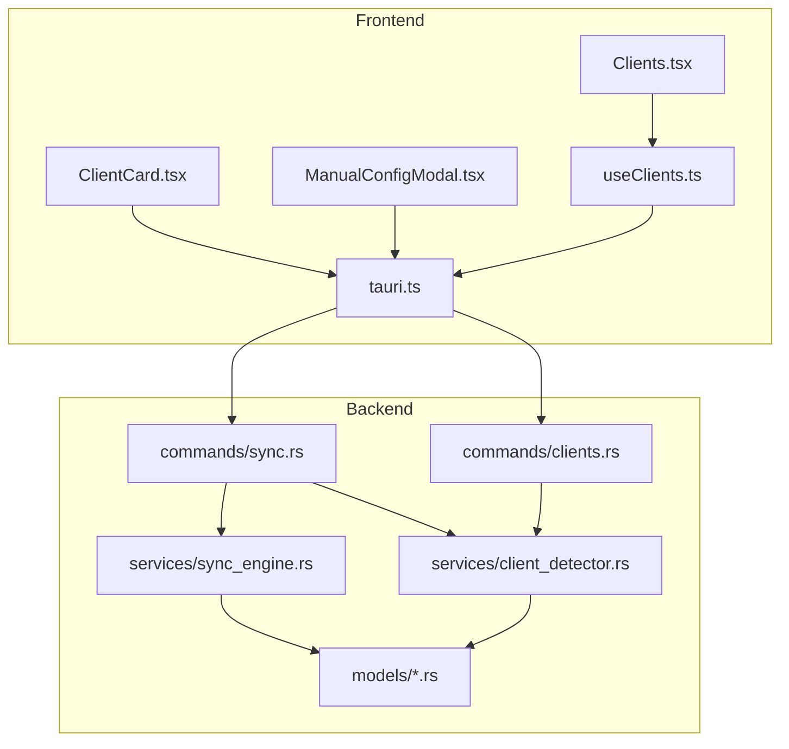
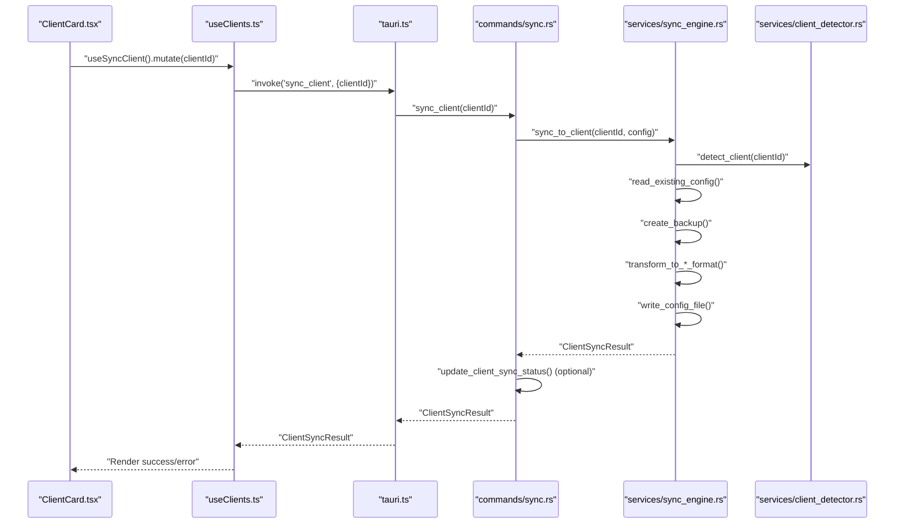
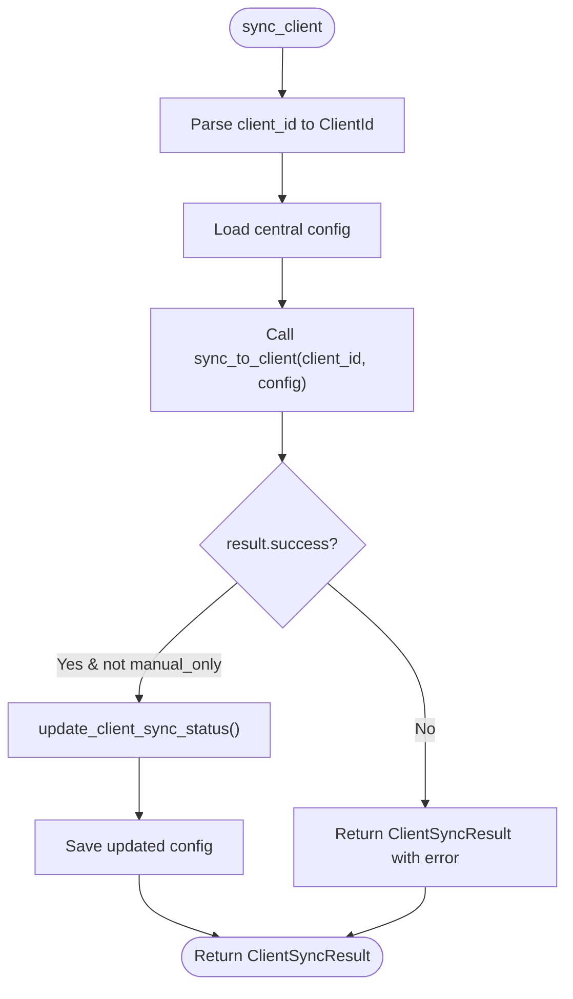
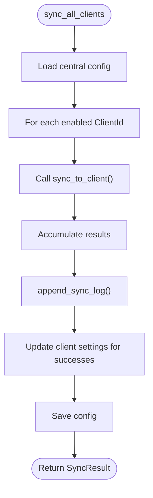
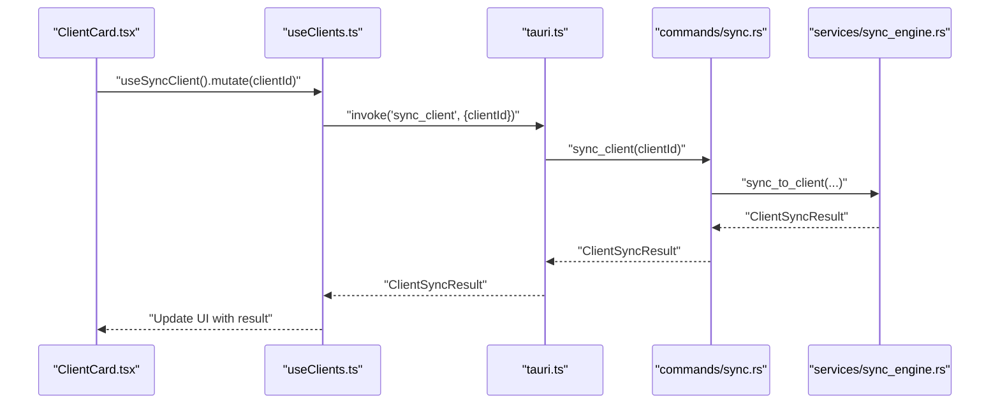
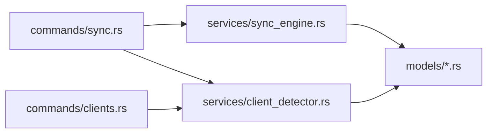

# Synchronization Commands

<cite>
**Referenced Files in This Document**
- [sync.rs](file://src-tauri/src/commands/sync.rs)
- [sync_engine.rs](file://src-tauri/src/services/sync_engine.rs)
- [client_detector.rs](file://src-tauri/src/services/client_detector.rs)
- [clients.rs](file://src-tauri/src/commands/clients.rs)
- [tauri.ts](file://src/lib/tauri.ts)
- [ClientCard.tsx](file://src/components/clients/ClientCard.tsx)
- [ManualConfigModal.tsx](file://src/components/clients/ManualConfigModal.tsx)
- [Clients.tsx](file://src/pages/Clients.tsx)
- [useClients.ts](file://src/hooks/useClients.ts)
- [client.rs](file://src-tauri/src/models/client.rs)
- [config.rs](file://src-tauri/src/models/config.rs)
</cite>

## Table of Contents

1. [Introduction](#introduction)
2. [Project Structure](#project-structure)
3. [Core Components](#core-components)
4. [Architecture Overview](#architecture-overview)
5. [Detailed Component Analysis](#detailed-component-analysis)
6. [Dependency Analysis](#dependency-analysis)
7. [Performance Considerations](#performance-considerations)
8. [Troubleshooting Guide](#troubleshooting-guide)
9. [Conclusion](#conclusion)

## Introduction

This document describes the synchronization command handlers that power configuration distribution to AI clients in MCP Nexus. It focuses on the sync_to_clients and detect_clients workflows, detailing how the backend commands coordinate with the SyncEngine and ClientDetector services to generate and apply client-specific configurations. It also covers frontend invocation patterns, async execution, error handling, conflict detection, and security considerations.

## Project Structure

The synchronization feature spans Rust backend commands and services, plus React frontend integrations:

- Backend commands expose Tauri commands for single and bulk sync, import, manual config retrieval, and enabling/disabling sync per client.
- Services encapsulate detection, transformation, writing, and conflict detection logic.
- Frontend components invoke commands via typed wrappers and render results.

**Diagram sources**

- [sync.rs](file://src-tauri/src/commands/sync.rs#L71-L205)
- [clients.rs](file://src-tauri/src/commands/clients.rs#L10-L170)
- [sync_engine.rs](file://src-tauri/src/services/sync_engine.rs#L1-L120)
- [client_detector.rs](file://src-tauri/src/services/client_detector.rs#L1-L120)
- [tauri.ts](file://src/lib/tauri.ts#L86-L144)
- [ClientCard.tsx](file://src/components/clients/ClientCard.tsx#L236-L331)
- [ManualConfigModal.tsx](file://src/components/clients/ManualConfigModal.tsx#L1-L240)
- [Clients.tsx](file://src/pages/Clients.tsx#L41-L75)

**Section sources**

- [sync.rs](file://src-tauri/src/commands/sync.rs#L71-L205)
- [clients.rs](file://src-tauri/src/commands/clients.rs#L10-L170)
- [sync_engine.rs](file://src-tauri/src/services/sync_engine.rs#L1-L120)
- [client_detector.rs](file://src-tauri/src/services/client_detector.rs#L1-L120)
- [tauri.ts](file://src/lib/tauri.ts#L86-L144)
- [ClientCard.tsx](file://src/components/clients/ClientCard.tsx#L236-L331)
- [ManualConfigModal.tsx](file://src/components/clients/ManualConfigModal.tsx#L1-L240)
- [Clients.tsx](file://src/pages/Clients.tsx#L41-L75)

## Core Components

- sync_client: Applies configuration to a single client, handling backups, transforms, writes, and status updates.
- sync_all_clients: Iterates enabled clients and aggregates results, logging failures and updating statuses.
- import_client_servers: Reads a client’s existing configuration and imports servers into the central config.
- get_manual_config: Generates a client-specific manual configuration payload for clients requiring manual setup.
- set_client_sync_enabled: Toggles whether a client is included in automatic sync.
- detect_clients: Returns detected clients with metadata for UI consumption.
- get_all_client_statuses: Computes per-client status including externally modified detection.

These commands integrate with:

- SyncEngine: Transformation, backup, write, checksum computation, and conflict detection.
- ClientDetector: Client discovery, config path resolution, and format parsing.

**Section sources**

- [sync.rs](file://src-tauri/src/commands/sync.rs#L71-L205)
- [clients.rs](file://src-tauri/src/commands/clients.rs#L10-L170)
- [sync_engine.rs](file://src-tauri/src/services/sync_engine.rs#L317-L485)
- [client_detector.rs](file://src-tauri/src/services/client_detector.rs#L123-L221)

## Architecture Overview

The sync pipeline:

1. Frontend invokes a Tauri command via typed wrappers.
2. The command loads the central configuration and delegates to SyncEngine.
3. SyncEngine detects client type/format, reads existing config, creates a backup, transforms servers to the client’s format, serializes, and writes atomically.
4. On success, client settings are updated with timestamps and checksums.
5. Results are returned to the frontend, which renders status and errors.

**Diagram sources**

- [ClientCard.tsx](file://src/components/clients/ClientCard.tsx#L276-L307)
- [useClients.ts](file://src/hooks/useClients.ts#L40-L50)
- [tauri.ts](file://src/lib/tauri.ts#L114-L117)
- [sync.rs](file://src-tauri/src/commands/sync.rs#L71-L105)
- [sync_engine.rs](file://src-tauri/src/services/sync_engine.rs#L317-L446)
- [client_detector.rs](file://src-tauri/src/services/client_detector.rs#L123-L165)

## Detailed Component Analysis

### sync_client

- Purpose: Sync configuration to a single client.
- Parameters:
  - clientId: string identifier parsed into ClientId.
- Behavior:
  - Loads central configuration.
  - Delegates to SyncEngine.sync_to_client.
  - On success and when not manual-only, updates client settings with last sync and checksum.
- Returns: ClientSyncResult with success flag, servers synced, backup path, optional error, and optional manualConfig.
- Errors:
  - Invalid client ID.
  - Config load/save failures.
  - Detection or write failures from SyncEngine.

**Diagram sources**

- [sync.rs](file://src-tauri/src/commands/sync.rs#L71-L105)
- [sync_engine.rs](file://src-tauri/src/services/sync_engine.rs#L635-L663)

**Section sources**

- [sync.rs](file://src-tauri/src/commands/sync.rs#L71-L105)
- [sync_engine.rs](file://src-tauri/src/services/sync_engine.rs#L317-L446)
- [sync_engine.rs](file://src-tauri/src/services/sync_engine.rs#L635-L663)

### sync_all_clients

- Purpose: Sync configuration to all enabled clients.
- Parameters: None (reads from central config).
- Behavior:
  - Iterates ClientId::all().
  - Skips disabled clients.
  - Aggregates ClientSyncResult entries.
  - Logs failures to auto-sync log.
  - Updates client settings for successful syncs.
- Returns: SyncResult with totals and per-client results.
- Errors:
  - Config load/save failures.
  - Individual client sync errors.

**Diagram sources**

- [sync.rs](file://src-tauri/src/commands/sync.rs#L107-L141)
- [sync_engine.rs](file://src-tauri/src/services/sync_engine.rs#L448-L485)
- [sync.rs](file://src-tauri/src/commands/sync.rs#L17-L69)

**Section sources**

- [sync.rs](file://src-tauri/src/commands/sync.rs#L107-L141)
- [sync_engine.rs](file://src-tauri/src/services/sync_engine.rs#L448-L485)
- [sync.rs](file://src-tauri/src/commands/sync.rs#L17-L69)

### import_client_servers

- Purpose: Import servers from a client’s configuration into the central config.
- Parameters:
  - clientId: string identifier parsed into ClientId.
  - overwriteExisting: boolean controlling replacement of existing servers.
- Behavior:
  - Loads central config.
  - Uses ClientDetector.get_client_config_info to parse client’s raw config.
  - Parses servers and merges into central config respecting overwriteExisting.
  - Saves updated config.
- Returns: ImportResult with counts and names.
- Errors:
  - Invalid client ID.
  - Config load/save failures.
  - Parsing/read errors.

**Section sources**

- [sync.rs](file://src-tauri/src/commands/sync.rs#L144-L176)
- [sync_engine.rs](file://src-tauri/src/services/sync_engine.rs#L585-L633)
- [client_detector.rs](file://src-tauri/src/services/client_detector.rs#L223-L236)

### get_manual_config

- Purpose: Generate a client-specific manual configuration payload for clients that require manual setup.
- Parameters:
  - clientId: string identifier parsed into ClientId.
- Behavior:
  - Loads central config.
  - Calls sync_to_client to produce a manualConfig string.
  - Returns the manualConfig if present; otherwise returns an error indicating manual configuration is not required.
- Returns: String containing formatted JSON for manual paste.
- Errors:
  - Invalid client ID.
  - Client does not require manual configuration.

**Section sources**

- [sync.rs](file://src-tauri/src/commands/sync.rs#L178-L205)
- [sync_engine.rs](file://src-tauri/src/services/sync_engine.rs#L223-L233)

### set_client_sync_enabled

- Purpose: Toggle whether a client participates in automatic sync.
- Parameters:
  - clientId: string identifier parsed into ClientId.
  - enabled: boolean.
- Behavior:
  - Loads central config.
  - Ensures client settings exist and sets enabled flag.
  - Saves config.
- Returns: void on success.
- Errors:
  - Invalid client ID.
  - Config save failure.

**Section sources**

- [sync.rs](file://src-tauri/src/commands/sync.rs#L206-L245)
- [config.rs](file://src-tauri/src/models/config.rs#L6-L21)

### detect_clients

- Purpose: Enumerate detected clients with metadata for UI.
- Parameters: None.
- Behavior:
  - Delegates to ClientDetector.detect_all_clients.
- Returns: Vec<DetectedClient>.
- Errors: None (wraps detection errors into DetectedClient.error).

**Section sources**

- [clients.rs](file://src-tauri/src/commands/clients.rs#L10-L15)
- [client_detector.rs](file://src-tauri/src/services/client_detector.rs#L218-L221)

### get_all_client_statuses

- Purpose: Compute per-client status including externally modified detection.
- Parameters: None.
- Behavior:
  - Loads central config.
  - Detects clients.
  - For each detected client, computes externally_modified by comparing last_sync_checksum with current file checksum.
- Returns: Vec<ClientSyncStatus>.
- Errors:
  - Config load failure.
  - File read errors during checksum computation.

**Section sources**

- [clients.rs](file://src-tauri/src/commands/clients.rs#L72-L126)
- [sync_engine.rs](file://src-tauri/src/services/sync_engine.rs#L307-L316)

### Frontend Invocation Patterns

- ClientCard.tsx:
  - Single client sync: calls useClients.useSyncClient().mutate(clientId).
  - Manual-only clients: opens ManualConfigModal via onShowManualConfig(clientId).
- ManualConfigModal.tsx:
  - Copies manualConfig JSON to clipboard and notifies success.
- Clients.tsx:
  - Handles single and bulk sync actions, maps single result to SyncResult for display, and shows notifications.

**Diagram sources**

- [ClientCard.tsx](file://src/components/clients/ClientCard.tsx#L276-L307)
- [useClients.ts](file://src/hooks/useClients.ts#L40-L50)
- [tauri.ts](file://src/lib/tauri.ts#L114-L117)
- [sync.rs](file://src-tauri/src/commands/sync.rs#L71-L105)
- [sync_engine.rs](file://src-tauri/src/services/sync_engine.rs#L317-L446)

**Section sources**

- [ClientCard.tsx](file://src/components/clients/ClientCard.tsx#L236-L331)
- [ManualConfigModal.tsx](file://src/components/clients/ManualConfigModal.tsx#L1-L240)
- [Clients.tsx](file://src/pages/Clients.tsx#L41-L75)
- [useClients.ts](file://src/hooks/useClients.ts#L1-L54)
- [tauri.ts](file://src/lib/tauri.ts#L86-L144)

## Dependency Analysis

- sync.rs depends on:
  - services/sync_engine.rs for core sync logic.
  - services/client_detector.rs for client detection and config paths.
  - models for ClientId and ClientSyncResult.
- sync_engine.rs depends on:
  - models for McpHubConfig, McpServer, ClientSettings, Transport, and SyncMode.
  - keychain helpers for resolving credential references.
- clients.rs depends on:
  - services/client_detector.rs for detection and config info.
  - models for ClientSyncStatus and ClientConfigInfo.

**Diagram sources**

- [sync.rs](file://src-tauri/src/commands/sync.rs#L1-L20)
- [clients.rs](file://src-tauri/src/commands/clients.rs#L1-L9)
- [sync_engine.rs](file://src-tauri/src/services/sync_engine.rs#L1-L14)
- [client_detector.rs](file://src-tauri/src/services/client_detector.rs#L1-L6)
- [client.rs](file://src-tauri/src/models/client.rs#L1-L24)
- [config.rs](file://src-tauri/src/models/config.rs#L60-L127)

**Section sources**

- [sync.rs](file://src-tauri/src/commands/sync.rs#L1-L20)
- [clients.rs](file://src-tauri/src/commands/clients.rs#L1-L9)
- [sync_engine.rs](file://src-tauri/src/services/sync_engine.rs#L1-L14)
- [client_detector.rs](file://src-tauri/src/services/client_detector.rs#L1-L6)
- [client.rs](file://src-tauri/src/models/client.rs#L1-L24)
- [config.rs](file://src-tauri/src/models/config.rs#L60-L127)

## Performance Considerations

- Async execution model:
  - Commands are invoked asynchronously via Tauri and React Query. UI remains responsive while long-running syncs occur.
- Batch sync:
  - sync_all_clients iterates all clients; consider throttling or parallelization strategies if many clients are present.
- File I/O:
  - Atomic writes and checksum computations are lightweight; avoid unnecessary repeated reads by caching where appropriate.
- Conflict detection:
  - Externally modified detection uses checksum comparisons; keep last_sync_checksum updated to minimize false positives.

[No sources needed since this section provides general guidance]

## Troubleshooting Guide

Common error cases and recovery strategies:

- Client not found:
  - Symptom: Detection reports error or client not detected.
  - Action: Verify client installation and configuration path; re-run detection.
- Permission denied:
  - Symptom: Write failures when creating backups or writing config files.
  - Action: Ensure application has write access to the client’s config directory; adjust permissions.
- Sync conflicts:
  - Symptom: Externally modified flag is true.
  - Action: Review recent changes in the client app; consider re-importing servers or disabling auto-sync temporarily.
- Invalid client ID:
  - Symptom: Command parsing fails.
  - Action: Validate client identifier string; ensure it matches supported ClientId variants.
- Manual configuration required:
  - Symptom: sync_to_client returns manualConfig.
  - Action: Use get_manual_config to generate JSON and guide user to paste into client UI.

Security considerations:

- File system access:
  - SyncEngine writes to client config paths with atomic operations and restrictive permissions (e.g., 0600 on Unix).
  - Backups are created with distinct extensions to prevent accidental overwrites.
- Credential handling:
  - Credentials are resolved only when writing to client configs; manual configuration payloads intentionally retain keychain references for safe user-handling.
- Privilege separation:
  - Detection and sync operations are separated; detection is read-only, while sync performs writes.

**Section sources**

- [sync_engine.rs](file://src-tauri/src/services/sync_engine.rs#L256-L305)
- [sync_engine.rs](file://src-tauri/src/services/sync_engine.rs#L223-L233)
- [clients.rs](file://src-tauri/src/commands/clients.rs#L39-L70)
- [client_detector.rs](file://src-tauri/src/services/client_detector.rs#L123-L209)

## Conclusion

The synchronization subsystem cleanly separates concerns between frontend command invocation, backend orchestration, and service-layer logic. The sync_to_clients and detect_clients workflows provide robust, secure, and observable configuration distribution across supported AI clients, with clear error reporting and conflict detection. Frontend components integrate seamlessly with typed command wrappers to deliver a responsive user experience.
