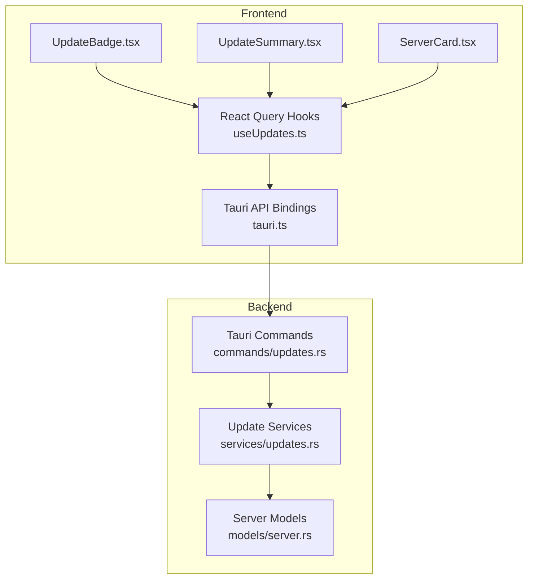
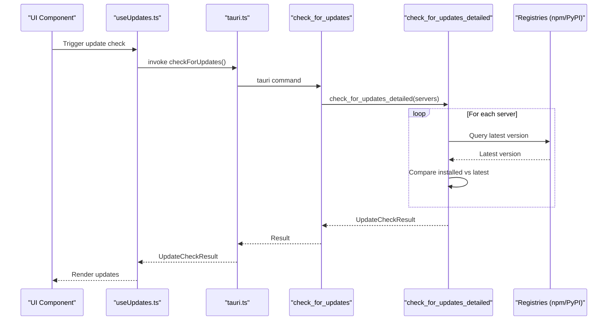
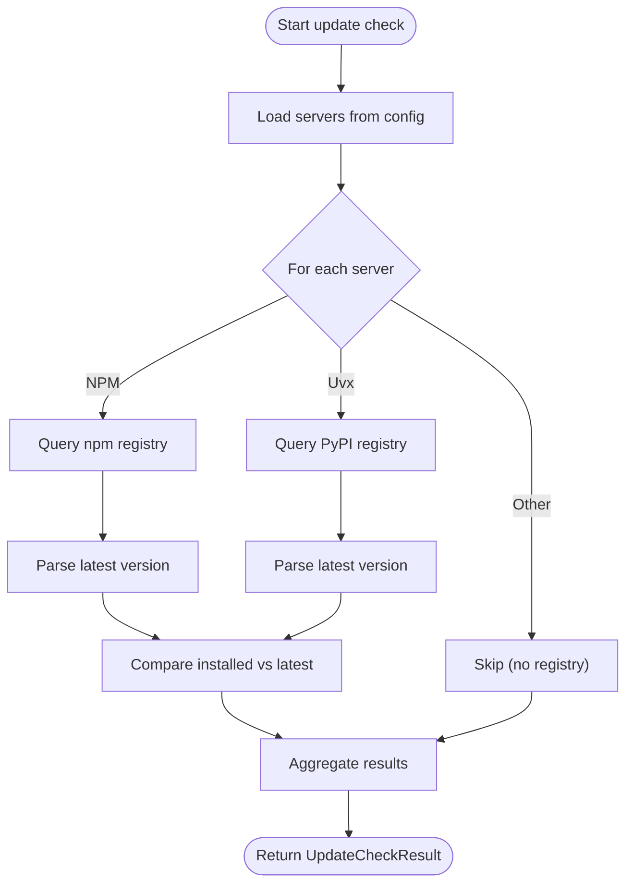
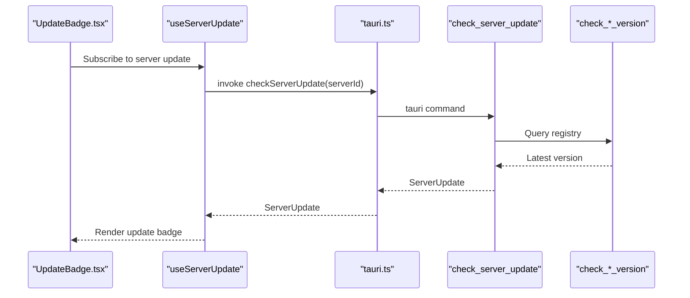
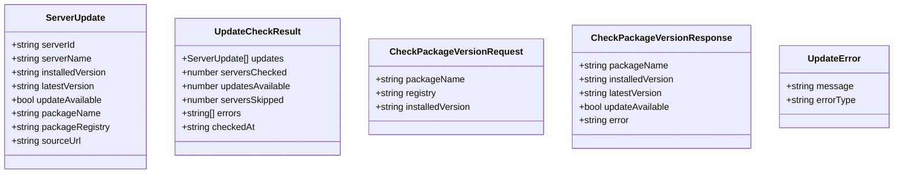
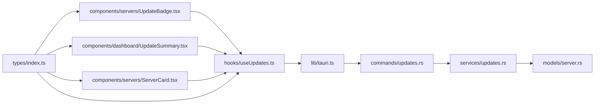

# Update Management Commands

<cite>
**Referenced Files in This Document**
- [updates.rs](file://src-tauri/src/commands/updates.rs)
- [updates.rs](file://src-tauri/src/services/updates.rs)
- [tauri.ts](file://src/lib/tauri.ts)
- [useUpdates.ts](file://src/hooks/useUpdates.ts)
- [UpdateBadge.tsx](file://src/components/servers/UpdateBadge.tsx)
- [UpdateSummary.tsx](file://src/components/dashboard/UpdateSummary.tsx)
- [ServerCard.tsx](file://src/components/servers/ServerCard.tsx)
- [server.rs](file://src-tauri/src/models/server.rs)
- [index.ts](file://src/types/index.ts)
</cite>

## Table of Contents

1. [Introduction](#introduction)
2. [Project Structure](#project-structure)
3. [Core Components](#core-components)
4. [Architecture Overview](#architecture-overview)
5. [Detailed Component Analysis](#detailed-component-analysis)
6. [Dependency Analysis](#dependency-analysis)
7. [Performance Considerations](#performance-considerations)
8. [Troubleshooting Guide](#troubleshooting-guide)
9. [Conclusion](#conclusion)

## Introduction

This document describes the update management command handlers in MCP Nexus. It focuses on the check_for_updates and check_server_update functions, explaining their parameters, return types, error handling, and integration with the UpdatesService. It also covers how these commands compare local versions with remote metadata, how frontend components invoke them, and how the system surfaces update status in the UI. Security verification and changelog parsing are addressed where applicable, along with performance considerations for periodic checks and bandwidth optimization.

## Project Structure

The update management system spans backend Tauri commands, service logic, typed frontend bindings, and React components that render update status.

**Diagram sources**

- [updates.rs](file://src-tauri/src/commands/updates.rs#L49-L242)
- [updates.rs](file://src-tauri/src/services/updates.rs#L1-L318)
- [tauri.ts](file://src/lib/tauri.ts#L285-L335)
- [useUpdates.ts](file://src/hooks/useUpdates.ts#L1-L120)
- [UpdateBadge.tsx](file://src/components/servers/UpdateBadge.tsx#L1-L184)
- [UpdateSummary.tsx](file://src/components/dashboard/UpdateSummary.tsx#L1-L104)
- [ServerCard.tsx](file://src/components/servers/ServerCard.tsx#L1-L341)
- [server.rs](file://src-tauri/src/models/server.rs#L1-L233)

**Section sources**

- [updates.rs](file://src-tauri/src/commands/updates.rs#L49-L242)
- [updates.rs](file://src-tauri/src/services/updates.rs#L1-L318)
- [tauri.ts](file://src/lib/tauri.ts#L285-L335)
- [useUpdates.ts](file://src/hooks/useUpdates.ts#L1-L120)
- [UpdateBadge.tsx](file://src/components/servers/UpdateBadge.tsx#L1-L184)
- [UpdateSummary.tsx](file://src/components/dashboard/UpdateSummary.tsx#L1-L104)
- [ServerCard.tsx](file://src/components/servers/ServerCard.tsx#L1-L341)
- [server.rs](file://src-tauri/src/models/server.rs#L1-L233)
- [index.ts](file://src/types/index.ts#L326-L385)

## Core Components

- Backend Tauri commands:
  - check_for_updates: Full scan of installed servers against npm/PyPI registries.
  - check_server_update: Single server update check by ID.
  - check_package_version: Lightweight package version check for a given registry.
  - get_update_count: Fast count of servers with updates available.
- Backend services:
  - check_for_updates_detailed: Orchestrates registry queries and version comparisons.
  - check_npm_version, check_pypi_version: Fetch latest versions from registries.
  - compare_versions, is_newer_version: Version parsing and comparison helpers.
- Frontend bindings:
  - tauri.ts exposes typed functions for invoking backend commands.
  - useUpdates.ts provides React Query hooks for caching and invalidation.
- UI components:
  - UpdateBadge.tsx renders update availability and versions.
  - UpdateSummary.tsx shows a dashboard summary of update counts.
  - ServerCard.tsx displays installed version and related metadata.

**Section sources**

- [updates.rs](file://src-tauri/src/commands/updates.rs#L49-L242)
- [updates.rs](file://src-tauri/src/services/updates.rs#L1-L318)
- [tauri.ts](file://src/lib/tauri.ts#L285-L335)
- [useUpdates.ts](file://src/hooks/useUpdates.ts#L1-L120)
- [UpdateBadge.tsx](file://src/components/servers/UpdateBadge.tsx#L1-L184)
- [UpdateSummary.tsx](file://src/components/dashboard/UpdateSummary.tsx#L1-L104)
- [ServerCard.tsx](file://src/components/servers/ServerCard.tsx#L1-L341)
- [server.rs](file://src-tauri/src/models/server.rs#L1-L233)
- [index.ts](file://src/types/index.ts#L326-L385)

## Architecture Overview

The update pipeline flows from frontend React components to Tauri commands, then to service logic that queries registries and compares versions. Results are serialized and returned to the frontend for rendering.

**Diagram sources**

- [updates.rs](file://src-tauri/src/commands/updates.rs#L49-L110)
- [updates.rs](file://src-tauri/src/services/updates.rs#L146-L232)
- [tauri.ts](file://src/lib/tauri.ts#L285-L306)
- [useUpdates.ts](file://src/hooks/useUpdates.ts#L1-L31)

## Detailed Component Analysis

### check_for_updates

- Purpose: Perform a full update check across all installed servers by querying npm/PyPI registries and comparing versions.
- Parameters:
  - state: Application state containing configuration manager.
- Returns:
  - UpdateCheckResult: Aggregated results including updates, counts, skipped servers, errors, and timestamp.
- Behavior:
  - Loads servers from configuration.
  - Delegates to check_for_updates_detailed to query registries and compute update availability.
- Error handling:
  - Propagates configuration errors as UpdateError with a standardized shape.
- Typical usage:
  - Called by frontend via tauri.ts checkForUpdates.
  - Cached by React Query with a moderate stale time to balance freshness and performance.

**Section sources**

- [updates.rs](file://src-tauri/src/commands/updates.rs#L49-L67)
- [tauri.ts](file://src/lib/tauri.ts#L293-L295)
- [useUpdates.ts](file://src/hooks/useUpdates.ts#L1-L31)

### check_server_update

- Purpose: Check update availability for a single server identified by UUID.
- Parameters:
  - state: Application state.
  - server_id: String UUID of the server to check.
- Returns:
  - Option<ServerUpdate>: Detailed update info for the server, or None if not applicable.
- Behavior:
  - Parses server_id to UUID and loads the server from configuration.
  - Matches server source type:
    - NPM: Queries npm registry and compares versions.
    - Uvx (PyPI): Queries PyPI registry and compares versions.
    - Other types: Skips update check.
- Error handling:
  - Invalid UUID yields UpdateError with type "invalid_id".
  - Registry/network errors are handled gracefully and result in None or partial data.

**Section sources**

- [updates.rs](file://src-tauri/src/commands/updates.rs#L70-L140)
- [updates.rs](file://src-tauri/src/services/updates.rs#L83-L144)

### check_package_version

- Purpose: Lightweight check for the latest version of a specific package in a given registry.
- Parameters:
  - Request object with:
    - packageName: Package name.
    - registry: "npm" or "pypi".
    - installedVersion: Optional installed version for comparison.
- Returns:
  - CheckPackageVersionResponse: Latest version, whether update is available, and optional error.
- Behavior:
  - Dispatches to appropriate registry checker based on registry.
  - Computes update availability using version comparison.

**Section sources**

- [updates.rs](file://src-tauri/src/commands/updates.rs#L142-L226)
- [tauri.ts](file://src/lib/tauri.ts#L317-L325)

### get_update_count

- Purpose: Quickly compute the number of servers with updates available.
- Parameters:
  - state: Application state.
- Returns:
  - usize: Count of servers with updates available.
- Behavior:
  - Reuses check_for_updates_detailed and returns only the count.

**Section sources**

- [updates.rs](file://src-tauri/src/commands/updates.rs#L228-L242)
- [tauri.ts](file://src/lib/tauri.ts#L332-L334)
- [useUpdates.ts](file://src/hooks/useUpdates.ts#L33-L47)

### UpdatesService: Version Comparison and Registry Queries

- Version comparison:
  - parse_version: Normalizes version strings by trimming leading 'v'/'V' and splitting on '.', '-', '+'.
  - compare_versions: Compares numeric segments left-to-right; longer sequences are considered greater when prefixes match.
  - is_newer_version: Convenience predicate returning true if installed < latest.
- Registry queries:
  - check_npm_version: Fetches latest version from npm registry.
  - check_pypi_version: Fetches latest version from PyPI JSON API.
- Update aggregation:
  - check_for_updates_detailed: Iterates servers, queries registries, computes update availability, and builds UpdateCheckResult with counts and timestamps.

**Diagram sources**

- [updates.rs](file://src-tauri/src/services/updates.rs#L146-L232)
- [updates.rs](file://src-tauri/src/services/updates.rs#L51-L81)

**Section sources**

- [updates.rs](file://src-tauri/src/services/updates.rs#L51-L81)
- [updates.rs](file://src-tauri/src/services/updates.rs#L83-L144)
- [updates.rs](file://src-tauri/src/services/updates.rs#L146-L232)

### Frontend Integration and UI Rendering

- React Query hooks:
  - useCheckForUpdates: Fetches full UpdateCheckResult with caching and controlled refetch behavior.
  - useUpdateCount: Fetches the count for dashboard badges.
  - useServerUpdate: Fetches ServerUpdate for a specific server by ID.
  - useRefreshUpdates: Mutation to manually trigger a full update check and update caches.
  - useServersWithUpdates: Filters and exposes only servers with updates.
- UI components:
  - UpdateBadge: Renders update availability and optional version differences for a single server.
  - UpdateSummary: Displays a dashboard summary with update count and actions.
  - ServerCard: Shows installed version and related metadata; integrates with update checks via hooks.

**Diagram sources**

- [UpdateBadge.tsx](file://src/components/servers/UpdateBadge.tsx#L1-L134)
- [useUpdates.ts](file://src/hooks/useUpdates.ts#L50-L67)
- [tauri.ts](file://src/lib/tauri.ts#L302-L306)
- [updates.rs](file://src-tauri/src/commands/updates.rs#L70-L140)
- [updates.rs](file://src-tauri/src/services/updates.rs#L83-L144)

**Section sources**

- [useUpdates.ts](file://src/hooks/useUpdates.ts#L1-L120)
- [UpdateBadge.tsx](file://src/components/servers/UpdateBadge.tsx#L1-L184)
- [UpdateSummary.tsx](file://src/components/dashboard/UpdateSummary.tsx#L1-L104)
- [ServerCard.tsx](file://src/components/servers/ServerCard.tsx#L1-L341)
- [tauri.ts](file://src/lib/tauri.ts#L285-L335)

### Data Models and Types

- ServerUpdate: Identifies a server, installed/latest versions, availability, package metadata, and source URL.
- UpdateCheckResult: Aggregates per-server updates, counts, skipped servers, errors, and timestamp.
- CheckPackageVersionRequest/Response: Encapsulates package registry checks and outcomes.
- UpdateError: Standardized error envelope for update commands.

**Diagram sources**

- [index.ts](file://src/types/index.ts#L326-L385)
- [updates.rs](file://src-tauri/src/services/updates.rs#L11-L49)

**Section sources**

- [index.ts](file://src/types/index.ts#L326-L385)
- [updates.rs](file://src-tauri/src/services/updates.rs#L11-L49)

## Dependency Analysis

- Backend dependencies:
  - commands/updates.rs depends on services/updates.rs for version comparison and registry queries.
  - services/updates.rs depends on models/server.rs for server source types and McpServer fields.
- Frontend dependencies:
  - tauri.ts defines typed wrappers for backend commands.
  - useUpdates.ts depends on tauri.ts and React Query for caching and invalidation.
  - UI components depend on useUpdates.ts and types/index.ts for rendering.

**Diagram sources**

- [updates.rs](file://src-tauri/src/commands/updates.rs#L49-L242)
- [updates.rs](file://src-tauri/src/services/updates.rs#L1-L318)
- [server.rs](file://src-tauri/src/models/server.rs#L1-L233)
- [tauri.ts](file://src/lib/tauri.ts#L285-L335)
- [useUpdates.ts](file://src/hooks/useUpdates.ts#L1-L120)
- [UpdateBadge.tsx](file://src/components/servers/UpdateBadge.tsx#L1-L184)
- [UpdateSummary.tsx](file://src/components/dashboard/UpdateSummary.tsx#L1-L104)
- [ServerCard.tsx](file://src/components/servers/ServerCard.tsx#L1-L341)
- [index.ts](file://src/types/index.ts#L326-L385)

**Section sources**

- [updates.rs](file://src-tauri/src/commands/updates.rs#L49-L242)
- [updates.rs](file://src-tauri/src/services/updates.rs#L1-L318)
- [server.rs](file://src-tauri/src/models/server.rs#L1-L233)
- [tauri.ts](file://src/lib/tauri.ts#L285-L335)
- [useUpdates.ts](file://src/hooks/useUpdates.ts#L1-L120)
- [UpdateBadge.tsx](file://src/components/servers/UpdateBadge.tsx#L1-L184)
- [UpdateSummary.tsx](file://src/components/dashboard/UpdateSummary.tsx#L1-L104)
- [ServerCard.tsx](file://src/components/servers/ServerCard.tsx#L1-L341)
- [index.ts](file://src/types/index.ts#L326-L385)

## Performance Considerations

- Network cost:
  - check_for_updates queries registries for each applicable server. This can be expensive with many servers.
  - Use get_update_count for lightweight dashboards and useCheckForUpdates for full details.
- Caching:
  - React Query caches results with a moderate stale time to reduce repeated network calls.
  - useRefreshUpdates updates caches after manual checks.
- Bandwidth optimization:
  - The current implementation fetches latest versions per server. There is no explicit delta update mechanism in the codebase; future enhancements could consider ETags or last-modified checks at the registry level.
- Periodic checks:
  - Avoid frequent polling; rely on user-triggered checks or infrequent scheduled tasks at the OS level.

[No sources needed since this section provides general guidance]

## Troubleshooting Guide

- Invalid server ID:
  - Error type: "invalid_id".
  - Cause: Malformed UUID passed to check_server_update.
- Registry/network failures:
  - check_npm_version and check_pypi_version return None or propagate errors when registry requests fail.
  - check_for_updates_detailed records errors and increments servers_skipped.
- Frontend handling:
  - useUpdates.ts sets isError when queries fail; UpdateSummary.tsx displays an error state and links to settings.
  - UpdateBadge.tsx shows loading states while checks are in progress.

**Section sources**

- [updates.rs](file://src-tauri/src/commands/updates.rs#L70-L110)
- [updates.rs](file://src-tauri/src/services/updates.rs#L146-L232)
- [UpdateSummary.tsx](file://src/components/dashboard/UpdateSummary.tsx#L47-L74)
- [useUpdates.ts](file://src/hooks/useUpdates.ts#L1-L31)

## Conclusion

The update management system in MCP Nexus provides robust mechanisms to compare local server versions against remote registries, surface update status in the UI, and integrate with frontend caching and user workflows. The backend commands delegate to services that encapsulate version parsing, comparison, and registry queries, while the frontend uses React Query to manage state and rendering. Future improvements could include richer changelog handling and delta update strategies to further optimize performance.
