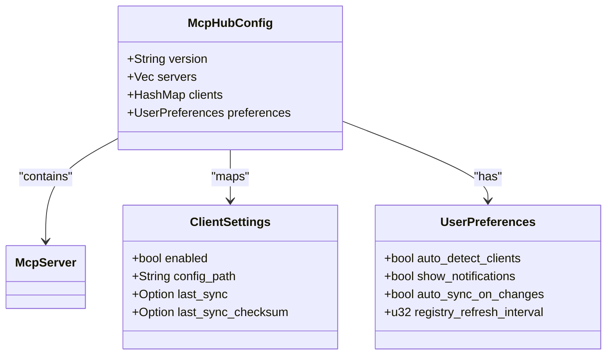
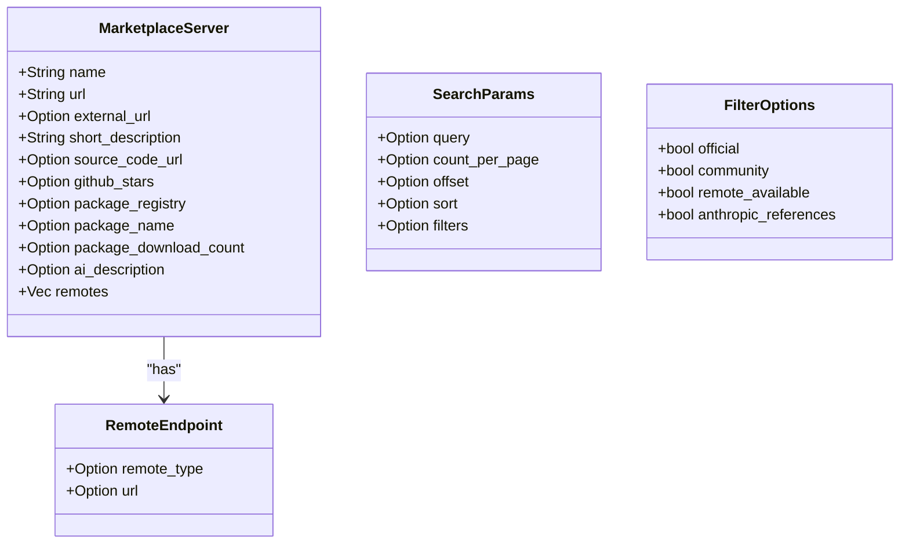
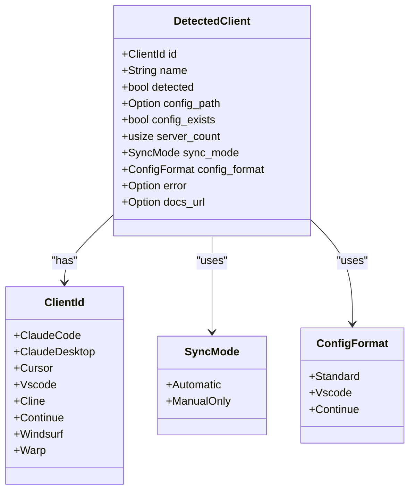
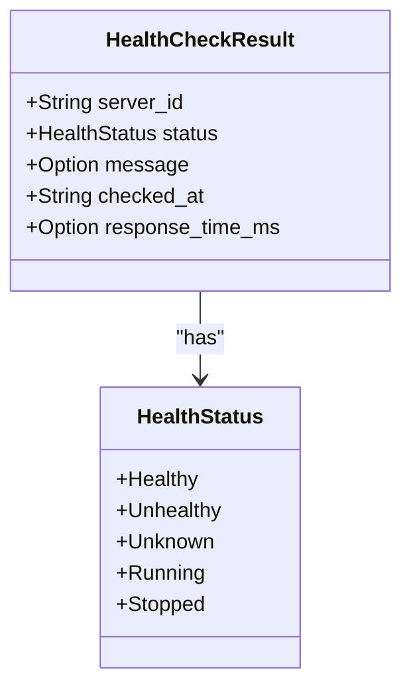
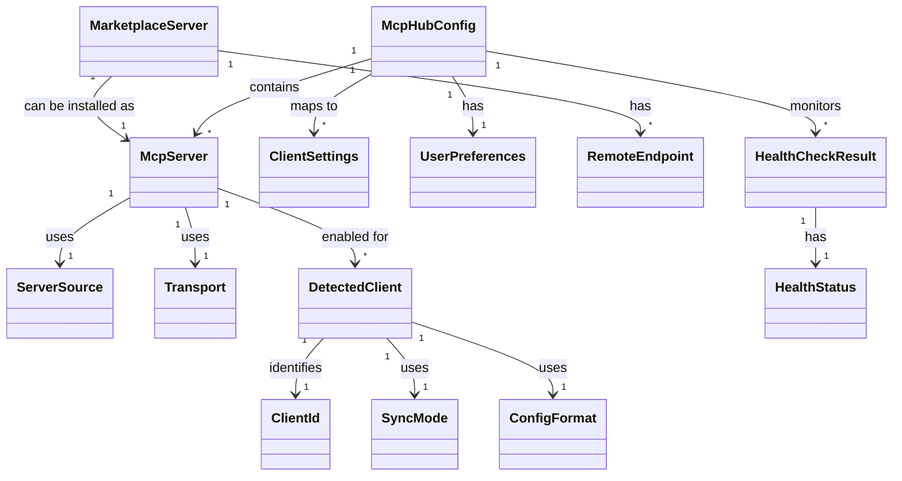
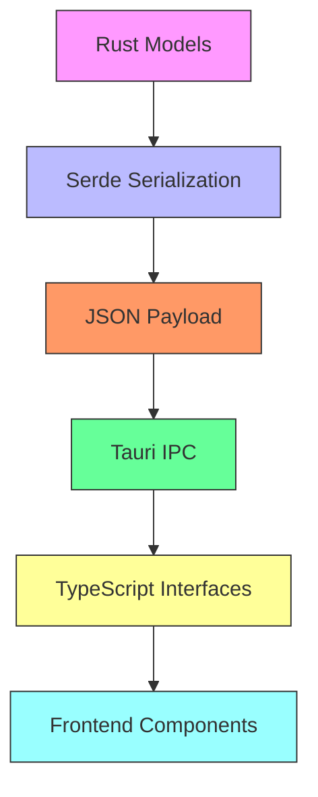

# Data Models

<cite>
**Referenced Files in This Document**   
- [server.rs](file://src-tauri/src/models/server.rs)
- [client.rs](file://src-tauri/src/models/client.rs)
- [config.rs](file://src-tauri/src/models/config.rs)
- [marketplace.rs](file://src-tauri/src/models/marketplace.rs)
- [health.rs](file://src-tauri/src/services/health.rs)
- [index.ts](file://src/types/index.ts)
</cite>

## Table of Contents

1. [Introduction](#introduction)
2. [Core Data Models](#core-data-models)
3. [Model Relationships](#model-relationships)
4. [Serialization and Type Safety](#serialization-and-type-safety)
5. [Schema Evolution and Compatibility](#schema-evolution-and-compatibility)
6. [Examples](#examples)
7. [Conclusion](#conclusion)

## Introduction

This document provides comprehensive documentation for the data models used in the MCP Nexus backend. The system is built around several core models that represent MCP servers, client configurations, marketplace data, and health status. These models are defined in Rust and shared with the frontend through Tauri's IPC system, ensuring type safety across the application. The models are designed with serde serialization attributes for JSON handling, and include validation logic and default values to ensure data integrity.

**Section sources**

- [server.rs](file://src-tauri/src/models/server.rs#L1-L233)
- [client.rs](file://src-tauri/src/models/client.rs#L1-L248)
- [config.rs](file://src-tauri/src/models/config.rs#L1-L249)
- [marketplace.rs](file://src-tauri/src/models/marketplace.rs#L1-L321)
- [health.rs](file://src-tauri/src/services/health.rs#L1-L207)

## Core Data Models

### McpServer Model

The `McpServer` model represents a managed MCP server with its source, version, and status information. It contains comprehensive metadata about the server configuration and installation details.

```mermaid
classDiagram
class McpServer {
+Uuid id
+String name
+Option<String> description
+ServerSource source
+Transport transport
+bool enabled
+Vec<String> enabled_clients
+String installed_at
+String updated_at
+Option<String> installed_version
+Option<String> source_url
+Vec<String> tags
}
class ServerSource {
+Npm{package : String, version : Option<String>}
+Uvx{package : String}
+Local{path : String}
+Docker{image : String}
+Remote{url : String}
+Github{repo : String, branch : Option<String>}
}
class Transport {
+Stdio{command : String, args : Vec<String>, env : HashMap<String, String>}
+Sse{url : String, headers : HashMap<String, String>}
}
McpServer --> ServerSource : "has"
McpServer --> Transport : "uses"
```

**Diagram sources**

- [server.rs](file://src-tauri/src/models/server.rs#L51-L85)

**Section sources**

- [server.rs](file://src-tauri/src/models/server.rs#L51-L85)
- [index.ts](file://src/types/index.ts#L37-L51)

### McpHubConfig Model

The `McpHubConfig` model represents the application-wide settings including sync preferences and paths. It serves as the central configuration hub that manages all servers and client settings.



**Diagram sources**

- [config.rs](file://src-tauri/src/models/config.rs#L60-L75)

**Section sources**

- [config.rs](file://src-tauri/src/models/config.rs#L60-L75)
- [index.ts](file://src/types/index.ts#L69-L75)

### MarketplaceServer Model

The `MarketplaceServer` model represents servers from the PulseMCP API with metadata and installation information. It contains comprehensive details about available servers in the marketplace.



**Diagram sources**

- [marketplace.rs](file://src-tauri/src/models/marketplace.rs#L15-L51)

**Section sources**

- [marketplace.rs](file://src-tauri/src/models/marketplace.rs#L15-L51)
- [index.ts](file://src/types/index.ts#L178-L202)

### DetectedClient Model

The `DetectedClient` model represents AI clients detected on the system with their configuration paths and sync status. It captures information about installed AI clients and their integration capabilities.



**Diagram sources**

- [client.rs](file://src-tauri/src/models/client.rs#L114-L138)

**Section sources**

- [client.rs](file://src-tauri/src/models/client.rs#L114-L138)
- [index.ts](file://src/types/index.ts#L83-L95)

### HealthCheckResult Model

The `HealthCheckResult` model represents the results of health checks with response times and status information. It provides detailed insights into server health and performance.



**Diagram sources**

- [health.rs](file://src-tauri/src/services/health.rs#L25-L34)

**Section sources**

- [health.rs](file://src-tauri/src/services/health.rs#L25-L34)
- [index.ts](file://src/types/index.ts#L419-L425)

## Model Relationships

The data models in MCP Nexus are interconnected through various relationships that enable the system to manage servers, clients, and configurations effectively.



**Diagram sources**

- [server.rs](file://src-tauri/src/models/server.rs#L51-L85)
- [config.rs](file://src-tauri/src/models/config.rs#L60-L75)
- [marketplace.rs](file://src-tauri/src/models/marketplace.rs#L15-L51)
- [client.rs](file://src-tauri/src/models/client.rs#L114-L138)
- [health.rs](file://src-tauri/src/services/health.rs#L25-L34)

**Section sources**

- [server.rs](file://src-tauri/src/models/server.rs#L51-L85)
- [config.rs](file://src-tauri/src/models/config.rs#L60-L75)
- [marketplace.rs](file://src-tauri/src/models/marketplace.rs#L15-L51)
- [client.rs](file://src-tauri/src/models/client.rs#L114-L138)
- [health.rs](file://src-tauri/src/services/health.rs#L25-L34)

## Serialization and Type Safety

The data models in MCP Nexus are designed with serde serialization attributes to ensure proper JSON handling and type safety across the application. The models are shared between the Rust backend and TypeScript frontend through Tauri's IPC system.

### Serde Attributes

The models use various serde attributes to control serialization behavior:

- **rename_all = "camelCase"**: Converts field names from snake_case to camelCase in JSON output
- **skip_serializing_if**: Omits fields when they have default or empty values
- **default**: Uses default values for fields when not specified
- **tag**: Implements tagged enums for polymorphic types

### Type Safety

The models are defined in Rust with strong typing and then mirrored in TypeScript to ensure type safety across the IPC boundary. The `index.ts` file contains TypeScript interfaces that match the Rust structs, enabling compile-time type checking in the frontend.



**Diagram sources**

- [server.rs](file://src-tauri/src/models/server.rs#L52-L53)
- [config.rs](file://src-tauri/src/models/config.rs#L28-L29)
- [marketplace.rs](file://src-tauri/src/models/marketplace.rs#L4-L5)
- [index.ts](file://src/types/index.ts#L1-L426)

**Section sources**

- [server.rs](file://src-tauri/src/models/server.rs#L52-L53)
- [config.rs](file://src-tauri/src/models/config.rs#L28-L29)
- [marketplace.rs](file://src-tauri/src/models/marketplace.rs#L4-L5)
- [index.ts](file://src/types/index.ts#L1-L426)

## Schema Evolution and Compatibility

The data models in MCP Nexus are designed with schema evolution and backward compatibility in mind. The system uses several strategies to ensure smooth upgrades and maintain compatibility across versions.

### Versioning Strategy

The `McpHubConfig` model includes a `version` field that tracks the configuration schema version. This allows the system to handle migrations when the schema changes:

```rust
pub struct McpHubConfig {
    pub version: String,  // e.g., "1.0"
    // ... other fields
}
```

When a new version of the application loads a configuration with an older version number, it can apply appropriate migration logic to update the schema.

### Backward Compatibility

The models use several techniques to maintain backward compatibility:

- **Optional fields**: New fields are added as `Option<T>` to avoid breaking existing data
- **Default values**: Fields have sensible defaults to handle missing data
- **Flexible enums**: Enum variants can be extended without breaking existing code
- **CamelCase conversion**: Field name conversion allows for consistent naming across languages

### Migration Example

When adding a new field to `McpServer`, the process would be:

1. Add the field as `Option<T>` with `skip_serializing_if`
2. Update the `version` field in `McpHubConfig`
3. Implement migration logic in the config manager
4. Ensure the TypeScript interface is updated

This approach ensures that older configurations continue to work while allowing for new features and improvements.

**Section sources**

- [config.rs](file://src-tauri/src/models/config.rs#L64-L65)
- [server.rs](file://src-tauri/src/models/server.rs#L60-L61)
- [config.rs](file://src-tauri/src/services/config_manager.rs#L129-L139)

## Examples

### McpServer JSON Example

```json
{
  "id": "a1b2c3d4-e5f6-7890-g1h2-i3j4k5l6m7n8",
  "name": "Filesystem Server",
  "description": "Access and manage local filesystem",
  "source": {
    "type": "npm",
    "package": "@modelcontextprotocol/server-filesystem",
    "version": "1.0.0"
  },
  "transport": {
    "type": "stdio",
    "command": "npx",
    "args": ["-y", "@modelcontextprotocol/server-filesystem"],
    "env": {}
  },
  "enabled": true,
  "enabledClients": ["claude-code", "cursor"],
  "installedAt": "2024-01-15T10:30:00Z",
  "updatedAt": "2024-01-15T10:30:00Z",
  "installedVersion": "1.0.0",
  "sourceUrl": "https://github.com/modelcontextprotocol/servers",
  "tags": ["filesystem", "local"]
}
```

### McpHubConfig JSON Example

```json
{
  "version": "1.0",
  "servers": [
    {
      "id": "a1b2c3d4-e5f6-7890-g1h2-i3j4k5l6m7n8",
      "name": "Filesystem Server",
      "source": {
        "type": "npm",
        "package": "@modelcontextprotocol/server-filesystem"
      },
      "transport": {
        "type": "stdio",
        "command": "npx",
        "args": ["-y", "@modelcontextprotocol/server-filesystem"]
      },
      "enabled": true,
      "enabledClients": ["claude-code"],
      "installedAt": "2024-01-15T10:30:00Z",
      "updatedAt": "2024-01-15T10:30:00Z",
      "tags": ["filesystem"]
    }
  ],
  "clients": {
    "claude-code": {
      "enabled": true,
      "configPath": "/Users/josh/.claude/config.json",
      "lastSync": "2024-01-15T10:35:00Z",
      "lastSyncChecksum": "a1b2c3d4"
    }
  },
  "preferences": {
    "autoDetectClients": true,
    "showNotifications": true,
    "autoSyncOnChanges": true,
    "registryRefreshInterval": 60
  }
}
```

### MarketplaceServer JSON Example

```json
{
  "name": "Filesystem",
  "url": "https://www.pulsemcp.com/servers/filesystem",
  "external_url": null,
  "short_description": "Access and manage local filesystem",
  "source_code_url": "https://github.com/modelcontextprotocol/servers",
  "github_stars": 1500,
  "package_registry": "npm",
  "package_name": "@modelcontextprotocol/server-filesystem",
  "package_download_count": 50000,
  "EXPERIMENTAL_ai_generated_description": "A server for filesystem operations",
  "remotes": []
}
```

### HealthCheckResult JSON Example

```json
{
  "serverId": "a1b2c3d4-e5f6-7890-g1h2-i3j4k5l6m7n8",
  "status": "healthy",
  "message": "HTTP 200",
  "checkedAt": "2024-01-15T10:31:00Z",
  "responseTimeMs": 45
}
```

**Section sources**

- [server.rs](file://src-tauri/src/models/server.rs#L190-L213)
- [config.rs](file://src-tauri/src/models/config.rs#L217-L226)
- [marketplace.rs](file://src-tauri/src/models/marketplace.rs#L213-L238)
- [health.rs](file://src-tauri/src/services/health.rs#L198-L204)

## Conclusion

The data models in MCP Nexus form a robust foundation for managing MCP servers, client configurations, and system health. The models are carefully designed with serde serialization attributes, default values, and validation logic to ensure data integrity and type safety. The relationship between models enables powerful features like server-to-client mappings and config-to-server dependencies. Through Tauri's IPC system, these models are shared across services and commands, maintaining type safety between the frontend and backend. The schema evolution strategies and backward compatibility considerations ensure that the system can grow and adapt over time while maintaining stability for users.
