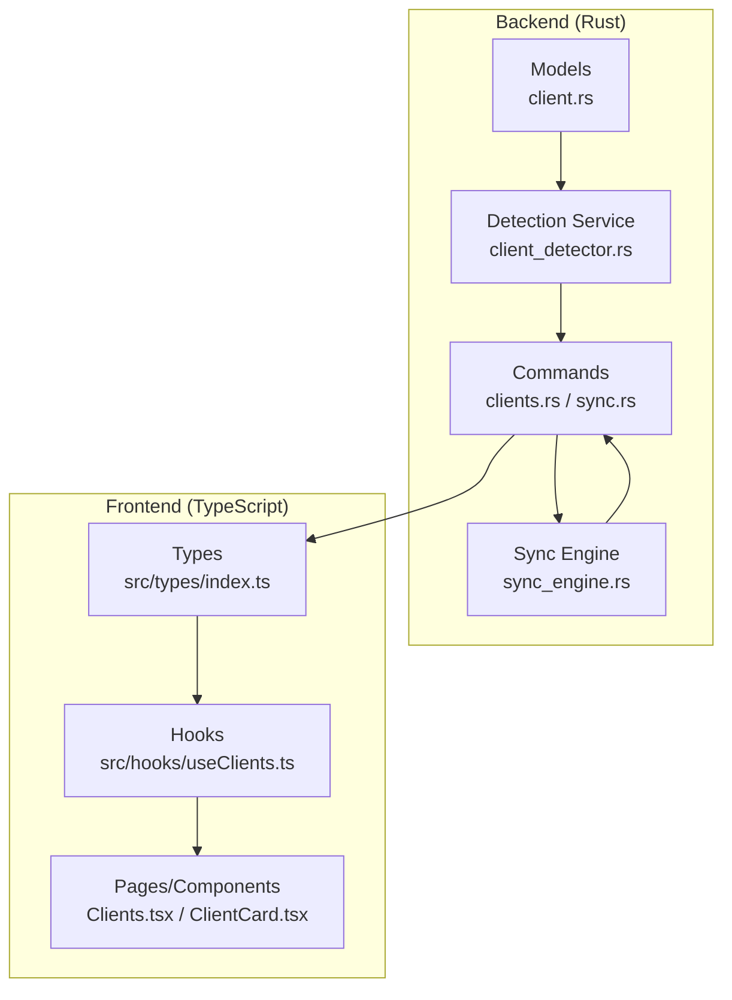
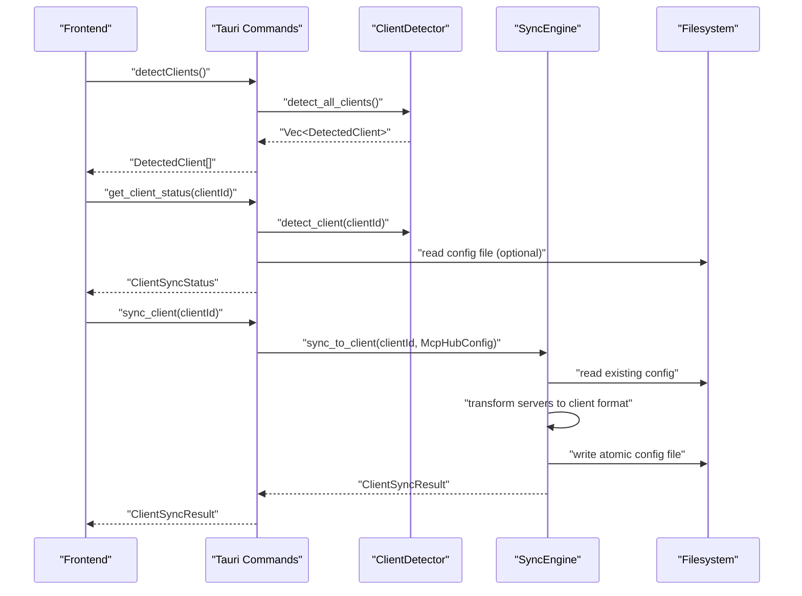
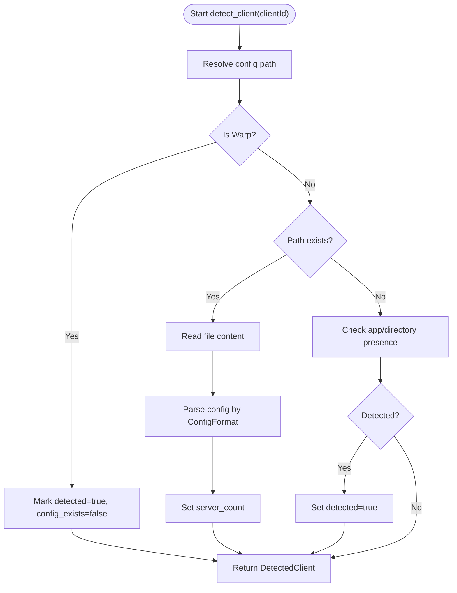
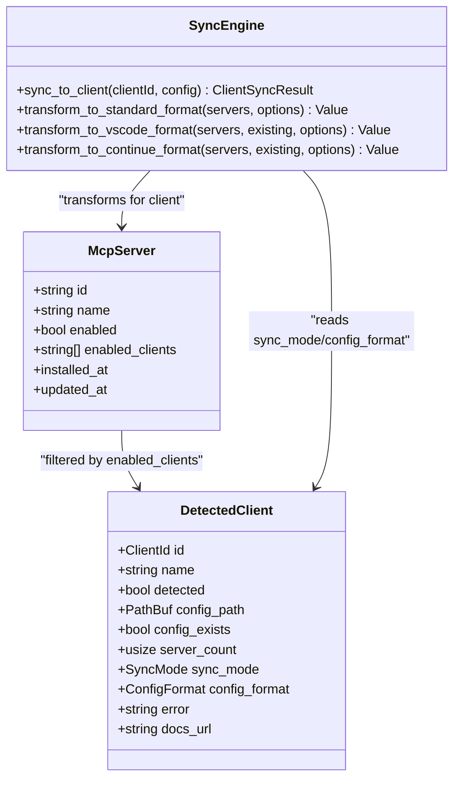
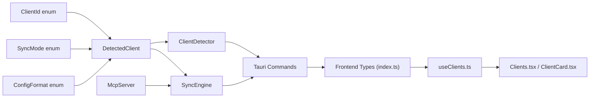

# DetectedClient Model

<cite>
**Referenced Files in This Document**
- [client.rs](file://src-tauri/src/models/client.rs)
- [client_detector.rs](file://src-tauri/src/services/client_detector.rs)
- [sync_engine.rs](file://src-tauri/src/services/sync_engine.rs)
- [clients.rs](file://src-tauri/src/commands/clients.rs)
- [sync.rs](file://src-tauri/src/commands/sync.rs)
- [index.ts](file://src/types/index.ts)
- [useClients.ts](file://src/hooks/useClients.ts)
- [Clients.tsx](file://src/pages/Clients.tsx)
- [ClientCard.tsx](file://src/components/clients/ClientCard.tsx)
</cite>

## Table of Contents

1. [Introduction](#introduction)
2. [Project Structure](#project-structure)
3. [Core Components](#core-components)
4. [Architecture Overview](#architecture-overview)
5. [Detailed Component Analysis](#detailed-component-analysis)
6. [Dependency Analysis](#dependency-analysis)
7. [Performance Considerations](#performance-considerations)
8. [Troubleshooting Guide](#troubleshooting-guide)
9. [Conclusion](#conclusion)

## Introduction

This document explains the DetectedClient data model that represents AI development environments detected on the user’s system. It covers the model’s fields, how ClientDetector populates it during system scans, how it enables client-specific configuration synchronization, and how Serde serialization supports persistence and IPC transfer to the frontend. It also describes validation logic for path integrity and version compatibility checks, and illustrates the relationship between DetectedClient and McpServer in the context of configuration file generation and deployment.

## Project Structure

DetectedClient lives in the backend Rust models and is surfaced to the frontend via Tauri commands and TypeScript types. The lifecycle spans detection, status computation, and synchronization.

**Diagram sources**

- [client.rs](file://src-tauri/src/models/client.rs#L114-L167)
- [client_detector.rs](file://src-tauri/src/services/client_detector.rs#L123-L216)
- [sync_engine.rs](file://src-tauri/src/services/sync_engine.rs#L318-L446)
- [clients.rs](file://src-tauri/src/commands/clients.rs#L1-L170)
- [sync.rs](file://src-tauri/src/commands/sync.rs#L71-L142)
- [index.ts](file://src/types/index.ts#L83-L96)
- [useClients.ts](file://src/hooks/useClients.ts#L1-L138)
- [Clients.tsx](file://src/pages/Clients.tsx#L156-L241)
- [ClientCard.tsx](file://src/components/clients/ClientCard.tsx#L154-L187)

**Section sources**

- [client.rs](file://src-tauri/src/models/client.rs#L114-L167)
- [client_detector.rs](file://src-tauri/src/services/client_detector.rs#L123-L216)
- [sync_engine.rs](file://src-tauri/src/services/sync_engine.rs#L318-L446)
- [clients.rs](file://src-tauri/src/commands/clients.rs#L1-L170)
- [sync.rs](file://src-tauri/src/commands/sync.rs#L71-L142)
- [index.ts](file://src/types/index.ts#L83-L96)
- [useClients.ts](file://src/hooks/useClients.ts#L1-L138)
- [Clients.tsx](file://src/pages/Clients.tsx#L156-L241)
- [ClientCard.tsx](file://src/components/clients/ClientCard.tsx#L154-L187)

## Core Components

- DetectedClient: The primary model representing a detected AI client, including identification, detection state, configuration path, existence, server count, sync mode, config format, and error/documentation metadata.
- ClientDetector: Scans the filesystem and applications to populate DetectedClient instances, including path resolution, file existence checks, and parsing of existing client configs.
- Sync Engine: Generates client-specific configuration files from the central McpHubConfig, writes them atomically, and records sync status.
- Commands: Expose detection, status, and sync operations to the frontend via Tauri.
- Frontend Types and Hooks: Define the TypeScript shape of DetectedClient and orchestrate detection and sync operations.

**Section sources**

- [client.rs](file://src-tauri/src/models/client.rs#L114-L167)
- [client_detector.rs](file://src-tauri/src/services/client_detector.rs#L123-L216)
- [sync_engine.rs](file://src-tauri/src/services/sync_engine.rs#L318-L446)
- [clients.rs](file://src-tauri/src/commands/clients.rs#L1-L170)
- [index.ts](file://src/types/index.ts#L83-L96)
- [useClients.ts](file://src/hooks/useClients.ts#L1-L138)

## Architecture Overview

DetectedClient bridges backend detection and frontend UX. The flow:

- Backend detects clients and parses their configs.
- Frontend invokes commands to fetch DetectedClient lists and statuses.
- Sync operations generate client-specific configuration files and update client settings.

**Diagram sources**

- [clients.rs](file://src-tauri/src/commands/clients.rs#L1-L170)
- [client_detector.rs](file://src-tauri/src/services/client_detector.rs#L123-L216)
- [sync_engine.rs](file://src-tauri/src/services/sync_engine.rs#L318-L446)
- [sync.rs](file://src-tauri/src/commands/sync.rs#L71-L142)

## Detailed Component Analysis

### DetectedClient Model Fields

- id: Client identifier enum (e.g., Claude Desktop, VS Code).
- name: Human-readable display name.
- detected: Whether the client was detected as installed.
- config_path: Optional path to the client’s MCP config file.
- config_exists: Whether the config file exists.
- server_count: Number of MCP servers currently configured in this client.
- sync_mode: Automatic vs ManualOnly.
- config_format: Standard, VS Code, or Continue format.
- error: Optional detection error message.
- docs_url: Optional documentation URL for manual configuration.

Serde serialization uses camelCase and kebab-case for enums to ensure cross-language compatibility.

**Section sources**

- [client.rs](file://src-tauri/src/models/client.rs#L114-L167)

### ClientDetector Population

ClientDetector populates DetectedClient by:

- Determining the config path for each client type.
- Checking file existence and parsing existing configs to count servers.
- Detecting clients without config files by checking application presence or directories.
- Recording errors encountered while reading or parsing configs.

**Diagram sources**

- [client_detector.rs](file://src-tauri/src/services/client_detector.rs#L123-L216)

**Section sources**

- [client_detector.rs](file://src-tauri/src/services/client_detector.rs#L23-L53)
- [client_detector.rs](file://src-tauri/src/services/client_detector.rs#L123-L216)

### Sync Mode and Config Format

- SyncMode: Automatic (file-based sync) vs ManualOnly (e.g., Warp).
- ConfigFormat: Standard, VS Code, or Continue. The sync engine transforms the central server list into the appropriate client-specific structure.

**Section sources**

- [client.rs](file://src-tauri/src/models/client.rs#L93-L113)
- [client.rs](file://src-tauri/src/models/client.rs#L114-L167)
- [sync_engine.rs](file://src-tauri/src/services/sync_engine.rs#L157-L221)

### IPC and Serialization

- Backend models use Serde to serialize/deserialize DetectedClient and related types.
- Frontend TypeScript mirrors the Rust shapes for seamless IPC.
- Commands return DetectedClient arrays and status objects to the UI.

**Section sources**

- [client.rs](file://src-tauri/src/models/client.rs#L114-L167)
- [index.ts](file://src/types/index.ts#L83-L96)
- [clients.rs](file://src-tauri/src/commands/clients.rs#L1-L170)

### Frontend Usage

- useClients.ts merges DetectedClient with ClientSyncStatus to enrich UI state.
- Clients.tsx and ClientCard.tsx render detected clients, their config paths, and sync status.

**Section sources**

- [useClients.ts](file://src/hooks/useClients.ts#L1-L138)
- [Clients.tsx](file://src/pages/Clients.tsx#L156-L241)
- [ClientCard.tsx](file://src/components/clients/ClientCard.tsx#L154-L187)

### Relationship Between DetectedClient and McpServer

- Central configuration (McpHubConfig) holds McpServer entries with enabled_clients lists.
- SyncEngine generates client-specific configuration files by filtering McpServer entries for a given client and transforming them into the appropriate format.
- After successful sync, client settings are updated with last_sync timestamps and checksums.

**Diagram sources**

- [client.rs](file://src-tauri/src/models/client.rs#L114-L167)
- [sync_engine.rs](file://src-tauri/src/services/sync_engine.rs#L157-L221)
- [sync_engine.rs](file://src-tauri/src/services/sync_engine.rs#L318-L446)

**Section sources**

- [sync_engine.rs](file://src-tauri/src/services/sync_engine.rs#L318-L446)
- [client.rs](file://src-tauri/src/models/client.rs#L114-L167)

### Example Clients and Their Configuration Paths

- Claude Desktop: Uses a platform-specific config path under the user’s home directory.
- VS Code: Uses a JSON file under the user’s home directory.
- Cursor, Continue, Cline, Windsurf, Warp: Each has a dedicated path determined by the detector.
- Warp is ManualOnly; the detector marks it as detected without a config file and provides a documentation URL.

**Section sources**

- [client_detector.rs](file://src-tauri/src/services/client_detector.rs#L23-L53)
- [client_detector.rs](file://src-tauri/src/services/client_detector.rs#L123-L216)
- [client.rs](file://src-tauri/src/models/client.rs#L140-L167)

### Validation Logic for Path Integrity and Compatibility

- Path resolution uses the user’s home directory; errors propagate as DetectedClient.error.
- Existing config parsing validates JSON and extracts server counts; failures are recorded in error.
- Atomic file writes ensure integrity; checksums are computed and stored to detect external modifications.
- Manual-only clients bypass file writes and return a generated manual configuration string.

**Section sources**

- [client_detector.rs](file://src-tauri/src/services/client_detector.rs#L123-L216)
- [sync_engine.rs](file://src-tauri/src/services/sync_engine.rs#L235-L305)
- [sync_engine.rs](file://src-tauri/src/services/sync_engine.rs#L307-L316)
- [sync.rs](file://src-tauri/src/commands/sync.rs#L71-L142)

### Configuration Generation and Deployment

- The sync engine reads existing client configs (when present) to preserve unrelated settings.
- It transforms McpServer entries into the target client’s format and writes atomically.
- On success, client settings are updated with the written path, timestamp, and checksum.

**Section sources**

- [sync_engine.rs](file://src-tauri/src/services/sync_engine.rs#L235-L305)
- [sync_engine.rs](file://src-tauri/src/services/sync_engine.rs#L388-L446)
- [sync.rs](file://src-tauri/src/commands/sync.rs#L71-L142)

## Dependency Analysis

- DetectedClient depends on ClientId, SyncMode, and ConfigFormat enums.
- ClientDetector depends on OS-specific home directory resolution and filesystem access.
- SyncEngine depends on DetectedClient to determine sync mode and format, and on McpServer to generate client configs.
- Commands depend on both ClientDetector and SyncEngine to expose detection and sync operations.
- Frontend types mirror backend models for IPC.

**Diagram sources**

- [client.rs](file://src-tauri/src/models/client.rs#L114-L167)
- [client_detector.rs](file://src-tauri/src/services/client_detector.rs#L123-L216)
- [sync_engine.rs](file://src-tauri/src/services/sync_engine.rs#L318-L446)
- [clients.rs](file://src-tauri/src/commands/clients.rs#L1-L170)
- [index.ts](file://src/types/index.ts#L83-L96)
- [useClients.ts](file://src/hooks/useClients.ts#L1-L138)
- [Clients.tsx](file://src/pages/Clients.tsx#L156-L241)
- [ClientCard.tsx](file://src/components/clients/ClientCard.tsx#L154-L187)

**Section sources**

- [client.rs](file://src-tauri/src/models/client.rs#L114-L167)
- [client_detector.rs](file://src-tauri/src/services/client_detector.rs#L123-L216)
- [sync_engine.rs](file://src-tauri/src/services/sync_engine.rs#L318-L446)
- [clients.rs](file://src-tauri/src/commands/clients.rs#L1-L170)
- [index.ts](file://src/types/index.ts#L83-L96)
- [useClients.ts](file://src/hooks/useClients.ts#L1-L138)
- [Clients.tsx](file://src/pages/Clients.tsx#L156-L241)
- [ClientCard.tsx](file://src/components/clients/ClientCard.tsx#L154-L187)

## Performance Considerations

- Detection performs minimal filesystem IO and JSON parsing; caching is handled at the config manager level.
- Sync writes use atomic rename to avoid partial writes and reduce conflicts.
- Frontend queries are cached with short staleness windows to balance freshness and performance.

## Troubleshooting Guide

Common issues and remedies:

- Detection errors: Inspect DetectedClient.error for read or parse failures; verify the resolved config path exists and is readable.
- External modification: If externallyModified is true, compare last_sync_checksum with the current file checksum to confirm divergence.
- Manual-only clients: For clients marked ManualOnly, use get_manual_config to obtain a formatted configuration string for manual paste.
- Permission problems: Ensure the config directory and files have appropriate permissions (user-only read/write).

**Section sources**

- [clients.rs](file://src-tauri/src/commands/clients.rs#L1-L170)
- [sync.rs](file://src-tauri/src/commands/sync.rs#L71-L142)
- [sync_engine.rs](file://src-tauri/src/services/sync_engine.rs#L235-L305)

## Conclusion

DetectedClient is the cornerstone of client detection and synchronization. It encapsulates detection state, configuration metadata, and sync behavior, enabling robust automatic and manual configuration workflows. Together with ClientDetector and SyncEngine, it ensures reliable configuration generation and deployment across supported AI clients, while Serde serialization and frontend types provide seamless IPC and a responsive UI.
