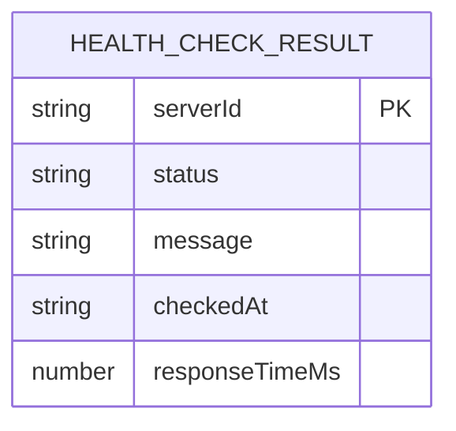
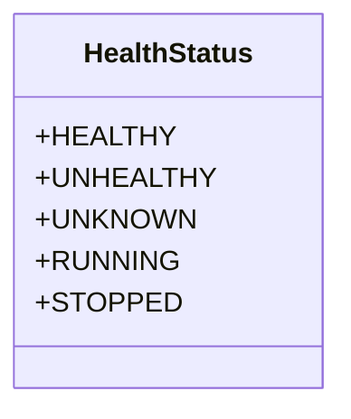
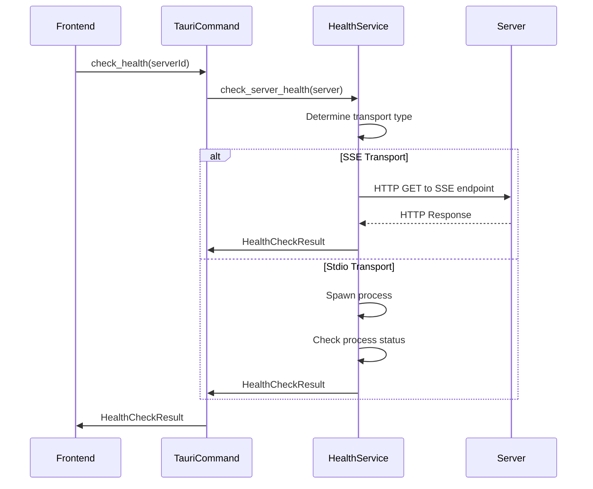
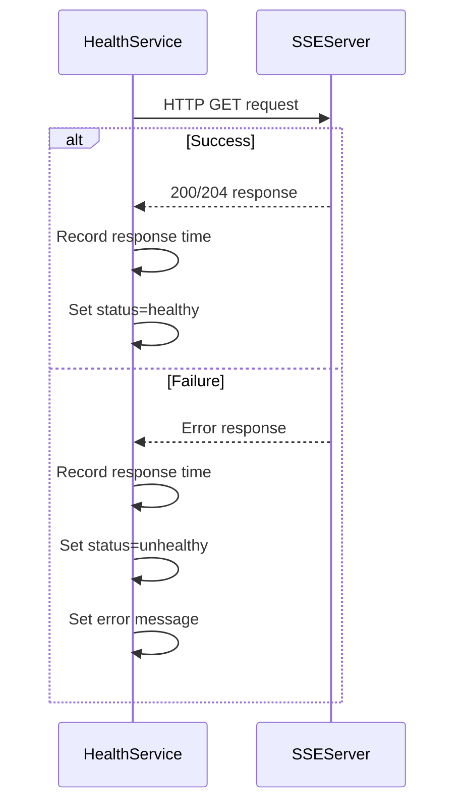
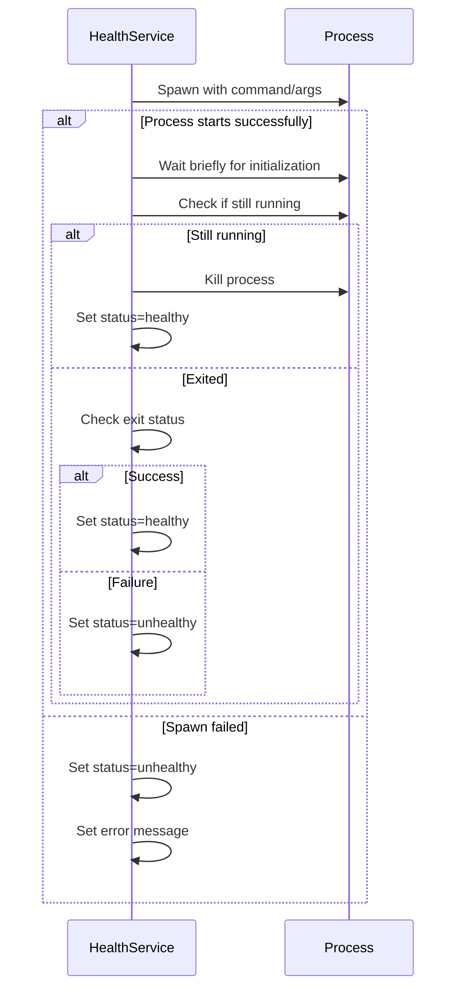
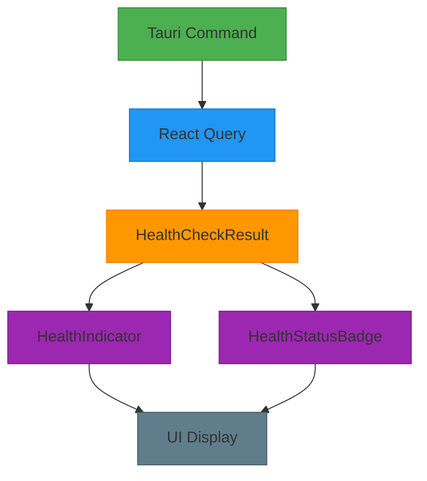
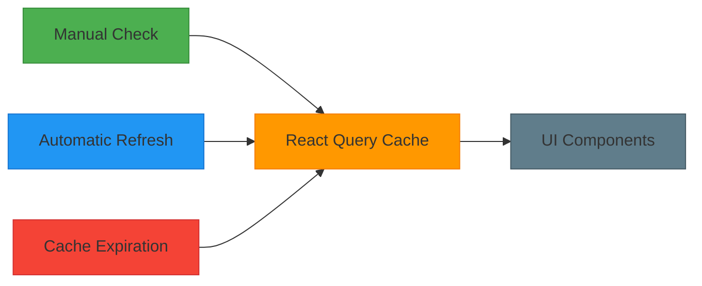
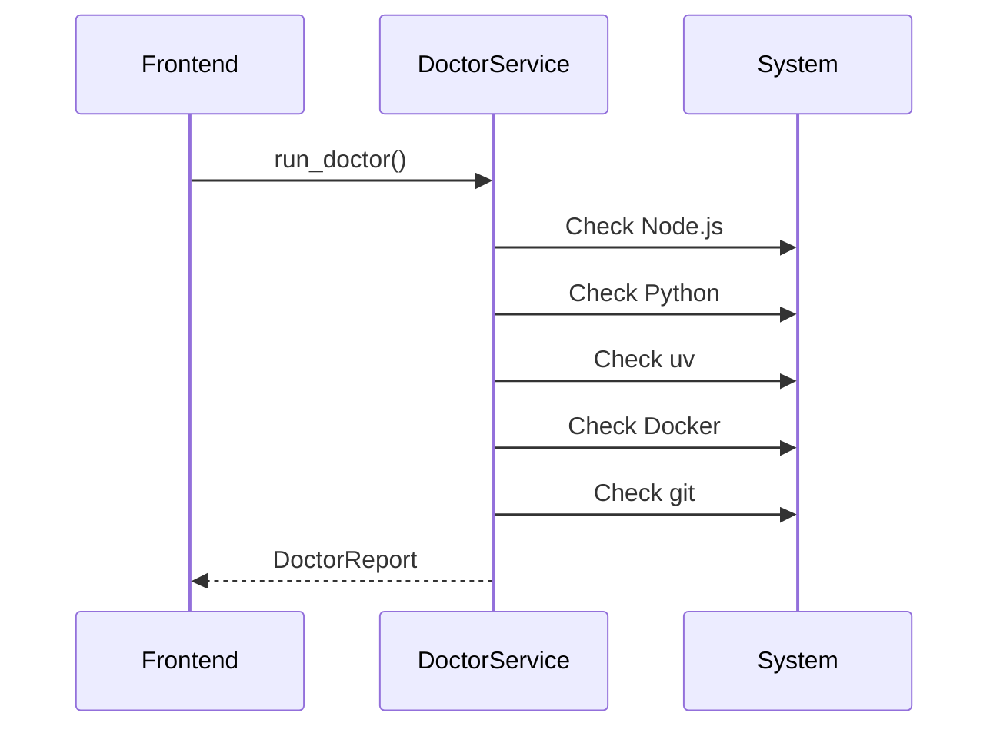

# HealthCheckResult Model

<cite>
**Referenced Files in This Document**   
- [health.rs](file://src-tauri/src/services/health.rs#L25-L34)
- [health.rs](file://src-tauri/src/commands/health.rs#L30-L50)
- [index.ts](file://src/types/index.ts#L419-L425)
- [useHealth.ts](file://src/hooks/useHealth.ts#L7-L25)
- [HealthIndicator.tsx](file://src/components/common/HealthIndicator.tsx#L11-L83)
- [doctor.rs](file://src-tauri/src/services/doctor.rs#L6-L105)
- [doctor.rs](file://src-tauri/src/commands/doctor.rs#L5-L8)
- [tauri.ts](file://src/lib/tauri.ts#L340-L363)
</cite>

## Table of Contents

1. [Introduction](#introduction)
2. [HealthCheckResult Data Structure](#healthcheckresult-data-structure)
3. [Health Status Enumeration](#health-status-enumeration)
4. [Health Check Implementation](#health-check-implementation)
5. [Protocol-Specific Health Checks](#protocol-specific-health-checks)
6. [Frontend Integration](#frontend-integration)
7. [Caching and Performance](#caching-and-performance)
8. [Doctor Service Integration](#doctor-service-integration)
9. [Troubleshooting Workflows](#troubleshooting-workflows)
10. [Example Payloads](#example-payloads)

## Introduction

The HealthCheckResult model serves as the central data structure for representing the outcomes of server health verification processes within the MCP Nexus application. This model captures the operational status of MCP (Model Context Protocol) servers, providing critical information for both user interface indicators and system diagnostics. The health check system is designed to verify server availability through protocol-specific mechanisms, supporting both stdio (standard input/output) and SSE (Server-Sent Events) transport types. This documentation details the structure, generation, and usage of the HealthCheckResult model, including its role in determining server operational status, integration with the Doctor service for comprehensive system diagnostics, and support for troubleshooting workflows.

## HealthCheckResult Data Structure

The HealthCheckResult model is a structured representation of a server's health status, containing essential fields that capture the outcome of health verification processes. This data structure is defined in both Rust (backend) and TypeScript (frontend) to ensure type safety across the application stack.



**Diagram sources**

- [health.rs](file://src-tauri/src/services/health.rs#L25-L34)
- [index.ts](file://src/types/index.ts#L419-L425)

**Section sources**

- [health.rs](file://src-tauri/src/services/health.rs#L25-L34)
- [index.ts](file://src/types/index.ts#L419-L425)

The HealthCheckResult structure consists of the following fields:

- **serverId**: A string identifier that uniquely identifies the server being checked. This field is populated with the server's UUID when the health check result is generated.
- **status**: An enumeration value representing the current health status of the server, with possible values including healthy, unhealthy, unknown, running, and stopped.
- **message**: An optional string field that provides additional context about the health check outcome, such as HTTP status codes for SSE servers or error messages when checks fail.
- **checkedAt**: A string timestamp in RFC 3339 format indicating when the health check was performed, enabling clients to determine the freshness of the health information.
- **responseTimeMs**: An optional number field that records the response time in milliseconds for successful health checks, providing performance metrics for healthy servers.

This model serves as the primary data transfer object between the backend health service and the frontend application, facilitating consistent health status reporting across the system.

## Health Status Enumeration

The HealthCheckResult model utilizes a comprehensive enumeration to represent the various states a server can be in, providing granular information about server health beyond a simple binary healthy/unhealthy distinction.



**Diagram sources**

- [health.rs](file://src-tauri/src/services/health.rs#L10-L23)
- [index.ts](file://src/types/index.ts#L411-L416)

**Section sources**

- [health.rs](file://src-tauri/src/services/health.rs#L10-L23)
- [index.ts](file://src/types/index.ts#L411-L416)

The HealthStatus enumeration includes five distinct states:

- **Healthy**: Indicates that the server is responding correctly to health check requests. For SSE servers, this means successful HTTP connectivity with appropriate status codes (200 or 204). For stdio servers, it indicates successful process spawning and initialization.
- **Unhealthy**: Signifies that the server failed its health check, either due to connection failures, non-successful HTTP status codes, or process execution errors.
- **Unknown**: Represents an indeterminate state, typically when a health check cannot be performed due to configuration issues or when a server has not yet been checked.
- **Running**: Indicates that a server process is currently active and operational, providing more specific information than simply being "healthy."
- **Stopped**: Denotes that a server is not currently running, which may be an expected state for servers that are disabled or not yet started.

This rich status model enables the user interface to provide more informative feedback to users, distinguishing between different types of operational states and failure modes.

## Health Check Implementation

The health check system is implemented as a service within the Tauri backend, providing both individual and batch health verification capabilities. The implementation follows a modular architecture with dedicated functions for different transport protocols and a unified interface for server health assessment.



**Diagram sources**

- [health.rs](file://src-tauri/src/services/health.rs#L180-L191)
- [health.rs](file://src-tauri/src/commands/health.rs#L30-L50)

**Section sources**

- [health.rs](file://src-tauri/src/services/health.rs#L180-L191)
- [health.rs](file://src-tauri/src/commands/health.rs#L30-L50)

The health check implementation consists of several key components:

1. **check_server_health**: The primary function that determines the appropriate health check method based on the server's transport type (stdio or SSE) and delegates to the protocol-specific implementation.
2. **check_sse_health**: Performs HTTP GET requests to SSE endpoints with configurable timeouts, evaluating response status codes to determine health status.
3. **check_stdio_health**: Attempts to spawn server processes using configured commands and arguments, checking process initialization and exit status to assess health.
4. **Tauri commands**: Expose the health check functionality to the frontend through the Tauri inter-process communication layer, with `check_health` for individual servers and `check_all_health` for batch operations.

The system employs a 10-second timeout for all health checks to prevent hanging operations and ensure responsive user interface updates.

## Protocol-Specific Health Checks

The HealthCheckResult model supports two distinct transport protocols—stdio and SSE—each with its own health verification methodology tailored to the characteristics of the communication mechanism.

### SSE Server Health Checks

For servers using Server-Sent Events (SSE) as their transport mechanism, health verification involves HTTP connectivity testing:



**Diagram sources**

- [health.rs](file://src-tauri/src/services/health.rs#L36-L92)

**Section sources**

- [health.rs](file://src-tauri/src/services/health.rs#L36-L92)

The SSE health check process:

- Creates an HTTP client with a configurable timeout
- Sends a GET request to the server's SSE endpoint
- Evaluates the HTTP response status code (200 or 204 indicates health)
- Records response time for performance monitoring
- Handles connection failures and network errors appropriately

### Stdio Server Health Checks

For servers using standard I/O (stdio) as their transport mechanism, health verification involves process execution testing:



**Diagram sources**

- [health.rs](file://src-tauri/src/services/health.rs#L94-L178)

**Section sources**

- [health.rs](file://src-tauri/src/services/health.rs#L94-L178)

The stdio health check process:

- Attempts to spawn a process using the server's configured command and arguments
- Allows a brief initialization period (500ms) for the process to start
- Checks whether the process is still running after initialization
- For running processes (expected for servers), kills the process after verification
- For processes that have already exited, evaluates the exit status
- Handles process spawning failures and execution errors

This dual-protocol approach ensures that the HealthCheckResult model can accurately represent the health status of servers regardless of their communication mechanism.

## Frontend Integration

The HealthCheckResult model is seamlessly integrated into the frontend application through React hooks and UI components that consume and display health information.



**Diagram sources**

- [useHealth.ts](file://src/hooks/useHealth.ts#L7-L25)
- [HealthIndicator.tsx](file://src/components/common/HealthIndicator.tsx#L11-L83)

**Section sources**

- [useHealth.ts](file://src/hooks/useHealth.ts#L7-L25)
- [HealthIndicator.tsx](file://src/components/common/HealthIndicator.tsx#L11-L83)

The frontend integration includes:

- **React hooks**: Custom hooks like `useServerHealth` and `useAllServerHealth` that leverage React Query to manage health check data, providing automatic caching, refetching, and state management.
- **UI components**: Reusable components such as `HealthIndicator` and `HealthStatusBadge` that visually represent health status using color-coded badges and informative tooltips.
- **Tauri bindings**: TypeScript definitions and invocation functions that provide type-safe access to the backend health check commands.
- **Automatic refresh**: Configuration of stale times and refetch intervals to ensure health information remains current without excessive server polling.

The integration uses React Query's mutation and query invalidation features to ensure that manual health checks update the cache and trigger UI refreshes across relevant components.

## Caching and Performance

The health check system incorporates caching mechanisms at multiple levels to optimize performance and reduce unnecessary server load.



**Diagram sources**

- [useHealth.ts](file://src/hooks/useHealth.ts#L12-L13)
- [useHealth.ts](file://src/hooks/useHealth.ts#L44-L47)

**Section sources**

- [useHealth.ts](file://src/hooks/useHealth.ts#L12-L13)
- [useHealth.ts](file://src/hooks/useHealth.ts#L44-L47)

The caching strategy includes:

- **Client-side caching**: React Query maintains a cache of health check results with configurable staleness thresholds (30 seconds for health data, 10 seconds for status data).
- **Automatic refetching**: Health information is automatically refreshed at regular intervals (every 60 seconds) to ensure users have current information without manual intervention.
- **Cache updates**: When a manual health check is performed, the result is written directly to the cache, and related queries are invalidated to trigger updates across the application.
- **Batch operations**: The `check_all_health` command allows efficient retrieval of health status for all servers in a single operation, reducing the overhead of multiple individual requests.

This caching approach balances the need for up-to-date health information with performance considerations, minimizing network traffic and backend processing while maintaining a responsive user experience.

## Doctor Service Integration

The HealthCheckResult model is complemented by the Doctor service, which provides comprehensive system diagnostics to identify potential issues that could affect server health and operation.



**Diagram sources**

- [doctor.rs](file://src-tauri/src/services/doctor.rs#L6-L53)
- [doctor.rs](file://src-tauri/src/commands/doctor.rs#L5-L8)

**Section sources**

- [doctor.rs](file://src-tauri/src/services/doctor.rs#L6-L53)
- [doctor.rs](file://src-tauri/src/commands/doctor.rs#L5-L8)

The Doctor service performs environmental checks to verify the presence of required runtime dependencies:

- **Node.js detection**: Checks for Node.js installation, with special handling for nvm-managed installations and common installation paths.
- **Python detection**: Verifies Python 3.x availability, trying both `python3` and `python` commands.
- **uv detection**: Checks for the uv package manager, recommended for Python package management.
- **Docker detection**: Verifies Docker installation, required for Docker-based servers.
- **git detection**: Confirms git availability, necessary for installing servers from GitHub repositories.

The Doctor service returns a comprehensive report that includes version information for detected runtimes and a list of issues with severity levels and suggested resolutions. This information helps users proactively address potential problems before they affect server health, serving as a preventative maintenance tool that complements the reactive nature of the HealthCheckResult model.

## Troubleshooting Workflows

The HealthCheckResult model supports comprehensive troubleshooting workflows by providing detailed diagnostic information that helps users identify and resolve server connectivity issues.

When a server is reported as unhealthy, the system provides multiple layers of diagnostic information:

1. **Immediate feedback**: The HealthCheckResult message field contains specific error details, such as HTTP error codes for SSE servers or process execution errors for stdio servers.
2. **Environmental context**: The Doctor service can identify missing or misconfigured runtime dependencies that might be causing health check failures.
3. **Temporal analysis**: The checkedAt timestamp allows users to correlate health status changes with recent configuration changes or system events.
4. **Performance metrics**: The responseTimeMs field helps identify servers that are technically reachable but experiencing performance issues.

The troubleshooting process typically follows this workflow:

- A user notices a server with an unhealthy status indicator
- They examine the detailed error message from the HealthCheckResult
- If the cause is not immediately apparent, they run the Doctor service to check for environmental issues
- Based on the combined information, they take corrective action (e.g., installing missing dependencies, correcting configuration errors)
- They manually trigger a new health check to verify the resolution

This integrated approach to health monitoring and diagnostics enables users to efficiently resolve server connectivity issues and maintain a stable MCP server environment.

## Example Payloads

The following examples illustrate typical HealthCheckResult payloads as they flow from the backend to the frontend through Tauri commands.

### Successful SSE Server Check

```json
{
  "serverId": "a1b2c3d4-e5f6-7890-g1h2-i3j4k5l6m7n8",
  "status": "healthy",
  "message": "HTTP 200",
  "checkedAt": "2024-01-15T10:30:45.123Z",
  "responseTimeMs": 156
}
```

### Failed SSE Server Check

```json
{
  "serverId": "a1b2c3d4-e5f6-7890-g1h2-i3j4k5l6m7n8",
  "status": "unhealthy",
  "message": "Connection failed: error sending request for url (https://api.example.com/mcp/sse): connection closed before message completed",
  "checkedAt": "2024-01-15T10:31:20.456Z",
  "responseTimeMs": 5000
}
```

### Successful Stdio Server Check

```json
{
  "serverId": "b2c3d4e5-f6g7-8901-h2i3-j4k5l6m7n8o9",
  "status": "healthy",
  "message": "Server process started successfully",
  "checkedAt": "2024-01-15T10:32:10.789Z",
  "responseTimeMs": 892
}
```

### Failed Stdio Server Check

```json
{
  "serverId": "b2c3d4e5-f6g7-8901-h2i3-j4k5l6m7n8o9",
  "status": "unhealthy",
  "message": "Failed to spawn process: No such file or directory (os error 2)",
  "checkedAt": "2024-01-15T10:33:05.234Z",
  "responseTimeMs": 12
}
```

### Unknown Status

```json
{
  "serverId": "c3d4e5f6-g7h8-9012-i3j4-k5l6m7n8o9p0",
  "status": "unknown",
  "message": "Failed to create HTTP client: builder error: invalid header value",
  "checkedAt": "2024-01-15T10:34:18.567Z",
  "responseTimeMs": null
}
```

These example payloads demonstrate the consistent structure of the HealthCheckResult model across different scenarios, showing how the same data structure can convey both successful operations and detailed error information to support effective troubleshooting.
