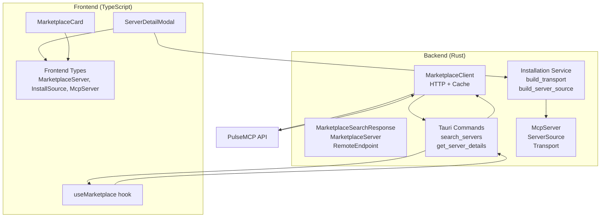
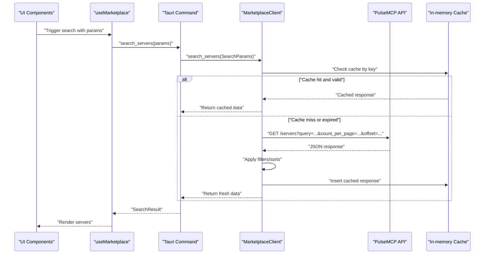
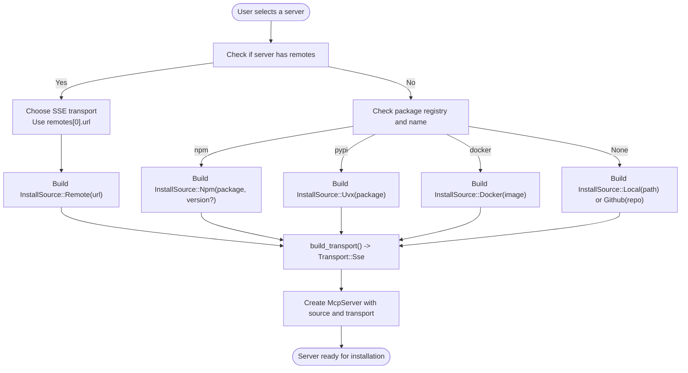
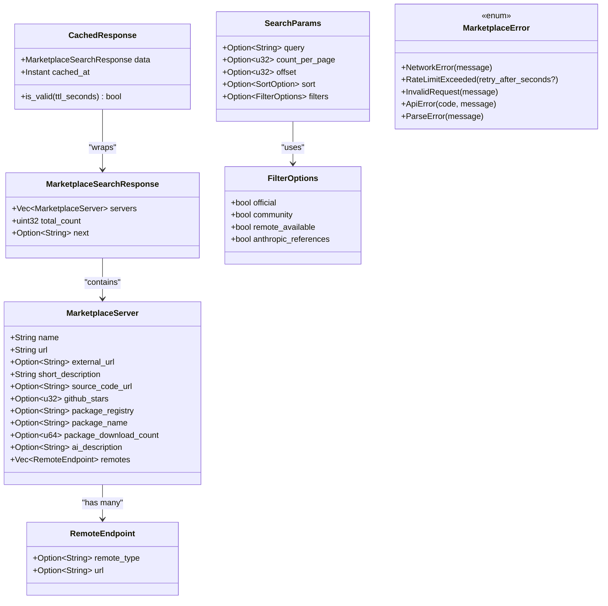
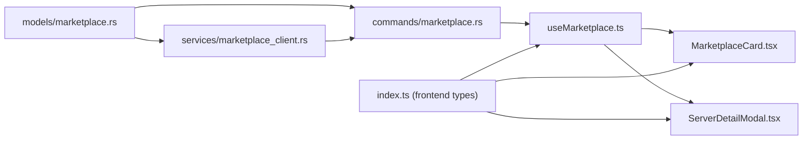

# MarketplaceServer Model

<cite>
**Referenced Files in This Document**
- [marketplace.rs](file://src-tauri/src/models/marketplace.rs)
- [marketplace_client.rs](file://src-tauri/src/services/marketplace_client.rs)
- [marketplace.rs (commands)](file://src-tauri/src/commands/marketplace.rs)
- [server.rs](file://src-tauri/src/models/server.rs)
- [installation.rs](file://src-tauri/src/services/installation.rs)
- [useMarketplace.ts](file://src/hooks/useMarketplace.ts)
- [MarketplaceCard.tsx](file://src/components/marketplace/MarketplaceCard.tsx)
- [ServerDetailModal.tsx](file://src/components/marketplace/ServerDetailModal.tsx)
- [index.ts (frontend types)](file://src/types/index.ts)
</cite>

## Table of Contents

1. [Introduction](#introduction)
2. [Project Structure](#project-structure)
3. [Core Components](#core-components)
4. [Architecture Overview](#architecture-overview)
5. [Detailed Component Analysis](#detailed-component-analysis)
6. [Dependency Analysis](#dependency-analysis)
7. [Performance Considerations](#performance-considerations)
8. [Troubleshooting Guide](#troubleshooting-guide)
9. [Conclusion](#conclusion)
10. [Appendices](#appendices)

## Introduction

This document describes the MarketplaceServer data model that represents servers available for installation via the PulseMCP API. It explains how the Rust model maps to the upstream API response, how Serde attributes control deserialization (including optional fields and nested version information), and how the model participates in the marketplace browsing and installation workflow. It also documents relationships with the McpServer model during installation, caching strategies, schema evolution considerations, and error handling for malformed responses.

## Project Structure

The MarketplaceServer model lives in the Tauri backend under the models and services modules, and is consumed by frontend components and hooks. The key files are:

- Backend models and API response types
- Backend service that fetches and caches results
- Backend commands that expose marketplace operations to the frontend
- Frontend hooks and components that render and act on marketplace data
- Frontend TypeScript types that mirror backend models for UI

**Diagram sources**

- [marketplace.rs](file://src-tauri/src/models/marketplace.rs#L1-L120)
- [marketplace_client.rs](file://src-tauri/src/services/marketplace_client.rs#L1-L120)
- [marketplace.rs (commands)](file://src-tauri/src/commands/marketplace.rs#L1-L120)
- [server.rs](file://src-tauri/src/models/server.rs#L1-L120)
- [installation.rs](file://src-tauri/src/services/installation.rs#L334-L477)
- [index.ts (frontend types)](file://src/types/index.ts#L170-L202)

**Section sources**

- [marketplace.rs](file://src-tauri/src/models/marketplace.rs#L1-L120)
- [marketplace_client.rs](file://src-tauri/src/services/marketplace_client.rs#L1-L120)
- [marketplace.rs (commands)](file://src-tauri/src/commands/marketplace.rs#L1-L120)
- [index.ts (frontend types)](file://src/types/index.ts#L170-L202)

## Core Components

- MarketplaceSearchResponse: Wraps a list of servers, total count, and optional next page URL.
- MarketplaceServer: The primary model representing a server entry from the PulseMCP API, including display name, URLs, optional metadata (external site, source code, GitHub stars), registry info (registry, package name, download count), AI-generated description, and remote endpoints.
- RemoteEndpoint: Nested structure for SSE-based servers with optional type and URL.
- SearchParams and FilterOptions: Parameters and filters used to query the API and client-side filter/sort logic.
- CachedResponse: In-memory cache entry with TTL.
- MarketplaceError: Unified error type covering network, rate limit, invalid request, API error, and parse error.

These components collectively define how the application fetches, caches, filters, sorts, and renders marketplace entries.

**Section sources**

- [marketplace.rs](file://src-tauri/src/models/marketplace.rs#L1-L120)
- [marketplace.rs](file://src-tauri/src/models/marketplace.rs#L148-L207)

## Architecture Overview

The marketplace workflow spans backend and frontend:

- Frontend calls Tauri commands to search servers.
- Backend composes a request to the PulseMCP API, applies client-side filters/sorts, caches results, and returns a normalized response.
- Frontend renders cards and details, and uses the model to drive installation decisions (e.g., transport mode selection).

**Diagram sources**

- [marketplace_client.rs](file://src-tauri/src/services/marketplace_client.rs#L74-L200)
- [marketplace.rs (commands)](file://src-tauri/src/commands/marketplace.rs#L127-L178)
- [useMarketplace.ts](file://src/hooks/useMarketplace.ts#L1-L81)

## Detailed Component Analysis

### MarketplaceServer Model and Serde Attributes

- Fields:
  - name: Display name of the server.
  - url: Directory URL for the server.
  - external_url: Optional external website/docs link.
  - short_description: Brief description.
  - source_code_url: Optional repository URL.
  - github_stars: Optional GitHub star count.
  - package_registry: Optional registry (e.g., npm, pypi).
  - package_name: Optional package name in the registry.
  - package_download_count: Optional download count.
  - ai_description: Optional AI-generated description (renamed from upstream experimental field).
  - remotes: Optional list of remote endpoints for SSE-based servers.

- Serde behavior:
  - Optional fields use skip_serializing_if with Option::is_none to omit nulls in serialization.
  - ai_description uses rename to map the upstream experimental field name.
  - remotes uses default and skip_serializing_if with Vec::is_empty to omit empty arrays.

- Example API mapping:
  - The model maps directly to the PulseMCP /servers response shape, including servers array, total_count, and optional next page URL. Individual server entries populate MarketplaceServer fields, including optional metadata and remotes.

- Schema evolution:
  - The model includes an experimental AI description field mapped via rename. This allows the application to consume new upstream fields without breaking existing consumers while maintaining backward compatibility.

**Section sources**

- [marketplace.rs](file://src-tauri/src/models/marketplace.rs#L15-L63)
- [marketplace.rs](file://src-tauri/src/models/marketplace.rs#L208-L321)

### API Fetching, Caching, and Filtering

- SearchParams and FilterOptions:
  - SearchParams controls query, count_per_page, offset, sort, and filters.
  - FilterOptions supports official/community/remote availability toggles.
  - Client-side filtering and sorting are applied after parsing the API response.

- Cache strategy:
  - In-memory cache keyed by query, page size, and offset.
  - Default TTL of 5 minutes; cache validity checked per entry.
  - On rate limit or non-success responses, the client attempts to return stale cached data if available.

- Error handling:
  - Distinct error variants for network failures, rate limits, invalid requests, API errors, and parse errors.
  - Tauri commands convert backend errors to a frontend-friendly error shape.

**Section sources**

- [marketplace_client.rs](file://src-tauri/src/services/marketplace_client.rs#L1-L120)
- [marketplace_client.rs](file://src-tauri/src/services/marketplace_client.rs#L120-L200)
- [marketplace_client.rs](file://src-tauri/src/services/marketplace_client.rs#L200-L280)
- [marketplace.rs (commands)](file://src-tauri/src/commands/marketplace.rs#L1-L70)
- [marketplace.rs (commands)](file://src-tauri/src/commands/marketplace.rs#L1-L56)

### Frontend Integration and Rendering

- useMarketplace hook:
  - Uses React Query to fetch paginated results, flatten pages, and expose loading/error states.
  - StaleTime aligns with backend cache TTL.

- MarketplaceCard:
  - Renders server name, badges for remote and registry, description fallback to AI description, and stats (stars, downloads, package name).

- ServerDetailModal:
  - Provides transport mode selection (stdio vs SSE), SSE URL input, client selection, and install command preview based on registry.
  - Uses server metadata to guide UI behavior (e.g., whether to show SSE URL input).

**Section sources**

- [useMarketplace.ts](file://src/hooks/useMarketplace.ts#L1-L81)
- [MarketplaceCard.tsx](file://src/components/marketplace/MarketplaceCard.tsx#L1-L136)
- [ServerDetailModal.tsx](file://src/components/marketplace/ServerDetailModal.tsx#L1-L120)
- [ServerDetailModal.tsx](file://src/components/marketplace/ServerDetailModal.tsx#L120-L220)
- [ServerDetailModal.tsx](file://src/components/marketplace/ServerDetailModal.tsx#L220-L320)
- [ServerDetailModal.tsx](file://src/components/marketplace/ServerDetailModal.tsx#L320-L591)
- [index.ts (frontend types)](file://src/types/index.ts#L170-L202)

### Relationship with McpServer During Installation

- Transformation logic:
  - The installation service builds an InstallSource from the MarketplaceServer’s registry/package metadata and remote endpoints.
  - It then constructs Transport and ServerSource for the resulting McpServer.
  - For SSE-based servers, the modal initializes the SSE URL from the server’s remotes; the installation service converts this into an SSE transport.

- McpServer fields populated from MarketplaceServer:
  - name, description (optional), source_url (optional), tags (empty by default).
  - Transport is either stdio (for local registries) or SSE (for remote endpoints).
  - ServerSource mirrors the chosen install path (npm, uvx, local, docker, github, remote).

**Diagram sources**

- [ServerDetailModal.tsx](file://src/components/marketplace/ServerDetailModal.tsx#L1-L120)
- [installation.rs](file://src-tauri/src/services/installation.rs#L334-L477)
- [server.rs](file://src-tauri/src/models/server.rs#L1-L120)

**Section sources**

- [installation.rs](file://src-tauri/src/services/installation.rs#L334-L477)
- [server.rs](file://src-tauri/src/models/server.rs#L1-L120)
- [ServerDetailModal.tsx](file://src/components/marketplace/ServerDetailModal.tsx#L1-L120)

### Class Model Diagram

**Diagram sources**

- [marketplace.rs](file://src-tauri/src/models/marketplace.rs#L1-L120)
- [marketplace.rs](file://src-tauri/src/models/marketplace.rs#L148-L207)

## Dependency Analysis

- Backend dependencies:
  - models/marketplace.rs defines the core data structures and error types.
  - services/marketplace_client.rs depends on models and uses reqwest for HTTP, tokio for async, and std collections for caching.
  - commands/marketplace.rs depends on models and services to expose Tauri commands and translate frontend params to backend SearchParams.

- Frontend dependencies:
  - useMarketplace.ts consumes Tauri commands and React Query.
  - MarketplaceCard.tsx and ServerDetailModal.tsx depend on frontend types and UI libraries.
  - index.ts defines TypeScript interfaces mirroring backend models for type safety.

**Diagram sources**

- [marketplace.rs](file://src-tauri/src/models/marketplace.rs#L1-L120)
- [marketplace_client.rs](file://src-tauri/src/services/marketplace_client.rs#L1-L120)
- [marketplace.rs (commands)](file://src-tauri/src/commands/marketplace.rs#L1-L120)
- [useMarketplace.ts](file://src/hooks/useMarketplace.ts#L1-L81)
- [MarketplaceCard.tsx](file://src/components/marketplace/MarketplaceCard.tsx#L1-L136)
- [ServerDetailModal.tsx](file://src/components/marketplace/ServerDetailModal.tsx#L1-L120)
- [index.ts (frontend types)](file://src/types/index.ts#L170-L202)

**Section sources**

- [marketplace_client.rs](file://src-tauri/src/services/marketplace_client.rs#L1-L120)
- [marketplace.rs (commands)](file://src-tauri/src/commands/marketplace.rs#L1-L120)
- [index.ts (frontend types)](file://src/types/index.ts#L170-L202)

## Performance Considerations

- Caching:
  - Default 5-minute TTL balances freshness and performance.
  - Cache key includes query, page size, and offset to prevent collisions.
  - On rate limit or non-success responses, stale cache is returned when available to reduce retries.

- Pagination:
  - count_per_page is capped at 5000 to respect API limits.
  - Frontend uses infinite scrolling with a staleTime aligned to backend TTL.

- Client-side filtering/sorting:
  - Applied after parsing to minimize unnecessary network calls.
  - Sorting by GitHub stars proxies popularity when requested.

[No sources needed since this section provides general guidance]

## Troubleshooting Guide

- Network errors:
  - Occur when the HTTP client fails to reach the API. The command maps these to a frontend error with type "network".

- Rate limit exceeded:
  - The client checks for a retry-after header and returns a structured error. If stale cache is available, it may still be returned.

- Invalid request:
  - Bad request responses are captured and surfaced with the API-provided message.

- API errors:
  - Non-success HTTP statuses return a structured error with the status code and body text.

- Parse errors:
  - JSON parsing failures are caught and reported as parse errors.

- UI-level issues:
  - useMarketplace exposes loading and error states; ServerDetailModal disables install actions when required fields are missing (e.g., SSE URL for SSE servers).

**Section sources**

- [marketplace_client.rs](file://src-tauri/src/services/marketplace_client.rs#L120-L200)
- [marketplace.rs (commands)](file://src-tauri/src/commands/marketplace.rs#L1-L56)
- [ServerDetailModal.tsx](file://src/components/marketplace/ServerDetailModal.tsx#L1-L120)

## Conclusion

The MarketplaceServer model provides a robust, serde-driven representation of PulseMCP API responses, enabling flexible rendering and installation workflows. Its optional fields and nested remote endpoints accommodate diverse server types, while client-side caching, filtering, and sorting improve performance and UX. The transformation to McpServer during installation cleanly maps registry and remote metadata into transport and source configurations, ensuring a smooth path from browsing to deployment.

## Appendices

### API Response Mapping Examples

- Full search response:
  - servers: array of MarketplaceServer entries
  - total_count: integer
  - next: optional URL string

- Individual server entry:
  - name, url, external_url?, short_description, source_code_url?, github_stars?, package_registry?, package_name?, package_download_count?, ai_description?, remotes[]

- Example mapping:
  - The model tests demonstrate parsing a server with optional fields and remotes, verifying that fields are correctly populated and optional fields are omitted when null.

**Section sources**

- [marketplace.rs](file://src-tauri/src/models/marketplace.rs#L208-L321)
