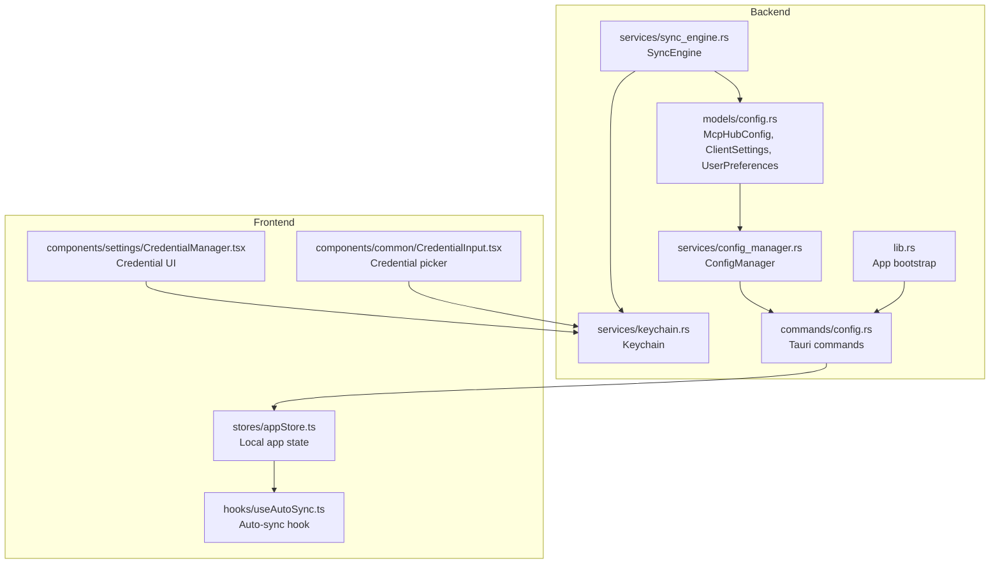
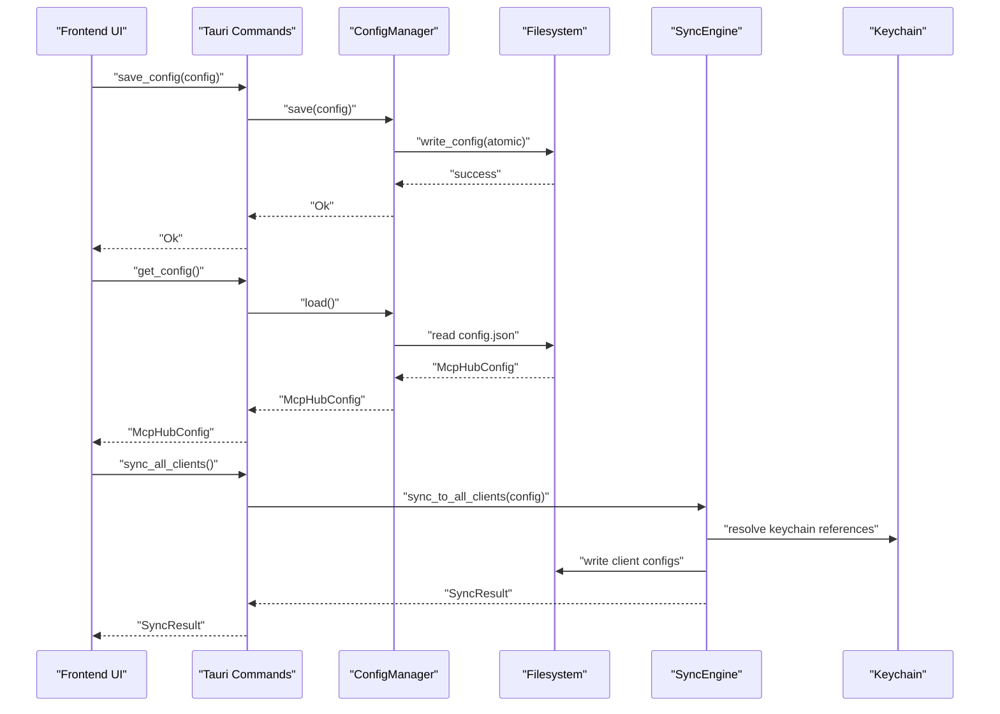
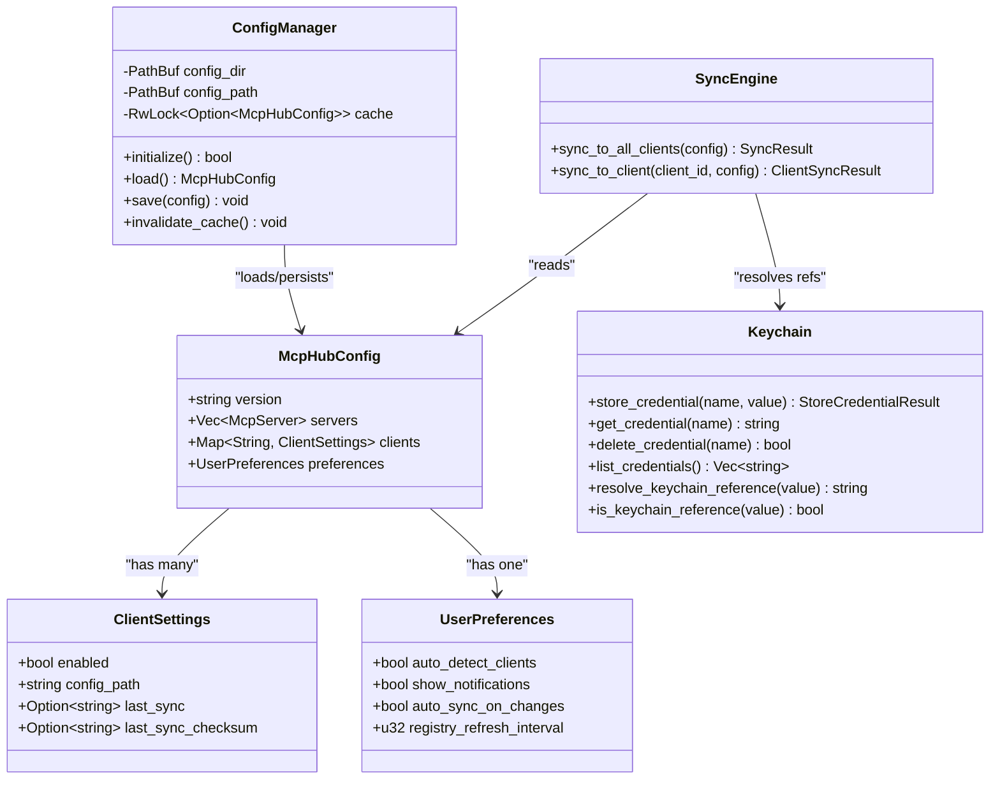
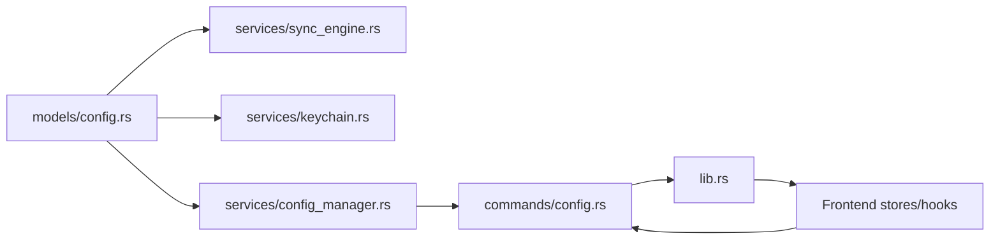

# McpHubConfig Model

<cite>
**Referenced Files in This Document**
- [config.rs](file://src-tauri/src/models/config.rs)
- [config_manager.rs](file://src-tauri/src/services/config_manager.rs)
- [config_commands.rs](file://src-tauri/src/commands/config.rs)
- [sync_engine.rs](file://src-tauri/src/services/sync_engine.rs)
- [keychain.rs](file://src-tauri/src/services/keychain.rs)
- [lib.rs](file://src-tauri/src/lib.rs)
- [appStore.ts](file://src/stores/appStore.ts)
- [useAutoSync.ts](file://src/hooks/useAutoSync.ts)
- [CredentialManager.tsx](file://src/components/settings/CredentialManager.tsx)
- [CredentialInput.tsx](file://src/components/common/CredentialInput.tsx)
</cite>

## Table of Contents

1. [Introduction](#introduction)
2. [Project Structure](#project-structure)
3. [Core Components](#core-components)
4. [Architecture Overview](#architecture-overview)
5. [Detailed Component Analysis](#detailed-component-analysis)
6. [Dependency Analysis](#dependency-analysis)
7. [Performance Considerations](#performance-considerations)
8. [Troubleshooting Guide](#troubleshooting-guide)
9. [Conclusion](#conclusion)
10. [Appendices](#appendices)

## Introduction

This document describes the McpHubConfig data model that represents the application’s persistent configuration state. It explains how the model is structured, how Serde derives enable reading/writing to disk, how ConfigManager loads and persists configuration, and how McpHubConfig coordinates with other services such as SyncEngine and Keychain. It also covers defaults, lazy initialization, fallback behavior, and how the model acts as the source of truth across restarts.

## Project Structure

The configuration system spans Rust backend models and services, Tauri commands, and frontend state management:

- Backend models define McpHubConfig and related types.
- ConfigManager manages on-disk persistence and caching.
- Tauri commands expose configuration operations to the UI.
- Frontend stores and hooks react to configuration changes and coordinate auto-sync behavior.
- SyncEngine consumes McpHubConfig to generate client-specific configurations.
- Keychain resolves keychain references embedded in server configurations.

**Diagram sources**

- [config.rs](file://src-tauri/src/models/config.rs#L60-L127)
- [config_manager.rs](file://src-tauri/src/services/config_manager.rs#L23-L161)
- [sync_engine.rs](file://src-tauri/src/services/sync_engine.rs#L1-L120)
- [keychain.rs](file://src-tauri/src/services/keychain.rs#L1-L120)
- [config_commands.rs](file://src-tauri/src/commands/config.rs#L1-L151)
- [lib.rs](file://src-tauri/src/lib.rs#L21-L88)
- [appStore.ts](file://src/stores/appStore.ts#L54-L117)
- [useAutoSync.ts](file://src/hooks/useAutoSync.ts#L1-L51)
- [CredentialManager.tsx](file://src/components/settings/CredentialManager.tsx#L1-L203)
- [CredentialInput.tsx](file://src/components/common/CredentialInput.tsx#L145-L169)

**Section sources**

- [config.rs](file://src-tauri/src/models/config.rs#L60-L127)
- [config_manager.rs](file://src-tauri/src/services/config_manager.rs#L23-L161)
- [config_commands.rs](file://src-tauri/src/commands/config.rs#L1-L151)
- [lib.rs](file://src-tauri/src/lib.rs#L21-L88)

## Core Components

- McpHubConfig: Central configuration model containing version, servers, per-client settings, and user preferences.
- ClientSettings: Per-client flags and metadata (e.g., enabled, config path, last sync timestamps).
- UserPreferences: Application-wide preferences (auto-detection, notifications, auto-sync on changes, registry refresh interval).
- ConfigManager: Loads, caches, validates, and persists McpHubConfig to disk with atomic writes and default initialization.
- Tauri Commands: Expose configuration operations to the UI.
- SyncEngine: Reads McpHubConfig to generate client-specific configurations and resolves keychain references.
- Keychain: Stores and retrieves secrets referenced by McpHubConfig and McpServer.

**Section sources**

- [config.rs](file://src-tauri/src/models/config.rs#L60-L127)
- [config_manager.rs](file://src-tauri/src/services/config_manager.rs#L23-L161)
- [config_commands.rs](file://src-tauri/src/commands/config.rs#L1-L151)
- [sync_engine.rs](file://src-tauri/src/services/sync_engine.rs#L1-L120)
- [keychain.rs](file://src-tauri/src/services/keychain.rs#L1-L120)

## Architecture Overview

The McpHubConfig model is the single source of truth for configuration. It is loaded by ConfigManager on demand, cached in memory, and persisted atomically to disk. UI updates propagate to McpHubConfig via Tauri commands, which then persist the changes. SyncEngine reads McpHubConfig to produce client-specific configurations, resolving keychain references through Keychain. Auto-sync behavior is coordinated by the frontend using McpHubConfig preferences.

**Diagram sources**

- [config_commands.rs](file://src-tauri/src/commands/config.rs#L58-L151)
- [config_manager.rs](file://src-tauri/src/services/config_manager.rs#L90-L161)
- [sync_engine.rs](file://src-tauri/src/services/sync_engine.rs#L448-L485)
- [keychain.rs](file://src-tauri/src/services/keychain.rs#L262-L293)

## Detailed Component Analysis

### McpHubConfig Model

McpHubConfig encapsulates:

- version: Version string for migration support.
- servers: Vector of McpServer entries.
- clients: HashMap of ClientSettings keyed by client ID.
- preferences: UserPreferences controlling application behavior.

Serde derives:

- #[derive(Serialize, Deserialize)] enables JSON serialization/deserialization.
- #[serde(rename_all = "camelCase")] ensures consistent field naming across platforms.
- #[serde(default)] provides default values for missing fields during deserialization.
- #[serde(skip_serializing_if = "Option::is_none")] omits optional fields when None.

Defaults and fallbacks:

- McpHubConfig::default sets version to "1.0", empty servers, empty clients, and UserPreferences::default.
- UserPreferences::default sets auto_detect_clients, show_notifications, auto_sync_on_changes to true, and registry_refresh_interval to 60.
- default_true() returns true for boolean fields requiring explicit defaults.
- default_refresh_interval() returns 60 for registry refresh interval.

Validation and startup:

- ConfigManager.initialize creates the config directory and writes a default McpHubConfig if none exists.
- Subsequent loads deserialize from disk using serde_json::from_str, applying defaults for missing fields.

Typical configuration file content:

- version: "1.0"
- servers: Array of server objects with id, name, source, transport, enabled, enabled_clients, timestamps, and optional fields.
- clients: Object mapping client IDs to client settings with enabled, config_path, last_sync, last_sync_checksum.
- preferences: Object with auto_detect_clients, show_notifications, auto_sync_on_changes, registry_refresh_interval.

Propagation to services:

- SyncEngine reads McpHubConfig to determine which servers are enabled for each client and generates client-specific configs.
- Keychain resolves keychain references in McpServer transport env/headers when writing client configs.

**Section sources**

- [config.rs](file://src-tauri/src/models/config.rs#L60-L127)
- [config.rs](file://src-tauri/src/models/config.rs#L1-L58)
- [config_manager.rs](file://src-tauri/src/services/config_manager.rs#L64-L88)
- [sync_engine.rs](file://src-tauri/src/services/sync_engine.rs#L448-L485)
- [keychain.rs](file://src-tauri/src/services/keychain.rs#L262-L293)

### ConfigManager Service

Responsibilities:

- Initialize config directory and default config file on first run.
- Load configuration from disk with caching.
- Persist configuration atomically to avoid corruption.
- Provide CRUD operations for servers and toggles for client enablement.

Caching:

- RwLock<Option<McpHubConfig>> cache avoids repeated disk reads until invalidated.

Atomic write pattern:

- Write to a temporary file, sync, set permissions, then rename to config.json.

Startup and defaults:

- initialize() checks existence of config directory and file; if absent, creates default McpHubConfig and persists it.

Runtime updates:

- save() updates cache after successful write.
- invalidate_cache() forces reload on next access.

**Section sources**

- [config_manager.rs](file://src-tauri/src/services/config_manager.rs#L23-L161)
- [config_manager.rs](file://src-tauri/src/services/config_manager.rs#L162-L233)

### Interaction with SyncEngine and Keychain

SyncEngine:

- Uses McpHubConfig.get_servers_for_client(client_id) to select servers for a client.
- Generates client-specific formats (standard, VS Code, Continue) and preserves existing settings.
- Resolves keychain references when writing client configs via Keychain.

Keychain:

- McpServer transport env/headers may contain keychain references like "keychain:name" or "${keychain:name}".
- resolve_keychain_reference extracts and resolves the referenced secret.
- is_keychain_reference detects references for conditional resolution.

**Section sources**

- [sync_engine.rs](file://src-tauri/src/services/sync_engine.rs#L1-L120)
- [sync_engine.rs](file://src-tauri/src/services/sync_engine.rs#L318-L446)
- [sync_engine.rs](file://src-tauri/src/services/sync_engine.rs#L635-L663)
- [keychain.rs](file://src-tauri/src/services/keychain.rs#L262-L293)

### Frontend Integration and Auto-Sync

Frontend state:

- appStore.ts maintains a local copy of McpHubConfig and updates it on save/get operations.
- updatePreferences merges partial preference updates into McpHubConfig.

Auto-sync:

- useAutoSync.ts listens to configuration changes and triggers sync_all_clients when preferences.autoSyncOnChanges is enabled.
- Debounces rapid changes to avoid excessive sync operations.

Credential UI:

- CredentialManager.tsx and CredentialInput.tsx integrate with Keychain to store, list, and select credentials referenced by servers.

**Section sources**

- [appStore.ts](file://src/stores/appStore.ts#L54-L117)
- [useAutoSync.ts](file://src/hooks/useAutoSync.ts#L1-L51)
- [CredentialManager.tsx](file://src/components/settings/CredentialManager.tsx#L1-L203)
- [CredentialInput.tsx](file://src/components/common/CredentialInput.tsx#L145-L169)

## Architecture Overview

**Diagram sources**

- [config.rs](file://src-tauri/src/models/config.rs#L60-L127)
- [config_manager.rs](file://src-tauri/src/services/config_manager.rs#L23-L161)
- [sync_engine.rs](file://src-tauri/src/services/sync_engine.rs#L1-L120)
- [keychain.rs](file://src-tauri/src/services/keychain.rs#L1-L120)

## Detailed Component Analysis

### McpHubConfig Fields and Semantics

- version: Migration/versioning marker for future upgrades.
- servers: Ordered list of McpServer entries; each server has id, name, source, transport, enabled flags, timestamps, and optional metadata.
- clients: Per-client settings including enabled flag, resolved config path, and last sync metadata.
- preferences: Controls UI and automation behavior such as auto-detection, notifications, and auto-sync on changes.

Defaults and fallbacks:

- Missing fields in serialized config are populated by serde defaults defined in the model.
- On first run, ConfigManager writes a default McpHubConfig to disk.

**Section sources**

- [config.rs](file://src-tauri/src/models/config.rs#L60-L127)
- [config_manager.rs](file://src-tauri/src/services/config_manager.rs#L64-L88)

### Serde Derives and Disk Persistence

- Serialization: McpHubConfig is serialized to pretty JSON for human readability and diffs.
- Deserialization: Missing fields are filled by #[serde(default)] and custom default functions.
- Atomic writes: Temporary file creation, sync, permission setting, and atomic rename prevent partial writes.

**Section sources**

- [config.rs](file://src-tauri/src/models/config.rs#L60-L127)
- [config_manager.rs](file://src-tauri/src/services/config_manager.rs#L129-L161)

### ConfigManager Lifecycle and Validation

- Initialization: Creates directory with restrictive permissions and writes default config if missing.
- Loading: Checks cache first; otherwise reads and deserializes from disk.
- Saving: Serializes to pretty JSON, writes temp file, sets permissions, renames to final path.
- Validation: Errors surfaced as ConfigError variants for invalid home directory, IO, and parse failures.

**Section sources**

- [config_manager.rs](file://src-tauri/src/services/config_manager.rs#L64-L161)

### SyncEngine Integration

- Client selection: Uses McpHubConfig.get_servers_for_client(client_id) to filter servers enabled for a given client.
- Format transformation: Converts McpServer entries to client-specific formats (standard, VS Code, Continue).
- Credential resolution: When writing client configs, resolves keychain references to actual values via Keychain.

**Section sources**

- [sync_engine.rs](file://src-tauri/src/services/sync_engine.rs#L318-L446)
- [sync_engine.rs](file://src-tauri/src/services/sync_engine.rs#L635-L663)
- [keychain.rs](file://src-tauri/src/services/keychain.rs#L262-L293)

### Frontend Auto-Sync and Runtime Updates

- Local state: appStore.ts keeps a reactive copy of McpHubConfig and updates it on save/get.
- Auto-sync: useAutoSync.ts monitors preferences.autoSyncOnChanges and triggers sync_all_clients with debouncing.
- Credential UI: CredentialManager.tsx and CredentialInput.tsx integrate with Keychain to manage secrets referenced by McpServer.

**Section sources**

- [appStore.ts](file://src/stores/appStore.ts#L54-L117)
- [useAutoSync.ts](file://src/hooks/useAutoSync.ts#L1-L51)
- [CredentialManager.tsx](file://src/components/settings/CredentialManager.tsx#L1-L203)
- [CredentialInput.tsx](file://src/components/common/CredentialInput.tsx#L145-L169)

## Dependency Analysis

**Diagram sources**

- [config.rs](file://src-tauri/src/models/config.rs#L60-L127)
- [config_manager.rs](file://src-tauri/src/services/config_manager.rs#L23-L161)
- [sync_engine.rs](file://src-tauri/src/services/sync_engine.rs#L1-L120)
- [keychain.rs](file://src-tauri/src/services/keychain.rs#L1-L120)
- [config_commands.rs](file://src-tauri/src/commands/config.rs#L1-L151)
- [lib.rs](file://src-tauri/src/lib.rs#L21-L88)

**Section sources**

- [config.rs](file://src-tauri/src/models/config.rs#L60-L127)
- [config_manager.rs](file://src-tauri/src/services/config_manager.rs#L23-L161)
- [config_commands.rs](file://src-tauri/src/commands/config.rs#L1-L151)
- [lib.rs](file://src-tauri/src/lib.rs#L21-L88)

## Performance Considerations

- Caching: ConfigManager caches McpHubConfig in memory to reduce disk I/O.
- Atomic writes: Reduce risk of partial writes and improve durability.
- Debounced auto-sync: useAutoSync.ts limits frequent sync operations to minimize churn.
- Conditional serialization: skip_serializing_if reduces payload sizes for optional fields.

[No sources needed since this section provides general guidance]

## Troubleshooting Guide

Common issues and resolutions:

- Config file unreadable: ConfigManager.parse_error indicates malformed JSON; verify file integrity or restore from backup.
- Missing home directory: ConfigManager.no_home_directory suggests environment misconfiguration; ensure HOME is set.
- Server not found: ConfigManager.server_not_found indicates invalid UUID; verify server IDs passed to commands.
- Permission errors: Ensure config directory and files have appropriate permissions (0700 for directory, 0600 for file).
- Keychain reference resolution: If a keychain reference fails, verify the credential exists and is accessible via Keychain.

**Section sources**

- [config_manager.rs](file://src-tauri/src/services/config_manager.rs#L10-L21)
- [keychain.rs](file://src-tauri/src/services/keychain.rs#L1-L120)

## Conclusion

McpHubConfig is the central, immutable source of truth for the application’s configuration. Its design leverages Serde for robust serialization, ConfigManager for safe persistence, and SyncEngine/Keychain for secure, client-targeted configuration generation. Defaults and caching ensure resilience, while the frontend integrates preferences and auto-sync to keep the system consistent across restarts and runtime changes.

[No sources needed since this section summarizes without analyzing specific files]

## Appendices

### Typical Configuration File Content

- version: "1.0"
- servers: Array of server objects with id, name, source, transport, enabled, enabled_clients, timestamps, and optional fields.
- clients: Object mapping client IDs to client settings with enabled, config_path, last_sync, last_sync_checksum.
- preferences: Object with auto_detect_clients, show_notifications, auto_sync_on_changes, registry_refresh_interval.

**Section sources**

- [config.rs](file://src-tauri/src/models/config.rs#L60-L127)

### Lazy Initialization and Fallback Mechanisms

- First-run initialization: ConfigManager.initialize creates directory and default config if missing.
- Default values: serde defaults and model defaults ensure missing fields are populated.
- Cache invalidation: ConfigManager.invalidate_cache forces reload on next access.
- Auto-sync fallback: If auto-sync is disabled, manual sync remains available.

**Section sources**

- [config_manager.rs](file://src-tauri/src/services/config_manager.rs#L64-L161)
- [config.rs](file://src-tauri/src/models/config.rs#L60-L127)
- [useAutoSync.ts](file://src/hooks/useAutoSync.ts#L1-L51)
