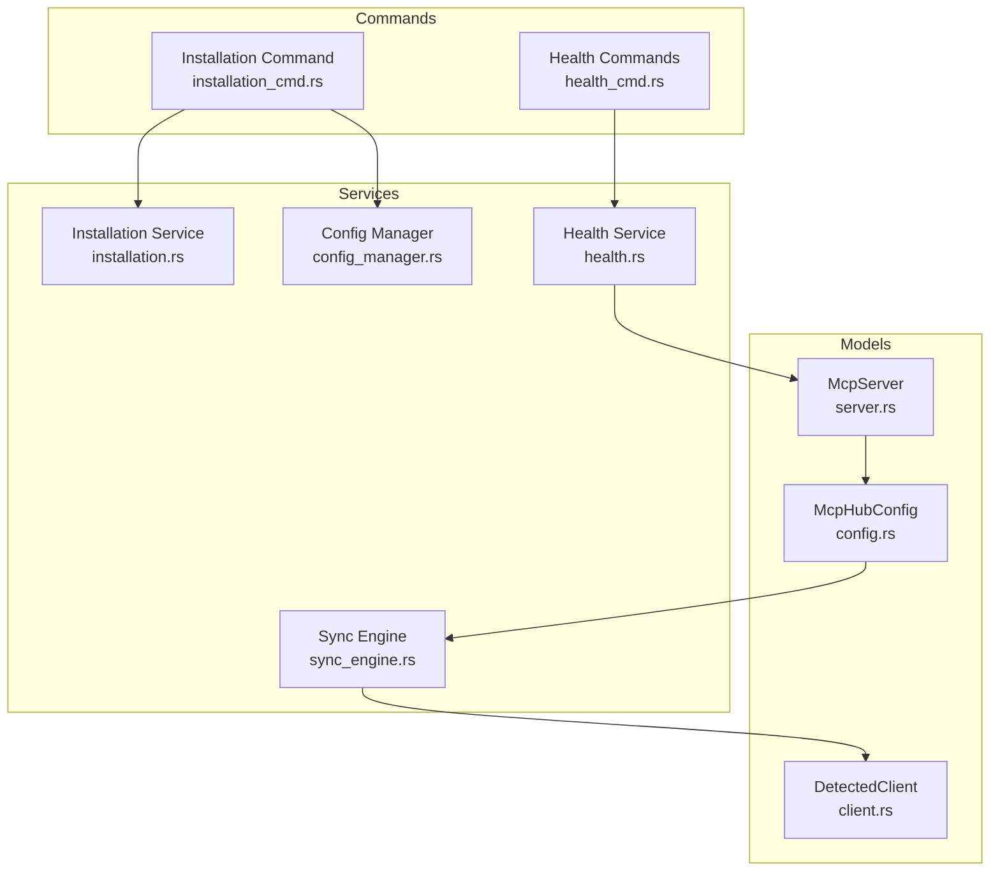
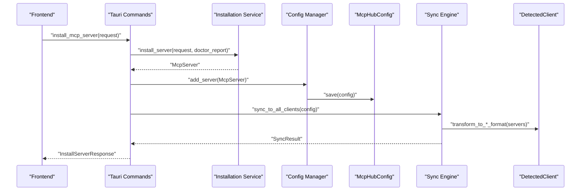
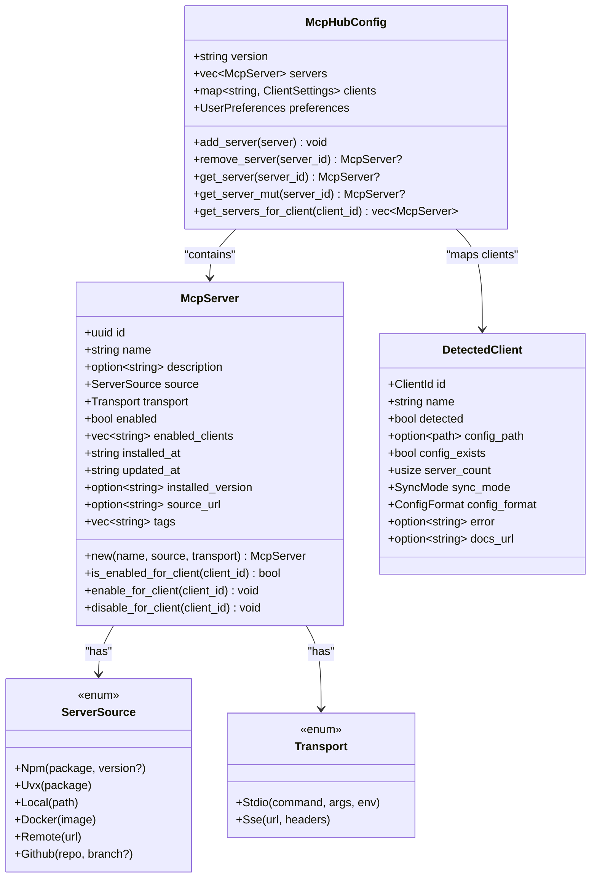
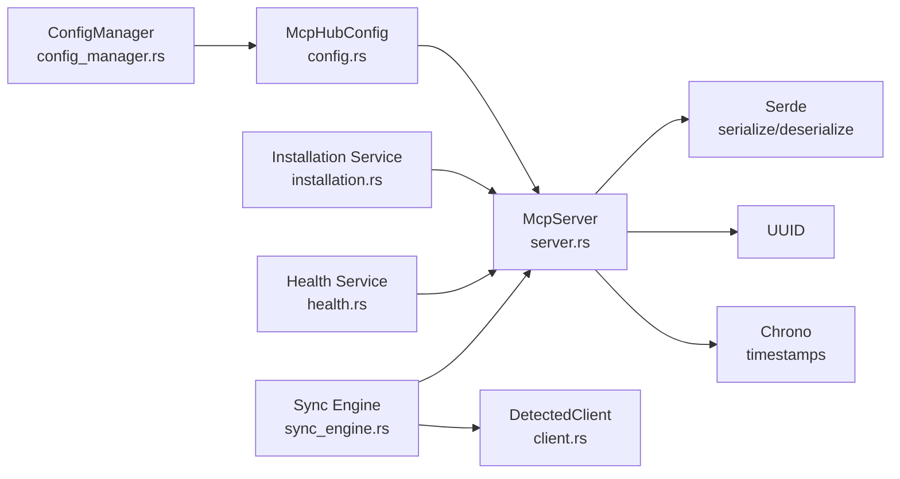
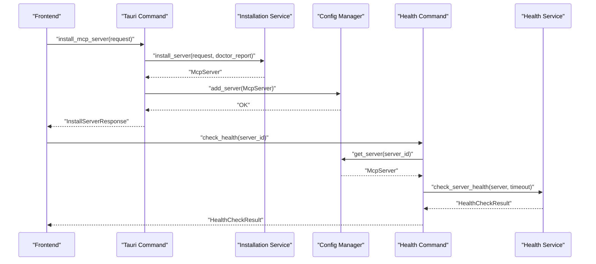

# McpServer Model

<cite>
**Referenced Files in This Document**
- [server.rs](file://src-tauri/src/models/server.rs)
- [config.rs](file://src-tauri/src/models/config.rs)
- [client.rs](file://src-tauri/src/models/client.rs)
- [installation.rs](file://src-tauri/src/services/installation.rs)
- [health.rs](file://src-tauri/src/services/health.rs)
- [sync_engine.rs](file://src-tauri/src/services/sync_engine.rs)
- [config_manager.rs](file://src-tauri/src/services/config_manager.rs)
- [installation_cmd.rs](file://src-tauri/src/commands/installation.rs)
- [health_cmd.rs](file://src-tauri/src/commands/health.rs)
</cite>

## Table of Contents

1. [Introduction](#introduction)
2. [Project Structure](#project-structure)
3. [Core Components](#core-components)
4. [Architecture Overview](#architecture-overview)
5. [Detailed Component Analysis](#detailed-component-analysis)
6. [Dependency Analysis](#dependency-analysis)
7. [Performance Considerations](#performance-considerations)
8. [Troubleshooting Guide](#troubleshooting-guide)
9. [Conclusion](#conclusion)
10. [Appendices](#appendices)

## Introduction

This document provides comprehensive data model documentation for the McpServer struct used in MCP Nexus. It explains each field, Serde serialization attributes enabling JSON configuration persistence and IPC communication, default values, validation rules enforced via Rust types and custom implementations, and how the model integrates with installation, health check, and sync services. It also covers relationships with McpHubConfig (global settings) and DetectedClient (client-specific mappings), and outlines schema evolution considerations for future versioning and backward compatibility.

## Project Structure

The McpServer model lives in the backend Rust codebase under src-tauri/src/models and is consumed by services and commands for installation, health checks, and synchronization. The central configuration (McpHubConfig) persists McpServer instances to disk and coordinates client-specific settings.

**Diagram sources**

- [server.rs](file://src-tauri/src/models/server.rs#L51-L131)
- [config.rs](file://src-tauri/src/models/config.rs#L60-L127)
- [client.rs](file://src-tauri/src/models/client.rs#L114-L168)
- [installation.rs](file://src-tauri/src/services/installation.rs#L480-L520)
- [health.rs](file://src-tauri/src/services/health.rs#L180-L191)
- [sync_engine.rs](file://src-tauri/src/services/sync_engine.rs#L318-L446)
- [config_manager.rs](file://src-tauri/src/services/config_manager.rs#L90-L153)
- [installation_cmd.rs](file://src-tauri/src/commands/installation.rs#L98-L135)
- [health_cmd.rs](file://src-tauri/src/commands/health.rs#L31-L74)

**Section sources**

- [server.rs](file://src-tauri/src/models/server.rs#L51-L131)
- [config.rs](file://src-tauri/src/models/config.rs#L60-L127)
- [client.rs](file://src-tauri/src/models/client.rs#L114-L168)
- [installation.rs](file://src-tauri/src/services/installation.rs#L480-L520)
- [health.rs](file://src-tauri/src/services/health.rs#L180-L191)
- [sync_engine.rs](file://src-tauri/src/services/sync_engine.rs#L318-L446)
- [config_manager.rs](file://src-tauri/src/services/config_manager.rs#L90-L153)
- [installation_cmd.rs](file://src-tauri/src/commands/installation.rs#L98-L135)
- [health_cmd.rs](file://src-tauri/src/commands/health.rs#L31-L74)

## Core Components

- McpServer: The primary data model representing an MCP server’s identity, source, transport, and lifecycle timestamps. It includes client scoping via enabled_clients and optional metadata like description, source_url, and tags.
- ServerSource: Enumerates installation sources (NPM, UVX, Local, Docker, Remote, GitHub).
- Transport: Enumerates communication mechanisms (Stdio with command/args/env, SSE with URL/headers).
- McpHubConfig: Central configuration containing version, servers, client settings, and user preferences.
- DetectedClient: Client-specific metadata used by sync engine to map and transform configurations.

Key serialization attributes:

- McpServer uses camelCase field names and selectively skips serializing None or empty fields to keep JSON compact.
- ServerSource and Transport use tag-based polymorphic serialization to encode variant types.
- McpHubConfig includes a version field for schema evolution.

Defaults and validation:

- enabled defaults to true via a default function.
- enabled_clients defaults to an empty vector.
- Optional fields (description, installed_version, source_url, tags) are omitted when None/empty.
- Runtime validation occurs during installation to ensure prerequisites are present.

**Section sources**

- [server.rs](file://src-tauri/src/models/server.rs#L51-L131)
- [server.rs](file://src-tauri/src/models/server.rs#L87-L90)
- [config.rs](file://src-tauri/src/models/config.rs#L60-L127)
- [client.rs](file://src-tauri/src/models/client.rs#L114-L168)
- [installation.rs](file://src-tauri/src/services/installation.rs#L124-L183)

## Architecture Overview

McpServer is persisted to disk via McpHubConfig and ConfigManager, then synchronized to clients using the sync engine. Installation creates McpServer instances and writes them to the central config. Health checks evaluate McpServer’s transport configuration.

**Diagram sources**

- [installation_cmd.rs](file://src-tauri/src/commands/installation.rs#L98-L135)
- [installation.rs](file://src-tauri/src/services/installation.rs#L480-L520)
- [config_manager.rs](file://src-tauri/src/services/config_manager.rs#L178-L210)
- [sync_engine.rs](file://src-tauri/src/services/sync_engine.rs#L449-L485)
- [client.rs](file://src-tauri/src/models/client.rs#L114-L168)

## Detailed Component Analysis

### McpServer Field Reference and Semantics

- id: UUID uniquely identifying the server instance.
- name: Human-readable display name.
- description: Optional description; omitted when None.
- source: ServerSource variant indicating installation origin.
- transport: Transport variant indicating how to communicate with the server.
- enabled: Global enable flag; defaults to true.
- enabled_clients: Client identifiers for which this server is enabled; defaults to empty.
- installed_at: ISO timestamp of installation.
- updated_at: ISO timestamp of last modification.
- installed_version: Optional version captured at install time (e.g., NPM version).
- source_url: Optional link to repository or documentation.
- tags: Optional categorization tags; omitted when empty.

Serde attributes:

- camelCase field naming for JSON compatibility with frontend expectations.
- skip_serializing_if for optional/empty fields to minimize payload size.
- default for enabled to ensure servers are enabled unless explicitly disabled.

Validation and defaults:

- enabled defaults to true via a default function.
- enabled_clients defaults to empty vector.
- Timestamps are ISO-formatted strings set at creation/update.
- Optional fields are omitted when None/empty.

Behavioral helpers:

- is_enabled_for_client: Checks global enabled plus client membership.
- enable_for_client/disable_for_client: Mutate enabled_clients and update updated_at.

**Section sources**

- [server.rs](file://src-tauri/src/models/server.rs#L51-L131)
- [server.rs](file://src-tauri/src/models/server.rs#L87-L90)

### ServerSource and Transport Polymorphism

- ServerSource variants:
  - NPM: package with optional version.
  - UVX: Python package via uvx.
  - Local: path to a server binary/script.
  - Docker: image to run.
  - Remote: SSE endpoint URL.
  - GitHub: repository with optional branch.
- Transport variants:
  - Stdio: command, args, env for local process execution.
  - Sse: URL and headers for remote SSE.

Serialization:

- tag-based polymorphism encodes the variant type, enabling safe deserialization of heterogeneous lists.

**Section sources**

- [server.rs](file://src-tauri/src/models/server.rs#L6-L49)

### McpHubConfig Integration

- McpHubConfig holds:
  - version: Schema version string for migrations.
  - servers: Vector of McpServer instances.
  - clients: Map of client settings keyed by client identifier.
  - preferences: User preferences for auto-detection, notifications, and sync behavior.
- Provides helpers to add/remove/get servers and to filter servers by client.

Integration points:

- ConfigManager reads/writes McpHubConfig to/from disk using atomic writes and caches the loaded config.
- Sync engine transforms McpServer instances into client-specific formats.

**Section sources**

- [config.rs](file://src-tauri/src/models/config.rs#L60-L127)
- [config_manager.rs](file://src-tauri/src/services/config_manager.rs#L90-L153)
- [sync_engine.rs](file://src-tauri/src/services/sync_engine.rs#L318-L446)

### Installation Workflow and McpServer Creation

- InstallServerRequest drives installation, including environment variables and client scoping.
- validate_runtime enforces prerequisites (Node.js, Python/uv, git, Docker) depending on source type.
- build_transport constructs Transport from InstallSource and merges environment variables.
- build_server_source mirrors InstallSource into ServerSource.
- install_server creates a McpServer with defaults, sets timestamps, captures installed_version when available, and enables it for specified clients.

Real-world example:

- During marketplace installation, a request arrives with InstallSource::Npm and env variables. The service validates runtime, builds Transport::Stdio with command "npx" and args, and creates McpServer with enabled=true and updated timestamps. It then saves via ConfigManager and optionally syncs to clients.

**Section sources**

- [installation.rs](file://src-tauri/src/services/installation.rs#L124-L183)
- [installation.rs](file://src-tauri/src/services/installation.rs#L334-L453)
- [installation.rs](file://src-tauri/src/services/installation.rs#L480-L520)
- [installation_cmd.rs](file://src-tauri/src/commands/installation.rs#L98-L135)
- [config_manager.rs](file://src-tauri/src/services/config_manager.rs#L178-L210)

### Health Check Integration

- check_server_health inspects McpServer’s transport:
  - For SSE: performs HTTP GET to the URL and records status and response time.
  - For Stdio: spawns the command with args and env, waits briefly, checks process exit or continued execution, and kills if still running.
- Results include server_id derived from McpServer.id.

Example flow:

- A health command retrieves McpServer by ID from ConfigManager, invokes check_server_health, and returns HealthCheckResult.

**Section sources**

- [health.rs](file://src-tauri/src/services/health.rs#L180-L191)
- [health_cmd.rs](file://src-tauri/src/commands/health.rs#L31-L74)

### Sync Engine and Client-Specific Mappings

- Sync engine transforms McpServer into client-specific formats:
  - Standard: {"mcpServers": {"name": {"command"/"url","args"/"headers","env"}}}
  - VS Code: preserves existing mcp.servers while updating or adding entries.
  - Continue: merges mcpServers into existing config.
- Credentials:
  - When writing to client configs, keychain references are resolved to actual values.
  - For manual display (e.g., Warp), references are preserved as-is.
- DetectedClient provides client-specific metadata (sync mode, config format, docs URL) used by sync engine.

**Section sources**

- [sync_engine.rs](file://src-tauri/src/services/sync_engine.rs#L86-L155)
- [sync_engine.rs](file://src-tauri/src/services/sync_engine.rs#L157-L221)
- [sync_engine.rs](file://src-tauri/src/services/sync_engine.rs#L223-L234)
- [client.rs](file://src-tauri/src/models/client.rs#L114-L168)

### Class Diagram: McpServer and Related Types

**Diagram sources**

- [server.rs](file://src-tauri/src/models/server.rs#L51-L131)
- [server.rs](file://src-tauri/src/models/server.rs#L6-L49)
- [config.rs](file://src-tauri/src/models/config.rs#L60-L127)
- [client.rs](file://src-tauri/src/models/client.rs#L114-L168)

## Dependency Analysis

- McpServer depends on:
  - uuid for id
  - chrono for ISO timestamps
  - serde for serialization/deserialization
  - HashMap for environment variables and headers
- McpHubConfig aggregates McpServer and manages persistence via ConfigManager.
- Installation service constructs McpServer from InstallSource and environment variables.
- Health service evaluates McpServer’s transport configuration.
- Sync engine transforms McpServer into client-specific formats and resolves credentials.

**Diagram sources**

- [server.rs](file://src-tauri/src/models/server.rs#L51-L131)
- [config.rs](file://src-tauri/src/models/config.rs#L60-L127)
- [config_manager.rs](file://src-tauri/src/services/config_manager.rs#L90-L153)
- [installation.rs](file://src-tauri/src/services/installation.rs#L480-L520)
- [health.rs](file://src-tauri/src/services/health.rs#L180-L191)
- [sync_engine.rs](file://src-tauri/src/services/sync_engine.rs#L318-L446)
- [client.rs](file://src-tauri/src/models/client.rs#L114-L168)

**Section sources**

- [server.rs](file://src-tauri/src/models/server.rs#L51-L131)
- [config.rs](file://src-tauri/src/models/config.rs#L60-L127)
- [config_manager.rs](file://src-tauri/src/services/config_manager.rs#L90-L153)
- [installation.rs](file://src-tauri/src/services/installation.rs#L480-L520)
- [health.rs](file://src-tauri/src/services/health.rs#L180-L191)
- [sync_engine.rs](file://src-tauri/src/services/sync_engine.rs#L318-L446)
- [client.rs](file://src-tauri/src/models/client.rs#L114-L168)

## Performance Considerations

- Serialization overhead: O(n) per server for JSON serialization; skip_serializing_if reduces payload size for optional fields.
- Disk I/O: ConfigManager uses atomic writes (temp file + rename) to ensure consistency; avoid frequent writes by batching updates.
- Health checks: Stdio spawning is lightweight but may block briefly; SSE checks are network-bound and include timeouts.
- Sync transformations: Complexity scales with number of servers and client-specific formats; consider caching transformed outputs when feasible.

[No sources needed since this section provides general guidance]

## Troubleshooting Guide

Common issues and resolutions:

- Installation failures:
  - Missing runtime prerequisites (Node.js, Python/uv, git, Docker) cause validation errors. The installer suggests remedies.
  - Invalid local path or invalid URL for Remote sources are rejected early.
- Health check failures:
  - Stdio spawn failures indicate misconfigured command/args/env; verify transport configuration.
  - SSE failures indicate network connectivity or invalid URL; inspect headers and response codes.
- Sync issues:
  - Missing client config path or permission errors prevent writing; ensure directories exist and have appropriate permissions.
  - Credential resolution failures require valid keychain references; verify secrets storage.

**Section sources**

- [installation.rs](file://src-tauri/src/services/installation.rs#L124-L183)
- [health.rs](file://src-tauri/src/services/health.rs#L94-L178)
- [sync_engine.rs](file://src-tauri/src/services/sync_engine.rs#L236-L305)
- [config_manager.rs](file://src-tauri/src/services/config_manager.rs#L130-L153)

## Conclusion

McpServer is a robust, serialized-first model designed for persistence and IPC. Its fields and enums cleanly represent installation sources and transports, while Serde attributes ensure compact JSON payloads. Integrated with McpHubConfig, Installation, Health, and Sync services, it enables reliable server lifecycle management, client-specific configuration, and forward-compatible schema evolution through versioning.

[No sources needed since this section summarizes without analyzing specific files]

## Appendices

### Real-World Example: Installation and Health Update Flow

- Installation:
  - Frontend sends InstallServerRequest with InstallSource and env.
  - Backend validates runtime, builds Transport and ServerSource, creates McpServer, saves via ConfigManager, and optionally syncs to clients.
- Health update:
  - Frontend triggers health check; backend loads McpServer from ConfigManager, executes check_server_health, and returns HealthCheckResult with server_id.

**Diagram sources**

- [installation_cmd.rs](file://src-tauri/src/commands/installation.rs#L98-L135)
- [installation.rs](file://src-tauri/src/services/installation.rs#L480-L520)
- [config_manager.rs](file://src-tauri/src/services/config_manager.rs#L178-L210)
- [health_cmd.rs](file://src-tauri/src/commands/health.rs#L31-L74)
- [health.rs](file://src-tauri/src/services/health.rs#L180-L191)

### Schema Evolution and Backward Compatibility

- McpHubConfig includes a version field suitable for migrations.
- Current McpServer fields are additive-friendly; optional fields are omitted when absent, aiding backward compatibility.
- Recommendations:
  - Increment McpHubConfig.version on breaking changes.
  - Introduce new optional fields on McpServer to avoid breaking older consumers.
  - Use serde rename/untagged variants cautiously; prefer explicit versioned fields.
  - Provide migration routines to convert older config versions to newer schemas.

**Section sources**

- [config.rs](file://src-tauri/src/models/config.rs#L60-L127)
- [server.rs](file://src-tauri/src/models/server.rs#L51-L89)
