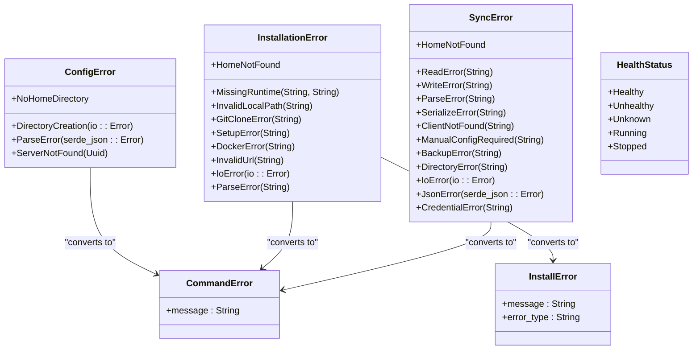
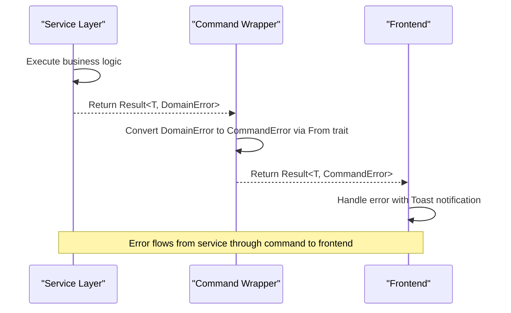

# Error Handling

<cite>
**Referenced Files in This Document**   
- [config.rs](file://src-tauri/src/commands/config.rs#L12-L23)
- [config_manager.rs](file://src-tauri/src/services/config_manager.rs#L10-L20)
- [installation.rs](file://src-tauri/src/commands/installation.rs#L13-L37)
- [sync_engine.rs](file://src-tauri/src/services/sync_engine.rs#L17-L42)
- [health.rs](file://src-tauri/src/services/health.rs#L9-L23)
- [lib.rs](file://src-tauri/src/lib.rs#L12-L16)
</cite>

## Table of Contents

1. [Introduction](#introduction)
2. [Core Error Types and Hierarchy](#core-error-types-and-hierarchy)
3. [Error Propagation and Conversion](#error-propagation-and-conversion)
4. [Service-Level Error Handling](#service-level-error-handling)
5. [Command Wrappers and Frontend Integration](#command-wrappers-and-frontend-integration)
6. [Error Context Preservation](#error-context-preservation)
7. [Partial Failure Handling](#partial-failure-handling)
8. [Logging and Diagnostics](#logging-and-diagnostics)
9. [User-Facing Error Presentation](#user-facing-error-presentation)
10. [Troubleshooting and Debugging](#troubleshooting-and-debugging)

## Introduction

The MCP Nexus backend implements a comprehensive error handling system designed to provide robust error management across its Rust-based Tauri application. The system follows Rust's idiomatic error handling patterns while ensuring seamless integration with the frontend through structured error responses. This documentation details the custom error types, their hierarchical relationships, error propagation mechanisms, and the complete error lifecycle from service implementation to user presentation.

## Core Error Types and Hierarchy

The error handling system in MCP Nexus is built around a hierarchical structure of custom error types that reflect the application's domain-specific concerns. At the foundation, the system uses Rust's `thiserror` crate to derive error implementations, enabling clear error categorization and context preservation.

The primary error types include `ConfigError`, `InstallationError`, `SyncError`, and `HealthCheckError`, each defined in their respective service modules. These errors form a tree-like hierarchy where lower-level service errors are converted to higher-level command-specific errors for frontend consumption.

**Diagram sources**

- [config_manager.rs](file://src-tauri/src/services/config_manager.rs#L10-L20)
- [installation.rs](file://src-tauri/src/services/installation.rs#L11-L34)
- [sync_engine.rs](file://src-tauri/src/services/sync_engine.rs#L17-L42)
- [health.rs](file://src-tauri/src/services/health.rs#L9-L23)
- [config.rs](file://src-tauri/src/commands/config.rs#L12-L16)
- [installation.rs](file://src-tauri/src/commands/installation.rs#L13-L37)

**Section sources**

- [config_manager.rs](file://src-tauri/src/services/config_manager.rs#L10-L20)
- [installation.rs](file://src-tauri/src/services/installation.rs#L11-L34)
- [sync_engine.rs](file://src-tauri/src/services/sync_engine.rs#L17-L42)

## Error Propagation and Conversion

Errors in MCP Nexus follow a well-defined propagation path from service implementations through command wrappers to the frontend. The system uses Rust's `Result` type extensively, with service functions returning domain-specific error types that are then converted to command-specific error types suitable for frontend consumption.

The conversion process is implemented using Rust's `From` trait, which enables automatic error conversion when using the `?` operator. This pattern ensures that lower-level errors are appropriately transformed into higher-level error types with frontend-friendly messages and metadata.

For example, when a configuration operation fails, the `ConfigError` from the `config_manager` service is automatically converted to a `CommandError` through the `From` implementation. Similarly, `InstallationError` types are converted to `InstallError` with additional metadata that helps the frontend categorize and display the error appropriately.

The Tauri command system requires errors to implement `serde::Serialize`, which is achieved by deriving the Serialize trait on command error types. This allows errors to be seamlessly transmitted from the Rust backend to the TypeScript frontend through Tauri's invoke system.

**Diagram sources**

- [config.rs](file://src-tauri/src/commands/config.rs#L17-L22)
- [installation.rs](file://src-tauri/src/commands/installation.rs#L18-L37)
- [lib.rs](file://src-tauri/src/lib.rs#L12-L16)

**Section sources**

- [config.rs](file://src-tauri/src/commands/config.rs#L17-L22)
- [installation.rs](file://src-tauri/src/commands/installation.rs#L18-L37)

## Service-Level Error Handling

Service implementations in MCP Nexus follow consistent error handling patterns that prioritize both robustness and diagnostic capability. Each service module defines its own error enum that captures domain-specific failure modes, providing meaningful context for both users and developers.

The `config_manager` service, for instance, handles configuration file operations and defines errors for various failure scenarios such as missing home directories, directory creation failures, and JSON parsing errors. These errors wrap underlying `std::io::Error` and `serde_json::Error` types, preserving the original error context while adding domain-specific information.

Similarly, the `installation` service defines detailed error types for the server installation process, including `MissingRuntime`, `GitCloneError`, and `SetupError`. These errors not only describe what went wrong but also provide suggestions for resolution, such as recommending installation of missing runtimes.

The `sync_engine` service handles configuration synchronization across different IDE clients and defines errors for various sync-related issues, including `ClientNotFound`, `ManualConfigRequired`, and `CredentialError`. These errors help distinguish between different types of sync failures and guide appropriate user actions.

All service errors implement the `std::error::Error` trait through the `thiserror::Error` derive macro, enabling rich error reporting and chaining. This allows errors to be easily logged with full context and propagated up the call stack while maintaining their original meaning.

**Section sources**

- [config_manager.rs](file://src-tauri/src/services/config_manager.rs#L10-L20)
- [installation.rs](file://src-tauri/src/services/installation.rs#L11-L34)
- [sync_engine.rs](file://src-tauri/src/services/sync_engine.rs#L17-L42)

## Command Wrappers and Frontend Integration

Command wrappers serve as the bridge between the backend services and the frontend, transforming domain-specific errors into frontend-friendly formats. These wrappers are annotated with `#[tauri::command]` and are exposed to the frontend through Tauri's invoke system.

Each command wrapper follows a consistent pattern: it receives parameters from the frontend, calls the appropriate service function, handles any errors by converting them to command-specific error types, and returns a `Result` that can be serialized and transmitted to the frontend.

The `CommandError` type, defined in `config.rs`, serves as the base error type for most commands and contains a simple `message` field that can be directly displayed to users. More specialized commands, like those in the installation module, use custom error types such as `InstallError` that include additional metadata like `error_type`, which helps the frontend categorize errors and provide appropriate recovery suggestions.

When errors occur, the command wrappers ensure that sensitive information is not exposed to the frontend while still providing enough detail for users to understand and resolve the issue. For example, file system errors are generalized to avoid exposing path information, while validation errors provide specific details about what went wrong.

The command system also handles error cases where the input itself is invalid, such as malformed UUIDs or invalid client IDs, by converting parsing errors into user-friendly error messages that guide the user toward correct input.

**Section sources**

- [config.rs](file://src-tauri/src/commands/config.rs#L12-L23)
- [installation.rs](file://src-tauri/src/commands/installation.rs#L13-L37)
- [sync.rs](file://src-tauri/src/commands/sync.rs#L14-L15)

## Error Context Preservation

MCP Nexus preserves error context across async boundaries and service boundaries through careful error design and propagation. The system uses Rust's error chaining capabilities to maintain the full error context, allowing developers to trace the root cause of issues even when errors are transformed and propagated through multiple layers.

When service errors are converted to command errors, the original error context is preserved through the `source` method of the `std::error::Error` trait. This allows logging systems to traverse the error chain and capture complete diagnostic information, including backtraces when available.

For async operations, the system ensures that errors are properly propagated through `.await` points without losing context. This is particularly important in operations like server installation, which may involve multiple async steps such as downloading repositories, running setup commands, and syncing configurations.

The error types are designed to carry sufficient context for both user-facing messages and developer diagnostics. For example, the `InstallationError::MissingRuntime` variant includes both the name of the missing runtime and a suggestion for how to install it, providing immediate value to users while also giving developers insight into the specific failure mode.

Error context is also preserved in partial failure scenarios, such as when syncing to multiple clients. The `SyncResult` type captures individual `ClientSyncResult` entries for each client, preserving the specific error that occurred for each client while still providing an overall sync status.

**Section sources**

- [installation.rs](file://src-tauri/src/services/installation.rs#L11-L34)
- [sync_engine.rs](file://src-tauri/src/services/sync_engine.rs#L17-L42)
- [health.rs](file://src-tauri/src/services/health.rs#L9-L23)

## Partial Failure Handling

The system gracefully handles partial failures, particularly in operations that affect multiple components, such as syncing configuration to multiple IDE clients. Instead of failing the entire operation when one component fails, MCP Nexus continues processing the remaining components and reports the partial results.

The `sync_to_all_clients` function exemplifies this approach, attempting to sync configuration to each enabled client and collecting the results in a `SyncResult` structure. This structure includes counts of successful, failed, and manual configuration required syncs, along with detailed results for each client.

This approach ensures that users can still benefit from successful syncs even when some clients fail, rather than having the entire operation aborted. The system distinguishes between different types of failures, such as clients that require manual configuration versus those that encountered actual errors, providing appropriate guidance for each scenario.

For operations like uninstalling a server, the system separates the removal of the server from the cleanup of associated resources. If resource cleanup fails, the server is still removed from the configuration, with the cleanup error logged but not preventing the main operation from succeeding.

This partial failure handling is transparent to users through detailed status reporting and logging, ensuring that they are aware of any issues that require attention while still allowing the primary functionality to proceed.

**Section sources**

- [sync_engine.rs](file://src-tauri/src/services/sync_engine.rs#L57-L65)
- [sync.rs](file://src-tauri/src/commands/sync.rs#L107-L142)

## Logging and Diagnostics

MCP Nexus employs comprehensive logging strategies to aid in debugging and monitoring, using structured logging to capture detailed diagnostic information. The system logs errors at appropriate levels, with critical failures logged at the error level and recoverable issues at the warning level.

The `append_sync_log` function in the sync commands module demonstrates the logging approach, writing failed sync attempts to a dedicated log file with timestamps and error details. This provides an audit trail for sync operations and helps identify recurring issues.

Errors are logged with sufficient context to diagnose issues, including operation details, affected components, and relevant parameters. However, sensitive information such as credential values is redacted or omitted to maintain security.

The system also maintains separate logs for different types of operations, such as the auto-sync log mentioned above, allowing for targeted analysis of specific functionality. Log entries include timestamps and relevant identifiers to facilitate correlation across different system components.

For debugging purposes, the system could be enhanced with more granular log levels and additional diagnostic information, particularly for complex operations like server installation and health checking. The current logging provides a solid foundation for troubleshooting common issues.

**Section sources**

- [sync.rs](file://src-tauri/src/commands/sync.rs#L17-L69)

## User-Facing Error Presentation

Errors are presented to users through Toast notifications that provide clear, actionable information. The frontend receives structured error responses from the backend and displays them in a consistent manner, ensuring that users are informed of issues without being overwhelmed by technical details.

The error presentation system categorizes errors to provide appropriate messaging and recovery suggestions. For example, installation errors related to missing runtimes include specific instructions for installing the required software, while configuration errors provide guidance on correcting invalid settings.

The Toast notifications are designed to be non-intrusive yet noticeable, allowing users to acknowledge errors without disrupting their workflow. For critical errors that prevent functionality, the system may use more prominent UI elements to ensure the user addresses the issue.

Error messages are localized and user-focused, avoiding technical jargon where possible and providing clear explanations of what went wrong and how to fix it. When appropriate, the system offers direct actions, such as opening a relevant settings panel or providing a copyable configuration snippet.

The system also provides detailed error information in a collapsible format, allowing advanced users to access technical details while keeping the primary message simple and actionable for most users.

**Section sources**

- [sync.rs](file://src-tauri/src/commands/sync.rs#L17-L69)
- [installation.rs](file://src-tauri/src/commands/installation.rs#L13-L37)

## Troubleshooting and Debugging

Common error scenarios in MCP Nexus typically fall into several categories: configuration issues, runtime dependencies, network connectivity, and permission problems. Understanding these patterns helps in quickly diagnosing and resolving issues.

For configuration-related errors, the first step is to verify the integrity of the configuration file and its location. The `ConfigError` variants provide specific guidance, such as checking file permissions or validating JSON syntax. Users can also use the `initialize_config` command to recreate the configuration directory if needed.

Runtime dependency issues, indicated by `MissingRuntime` errors, require installing the necessary software such as Node.js, Python, or Docker. The error messages typically include suggestions for installation methods, such as using package managers or downloading from official sources.

Network-related issues, particularly with remote servers or marketplace access, may require checking connectivity, firewall settings, or proxy configurations. The health check system can help diagnose these issues by testing connectivity to server endpoints.

Permission problems often occur on Unix-like systems where file permissions are restrictive. The system sets appropriate permissions (0600 for files, 0700 for directories) but may encounter issues if the user lacks sufficient privileges. Running the application with appropriate permissions or adjusting directory ownership can resolve these issues.

For debugging, enabling verbose logging and examining the log files in `~/.mcp-nexus/logs/` can provide detailed insights into the root cause of issues. The structured error responses from commands also contain valuable information for troubleshooting.

**Section sources**

- [config_manager.rs](file://src-tauri/src/services/config_manager.rs#L10-L20)
- [installation.rs](file://src-tauri/src/services/installation.rs#L11-L34)
- [sync_engine.rs](file://src-tauri/src/services/sync_engine.rs#L17-L42)
- [health.rs](file://src-tauri/src/services/health.rs#L9-L23)
