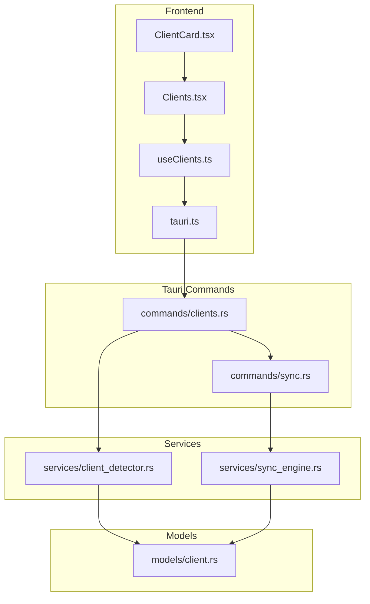
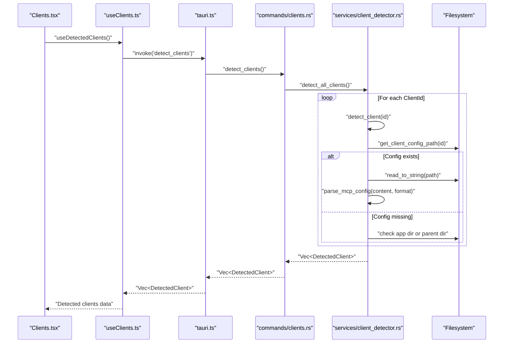
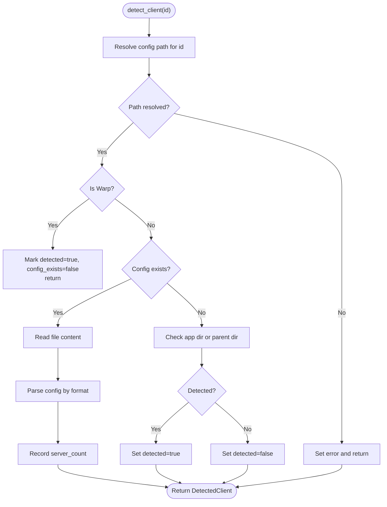
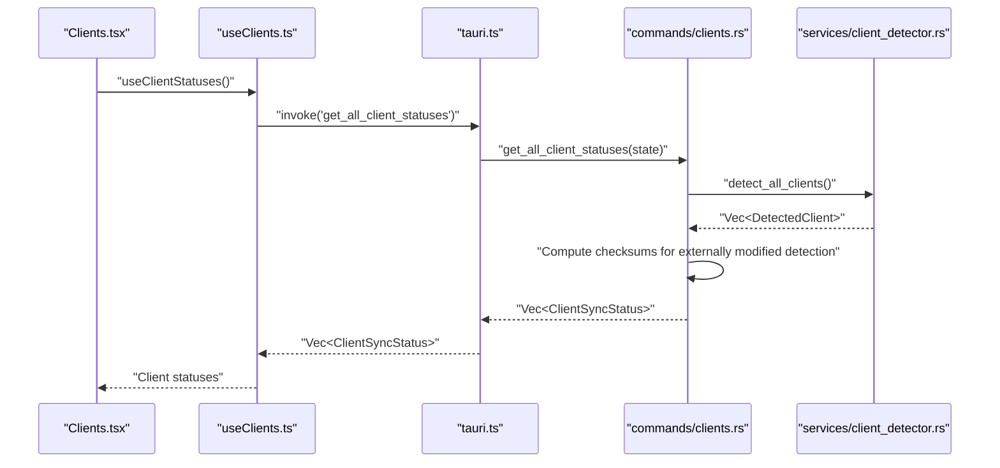
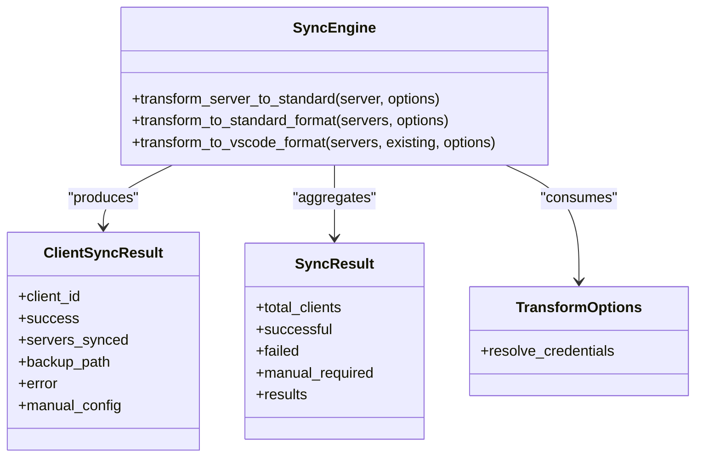
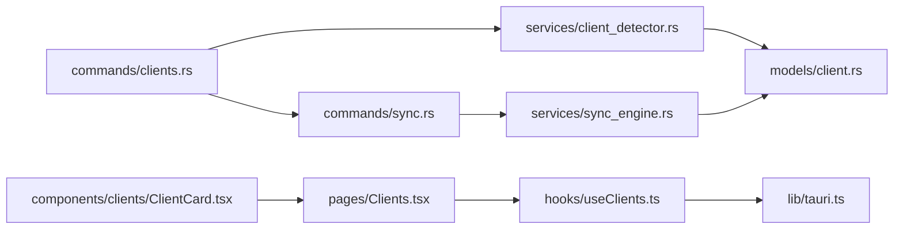

# Client Detector Service

<cite>
**Referenced Files in This Document**
- [client_detector.rs](file://src-tauri/src/services/client_detector.rs)
- [clients.rs](file://src-tauri/src/commands/clients.rs)
- [client.rs](file://src-tauri/src/models/client.rs)
- [tauri.ts](file://src/lib/tauri.ts)
- [useClients.ts](file://src/hooks/useClients.ts)
- [sync.rs](file://src-tauri/src/commands/sync.rs)
- [sync_engine.rs](file://src-tauri/src/services/sync_engine.rs)
- [Clients.tsx](file://src/pages/Clients.tsx)
- [ClientCard.tsx](file://src/components/clients/ClientCard.tsx)
</cite>

## Table of Contents

1. [Introduction](#introduction)
2. [Project Structure](#project-structure)
3. [Core Components](#core-components)
4. [Architecture Overview](#architecture-overview)
5. [Detailed Component Analysis](#detailed-component-analysis)
6. [Dependency Analysis](#dependency-analysis)
7. [Performance Considerations](#performance-considerations)
8. [Troubleshooting Guide](#troubleshooting-guide)
9. [Conclusion](#conclusion)

## Introduction

This document explains the Client Detector service responsible for discovering installed AI clients that use MCP (Model Context Protocol) configurations. It covers how the service identifies clients, validates installations, parses configuration files, and integrates with the broader sync and UI systems. It also documents the detection logic, supported client types, error handling, and practical guidance for troubleshooting and performance.

## Project Structure

The Client Detector spans Rust backend services and Tauri commands, with frontend hooks and UI components that surface detection results and sync status.

**Diagram sources**

- [client_detector.rs](file://src-tauri/src/services/client_detector.rs#L1-L364)
- [clients.rs](file://src-tauri/src/commands/clients.rs#L1-L170)
- [client.rs](file://src-tauri/src/models/client.rs#L1-L248)
- [tauri.ts](file://src/lib/tauri.ts#L86-L144)
- [useClients.ts](file://src/hooks/useClients.ts#L1-L138)
- [sync.rs](file://src-tauri/src/commands/sync.rs#L1-L252)
- [sync_engine.rs](file://src-tauri/src/services/sync_engine.rs#L1-L200)
- [Clients.tsx](file://src/pages/Clients.tsx#L41-L75)
- [ClientCard.tsx](file://src/components/clients/ClientCard.tsx#L1-L19)

**Section sources**

- [client_detector.rs](file://src-tauri/src/services/client_detector.rs#L1-L364)
- [clients.rs](file://src-tauri/src/commands/clients.rs#L1-L170)
- [client.rs](file://src-tauri/src/models/client.rs#L1-L248)
- [tauri.ts](file://src/lib/tauri.ts#L86-L144)
- [useClients.ts](file://src/hooks/useClients.ts#L1-L138)
- [sync.rs](file://src-tauri/src/commands/sync.rs#L1-L252)
- [sync_engine.rs](file://src-tauri/src/services/sync_engine.rs#L1-L200)
- [Clients.tsx](file://src/pages/Clients.tsx#L41-L75)
- [ClientCard.tsx](file://src/components/clients/ClientCard.tsx#L1-L19)

## Core Components

- Client detection model and enums define supported clients, sync modes, and config formats.
- The detector service resolves client config paths, checks existence, parses MCP configs, and detects presence heuristically when config files are absent.
- Tauri commands expose detection and status APIs to the frontend.
- Frontend hooks and UI components render detection results and drive sync operations.

**Section sources**

- [client.rs](file://src-tauri/src/models/client.rs#L1-L248)
- [client_detector.rs](file://src-tauri/src/services/client_detector.rs#L1-L364)
- [clients.rs](file://src-tauri/src/commands/clients.rs#L1-L170)
- [tauri.ts](file://src/lib/tauri.ts#L86-L144)
- [useClients.ts](file://src/hooks/useClients.ts#L1-L138)
- [Clients.tsx](file://src/pages/Clients.tsx#L41-L75)
- [ClientCard.tsx](file://src/components/clients/ClientCard.tsx#L1-L19)

## Architecture Overview

The client detection workflow is a layered pipeline: UI triggers detection, Tauri commands call Rust services, the detector inspects filesystem paths and parses configs, and the UI renders results and sync status.

**Diagram sources**

- [clients.rs](file://src-tauri/src/commands/clients.rs#L10-L15)
- [client_detector.rs](file://src-tauri/src/services/client_detector.rs#L123-L216)
- [tauri.ts](file://src/lib/tauri.ts#L88-L91)
- [useClients.ts](file://src/hooks/useClients.ts#L21-L28)
- [Clients.tsx](file://src/pages/Clients.tsx#L41-L75)

## Detailed Component Analysis

### Client Detection Service

The detector encapsulates:

- Path resolution for each client’s MCP config.
- Existence checks and heuristic presence detection.
- Config parsing for server counts and names.
- Error propagation for IO and parse failures.

Key behaviors:

- Path resolution uses the user’s home directory and platform-specific locations for each client.
- For clients without a dedicated config file (e.g., Warp), detection is marked manual-only.
- When config exists, the service reads and parses it according to the client’s config format.
- When config is missing, the service checks for application presence or parent directories to infer installation.

**Diagram sources**

- [client_detector.rs](file://src-tauri/src/services/client_detector.rs#L23-L216)

**Section sources**

- [client_detector.rs](file://src-tauri/src/services/client_detector.rs#L1-L364)

### Supported Clients and Formats

Supported client identifiers and their characteristics:

- Claude Code, Claude Desktop, Cursor, VS Code, Cline, Continue, Windsurf, Warp.
- Sync modes:
  - Automatic: standard or VS Code/Continue formats.
  - ManualOnly: Warp requires manual configuration via UI.
- Config formats:
  - Standard: {"mcpServers": {...}}.
  - VS Code: {"mcp": {"servers": {...}}}.
  - Continue: supports array/object forms for mcpServers.

These are defined in the models and used to construct detection and sync behavior.

**Section sources**

- [client.rs](file://src-tauri/src/models/client.rs#L1-L248)

### Tauri Commands and Frontend Integration

- Commands:
  - detect_clients: returns discovered clients.
  - get_client_status: returns sync status for a client, including externally modified detection via checksum comparison.
  - get_all_client_statuses: returns statuses for all clients.
  - get_client_config: returns parsed config info for import.
- Frontend:
  - useDetectedClients and useClientStatuses fetch data with caching and staleness.
  - Clients.tsx orchestrates single and bulk sync operations.
  - ClientCard.tsx displays detection results and config paths.

**Diagram sources**

- [clients.rs](file://src-tauri/src/commands/clients.rs#L72-L126)
- [client_detector.rs](file://src-tauri/src/services/client_detector.rs#L218-L236)
- [tauri.ts](file://src/lib/tauri.ts#L93-L103)
- [useClients.ts](file://src/hooks/useClients.ts#L30-L37)

**Section sources**

- [clients.rs](file://src-tauri/src/commands/clients.rs#L1-L170)
- [tauri.ts](file://src/lib/tauri.ts#L86-L144)
- [useClients.ts](file://src/hooks/useClients.ts#L1-L138)
- [Clients.tsx](file://src/pages/Clients.tsx#L41-L75)
- [ClientCard.tsx](file://src/components/clients/ClientCard.tsx#L154-L187)

### Sync Engine Integration

While the detector focuses on discovery, the sync engine transforms and writes MCP configs to clients’ config files. It supports:

- Transforming servers to standard or VS Code formats.
- Resolving keychain references when writing to client configs.
- Generating manual config for clients requiring manual steps (e.g., Warp).

**Diagram sources**

- [sync_engine.rs](file://src-tauri/src/services/sync_engine.rs#L1-L200)

**Section sources**

- [sync_engine.rs](file://src-tauri/src/services/sync_engine.rs#L1-L200)
- [sync.rs](file://src-tauri/src/commands/sync.rs#L71-L142)

## Dependency Analysis

- The commands module depends on the detector service for discovery and on the sync engine for writing configs.
- The detector depends on the models for client IDs, formats, and detection metadata.
- The frontend relies on typed wrappers in tauri.ts and React Query hooks in useClients.ts.

**Diagram sources**

- [clients.rs](file://src-tauri/src/commands/clients.rs#L1-L170)
- [client_detector.rs](file://src-tauri/src/services/client_detector.rs#L1-L364)
- [sync.rs](file://src-tauri/src/commands/sync.rs#L1-L252)
- [sync_engine.rs](file://src-tauri/src/services/sync_engine.rs#L1-L200)
- [client.rs](file://src-tauri/src/models/client.rs#L1-L248)
- [tauri.ts](file://src/lib/tauri.ts#L86-L144)
- [useClients.ts](file://src/hooks/useClients.ts#L1-L138)
- [Clients.tsx](file://src/pages/Clients.tsx#L41-L75)
- [ClientCard.tsx](file://src/components/clients/ClientCard.tsx#L1-L19)

**Section sources**

- [clients.rs](file://src-tauri/src/commands/clients.rs#L1-L170)
- [client_detector.rs](file://src-tauri/src/services/client_detector.rs#L1-L364)
- [sync.rs](file://src-tauri/src/commands/sync.rs#L1-L252)
- [sync_engine.rs](file://src-tauri/src/services/sync_engine.rs#L1-L200)
- [client.rs](file://src-tauri/src/models/client.rs#L1-L248)
- [tauri.ts](file://src/lib/tauri.ts#L86-L144)
- [useClients.ts](file://src/hooks/useClients.ts#L1-L138)
- [Clients.tsx](file://src/pages/Clients.tsx#L41-L75)
- [ClientCard.tsx](file://src/components/clients/ClientCard.tsx#L1-L19)

## Performance Considerations

- Filesystem access:
  - The detector performs a small number of path existence checks and reads per client. This is lightweight and bounded by the fixed set of supported clients.
  - For clients without config files, heuristic checks rely on a few known application paths, minimizing IO overhead.
- Parsing cost:
  - JSON parsing occurs only when a config file exists; the parser is invoked once per detected client with a small JSON payload.
- Frontend caching:
  - React Query caches detection and status results with short staleness windows to reduce repeated invocations.
- Recommendations:
  - Avoid scanning arbitrary directories; the detector targets known locations only.
  - Keep UI polling minimal; rely on cached queries and explicit refetch triggers.
  - If adding new clients, keep their config paths predictable and deterministic to minimize future IO.

[No sources needed since this section provides general guidance]

## Troubleshooting Guide

Common issues and resolutions:

- False detections
  - Cause: Heuristic checks for apps or parent directories may report presence even if no functional config exists.
  - Resolution: Rely on server_count and error fields; if server_count is zero and error is present, treat as undetected for practical purposes.

- Permission errors during scanning
  - Symptoms: Errors indicating inability to read or parse config files.
  - Resolution: Ensure the app has access to the user’s home directory. On macOS, verify sandbox permissions. Re-run detection after fixing permissions.

- Missing home directory
  - Symptoms: Errors indicating the home directory could not be determined.
  - Resolution: Verify the user profile is accessible. The detector returns a specific error when home is unavailable.

- Config parsing failures
  - Symptoms: DetectedClient.error contains a parse error.
  - Resolution: Inspect the client’s config file format and ensure it matches the expected structure for that client type.

- Custom installation paths
  - Behavior: The detector resolves paths based on known locations. It does not scan arbitrary directories.
  - Workaround: For clients that store configs elsewhere, manually configure the client settings in the UI or adjust the client’s config location to a supported path.

- Externally modified configs
  - Behavior: get_client_status and get_all_client_statuses compute checksums to detect external edits.
  - Resolution: If externally_modified is true, re-sync to restore the hub-managed configuration.

- Manual configuration requirement (e.g., Warp)
  - Behavior: DetectedClient.sync_mode is ManualOnly; the detector marks it as detected without a config file.
  - Resolution: Use get_manual_config to generate the required JSON and paste it into the client’s UI.

**Section sources**

- [client_detector.rs](file://src-tauri/src/services/client_detector.rs#L1-L364)
- [clients.rs](file://src-tauri/src/commands/clients.rs#L17-L126)
- [tauri.ts](file://src/lib/tauri.ts#L132-L144)

## Conclusion

The Client Detector service provides robust, deterministic discovery of MCP-enabled clients by combining precise path resolution, targeted filesystem checks, and structured config parsing. Its integration with Tauri commands and React Query ensures responsive UI updates while maintaining reliability. By understanding the supported clients, formats, and error pathways, users can troubleshoot effectively and maintain high detection accuracy.
