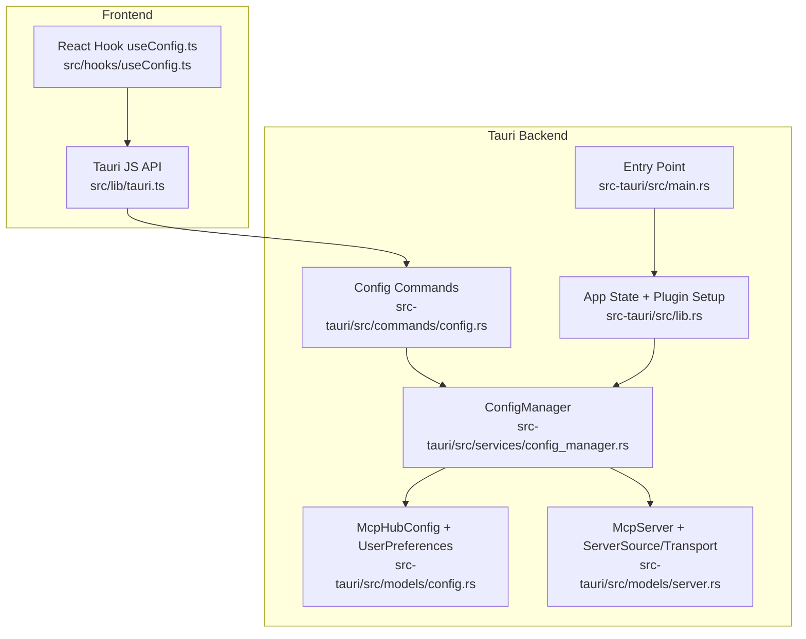
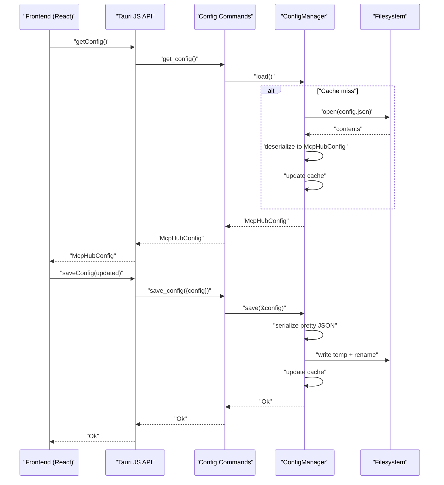
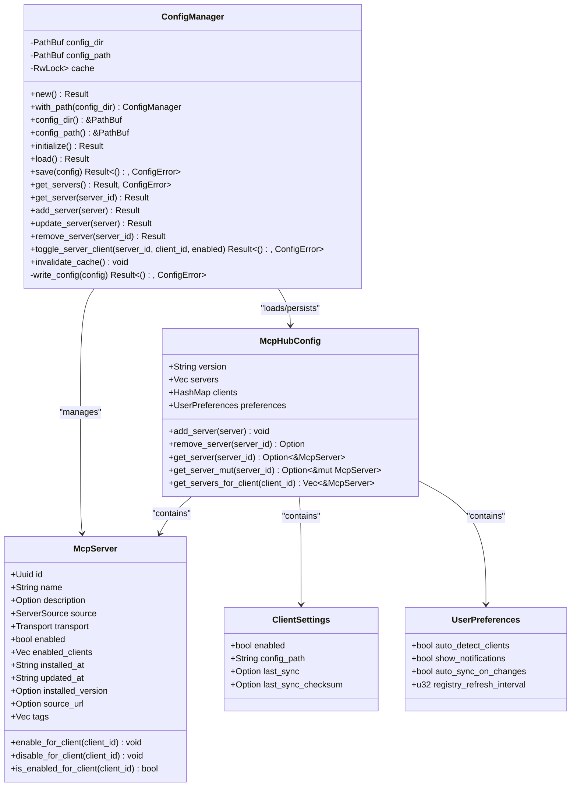
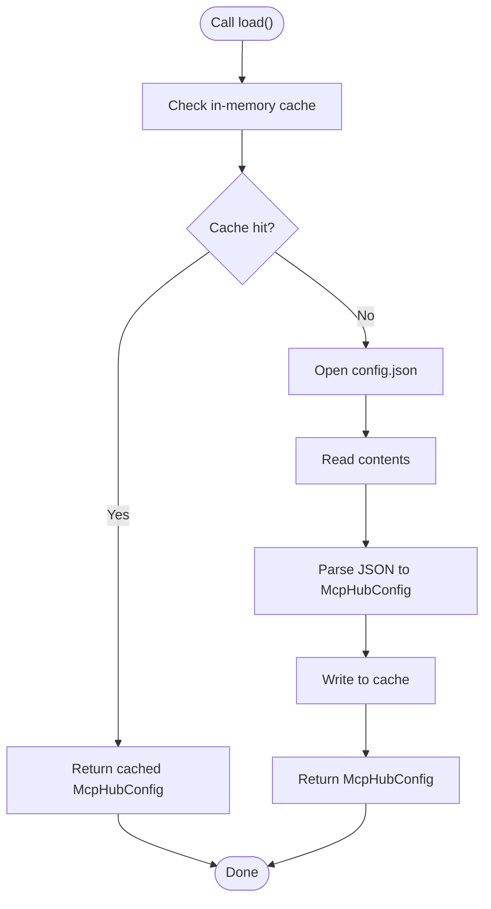
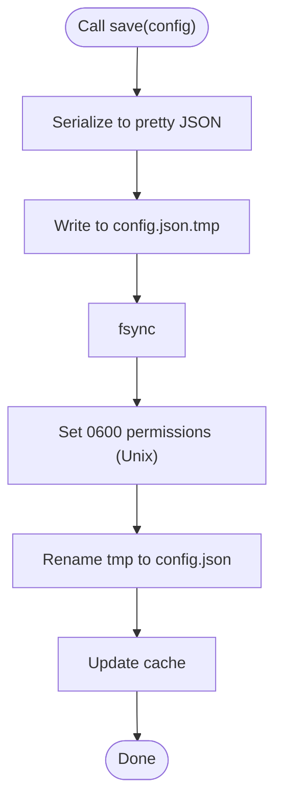
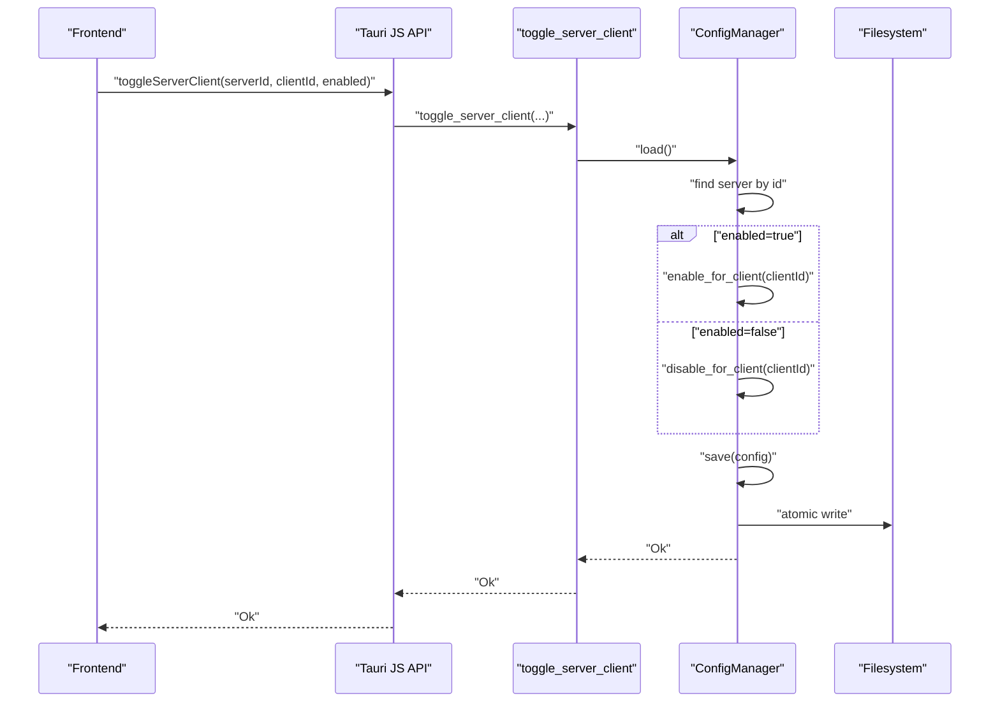
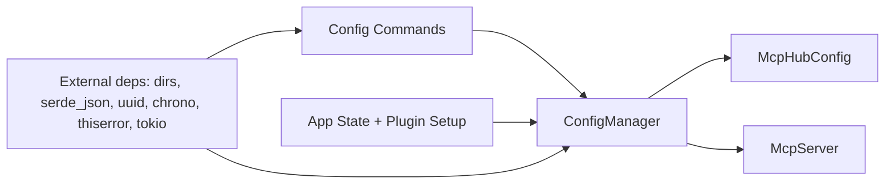

# Config Manager Service

<cite>
**Referenced Files in This Document**
- [config_manager.rs](file://src-tauri/src/services/config_manager.rs)
- [config.rs](file://src-tauri/src/models/config.rs)
- [server.rs](file://src-tauri/src/models/server.rs)
- [client.rs](file://src-tauri/src/models/client.rs)
- [config_commands.rs](file://src-tauri/src/commands/config.rs)
- [lib.rs](file://src-tauri/src/lib.rs)
- [main.rs](file://src-tauri/src/main.rs)
- [tauri.ts](file://src/lib/tauri.ts)
- [useConfig.ts](file://src/hooks/useConfig.ts)
- [Cargo.toml](file://src-tauri/Cargo.toml)
</cite>

## Table of Contents

1. [Introduction](#introduction)
2. [Project Structure](#project-structure)
3. [Core Components](#core-components)
4. [Architecture Overview](#architecture-overview)
5. [Detailed Component Analysis](#detailed-component-analysis)
6. [Dependency Analysis](#dependency-analysis)
7. [Performance Considerations](#performance-considerations)
8. [Troubleshooting Guide](#troubleshooting-guide)
9. [Security Practices](#security-practices)
10. [Conclusion](#conclusion)

## Introduction

This document describes the Config Manager service responsible for managing the central MCP Hub configuration. It covers how configuration is loaded from disk, persisted atomically, validated, and exposed to the frontend via Tauri commands. It also documents the service’s public interface, error handling, and operational behaviors such as first-run initialization, cache invalidation, and client-specific server enablement toggles. Guidance is included for handling common issues like permission errors, file locking scenarios, and invalid configuration values.

## Project Structure

The Config Manager spans Rust backend services and models, Tauri command bindings, and React frontend hooks and invocations.

**Diagram sources**

- [config_manager.rs](file://src-tauri/src/services/config_manager.rs#L1-L233)
- [config.rs](file://src-tauri/src/models/config.rs#L60-L127)
- [server.rs](file://src-tauri/src/models/server.rs#L51-L131)
- [config_commands.rs](file://src-tauri/src/commands/config.rs#L1-L151)
- [lib.rs](file://src-tauri/src/lib.rs#L1-L89)
- [main.rs](file://src-tauri/src/main.rs#L1-L7)
- [tauri.ts](file://src/lib/tauri.ts#L37-L85)
- [useConfig.ts](file://src/hooks/useConfig.ts#L1-L42)

**Section sources**

- [config_manager.rs](file://src-tauri/src/services/config_manager.rs#L1-L233)
- [config.rs](file://src-tauri/src/models/config.rs#L60-L127)
- [server.rs](file://src-tauri/src/models/server.rs#L51-L131)
- [config_commands.rs](file://src-tauri/src/commands/config.rs#L1-L151)
- [lib.rs](file://src-tauri/src/lib.rs#L1-L89)
- [main.rs](file://src-tauri/src/main.rs#L1-L7)
- [tauri.ts](file://src/lib/tauri.ts#L37-L85)
- [useConfig.ts](file://src/hooks/useConfig.ts#L1-L42)

## Core Components

- ConfigManager: Central service that manages the configuration file lifecycle, caching, and CRUD operations for servers and client toggles.
- McpHubConfig: Top-level configuration model including version, servers, client settings, and user preferences.
- McpServer: Server definition with source, transport, and client enablement flags.
- Client settings and preferences: Client-specific toggles and global user preferences.
- Tauri commands: Exposed commands for initialization, load/save, and server operations.
- Frontend integration: JS API and React hook for fetching and updating preferences.

**Section sources**

- [config_manager.rs](file://src-tauri/src/services/config_manager.rs#L22-L233)
- [config.rs](file://src-tauri/src/models/config.rs#L60-L127)
- [server.rs](file://src-tauri/src/models/server.rs#L51-L131)
- [client.rs](file://src-tauri/src/models/client.rs#L1-L113)
- [config_commands.rs](file://src-tauri/src/commands/config.rs#L1-L151)
- [tauri.ts](file://src/lib/tauri.ts#L37-L85)
- [useConfig.ts](file://src/hooks/useConfig.ts#L1-L42)

## Architecture Overview

The Config Manager is initialized at app startup, exposed via Tauri commands, and consumed by the frontend. It uses an in-memory cache to reduce disk reads and performs atomic writes to prevent corruption.

**Diagram sources**

- [config_commands.rs](file://src-tauri/src/commands/config.rs#L58-L74)
- [config_manager.rs](file://src-tauri/src/services/config_manager.rs#L90-L153)
- [tauri.ts](file://src/lib/tauri.ts#L43-L50)

## Detailed Component Analysis

### ConfigManager Implementation

Responsibilities:

- Initialize config directory and default file on first run.
- Load configuration with cache support.
- Persist configuration atomically using a temp file then rename.
- Provide CRUD operations for servers and client enablement toggles.
- Error handling via a dedicated error enum.

Key behaviors:

- First-run detection: returns a boolean indicating whether the directory and default file were created.
- Cache: RwLock<Option<McpHubConfig>> caches the last loaded configuration to minimize disk IO.
- Atomic write: serialize to a temp file, sync to disk, set restrictive permissions, then rename to the target path.
- Permissions: config directory is created with user-only permissions; config file is set to user-only read/write.

Public methods and signatures:

- new() -> Result<ConfigManager, ConfigError>
- with_path(config_dir: PathBuf) -> Self (test-only)
- config_dir() -> &PathBuf
- config_path() -> &PathBuf
- initialize() -> Result<bool, ConfigError>
- load() -> Result<McpHubConfig, ConfigError>
- save(&McpHubConfig) -> Result<(), ConfigError>
- get_servers() -> Result<Vec<McpServer>, ConfigError>
- get_server(&Uuid) -> Result<McpServer, ConfigError>
- add_server(McpServer) -> Result<McpServer, ConfigError>
- update_server(McpServer) -> Result<McpServer, ConfigError>
- remove_server(&Uuid) -> Result<McpServer, ConfigError>
- toggle_server_client(&Uuid, &str, bool) -> Result<(), ConfigError>
- invalidate_cache() -> ()

Error types:

- NoHomeDirectory
- DirectoryCreation(std::io::Error)
- ParseError(serde_json::Error)
- ServerNotFound(Uuid)

Operational notes:

- Cache invalidation forces reload on next read.
- Server operations load, mutate, save, and update cache.
- Client enablement toggles are stored on McpServer and persisted atomically.

**Section sources**

- [config_manager.rs](file://src-tauri/src/services/config_manager.rs#L1-L233)

#### Class Diagram: ConfigManager and Models

**Diagram sources**

- [config_manager.rs](file://src-tauri/src/services/config_manager.rs#L22-L233)
- [config.rs](file://src-tauri/src/models/config.rs#L60-L127)
- [server.rs](file://src-tauri/src/models/server.rs#L51-L131)
- [client.rs](file://src-tauri/src/models/client.rs#L1-L113)

### Tauri Commands and Frontend Integration

- Commands:
  - initialize_config -> InitResult { first_run, config_dir, config_path }
  - get_config -> McpHubConfig
  - save_config(config: McpHubConfig) -> ()
  - get_servers -> Vec<McpServer>
  - get_server(serverId: string) -> McpServer
  - add_server(server: McpServer) -> McpServer
  - update_server(server: McpServer) -> McpServer
  - remove_server(serverId: string) -> McpServer
  - toggle_server_client(serverId: string, clientId: string, enabled: bool) -> ()

- Frontend:
  - JS API exposes invoke wrappers for each command.
  - React hook useConfig fetches McpHubConfig and caches it locally with a stale time.
  - useUpdatePreferences updates only user preferences and saves the full config.

Example usage references:

- Frontend invocation paths:
  - [initializeConfig](file://src/lib/tauri.ts#L37-L41)
  - [getConfig](file://src/lib/tauri.ts#L42-L46)
  - [saveConfig](file://src/lib/tauri.ts#L47-L50)
  - [getServers](file://src/lib/tauri.ts#L52-L55)
  - [getServer](file://src/lib/tauri.ts#L56-L61)
  - [addServer](file://src/lib/tauri.ts#L62-L66)
  - [updateServer](file://src/lib/tauri.ts#L67-L71)
  - [removeServer](file://src/lib/tauri.ts#L72-L75)
  - [toggleServerClient](file://src/lib/tauri.ts#L76-L85)
- React hook:
  - [useConfig](file://src/hooks/useConfig.ts#L1-L13)
  - [useUpdatePreferences](file://src/hooks/useConfig.ts#L15-L40)

**Section sources**

- [config_commands.rs](file://src-tauri/src/commands/config.rs#L1-L151)
- [tauri.ts](file://src/lib/tauri.ts#L37-L85)
- [useConfig.ts](file://src/hooks/useConfig.ts#L1-L42)

### Data Model Details

- McpHubConfig:
  - version: string for migrations.
  - servers: vector of McpServer entries.
  - clients: map of client identifiers to ClientSettings.
  - preferences: UserPreferences controlling auto-detection, notifications, auto-sync, and registry refresh interval.
- McpServer:
  - id, name, description, source, transport, enabled flag, enabled_clients list, timestamps, optional version/source URL/tags.
  - Methods to enable/disable for a given client and to check enablement.
- ClientSettings:
  - enabled flag, resolved config path, last sync timestamp and checksum, used for conflict detection and status tracking.
- UserPreferences:
  - Defaults ensure sensible behavior out-of-the-box.

Validation and defaults:

- Serde derives handle deserialization with defaults for booleans and numeric fields.
- Missing fields deserialize to defaults automatically.

**Section sources**

- [config.rs](file://src-tauri/src/models/config.rs#L60-L127)
- [server.rs](file://src-tauri/src/models/server.rs#L51-L131)
- [client.rs](file://src-tauri/src/models/client.rs#L1-L113)

### Configuration Lifecycle and Migration

- Initialization:
  - Creates ~/.mcp-nexus directory with user-only permissions.
  - Creates default config.json with version "1.0" and empty lists.
  - Returns first_run indicator if either directory or file was created.
- Persistence:
  - Atomic write pattern: serialize to config.json.tmp, sync, set permissions, rename to config.json.
  - Ensures no partial writes remain on failure.
- Versioning:
  - version field present in McpHubConfig; tests demonstrate default "1.0".
  - Migration logic is not implemented in the current code; future migrations would require reading version and applying transformations before saving.

**Section sources**

- [config_manager.rs](file://src-tauri/src/services/config_manager.rs#L64-L153)
- [config.rs](file://src-tauri/src/models/config.rs#L77-L86)

### Error Handling and Recovery

- ConfigError variants:
  - NoHomeDirectory: home directory not resolvable.
  - DirectoryCreation: failed to create config directory.
  - ParseError: JSON parse failure.
  - ServerNotFound(Uuid): attempted operation on non-existent server.
- Recovery strategies:
  - On parse error, the file is likely corrupted; user should restore from backup or re-initialize.
  - On permission errors, adjust directory/file permissions to user-only read/write.
  - On missing home directory, fix environment or run under a valid user profile.
  - Server not found errors indicate stale IDs; refresh UI and retry.

**Section sources**

- [config_manager.rs](file://src-tauri/src/services/config_manager.rs#L10-L21)

### Example Workflows

#### Load Configuration

**Diagram sources**

- [config_manager.rs](file://src-tauri/src/services/config_manager.rs#L90-L114)

#### Save Configuration (Atomic Write)

**Diagram sources**

- [config_manager.rs](file://src-tauri/src/services/config_manager.rs#L129-L153)

#### Toggle Server for a Client

**Diagram sources**

- [config_commands.rs](file://src-tauri/src/commands/config.rs#L134-L151)
- [config_manager.rs](file://src-tauri/src/services/config_manager.rs#L212-L233)
- [server.rs](file://src-tauri/src/models/server.rs#L112-L131)

## Dependency Analysis

- Internal dependencies:
  - ConfigManager depends on McpHubConfig and McpServer models.
  - Commands depend on ConfigManager and expose typed results/errors.
  - App state holds a managed ConfigManager instance.
- External dependencies:
  - dirs for platform-specific home directory resolution.
  - serde_json for serialization/deserialization.
  - uuid for server identity.
  - chrono for timestamps.
  - thiserror for error handling.
  - tokio RwLock for cache synchronization.

**Diagram sources**

- [config_manager.rs](file://src-tauri/src/services/config_manager.rs#L1-L233)
- [config_commands.rs](file://src-tauri/src/commands/config.rs#L1-L151)
- [lib.rs](file://src-tauri/src/lib.rs#L1-L89)
- [Cargo.toml](file://src-tauri/Cargo.toml#L20-L33)

**Section sources**

- [Cargo.toml](file://src-tauri/Cargo.toml#L20-L33)
- [lib.rs](file://src-tauri/src/lib.rs#L1-L89)

## Performance Considerations

- Caching: The ConfigManager caches the loaded configuration in memory to avoid repeated disk reads. Use invalidate_cache() when external modifications occur.
- Stale-time: The frontend hook sets a stale time for config queries to balance freshness and performance.
- Atomic writes: Reduce risk of partial writes and improve durability; ensure sufficient disk space and avoid slow network filesystems.
- Serialization: Pretty-printed JSON improves readability but increases file size; consider compact serialization if storage is constrained.
- Concurrency: RwLock protects cache access; keep operations short to minimize contention.

[No sources needed since this section provides general guidance]

## Troubleshooting Guide

Common issues and resolutions:

- Permission errors:
  - Ensure the config directory (~/.mcp-nexus) and config file have user-only permissions. On Unix-like systems, the service sets 0700 for the directory and 0600 for the file during initialization and writes.
  - If permissions are incorrect, reset them to user-only read/write.
- File locking:
  - The service opens the file in exclusive mode and uses atomic rename. Avoid concurrent writers; if conflicts arise, ensure only one process writes at a time.
- Corrupted configuration:
  - If JSON parse fails, the file is likely corrupted. Restore from a known-good backup or re-initialize the configuration.
- Invalid server IDs:
  - Operations requiring a server ID will fail if the ID is malformed or refers to a non-existent server. Refresh UI and confirm IDs.
- First-run not detected:
  - Verify the home directory is resolvable and the config directory/file exist. Re-run initialization if needed.

**Section sources**

- [config_manager.rs](file://src-tauri/src/services/config_manager.rs#L64-L153)
- [config_manager.rs](file://src-tauri/src/services/config_manager.rs#L10-L21)

## Security Practices

- File permissions:
  - Config directory: 0700 (user-only).
  - Config file: 0600 (user-only read/write).
- Atomic writes:
  - Temporary file plus rename prevents partial writes and reduces exposure to corruption.
- Secrets handling:
  - Credentials are stored via the keyring plugin; sensitive values are not persisted in the configuration file.
- Principle of least privilege:
  - Restrict file permissions and avoid storing secrets in plain text.

**Section sources**

- [config_manager.rs](file://src-tauri/src/services/config_manager.rs#L68-L153)
- [Cargo.toml](file://src-tauri/Cargo.toml#L20-L33)

## Conclusion

The Config Manager provides a robust, secure, and efficient mechanism for managing the MCP Hub configuration. It initializes defaults, persists atomically, validates inputs, and exposes a clear API to the frontend. With caching and atomic writes, it balances performance and reliability. Proper error handling and strict file permissions help maintain data integrity and security.
